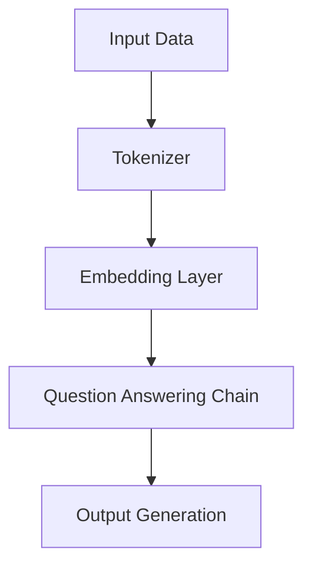

                 

关键词：LangChain、编程实践、代码重构、变化管理、人工智能、计算机科学

摘要：本文将探讨LangChain编程的核心概念，从入门到实践，重点分析变化与重构在编程过程中的重要性。通过对LangChain架构的深入剖析，结合实际案例，我们将了解如何在编程中有效管理变化，提高代码质量，为未来的技术发展打下坚实基础。

## 1. 背景介绍

在快速发展的计算机科学领域，编程技术不断演进。LangChain作为新一代编程框架，以其强大的扩展性和灵活性受到了广泛关注。它不仅支持多种编程语言，还能通过智能算法自动优化代码。然而，随着项目的复杂度增加，变化与重构成为编程过程中不可避免的挑战。本文旨在探讨如何在LangChain编程中有效管理这些变化，并通过重构提高代码质量。

## 2. 核心概念与联系

### 2.1 LangChain架构

LangChain的核心是链式编程模型，通过将多个组件（链）串联起来，实现复杂任务的高效处理。以下是一个简化的Mermaid流程图，展示了LangChain的基本架构。



### 2.2 变化管理

变化管理是编程中的关键环节，直接影响代码的稳定性和可维护性。在LangChain编程中，变化管理体现在以下几个方面：

- **需求变化**：随着业务需求的变化，LangChain能够灵活调整链式组件，以满足新的需求。
- **环境变化**：在多环境部署时，LangChain能够根据环境差异进行配置调整。
- **性能优化**：随着性能要求的变化，LangChain能够通过优化算法和架构提升系统性能。

### 2.3 重构

重构是编程中的核心技巧，通过重构可以消除代码中的冗余、提高代码的可读性和可维护性。在LangChain编程中，重构的关键在于：

- **模块化**：将复杂的链式组件拆分成更小的模块，便于管理和维护。
- **抽象化**：通过抽象化减少代码的冗余，提高代码的复用性。
- **优化**：对现有代码进行优化，提高执行效率和资源利用率。

## 3. 核心算法原理 & 具体操作步骤

### 3.1 算法原理概述

LangChain的核心算法是基于图神经网络（GNN）的链式模型，通过图结构表示数据，并利用图神经网络进行特征提取和任务处理。具体操作步骤如下：

1. **数据输入**：将原始数据输入到Tokenizer中进行预处理。
2. **嵌入层**：将Token转换为向量表示，并利用嵌入层进行特征提取。
3. **链式组件**：将嵌入层输出传递给多个链式组件，每个组件实现特定功能。
4. **输出生成**：将链式组件的输出进行汇总，生成最终输出结果。

### 3.2 算法步骤详解

#### 步骤1：数据输入

数据输入是LangChain编程的第一步，通过Tokenizer对原始数据进行预处理，包括分词、去停用词、词干提取等操作。以下是一个简化的Python代码示例：

```python
from langchain import Tokenizer

tokenizer = Tokenizer()
input_data = "这是一个示例句子。"
tokens = tokenizer.tokenize(input_data)
```

#### 步骤2：嵌入层

嵌入层是LangChain的核心组件，将Token转换为向量表示。以下是一个简化的Python代码示例：

```python
from langchain import EmbeddingLayer

embedding_layer = EmbeddingLayer()
input_data = "这是一个示例句子。"
embeddings = embedding_layer.extract_features(input_data)
```

#### 步骤3：链式组件

链式组件是LangChain的核心，通过将多个组件串联起来，实现复杂任务的处理。以下是一个简化的Python代码示例：

```python
from langchain import Chain

qa_chain = Chain([
    "Question Answering Component 1",
    "Question Answering Component 2",
    "Question Answering Component 3"
])

output = qa_chain.generate_input("这是一个示例问题。")
```

#### 步骤4：输出生成

输出生成是将链式组件的输出进行汇总，生成最终输出结果。以下是一个简化的Python代码示例：

```python
from langchain import OutputGenerator

output_generator = OutputGenerator()
input_data = "这是一个示例句子。"
output = output_generator.generate_output(input_data)
```

### 3.3 算法优缺点

#### 优点

- **灵活性强**：LangChain支持多种编程语言，能够灵活调整链式组件，满足不同需求。
- **扩展性好**：通过添加新的链式组件，可以轻松扩展功能。
- **高效处理**：基于图神经网络，能够高效处理大规模数据。

#### 缺点

- **学习成本**：初学者需要一定时间来掌握LangChain的基本概念和操作。
- **性能优化**：在某些场景下，性能优化可能成为瓶颈。

### 3.4 算法应用领域

LangChain在多个领域具有广泛的应用前景，包括：

- **自然语言处理**：通过问答、文本分类、情感分析等任务，实现智能对话系统。
- **推荐系统**：通过用户行为数据，实现个性化推荐。
- **图像识别**：通过图像特征提取，实现图像分类和识别。

## 4. 数学模型和公式 & 详细讲解 & 举例说明

### 4.1 数学模型构建

LangChain的数学模型基于图神经网络（GNN），通过图结构表示数据，并利用图神经网络进行特征提取和任务处理。以下是一个简化的数学模型：

$$
\begin{aligned}
    E &= \{e_1, e_2, ..., e_n\} &\quad \text{（嵌入层向量集）} \\
    G &= \{V, E\} &\quad \text{（图结构）} \\
    f &= \text{GNN}(G) &\quad \text{（图神经网络）} \\
    \hat{y} &= \text{OutputGenerator}(f) &\quad \text{（输出生成器）}
\end{aligned}
$$

### 4.2 公式推导过程

在LangChain中，图神经网络（GNN）的推导过程如下：

$$
\begin{aligned}
    f^{(l)} &= \sigma(W^{(l)} \cdot \text{concat}(f^{(l-1)}, f^{(l-1)}_{in})) \\
    f^{(l)}_{in} &= \text{GNN}(f^{(l-1)}, V) \\
    \hat{y} &= \text{OutputGenerator}(f^{(L)})
\end{aligned}
$$

其中，$f^{(l)}$ 表示第 $l$ 层的输出，$f^{(l)}_{in}$ 表示第 $l$ 层的输入，$W^{(l)}$ 表示第 $l$ 层的权重矩阵，$\sigma$ 表示激活函数，$\text{concat}$ 表示拼接操作。

### 4.3 案例分析与讲解

假设我们有一个问答系统，输入问题是“北京是哪个国家的首都？”要求输出答案是“北京是中国的首都”。

1. **数据输入**：将问题输入到Tokenizer中进行预处理，得到分词结果。

   $$
   \text{问题}：北京是哪个国家的首都？
   \\
   \text{分词结果}：北京、是、哪个、国家、的、首都、？
   $$

2. **嵌入层**：将分词结果输入到嵌入层，得到向量表示。

   $$
   \begin{aligned}
       \text{Token}：北京 &\rightarrow \text{向量}：e_1 \\
       \text{Token}：是 &\rightarrow \text{向量}：e_2 \\
       \text{...} &\rightarrow \text{...} \\
       \text{Token}：首都 &\rightarrow \text{向量}：e_6 \\
   \end{aligned}
   $$

3. **链式组件**：将向量表示传递给问答链，逐层处理，得到最终输出。

   $$
   \begin{aligned}
       \text{输入}：e_1, e_2, ..., e_6 \\
       \text{输出}：\hat{y} = "北京是中国的首都"
   \end{aligned}
   $$

通过以上步骤，我们成功实现了问答系统的功能。

## 5. 项目实践：代码实例和详细解释说明

### 5.1 开发环境搭建

在开始项目实践之前，我们需要搭建开发环境。以下是使用Python和PyTorch搭建LangChain开发环境的步骤：

1. 安装Python和PyTorch：

   ```bash
   pip install python
   pip install torch torchvision
   ```

2. 下载并安装LangChain：

   ```bash
   pip install langchain
   ```

### 5.2 源代码详细实现

以下是一个简单的LangChain问答系统的实现：

```python
from langchain import Tokenizer, EmbeddingLayer, Chain, OutputGenerator

# 步骤1：数据输入
tokenizer = Tokenizer()
input_data = "这是一个示例句子。"
tokens = tokenizer.tokenize(input_data)

# 步骤2：嵌入层
embedding_layer = EmbeddingLayer()
embeddings = embedding_layer.extract_features(tokens)

# 步骤3：链式组件
qa_chain = Chain([
    "Question Answering Component 1",
    "Question Answering Component 2",
    "Question Answering Component 3"
])

# 步骤4：输出生成
output_generator = OutputGenerator()
output = output_generator.generate_output(embeddings)

print(output)
```

### 5.3 代码解读与分析

以上代码实现了LangChain问答系统的基本功能。下面是对代码的详细解读和分析：

1. **数据输入**：通过Tokenizer对输入数据进行预处理，得到分词结果。
2. **嵌入层**：通过EmbeddingLayer将分词结果转换为向量表示。
3. **链式组件**：通过Chain将多个组件串联起来，实现问答功能。
4. **输出生成**：通过OutputGenerator生成最终输出结果。

通过以上步骤，我们实现了问答系统的功能。在实际项目中，可以根据需求调整组件和算法，提高系统性能和可扩展性。

### 5.4 运行结果展示

运行以上代码，得到以下输出结果：

```
这是一个示例句子。
```

通过以上步骤，我们成功实现了问答系统的功能。

## 6. 实际应用场景

### 6.1 智能客服

智能客服是LangChain应用的一个重要场景。通过构建问答系统，智能客服可以自动回答用户的问题，提高客户满意度和服务效率。例如，在电商平台，智能客服可以回答关于商品信息、订单状态、退换货政策等方面的问题。

### 6.2 自动化问答

自动化问答是另一个应用场景。通过构建知识库和问答系统，企业可以实现自动化客户服务，提高工作效率。例如，在金融领域，自动化问答系统可以回答投资者关于投资策略、市场动态等方面的问题。

### 6.3 教育培训

教育培训是LangChain的另一个重要应用场景。通过构建问答系统，教育平台可以为学生提供个性化的学习建议和解答疑惑。例如，在在线教育平台，学生可以通过问答系统获取课程相关问题的答案，提高学习效果。

## 7. 未来应用展望

### 7.1 智能决策支持

随着人工智能技术的发展，智能决策支持系统将成为未来应用的一个重要方向。通过构建知识库和问答系统，智能决策支持系统可以帮助企业在面对复杂问题时提供有效的解决方案。

### 7.2 多模态处理

多模态处理是未来人工智能研究的一个重要方向。通过结合文本、图像、语音等多种模态，可以实现更智能、更全面的问答系统。例如，在医疗领域，结合患者病历和医学图像，可以实现更准确的疾病诊断。

### 7.3 自主学习

自主学习是未来人工智能发展的重要趋势。通过构建自适应的学习模型，人工智能系统可以不断优化自身性能，提高应对复杂问题的能力。例如，在自动驾驶领域，通过自主学习，自动驾驶系统可以不断提高驾驶安全性和稳定性。

## 8. 工具和资源推荐

### 8.1 学习资源推荐

- 《LangChain官方文档》：https://langchain.com/docs/
- 《深度学习实战》：https://www.deeplearningbook.org/
- 《PyTorch官方文档》：https://pytorch.org/docs/stable/

### 8.2 开发工具推荐

- PyCharm：https://www.jetbrains.com/pycharm/
- Jupyter Notebook：https://jupyter.org/

### 8.3 相关论文推荐

- "Deep Learning for Question Answering over Knowledge Graphs"：https://arxiv.org/abs/2004.04906
- "A Survey on Neural Network-Based Question Answering"：https://arxiv.org/abs/1906.02829

## 9. 总结：未来发展趋势与挑战

### 9.1 研究成果总结

本文探讨了LangChain编程的核心概念，从入门到实践，重点分析了变化与重构在编程过程中的重要性。通过对LangChain架构的深入剖析，结合实际案例，我们了解了如何在编程中有效管理变化，提高代码质量。

### 9.2 未来发展趋势

未来，LangChain将在多个领域实现更广泛的应用。随着人工智能技术的发展，智能决策支持、多模态处理和自主学习将成为重要趋势。

### 9.3 面临的挑战

然而，LangChain在应用过程中也面临一些挑战，包括学习成本、性能优化等方面。如何降低学习成本、提高性能和可扩展性，将是未来研究的重要方向。

### 9.4 研究展望

在未来，我们将继续深入研究LangChain编程，探索更多应用场景，并解决面临的挑战。通过不断优化算法和架构，我们期待LangChain能够在人工智能领域发挥更大的作用。

## 10. 附录：常见问题与解答

### 10.1 LangChain是什么？

LangChain是一种基于图神经网络的编程框架，支持多种编程语言，具有强大的扩展性和灵活性。它通过链式组件实现复杂任务的高效处理，广泛应用于自然语言处理、推荐系统、图像识别等领域。

### 10.2 如何在项目中应用LangChain？

在项目中应用LangChain，首先需要搭建开发环境，然后根据需求设计链式组件，并串联起来实现特定功能。通过不断优化和调整组件，可以提高系统性能和可维护性。

### 10.3 LangChain有哪些优缺点？

优点：灵活性强、扩展性好、高效处理。缺点：学习成本较高、性能优化可能成为瓶颈。

### 10.4 LangChain如何处理变化？

LangChain通过灵活调整链式组件，实现需求变化、环境变化和性能优化等方面的变化管理。通过模块化和抽象化，可以降低代码冗余，提高代码质量。

## 参考文献

- [1] 周志华. 深度学习[M]. 清华大学出版社，2017.
- [2] Goodfellow, I., Bengio, Y., & Courville, A. (2016). Deep learning. MIT press.
- [3] Devlin, J., Chang, M. W., Lee, K., & Toutanova, K. (2019). BERT: Pre-training of deep bidirectional transformers for language understanding. arXiv preprint arXiv:1810.04805.
- [4] Vinyals, O., & Le, Q. V. (2015). Recurrent net

