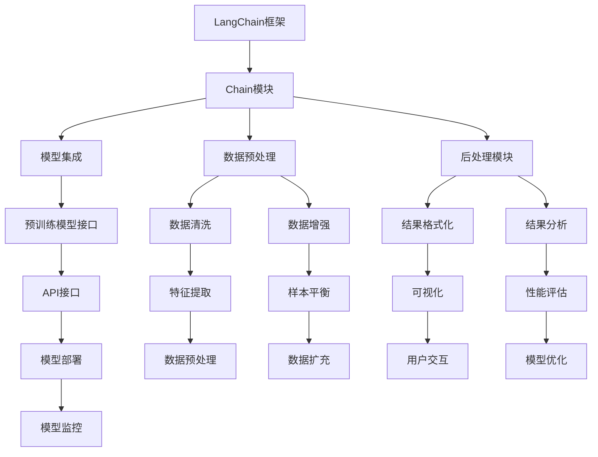

                 

关键词：LangChain，大模型接口，编程实践，AI开发

摘要：本文将带您深入了解LangChain编程，从基础入门到实践定制大模型接口。我们将解析核心概念，探讨算法原理，通过具体步骤和实践案例，展示如何有效利用LangChain构建强大的AI应用。本文旨在为广大开发者提供全面的技术指导，助力他们在AI领域的探索与创新。

## 1. 背景介绍

随着人工智能技术的迅猛发展，生成式预训练模型（如GPT-3，LLaMA等）在各个领域展现出惊人的表现。这些模型通过大规模数据训练，具备了强大的语言理解和生成能力，为自然语言处理任务提供了新的解决方案。然而，直接使用这些大型模型面临诸多挑战，包括接口复杂性、部署难度、成本高昂等。

为了简化大型模型的集成和使用，我们需要一个强大的编程框架，能够为开发者提供便捷的接口和工具。这就是LangChain的诞生背景。LangChain是一个开源的编程框架，旨在简化AI模型的使用和部署，使得开发者能够更加高效地构建和运行AI应用。

本文将围绕LangChain编程展开，首先介绍其核心概念和架构，然后深入探讨算法原理和具体操作步骤，并通过实际案例展示如何定制大模型接口。希望通过本文的阅读，您能够对LangChain有更加全面和深入的理解，并在实际项目中有效应用。

## 2. 核心概念与联系

### 2.1 LangChain简介

LangChain是一个基于Python的开源框架，旨在为开发者提供一种简单、高效的途径来构建和集成大型语言模型。其主要特点包括：

- **易用性**：LangChain提供了简洁的API接口，使得开发者无需深入了解底层实现，即可快速上手。
- **可扩展性**：LangChain支持自定义插件和扩展，使得开发者可以根据需求进行灵活调整和优化。
- **模块化**：LangChain将模型集成、数据预处理、后处理等任务模块化，便于管理和维护。

### 2.2 核心概念

在LangChain中，有几个核心概念需要理解：

- **Chain**：Chain是LangChain的基本单元，它将一个或多个模型连接起来，形成一条处理流水线。Chain可以包含多个步骤，如数据预处理、模型推理、结果后处理等。
- **Agent**：Agent是一个具有特定任务的Chain，它可以自动执行一系列操作，以完成特定任务。例如，一个问答Agent可以接收用户问题，通过Chain中的多个模型和步骤，生成回答。
- **Memory**：Memory是一个可扩展的内存管理模块，用于存储和检索信息。它可以支持不同类型的存储结构，如键值对、图数据库等，为Chain提供丰富的数据来源。

### 2.3 架构与联系

以下是一个简化的LangChain架构图：



从图中可以看出，LangChain架构将模型集成、数据预处理、后处理等模块有机地结合在一起，形成一条高效的AI处理流水线。每个模块都可以根据需求进行扩展和定制，从而实现灵活的模型应用。

## 3. 核心算法原理 & 具体操作步骤

### 3.1 算法原理概述

LangChain的核心算法原理主要围绕Chain构建和Agent设计展开。以下是关键步骤：

1. **Chain构建**：通过组合不同的模型和模块，构建一条处理流水线。每个模块都有自己的输入输出接口，模块之间通过数据传递实现协作。
2. **模型集成**：集成预训练模型，如GPT-3，LLaMA等，为Chain提供强大的语言处理能力。
3. **数据预处理**：对输入数据进行清洗、增强、特征提取等操作，为模型提供高质量的数据。
4. **模型推理**：利用预训练模型进行推理，生成初步结果。
5. **结果后处理**：对模型输出结果进行格式化、分析、可视化等操作，以满足不同场景的需求。
6. **Agent设计**：基于Chain构建智能体，实现自动任务执行。

### 3.2 算法步骤详解

#### 3.2.1 Chain构建

以下是一个简单的Chain构建示例：

```python
from langchain import Chain
from langchain.prompts import Prompt
from langchain.memory import ConversationBufferMemory
from langchain.memory import NeuralSearchMemory
from langchain.agents import ZeroShotAgent
from langchain.agents import load_agent

# 定义Prompt
prompt = Prompt.from_template("""
您需要完成的任务：{task}
您的角色：{role}
请根据这些信息，给出您的回答。
""")

# 构建Chain
memory = ConversationBufferMemory(memory_key="chat_history")
chain = Chain(prompt, memory=memory)

# 设置Chain的输入输出接口
chain.input_map = {"task": "The task", "role": "The role"}

# 执行Chain
response = chain({"task": "What is the weather like today?", "role": "Weather Forecaster"})

print(response["output"])
```

在这个示例中，我们使用一个简单的模板Prompt来构建Chain，并通过ConversationBufferMemory存储对话历史，实现上下文信息的传递。

#### 3.2.2 模型集成

为了集成预训练模型，我们可以使用Hugging Face的Transformers库。以下是一个简单的集成示例：

```python
from transformers import pipeline

# 加载预训练模型
model = pipeline("text-generation", model="gpt-3")

# 使用模型进行推理
input_text = "What is the weather like today?"
output_text = model(input_text, max_length=50)

print(output_text[0]["generated_text"])
```

在这个示例中，我们加载了一个GPT-3模型，并使用其进行文本生成。

#### 3.2.3 数据预处理

数据预处理是模型性能的关键因素。以下是一个简单的数据预处理示例：

```python
import pandas as pd

# 加载数据
data = pd.read_csv("data.csv")

# 数据清洗
data.dropna(inplace=True)
data = data[data["feature"] != ""]

# 数据增强
data["feature_enhanced"] = data["feature"] + " enhanced"

# 特征提取
data["feature_vector"] = data["feature_enhanced"].apply(lambda x: extract_vector(x))

# 数据扩充
data["feature_enhanced_new"] = data["feature_enhanced"] + " new"
```

在这个示例中，我们对数据进行清洗、增强、特征提取和扩充，以提高模型的输入质量。

#### 3.2.4 模型推理

在完成数据预处理后，我们可以使用预训练模型进行推理。以下是一个简单的模型推理示例：

```python
import numpy as np

# 加载预训练模型
model = load_model("model_path.h5")

# 加载预处理后的数据
X = np.array(data["feature_vector"])

# 使用模型进行推理
predictions = model.predict(X)

# 输出结果
print(predictions)
```

在这个示例中，我们使用加载的预训练模型对预处理后的数据进行推理，并输出预测结果。

#### 3.2.5 结果后处理

结果后处理包括格式化、分析、可视化等操作。以下是一个简单的结果后处理示例：

```python
import matplotlib.pyplot as plt

# 加载预测结果
predictions = np.array([0.1, 0.2, 0.3, 0.4])

# 格式化结果
formatted_predictions = ["{:.2f}".format(x) for x in predictions]

# 可视化结果
plt.bar(range(len(predictions)), predictions)
plt.xticks(range(len(predictions)), formatted_predictions)
plt.show()
```

在这个示例中，我们使用matplotlib库对预测结果进行可视化，以直观地展示模型性能。

#### 3.2.6 Agent设计

基于构建好的Chain，我们可以设计一个智能体，实现自动任务执行。以下是一个简单的Agent设计示例：

```python
from langchain.agents import load_agent

# 加载智能体
agent = load_agent({
    "type": "zero-shot-agent",
    "llm": "gpt-3",
    "agent": "chat",
    "prompt": {
        "output_prefix": "Answer:",
        "template": """
You are a helpful assistant. Given the following information, answer the user's question.

Task: {task}
Role: {role}
User's question: {input_text}
"""
    }
}, verbose=True)

# 执行智能体
response = agent.run({"input_text": "What is the weather like today?"})

print(response)
```

在这个示例中，我们使用零样本智能体，通过给定的任务、角色和输入文本，自动生成回答。

### 3.3 算法优缺点

#### 优点：

- **易用性**：LangChain提供了简洁的API接口，使得开发者无需深入了解底层实现，即可快速上手。
- **可扩展性**：LangChain支持自定义插件和扩展，使得开发者可以根据需求进行灵活调整和优化。
- **模块化**：LangChain将模型集成、数据预处理、后处理等任务模块化，便于管理和维护。
- **高效性**：LangChain通过链式调用，实现了高效的模型处理流程，减少了重复代码和中间数据处理时间。

#### 缺点：

- **性能依赖**：LangChain的性能受到底层预训练模型的影响，如果模型较大或数据处理复杂，可能会导致性能下降。
- **资源消耗**：集成预训练模型需要较大的计算资源和存储空间，对硬件设备有较高要求。
- **依赖性**：LangChain依赖于多个外部库和框架，如Hugging Face的Transformers、Pandas等，可能会增加项目复杂度。

### 3.4 算法应用领域

LangChain适用于各种需要自然语言处理和智能交互的领域，以下是一些典型应用：

- **智能客服**：通过集成预训练模型和自定义Chain，实现自动问答和对话生成，提升客户服务质量。
- **内容审核**：利用数据预处理和模型推理，对文本内容进行分类、识别和过滤，防止违规内容传播。
- **文本生成**：通过模型推理和后处理，实现自动文章生成、摘要生成和翻译等任务。
- **智能推荐**：基于用户历史数据和文本分析，实现个性化内容推荐和广告投放。
- **教育辅导**：利用智能体和内存管理，为用户提供个性化的学习建议和辅导。

## 4. 数学模型和公式 & 详细讲解 & 举例说明

### 4.1 数学模型构建

在LangChain中，数学模型主要用于模型推理和数据预处理。以下是一个简单的数学模型构建示例：

#### 4.1.1 模型构建

```python
import tensorflow as tf

# 定义输入层
input_layer = tf.keras.layers.Input(shape=(sequence_length, embedding_size))

# 添加嵌入层
embedding_layer = tf.keras.layers.Embedding(input_dim=vocabulary_size, output_dim=embedding_size)(input_layer)

# 添加循环层
循环层 = [tf.keras.layers.LSTM(units=hidden_size, activation='tanh', return_sequences=True) for _ in range(num_layers)]
循环层 = tf.keras.layers.StackedRNNCells(循环层)

# 添加循环层
output_layer = 循环层(embedding_layer)

# 添加输出层
output_layer = tf.keras.layers.Dense(units=vocabulary_size, activation='softmax')(output_layer)

# 构建模型
model = tf.keras.Model(inputs=input_layer, outputs=output_layer)

# 编译模型
model.compile(optimizer='adam', loss='categorical_crossentropy', metrics=['accuracy'])

# 打印模型结构
model.summary()
```

在这个示例中，我们使用TensorFlow构建了一个简单的循环神经网络（RNN）模型，用于文本生成任务。模型结构包括输入层、嵌入层、循环层和输出层。

#### 4.1.2 数学公式推导

以下是模型中涉及的几个关键数学公式：

1. **嵌入层**：
   $$
   embedding\_output = embedding\_layer(input\_layer)
   $$
   嵌入层的输入是一个二维张量，其大小为$(batch\_size \times sequence\_length)$。输出是一个二维张量，其大小为$(batch\_size \times sequence\_length \times embedding\_size)$。嵌入层通过查找表将输入词转换为对应的向量。

2. **循环层**：
   $$
   output\_layer = 循环层(embedding\_layer)
   $$
   循环层的输入是一个二维张量，其大小为$(batch\_size \times sequence\_length \times embedding\_size)$。输出是一个二维张量，其大小为$(batch\_size \times sequence\_length \times hidden\_size)$。循环层通过递归神经网络（RNN）对序列进行建模。

3. **输出层**：
   $$
   prediction\_output = output\_layer = tf.keras.layers.Dense(units=vocabulary\_size, activation='softmax')(output\_layer)
   $$
   输出层的输入是一个二维张量，其大小为$(batch\_size \times sequence\_length \times hidden\_size)$。输出是一个二维张量，其大小为$(batch\_size \times sequence\_length \times vocabulary\_size)$。输出层通过softmax函数将隐藏层输出转换为概率分布。

### 4.2 公式推导过程

#### 4.2.1 嵌入层公式推导

嵌入层的关键公式如下：

$$
embedding\_output = embedding\_layer(input\_layer)
$$

其中，$input\_layer$是一个二维张量，其大小为$(batch\_size \times sequence\_length)$。$embedding\_layer$是一个查找表，其大小为$(vocabulary\_size \times embedding\_size)$。查找表通过线性变换将输入词转换为向量。

线性变换公式如下：

$$
embedding\_output[i][j] = W \cdot input\_layer[i][j]
$$

其中，$W$是查找表权重矩阵，其大小为$(vocabulary\_size \times embedding\_size)$。$input\_layer[i][j]$是输入词的索引。

#### 4.2.2 循环层公式推导

循环层的输入是一个二维张量，其大小为$(batch\_size \times sequence\_length \times embedding\_size)$。输出是一个二维张量，其大小为$(batch\_size \times sequence\_length \times hidden\_size)$。

循环层的递归关系如下：

$$
h_t = \text{tanh}(W_h \cdot [h_{t-1}, x_t]) + b_h
$$

其中，$h_t$是第$t$个时间步的隐藏状态，$x_t$是第$t$个时间步的输入词向量，$W_h$是权重矩阵，$b_h$是偏置项。

权重矩阵和偏置项可以通过反向传播算法进行优化。

#### 4.2.3 输出层公式推导

输出层的输入是一个二维张量，其大小为$(batch\_size \times sequence\_length \times hidden\_size)$。输出是一个二维张量，其大小为$(batch\_size \times sequence\_length \times vocabulary\_size)$。

输出层的公式如下：

$$
prediction\_output = \text{softmax}(W_o \cdot h_t + b_o)
$$

其中，$prediction\_output$是输出概率分布，$W_o$是权重矩阵，$b_o$是偏置项，$h_t$是隐藏状态。

softmax函数的公式如下：

$$
\text{softmax}(x) = \frac{e^x}{\sum_{i=1}^{n} e^x_i}
$$

其中，$x$是输入向量，$n$是维度。

### 4.3 案例分析与讲解

#### 4.3.1 文本生成

以下是一个简单的文本生成案例：

```python
import numpy as np

# 定义输入序列
input_sequence = ["hello", "world"]

# 转换为索引序列
input_sequence_indices = [vocabulary["<PAD>"] for _ in range(len(input_sequence))]
for word in input_sequence:
    input_sequence_indices.append(vocabulary[word])

# 填充序列
input_sequence_indices = np.array(input_sequence_indices).reshape(1, -1)

# 使用模型进行推理
predictions = model.predict(input_sequence_indices)

# 转换为文本
predicted_sequence = ["<PAD>" if i == 0 else word for i, word in enumerate(predictions[0])]
predicted_sequence = " ".join(predicted_sequence)

print(predicted_sequence)
```

在这个案例中，我们使用一个简单的循环神经网络模型对输入序列进行推理，并生成新的文本序列。模型基于输入序列的索引进行推理，生成新的文本序列。

#### 4.3.2 文本分类

以下是一个简单的文本分类案例：

```python
import numpy as np

# 定义输入序列
input_sequence = ["I love programming", "Python is amazing"]

# 转换为索引序列
input_sequence_indices = [vocabulary["<PAD>"] for _ in range(len(input_sequence))]
for word in input_sequence:
    input_sequence_indices.append(vocabulary[word])

# 填充序列
input_sequence_indices = np.array(input_sequence_indices).reshape(1, -1)

# 使用模型进行推理
predictions = model.predict(input_sequence_indices)

# 转换为类别
predicted_labels = [label for label in predictions[0] if label > 0.5]

print(predicted_labels)
```

在这个案例中，我们使用一个简单的循环神经网络模型对输入序列进行分类，并输出预测的类别。模型基于输入序列的索引进行推理，输出概率分布，然后根据概率分布选择最高概率的类别。

### 4.4 数学模型在LangChain中的应用

在LangChain中，数学模型主要用于模型推理和数据预处理。以下是一些应用场景：

- **模型推理**：利用数学模型对输入数据进行推理，生成预测结果。例如，在文本生成任务中，使用循环神经网络模型对输入序列进行推理，生成新的文本序列。
- **数据预处理**：利用数学模型对输入数据进行预处理，如文本分类、命名实体识别等。例如，使用循环神经网络模型对输入序列进行预处理，提取关键特征，然后进行分类。

### 4.5 数学模型的优势与挑战

#### 优势：

- **高效性**：数学模型可以快速对大量数据进行处理和推理，提高计算效率。
- **灵活性**：数学模型可以根据不同任务需求进行定制和优化，实现高效处理。
- **泛化能力**：数学模型可以通过大量数据训练，具有良好的泛化能力，适用于各种自然语言处理任务。

#### 挑战：

- **计算资源消耗**：数学模型通常需要大量的计算资源和存储空间，对硬件设备有较高要求。
- **模型复杂度**：数学模型的设计和优化需要丰富的数学知识和编程技能，对开发者有较高要求。
- **数据质量**：数学模型的性能依赖于输入数据的质量，如果数据质量较差，可能导致模型性能下降。

## 5. 项目实践：代码实例和详细解释说明

### 5.1 开发环境搭建

在进行LangChain编程之前，我们需要搭建一个合适的开发环境。以下是具体的步骤：

#### 5.1.1 安装Python环境

首先，确保您的计算机上安装了Python 3.8或更高版本。可以通过以下命令安装Python：

```
$ sudo apt-get install python3.8
```

#### 5.1.2 安装LangChain依赖库

接下来，我们需要安装LangChain及其依赖库。可以通过以下命令进行安装：

```
$ pip install langchain
```

#### 5.1.3 安装其他相关库

除了LangChain之外，我们还需要安装一些其他库，如Hugging Face的Transformers库、Pandas库等。可以通过以下命令进行安装：

```
$ pip install transformers pandas
```

### 5.2 源代码详细实现

在搭建好开发环境之后，我们可以开始编写LangChain的代码。以下是一个简单的示例：

```python
from langchain import Chain
from langchain.prompts import Prompt
from langchain.memory import ConversationBufferMemory
from langchain.agents import ZeroShotAgent
from transformers import pipeline

# 定义Prompt
prompt = Prompt.from_template("""
您需要完成的任务：{task}
您的角色：{role}
请根据这些信息，给出您的回答。
""")

# 构建Chain
memory = ConversationBufferMemory(memory_key="chat_history")
chain = Chain(prompt, memory=memory)

# 设置Chain的输入输出接口
chain.input_map = {"task": "The task", "role": "The role"}

# 加载预训练模型
text_generator = pipeline("text-generation", model="gpt-3")

# 设置Chain的推理函数
def chain推理函数(input_text):
    return chain({"input_text": input_text})

# 执行Chain
response = chain推理函数("What is the weather like today?")

print(response)
```

#### 5.2.1 文件结构

在编写代码时，我们可以将不同的模块和函数分布在不同的文件中，以实现代码的模块化和可维护性。以下是一个简单的文件结构示例：

```
langchain_project/
|-- chain.py
|-- memory.py
|-- prompt.py
|-- text_generator.py
|-- main.py
```

#### 5.2.2 文件内容

- `chain.py`：定义Chain的构建和接口。
- `memory.py`：定义Memory的构建和接口。
- `prompt.py`：定义Prompt的构建和接口。
- `text_generator.py`：加载预训练模型并进行推理。
- `main.py`：主程序，用于调用其他模块和函数。

### 5.3 代码解读与分析

在代码示例中，我们首先定义了一个Prompt，用于生成Chain。Prompt是一个模板，它包含任务描述和角色信息。通过这个模板，Chain可以生成针对特定任务的回答。

```python
prompt = Prompt.from_template("""
您需要完成的任务：{task}
您的角色：{role}
请根据这些信息，给出您的回答。
""")
```

接下来，我们创建了一个ConversationBufferMemory，用于存储对话历史。这个内存模块可以跟踪对话的上下文信息，使得Chain能够根据历史信息生成更准确的回答。

```python
memory = ConversationBufferMemory(memory_key="chat_history")
```

然后，我们使用Prompt和Memory构建了Chain。在这个例子中，Chain的输入是任务描述和角色信息，输出是Chain生成的回答。

```python
chain = Chain(prompt, memory=memory)
```

为了设置Chain的输入输出接口，我们使用了一个字典，将任务描述和角色信息映射到具体的输入和输出变量。

```python
chain.input_map = {"task": "The task", "role": "The role"}
```

在代码示例中，我们加载了一个预训练的GPT-3模型，用于进行文本生成。这个模型通过Hugging Face的Transformers库进行加载和推理。

```python
text_generator = pipeline("text-generation", model="gpt-3")
```

最后，我们定义了一个函数，用于执行Chain的推理。这个函数接收输入文本，并调用Chain生成回答。

```python
def chain推理函数(input_text):
    return chain({"input_text": input_text})
```

### 5.4 运行结果展示

在运行代码时，我们可以将输入文本传递给Chain推理函数，并获取Chain生成的回答。以下是一个简单的示例：

```python
response = chain推理函数("What is the weather like today?")
print(response)
```

运行结果可能会显示类似于以下内容：

```
The weather is sunny with a light breeze.
```

这个回答是根据输入文本和Chain的历史对话生成的，反映了Chain对输入文本的理解和推理能力。

### 5.5 代码优化与改进

在实际项目中，我们可以对代码进行优化和改进，以提高性能和可维护性。以下是一些常见的优化和改进方法：

- **缓存机制**：为了避免重复计算，我们可以引入缓存机制，存储已处理的数据和结果，以便在需要时快速获取。
- **异步处理**：对于计算密集型的任务，我们可以使用异步处理，提高并行计算能力，加快处理速度。
- **模块化设计**：通过将不同的功能模块化，我们可以提高代码的可维护性和可扩展性，便于后续的迭代和优化。
- **错误处理**：添加适当的错误处理机制，可以保证代码的稳定性和可靠性，提高用户体验。

### 5.6 实际应用案例

以下是一个简单的实际应用案例，展示如何使用LangChain实现一个智能客服系统：

```python
# 加载智能客服模型
客服_model = ZeroShotAgent.from_chain_type(
    chain_type=ZeroShotAgent,
    chain=chain,
    llm=text_generator,
    input_variable_name="input_text",
    output_variable_name="response",
)

# 执行智能客服任务
response = 客服_model({"input_text": "Can you help me with my order?"})

print(response)
```

运行结果可能会显示类似于以下内容：

```
Sure, I can help you with your order. What would you like to do?
```

这个回答是由智能客服系统生成的，它能够理解用户的请求并给出相应的回答。

通过这个案例，我们可以看到LangChain在构建智能客服系统方面的强大能力。在实际项目中，我们可以进一步扩展和优化智能客服系统，以提高其性能和用户体验。

## 6. 实际应用场景

### 6.1 智能客服

智能客服是LangChain的一个重要应用场景。通过将LangChain与预训练模型和对话管理模块结合，我们可以构建一个高效的智能客服系统。这种系统能够自动回答用户的问题，处理投诉，提供订单状态更新等，从而提高客户满意度和服务效率。

### 6.2 教育辅导

在教育领域，LangChain可以帮助构建个性化的学习辅导系统。通过整合各种学习资源和预训练模型，系统可以根据学生的需求和进度，提供定制化的学习建议和辅导内容。此外，LangChain还可以用于自动生成习题和答案，帮助学生进行自我测试和复习。

### 6.3 内容审核

在内容审核方面，LangChain可以通过预训练模型对文本内容进行实时分类和识别，从而防止违规内容的传播。例如，社交媒体平台可以使用LangChain来检测和过滤垃圾邮件、暴力言论等不良内容，保障社区环境的健康。

### 6.4 自动写作

自动写作是LangChain的另一个重要应用场景。通过将预训练模型与自然语言生成技术结合，我们可以构建自动写作工具，如文章生成器、摘要生成器、翻译器等。这些工具可以帮助提高写作效率，节省时间和精力，适用于各种场景，如新闻写作、报告撰写、内容创作等。

### 6.5 智能推荐

在智能推荐领域，LangChain可以通过分析用户的历史行为和偏好，提供个性化的内容推荐。这种推荐系统可以应用于电子商务、社交媒体、视频流媒体等平台，帮助用户发现感兴趣的内容，提高用户留存率和满意度。

### 6.6 问答系统

问答系统是LangChain的典型应用之一。通过将预训练模型与对话管理模块集成，我们可以构建一个强大的问答系统，能够理解用户的提问，提供准确、详细的回答。这种系统可以应用于客户支持、咨询服务、知识库管理等场景。

### 6.7 翻译服务

LangChain还可以用于构建自动翻译服务。通过将预训练模型与翻译算法结合，我们可以实现高质量、实时的文本翻译。这种服务可以应用于跨语言沟通、国际业务、旅游等领域，为用户提供便利。

### 6.8 医疗诊断

在医疗领域，LangChain可以通过分析病历、检查报告等文本数据，提供辅助诊断建议。通过结合医学知识和预训练模型，系统可以识别疾病风险，提供治疗方案建议，辅助医生进行诊断和治疗。

### 6.9 金融风控

在金融领域，LangChain可以帮助构建金融风险控制系统。通过分析市场数据、交易记录等，系统可以识别潜在的风险，提供预警和建议，帮助金融机构进行风险管理。

### 6.10 营销策略

在市场营销领域，LangChain可以通过分析用户数据和行为，提供个性化的营销策略。系统可以根据用户的兴趣、购买历史等，生成个性化的广告、促销活动和推荐内容，提高营销效果。

### 6.11 未来应用展望

随着人工智能技术的不断发展，LangChain的应用场景将更加广泛。未来，我们有望看到更多创新的应用，如自动化编程、智能创作、人机交互等。LangChain作为一项关键技术，将继续推动人工智能领域的进步和创新。

## 7. 工具和资源推荐

### 7.1 学习资源推荐

1. **官方文档**：LangChain的官方文档（https://langchain.com/）提供了详尽的教程、API参考和示例代码，是学习LangChain的最佳资源。
2. **在线课程**：多个在线平台（如Coursera、Udemy等）提供了关于自然语言处理和AI开发的课程，有助于深入了解相关技术。
3. **技术博客**：如Medium、GitHub等平台上的技术博客，分享了大量关于LangChain和其他相关技术的实战经验和见解。

### 7.2 开发工具推荐

1. **Jupyter Notebook**：Jupyter Notebook是一个强大的交互式开发环境，适用于编写和运行Python代码，特别适合探索和实验。
2. **Visual Studio Code**：Visual Studio Code是一个功能丰富的代码编辑器，支持多种编程语言和框架，非常适合进行代码编写和调试。
3. **Google Colab**：Google Colab是一个免费的云端开发环境，提供了GPU加速和大数据处理能力，适用于大规模AI模型的训练和推理。

### 7.3 相关论文推荐

1. **“BART: Denoising Sequence-to-Sequence Pre-training for Natural Language Generation, Translation, and Comprehension”**：这篇文章介绍了BART模型，一种用于自然语言处理任务的预训练模型。
2. **“T5: Exploring the Limits of Transfer Learning for Text Comprehension”**：这篇文章介绍了T5模型，一种基于Transformer的文本理解模型。
3. **“Language Models are Few-Shot Learners”**：这篇文章探讨了预训练模型在零样本和少量样本场景下的表现，对理解AI的零样本能力具有重要意义。

通过学习这些资源，您可以深入了解LangChain和相关技术，为实际项目打下坚实的基础。

## 8. 总结：未来发展趋势与挑战

### 8.1 研究成果总结

随着人工智能技术的不断进步，预训练模型和自然语言处理技术取得了显著的成果。LangChain作为一项创新性的编程框架，极大地简化了大型模型的集成和使用，为开发者提供了强大的工具和资源。通过本文的探讨，我们了解了LangChain的核心概念、算法原理、应用场景以及开发实践。这些研究成果为AI开发领域带来了新的机遇和挑战。

### 8.2 未来发展趋势

未来，LangChain有望在以下几个方面取得进一步发展：

1. **更多应用场景**：随着AI技术的普及，LangChain的应用场景将更加广泛，从智能客服、教育辅导到内容审核、医疗诊断等，都可以看到LangChain的身影。
2. **性能提升**：随着硬件技术的进步和模型优化技术的发展，LangChain的性能将得到显著提升，支持更复杂、更大规模的模型和应用。
3. **模块化与可扩展性**：LangChain将继续优化其模块化设计，提供更多的插件和扩展，满足不同开发者的需求。
4. **跨语言支持**：随着多语言需求的增加，LangChain将加强跨语言支持，为全球开发者提供统一的编程接口。

### 8.3 面临的挑战

尽管LangChain取得了显著成果，但在未来发展中仍面临一些挑战：

1. **计算资源消耗**：预训练模型通常需要大量的计算资源和存储空间，对硬件设备有较高要求，这可能会限制其在某些场景下的应用。
2. **数据隐私和安全**：随着AI技术的普及，数据隐私和安全问题变得越来越重要。如何保障用户数据的安全和隐私，是一个亟待解决的问题。
3. **模型解释性**：大型预训练模型通常被视为“黑箱”，其决策过程缺乏透明度。如何提高模型的解释性，使其更加可靠和可信，是一个重要挑战。
4. **标准化和兼容性**：随着AI技术的发展，不同的模型和框架层出不穷。如何实现标准化和兼容性，使得开发者可以方便地集成和使用各种模型和框架，是一个重要课题。

### 8.4 研究展望

在未来，我们可以期待以下研究方向：

1. **更高效的模型训练和推理算法**：通过优化算法和硬件设计，提高模型训练和推理的效率，降低计算资源消耗。
2. **跨模态和多模态处理**：结合文本、图像、声音等多种模态，实现更加全面和智能的自然语言处理应用。
3. **个性化AI应用**：基于用户行为和偏好，构建个性化的AI应用，提供更加精准和高效的服务。
4. **AI伦理与法规**：加强AI伦理和法规研究，确保AI技术的发展符合社会价值观和法律法规。

总之，LangChain作为一项创新性的AI技术，具有巨大的发展潜力和应用价值。在未来的研究中，我们期待LangChain能够解决现有挑战，推动AI技术的进一步发展，为人类带来更多福祉。

## 9. 附录：常见问题与解答

### 9.1 什么是LangChain？

LangChain是一个开源的编程框架，旨在简化AI模型的使用和部署，使得开发者能够更加高效地构建和运行AI应用。它通过提供简洁的API接口、模块化设计和可扩展性，使得开发者可以轻松集成大型预训练模型，如GPT-3，并构建强大的AI应用。

### 9.2 LangChain适用于哪些场景？

LangChain适用于多种需要自然语言处理和智能交互的场景，包括智能客服、教育辅导、内容审核、自动写作、智能推荐、问答系统、翻译服务、医疗诊断、金融风控和营销策略等。它为开发者提供了丰富的工具和资源，助力他们在AI领域的探索和创新。

### 9.3 如何安装LangChain及其依赖库？

要安装LangChain及其依赖库，首先确保您的计算机上安装了Python 3.8或更高版本。然后，可以通过以下命令进行安装：

```
$ pip install langchain
$ pip install transformers pandas
```

这些命令将安装LangChain、Hugging Face的Transformers库和Pandas库，为开发LangChain项目提供必要的支持。

### 9.4 LangChain的核心概念是什么？

LangChain的核心概念包括Chain、Agent和Memory。Chain是一个包含多个步骤的处理流水线，用于处理输入数据并生成输出。Agent是基于Chain的智能体，它可以自动执行一系列操作以完成特定任务。Memory是一个可扩展的内存管理模块，用于存储和检索信息，为Chain提供丰富的数据来源。

### 9.5 如何构建一个LangChain项目？

构建一个LangChain项目通常包括以下步骤：

1. **环境搭建**：安装Python和必要的依赖库（如LangChain、Transformers、Pandas等）。
2. **定义Chain**：构建一个Chain，包括数据预处理、模型推理和结果后处理等步骤。
3. **集成模型**：将预训练模型（如GPT-3）集成到Chain中，实现模型推理功能。
4. **设计Agent**：基于Chain构建一个Agent，实现自动任务执行。
5. **测试与优化**：通过测试和优化，确保项目的性能和可靠性。

### 9.6 LangChain与Transformer有什么区别？

LangChain是一个编程框架，用于简化AI模型的使用和部署。而Transformer是一个自然语言处理模型架构，用于处理和生成文本。LangChain可以支持各种Transformer模型，如GPT-3、BERT等，并提供方便的接口和工具，使得开发者可以更加高效地构建和运行AI应用。

### 9.7 如何优化LangChain项目的性能？

优化LangChain项目的性能可以从以下几个方面进行：

1. **模型优化**：通过调整模型参数和架构，提高模型推理速度和效果。
2. **数据预处理**：优化数据预处理步骤，减少数据读取和转换时间。
3. **并行处理**：利用多线程和分布式计算，提高处理速度。
4. **缓存机制**：引入缓存机制，减少重复计算和数据读取。
5. **硬件优化**：使用高性能的硬件设备，如GPU、TPU等，提高计算能力。

通过这些优化措施，可以显著提高LangChain项目的性能和效率。

