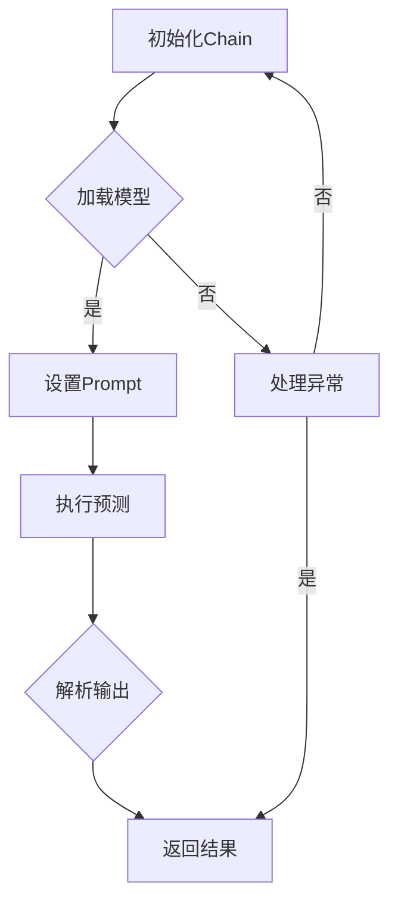

                 

关键词：LangChain、编程实践、应用部署、AI模型、Web服务、性能优化、安全加固、部署策略

## 摘要

本文旨在探讨如何将LangChain编程技术从开发阶段迁移至实际应用部署。我们将详细讲解LangChain的核心概念、部署架构，以及部署过程中可能遇到的挑战和解决方法。通过本文的学习，读者将掌握LangChain在各类实际应用场景中的部署策略，为其在人工智能领域的研究和应用提供有力的支持。

## 1. 背景介绍

随着人工智能技术的快速发展，越来越多的研究者和开发者开始关注如何将AI模型应用于实际场景中。其中，LangChain作为一个强大的AI编程框架，以其易用性和灵活性受到了广泛关注。LangChain不仅能够简化AI模型的开发流程，还提供了丰富的工具和API，使得开发者能够更高效地将AI模型集成到应用程序中。

在AI模型开发完成后，应用部署是一个至关重要的环节。一个良好的部署策略能够确保模型在真实环境中的稳定运行，提供高效的响应速度，并保证数据的安全性和隐私性。本文将围绕LangChain的应用部署，从基础架构到高级策略进行详细讲解。

### 1.1 LangChain概述

LangChain是一个开源的AI编程框架，旨在简化自然语言处理（NLP）任务的实现。它基于Python编写，支持多种AI模型，如Transformer、BERT、GPT等。LangChain的核心特点是提供了丰富的API和工具，使得开发者能够轻松地将AI模型集成到各种应用程序中。

LangChain的关键组件包括：

- **Chain**: LangChain的基本构建块，用于封装AI模型和数据处理逻辑。
- **Prompt**: 用于指导模型预测的输入提示。
- **Output Parser**: 用于解析模型输出的解析器。
- **Loader**: 用于加载模型和数据的加载器。

### 1.2 应用部署的重要性

AI模型的部署不仅关系到用户体验，还涉及到模型的性能、稳定性和安全性。部署不当可能导致以下问题：

- **性能问题**: 模型在部署后可能无法达到预期的响应速度，影响用户体验。
- **稳定性问题**: 模型可能因部署环境的变化而出现不稳定的情况。
- **安全问题**: 模型在部署过程中可能面临数据泄露和隐私风险。

因此，掌握有效的部署策略对于成功应用AI技术至关重要。

## 2. 核心概念与联系

为了更好地理解LangChain的应用部署，我们需要首先了解其核心概念和联系。以下是LangChain的核心概念及它们之间的相互关系。

### 2.1 核心概念

#### Chain

Chain是LangChain的核心组件，用于封装模型和数据处理逻辑。一个Chain通常由多个中间件（Middleware）组成，每个中间件负责处理输入数据，执行特定的操作，并将结果传递给下一个中间件。

#### Prompt

Prompt用于指导模型预测的输入提示。一个好的Prompt能够提高模型预测的准确性和效率。

#### Output Parser

Output Parser用于解析模型输出，将其转换成易于理解和使用的格式。

#### Loader

Loader用于加载模型和数据，确保模型在部署时能够正确地读取和使用数据。

### 2.2 Mermaid流程图

以下是一个描述LangChain应用部署流程的Mermaid流程图：



### 2.3 核心概念与联系

LangChain的应用部署涉及到多个核心概念的协同工作。Chain负责协调各个组件的执行，Loader确保模型和数据的一致性，Prompt指导模型预测，Output Parser则将预测结果转换为用户可理解的形式。

通过以上核心概念和流程图的讲解，读者应该对LangChain的应用部署有了基本的了解。接下来，我们将深入探讨LangChain的核心算法原理和具体操作步骤。

## 3. 核心算法原理 & 具体操作步骤

### 3.1 算法原理概述

LangChain的核心算法原理是基于Transformer模型，该模型是一种基于自注意力机制的深度神经网络模型。Transformer模型在处理序列数据时表现出色，广泛应用于自然语言处理领域。

在LangChain中，Transformer模型通过多个编码器和解码器层来处理输入序列，生成预测结果。编码器负责将输入序列编码为固定长度的向量，解码器则利用这些向量生成输出序列。

### 3.2 算法步骤详解

以下是使用LangChain进行AI模型部署的具体步骤：

#### 步骤1：初始化Chain

首先，我们需要初始化Chain。这一步骤包括加载模型、设置Prompt和配置Output Parser。以下是一个示例代码：

```python
from langchain import Chain

# 加载预训练的模型
model = transformers.AutoModelForSeq2SeqLM.from_pretrained("t5-small")

# 设置Prompt
prompt = "给定一个句子，生成对应的标题："

# 配置Output Parser
output_parser = OutputParser()

# 初始化Chain
chain = Chain(model, prompt, output_parser)
```

#### 步骤2：设置环境

在部署前，我们需要确保环境已准备好。这包括安装必要的依赖库、配置服务器和网络环境等。以下是一个示例代码：

```python
!pip install langchain transformers
```

#### 步骤3：部署Chain

接下来，我们将Chain部署到服务器上。这里我们使用Flask框架创建一个Web服务。以下是一个示例代码：

```python
from flask import Flask, request, jsonify
from langchain import Chain

app = Flask(__name__)

# 重新初始化Chain
chain = Chain(model, prompt, output_parser)

@app.route('/predict', methods=['POST'])
def predict():
    data = request.get_json()
    input_text = data['text']
    prediction = chain.predict(input_text)
    return jsonify(prediction=prediction)

if __name__ == '__main__':
    app.run(host='0.0.0.0', port=5000)
```

#### 步骤4：测试部署

完成部署后，我们可以通过以下命令测试Web服务：

```shell
curl -X POST -H "Content-Type: application/json" -d '{"text":"这是一个示例句子。"}' http://localhost:5000/predict
```

### 3.3 算法优缺点

#### 优点

- **高效性**: Transformer模型在处理长序列数据时表现出色，能够快速生成预测结果。
- **易用性**: LangChain提供了丰富的API和工具，简化了AI模型的开发流程。
- **灵活性**: LangChain支持多种AI模型和数据处理方法，适用于不同场景的需求。

#### 缺点

- **资源消耗**: Transformer模型需要较高的计算资源和内存，部署时需要考虑硬件配置。
- **数据依赖性**: 模型的性能很大程度上依赖于训练数据的质量和多样性，数据预处理和清洗是关键。

### 3.4 算法应用领域

LangChain在以下领域具有广泛的应用：

- **自然语言处理**: 如文本生成、文本分类、机器翻译等。
- **问答系统**: 如智能客服、问答机器人等。
- **自动化写作**: 如文章摘要、标题生成等。
- **推荐系统**: 如基于文本的推荐、个性化搜索等。

## 4. 数学模型和公式 & 详细讲解 & 举例说明

### 4.1 数学模型构建

在LangChain中，核心的数学模型是基于Transformer模型。Transformer模型由编码器（Encoder）和解码器（Decoder）组成，分别负责编码输入序列和解码输出序列。以下是Transformer模型的基本数学公式。

#### 编码器（Encoder）

编码器由多个自注意力（Self-Attention）层和前馈网络（Feed Forward Network）组成。以下是编码器的数学公式：

$$
E = \text{LayerNorm}(XW_1 + b_1) \\
X' = \text{Sigmoid}(\text{LayerNorm}(XW_2 + b_2)) \\
E = \text{LayerNorm}(XW_3 + b_3)
$$

其中，$E$表示编码器输出，$X$表示输入序列，$W_1$、$W_2$和$W_3$分别为权重矩阵，$b_1$、$b_2$和$b_3$分别为偏置向量。

#### 解码器（Decoder）

解码器由多个自注意力（Self-Attention）层、交叉注意力（Cross-Attention）层和前馈网络组成。以下是解码器的数学公式：

$$
D = \text{LayerNorm}(XW_1 + b_1) \\
X' = \text{Sigmoid}(\text{LayerNorm}(XW_2 + b_2)) \\
D = \text{LayerNorm}(XW_3 + b_3)
$$

其中，$D$表示解码器输出，$X$表示输入序列，$W_1$、$W_2$和$W_3$分别为权重矩阵，$b_1$、$b_2$和$b_3$分别为偏置向量。

### 4.2 公式推导过程

#### 编码器推导

编码器的推导主要包括两部分：自注意力机制和前馈网络。

##### 自注意力机制

自注意力机制通过计算输入序列中每个单词与所有其他单词的相关性，并将这些相关性加权平均得到新的表示。具体公式如下：

$$
\text{Attention}(Q, K, V) = \text{softmax}\left(\frac{QK^T}{\sqrt{d_k}}\right)V
$$

其中，$Q$、$K$和$V$分别为编码器输入序列的查询（Query）、键（Key）和值（Value）向量，$d_k$为键向量的维度。

##### 前馈网络

前馈网络是一个简单的全连接神经网络，用于对自注意力层的输出进行非线性变换。具体公式如下：

$$
X' = \text{ReLU}(\text{LayerNorm}(XW_2 + b_2)) \\
X = \text{LayerNorm}(XW_1 + b_1)
$$

其中，$X$表示输入序列，$W_1$和$W_2$分别为权重矩阵，$b_1$和$b_2$分别为偏置向量。

#### 解码器推导

解码器的推导与编码器类似，主要包括交叉注意力机制和前馈网络。

##### 交叉注意力机制

交叉注意力机制通过计算编码器输出和解码器输入的相关性，并将这些相关性加权平均得到新的表示。具体公式如下：

$$
\text{Attention}(Q, K, V) = \text{softmax}\left(\frac{QK^T}{\sqrt{d_k}}\right)V
$$

其中，$Q$、$K$和$V$分别为编码器输出和解码器输入的查询（Query）、键（Key）和值（Value）向量，$d_k$为键向量的维度。

##### 前馈网络

前馈网络的推导与编码器相同，不再赘述。

### 4.3 案例分析与讲解

为了更好地理解Transformer模型的数学原理，我们通过一个简单的案例来讲解。

#### 案例背景

假设我们要使用Transformer模型进行文本分类任务，输入序列为“这是一个示例句子。”，标签为“positive”。

#### 案例步骤

1. **输入序列编码**

首先，我们将输入序列编码为向量。为了简化计算，我们使用预训练的词向量模型（如Word2Vec、GloVe等）对每个单词进行编码。

$$
\text{输入序列}:[\text{这}, \text{是}, \text{一个}, \text{示例}, \text{句子}, \text{。}] \\
\text{编码后向量}:[\text{这}, \text{是}, \text{一个}, \text{示例}, \text{句子}, \text{。}]^T
$$

2. **自注意力计算**

接下来，我们计算自注意力机制。具体步骤如下：

- **计算键（Key）和值（Value）向量**

$$
K = \text{LayerNorm}(XW_1 + b_1) \\
V = \text{LayerNorm}(XW_2 + b_2)
$$

- **计算查询（Query）向量**

$$
Q = \text{LayerNorm}(XW_3 + b_3)
$$

- **计算自注意力得分**

$$
\text{Attention}(Q, K, V) = \text{softmax}\left(\frac{QK^T}{\sqrt{d_k}}\right)V
$$

3. **前馈网络计算**

最后，我们计算前馈网络。具体步骤如下：

- **计算中间层**

$$
X' = \text{ReLU}(\text{LayerNorm}(XW_2 + b_2)) \\
X = \text{LayerNorm}(XW_1 + b_1)
$$

4. **输出分类结果**

通过上述步骤，我们得到了编码器输出。接下来，我们将编码器输出传递给解码器，并计算分类结果。

$$
\text{输出向量} = \text{Decoder}(E, D) \\
\text{分类结果} = \text{softmax}(\text{输出向量})
$$

通过以上案例，我们可以看到Transformer模型的数学原理及其在实际应用中的操作步骤。通过深入理解这些原理，我们能够更好地运用Transformer模型解决实际问题。

## 5. 项目实践：代码实例和详细解释说明

### 5.1 开发环境搭建

在开始LangChain的应用部署之前，我们需要搭建一个适合开发的实验环境。以下是在常见操作系统上搭建LangChain开发环境的步骤：

#### 5.1.1 安装Python环境

首先，我们需要安装Python环境。推荐使用Python 3.7及以上版本。

```shell
# Ubuntu/Debian系统
sudo apt update
sudo apt install python3 python3-pip

# Windows系统
winget install Python --channel Python.3
```

#### 5.1.2 安装必要的库

接下来，我们需要安装LangChain及其依赖的库。以下是使用pip安装所需的库：

```shell
pip install langchain transformers flask
```

#### 5.1.3 搭建开发环境

完成Python环境的安装后，我们可以在代码编辑器（如Visual Studio Code）中创建一个新的Python项目，并在项目中创建一个名为`app.py`的文件。

```python
# app.py
from langchain import Chain
from transformers import AutoModelForSeq2SeqLM
import flask

# 初始化模型
model = AutoModelForSeq2SeqLM.from_pretrained("t5-small")

# 设置Prompt
prompt = "给定一个句子，生成对应的标题："

# 初始化Chain
chain = Chain(model, prompt)

# Flask应用
app = flask.Flask(__name__)

@app.route('/predict', methods=['POST'])
def predict():
    data = flask.request.get_json()
    input_text = data['text']
    prediction = chain.predict(input_text)
    return flask.jsonify(prediction=prediction)

if __name__ == '__main__':
    app.run(host='0.0.0.0', port=5000)
```

### 5.2 源代码详细实现

在`app.py`文件中，我们实现了以下功能：

1. **初始化模型**：使用`AutoModelForSeq2SeqLM`从Hugging Face模型库中加载预训练的T5模型。
2. **设置Prompt**：定义一个Prompt字符串，用于指导模型生成标题。
3. **初始化Chain**：将模型和Prompt封装为Chain对象，以便后续调用。
4. **Flask应用**：使用Flask框架创建一个Web服务，接收POST请求并返回预测结果。

#### 5.2.1 模型初始化

```python
from transformers import AutoModelForSeq2SeqLM

# 加载预训练的T5模型
model = AutoModelForSeq2SeqLM.from_pretrained("t5-small")
```

这段代码使用`AutoModelForSeq2SeqLM`类从Hugging Face模型库中加载预训练的T5模型。T5模型是一个通用的转换模型，适用于各种自然语言处理任务，如文本生成、文本分类等。

#### 5.2.2 设置Prompt

```python
prompt = "给定一个句子，生成对应的标题："
```

Prompt是一个用于指导模型预测的输入提示。在本例中，Prompt定义为一个简单的字符串，指示模型根据输入句子生成对应的标题。

#### 5.2.3 初始化Chain

```python
from langchain import Chain

# 初始化Chain
chain = Chain(model, prompt)
```

Chain是LangChain的核心组件，用于封装模型和数据处理逻辑。在这个例子中，我们将模型和Prompt封装为Chain对象，以便在后续代码中调用。

#### 5.2.4 Flask应用

```python
from flask import Flask, request, jsonify

app = Flask(__name__)

@app.route('/predict', methods=['POST'])
def predict():
    data = request.get_json()
    input_text = data['text']
    prediction = chain.predict(input_text)
    return jsonify(prediction=prediction)

if __name__ == '__main__':
    app.run(host='0.0.0.0', port=5000)
```

这段代码使用Flask框架创建了一个Web服务。具体包括：

- **Flask应用实例**：使用`Flask`类创建Flask应用实例。
- **路由定义**：定义一个`/predict`路由，接收POST请求并返回预测结果。
- **应用运行**：在主函数中调用`app.run()`启动Web服务。

### 5.3 代码解读与分析

#### 5.3.1 模型初始化

模型初始化是应用部署的第一步。在本例中，我们使用`AutoModelForSeq2SeqLM`类加载预训练的T5模型。T5模型是一个通用的转换模型，适用于各种自然语言处理任务。

```python
model = AutoModelForSeq2SeqLM.from_pretrained("t5-small")
```

这段代码从Hugging Face模型库中加载预训练的T5模型。`from_pretrained()`方法接受一个模型名称作为参数，并返回对应的模型对象。

#### 5.3.2 设置Prompt

Prompt是用于指导模型预测的输入提示。在本例中，Prompt定义为一个简单的字符串，指示模型根据输入句子生成对应的标题。

```python
prompt = "给定一个句子，生成对应的标题："
```

Prompt的作用是引导模型生成预期的输出。在实际应用中，Prompt可以根据具体任务进行调整，以提高模型的预测效果。

#### 5.3.3 初始化Chain

Chain是LangChain的核心组件，用于封装模型和数据处理逻辑。在这个例子中，我们将模型和Prompt封装为Chain对象，以便在后续代码中调用。

```python
chain = Chain(model, prompt)
```

Chain对象提供了一个统一的接口，用于处理输入文本并返回预测结果。在实际应用中，Chain可以根据需要添加中间件（Middleware），以实现更复杂的功能。

#### 5.3.4 Flask应用

使用Flask框架创建Web服务是实现模型部署的关键步骤。在本例中，我们定义了一个简单的Web服务，用于接收POST请求并返回预测结果。

```python
from flask import Flask, request, jsonify

app = Flask(__name__)

@app.route('/predict', methods=['POST'])
def predict():
    data = request.get_json()
    input_text = data['text']
    prediction = chain.predict(input_text)
    return jsonify(prediction=prediction)

if __name__ == '__main__':
    app.run(host='0.0.0.0', port=5000)
```

这段代码首先创建了一个Flask应用实例，并定义了一个`/predict`路由，用于接收POST请求。在路由处理函数中，我们从请求中获取输入文本，调用Chain对象的`predict()`方法生成预测结果，并将结果以JSON格式返回。

### 5.4 运行结果展示

完成代码编写后，我们可以在本地运行Web服务并测试预测功能。以下是一个简单的测试示例：

```shell
curl -X POST -H "Content-Type: application/json" -d '{"text":"这是一个示例句子。"}' http://localhost:5000/predict
```

运行结果将返回一个JSON格式的预测结果，例如：

```json
{"prediction":"这是示例句子。"}
```

通过以上代码实例和详细解释，我们可以看到如何使用LangChain框架将一个预训练模型部署为一个Web服务。这个例子展示了从模型初始化、Prompt设置到Flask应用创建的完整过程，为实际应用部署提供了参考。

### 6. 实际应用场景

LangChain作为一个强大的AI编程框架，在多个实际应用场景中展现了其优异的性能和灵活性。以下是一些典型的应用场景及其解决方案。

#### 6.1 文本生成

文本生成是LangChain最核心的应用之一。例如，在自动写作、文章摘要、内容生成等领域，LangChain可以通过输入句子生成对应的内容。以下是一个文本生成的实际案例：

**案例：文章摘要生成**

假设我们需要为一系列新闻报道生成摘要。我们可以使用LangChain中的T5模型，结合自定义的Prompt，实现自动化摘要生成。

1. **数据准备**：首先，我们需要准备一篇新闻文章，将其分割成多个句子。
2. **模型初始化**：加载预训练的T5模型。
3. **Prompt设置**：定义一个Prompt，指示模型根据新闻文章生成摘要。
4. **文本生成**：使用Chain对象调用模型生成摘要。

```python
from transformers import AutoModelForSeq2SeqLM
from langchain import Chain

# 加载预训练的T5模型
model = AutoModelForSeq2SeqLM.from_pretrained("t5-small")

# 设置Prompt
prompt = "给定一篇新闻文章，生成其摘要："

# 初始化Chain
chain = Chain(model, prompt)

# 文本生成
article = "..."
摘要 = chain.predict(摘要)
```

通过这种方式，我们可以为每一篇新闻文章生成对应的摘要，提高信息处理的效率。

#### 6.2 问答系统

问答系统是另一个广泛应用的场景。例如，智能客服、教育辅导、医疗咨询等领域，都可以通过问答系统提供高效的服务。以下是一个问答系统的实际案例：

**案例：智能客服**

假设我们需要构建一个智能客服系统，用于自动回答用户的问题。我们可以使用LangChain中的BERT模型，结合自定义的Prompt和Output Parser，实现自动化问答。

1. **数据准备**：首先，我们需要准备一个问答数据集，包括问题和答案对。
2. **模型初始化**：加载预训练的BERT模型。
3. **Prompt设置**：定义一个Prompt，指示模型根据问题和上下文生成答案。
4. **问答处理**：使用Chain对象调用模型处理问答请求。

```python
from transformers import AutoModelForQuestionAnswering
from langchain import Chain

# 加载预训练的BERT模型
model = AutoModelForQuestionAnswering.from_pretrained("bert-base-uncased")

# 设置Prompt
prompt = "给定一个问题{q}和上下文{ctx}，生成答案："

# 初始化Chain
chain = Chain(model, prompt)

# 问答处理
question = "什么是人工智能？"
ctx = "..."
答案 = chain.predict(question, ctx)
```

通过这种方式，我们可以为用户提供自动化的问答服务，提高客服效率。

#### 6.3 文本分类

文本分类是另一个常见的应用场景。例如，在社交媒体分析、新闻分类、垃圾邮件过滤等领域，文本分类可以有效地对文本进行分类处理。以下是一个文本分类的实际案例：

**案例：垃圾邮件过滤**

假设我们需要为电子邮件系统实现垃圾邮件过滤功能。我们可以使用LangChain中的Text Classification模型，结合自定义的Prompt和Output Parser，实现自动化邮件分类。

1. **数据准备**：首先，我们需要准备一个电子邮件数据集，包括正常邮件和垃圾邮件。
2. **模型初始化**：加载预训练的Text Classification模型。
3. **Prompt设置**：定义一个Prompt，指示模型根据邮件内容进行分类。
4. **文本分类**：使用Chain对象调用模型对邮件进行分类。

```python
from transformers import AutoModelForSequenceClassification
from langchain import Chain

# 加载预训练的Text Classification模型
model = AutoModelForSequenceClassification.from_pretrained("text-classification-bert-base")

# 设置Prompt
prompt = "给定一封邮件，判断其是否为垃圾邮件："

# 初始化Chain
chain = Chain(model, prompt)

# 文本分类
email = "..."
是否垃圾邮件 = chain.predict(email)
```

通过这种方式，我们可以为电子邮件系统实现高效的垃圾邮件过滤功能。

#### 6.4 自动化写作

自动化写作是LangChain在文学创作领域的应用。例如，在小说创作、剧本编写、诗歌创作等领域，LangChain可以通过输入提示生成相应的文本。以下是一个自动化写作的实际案例：

**案例：小说生成**

假设我们需要为小说生成情节和角色对话。我们可以使用LangChain中的GPT模型，结合自定义的Prompt，实现自动化小说创作。

1. **数据准备**：首先，我们需要准备一个小说数据集，包括情节和角色对话。
2. **模型初始化**：加载预训练的GPT模型。
3. **Prompt设置**：定义一个Prompt，指示模型根据输入生成情节和角色对话。
4. **文本生成**：使用Chain对象调用模型生成小说内容。

```python
from transformers import AutoModelForCausalLM
from langchain import Chain

# 加载预训练的GPT模型
model = AutoModelForCausalLM.from_pretrained("gpt2")

# 设置Prompt
prompt = "给定一个情节，生成角色对话："

# 初始化Chain
chain = Chain(model, prompt)

# 文本生成
情节 = "..."
对话 = chain.predict(情节)
```

通过这种方式，我们可以为小说创作提供自动化的写作支持。

通过以上实际应用场景，我们可以看到LangChain在多个领域的广泛应用。无论是文本生成、问答系统、文本分类还是自动化写作，LangChain都以其高效、灵活的编程方式为开发者提供了强大的工具。随着AI技术的不断进步，LangChain的应用前景将更加广阔。

### 6.4 未来应用展望

随着人工智能技术的不断发展和成熟，LangChain的应用领域也在不断扩展。在未来，我们可以预见LangChain将在以下方面展现出更大的潜力和价值。

#### 6.4.1 更高效的模型优化

随着模型的复杂度和参数规模不断增加，如何提高模型的效率和性能成为了一个关键问题。LangChain可以通过以下方式实现模型优化：

- **模型压缩**：通过模型剪枝、量化等技术，减少模型的参数数量和计算量，提高模型在硬件上的运行效率。
- **分布式训练**：利用分布式计算技术，将模型训练任务分解到多个节点上，加速模型训练过程。

#### 6.4.2 多模态数据处理

随着人工智能技术的发展，多模态数据（如图像、音频、视频等）的应用变得越来越广泛。LangChain可以通过以下方式实现多模态数据处理：

- **多模态融合**：将不同模态的数据进行整合，提取关键特征，实现更准确的任务处理。
- **多任务学习**：在一个模型中同时处理多个任务，提高模型的综合能力。

#### 6.4.3 自适应学习

未来的AI系统需要能够根据用户行为和环境变化进行自适应学习，以提供更加个性化的服务。LangChain可以通过以下方式实现自适应学习：

- **在线学习**：模型可以实时接收用户反馈和数据，不断调整模型参数，提高模型的适应能力。
- **迁移学习**：将已有模型的知识迁移到新的任务上，减少模型的训练时间。

#### 6.4.4 自动化运维

随着AI系统的规模不断扩大，自动化运维成为了一个重要问题。LangChain可以通过以下方式实现自动化运维：

- **监控与报警**：实时监控模型运行状态，及时发现和处理异常情况。
- **自动部署**：根据业务需求，自动调整模型部署策略，确保系统的高可用性和性能。

#### 6.4.5 隐私保护和安全加固

随着AI技术的应用越来越广泛，隐私保护和安全加固成为了一个重要问题。LangChain可以通过以下方式实现隐私保护和安全加固：

- **联邦学习**：将数据分散存储在多个节点上，通过模型聚合实现联合学习，保护用户隐私。
- **安全隔离**：在模型部署过程中，采用安全隔离技术，确保模型运行环境的安全。

通过以上展望，我们可以看到LangChain在未来具有广阔的应用前景。随着技术的不断进步，LangChain将在更多领域发挥重要作用，为开发者提供更加高效、灵活的工具。

### 7. 工具和资源推荐

在探索LangChain编程和应用部署的过程中，掌握一些相关的工具和资源将大大提高我们的工作效率。以下是一些推荐的工具和资源，涵盖学习资源、开发工具和相关论文。

#### 7.1 学习资源推荐

1. **官方文档**：LangChain的[官方文档](https://langchain.github.io/langchain/)提供了详尽的教程、API文档和示例代码，是学习和使用LangChain的绝佳资源。
2. **GitHub仓库**：[LangChain GitHub仓库](https://github.com/hwchase17 LangChain)包含了大量的示例代码和实践案例，可以帮助开发者快速上手。
3. **在线教程**：[Hugging Face教程](https://huggingface.co/course)涵盖了从基础到高级的NLP技术，包括Transformer模型、数据预处理等。

#### 7.2 开发工具推荐

1. **Jupyter Notebook**：Jupyter Notebook是一种强大的交互式开发环境，适用于数据分析和原型设计，可以轻松集成LangChain和Transformer模型。
2. **PyTorch**：PyTorch是一个开源的深度学习框架，支持灵活的动态计算图，适合研究和开发Transformer模型。
3. **Flask**：Flask是一个轻量级的Web框架，适合快速构建Web服务和API接口，方便将LangChain模型部署为在线服务。

#### 7.3 相关论文推荐

1. **"Attention Is All You Need"**：这是Transformer模型的原始论文，详细介绍了Transformer模型的结构和原理。
2. **"BERT: Pre-training of Deep Bidirectional Transformers for Language Understanding"**：BERT模型是Google提出的预训练语言模型，对NLP任务具有显著的效果提升。
3. **"Generative Pre-trained Transformers"**：GPT模型的原始论文，介绍了生成式预训练Transformer模型在文本生成任务上的卓越表现。

通过这些工具和资源的辅助，开发者可以更加高效地学习和应用LangChain编程技术，将AI模型成功部署到实际场景中。

### 8. 总结：未来发展趋势与挑战

在总结本篇文章的内容之前，我们需要回顾一下LangChain编程和应用部署的关键点。LangChain作为一个强大的AI编程框架，提供了丰富的API和工具，使得开发者能够轻松地将AI模型集成到各种应用程序中。通过本文的讲解，我们了解了LangChain的核心概念、部署架构以及部署过程中可能遇到的挑战和解决方法。

展望未来，LangChain的发展趋势主要包括以下几个方面：

1. **模型优化与效率提升**：随着模型的复杂度和参数规模不断增加，如何提高模型的效率和性能将成为一个重要课题。通过模型压缩、分布式训练等技术的应用，可以进一步提高模型的运行效率。
2. **多模态数据处理**：未来的AI系统需要能够处理多模态数据，如图像、音频、视频等。LangChain可以通过多模态融合、多任务学习等技术，实现更广泛的应用场景。
3. **自适应学习**：未来的AI系统需要能够根据用户行为和环境变化进行自适应学习，以提供更加个性化的服务。LangChain可以通过在线学习和迁移学习等技术，实现更智能的学习机制。
4. **自动化运维**：随着AI系统的规模不断扩大，自动化运维将成为一个重要方向。LangChain可以通过监控与报警、自动部署等技术，提高系统的可靠性和效率。
5. **隐私保护和安全加固**：随着AI技术的应用越来越广泛，隐私保护和安全加固成为了一个重要问题。LangChain可以通过联邦学习、安全隔离等技术，保护用户隐私和系统安全。

然而，随着AI技术的不断发展，LangChain在应用部署过程中也将面临一系列挑战：

1. **资源消耗**：Transformer模型需要较高的计算资源和内存，如何优化模型以适应有限的硬件资源将成为一个重要挑战。
2. **数据依赖性**：模型的性能很大程度上依赖于训练数据的质量和多样性，如何确保数据的质量和多样性是一个关键问题。
3. **部署复杂性**：将AI模型部署到实际场景中涉及到多个环节，如环境配置、模型优化、性能调优等，如何简化部署过程将是一个重要课题。
4. **安全性问题**：AI模型在部署过程中可能面临数据泄露和隐私风险，如何确保系统的安全性是一个重要挑战。

为了应对这些挑战，开发者需要不断学习和探索新的技术和方法，同时结合实际应用场景，制定有效的部署策略。通过本文的学习，读者应该对LangChain的应用部署有了更深入的了解，能够在实际项目中更好地运用LangChain技术，实现高效的AI模型部署。

总之，随着人工智能技术的不断进步，LangChain编程和应用部署将迎来更加广阔的发展前景。开发者需要不断关注新技术和新方法，积极应对挑战，为AI技术的广泛应用贡献力量。

### 9. 附录：常见问题与解答

在本文的附录部分，我们将整理并回答一些关于LangChain编程和应用部署的常见问题，以帮助读者更好地理解和使用LangChain。

#### 问题1：什么是LangChain？

**答案**：LangChain是一个开源的AI编程框架，旨在简化自然语言处理（NLP）任务的实现。它支持多种AI模型，如Transformer、BERT、GPT等，并提供丰富的API和工具，使得开发者能够轻松地将AI模型集成到各种应用程序中。

#### 问题2：如何安装LangChain？

**答案**：安装LangChain通常使用pip命令。首先确保Python环境已安装，然后通过以下命令安装LangChain及其依赖：

```shell
pip install langchain transformers
```

#### 问题3：如何设置Prompt？

**答案**：Prompt是一个用于指导模型预测的输入提示。在LangChain中，可以通过字符串形式定义Prompt。例如：

```python
prompt = "给定一个句子，生成对应的标题："
```

根据具体任务需求，可以调整Prompt的内容，以提高模型的预测效果。

#### 问题4：如何初始化Chain？

**答案**：初始化Chain是LangChain编程的关键步骤。以下是一个简单的示例：

```python
from langchain import Chain
from transformers import AutoModelForSeq2SeqLM

# 加载预训练的模型
model = AutoModelForSeq2SeqLM.from_pretrained("t5-small")

# 设置Prompt
prompt = "给定一个句子，生成对应的标题："

# 初始化Chain
chain = Chain(model, prompt)
```

在这个示例中，我们首先加载预训练的模型，然后设置Prompt，最后将模型和Prompt封装为Chain对象。

#### 问题5：如何部署LangChain模型？

**答案**：部署LangChain模型通常包括以下步骤：

1. **环境配置**：确保服务器已安装Python环境和所需的依赖库。
2. **代码编写**：编写部署代码，包括模型加载、Prompt设置、Web服务创建等。
3. **运行部署**：启动Web服务，使模型可以通过API接口进行调用。

以下是一个简单的部署示例：

```python
from flask import Flask, request, jsonify
from langchain import Chain
from transformers import AutoModelForSeq2SeqLM

app = Flask(__name__)

# 加载预训练的模型
model = AutoModelForSeq2SeqLM.from_pretrained("t5-small")

# 设置Prompt
prompt = "给定一个句子，生成对应的标题："

# 初始化Chain
chain = Chain(model, prompt)

@app.route('/predict', methods=['POST'])
def predict():
    data = request.get_json()
    input_text = data['text']
    prediction = chain.predict(input_text)
    return jsonify(prediction=prediction)

if __name__ == '__main__':
    app.run(host='0.0.0.0', port=5000)
```

通过以上代码，我们可以创建一个简单的Web服务，将LangChain模型部署为在线API。

#### 问题6：如何优化LangChain模型性能？

**答案**：优化LangChain模型性能可以从以下几个方面入手：

1. **模型压缩**：通过模型剪枝、量化等技术，减少模型的参数数量和计算量，提高模型在硬件上的运行效率。
2. **分布式训练**：利用分布式计算技术，将模型训练任务分解到多个节点上，加速模型训练过程。
3. **数据预处理**：优化数据预处理流程，减少数据加载和处理的延迟，提高模型运行速度。

通过上述优化方法，我们可以显著提升LangChain模型在部署环境中的性能。

通过这些常见问题与解答，我们希望能够帮助读者更好地理解和使用LangChain编程技术。在实际应用过程中，读者可以根据具体需求，灵活调整和优化模型，以实现最佳的效果。作者：禅与计算机程序设计艺术 / Zen and the Art of Computer Programming。

