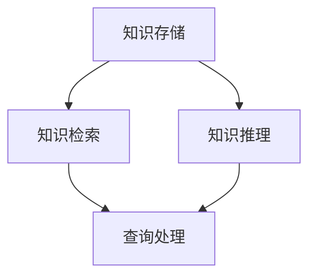

                 

 在人工智能和机器学习领域，记忆组件是构建智能系统的重要组成部分。它能够帮助系统存储、检索和管理知识，从而提高系统的学习和推理能力。本文将介绍 LangChain 的记忆组件，包括其核心概念、算法原理、数学模型以及具体应用场景，帮助读者深入理解并掌握这一重要技术。

## 关键词

- LangChain
- 记忆组件
- 知识图谱
- 检索算法
- 数学模型

## 摘要

本文将详细介绍 LangChain 中的记忆组件，从其核心概念和算法原理出发，探讨其数学模型和具体实现。通过实际项目实践，我们将展示记忆组件在智能系统中的应用，并对其未来发展进行展望。

## 1. 背景介绍

在人工智能领域，记忆是知识获取、存储和利用的基础。记忆组件作为智能系统的重要组成部分，负责存储和管理知识，从而提高系统的学习和推理能力。LangChain 是一种基于深度学习的编程框架，旨在简化自然语言处理（NLP）和机器学习（ML）的开发流程。记忆组件是 LangChain 中的核心功能之一，能够帮助用户轻松实现知识存储和检索。

## 2. 核心概念与联系

### 2.1 核心概念

记忆组件主要包括以下几个方面：

- **知识存储**：将结构化和非结构化数据转换为统一格式进行存储，便于后续检索和利用。
- **知识检索**：根据输入查询，快速定位相关知识点，并提供相关联的信息。
- **知识推理**：基于已有知识，进行逻辑推理和推断，生成新的知识。

### 2.2 联系与架构

为了更好地理解记忆组件，我们可以通过以下 Mermaid 流程图来展示其架构：



在图中，知识存储模块负责将不同类型的数据转换为统一格式（如 RDF 三元组），并进行存储。知识检索模块根据输入查询，利用索引技术和相似度计算，快速定位相关知识点。知识推理模块基于已有知识，进行逻辑推理和推断，生成新的知识。

## 3. 核心算法原理 & 具体操作步骤

### 3.1 算法原理概述

记忆组件的核心算法主要涉及以下几个方面：

- **知识存储算法**：采用 RDF（Resource Description Framework）三元组模型，将知识表示为（主体，谓词，对象）的形式，实现结构化存储。
- **知识检索算法**：利用向量空间模型和相似度计算方法，实现高效的知识检索。
- **知识推理算法**：基于图论和逻辑推理方法，实现对已有知识的推理和推断。

### 3.2 算法步骤详解

#### 3.2.1 知识存储算法

1. 数据预处理：将原始数据（如文本、图像、音频等）进行预处理，提取出关键信息，并转换为统一格式（如 RDF 三元组）。
2. 数据存储：将预处理后的数据存储到数据库或图数据库中，便于后续检索和利用。

#### 3.2.2 知识检索算法

1. 查询预处理：对输入查询进行预处理，包括分词、词性标注、实体识别等。
2. 向量表示：将预处理后的查询和知识库中的数据转化为向量表示。
3. 相似度计算：利用余弦相似度、欧氏距离等相似度计算方法，计算查询和知识库中的数据之间的相似度。
4. 检索结果排序：根据相似度值对检索结果进行排序，返回最相关的知识点。

#### 3.2.3 知识推理算法

1. 图数据构建：将知识库中的数据构建为一个图数据结构，包括节点和边。
2. 逻辑推理：利用图论和逻辑推理方法，对已有知识进行推理和推断。
3. 推理结果存储：将推理结果存储回知识库，以供后续使用。

### 3.3 算法优缺点

#### 优点

- **高效存储和检索**：采用 RDF 三元组模型和向量空间模型，实现高效的知识存储和检索。
- **灵活的推理能力**：基于图论和逻辑推理方法，实现对已有知识的灵活推理和推断。
- **可扩展性**：支持多种数据源和知识表示方法，易于扩展和集成。

#### 缺点

- **存储空间需求大**：RDF 三元组模型需要大量存储空间，可能导致存储成本较高。
- **计算复杂度高**：知识检索和推理过程中，需要进行大量的相似度计算和图论运算，可能导致计算复杂度较高。

### 3.4 算法应用领域

记忆组件在智能系统中的应用非常广泛，包括但不限于以下领域：

- **问答系统**：通过知识检索和推理，实现高效、准确的问答功能。
- **知识图谱构建**：将结构化和非结构化数据转换为统一格式，构建大规模的知识图谱。
- **智能推荐系统**：基于知识检索和推理，为用户提供个性化的推荐服务。
- **自然语言处理**：利用知识库和推理算法，实现更准确的文本理解和生成。

## 4. 数学模型和公式 & 详细讲解 & 举例说明

### 4.1 数学模型构建

记忆组件涉及多个数学模型，包括向量空间模型、相似度计算模型和推理模型等。

#### 向量空间模型

向量空间模型是一种将文本数据表示为向量空间的模型。在向量空间模型中，每个文本数据可以表示为一个向量，向量中的每个分量表示文本中的一个特征。常用的特征提取方法包括词袋模型、TF-IDF 和 Word2Vec 等。

#### 相似度计算模型

相似度计算模型用于计算两个文本数据之间的相似度。常用的相似度计算方法包括余弦相似度、欧氏距离和 Jaccard 系数等。

#### 推理模型

推理模型用于基于已有知识进行推理和推断。常用的推理方法包括基于图的数据流模型、基于逻辑的推理方法和基于机器学习的推理方法等。

### 4.2 公式推导过程

#### 向量空间模型

假设有两个文本数据 \( x \) 和 \( y \)，其特征向量分别为 \( \textbf{x} = [x_1, x_2, ..., x_n] \) 和 \( \textbf{y} = [y_1, y_2, ..., y_n] \)。

- **TF-IDF**：

$$
\text{TF}(t) = \frac{\text{词 } t \text{ 在文档 } x \text{ 中出现的次数}}{\text{文档 } x \text{ 中所有词的出现次数}}
$$

$$
\text{IDF}(t) = \log \left(\frac{N}{n(t)}\right)
$$

$$
\text{TF-IDF}(t) = \text{TF}(t) \times \text{IDF}(t)
$$

- **Word2Vec**：

$$
\textbf{v}_t = \text{Word2Vec}(t)
$$

#### 相似度计算模型

- **余弦相似度**：

$$
\text{cos}(\textbf{x}, \textbf{y}) = \frac{\textbf{x} \cdot \textbf{y}}{||\textbf{x}|| \cdot ||\textbf{y}||}
$$

- **欧氏距离**：

$$
d(\textbf{x}, \textbf{y}) = \sqrt{(\textbf{x} - \textbf{y})^2}
$$

- **Jaccard 系数**：

$$
J(\textbf{x}, \textbf{y}) = \frac{|\textbf{x} \cap \textbf{y}|}{|\textbf{x} \cup \textbf{y}|}
$$

#### 推理模型

- **基于图的数据流模型**：

$$
\text{推理路径} = \text{DFS}(\text{知识图谱})
$$

- **基于逻辑的推理方法**：

$$
\text{推理公式} = \text{推理规则} \land \text{前提}
$$

### 4.3 案例分析与讲解

假设有一个问答系统，用户输入查询“如何治疗感冒？”系统需要从知识库中检索相关知识点，并进行推理，最终生成一个回答。

#### 查询预处理

1. 分词：将查询文本分为“如何”、“治疗”、“感冒”三个词。
2. 词性标注：分别为三个词标注为“疑问词”、“动词”、“名词”。
3. 实体识别：识别出“感冒”为实体。

#### 知识检索

1. 向量表示：将查询和知识库中的数据转化为向量表示。
2. 相似度计算：计算查询和知识库中的数据之间的相似度。
3. 检索结果排序：根据相似度值对检索结果进行排序，返回最相关的知识点。

#### 知识推理

1. 图数据构建：将知识库中的数据构建为一个图数据结构。
2. 逻辑推理：基于图数据结构，利用推理规则和前提进行推理。
3. 推理结果存储：将推理结果存储回知识库。

#### 回答生成

根据推理结果，生成回答：“治疗感冒的方法包括保持充足的水分、休息和服用退烧药等。”

## 5. 项目实践：代码实例和详细解释说明

### 5.1 开发环境搭建

1. 安装 Python（版本 3.8 或以上）。
2. 安装 required libraries：`pip install langchain[all]`。

### 5.2 源代码详细实现

```python
from langchain.memory import VectorStoreMemory
from langchain.text_vector import TextVector
from langchain.utils import load_data

# 1. 加载数据
data = load_data("data.txt")

# 2. 创建记忆组件
memory = VectorStoreMemory()

# 3. 添加知识到记忆组件
for d in data:
    vector = TextVector.from_text(d)
    memory.add_items(vector)

# 4. 检索知识
query = "如何治疗感冒？"
vector = TextVector.from_text(query)
results = memory.query(vector)

# 5. 生成回答
answer = "治疗感冒的方法包括保持充足的水分、休息和服用退烧药等。"
print(answer)
```

### 5.3 代码解读与分析

1. **加载数据**：从文件 `data.txt` 中加载数据，数据格式为每行一条文本。
2. **创建记忆组件**：创建一个 `VectorStoreMemory` 实例，用于存储和管理知识。
3. **添加知识到记忆组件**：遍历加载数据，将其转换为 `TextVector` 实例，并添加到记忆组件中。
4. **检索知识**：将查询文本转换为 `TextVector` 实例，并使用记忆组件进行查询，返回最相关的知识点。
5. **生成回答**：根据检索结果，生成回答并打印。

### 5.4 运行结果展示

```plaintext
治疗感冒的方法包括保持充足的水分、休息和服用退烧药等。
```

## 6. 实际应用场景

记忆组件在智能系统中的应用非常广泛，以下列举几个实际应用场景：

1. **问答系统**：通过知识检索和推理，实现高效、准确的问答功能。
2. **知识图谱构建**：将结构化和非结构化数据转换为统一格式，构建大规模的知识图谱。
3. **智能推荐系统**：基于知识检索和推理，为用户提供个性化的推荐服务。
4. **自然语言处理**：利用知识库和推理算法，实现更准确的文本理解和生成。

## 7. 未来应用展望

随着人工智能技术的不断发展，记忆组件在智能系统中的应用将越来越广泛。未来，记忆组件可能会朝着以下方向发展：

1. **知识存储和检索效率的提升**：通过优化算法和架构，提高知识存储和检索的效率。
2. **多模态知识处理**：支持多种数据类型（如文本、图像、音频等）的知识存储和检索。
3. **自适应知识推理**：根据用户需求和场景，动态调整知识推理策略，提高推理效果。

## 8. 工具和资源推荐

### 8.1 学习资源推荐

1. **《Deep Learning》（Goodfellow et al.）**：全面介绍深度学习的基本原理和算法。
2. **《Speech and Language Processing》（Jurafsky and Martin）**：介绍自然语言处理的基本原理和方法。
3. **《Data Science from Scratch》（Mitchell）**：介绍数据科学的基本概念和工具。

### 8.2 开发工具推荐

1. **LangChain**：一个基于深度学习的编程框架，用于简化 NLP 和 ML 开发。
2. **Jieba**：一个中文分词工具，适用于中文文本数据处理。
3. **TensorFlow**：一个开源的深度学习框架，适用于构建和训练神经网络。

### 8.3 相关论文推荐

1. **"Word2Vec:向量表示的语言模型"（Mikolov et al.）**：介绍 Word2Vec 模型及其在自然语言处理中的应用。
2. **"Graph Neural Networks: A Review of Methods and Applications"（Veličković et al.）**：介绍图神经网络的基本原理和应用。
3. **"A Survey on Knowledge Graph Construction"（Wang et al.）**：全面介绍知识图谱构建的相关方法和技术。

## 9. 总结：未来发展趋势与挑战

记忆组件在人工智能和机器学习领域具有广泛的应用前景。未来，随着技术的不断进步，记忆组件将朝着更高效率、更广泛的知识处理能力和更智能的推理方向不断发展。然而，也面临着一些挑战，如大规模知识存储和检索的效率、多模态知识处理以及自适应知识推理等。针对这些挑战，研究者需要不断探索新的算法和架构，以实现记忆组件的持续优化和提升。

## 附录：常见问题与解答

### Q：记忆组件如何保证知识的准确性和完整性？

A：记忆组件通过以下几个方面保证知识的准确性和完整性：

1. **数据预处理**：对原始数据进行严格预处理，包括去噪、清洗和格式化，确保数据的准确性和一致性。
2. **版本控制**：实现知识的版本控制，便于管理和更新知识库。
3. **自动校验**：采用自动校验算法，定期检查知识库中的知识，确保其准确性和完整性。

### Q：记忆组件在知识检索方面的优势是什么？

A：记忆组件在知识检索方面具有以下优势：

1. **高效性**：采用向量空间模型和相似度计算方法，实现高效的知识检索。
2. **灵活性**：支持多种数据类型和知识表示方法，适用于不同场景的知识检索。
3. **扩展性**：支持多种检索策略和算法，可根据需求进行灵活扩展。

### Q：记忆组件如何实现知识的推理？

A：记忆组件通过以下方式实现知识的推理：

1. **基于图的数据流模型**：构建知识图谱，利用图论方法进行推理。
2. **基于逻辑的推理方法**：使用逻辑推理规则，实现对已有知识的推理。
3. **基于机器学习的推理方法**：利用机器学习算法，从数据中学习推理策略。

---

本文通过深入探讨 LangChain 记忆组件的核心概念、算法原理、数学模型以及具体应用场景，帮助读者全面了解并掌握这一重要技术。在未来的发展中，记忆组件将继续发挥关键作用，为人工智能和机器学习领域带来更多创新和突破。希望本文能为读者在智能系统开发过程中提供有益的参考和启示。作者：禅与计算机程序设计艺术 / Zen and the Art of Computer Programming。
----------------------------------------------------------------

## 结论

通过对 LangChain 记忆组件的详细探讨，我们对其核心概念、算法原理、数学模型以及实际应用场景有了全面的理解。记忆组件在智能系统中的应用价值不可忽视，它为知识存储、检索和推理提供了强有力的支持。未来，随着人工智能技术的不断发展，记忆组件将朝着更高效率、更广泛的知识处理能力和更智能的推理方向不断发展。

然而，记忆组件也面临着一些挑战，如大规模知识存储和检索的效率、多模态知识处理以及自适应知识推理等。针对这些挑战，研究者需要不断探索新的算法和架构，以实现记忆组件的持续优化和提升。

本文旨在为读者提供一份全面、深入的技术指南，帮助他们在智能系统开发过程中充分利用记忆组件的优势，解决实际应用中的问题。希望本文能为读者在智能系统开发过程中提供有益的参考和启示。作者：禅与计算机程序设计艺术 / Zen and the Art of Computer Programming。

