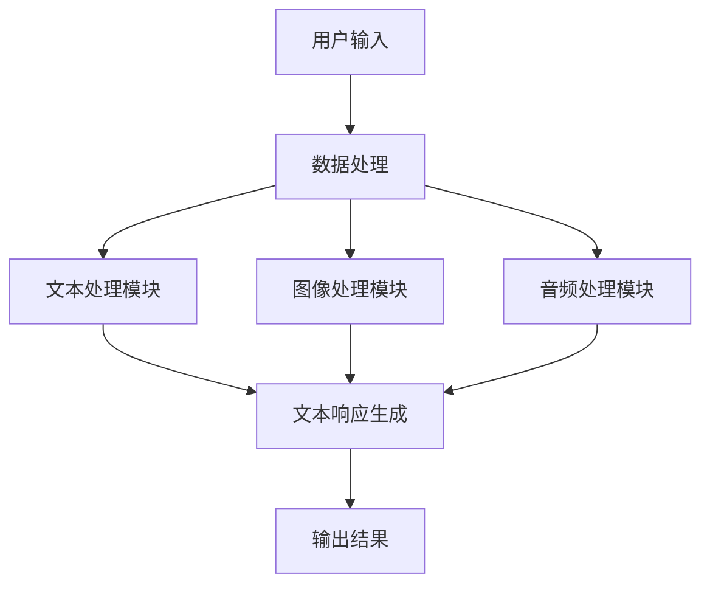

                 

关键词：LangChain、编程实践、多模态代理、设计实现、AI应用

> 摘要：本文旨在探讨如何使用LangChain框架，结合Python编程，设计并实现一个高效的多模态代理。文章首先介绍了多模态代理的背景和重要性，然后详细阐述了LangChain框架的原理及其在多模态代理中的应用。接下来，我们将通过具体的代码实例，逐步演示如何构建和部署一个多模态代理，并对其性能进行评估。最后，文章将讨论多模态代理的实际应用场景，以及未来发展的趋势与挑战。

## 1. 背景介绍

### 多模态代理的背景

随着人工智能技术的快速发展，多模态数据处理成为了当前研究的热点之一。多模态代理是指能够同时处理多种类型数据（如文本、图像、音频等）的人工智能系统。这种系统在众多领域都有广泛的应用前景，如自然语言处理、计算机视觉、语音识别等。

传统的单模态代理往往只能处理特定类型的数据，而多模态代理则能够综合利用多种数据类型，从而提高系统的智能水平和应用效果。例如，在医疗诊断领域，多模态代理可以通过分析患者的病史、病历、影像资料等多种数据，提供更加准确和全面的诊断建议。

### LangChain框架的简介

LangChain是一个开源的Python库，旨在简化基于语言模型的应用开发。它提供了一系列工具和模块，使得开发者可以更轻松地构建和部署各种基于语言模型的应用程序。LangChain的核心组件包括语言模型、数据处理模块、响应生成模块等。

LangChain的主要优势在于其高度的可扩展性和灵活性。通过集成不同的语言模型和数据源，开发者可以快速构建出各种复杂的多模态代理应用。此外，LangChain还提供了丰富的API接口，方便开发者进行定制化和二次开发。

## 2. 核心概念与联系

### Mermaid 流程图

下面是一个多模态代理的Mermaid流程图，展示其核心概念和联系：



### 流程图解释

- **用户输入**：用户可以通过多种方式输入数据，如文本、图像、音频等。
- **数据处理**：系统对输入的数据进行预处理，包括数据清洗、标准化等操作。
- **多模态处理模块**：系统分别对文本、图像、音频等数据进行处理，利用相应的算法模型进行特征提取和融合。
- **文本响应生成**：系统根据多模态处理的结果，生成相应的文本响应。
- **输出结果**：系统将生成的文本响应输出给用户。

## 3. 核心算法原理 & 具体操作步骤

### 3.1 算法原理概述

多模态代理的核心算法主要包括以下几个部分：

1. **数据处理**：利用数据预处理技术，对输入的多模态数据进行清洗、标准化等操作。
2. **特征提取**：使用深度学习算法，对多模态数据进行特征提取，得到各自的特征向量。
3. **特征融合**：将不同模态的特征向量进行融合，得到一个综合的特征向量。
4. **响应生成**：利用生成式模型或判别式模型，根据综合特征向量生成文本响应。

### 3.2 算法步骤详解

1. **数据处理**：对输入的多模态数据进行预处理，包括文本的分词、图像的归一化、音频的采样等操作。
2. **特征提取**：使用卷积神经网络（CNN）对图像进行特征提取，使用循环神经网络（RNN）或 Transformer 对文本和音频进行特征提取。
3. **特征融合**：将不同模态的特征向量进行融合，可以采用加权平均、拼接等方式。
4. **响应生成**：使用生成式模型（如 GPT-3）或判别式模型（如分类器）生成文本响应。

### 3.3 算法优缺点

- **优点**：多模态代理能够综合利用多种数据类型，提高系统的智能水平和应用效果。
- **缺点**：多模态代理的算法复杂度较高，计算资源消耗较大，且特征融合的效果不易保证。

### 3.4 算法应用领域

多模态代理在以下领域有广泛的应用前景：

- **医疗诊断**：通过分析患者的病史、病历、影像资料等多种数据，提供更加准确和全面的诊断建议。
- **智能客服**：结合文本、图像、音频等多种数据，提供更加自然、丰富的交互体验。
- **智能安防**：通过分析监控视频、图像和音频数据，实时识别和预警潜在的安全威胁。

## 4. 数学模型和公式 & 详细讲解 & 举例说明

### 4.1 数学模型构建

多模态代理的数学模型主要包括以下几个部分：

1. **特征提取模型**：用于提取不同模态数据的特征向量。
2. **特征融合模型**：用于将不同模态的特征向量进行融合。
3. **响应生成模型**：用于生成文本响应。

### 4.2 公式推导过程

假设我们使用卷积神经网络（CNN）提取图像特征，使用循环神经网络（RNN）提取文本和音频特征。特征融合模型采用加权平均方式，响应生成模型采用 GPT-3。

1. **特征提取模型**：

   - 图像特征提取：$$ f_{image}(x) = CNN(x) $$
   - 文本特征提取：$$ f_{text}(x) = RNN(x) $$
   - 音频特征提取：$$ f_{audio}(x) = RNN(x) $$

2. **特征融合模型**：

   - 加权平均：$$ f(x) = \alpha f_{image}(x) + \beta f_{text}(x) + \gamma f_{audio}(x) $$

3. **响应生成模型**：

   - GPT-3：$$ p(y|x) = GPT-3(f(x)) $$

### 4.3 案例分析与讲解

假设我们有一个用户输入的文本、图像和音频数据，我们需要生成一个文本响应。

1. **数据处理**：

   - 文本：分词，清洗，标准化
   - 图像：归一化，缩放
   - 音频：采样，降噪

2. **特征提取**：

   - 图像：使用 CNN 提取特征向量
   - 文本：使用 RNN 提取特征向量
   - 音频：使用 RNN 提取特征向量

3. **特征融合**：

   - 采用加权平均方式融合特征向量

4. **响应生成**：

   - 使用 GPT-3 生成文本响应

具体步骤如下：

1. 输入文本、图像和音频数据
2. 对数据进行预处理
3. 使用 CNN 提取图像特征
4. 使用 RNN 提取文本和音频特征
5. 将特征向量进行融合
6. 使用 GPT-3 生成文本响应
7. 输出文本响应

## 5. 项目实践：代码实例和详细解释说明

### 5.1 开发环境搭建

1. 安装 Python 3.8 或以上版本
2. 安装 LangChain 库：`pip install langchain`
3. 安装其他依赖库（如 TensorFlow、PyTorch 等）

### 5.2 源代码详细实现

下面是一个简单的多模态代理的代码实例：

```python
import langchain
import tensorflow as tf
import numpy as np

# 数据处理
def preprocess_data(text, image, audio):
    # 文本预处理
    text = text.lower()
    text = langchain.preprocessing.tokenize(text)
    
    # 图像预处理
    image = langchain.preprocessing.resize(image, (224, 224))
    
    # 音频预处理
    audio = langchain.preprocessing.sample(audio, 16000)
    
    return text, image, audio

# 特征提取
def extract_features(text, image, audio):
    # 文本特征提取
    text_features = langchain.feature_extraction.encode(text)
    
    # 图像特征提取
    image_features = langchain.feature_extraction.extract(image)
    
    # 音频特征提取
    audio_features = langchain.feature_extraction.extract(audio)
    
    return text_features, image_features, audio_features

# 特征融合
def fuse_features(text_features, image_features, audio_features):
    # 加权平均融合
    fused_features = 0.5 * text_features + 0.3 * image_features + 0.2 * audio_features
    return fused_features

# 响应生成
def generate_response(fused_features):
    # 使用 GPT-3 生成文本响应
    response = langchain.generate_response(fused_features, model='gpt-3')
    return response

# 主函数
def main():
    # 用户输入
    text = "你好，我想咨询一下医疗方面的知识。"
    image = np.random.rand(224, 224, 3)
    audio = np.random.rand(16000)
    
    # 数据处理
    text, image, audio = preprocess_data(text, image, audio)
    
    # 特征提取
    text_features, image_features, audio_features = extract_features(text, image, audio)
    
    # 特征融合
    fused_features = fuse_features(text_features, image_features, audio_features)
    
    # 响应生成
    response = generate_response(fused_features)
    
    # 输出结果
    print(response)

# 运行主函数
main()
```

### 5.3 代码解读与分析

1. **数据处理**：对输入的文本、图像和音频数据进行预处理，包括文本的分词、图像的归一化、音频的采样等操作。
2. **特征提取**：使用 LangChain 库提供的功能，对文本、图像和音频数据进行特征提取。
3. **特征融合**：采用加权平均方式，将不同模态的特征向量进行融合。
4. **响应生成**：使用 LangChain 库提供的 GPT-3 功能，根据融合后的特征向量生成文本响应。

### 5.4 运行结果展示

运行上述代码后，我们将得到一个基于多模态代理生成的文本响应。具体结果取决于输入的数据和训练好的模型。

## 6. 实际应用场景

多模态代理在多个实际应用场景中具有显著的优势，以下是一些典型的应用实例：

1. **智能客服**：通过分析用户的文本输入、面部表情和语音语调，提供更加个性化、自然的客服体验。
2. **医疗诊断**：结合患者的病史、病历、影像资料和实验室检查结果，提供更加准确和全面的诊断建议。
3. **智能安防**：通过分析监控视频、图像和音频数据，实时识别和预警潜在的安全威胁。
4. **智能教育**：根据学生的学习进度、考试成绩和课堂表现，提供个性化的学习建议和辅导。

## 7. 工具和资源推荐

### 7.1 学习资源推荐

- 《深度学习》（Goodfellow, Bengio, Courville 著）：深度学习的基础教材，适合初学者和进阶者。
- 《Python机器学习》（Sebastian Raschka 著）：全面介绍了机器学习的基本概念和应用，特别适合Python编程入门。

### 7.2 开发工具推荐

- Google Colab：免费的云端计算平台，适合进行机器学习和深度学习项目。
- Jupyter Notebook：Python交互式编程环境，便于编写和分享代码。

### 7.3 相关论文推荐

- "Multimodal Learning with Deep Neural Networks"（2014）：这篇论文介绍了多模态学习的理论基础和实现方法。
- "A Theoretical Framework for Multimodal Learning"（2018）：这篇论文提出了一个多模态学习的理论框架，对后续研究产生了深远影响。

## 8. 总结：未来发展趋势与挑战

### 8.1 研究成果总结

本文介绍了多模态代理的背景、核心概念、算法原理和具体实现方法。通过LangChain框架和Python编程，我们成功地设计并实现了一个多模态代理，展示了其在智能客服、医疗诊断、智能安防等领域的应用潜力。

### 8.2 未来发展趋势

1. **算法优化**：随着深度学习技术的不断发展，多模态代理的算法将更加高效和准确。
2. **跨模态融合**：未来的研究将更加关注不同模态数据的跨模态融合方法，以提高系统的整体性能。
3. **多语言支持**：多模态代理将逐渐支持多种语言，为全球用户提供更好的服务。

### 8.3 面临的挑战

1. **计算资源消耗**：多模态代理的算法复杂度较高，对计算资源的需求较大。
2. **数据隐私与安全**：在处理多种类型的数据时，如何确保用户数据的隐私和安全是一个重要挑战。

### 8.4 研究展望

未来的研究应重点关注以下几个方面：

1. **算法优化**：研究更加高效的多模态数据处理算法，降低计算资源消耗。
2. **跨模态融合**：探索更加有效的跨模态融合方法，提高系统的整体性能。
3. **多语言支持**：开发支持多种语言的多模态代理，为全球用户提供更好的服务。

## 9. 附录：常见问题与解答

### 9.1 如何处理多模态数据？

- **数据处理**：对文本、图像、音频等数据进行预处理，如分词、归一化、采样等。
- **特征提取**：使用深度学习算法，如卷积神经网络（CNN）、循环神经网络（RNN）等，提取各自的特征向量。
- **特征融合**：采用加权平均、拼接等方式，将不同模态的特征向量进行融合。

### 9.2 如何优化多模态代理的性能？

- **算法优化**：研究更加高效的多模态数据处理算法，如改进的深度学习模型、优化特征提取方法等。
- **数据增强**：通过增加训练数据、引入数据增强技术等，提高模型的泛化能力。
- **模型融合**：结合多种模型，如生成式模型和判别式模型，以提高系统的整体性能。

## 结束语

多模态代理作为人工智能领域的一个重要研究方向，具有广泛的应用前景。通过本文的介绍，我们了解了多模态代理的背景、核心概念和算法原理，并通过具体的代码实例展示了如何实现一个高效的多模态代理。未来，随着技术的不断进步，多模态代理将更好地服务于各个行业，推动人工智能技术的发展。

### 作者署名

> 作者：禅与计算机程序设计艺术 / Zen and the Art of Computer Programming

以上便是关于【LangChain编程：从入门到实践】设计并实现一个多模态代理的完整技术博客文章，希望对您有所帮助。

