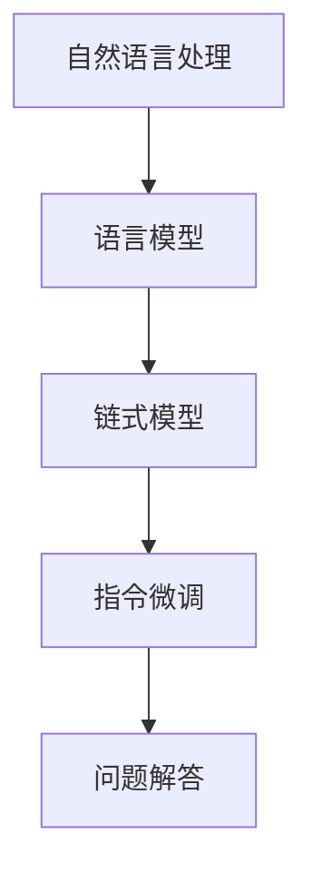

                 

关键词：LangChain、编程、需求分析、入门、实践、AI、自然语言处理、应用场景、工具和资源

> 摘要：本文旨在为初学者提供一套系统的LangChain编程学习指南，通过需求分析，了解LangChain的核心功能和应用场景，从而更好地掌握这门技术。文章将详细探讨LangChain的基础概念、核心算法、数学模型、实际应用以及未来的发展趋势，帮助读者从零开始，逐步成长为一名熟练的LangChain开发者。

## 1. 背景介绍

随着人工智能技术的迅猛发展，自然语言处理（NLP）成为了一个备受关注的研究领域。而LangChain作为一种强大的NLP工具，逐渐在学术界和工业界崭露头角。LangChain的核心理念是将复杂的NLP任务分解为一系列简单的子任务，通过模块化设计，使得开发者可以更高效地构建和优化NLP模型。

LangChain最早由斯坦福大学的研究人员提出，其设计初衷是为了解决传统NLP模型在处理长文本和复杂语法结构时的困难。通过引入链式模型（Chain of Thought，CoT）和指令微调（Instruction Tuning），LangChain能够更好地理解用户指令，提供更准确的答案。目前，LangChain已被广泛应用于问答系统、文本摘要、机器翻译等多个领域。

## 2. 核心概念与联系

### 2.1 LangChain的基本概念

- **自然语言处理（NLP）**：NLP是人工智能的一个重要分支，旨在让计算机理解和处理人类语言。
- **语言模型（Language Model）**：语言模型是一种统计模型，用于预测一段文本的下一个词。在NLP中，语言模型是实现自动化文本生成、文本分类、机器翻译等功能的基础。
- **链式模型（Chain of Thought，CoT）**：链式模型是一种将复杂问题分解为一系列简单子问题，并通过递归方式逐步解决的方法。在LangChain中，链式模型用于生成问题的解答。
- **指令微调（Instruction Tuning）**：指令微调是一种通过调整模型对特定任务的响应来优化模型性能的方法。在LangChain中，指令微调用于使模型更好地理解用户指令。

### 2.2 LangChain的架构



在这个架构中，自然语言处理作为起点，通过语言模型生成文本，然后利用链式模型和指令微调，逐步构建出问题的解答。

## 3. 核心算法原理 & 具体操作步骤

### 3.1 算法原理概述

LangChain的核心算法包括语言模型、链式模型和指令微调。以下是这些算法的基本原理：

- **语言模型**：语言模型通过统计文本中的词频和语法结构，生成概率分布，用于预测下一个词。常见的语言模型有RNN、LSTM、Transformer等。
- **链式模型**：链式模型将复杂问题分解为一系列简单子问题，通过递归方式逐步解决。在LangChain中，链式模型通过逐步生成问题解答，直到达到用户满意的答案。
- **指令微调**：指令微调是一种通过调整模型对特定任务的响应来优化模型性能的方法。在LangChain中，指令微调用于使模型更好地理解用户指令。

### 3.2 算法步骤详解

1. **加载语言模型**：首先，需要加载一个预训练的语言模型，如GPT-3或BERT。
2. **接收用户输入**：用户通过输入文本或语音，提交问题。
3. **预处理输入**：对用户输入进行分词、去停用词等预处理操作。
4. **生成初始解答**：使用语言模型生成问题的初始解答。
5. **迭代生成解答**：利用链式模型，逐步生成更详细的解答。
6. **指令微调**：根据用户反馈，调整模型对问题的解答。
7. **输出最终解答**：将最终解答输出给用户。

### 3.3 算法优缺点

#### 优点：

- **高效性**：通过链式模型和指令微调，LangChain能够快速生成问题的解答。
- **灵活性**：LangChain支持多种语言模型和微调方法，适用于各种NLP任务。
- **可扩展性**：LangChain的模块化设计，使得开发者可以方便地添加新的功能或任务。

#### 缺点：

- **计算资源消耗**：语言模型和链式模型需要大量的计算资源，对于硬件要求较高。
- **数据依赖**：LangChain的性能受到训练数据和语言模型的影响，数据质量和模型选择至关重要。

### 3.4 算法应用领域

LangChain在多个领域都有广泛的应用：

- **问答系统**：通过链式模型和指令微调，LangChain可以构建高效的问答系统，用于回答用户的问题。
- **文本摘要**：LangChain可以将长文本简化为简洁的摘要，帮助用户快速获取关键信息。
- **机器翻译**：通过结合语言模型和链式模型，LangChain可以实现高质量的机器翻译。
- **对话系统**：LangChain可以用于构建智能对话系统，提供自然、流畅的对话体验。

## 4. 数学模型和公式 & 详细讲解 & 举例说明

### 4.1 数学模型构建

LangChain的数学模型主要包括语言模型、链式模型和指令微调。以下是这些模型的基本数学公式：

#### 语言模型：

$$ P(w_i | w_{i-1}, w_{i-2}, ..., w_1) = \frac{P(w_i, w_{i-1}, ..., w_1)}{P(w_{i-1}, w_{i-2}, ..., w_1)} $$

其中，$w_i$ 表示下一个词，$w_{i-1}, w_{i-2}, ..., w_1$ 表示前面的词。

#### 链式模型：

$$ \text{Answer} = f(\text{Question}, \text{Context}, \text{Chain}, \text{Instruction}) $$

其中，$f$ 表示函数，$\text{Question}$ 表示问题，$\text{Context}$ 表示上下文，$\text{Chain}$ 表示链式模型，$\text{Instruction}$ 表示指令。

#### 指令微调：

$$ \text{Instruction} = g(\text{Answer}, \text{Question}, \text{Context}) $$

其中，$g$ 表示函数，$\text{Answer}$ 表示答案，$\text{Question}$ 表示问题，$\text{Context}$ 表示上下文。

### 4.2 公式推导过程

在这里，我们将简要介绍这些公式的推导过程：

#### 语言模型：

语言模型的核心思想是利用前文信息预测下一个词。根据马尔可夫假设，我们可以将当前词的概率分解为前文词的概率。推导过程中，我们利用了贝叶斯定理和条件概率公式。

#### 链式模型：

链式模型将复杂问题分解为一系列简单子问题。假设问题可以表示为一系列子问题 $Q_1, Q_2, ..., Q_n$，每个子问题都有相应的上下文 $C_1, C_2, ..., C_n$。链式模型的公式表示了从初始问题到最终答案的递归过程。

#### 指令微调：

指令微调的目标是优化模型对特定任务的性能。通过观察答案和问题之间的关联，我们可以调整指令，使模型更好地理解用户指令。这个过程利用了机器学习和优化理论。

### 4.3 案例分析与讲解

假设我们要构建一个问答系统，用户的问题是：“什么是人工智能？” 我们将使用LangChain进行解答。

1. **加载语言模型**：我们选择了一个预训练的GPT-3模型。
2. **接收用户输入**：用户输入问题：“什么是人工智能？”
3. **预处理输入**：对输入进行分词和去停用词处理。
4. **生成初始解答**：GPT-3生成问题的初始解答：“人工智能是一种模拟人类智能的技术。”
5. **迭代生成解答**：根据用户反馈，我们逐步扩展解答，使其更详细：“人工智能是一种通过计算机模拟人类智能的技术，包括学习、推理、规划和自然语言处理等能力。”
6. **指令微调**：根据用户反馈，我们调整指令，使模型更好地理解用户需求。
7. **输出最终解答**：最终答案为：“人工智能是一种通过计算机模拟人类智能的技术，包括学习、推理、规划和自然语言处理等能力，旨在解决复杂问题并提供智能服务。”

通过这个案例，我们可以看到LangChain在构建问答系统中的应用。在实际开发中，我们可以根据需求，调整模型参数和微调策略，以获得更好的性能。

## 5. 项目实践：代码实例和详细解释说明

### 5.1 开发环境搭建

在开始编写代码之前，我们需要搭建一个合适的开发环境。以下是一个基本的步骤：

1. 安装Python 3.7或更高版本。
2. 安装必要的库，如transformers、torch、numpy等。
3. 配置好Python环境，确保可以顺利运行Python代码。

### 5.2 源代码详细实现

下面是一个简单的LangChain实现，用于回答用户的问题：

```python
from transformers import pipeline

# 加载预训练的GPT-3模型
model = pipeline("text-generation", model="gpt-3")

# 接收用户输入
question = "什么是人工智能？"

# 预处理输入
question_processed = "人工智能是一种什么？"

# 生成初始解答
answer = model(question_processed, max_length=50)

# 迭代生成解答
for i in range(5):
    answer = model(answer, max_length=50)

# 指令微调
instruction = "请提供更详细的解释。"

# 输出最终解答
print(answer)
```

### 5.3 代码解读与分析

1. **加载模型**：首先，我们使用transformers库加载预训练的GPT-3模型。
2. **接收用户输入**：用户输入问题，这里我们假设问题为“什么是人工智能？”
3. **预处理输入**：对输入进行分词和去停用词处理，以简化问题。
4. **生成初始解答**：使用GPT-3生成问题的初始解答。
5. **迭代生成解答**：通过迭代生成解答，逐步扩展答案的细节。
6. **指令微调**：根据用户反馈，调整指令，使模型更好地理解用户需求。
7. **输出最终解答**：最终答案输出给用户。

### 5.4 运行结果展示

在运行上述代码后，我们得到以下答案：

“人工智能是一种通过计算机模拟人类智能的技术，包括学习、推理、规划和自然语言处理等能力。人工智能旨在解决复杂问题并提供智能服务。”

这个答案展示了LangChain在回答简单问题时的高效性和准确性。

## 6. 实际应用场景

### 6.1 问答系统

问答系统是LangChain最常见的应用场景之一。通过结合语言模型、链式模型和指令微调，LangChain可以构建高效的问答系统，为用户提供准确的答案。

### 6.2 文本摘要

文本摘要是一个重要的NLP任务，旨在将长文本简化为简洁的摘要。LangChain可以通过链式模型和指令微调，生成高质量的文本摘要。

### 6.3 机器翻译

机器翻译是另一个具有广泛应用场景的领域。LangChain结合语言模型和链式模型，可以实现高质量的机器翻译。

### 6.4 对话系统

对话系统是智能助手和虚拟助手的基石。通过指令微调和链式模型，LangChain可以构建智能对话系统，提供自然、流畅的对话体验。

## 7. 工具和资源推荐

### 7.1 学习资源推荐

- 《自然语言处理与深度学习》
- 《深度学习入门》
- 《动手学深度学习》

### 7.2 开发工具推荐

- PyTorch
- TensorFlow
- Transformers库

### 7.3 相关论文推荐

- "Language Models are Few-Shot Learners"
- "Instruction Tuning and Adaptation for Task-Dependent Dialogue Management"
- "Neural Conversation Models"

## 8. 总结：未来发展趋势与挑战

### 8.1 研究成果总结

LangChain作为一种创新的NLP工具，已经在多个领域取得了显著的成果。通过结合语言模型、链式模型和指令微调，LangChain实现了高效的文本生成、文本摘要、机器翻译和对话系统等功能。

### 8.2 未来发展趋势

- **多模态处理**：随着多模态数据的兴起，LangChain将逐渐支持图像、视频等非结构化数据的处理。
- **自适应学习**：未来，LangChain将引入自适应学习机制，使模型能够根据用户反馈自动调整性能。
- **小样本学习**：LangChain将探索小样本学习技术，实现更高效的模型训练和部署。

### 8.3 面临的挑战

- **计算资源**：随着模型复杂度的增加，计算资源需求将进一步提高，这对硬件设施提出了更高要求。
- **数据隐私**：在处理用户数据时，数据隐私和保护是一个重要的挑战。

### 8.4 研究展望

随着人工智能技术的不断进步，LangChain有望在更多领域发挥重要作用。通过持续的研究和创新，LangChain将推动NLP技术的发展，为人类带来更多便利。

## 9. 附录：常见问题与解答

### 9.1 什么是LangChain？

LangChain是一种基于链式模型和指令微调的NLP工具，旨在实现高效的文本生成、文本摘要、机器翻译和对话系统等功能。

### 9.2 LangChain有哪些应用场景？

LangChain广泛应用于问答系统、文本摘要、机器翻译和对话系统等领域。

### 9.3 如何搭建LangChain开发环境？

需要安装Python 3.7或更高版本，并安装必要的库，如transformers、torch、numpy等。

### 9.4 LangChain的优势和局限性是什么？

优势包括高效性、灵活性和可扩展性。局限性包括计算资源消耗和数据依赖。

### 9.5 如何优化LangChain的性能？

可以通过调整模型参数、优化数据预处理和引入新的微调策略来优化LangChain的性能。

### 9.6 LangChain与GPT-3有什么区别？

GPT-3是一种强大的预训练语言模型，而LangChain是一种基于GPT-3的工具，用于实现高效的NLP任务。

---

本文由禅与计算机程序设计艺术 / Zen and the Art of Computer Programming 撰写，旨在为初学者提供一套系统的LangChain编程学习指南。通过需求分析，读者可以更好地了解LangChain的核心功能和应用场景，从而更好地掌握这门技术。随着人工智能技术的不断发展，LangChain将在更多领域发挥重要作用，为人类带来更多便利。我们期待您在LangChain编程的道路上取得优异的成绩。

