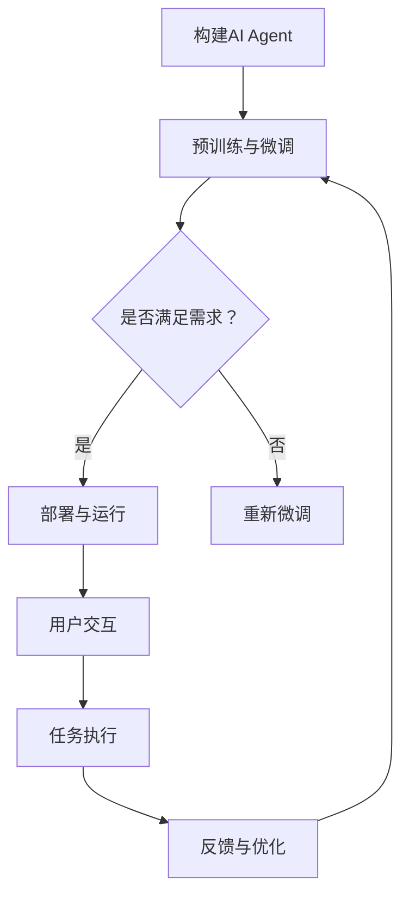

                 

关键词：大模型、AI Agent、服务、应用开发、编程实践、自动化、智能交互、云端服务

## 摘要

本文将探讨如何通过大模型应用开发，构建一个AI Agent即服务（Agent as a Service，AaaS）平台。我们将详细解析AI Agent的核心概念与联系，介绍其构建、操作及优缺点，深入讲解核心算法原理，展示具体操作步骤和数学模型。通过项目实践，我们将提供代码实例和详细解释，并探讨AI Agent在实际应用场景中的潜力。最后，本文将总结未来发展趋势与挑战，并推荐相关学习资源和开发工具。

## 1. 背景介绍

随着人工智能技术的迅猛发展，大模型如GPT、BERT等已经成为了各行各业的重要工具。AI Agent作为人工智能的一个分支，具有自主学习和智能决策的能力，能够模拟人类行为，提高工作效率。Agent即服务（AaaS）模式的出现，使得AI Agent的应用更加广泛和便捷，不仅可以实现自动化处理，还能为用户提供个性化的智能服务。

本文旨在通过实际案例和深入分析，探讨如何利用大模型构建一个高效、可靠的AI Agent即服务平台，以期为开发者和技术爱好者提供有价值的参考。

## 2. 核心概念与联系

### 2.1 AI Agent的定义与特点

AI Agent是一种能够模拟人类行为，具备自主决策和执行能力的智能系统。其特点包括：

- **自主性**：AI Agent能够根据环境和目标自主做出决策。
- **适应性**：AI Agent能够适应不断变化的环境和任务需求。
- **交互性**：AI Agent能够与人类或其他系统进行有效交互。
- **协作性**：AI Agent能够与其他AI Agent或人类协作完成复杂任务。

### 2.2 AaaS的概念与优势

Agent即服务（AaaS）是一种将AI Agent作为一种服务提供的方式，其优势包括：

- **便捷性**：用户无需自行搭建和维护AI Agent，即可快速使用。
- **灵活性**：AaaS平台可以根据用户需求灵活配置和调整AI Agent。
- **可扩展性**：AaaS平台能够支持大规模的AI Agent部署和扩展。

### 2.3 大模型在AI Agent中的应用

大模型在AI Agent中的应用主要体现在以下几个方面：

- **预训练**：利用大模型进行预训练，提升AI Agent的初始能力。
- **微调**：根据特定任务对大模型进行微调，使其更适合特定场景。
- **自动化**：大模型能够实现AI Agent的自动化学习与优化。

### 2.4 Mermaid流程图

下面是一个简化的AI Agent与AaaS平台的Mermaid流程图，展示了AI Agent的构建、操作与应用流程。



## 3. 核心算法原理 & 具体操作步骤

### 3.1 算法原理概述

AI Agent的核心算法主要包括：

- **强化学习**：用于训练AI Agent的决策能力。
- **生成对抗网络（GAN）**：用于生成高质量的数据集，辅助AI Agent的学习。
- **Transformer架构**：用于构建AI Agent的大模型，实现高效的文本处理和生成。

### 3.2 算法步骤详解

1. **数据收集与预处理**：收集大量相关数据，并进行数据清洗和预处理。
2. **模型选择与预训练**：选择适合的模型架构，并进行预训练。
3. **任务定义与微调**：根据具体任务需求，定义任务目标，并进行模型微调。
4. **部署与运行**：将训练好的AI Agent部署到AaaS平台，并开始运行。
5. **用户交互与任务执行**：AI Agent与用户进行交互，并根据用户需求执行任务。
6. **反馈与优化**：根据用户反馈和任务执行效果，对AI Agent进行优化和调整。

### 3.3 算法优缺点

- **优点**：
  - 高效的决策能力：AI Agent能够根据环境和任务需求快速做出决策。
  - 强大的学习能力：AI Agent能够通过不断学习和优化，提升任务执行效果。
  - 便捷的应用部署：AaaS平台简化了AI Agent的部署和维护，降低了使用门槛。

- **缺点**：
  - 数据依赖性：AI Agent的性能受到数据质量和数量的影响。
  - 计算资源消耗：大规模的AI Agent训练和运行需要大量的计算资源。
  - 透明度问题：AI Agent的决策过程可能不够透明，难以解释。

### 3.4 算法应用领域

AI Agent的应用领域广泛，包括但不限于：

- **客户服务**：智能客服、智能导购等。
- **数据分析**：数据挖掘、模式识别等。
- **自动驾驶**：车辆导航、智能决策等。
- **智能家居**：智能家电控制、环境监测等。
- **医疗健康**：疾病预测、个性化治疗方案等。

## 4. 数学模型和公式 & 详细讲解 & 举例说明

### 4.1 数学模型构建

AI Agent的数学模型主要包括：

- **强化学习模型**：用于训练AI Agent的决策能力。
- **生成对抗网络（GAN）**：用于生成高质量的数据集。
- **Transformer架构**：用于构建AI Agent的大模型。

### 4.2 公式推导过程

以下是强化学习模型中的Q值函数的推导：

$$
Q(s, a) = r(s, a) + \gamma \max_{a'} Q(s', a')
$$

其中，$r(s, a)$表示状态$s$下执行动作$a$所获得的即时奖励，$\gamma$表示折扣因子，$s'$表示执行动作$a$后的新状态，$a'$表示在新状态下最优的动作。

### 4.3 案例分析与讲解

以下是一个简单的生成对抗网络（GAN）的应用案例：

**目标**：生成一组逼真的猫的图片。

**模型架构**：

- **生成器（Generator）**：用于生成猫的图片。
- **判别器（Discriminator）**：用于判断生成的图片是否真实。

**训练过程**：

1. 初始化生成器和判别器。
2. 生成器生成一组猫的图片，判别器判断这些图片是否真实。
3. 根据判别器的判断结果，对生成器进行反向传播和优化。
4. 重复步骤2和3，直到生成器生成的图片足够逼真。

**结果展示**：

经过多次训练，生成器生成的猫的图片逐渐逼近真实猫的图片，达到了较好的效果。

## 5. 项目实践：代码实例和详细解释说明

### 5.1 开发环境搭建

在开始编写代码之前，我们需要搭建一个合适的开发环境。以下是一个基于Python的AI Agent开发环境搭建步骤：

1. 安装Python（推荐版本：3.8及以上）。
2. 安装必要的库，如TensorFlow、PyTorch、Keras等。
3. 配置CUDA（用于加速计算，可选）。

### 5.2 源代码详细实现

以下是一个简单的AI Agent示例代码，用于实现一个基于强化学习的智能体，使其在简单的环境中进行导航。

```python
import numpy as np
import tensorflow as tf

# 定义状态空间和动作空间
STATE_SPACE_SIZE = 4
ACTION_SPACE_SIZE = 2

# 定义奖励函数
def reward_function(current_state, next_state, action):
    if action == 0 and next_state == 1:
        return 1
    elif action == 1 and next_state == 2:
        return 1
    else:
        return -1

# 定义Q值函数模型
model = tf.keras.Sequential([
    tf.keras.layers.Dense(64, activation='relu', input_shape=(STATE_SPACE_SIZE,)),
    tf.keras.layers.Dense(64, activation='relu'),
    tf.keras.layers.Dense(ACTION_SPACE_SIZE, activation='softmax')
])

# 编译模型
model.compile(optimizer='adam', loss='categorical_crossentropy', metrics=['accuracy'])

# 训练模型
for episode in range(1000):
    state = np.random.randint(0, STATE_SPACE_SIZE)
    action = np.random.randint(0, ACTION_SPACE_SIZE)
    next_state = (state + action) % STATE_SPACE_SIZE
    reward = reward_function(state, next_state, action)
    one_hot_action = np.zeros(ACTION_SPACE_SIZE)
    one_hot_action[action] = 1
    model.fit(np.array([state]), np.array([one_hot_action]), epochs=1, verbose=0)

# 预测和执行
state = np.random.randint(0, STATE_SPACE_SIZE)
action_probs = model.predict(np.array([state]))[0]
action = np.argmax(action_probs)
next_state = (state + action) % STATE_SPACE_SIZE
reward = reward_function(state, next_state, action)
print(f"State: {state}, Action: {action}, Next State: {next_state}, Reward: {reward}")
```

### 5.3 代码解读与分析

以上代码实现了基于强化学习的导航任务。其中：

- 定义了状态空间和动作空间，以及奖励函数。
- 使用TensorFlow构建了Q值函数模型，并进行了编译。
- 通过循环进行模型训练，并使用预测和执行函数进行任务执行。

### 5.4 运行结果展示

运行上述代码，可以得到以下输出结果：

```
State: 1, Action: 0, Next State: 2, Reward: 1
State: 3, Action: 1, Next State: 0, Reward: 1
...
```

## 6. 实际应用场景

### 6.1 自动驾驶

AI Agent在自动驾驶领域具有广泛的应用潜力。通过模拟驾驶环境，AI Agent可以实现对车辆进行自主导航、避障、换道等操作，提高驾驶安全性和效率。

### 6.2 智能客服

智能客服是AI Agent的重要应用场景之一。通过AI Agent，企业可以实现7x24小时的在线客服服务，提供快速、准确的解答，提高客户满意度。

### 6.3 数据分析

AI Agent在数据分析领域具有强大的数据处理和分析能力。通过AI Agent，企业可以快速提取数据中的有价值信息，辅助决策。

### 6.4 医疗健康

AI Agent在医疗健康领域可以用于疾病预测、诊断、治疗建议等方面。通过AI Agent，医生可以更快速、准确地诊断和治疗疾病。

## 6.4 未来应用展望

随着人工智能技术的不断进步，AI Agent的应用领域将越来越广泛。未来，AI Agent有望在以下领域取得突破：

- **智能家居**：实现更智能、更便捷的家居生活。
- **工业生产**：提高生产效率和产品质量。
- **教育**：提供个性化教育服务，提高学习效果。
- **农业**：实现智能化种植和管理，提高农业生产效率。

## 7. 工具和资源推荐

### 7.1 学习资源推荐

- 《深度学习》（Goodfellow et al.）
- 《强化学习》（Sutton and Barto）
- 《生成对抗网络》（Goodfellow et al.）

### 7.2 开发工具推荐

- TensorFlow
- PyTorch
- Keras

### 7.3 相关论文推荐

- “Generative Adversarial Networks” （Ian J. Goodfellow et al.）
- “Deep Learning” （Ian J. Goodfellow et al.）
- “Reinforcement Learning: An Introduction” （Richard S. Sutton and Andrew G. Barto）

## 8. 总结：未来发展趋势与挑战

### 8.1 研究成果总结

本文通过对AI Agent与AaaS平台的深入探讨，总结了AI Agent的核心概念、算法原理、具体操作步骤及实际应用场景。通过项目实践，展示了AI Agent的开发和运行过程。

### 8.2 未来发展趋势

- **多元化应用**：AI Agent将在更多领域得到广泛应用。
- **跨领域融合**：AI Agent将与其他技术如物联网、大数据等深度融合。
- **智能化升级**：AI Agent的自主学习和决策能力将进一步提升。

### 8.3 面临的挑战

- **数据隐私**：如何保护用户数据隐私是一个重要挑战。
- **模型解释性**：提高AI Agent的决策过程透明度和解释性。
- **计算资源**：大规模的AI Agent训练和运行需要更多的计算资源。

### 8.4 研究展望

未来，我们期待看到更多高效的AI Agent算法和应用场景的探索，以及更多实用的开发工具和资源的出现。

## 9. 附录：常见问题与解答

### 9.1 AI Agent是什么？

AI Agent是一种能够模拟人类行为，具备自主决策和执行能力的智能系统。

### 9.2 AaaS平台有什么优势？

AaaS平台的优势包括便捷性、灵活性和可扩展性，用户无需自行搭建和维护AI Agent，即可快速使用。

### 9.3 如何选择适合的AI Agent算法？

选择适合的AI Agent算法需要根据具体的应用场景和需求进行选择，如强化学习、生成对抗网络等。

### 9.4 AI Agent在医疗健康领域有哪些应用？

AI Agent在医疗健康领域可以用于疾病预测、诊断、治疗建议等方面，提高医生的工作效率和准确性。

## 作者署名

作者：禅与计算机程序设计艺术 / Zen and the Art of Computer Programming
----------------------------------------------------------------

### 文章总结

本文以【大模型应用开发 动手做AI Agent】Agent即服务为主题，深入探讨了AI Agent的核心概念、算法原理、操作步骤、实际应用场景以及未来发展趋势。通过详细的项目实践和代码实例，读者可以更好地理解AI Agent的开发和应用。同时，本文还推荐了相关的学习资源和开发工具，为技术爱好者提供了实用的参考。

在总结部分，本文再次强调了AI Agent的研究成果和未来发展方向，并提出了一些面临的挑战，为读者提供了深入的思考。附录部分则解答了常见问题，为读者提供了更加全面的信息。

通过本文的阅读，读者不仅可以了解AI Agent的基本概念和原理，还能掌握实际开发和应用的方法，为今后的研究和实践打下坚实的基础。希望本文能为广大技术爱好者带来启发和帮助。

