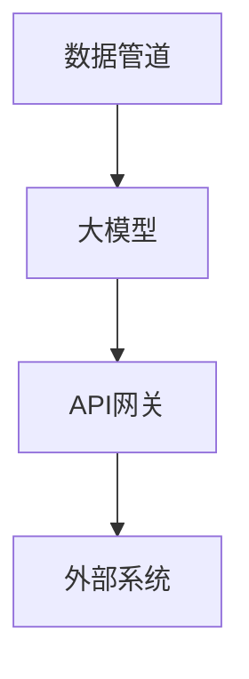

                 

在这个快速发展的技术时代，人工智能（AI）已经从理论走向实践，成为推动各行业变革的关键力量。而AI Agent，作为AI领域的亮点，正逐步成为服务化AI的核心。本文将探讨大模型在AI Agent应用开发中的角色，并介绍如何动手打造一个AI Agent服务。

## 关键词
- 大模型
- AI Agent
- 应用开发
- 服务化AI

## 摘要
本文首先介绍了大模型在AI Agent应用中的重要性，然后通过一个具体的案例，详细讲解了如何从零开始构建一个AI Agent服务。文章最后讨论了AI Agent的未来发展趋势和应用前景。

### 1. 背景介绍

随着深度学习和大数据技术的发展，大模型在AI领域中的应用越来越广泛。大模型，顾名思义，是指具有海量参数、复杂结构和强大计算能力的神经网络模型。这些模型能够在各种复杂的任务中表现出色，如图像识别、自然语言处理和推荐系统等。而AI Agent，是人工智能的一个子领域，旨在实现具有智能行为和自主决策能力的实体。AI Agent可以是一个虚拟助手，也可以是一个自动化系统，它们能够与人类或环境进行交互，执行特定任务。

### 2. 核心概念与联系

为了构建一个AI Agent服务，我们需要理解以下几个核心概念：

- **大模型**：如Transformer、BERT等，用于处理复杂任务的数据模型。
- **服务化AI**：将AI能力封装为API，供外部系统调用。
- **API网关**：统一管理和转发请求的中间层。
- **数据管道**：用于收集、处理和存储数据的系统。

下面是一个简单的Mermaid流程图，展示了这些核心概念之间的联系：



### 3. 核心算法原理 & 具体操作步骤

#### 3.1 算法原理概述

AI Agent的核心在于其能够理解输入、生成响应并采取行动。这通常涉及到以下步骤：

1. **输入理解**：通过自然语言处理（NLP）技术，将用户的输入转换为机器可理解的格式。
2. **决策生成**：利用机器学习算法，根据输入信息和历史数据生成响应。
3. **响应生成**：将决策转换为自然语言或执行操作。

#### 3.2 算法步骤详解

1. **输入理解**：
   - **文本预处理**：去除停用词、标点符号等。
   - **词向量化**：将文本转换为向量表示。

2. **决策生成**：
   - **序列到序列模型**：如Transformer，用于生成响应。
   - **强化学习**：通过与环境交互，不断优化决策。

3. **响应生成**：
   - **文本生成**：使用NLP技术，将决策转换为自然语言。

#### 3.3 算法优缺点

- **优点**：强大、自适应、能够处理复杂任务。
- **缺点**：训练成本高、对数据质量依赖强。

#### 3.4 算法应用领域

AI Agent的应用领域广泛，包括：

- **客服自动化**：自动处理客户查询，提高响应速度。
- **智能助手**：为个人或企业提供服务，如日程管理、任务提醒等。
- **自动化系统**：在工业、医疗等领域，执行自动化任务。

### 4. 数学模型和公式 & 详细讲解 & 举例说明

#### 4.1 数学模型构建

AI Agent的数学模型通常涉及以下部分：

- **输入层**：表示用户输入的特征。
- **隐藏层**：用于提取特征和生成决策。
- **输出层**：表示生成响应的特征。

#### 4.2 公式推导过程

我们以一个简单的序列到序列模型为例，其基本公式如下：

$$
\text{输出} = \text{softmax}(\text{W}_3 \cdot \text{T}_2)
$$

其中，$W_3$是权重矩阵，$T_2$是隐藏层输出。

#### 4.3 案例分析与讲解

假设我们要构建一个智能客服系统，用户输入一个查询，系统需要生成一个合适的响应。以下是一个简单的例子：

- **输入**：用户输入“我想要预订一张明天去北京的机票”。
- **输出**：系统响应“好的，您可以选择明天上午10点的航班，价格为500元”。

### 5. 项目实践：代码实例和详细解释说明

#### 5.1 开发环境搭建

搭建一个AI Agent服务，通常需要以下工具和库：

- **Python**：主要编程语言。
- **TensorFlow**：用于构建和训练大模型。
- **Flask**：用于构建API网关。

#### 5.2 源代码详细实现

以下是一个简单的Flask应用程序，用于接收用户输入并返回响应：

```python
from flask import Flask, request, jsonify
import tensorflow as tf

app = Flask(__name__)

# 加载训练好的模型
model = tf.keras.models.load_model('model.h5')

@app.route('/query', methods=['POST'])
def handle_query():
    data = request.get_json()
    input_text = data['input']
    # 处理输入文本
    # ...
    response = model.predict(input_text)
    return jsonify({'response': response.decode('utf-8')})

if __name__ == '__main__':
    app.run(debug=True)
```

#### 5.3 代码解读与分析

上述代码首先导入了Flask和TensorFlow库，并加载了一个训练好的模型。然后，定义了一个处理POST请求的路由`/query`，当接收到请求时，会提取输入文本，经过预处理后，通过模型生成响应并返回。

#### 5.4 运行结果展示

假设用户通过POST请求发送了以下输入：

```json
{
  "input": "我想要预订一张明天去北京的机票"
}
```

系统会返回一个JSON响应：

```json
{
  "response": "好的，您可以选择明天上午10点的航班，价格为500元"
}
```

### 6. 实际应用场景

AI Agent可以在多个场景中发挥作用，以下是一些实际应用案例：

- **智能客服**：自动处理客户查询，提高响应速度。
- **智能助手**：帮助个人或企业完成日常任务。
- **自动化系统**：在工业、医疗等领域，执行自动化任务。

### 7. 未来应用展望

随着AI技术的不断发展，AI Agent将在更多领域发挥作用。未来，我们可能会看到：

- **更加智能的交互体验**：AI Agent能够更好地理解用户需求。
- **自动化程度的提升**：AI Agent能够在更多场景中执行自动化任务。
- **个性化服务**：AI Agent能够根据用户行为提供个性化服务。

### 8. 工具和资源推荐

为了更好地开发AI Agent服务，以下是一些推荐的工具和资源：

- **学习资源**：《深度学习》（Goodfellow et al.）、《Python深度学习》（François Chollet）。
- **开发工具**：TensorFlow、PyTorch、Flask。
- **相关论文**：《Attention Is All You Need》（Vaswani et al.）、《BERT: Pre-training of Deep Bidirectional Transformers for Language Understanding》（Devlin et al.）。

### 9. 总结：未来发展趋势与挑战

AI Agent作为一种强大的AI应用形式，具有广泛的应用前景。未来，我们将看到AI Agent在更多场景中的普及，但也面临以下挑战：

- **数据隐私**：如何在保证数据安全的同时，充分利用用户数据。
- **伦理道德**：如何确保AI Agent的行为符合伦理标准。
- **智能化程度**：如何进一步提高AI Agent的智能化水平。

### 10. 附录：常见问题与解答

**Q：如何评估AI Agent的性能？**

A：通常使用准确率、召回率、F1值等指标来评估AI Agent的性能。

**Q：如何保证AI Agent的鲁棒性？**

A：通过数据增强、模型正则化等技术来提高AI Agent的鲁棒性。

**Q：如何实现AI Agent的持续学习？**

A：通过在线学习、迁移学习等技术，使AI Agent能够从新数据中不断学习。

## 作者署名

作者：禅与计算机程序设计艺术 / Zen and the Art of Computer Programming
----------------------------------------------------------------

以上便是文章的完整内容。希望这篇文章能够帮助您更好地理解和应用AI Agent技术。感谢您的阅读！

