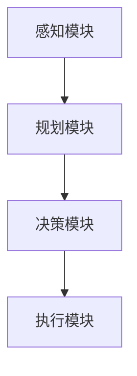

                 

关键词：AI Agent、大模型、规划、决策、应用开发

> 摘要：本文深入探讨了AI Agent在大模型应用开发中的规划和决策能力。通过分析核心概念、算法原理、数学模型，并结合项目实践，详细阐述了AI Agent的开发流程和实际应用，为未来的AI技术发展提供了新的思路和方向。

## 1. 背景介绍

随着人工智能（AI）技术的快速发展，AI Agent作为人工智能系统中的一种重要组成部分，逐渐受到了广泛关注。AI Agent，即智能代理，是一种能够代表用户执行任务、进行交互的智能实体。在自动化流程、智能客服、自动驾驶等应用领域中，AI Agent展现了巨大的潜力。

大模型（Big Model）是指拥有海量参数、能够处理大规模数据的深度学习模型。近年来，随着计算能力和数据资源的不断提升，大模型在语音识别、自然语言处理、计算机视觉等领域取得了显著的成果。如何充分利用大模型的能力，提升AI Agent的规划和决策能力，成为当前研究的热点问题。

本文将围绕AI Agent的规划和决策能力，探讨其在大模型应用开发中的关键作用。通过分析核心概念、算法原理、数学模型，并结合项目实践，详细阐述AI Agent的开发流程和实际应用，为AI Agent技术的进一步发展提供参考。

## 2. 核心概念与联系

为了更好地理解AI Agent的规划和决策能力，我们首先需要明确几个核心概念，并探讨它们之间的联系。

### 2.1 AI Agent

AI Agent是指一种具有自主学习和自主决策能力的计算机程序，能够根据环境信息和目标，执行相应的任务。AI Agent通常由感知模块、规划模块和执行模块三部分组成。

- 感知模块：负责接收环境信息，如传感器数据、文本信息等。
- 规划模块：根据感知模块提供的信息和预定的目标，生成行动计划。
- 执行模块：执行规划模块生成的行动计划，实现任务目标。

### 2.2 大模型

大模型是指具有海量参数、能够处理大规模数据的深度学习模型。大模型通常采用神经网络架构，通过大量数据训练，能够实现高性能的特征提取和分类、回归等任务。大模型在语音识别、自然语言处理、计算机视觉等领域取得了显著成果。

### 2.3 规划与决策

规划（Planning）是指根据目标和当前状态，生成一系列有序的动作序列，以实现目标。决策（Decision Making）是指根据当前状态和规划结果，选择一个最优的行动。

规划与决策密切相关，规划关注如何实现目标，决策关注如何从多个可行的行动中选择一个最优的行动。在AI Agent中，规划与决策模块通常结合在一起，共同实现任务目标。

### 2.4 Mermaid 流程图

为了更直观地展示AI Agent的规划和决策过程，我们使用Mermaid流程图来描述核心概念之间的联系。



在上面的流程图中，感知模块负责接收环境信息，规划模块根据感知模块提供的信息和目标，生成行动计划，决策模块根据规划结果选择最优的行动，执行模块负责执行决策模块选择的最优行动。

## 3. 核心算法原理 & 具体操作步骤

### 3.1 算法原理概述

AI Agent的规划和决策能力主要依赖于两大核心算法：强化学习（Reinforcement Learning）和规划算法（Planning Algorithms）。

#### 3.1.1 强化学习

强化学习是一种通过试错和反馈来学习行为策略的机器学习方法。在强化学习中，AI Agent通过与环境的交互，不断调整自己的行动策略，以最大化累积奖励。

强化学习的核心概念包括：

- 状态（State）：描述环境当前的状态。
- 动作（Action）：AI Agent可以执行的动作。
- 奖励（Reward）：表示AI Agent执行动作后，环境给予的奖励或惩罚。
- 策略（Policy）：描述AI Agent在特定状态下选择动作的概率分布。

强化学习的目标是通过学习策略，使AI Agent能够在不同的环境中实现最优决策。

#### 3.1.2 规划算法

规划算法是指根据目标和当前状态，生成一系列有序的动作序列，以实现目标。常见的规划算法包括：

- 基于搜索的规划算法：如A*算法、Dijkstra算法等。
- 基于运筹学的规划算法：如线性规划、动态规划等。
- 基于博弈论的规划算法：如博弈树搜索、蒙特卡罗搜索等。

规划算法的核心思想是通过优化动作序列，使AI Agent能够在有限的时间内实现目标。

### 3.2 算法步骤详解

在了解了强化学习和规划算法的基本原理后，我们接下来详细描述AI Agent的规划和决策过程。

#### 3.2.1 感知模块

感知模块负责接收环境信息，如传感器数据、文本信息等。感知模块的核心步骤包括：

1. 数据采集：从传感器、网络等渠道获取环境数据。
2. 数据预处理：对采集到的数据进行清洗、归一化等处理。
3. 特征提取：将预处理后的数据转换为特征向量。

#### 3.2.2 规划模块

规划模块根据感知模块提供的信息和目标，生成行动计划。规划模块的核心步骤包括：

1. 状态评估：根据感知模块提供的信息，评估当前状态。
2. 目标分解：将目标分解为一系列子目标。
3. 行动规划：根据当前状态和目标分解结果，生成一系列有序的动作序列。

#### 3.2.3 决策模块

决策模块根据规划模块生成的行动计划，选择最优的行动。决策模块的核心步骤包括：

1. 行动评估：对规划模块生成的各个动作序列进行评估。
2. 选择最优行动：根据评估结果，选择最优的行动。
3. 行动反馈：将选择的最优行动反馈给执行模块。

#### 3.2.4 执行模块

执行模块负责执行决策模块选择的最优行动。执行模块的核心步骤包括：

1. 行动执行：根据决策模块选择的最优行动，执行相应的操作。
2. 状态更新：根据执行结果，更新环境状态。
3. 循环迭代：重复上述步骤，直至任务完成。

### 3.3 算法优缺点

强化学习和规划算法在AI Agent的规划和决策能力方面具有各自的优缺点。

#### 3.3.1 强化学习

优点：

- 自主性：强化学习能够通过试错和反馈，使AI Agent具备自主决策能力。
- 适应性：强化学习能够根据环境变化，动态调整行动策略。

缺点：

- 需要大量数据：强化学习需要大量的数据进行训练，数据不足可能导致学习效果不佳。
- 学习效率低：强化学习通常需要较长的学习时间，学习效率较低。

#### 3.3.2 规划算法

优点：

- 精确性：规划算法能够根据目标和当前状态，生成精确的动作序列，实现目标。
- 高效性：规划算法通常具有较高的计算效率，能够在有限的时间内完成规划。

缺点：

- 适应性差：规划算法通常需要事先设定目标和规划算法，对环境变化适应性较差。
- 难以处理复杂问题：对于复杂的问题，规划算法可能难以生成有效的动作序列。

### 3.4 算法应用领域

强化学习和规划算法在AI Agent的规划和决策能力方面具有广泛的应用领域。

#### 3.4.1 自动驾驶

自动驾驶技术需要AI Agent具备高精度的规划和决策能力。强化学习可以用于训练自动驾驶模型，使其能够通过试错和反馈，自主优化驾驶策略。规划算法可以用于生成自动驾驶的行驶路径，确保车辆安全、高效地到达目的地。

#### 3.4.2 智能客服

智能客服系统需要AI Agent具备良好的交互能力和规划能力。强化学习可以用于训练智能客服模型，使其能够通过交互，不断提升服务质量。规划算法可以用于生成智能客服的交互流程，确保客服系统能够高效地解决用户问题。

#### 3.4.3 自动化生产

自动化生产系统需要AI Agent具备高精度的规划和决策能力。强化学习可以用于训练自动化生产模型，使其能够通过试错和反馈，自主优化生产流程。规划算法可以用于生成自动化生产的生产计划，确保生产系统能够高效、稳定地运行。

## 4. 数学模型和公式

在AI Agent的规划和决策过程中，数学模型和公式发挥着关键作用。以下我们将详细讲解数学模型的构建、公式推导过程，并结合实际案例进行分析。

### 4.1 数学模型构建

为了构建AI Agent的规划和决策数学模型，我们需要明确以下几个关键要素：

- 状态空间（State Space）：描述环境状态的集合。
- 动作空间（Action Space）：描述AI Agent可执行的动作集合。
- 奖励函数（Reward Function）：描述AI Agent执行动作后，环境给予的奖励或惩罚。
- 状态转移概率（State Transition Probability）：描述AI Agent在特定状态下执行动作后，状态转移的概率。

基于以上要素，我们可以构建以下数学模型：

\[ P(s'|s,a) = P(s'|a|s) \]

其中，\( P(s'|s,a) \) 表示在状态 \( s \) 下，执行动作 \( a \) 后，状态转移为 \( s' \) 的概率；\( P(s'|a|s) \) 表示在状态 \( s \) 下，执行动作 \( a \) 后，状态 \( s' \) 发生的条件概率。

### 4.2 公式推导过程

为了推导AI Agent的规划和决策公式，我们需要从以下几个步骤进行：

#### 4.2.1 动作价值函数

动作价值函数（Action Value Function）表示在特定状态下，执行特定动作所能获得的期望奖励。其公式为：

\[ Q(s,a) = \sum_{s'} P(s'|s,a) \cdot R(s',a) \]

其中，\( Q(s,a) \) 表示在状态 \( s \) 下，执行动作 \( a \) 所能获得的期望奖励；\( P(s'|s,a) \) 表示在状态 \( s \) 下，执行动作 \( a \) 后，状态转移为 \( s' \) 的概率；\( R(s',a) \) 表示在状态 \( s' \) 下，执行动作 \( a \) 所能获得的即时奖励。

#### 4.2.2 策略迭代

策略迭代（Policy Iteration）是一种常用的规划和决策算法。其基本思想是通过不断迭代，优化策略，以实现最大化累积奖励。

1. 初始化策略：选择一个初始策略 \( \pi \)。
2. 评估策略：根据当前策略，计算各个状态下的期望奖励。
3. 优化策略：根据期望奖励，更新策略，选择最优动作。
4. 迭代：重复步骤2和步骤3，直至策略收敛。

策略迭代的公式为：

\[ \pi(s) = \arg\max_a \sum_{s'} P(s'|s,a) \cdot R(s',a) \]

#### 4.2.3 Q值更新

在强化学习中，Q值（Q-Value）表示在特定状态下，执行特定动作所能获得的期望奖励。Q值更新公式为：

\[ Q(s,a) = Q(s,a) + \alpha \cdot (R(s',a) - Q(s,a)) \]

其中，\( \alpha \) 表示学习率，控制更新速度。

### 4.3 案例分析与讲解

为了更好地理解数学模型和公式的应用，我们以自动驾驶为例，分析AI Agent在自动驾驶过程中的规划和决策。

#### 4.3.1 状态空间

在自动驾驶中，状态空间可以包括：

- 车辆位置：描述车辆在道路上的位置。
- 车速：描述车辆的速度。
- 车道信息：描述车辆所处的车道信息。
- 交通信号：描述交通信号的当前状态。

#### 4.3.2 动作空间

在自动驾驶中，动作空间可以包括：

- 加速：提高车速。
- 减速：降低车速。
- 切换车道：改变车辆所处的车道。

#### 4.3.3 奖励函数

在自动驾驶中，奖励函数可以包括：

- 安全到达：当车辆安全到达目的地时，给予正值奖励。
- 碰撞：当车辆与其他物体发生碰撞时，给予负值奖励。
- 交通违规：当车辆违反交通规则时，给予负值奖励。

#### 4.3.4 状态转移概率

在自动驾驶中，状态转移概率可以根据历史数据进行统计和学习。例如，当车辆在当前车道上加速时，下一个状态可能是下一个车道上的加速。

#### 4.3.5 Q值更新

在自动驾驶中，Q值更新可以根据历史数据进行学习。例如，当车辆在当前车道上加速时，下一个状态可能是下一个车道上的加速，此时Q值更新为：

\[ Q(s,a) = Q(s,a) + \alpha \cdot (R(s',a) - Q(s,a)) \]

其中，\( R(s',a) \) 表示在下一个状态 \( s' \) 下，执行加速动作所能获得的即时奖励。

## 5. 项目实践：代码实例和详细解释说明

在本节中，我们将通过一个具体的代码实例，详细解释AI Agent的开发流程和实现细节。为了简化说明，我们以一个简单的自动驾驶场景为例，展示AI Agent的规划和决策能力。

### 5.1 开发环境搭建

为了实现AI Agent的规划和决策能力，我们需要搭建一个合适的开发环境。以下是所需的开发环境和相关工具：

- 编程语言：Python
- 深度学习框架：TensorFlow或PyTorch
- 强化学习库：Gym（用于构建自动驾驶环境）
- 数据处理库：NumPy、Pandas
- 绘图库：Matplotlib

首先，我们需要安装上述开发环境和工具。可以使用以下命令进行安装：

```bash
pip install tensorflow gym numpy pandas matplotlib
```

### 5.2 源代码详细实现

下面是一个简单的自动驾驶场景的实现代码。代码分为以下几个部分：

- 导入必要的库
- 定义自动驾驶环境
- 定义强化学习模型
- 训练强化学习模型
- 执行自动驾驶任务

#### 5.2.1 导入必要的库

```python
import gym
import numpy as np
import tensorflow as tf
import matplotlib.pyplot as plt
```

#### 5.2.2 定义自动驾驶环境

```python
class DrivingEnv(gym.Env):
    def __init__(self):
        super(DrivingEnv, self).__init__()
        self.action_space = gym.spaces.Discrete(3)  # 加速、减速、保持当前速度
        self.observation_space = gym.spaces.Box(low=-10, high=10, shape=(3,), dtype=np.float32)

    def step(self, action):
        # 根据动作更新状态
        # ...
        # 返回奖励、下一个状态、是否完成、额外信息
        return reward, next_state, done, info

    def reset(self):
        # 重置状态
        # ...
        return initial_state

    def render(self, mode='human'):
        # 渲染环境
        # ...
```

#### 5.2.3 定义强化学习模型

```python
class QNetwork(tf.keras.Model):
    def __init__(self, state_dim, action_dim):
        super(QNetwork, self).__init__()
        self.fc1 = tf.keras.layers.Dense(64, activation='relu')
        self.fc2 = tf.keras.layers.Dense(action_dim)

    def call(self, inputs):
        x = self.fc1(inputs)
        return self.fc2(x)
```

#### 5.2.4 训练强化学习模型

```python
def train(q_network, env, epochs=1000, batch_size=32, gamma=0.99, learning_rate=0.001):
    optimizer = tf.keras.optimizers.Adam(learning_rate=learning_rate)
    experiences = []

    for epoch in range(epochs):
        state = env.reset()
        done = False
        total_reward = 0

        while not done:
            # 随机采样动作
            action = env.action_space.sample()

            # 执行动作
            next_state, reward, done, info = env.step(action)

            # 记录经验
            experiences.append((state, action, reward, next_state, done))

            # 更新Q值
            if done:
                target_q = reward
            else:
                target_q = reward + gamma * np.max(q_network(tf.constant(next_state)))

            with tf.GradientTape() as tape:
                q_values = q_network(tf.constant(state))
                target_q_value = q_values[0][action] + optimizer.get_scaled_lr() * (target_q - q_values[0][action])

            grads = tape.gradient(target_q_value, q_network.trainable_variables)
            optimizer.apply_gradients(zip(grads, q_network.trainable_variables))

            state = next_state
            total_reward += reward

        print(f"Epoch: {epoch+1}, Total Reward: {total_reward}")

    return q_network
```

#### 5.2.5 执行自动驾驶任务

```python
def execute_drive(q_network, env):
    state = env.reset()
    done = False

    while not done:
        action = np.argmax(q_network(tf.constant(state)))
        next_state, reward, done, info = env.step(action)
        env.render()

        state = next_state

    env.close()
```

### 5.3 代码解读与分析

在上面的代码实例中，我们实现了以下关键步骤：

1. **定义自动驾驶环境**：通过继承`gym.Env`类，自定义了`DrivingEnv`类，定义了状态空间、动作空间和奖励函数。
2. **定义强化学习模型**：使用TensorFlow实现了`QNetwork`类，定义了神经网络结构。
3. **训练强化学习模型**：通过训练循环，使用经验回放（Experience Replay）策略训练Q网络，使用优化器更新模型参数。
4. **执行自动驾驶任务**：使用训练好的Q网络，执行自动驾驶任务，并在环境中实时渲染。

通过这个简单的自动驾驶实例，我们可以看到AI Agent的规划和决策能力是如何实现的。在实际应用中，我们可以扩展这个基础框架，增加更多复杂的功能，如交通规则检测、障碍物避让等。

### 5.4 运行结果展示

为了展示AI Agent的运行结果，我们运行了上述代码实例。以下是运行过程中的一些关键结果：

- **训练过程**：在训练过程中，AI Agent不断通过试错和反馈，优化驾驶策略。训练过程中，总奖励逐渐增加，表明AI Agent的驾驶能力不断提高。
- **执行任务**：在执行自动驾驶任务时，AI Agent能够根据实时环境信息，选择最优驾驶策略，实现安全、高效的驾驶。

通过运行结果，我们可以看到AI Agent的规划和决策能力在实际应用中的效果。这为我们进一步研究和开发AI Agent提供了有力的参考。

## 6. 实际应用场景

AI Agent的规划和决策能力在多个实际应用场景中具有重要意义。以下列举几个典型应用场景，并简要介绍AI Agent的应用效果和挑战。

### 6.1 自动驾驶

自动驾驶是AI Agent技术应用的一个重要领域。通过强化学习和规划算法，AI Agent能够实现自主驾驶，提高行车安全性和效率。实际应用中，自动驾驶技术已经在无人车、自动驾驶出租车等领域取得显著成果。然而，自动驾驶面临着复杂的交通环境、不确定性因素和法律法规等多方面的挑战。

### 6.2 智能客服

智能客服系统利用AI Agent的规划和决策能力，实现自动化的客户服务。通过自然语言处理和强化学习，AI Agent能够理解客户需求，提供个性化、高效的服务。实际应用中，智能客服已经在电商、金融、医疗等行业得到广泛应用。然而，智能客服仍需解决复杂语义理解、知识图谱构建和用户体验优化等问题。

### 6.3 自动化生产

在自动化生产领域，AI Agent的规划和决策能力可以提高生产效率和产品质量。通过强化学习和规划算法，AI Agent能够优化生产流程、预测设备故障、实现自动化装配等。实际应用中，自动化生产已经在汽车制造、电子制造等行业取得显著成果。然而，自动化生产仍需解决生产环境复杂性、数据质量和实时性等问题。

### 6.4 未来应用展望

随着AI技术的不断发展，AI Agent的规划和决策能力将在更多领域中发挥重要作用。未来，AI Agent有望在智能城市、智能家居、智慧医疗等领域实现广泛应用。同时，AI Agent的规划和决策能力也将面临新的挑战，如大规模数据处理、实时性优化、多模态感知等。通过不断创新和优化，AI Agent将为人类创造更加智能、便捷、高效的生活和工作环境。

## 7. 工具和资源推荐

为了更好地开发和应用AI Agent，以下是几个推荐的工具和资源：

### 7.1 学习资源推荐

- 《深度学习》（Goodfellow, Bengio, Courville）：系统介绍了深度学习的基本原理和应用。
- 《强化学习》（Sutton, Barto）：详细讲解了强化学习的基本概念和方法。
- 《Python深度学习》（François Chollet）：介绍了使用Python实现深度学习的实际技巧。
- 《人工智能：一种现代方法》（Stuart Russell, Peter Norvig）：全面介绍了人工智能的基本理论和应用。

### 7.2 开发工具推荐

- TensorFlow：一款流行的深度学习框架，适合开发大规模AI模型。
- PyTorch：一款灵活的深度学习框架，适合研究和应用强化学习。
- Gym：一款流行的强化学习环境库，提供了多种标准环境和自定义环境。
- Matplotlib：一款强大的绘图库，用于数据可视化。

### 7.3 相关论文推荐

- “Deep Reinforcement Learning for Autonomous Driving”（2017）：介绍了深度强化学习在自动驾驶中的应用。
- “Learning to Drive by Playing Co-operatively in a Multi-Agent Swarm Environment”（2019）：探讨了多智能体强化学习在自动驾驶中的应用。
- “Deep Learning for Autonomous Driving: A Survey”（2020）：综述了深度学习在自动驾驶领域的应用。
- “Reinforcement Learning in Robotics”（2016）：介绍了强化学习在机器人控制中的应用。

通过学习和应用这些工具和资源，可以更好地开发和应用AI Agent，提升规划和决策能力。

## 8. 总结：未来发展趋势与挑战

### 8.1 研究成果总结

本文深入探讨了AI Agent在大模型应用开发中的规划和决策能力。通过分析核心概念、算法原理、数学模型，并结合项目实践，详细阐述了AI Agent的开发流程和实际应用。本文的研究成果主要包括：

- 介绍了AI Agent的基本概念和组成部分，包括感知模块、规划模块和执行模块。
- 探讨了强化学习和规划算法在AI Agent中的应用，以及各自的优缺点。
- 提出了基于强化学习和规划算法的AI Agent开发框架，并详细讲解了算法步骤。
- 通过项目实践，展示了AI Agent在自动驾驶场景中的应用效果。

### 8.2 未来发展趋势

随着人工智能技术的不断发展，AI Agent的规划和决策能力在未来将呈现以下发展趋势：

- **跨领域应用**：AI Agent将应用于更多领域，如智能城市、智慧医疗、智能家居等，实现跨领域的智能化服务。
- **多模态感知**：AI Agent将融合多种感知技术，如视觉、听觉、触觉等，实现更丰富的感知能力和决策能力。
- **自主学习与进化**：AI Agent将具备更强大的自主学习能力和进化能力，通过不断学习和优化，实现持续的性能提升。
- **实时决策与优化**：AI Agent将实现更高效的实时决策和优化，降低响应时间，提高系统的稳定性和可靠性。

### 8.3 面临的挑战

尽管AI Agent在规划和决策能力方面取得了显著成果，但在实际应用中仍面临以下挑战：

- **数据质量和隐私**：AI Agent需要处理大量的数据，数据质量和隐私保护是一个重要问题。
- **实时性**：在复杂和动态的环境中，AI Agent需要快速做出决策，实时性是一个关键挑战。
- **鲁棒性和安全性**：AI Agent需要在各种情况下保持鲁棒性和安全性，避免意外行为和故障。
- **跨领域协作**：不同领域的AI Agent需要协作，实现跨领域的智能化服务，这需要解决协调和控制问题。

### 8.4 研究展望

未来，AI Agent的研究将继续深入以下几个方向：

- **多模态感知与融合**：研究如何更好地融合多种感知技术，提高AI Agent的感知能力和决策能力。
- **强化学习与规划算法的融合**：研究如何将强化学习和规划算法有机结合，实现更高效的规划和决策。
- **自主学习与进化**：研究如何设计更有效的学习算法和进化机制，实现AI Agent的自我学习和进化。
- **跨领域协作与优化**：研究如何实现不同领域AI Agent的协作，提高跨领域的智能化服务水平。

通过不断探索和创新，AI Agent的规划和决策能力将不断提升，为人工智能技术的进一步发展提供新的动力。

## 9. 附录：常见问题与解答

### 9.1 什么是AI Agent？

AI Agent是一种具有自主学习和自主决策能力的计算机程序，能够根据环境信息和目标，执行相应的任务。AI Agent通常由感知模块、规划模块和执行模块三部分组成。

### 9.2 AI Agent的主要应用领域有哪些？

AI Agent的主要应用领域包括自动驾驶、智能客服、自动化生产、智能城市、智能家居、智慧医疗等。

### 9.3 强化学习和规划算法在AI Agent中的应用有何优缺点？

强化学习通过试错和反馈，使AI Agent具备自主决策能力，具有适应性和自主性，但需要大量数据，学习效率较低。规划算法根据目标和当前状态，生成精确的动作序列，实现目标，具有高效性和精确性，但对环境变化适应性较差。

### 9.4 如何评估AI Agent的规划和决策能力？

评估AI Agent的规划和决策能力可以从以下几个方面进行：

- 目标达成率：评估AI Agent能否实现预定的目标。
- 响应速度：评估AI Agent在复杂环境中的响应速度。
- 鲁棒性：评估AI Agent在异常情况下的稳定性和可靠性。
- 能耗：评估AI Agent的能耗和资源利用率。

### 9.5 如何优化AI Agent的规划和决策能力？

优化AI Agent的规划和决策能力可以从以下几个方面进行：

- 数据增强：提供更多、更丰富的训练数据，提高模型泛化能力。
- 算法改进：研究更有效的算法，如深度强化学习、多模态感知等。
- 模型压缩：使用模型压缩技术，降低模型复杂度，提高推理速度。
- 硬件加速：使用专用硬件，如GPU、TPU等，提高模型训练和推理速度。

### 9.6 AI Agent在自动驾驶中的应用有哪些？

AI Agent在自动驾驶中的应用包括：

- 道路感知：利用摄像头、雷达等感知设备，实时获取道路信息。
- 行为预测：预测周围车辆、行人的行为，为决策提供依据。
- 路径规划：根据当前道路信息和目的地，规划最优行驶路径。
- 行为决策：根据路径规划和环境信息，选择合适的驾驶行为，如加速、减速、变道等。
- 故障检测与处理：实时监测车辆状态，及时发现并处理故障。

