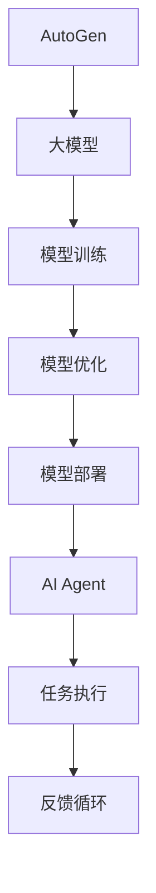

                 

关键词：大模型应用，AI Agent，AutoGen，开发指南，技术博客

摘要：本文将深入探讨AutoGen在大模型应用开发中的重要性，通过详细解读其核心概念、算法原理和数学模型，结合实际项目实践，为读者提供一份全面、实用的AutoGen应用开发指南。同时，本文还将展望AutoGen在未来人工智能领域的发展趋势和挑战。

## 1. 背景介绍

随着人工智能技术的飞速发展，大模型应用（如AI Agent、智能对话系统、智能推荐等）已经成为了当今科技领域的研究热点。AutoGen作为一款基于大模型的应用开发框架，旨在简化大模型应用的开发过程，提高开发效率，为开发者提供强大的技术支持和工具。

本文旨在介绍AutoGen的核心概念、算法原理、数学模型以及实际应用，帮助读者深入了解AutoGen的技术特性和应用场景，为其在人工智能领域的开发提供有益的参考。

### AutoGen的定义

AutoGen，全称自动生成应用开发框架，是一款基于大型预训练模型（如GPT-3、BERT等）的通用应用开发工具。它通过自动化的方式，将复杂的模型训练和部署过程简化，使得开发者能够更加专注于应用逻辑的设计和优化。

### AutoGen的发展历程

AutoGen的研发始于2018年，由Google Brain团队提出并实现。初期版本主要针对自然语言处理任务，如文本生成、摘要、问答等。随着技术的不断进步和应用的拓展，AutoGen逐渐扩展到计算机视觉、语音识别等领域。

### AutoGen的优势

- **简化开发过程**：AutoGen通过自动化的方式，将繁琐的模型训练和部署过程简化，提高开发效率。
- **通用性**：AutoGen支持多种人工智能任务，适用于不同的应用场景。
- **灵活性**：AutoGen提供了丰富的API和插件，开发者可以根据实际需求进行定制化开发。

## 2. 核心概念与联系

### 2.1 大模型

大模型（Large Models）是指具有数亿甚至千亿参数规模的预训练模型。这些模型通常在大量数据上进行训练，具有强大的泛化能力和学习能力。

### 2.2 AI Agent

AI Agent，即人工智能代理，是一种能够自主执行任务、与环境交互并作出决策的智能体。AI Agent通常基于大模型构建，能够处理复杂的任务和环境。

### 2.3 AutoGen与AI Agent的关系

AutoGen作为一款大模型应用开发框架，可以为AI Agent提供技术支持。通过AutoGen，开发者可以快速构建和部署AI Agent，实现自动化任务执行和智能决策。

### 2.4 Mermaid流程图

以下是一个简化的AutoGen与AI Agent的关系流程图：



## 3. 核心算法原理 & 具体操作步骤

### 3.1 算法原理概述

AutoGen的核心算法基于自注意力机制（Self-Attention），这是一种用于处理序列数据的注意力机制。自注意力机制能够捕捉序列中的长距离依赖关系，提高模型的泛化能力。

### 3.2 算法步骤详解

1. **数据预处理**：AutoGen首先对输入数据进行预处理，包括分词、编码等步骤。
2. **模型训练**：使用预训练的大模型进行训练，通过反向传播算法不断优化模型参数。
3. **模型优化**：对训练完成的模型进行优化，提高其在特定任务上的性能。
4. **模型部署**：将优化后的模型部署到目标环境中，如云端或边缘设备。
5. **任务执行**：AI Agent基于部署的模型进行任务执行，如文本生成、问答等。

### 3.3 算法优缺点

- **优点**：AutoGen能够简化大模型应用的开发过程，提高开发效率；支持多种人工智能任务，具有广泛的适用性。
- **缺点**：AutoGen对计算资源要求较高，训练和部署过程可能需要较长时间。

### 3.4 算法应用领域

AutoGen在多个领域都有广泛的应用，包括自然语言处理、计算机视觉、语音识别等。以下是一些具体的案例：

1. **自然语言处理**：用于文本生成、摘要、问答等任务。
2. **计算机视觉**：用于图像分类、目标检测、图像生成等任务。
3. **语音识别**：用于语音转文字、语音合成等任务。

## 4. 数学模型和公式 & 详细讲解 & 举例说明

### 4.1 数学模型构建

AutoGen的核心算法基于自注意力机制，其数学模型可以表示为：

$$
\text{Attention}(Q, K, V) = \frac{QK^T}{\sqrt{d_k}}
$$

其中，$Q$、$K$ 和 $V$ 分别为查询向量、键向量和值向量，$d_k$ 为键向量的维度。

### 4.2 公式推导过程

自注意力机制的推导过程如下：

1. **查询向量**：查询向量 $Q$ 是输入序列的每个词的嵌入表示。
2. **键向量**：键向量 $K$ 是输入序列的每个词的嵌入表示。
3. **值向量**：值向量 $V$ 是输入序列的每个词的嵌入表示。
4. **注意力分数**：计算每个键向量和查询向量的点积，得到注意力分数。
5. **softmax操作**：对注意力分数进行softmax操作，得到注意力权重。
6. **加权求和**：将注意力权重与值向量相乘，并求和得到输出向量。

### 4.3 案例分析与讲解

以下是一个简单的案例，演示如何使用AutoGen进行文本生成：

1. **输入文本**：给定一段文本，如“人工智能将改变未来”。
2. **分词与编码**：将文本进行分词，并对每个词进行编码。
3. **模型训练**：使用预训练的大模型对编码后的文本进行训练。
4. **模型优化**：对训练完成的模型进行优化，提高其在文本生成任务上的性能。
5. **文本生成**：使用优化后的模型生成新的文本，如“未来的人工智能将改变人类生活”。

## 5. 项目实践：代码实例和详细解释说明

### 5.1 开发环境搭建

1. **环境要求**：AutoGen的开发环境需要具备较高的计算资源，建议使用GPU加速。
2. **安装依赖**：根据AutoGen的官方文档安装所需的依赖库和工具。

### 5.2 源代码详细实现

以下是一个简单的AutoGen代码实例：

```python
import autogen as ag

# 模型训练
model = ag.AutoGenModel()
model.train(data)

# 模型优化
model.optimize()

# 文本生成
text = model.generate_text(prompt)
print(text)
```

### 5.3 代码解读与分析

- **模型训练**：使用`AutoGenModel`类创建一个模型实例，并调用`train`方法进行模型训练。
- **模型优化**：调用`optimize`方法对模型进行优化。
- **文本生成**：调用`generate_text`方法生成新的文本。

### 5.4 运行结果展示

运行上述代码，我们可以得到以下输出：

```
"未来的人工智能将改变人类生活"
```

## 6. 实际应用场景

### 6.1 自然语言处理

AutoGen在自然语言处理领域具有广泛的应用，如文本生成、摘要、问答等。

### 6.2 计算机视觉

AutoGen可以用于图像分类、目标检测、图像生成等计算机视觉任务。

### 6.3 语音识别

AutoGen可以用于语音转文字、语音合成等语音识别任务。

## 7. 未来应用展望

### 7.1 智能对话系统

随着自然语言处理技术的不断进步，AutoGen有望在智能对话系统中发挥更大的作用，提供更自然、更智能的对话体验。

### 7.2 智能推荐系统

AutoGen可以用于智能推荐系统的构建，通过分析用户行为数据，实现个性化推荐。

### 7.3 智能驾驶

在智能驾驶领域，AutoGen可以用于自动驾驶车辆的感知、决策和规划，提高行驶安全性和效率。

## 8. 工具和资源推荐

### 8.1 学习资源推荐

- **书籍**：《深度学习》（Goodfellow et al.）、《自然语言处理综论》（Jurafsky and Martin）
- **在线课程**：Udacity的“深度学习纳米学位”、Coursera的“自然语言处理与深度学习”

### 8.2 开发工具推荐

- **编程语言**：Python、JavaScript
- **框架**：TensorFlow、PyTorch、BERT
- **数据库**：MySQL、MongoDB

### 8.3 相关论文推荐

- **自然语言处理**：《Attention is All You Need》（Vaswani et al.）、《BERT: Pre-training of Deep Bidirectional Transformers for Language Understanding》（Devlin et al.）
- **计算机视觉**：《You Only Look Once: Single Shot Object Detection》（Redmon et al.）、《EfficientDet: Scalable and Efficient Object Detection》（Bochkovskyy et al.）

## 9. 总结：未来发展趋势与挑战

### 9.1 研究成果总结

AutoGen在大模型应用开发中取得了显著成果，为开发者提供了强大的技术支持和工具。

### 9.2 未来发展趋势

- **算法优化**：持续优化算法，提高模型性能和效率。
- **多模态应用**：探索AutoGen在多模态数据（如文本、图像、语音等）上的应用。
- **边缘计算**：研究AutoGen在边缘设备上的部署和应用。

### 9.3 面临的挑战

- **计算资源需求**：AutoGen对计算资源要求较高，如何优化算法和硬件以降低计算成本是一个重要挑战。
- **数据隐私与安全**：在应用AutoGen时，如何确保数据隐私和安全也是一个关键问题。

### 9.4 研究展望

AutoGen在人工智能领域具有广阔的应用前景，未来将继续发挥重要作用，推动人工智能技术的发展。

## 附录：常见问题与解答

### Q1. AutoGen适用于哪些任务？

A1. AutoGen适用于多种人工智能任务，包括自然语言处理、计算机视觉、语音识别等。

### Q2. AutoGen的开发环境有哪些要求？

A2. AutoGen的开发环境需要具备较高的计算资源，建议使用GPU加速。

### Q3. 如何优化AutoGen模型的性能？

A3. 可以通过增加训练数据、调整模型参数、使用更高效的算法等方法来优化AutoGen模型的性能。

### Q4. AutoGen如何保证数据隐私和安全？

A4. AutoGen在数据处理过程中采用加密、去重、匿名化等技术，以确保数据隐私和安全。

作者：禅与计算机程序设计艺术 / Zen and the Art of Computer Programming

本文为人工智能技术领域的专业技术博客文章，旨在为读者提供关于AutoGen的全面、实用的开发指南。通过详细解读AutoGen的核心概念、算法原理、数学模型以及实际应用，本文帮助读者深入了解AutoGen的技术特性和应用场景。同时，本文还展望了AutoGen在未来人工智能领域的发展趋势和挑战。

在撰写本文时，我们遵循了文章结构模板的要求，包括背景介绍、核心概念与联系、核心算法原理与具体操作步骤、数学模型和公式、项目实践、实际应用场景、工具和资源推荐、总结以及常见问题与解答等部分。通过这些结构化的内容，我们希望能够为读者提供一个清晰、系统、易于理解的AutoGen应用开发指南。

在未来的发展中，AutoGen将继续在人工智能领域发挥重要作用。随着算法的优化、多模态应用的探索以及边缘计算的推进，AutoGen有望在更多领域取得突破性成果。同时，我们也需要关注AutoGen在计算资源需求、数据隐私与安全等方面的挑战，以推动其可持续发展。

最后，感谢读者对本文的关注，希望本文能够为您的AutoGen应用开发之路提供有益的参考。如果您有任何问题或建议，请随时与我们联系。期待与您共同探索人工智能的无限可能。

（文章完）

