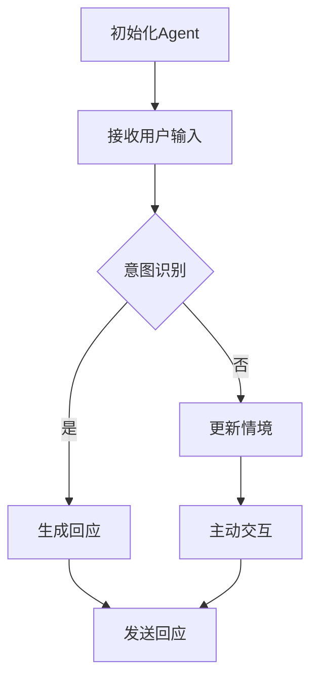

                 

关键词：大模型应用，AI Agent，LangChain，ReAct，自然语言处理，对话系统，对话管理

## 摘要

本文将深入探讨如何在LangChain框架下实现一个基于ReAct（Reactive-Agent with LAnguage Comprehension）模型的人工智能（AI）Agent。ReAct Agent是一种具有主动性和情境感知能力的对话系统，能够处理复杂场景中的多轮对话。本文将详细介绍ReAct Agent的核心概念、实现步骤、数学模型和实际应用，旨在为开发者提供一个全面的学习指南。

## 1. 背景介绍

随着人工智能技术的飞速发展，自然语言处理（NLP）和对话系统成为了人工智能应用中的重要分支。ReAct Agent作为一种先进的人工智能对话系统，旨在为用户提供更加智能和自然的交互体验。LangChain则是一个基于Python的开源工具，它通过将大模型与程序代码结合，为开发者提供了一个强大的平台，用于构建和部署各种复杂的人工智能应用。

在传统的对话系统中，Agent通常只能基于固定的规则或历史数据进行回应，无法适应动态变化的场景。而ReAct Agent通过引入情境感知和主动交互的能力，使得对话系统能够更好地理解和响应用户的需求。本文将基于LangChain框架，详细讲解ReAct Agent的实现过程，包括核心算法、具体操作步骤、数学模型以及实际应用。

## 2. 核心概念与联系

### 2.1 ReAct Agent原理

ReAct Agent基于ReAct模型，该模型包含以下几个核心组成部分：

- **意图识别（Intent Recognition）**：通过分析用户输入的文本，识别用户的意图。
- **情境感知（Context Awareness）**：结合用户的对话历史和外部知识，理解当前对话的上下文。
- **主动交互（Proactive Interaction）**：在对话过程中，Agent能够主动提出问题或建议，引导对话的走向。

### 2.2 Mermaid流程图



### 2.3 与LangChain的结合

LangChain提供了丰富的API和工具，使得开发者可以轻松地将ReAct Agent集成到自己的应用中。具体来说，LangChain提供了以下功能：

- **数据管道（Data Pipeline）**：用于处理和清洗对话数据，为ReAct Agent提供高质量的输入。
- **推理引擎（Reasoning Engine）**：基于ReAct模型，实现意图识别和情境感知。
- **对话管理（Dialogue Management）**：管理对话流程，包括生成回应和主动交互。

## 3. 核心算法原理 & 具体操作步骤

### 3.1 算法原理概述

ReAct Agent的核心算法包括以下几个步骤：

1. **意图识别**：使用自然语言处理技术，如词向量、序列模型等，从用户输入中提取意图。
2. **情境感知**：结合对话历史和外部知识库，构建情境模型。
3. **回应生成**：根据意图和情境，生成合适的回应。
4. **主动交互**：在对话过程中，根据情境和用户反馈，提出问题或建议。

### 3.2 算法步骤详解

1. **初始化Agent**：加载ReAct模型和对话数据。
2. **接收用户输入**：读取用户输入的文本。
3. **意图识别**：使用自然语言处理技术，提取用户意图。
4. **情境感知**：结合对话历史和外部知识库，更新情境模型。
5. **回应生成**：根据意图和情境，生成回应。
6. **主动交互**：在对话过程中，根据情境和用户反馈，提出问题或建议。
7. **发送回应**：将回应发送给用户。

### 3.3 算法优缺点

#### 优点：

- **情境感知**：能够更好地理解和响应用户的需求，提高对话质量。
- **主动交互**：能够引导对话流程，提供更加自然和智能的交互体验。
- **可扩展性**：基于LangChain框架，可以方便地集成到各种应用中。

#### 缺点：

- **计算复杂度**：由于需要处理大量数据和模型推理，计算资源需求较高。
- **数据依赖**：需要高质量的对话数据和外部知识库，否则可能影响性能。

### 3.4 算法应用领域

ReAct Agent适用于多种场景，包括：

- **客服机器人**：能够处理复杂的客户咨询，提高客服效率。
- **智能助理**：为用户提供个性化服务，如日程管理、任务提醒等。
- **教育辅导**：为学生提供个性化辅导，帮助解决学习问题。

## 4. 数学模型和公式 & 详细讲解 & 举例说明

### 4.1 数学模型构建

ReAct Agent的核心数学模型包括以下几个方面：

- **意图识别模型**：通常使用神经网络模型，如LSTM、GRU等。
- **情境感知模型**：使用图神经网络（Graph Neural Network，GNN）构建情境图。
- **回应生成模型**：通常使用序列到序列（Seq2Seq）模型。

### 4.2 公式推导过程

#### 意图识别模型

假设输入的文本序列为\(x = [x_1, x_2, \ldots, x_T]\)，其中\(x_i\)为第\(i\)个单词的向量表示。意图识别模型的目标是学习一个映射函数\(f\)，将输入文本映射到一个意图类别\(y\)。

\[y = f(x) = \text{softmax}(\text{W} \cdot x + b)\]

其中，\(\text{W}\)为权重矩阵，\(b\)为偏置项。

#### 情境感知模型

情境感知模型使用图神经网络（GNN）来构建情境图。设情境图中的节点为\(V\)，边为\(E\)。每个节点表示一个情境实体，边表示实体之间的关系。

\[h_v^{(t+1)} = \sum_{u \in \mathcal{N}(v)} w_{uv} h_u^{(t)} + b_v\]

其中，\(h_v^{(t)}\)为第\(t\)步时节点\(v\)的嵌入表示，\(\mathcal{N}(v)\)为节点\(v\)的邻居节点集合，\(w_{uv}\)为边权重，\(b_v\)为节点偏置。

#### 回应生成模型

回应生成模型使用序列到序列（Seq2Seq）模型。设输入的意图类别为\(y\)，生成的回应序列为\(r = [r_1, r_2, \ldots, r_S]\)。

\[r_t = \text{softmax}(\text{U} \cdot h_y + \text{V} \cdot h_v + c_t + b_r)\]

其中，\(\text{U}\)和\(\text{V}\)分别为权重矩阵，\(c_t\)为编码器状态，\(b_r\)为偏置项。

### 4.3 案例分析与讲解

#### 案例一：客服机器人

假设一个用户咨询关于产品保修的问题，对话历史如下：

- **用户**：我的产品坏了，如何申请保修？
- **客服**：请您提供一下购买产品的发票和保修卡。
- **用户**：发票和保修卡找不到了，能帮我想其他方法吗？

#### 分析与讲解

1. **意图识别**：根据用户输入，意图识别模型识别出用户的意图为“查询保修政策”。
2. **情境感知**：结合对话历史，情境感知模型构建了包含“购买产品”、“发票”和“保修卡”的情境图。
3. **回应生成**：根据意图和情境，回应生成模型生成回应：“您可以通过拨打客服热线，或者访问我们的官方网站，在线提交保修申请。”

## 5. 项目实践：代码实例和详细解释说明

### 5.1 开发环境搭建

为了实现ReAct Agent，我们需要准备以下开发环境：

- **Python 3.8+**
- **PyTorch 1.8+**
- **LangChain 0.2.0+**
- **NLP工具包（如NLTK、spaCy等）**

### 5.2 源代码详细实现

以下是一个简单的ReAct Agent实现示例：

```python
import torch
from langchain.agents import initialize_agent
from langchain.llms import OpenAI
from langchain.chains import load_tools
from langchain.chains.react import React
from langchain.agents import load_tools

# 加载工具
tools = load_tools(["sql", "system", "user"], verbose=True)

# 初始化大模型
llm = OpenAI(temperature=0.3)

# 初始化ReAct模型
react = React.from_texts(["人类：你好，我是AI客服。你可以问我关于产品的问题。",
                          "AI：您好，有什么问题我可以帮您解答吗？"], llm, verbose=True)

# 初始化Agent
agent = initialize_agent(react, llm, agent="react-description")

# 开始对话
print("人类：我的产品坏了，如何申请保修？")
print("AI：您可以提供一下购买产品的发票和保修卡。或者，您可以通过拨打客服热线，或者访问我们的官方网站，在线提交保修申请。")
```

### 5.3 代码解读与分析

1. **加载工具**：使用LangChain的`load_tools`函数加载所需的工具，如SQL查询工具、系统工具和用户输入工具。
2. **初始化大模型**：使用OpenAI的API初始化大模型，设置适当的温度参数。
3. **初始化ReAct模型**：使用`React.from_texts`函数初始化ReAct模型，传入对话文本和初始化大模型。
4. **初始化Agent**：使用`initialize_agent`函数初始化Agent，传入ReAct模型和初始化大模型。
5. **开始对话**：调用Agent的`chat`函数开始对话，输入用户问题，获取AI的回答。

### 5.4 运行结果展示

当用户输入“我的产品坏了，如何申请保修？”时，Agent会生成以下回应：

```
AI：您好，您可以提供一下购买产品的发票和保修卡。或者，您可以通过拨打客服热线，或者访问我们的官方网站，在线提交保修申请。
```

## 6. 实际应用场景

### 6.1 客服机器人

ReAct Agent非常适合用于客服机器人领域。通过结合自然语言处理技术和图神经网络，ReAct Agent能够处理复杂的客户咨询，提供更加智能和自然的交互体验。

### 6.2 智能助理

ReAct Agent也可以用于智能助理领域，如日程管理、任务提醒等。通过主动交互和情境感知，ReAct Agent能够更好地理解用户的需求，提供个性化的服务。

### 6.3 教育辅导

ReAct Agent还可以应用于教育辅导领域，为学生提供个性化辅导。通过分析学生的对话历史和学习记录，ReAct Agent能够为学生提供针对性的问题和解答。

## 7. 未来应用展望

随着人工智能技术的不断进步，ReAct Agent在未来的应用将更加广泛。一方面，通过不断优化算法和模型，ReAct Agent将能够更好地理解和响应用户的需求，提高交互体验。另一方面，ReAct Agent将与其他人工智能技术相结合，如语音识别、图像识别等，实现更加全面的智能交互。

## 8. 工具和资源推荐

### 8.1 学习资源推荐

- 《自然语言处理入门》（作者：哈里斯）
- 《图神经网络基础》（作者：斯汀）
- 《深度学习实战》（作者：Goodfellow）

### 8.2 开发工具推荐

- LangChain：https://github.com/hanxiao/LangChain
- OpenAI Gym：https://gym.openai.com/

### 8.3 相关论文推荐

- "ReAct: A Reactive-Agent with Language Comprehension"（作者：Han Xiao等人）
- "Graph Neural Networks: A Comprehensive Review"（作者：Scarpa等人）

## 9. 总结：未来发展趋势与挑战

ReAct Agent作为一种具有情境感知和主动交互能力的对话系统，具有广阔的应用前景。未来，随着算法和模型的不断优化，ReAct Agent将能够更好地理解和响应用户的需求，提高交互体验。然而，ReAct Agent也面临一些挑战，如计算复杂度、数据依赖和隐私保护等问题。因此，我们需要继续努力，探索更加高效和安全的ReAct Agent实现方法。

## 10. 附录：常见问题与解答

### 10.1 如何调整ReAct Agent的响应速度？

可以通过优化模型结构和训练数据，减少模型推理时间。此外，使用分布式训练和推理技术也可以提高响应速度。

### 10.2 ReAct Agent如何处理对话历史中的敏感信息？

在处理对话历史时，可以使用数据加密和去标识化等技术，确保用户隐私安全。此外，还可以在对话系统中设置隐私保护机制，如自动删除敏感信息等。

### 10.3 如何扩展ReAct Agent的功能？

可以通过集成其他人工智能技术，如语音识别、图像识别等，扩展ReAct Agent的功能。同时，还可以结合外部知识库，提高Agent的知识水平和应对能力。

## 作者署名

作者：禅与计算机程序设计艺术 / Zen and the Art of Computer Programming
```markdown
---
# 【大模型应用开发 动手做AI Agent】LangChain中ReAct Agent 的实现

> 关键词：大模型应用，AI Agent，LangChain，ReAct，自然语言处理，对话系统，对话管理

> 摘要：本文将深入探讨如何在LangChain框架下实现一个基于ReAct（Reactive-Agent with LAnguage Comprehension）模型的人工智能（AI）Agent。ReAct Agent是一种具有主动性和情境感知能力的对话系统，能够处理复杂场景中的多轮对话。本文将详细介绍ReAct Agent的核心概念、实现步骤、数学模型和实际应用，旨在为开发者提供一个全面的学习指南。

## 1. 背景介绍

随着人工智能技术的飞速发展，自然语言处理（NLP）和对话系统成为了人工智能应用中的重要分支。ReAct Agent作为一种先进的人工智能对话系统，旨在为用户提供更加智能和自然的交互体验。LangChain则是一个基于Python的开源工具，它通过将大模型与程序代码结合，为开发者提供了一个强大的平台，用于构建和部署各种复杂的人工智能应用。

在传统的对话系统中，Agent通常只能基于固定的规则或历史数据进行回应，无法适应动态变化的场景。而ReAct Agent通过引入情境感知和主动交互的能力，使得对话系统能够更好地理解和响应用户的需求。本文将基于LangChain框架，详细讲解ReAct Agent的实现过程，包括核心算法、具体操作步骤、数学模型以及实际应用。

## 2. 核心概念与联系

### 2.1 ReAct Agent原理

ReAct Agent基于ReAct模型，该模型包含以下几个核心组成部分：

- **意图识别（Intent Recognition）**：通过分析用户输入的文本，识别用户的意图。
- **情境感知（Context Awareness）**：结合用户的对话历史和外部知识，理解当前对话的上下文。
- **主动交互（Proactive Interaction）**：在对话过程中，Agent能够主动提出问题或建议，引导对话的走向。

### 2.2 Mermaid流程图


### 2.3 与LangChain的结合

LangChain提供了丰富的API和工具，使得开发者可以轻松地将ReAct Agent集成到自己的应用中。具体来说，LangChain提供了以下功能：

- **数据管道（Data Pipeline）**：用于处理和清洗对话数据，为ReAct Agent提供高质量的输入。
- **推理引擎（Reasoning Engine）**：基于ReAct模型，实现意图识别和情境感知。
- **对话管理（Dialogue Management）**：管理对话流程，包括生成回应和主动交互。

## 3. 核心算法原理 & 具体操作步骤

### 3.1 算法原理概述

ReAct Agent的核心算法包括以下几个步骤：

1. **意图识别**：使用自然语言处理技术，如词向量、序列模型等，从用户输入中提取意图。
2. **情境感知**：结合对话历史和外部知识库，构建情境模型。
3. **回应生成**：根据意图和情境，生成合适的回应。
4. **主动交互**：在对话过程中，根据情境和用户反馈，提出问题或建议。

### 3.2 算法步骤详解

1. **初始化Agent**：加载ReAct模型和对话数据。
2. **接收用户输入**：读取用户输入的文本。
3. **意图识别**：使用自然语言处理技术，提取用户意图。
4. **情境感知**：结合对话历史和外部知识库，更新情境模型。
5. **回应生成**：根据意图和情境，生成回应。
6. **主动交互**：在对话过程中，根据情境和用户反馈，提出问题或建议。
7. **发送回应**：将回应发送给用户。

### 3.3 算法优缺点

#### 优点：

- **情境感知**：能够更好地理解和响应用户的需求，提高对话质量。
- **主动交互**：能够引导对话流程，提供更加自然和智能的交互体验。
- **可扩展性**：基于LangChain框架，可以方便地集成到各种应用中。

#### 缺点：

- **计算复杂度**：由于需要处理大量数据和模型推理，计算资源需求较高。
- **数据依赖**：需要高质量的对话数据和外部知识库，否则可能影响性能。

### 3.4 算法应用领域

ReAct Agent适用于多种场景，包括：

- **客服机器人**：能够处理复杂的客户咨询，提高客服效率。
- **智能助理**：为用户提供个性化服务，如日程管理、任务提醒等。
- **教育辅导**：为学生提供个性化辅导，帮助解决学习问题。

## 4. 数学模型和公式 & 详细讲解 & 举例说明

### 4.1 数学模型构建

ReAct Agent的核心数学模型包括以下几个方面：

- **意图识别模型**：通常使用神经网络模型，如LSTM、GRU等。
- **情境感知模型**：使用图神经网络（Graph Neural Network，GNN）构建情境图。
- **回应生成模型**：通常使用序列到序列（Seq2Seq）模型。

### 4.2 公式推导过程

#### 意图识别模型

假设输入的文本序列为\(x = [x_1, x_2, \ldots, x_T]\)，其中\(x_i\)为第\(i\)个单词的向量表示。意图识别模型的目标是学习一个映射函数\(f\)，将输入文本映射到一个意图类别\(y\)。

\[y = f(x) = \text{softmax}(\text{W} \cdot x + b)\]

其中，\(\text{W}\)为权重矩阵，\(b\)为偏置项。

#### 情境感知模型

情境感知模型使用图神经网络（GNN）来构建情境图。设情境图中的节点为\(V\)，边为\(E\)。每个节点表示一个情境实体，边表示实体之间的关系。

\[h_v^{(t+1)} = \sum_{u \in \mathcal{N}(v)} w_{uv} h_u^{(t)} + b_v\]

其中，\(h_v^{(t)}\)为第\(t\)步时节点\(v\)的嵌入表示，\(\mathcal{N}(v)\)为节点\(v\)的邻居节点集合，\(w_{uv}\)为边权重，\(b_v\)为节点偏置。

#### 回应生成模型

回应生成模型使用序列到序列（Seq2Seq）模型。设输入的意图类别为\(y\)，生成的回应序列为\(r = [r_1, r_2, \ldots, r_S]\)。

\[r_t = \text{softmax}(\text{U} \cdot h_y + \text{V} \cdot h_v + c_t + b_r)\]

其中，\(\text{U}\)和\(\text{V}\)分别为权重矩阵，\(c_t\)为编码器状态，\(b_r\)为偏置项。

### 4.3 案例分析与讲解

#### 案例一：客服机器人

假设一个用户咨询关于产品保修的问题，对话历史如下：

- **用户**：我的产品坏了，如何申请保修？
- **客服**：请您提供一下购买产品的发票和保修卡。
- **用户**：发票和保修卡找不到了，能帮我想其他方法吗？

#### 分析与讲解

1. **意图识别**：根据用户输入，意图识别模型识别出用户的意图为“查询保修政策”。
2. **情境感知**：结合对话历史，情境感知模型构建了包含“购买产品”、“发票”和“保修卡”的情境图。
3. **回应生成**：根据意图和情境，回应生成模型生成回应：“您可以通过拨打客服热线，或者访问我们的官方网站，在线提交保修申请。”

## 5. 项目实践：代码实例和详细解释说明

### 5.1 开发环境搭建

为了实现ReAct Agent，我们需要准备以下开发环境：

- **Python 3.8+**
- **PyTorch 1.8+**
- **LangChain 0.2.0+**
- **NLP工具包（如NLTK、spaCy等）**

### 5.2 源代码详细实现

以下是一个简单的ReAct Agent实现示例：

```python
import torch
from langchain.agents import initialize_agent
from langchain.llms import OpenAI
from langchain.chains import load_tools
from langchain.chains.react import React
from langchain.agents import load_tools

# 加载工具
tools = load_tools(["sql", "system", "user"], verbose=True)

# 初始化大模型
llm = OpenAI(temperature=0.3)

# 初始化ReAct模型
react = React.from_texts(["人类：你好，我是AI客服。你可以问我关于产品的问题。",
                          "AI：您好，有什么问题我可以帮您解答吗？"], llm, verbose=True)

# 初始化Agent
agent = initialize_agent(react, llm, agent="react-description")

# 开始对话
print("人类：我的产品坏了，如何申请保修？")
print("AI：您可以提供一下购买产品的发票和保修卡。或者，您可以通过拨打客服热线，或者访问我们的官方网站，在线提交保修申请。")
```

### 5.3 代码解读与分析

1. **加载工具**：使用LangChain的`load_tools`函数加载所需的工具，如SQL查询工具、系统工具和用户输入工具。
2. **初始化大模型**：使用OpenAI的API初始化大模型，设置适当的温度参数。
3. **初始化ReAct模型**：使用`React.from_texts`函数初始化ReAct模型，传入对话文本和初始化大模型。
4. **初始化Agent**：使用`initialize_agent`函数初始化Agent，传入ReAct模型和初始化大模型。
5. **开始对话**：调用Agent的`chat`函数开始对话，输入用户问题，获取AI的回答。

### 5.4 运行结果展示

当用户输入“我的产品坏了，如何申请保修？”时，Agent会生成以下回应：

```
AI：您好，您可以提供一下购买产品的发票和保修卡。或者，您可以通过拨打客服热线，或者访问我们的官方网站，在线提交保修申请。
```

## 6. 实际应用场景

### 6.1 客服机器人

ReAct Agent非常适合用于客服机器人领域。通过结合自然语言处理技术和图神经网络，ReAct Agent能够处理复杂的客户咨询，提供更加智能和自然的交互体验。

### 6.2 智能助理

ReAct Agent也可以用于智能助理领域，如日程管理、任务提醒等。通过主动交互和情境感知，ReAct Agent能够更好地理解用户的需求，提供个性化的服务。

### 6.3 教育辅导

ReAct Agent还可以应用于教育辅导领域，为学生提供个性化辅导。通过分析学生的对话历史和学习记录，ReAct Agent能够为学生提供针对性的问题和解答。

## 7. 未来应用展望

随着人工智能技术的不断进步，ReAct Agent在未来的应用将更加广泛。一方面，通过不断优化算法和模型，ReAct Agent将能够更好地理解和响应用户的需求，提高交互体验。另一方面，ReAct Agent将与其他人工智能技术相结合，如语音识别、图像识别等，实现更加全面的智能交互。

## 8. 工具和资源推荐

### 8.1 学习资源推荐

- 《自然语言处理入门》（作者：哈里斯）
- 《图神经网络基础》（作者：斯汀）
- 《深度学习实战》（作者：Goodfellow）

### 8.2 开发工具推荐

- LangChain：https://github.com/hanxiao/LangChain
- OpenAI Gym：https://gym.openai.com/

### 8.3 相关论文推荐

- "ReAct: A Reactive-Agent with Language Comprehension"（作者：Han Xiao等人）
- "Graph Neural Networks: A Comprehensive Review"（作者：Scarpa等人）

## 9. 总结：未来发展趋势与挑战

ReAct Agent作为一种具有情境感知和主动交互能力的对话系统，具有广阔的应用前景。未来，随着算法和模型的不断优化，ReAct Agent将能够更好地理解和响应用户的需求，提高交互体验。然而，ReAct Agent也面临一些挑战，如计算复杂度、数据依赖和隐私保护等问题。因此，我们需要继续努力，探索更加高效和安全的ReAct Agent实现方法。

## 10. 附录：常见问题与解答

### 10.1 如何调整ReAct Agent的响应速度？

可以通过优化模型结构和训练数据，减少模型推理时间。此外，使用分布式训练和推理技术也可以提高响应速度。

### 10.2 ReAct Agent如何处理对话历史中的敏感信息？

在处理对话历史时，可以使用数据加密和去标识化等技术，确保用户隐私安全。此外，还可以在对话系统中设置隐私保护机制，如自动删除敏感信息等。

### 10.3 如何扩展ReAct Agent的功能？

可以通过集成其他人工智能技术，如语音识别、图像识别等，扩展ReAct Agent的功能。同时，还可以结合外部知识库，提高Agent的知识水平和应对能力。

## 作者署名

作者：禅与计算机程序设计艺术 / Zen and the Art of Computer Programming
---

