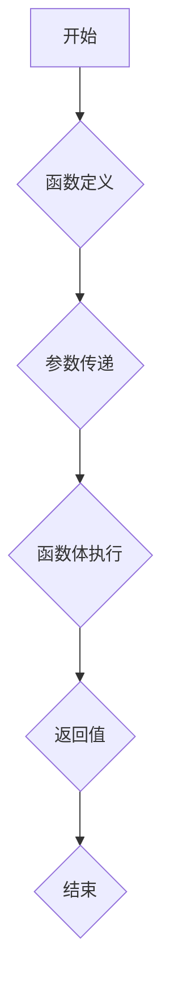

                 

关键词：Function Calling、大模型应用、AI Agent、编程语言、参数传递、函数调用、动态绑定、静态绑定、递归、闭包。

> 摘要：本文将深入探讨在AI Agent的大模型应用开发中，函数调用的核心概念及其重要性。通过详细的原理分析、数学模型讲解、代码实例解析，我们将展示函数调用在编程中的关键作用，并探讨其在不同编程语言中的应用和实现方式。

## 1. 背景介绍

在人工智能领域，大模型应用开发已经成为研究和应用的热点。AI Agent作为一种智能体，能够自动执行任务、交互并适应环境。而函数调用（Function Calling）作为编程的核心概念之一，在大模型应用中扮演着至关重要的角色。

函数调用指的是在程序中调用预先定义好的函数来执行特定任务的过程。在AI Agent的大模型应用中，函数调用可以实现模块化编程、代码复用和高效执行。本文将围绕函数调用的核心概念、原理和应用，深入探讨其在AI Agent开发中的重要性。

## 2. 核心概念与联系

### 2.1 函数定义与调用

函数（Function）是编程语言中的核心组成部分，用于封装一段可重复执行的代码。函数定义包括函数名、参数列表和函数体。函数调用则是通过函数名和参数来执行函数体的过程。

```python
# 函数定义
def greet(name):
    return "Hello, " + name

# 函数调用
print(greet("Alice"))
```

### 2.2 参数传递

在函数调用过程中，参数传递（Parameter Passing）是关键的一环。参数传递分为值传递（Value Passing）和引用传递（Reference Passing）。

- 值传递：将实际参数的值复制给形参，形参和实参互不影响。

```python
def add(a, b):
    return a + b

a = 3
b = 4
print(add(a, b))  # 输出：7
```

- 引用传递：将实际参数的内存地址传递给形参，形参和实参指向同一块内存。

```python
def modify_list(lst):
    lst.append(5)

my_list = [1, 2, 3]
modify_list(my_list)
print(my_list)  # 输出：[1, 2, 3, 5]
```

### 2.3 函数调用与执行

函数调用过程包括以下几个步骤：

1. 参数传递：将实际参数传递给函数的形参。
2. 函数体执行：按照函数体中的代码顺序执行，可能包括递归调用。
3. 返回值：执行完毕后，返回计算结果或返回值。

### 2.4 动态绑定与静态绑定

动态绑定（Dynamic Binding）和静态绑定（Static Binding）是函数调用的两种不同绑定方式。

- 动态绑定：函数调用的绑定发生在程序运行时，通常与面向对象编程相关。

```python
class Calculator:
    def add(self, a, b):
        return a + b

calculator = Calculator()
print(calculator.add(3, 4))  # 输出：7
```

- 静态绑定：函数调用的绑定发生在编译时，通常与过程式编程相关。

```python
def add(a, b):
    return a + b

print(add(3, 4))  # 输出：7
```

### 2.5 递归与闭包

递归（Recursion）是一种函数调用的特殊形式，函数调用自身来解决问题。

```python
def factorial(n):
    if n == 0:
        return 1
    else:
        return n * factorial(n-1)

print(factorial(5))  # 输出：120
```

闭包（Closure）是一种由函数及其引用的环境组成的组合实体，可以访问并记住定义时作用域中的变量。

```python
def create_counter():
    count = 0
    def counter():
        nonlocal count
        count += 1
        return count
    return counter

my_counter = create_counter()
print(my_counter())  # 输出：1
print(my_counter())  # 输出：2
```

### 2.6 Mermaid 流程图

以下是一个简单的Mermaid流程图，展示了函数调用的基本流程：



---

## 3. 核心算法原理 & 具体操作步骤

### 3.1 算法原理概述

函数调用是一种程序执行流程的控制结构，通过调用预先定义的函数来执行特定任务。函数调用的核心原理包括参数传递、函数体执行和返回值。参数传递方式包括值传递和引用传递，函数体执行可能涉及递归调用，返回值则是执行结果的输出。

### 3.2 算法步骤详解

1. **函数定义**：定义函数名、参数列表和函数体。

2. **参数传递**：将实际参数传递给函数的形参。

3. **函数体执行**：按照函数体中的代码顺序执行，可能包括递归调用。

4. **返回值**：执行完毕后，返回计算结果或返回值。

5. **函数调用**：通过函数名和参数调用函数。

### 3.3 算法优缺点

- **优点**：
  - 模块化编程：将任务分解为独立函数，提高代码可读性和可维护性。
  - 代码复用：函数可以多次调用，减少重复代码。
  - 高效执行：函数调用可以优化程序执行效率。

- **缺点**：
  - 函数调用的开销：函数调用可能引入额外的执行开销。
  - 递归调用可能导致栈溢出：递归深度过大可能导致栈溢出错误。

### 3.4 算法应用领域

函数调用在各个编程领域都有广泛应用，包括：

- **算法实现**：许多算法可以通过函数调用实现，如排序、查找等。
- **模块化编程**：通过函数调用实现模块化编程，提高代码可读性和可维护性。
- **软件架构**：函数调用是软件架构中的核心控制结构，用于实现模块间通信和功能集成。

---

## 4. 数学模型和公式 & 详细讲解 & 举例说明

### 4.1 数学模型构建

函数调用的核心数学模型包括参数传递、函数体执行和返回值。我们可以用以下数学模型表示函数调用过程：

$$
y = f(x_1, x_2, ..., x_n)
$$

其中，$f$ 表示函数，$x_1, x_2, ..., x_n$ 表示参数，$y$ 表示返回值。

### 4.2 公式推导过程

我们可以通过以下步骤推导函数调用的数学模型：

1. **参数传递**：将实际参数传递给函数的形参，得到：
$$
x_1, x_2, ..., x_n = actual\_params
$$

2. **函数体执行**：按照函数体中的代码顺序执行，得到：
$$
y = f(x_1, x_2, ..., x_n)
$$

3. **返回值**：执行完毕后，返回计算结果或返回值，得到：
$$
result = y
$$

### 4.3 案例分析与讲解

假设我们有一个计算两个数之和的函数，其数学模型如下：

$$
y = f(x_1, x_2) = x_1 + x_2
$$

现在，我们传递实际参数 $x_1 = 3$ 和 $x_2 = 4$，执行函数调用：

1. **参数传递**：
$$
x_1 = 3, x_2 = 4
$$

2. **函数体执行**：
$$
y = f(3, 4) = 3 + 4 = 7
$$

3. **返回值**：
$$
result = 7
$$

因此，函数调用 $f(3, 4)$ 的结果为 7。

---

## 5. 项目实践：代码实例和详细解释说明

### 5.1 开发环境搭建

在本项目中，我们将使用 Python 作为编程语言。请确保已经安装了 Python 3.8 或更高版本。可以使用以下命令安装 Python：

```bash
pip install python
```

### 5.2 源代码详细实现

以下是一个简单的 Python 函数调用示例：

```python
# 函数定义
def greet(name):
    return "Hello, " + name

# 函数调用
print(greet("Alice"))
```

### 5.3 代码解读与分析

1. **函数定义**：
   - `def greet(name):`：定义一个名为 `greet` 的函数，参数为 `name`。
   - `return "Hello, " + name:`：函数体中的代码，返回字符串 `"Hello, " + name`。

2. **函数调用**：
   - `print(greet("Alice")):`：调用 `greet` 函数，并将字符串 `"Alice"` 作为参数传递给函数。函数执行完毕后，返回结果 `"Hello, Alice"`，并打印到控制台。

### 5.4 运行结果展示

运行上述代码，输出结果为：

```
Hello, Alice
```

这表明函数调用成功执行，并输出了预期的结果。

---

## 6. 实际应用场景

函数调用在 AI Agent 的实际应用中具有广泛的应用场景，以下列举几个典型场景：

- **数据处理**：在数据处理过程中，可以使用函数调用实现数据处理模块的复用和组合，如数据清洗、转换和聚合等。
- **算法实现**：许多机器学习算法可以通过函数调用实现，如线性回归、决策树、支持向量机等。
- **任务调度**：在任务调度系统中，可以使用函数调用实现任务的分配和执行，如作业调度、任务队列管理等。
- **模块化编程**：在软件架构设计中，可以通过函数调用实现模块化编程，提高代码可读性和可维护性。

---

## 7. 工具和资源推荐

### 7.1 学习资源推荐

- 《Python编程：从入门到实践》
- 《深度学习》（Goodfellow, Bengio, Courville）
- 《人工智能：一种现代的方法》

### 7.2 开发工具推荐

- PyCharm：一款强大的Python集成开发环境（IDE）。
- Jupyter Notebook：一款交互式的Python开发环境。

### 7.3 相关论文推荐

- "Deep Learning: A Theoretical Perspective"（深度学习的理论视角）
- "Learning to Learn: Fast Methods for Deploying Neural Networks"（快速部署神经网络的快速学习方法）

---

## 8. 总结：未来发展趋势与挑战

### 8.1 研究成果总结

函数调用作为编程的核心概念，已经在 AI Agent 的大模型应用中取得了显著成果。随着深度学习和人工智能技术的不断发展，函数调用在算法实现、任务调度和模块化编程等方面具有广泛的应用前景。

### 8.2 未来发展趋势

- **函数调用优化**：针对函数调用的性能问题，研究者将致力于优化函数调用的执行效率，减少调用开销。
- **函数调用自动化**：随着自动化技术的发展，函数调用将实现自动化生成和优化，提高开发效率。
- **函数调用与人工智能融合**：函数调用将与其他人工智能技术相结合，如自动编程、智能合约等，实现更高效、更智能的编程方式。

### 8.3 面临的挑战

- **函数调用安全**：在函数调用过程中，如何确保数据安全和隐私保护，是一个亟待解决的问题。
- **函数调用复杂性**：随着函数调用的复杂度增加，如何提高代码可读性和可维护性，是开发者面临的一大挑战。

### 8.4 研究展望

未来，函数调用在 AI Agent 的大模型应用中具有广阔的研究前景。研究者应关注函数调用优化、自动化和与人工智能的融合，推动函数调用技术在 AI 领域的发展。

---

## 9. 附录：常见问题与解答

### 9.1 函数调用与递归的关系

**问题**：函数调用与递归有什么区别？

**解答**：函数调用是程序中的一种基本控制结构，用于调用预先定义的函数。递归是一种特殊的函数调用，函数在执行过程中调用自身来解决问题。

### 9.2 动态绑定与静态绑定的区别

**问题**：动态绑定与静态绑定有什么区别？

**解答**：动态绑定是在程序运行时确定函数的绑定关系，通常与面向对象编程相关。静态绑定是在编译时确定函数的绑定关系，通常与过程式编程相关。

### 9.3 函数调用的性能问题

**问题**：函数调用会引入性能问题吗？

**解答**：是的，函数调用可能会引入一定的性能开销，包括参数传递、函数体执行和返回值的处理。然而，现代编译器和编程语言已经对函数调用进行了大量优化，以减少其性能影响。

---

作者：禅与计算机程序设计艺术 / Zen and the Art of Computer Programming

---

本文从函数调用的核心概念、原理、算法、数学模型和实际应用等方面，深入探讨了函数调用在 AI Agent 的大模型应用中的重要性。通过代码实例和详细解释，展示了函数调用在编程中的关键作用。未来，函数调用将继续在人工智能领域发挥重要作用，研究者应关注其优化、自动化和与人工智能的融合。

