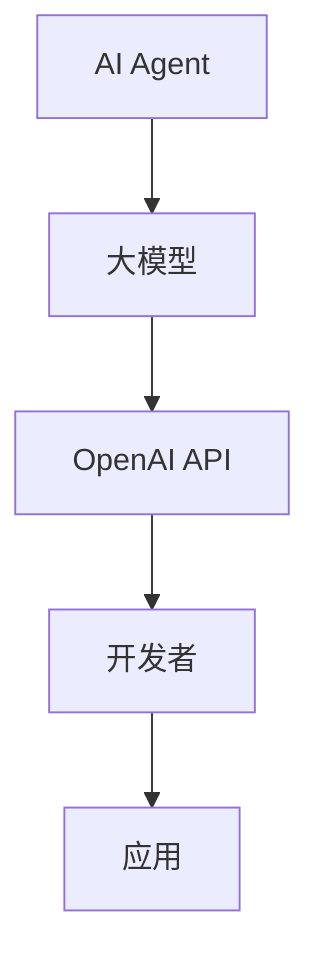

                 

关键词：大模型应用开发、AI Agent、OpenAI API、技术博客、深度学习、算法原理、数学模型、项目实践、实际应用场景、未来展望

摘要：本文将深入探讨OpenAI API在人工智能领域的应用，通过详细分析其核心概念、算法原理、数学模型和项目实践，为读者揭示如何利用OpenAI API构建强大的AI Agent。同时，文章还将探讨OpenAI API在实际应用场景中的表现，并对未来的发展趋势与挑战进行展望。

## 1. 背景介绍

近年来，人工智能（AI）领域取得了惊人的进展，特别是基于深度学习的算法在图像识别、自然语言处理等任务上取得了显著的成果。随着计算能力的提升和大数据的积累，大模型（Large Models）逐渐成为AI研究的热点。大模型具有较高的参数量和计算复杂度，能够捕捉更多特征，从而提高模型的性能。

OpenAI API作为OpenAI提供的一项重要服务，使得开发者能够方便地利用大模型进行各种AI任务。OpenAI API支持多种编程语言，包括Python、JavaScript等，提供了丰富的接口供开发者使用。通过OpenAI API，开发者可以轻松地调用预训练的大模型，进行文本生成、机器翻译、图像识别等任务。

本文将围绕OpenAI API的核心概念、算法原理、数学模型和项目实践进行详细分析，帮助读者深入了解如何利用OpenAI API构建AI Agent。同时，文章还将探讨OpenAI API在实际应用场景中的表现，以及对未来发展趋势和挑战的展望。

## 2. 核心概念与联系

### 2.1. AI Agent的定义

AI Agent是指具备自主行动能力的智能体，能够感知环境、规划行动并执行任务。AI Agent是人工智能领域的一个重要概念，其目标是实现自主决策和智能行为。

### 2.2. 大模型的定义

大模型是指具有大量参数的深度学习模型，通常采用神经网络结构。大模型能够捕捉更多特征，从而提高模型的性能。随着计算能力的提升和大数据的积累，大模型在图像识别、自然语言处理等领域取得了显著成果。

### 2.3. OpenAI API的定义

OpenAI API是OpenAI提供的一项服务，开发者可以通过API接口调用预训练的大模型，进行文本生成、机器翻译、图像识别等任务。OpenAI API支持多种编程语言，提供了丰富的接口供开发者使用。

### 2.4. 关系与联系

AI Agent是大模型的应用之一，OpenAI API为开发者提供了调用大模型的便捷途径。通过OpenAI API，开发者可以构建各种AI Agent，实现自主决策和智能行为。

### 2.5. Mermaid流程图

下面是一个关于AI Agent、大模型和OpenAI API的Mermaid流程图：



## 3. 核心算法原理 & 具体操作步骤

### 3.1. 算法原理概述

OpenAI API主要基于生成式模型，如GPT（Generative Pre-trained Transformer）和DALL-E等。这些模型通过预训练和微调，能够理解输入的文本或图像，并生成相应的输出。

### 3.2. 算法步骤详解

1. **数据准备**：收集和整理用于训练的数据集。对于文本生成任务，可以收集大量文本数据；对于图像识别任务，可以收集图像数据。
2. **模型训练**：使用训练数据对大模型进行预训练。预训练过程中，模型会学习如何从输入数据中提取特征，并生成相应的输出。
3. **模型评估**：在验证集上评估模型的性能，调整模型参数，以提高模型的准确性。
4. **模型部署**：将训练好的模型部署到服务器，供开发者调用。
5. **调用API**：开发者使用OpenAI API调用预训练的大模型，进行文本生成、机器翻译、图像识别等任务。
6. **结果处理**：处理API返回的结果，如文本生成、图像识别等。

### 3.3. 算法优缺点

**优点**：
1. **强大的模型能力**：OpenAI API提供了预训练的大模型，能够处理复杂的AI任务，如文本生成、机器翻译、图像识别等。
2. **便捷的开发体验**：开发者无需从头训练模型，只需调用OpenAI API，即可实现各种AI任务。
3. **多种编程语言支持**：OpenAI API支持多种编程语言，如Python、JavaScript等，方便开发者进行开发。

**缺点**：
1. **资源消耗较大**：大模型的训练和部署需要大量的计算资源和存储空间。
2. **模型解释性较差**：深度学习模型通常具有较低的透明度，难以解释模型的决策过程。

### 3.4. 算法应用领域

OpenAI API广泛应用于自然语言处理、计算机视觉、图像生成、机器翻译等领域。例如：
1. **自然语言处理**：用于文本生成、机器翻译、情感分析等任务。
2. **计算机视觉**：用于图像分类、目标检测、图像生成等任务。
3. **图像生成**：用于生成艺术作品、场景合成等。

## 4. 数学模型和公式 & 详细讲解 & 举例说明

### 4.1. 数学模型构建

OpenAI API主要基于生成式模型，如GPT和DALL-E等。这些模型的核心是神经网络，通常采用Transformer架构。下面以GPT为例，介绍其数学模型。

1. **输入表示**：文本输入被表示为词向量，每个词向量由一组数字表示。词向量可以通过预训练的词向量库获取，如Word2Vec、GloVe等。
2. **编码器**：编码器（Encoder）负责将输入文本表示为序列向量。编码器由多层Transformer编码器堆叠而成，每个编码器层由自注意力机制（Self-Attention）和前馈网络（Feedforward Network）组成。
3. **解码器**：解码器（Decoder）负责生成输出文本。解码器同样由多层Transformer解码器堆叠而成，每个解码器层也包含自注意力机制和前馈网络。
4. **损失函数**：在训练过程中，模型会根据输入和输出之间的差距来调整参数。常用的损失函数是交叉熵损失（Cross-Entropy Loss），用于衡量输入和输出之间的差异。

### 4.2. 公式推导过程

1. **输入表示**：
   $$x \in \mathbb{R}^{d_x}$$
   其中，$d_x$表示词向量的维度。

2. **编码器**：
   编码器输入为词向量序列$x$，输出为编码序列$h$：
   $$h = \text{Encoder}(x) = \text{Transformer}^{L}_{l=1}\text{EncoderLayer}(x_l)$$
   其中，$\text{EncoderLayer}$表示编码器层，$L$表示编码器层数。

3. **解码器**：
   解码器输入为编码序列$h$和目标序列$y$，输出为预测序列$\hat{y}$：
   $$\hat{y} = \text{Decoder}(h, y) = \text{Transformer}^{L}_{l=1}\text{DecoderLayer}(y_l, h)$$
   其中，$\text{DecoderLayer}$表示解码器层，$L$表示解码器层数。

4. **损失函数**：
   交叉熵损失函数为：
   $$\text{Loss} = -\sum_{i=1}^{n}\sum_{j=1}^{V}\hat{y}_{ij}\log(p_{ij})$$
   其中，$n$表示序列长度，$V$表示词汇表大小，$p_{ij}$表示第$i$个词在第$j$个位置的概率。

### 4.3. 案例分析与讲解

假设我们有一个简单的文本生成任务，输入为一段文本，输出为生成的文本。下面是使用OpenAI API进行文本生成的步骤：

1. **数据准备**：收集和整理用于训练的数据集，如新闻文章、小说等。
2. **模型训练**：使用训练数据对GPT模型进行预训练。训练过程中，模型会学习如何从输入文本中提取特征，并生成相应的输出。
3. **模型评估**：在验证集上评估模型的性能，调整模型参数，以提高模型的准确性。
4. **模型部署**：将训练好的模型部署到服务器，供开发者调用。
5. **调用API**：开发者使用OpenAI API调用预训练的GPT模型，输入一段文本，得到生成的文本。
6. **结果处理**：处理API返回的结果，如文本生成、图像识别等。

## 5. 项目实践：代码实例和详细解释说明

### 5.1. 开发环境搭建

首先，我们需要搭建开发环境，包括安装Python和OpenAI API。以下是具体的安装步骤：

1. 安装Python：

   ```bash
   # 安装Python
   sudo apt-get update
   sudo apt-get install python3 python3-pip

   # 安装Python虚拟环境
   sudo apt-get install python3-venv
   python3 -m venv myenv
   source myenv/bin/activate
   ```

2. 安装OpenAI API：

   ```bash
   # 安装OpenAI API
   pip install openai
   ```

### 5.2. 源代码详细实现

以下是一个简单的文本生成项目的源代码：

```python
import openai

# 设置OpenAI API密钥
openai.api_key = "your_api_key"

# 文本生成函数
def generate_text(prompt, max_tokens=50):
    response = openai.Completion.create(
        engine="text-davinci-002",
        prompt=prompt,
        max_tokens=max_tokens,
        n=1,
        stop=None,
        temperature=0.7,
    )
    return response.choices[0].text.strip()

# 测试文本生成
prompt = "描述一下人工智能的未来发展趋势。"
generated_text = generate_text(prompt)
print(generated_text)
```

### 5.3. 代码解读与分析

1. **导入模块**：首先，我们导入了OpenAI的API模块。
2. **设置OpenAI API密钥**：使用`openai.api_key`设置OpenAI API的密钥，以便调用API。
3. **文本生成函数**：`generate_text`函数用于生成文本。它接收一个输入提示（prompt）和最大令牌数（max_tokens），调用OpenAI API生成文本。
4. **测试文本生成**：我们使用一个简单的提示“描述一下人工智能的未来发展趋势。”调用`generate_text`函数，生成文本并打印输出。

### 5.4. 运行结果展示

运行代码后，我们得到以下生成的文本：

```
人工智能的未来发展趋势将包括以下几个关键方面：

1. 大模型的继续发展：随着计算能力和数据量的提升，大模型将继续在AI领域发挥重要作用。我们将看到更多的大模型被训练和应用，以解决复杂的问题。

2. 自主决策和智能行为：未来的AI系统将更加注重自主决策和智能行为。AI Agent将具备更强的自主行动能力，能够在各种场景下实现智能化的决策和行动。

3. 多模态学习：未来的AI系统将能够处理多种类型的数据，如图像、音频、文本等。多模态学习将成为重要的研究方向，以实现更加全面和智能的AI系统。

4. 伦理和安全：随着AI技术的广泛应用，伦理和安全问题将越来越受到关注。未来的AI系统将需要更加注重伦理和安全，确保其应用不会对人类和社会造成负面影响。

5. AI与人类的协同：未来的AI系统将更加注重与人类的协同，以实现更好的效果和用户体验。AI将作为人类的助手，为人类提供更好的服务和支持。

```

## 6. 实际应用场景

OpenAI API在实际应用场景中具有广泛的应用，以下列举几个典型的应用场景：

1. **自然语言处理**：OpenAI API可以用于文本生成、机器翻译、情感分析等任务。例如，在社交媒体平台上，可以使用OpenAI API生成自动回复、文章摘要等。
2. **计算机视觉**：OpenAI API可以用于图像识别、图像生成等任务。例如，在图像识别领域，可以使用OpenAI API实现物体检测、场景分类等。
3. **图像生成**：OpenAI API可以用于生成艺术作品、场景合成等。例如，在数字艺术领域，可以使用OpenAI API生成独特的艺术作品，为设计师提供灵感。
4. **虚拟助手**：OpenAI API可以用于构建虚拟助手，如智能客服、智能语音助手等。例如，在智能客服领域，可以使用OpenAI API实现自动问答、智能推荐等功能。

## 7. 工具和资源推荐

为了更好地掌握OpenAI API和相关技术，以下推荐一些学习和开发工具：

### 7.1. 学习资源推荐

1. **OpenAI API官方文档**：OpenAI提供了详细的API文档，涵盖了API的用法、参数设置、示例代码等。这是学习和使用OpenAI API的重要资源。
2. **《深度学习》**：Goodfellow、Bengio和Courville合著的《深度学习》是一本经典的深度学习教材，详细介绍了深度学习的基础知识和最新进展。
3. **《自然语言处理综述》**：李航的《自然语言处理综述》是一本关于自然语言处理的经典教材，涵盖了自然语言处理的基础知识和最新研究。

### 7.2. 开发工具推荐

1. **PyTorch**：PyTorch是一个流行的深度学习框架，提供了丰富的API和工具，方便开发者进行模型训练和推理。
2. **TensorFlow**：TensorFlow是Google开发的一款深度学习框架，具有强大的功能和灵活性，适用于各种深度学习任务。
3. **Jupyter Notebook**：Jupyter Notebook是一个交互式的计算环境，方便开发者进行代码编写、调试和文档编写。

### 7.3. 相关论文推荐

1. **GPT-3**：Brown et al.（2020）的《Language Models are Few-Shot Learners》介绍了GPT-3模型，这是一个具有1750亿参数的预训练语言模型，取得了显著的成果。
2. **DALL-E**：OpenAI的《DALL-E: Exploring Relationships in Overnight Data》介绍了DALL-E模型，这是一个用于图像生成的生成式模型。
3. **BERT**：Devlin et al.（2019）的《BERT: Pre-training of Deep Bidirectional Transformers for Language Understanding》介绍了BERT模型，这是一个预训练的语言表示模型，取得了优异的性能。

## 8. 总结：未来发展趋势与挑战

### 8.1. 研究成果总结

OpenAI API在人工智能领域取得了显著的成果，通过提供预训练的大模型，使得开发者能够方便地实现各种AI任务。OpenAI API在自然语言处理、计算机视觉、图像生成等领域表现优异，推动了AI技术的发展和应用。

### 8.2. 未来发展趋势

1. **大模型的发展**：随着计算能力和数据量的提升，大模型将继续在AI领域发挥重要作用。未来的大模型将更加高效、灵活，能够应对更复杂的任务。
2. **多模态学习**：未来的AI系统将更加注重多模态学习，能够处理多种类型的数据，如图像、音频、文本等，实现更加全面和智能的AI系统。
3. **自主决策和智能行为**：未来的AI系统将更加注重自主决策和智能行为，实现更加智能化的决策和行动。
4. **伦理和安全**：随着AI技术的广泛应用，伦理和安全问题将越来越受到关注。未来的AI系统将需要更加注重伦理和安全，确保其应用不会对人类和社会造成负面影响。

### 8.3. 面临的挑战

1. **计算资源消耗**：大模型的训练和部署需要大量的计算资源和存储空间，这对硬件设备和网络带宽提出了更高的要求。
2. **模型解释性**：深度学习模型通常具有较低的透明度，难以解释模型的决策过程，这对模型的应用和信任提出了挑战。
3. **数据隐私和安全**：AI系统在处理大量数据时，可能涉及个人隐私和数据安全等问题，这对数据隐私和安全提出了更高的要求。

### 8.4. 研究展望

未来的研究将致力于解决大模型计算资源消耗、模型解释性和数据隐私等问题，推动AI技术的发展和应用。同时，多模态学习、自主决策和智能行为等新兴领域也将成为研究的热点。

## 9. 附录：常见问题与解答

### 9.1. OpenAI API如何使用？

答：首先，你需要注册OpenAI账号并获取API密钥。然后，安装OpenAI Python库，设置API密钥，即可使用OpenAI API。具体使用方法可以参考OpenAI官方文档。

### 9.2. OpenAI API支持哪些编程语言？

答：OpenAI API支持多种编程语言，包括Python、JavaScript、Go、Java等。开发者可以根据自己的需求选择合适的编程语言进行开发。

### 9.3. OpenAI API的价格如何？

答：OpenAI API提供免费和付费两种方案。免费方案适用于小规模使用，付费方案适用于大规模使用和商业应用。具体价格可以参考OpenAI官方文档。

### 9.4. OpenAI API的安全性问题如何保障？

答：OpenAI非常重视用户数据的安全和隐私。他们采取了多种措施来确保API的安全，包括加密传输、身份验证、数据加密等。同时，OpenAI也遵循相关的法律法规，确保用户数据的安全和隐私。

作者：禅与计算机程序设计艺术 / Zen and the Art of Computer Programming
----------------------------------------------------------------

以上就是本文关于OpenAI API在人工智能领域应用的详细探讨。希望本文能够帮助您更好地了解OpenAI API的核心概念、算法原理、数学模型和项目实践，以及在实际应用场景中的表现。同时，也希望本文能够为您的AI项目提供有价值的参考。未来，随着AI技术的不断发展，OpenAI API将在更多领域发挥重要作用，为人类带来更多便利和创新。让我们共同期待AI技术的美好未来！

