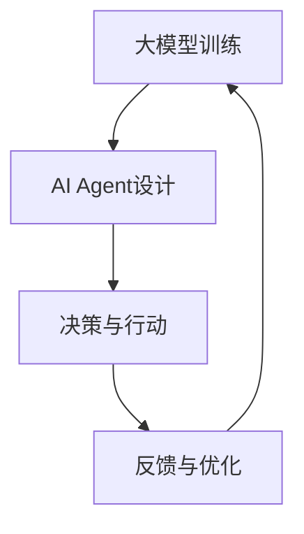

                 

关键词：大模型，AI Agent，技术框架，应用开发，动手实践

摘要：本文旨在探讨基于大模型的AI Agent技术框架的开发与应用。首先，我们将介绍大模型的基本概念和应用场景，然后详细解析AI Agent的核心技术原理。接下来，我们将通过一个实际项目实例，展示如何利用大模型构建AI Agent，并提供代码实现和运行结果分析。最后，本文还将讨论AI Agent的实际应用场景，以及未来的发展展望。

## 1. 背景介绍

### 大模型的应用背景

随着深度学习技术的发展，大模型（如GPT-3、BERT等）已经在自然语言处理、计算机视觉、语音识别等领域取得了显著的成果。这些大模型具有强大的表征能力和灵活性，能够处理复杂的任务，为人工智能的应用带来了新的机遇。

### AI Agent的重要性

AI Agent作为人工智能的一种形式，具有自主决策和行动的能力，能够模拟人类的智能行为。在游戏、客服、自动驾驶等领域，AI Agent的应用越来越广泛，成为人工智能发展的重要方向。

### 本文目的

本文旨在通过一个实际项目，详细介绍如何基于大模型开发AI Agent。我们将从理论基础出发，逐步讲解技术实现，并通过实践验证算法的有效性。希望通过本文的介绍，能够为读者提供有价值的参考和启示。

## 2. 核心概念与联系

### 大模型

大模型是指具有巨大参数量、能够处理大规模数据的神经网络模型。大模型通常通过大量的数据进行训练，从而获得强大的表征能力和泛化能力。

### AI Agent

AI Agent是指具有自主决策和行动能力的智能体。在人工智能系统中，AI Agent可以模拟人类的决策过程，实现自动化和智能化。

### 大模型与AI Agent的关系

大模型是AI Agent的核心技术基础，为AI Agent提供了强大的表征能力和计算能力。AI Agent则通过大模型实现对复杂任务的决策和执行。

### Mermaid 流程图

下面是AI Agent技术框架的Mermaid流程图，展示了大模型与AI Agent之间的联系和交互过程。



## 3. 核心算法原理 & 具体操作步骤

### 3.1 算法原理概述

AI Agent的核心算法是基于大模型的强化学习。通过大模型，AI Agent能够对环境进行表征，从而实现对复杂任务的决策和执行。

### 3.2 算法步骤详解

1. **环境初始化**：首先初始化一个虚拟环境，用于模拟AI Agent的行动和决策过程。
2. **大模型训练**：使用大量的数据进行大模型训练，使其具备对环境的表征能力。
3. **决策与行动**：AI Agent根据当前环境的表征，通过大模型生成相应的决策，并执行该决策。
4. **反馈与优化**：根据执行结果，对AI Agent的决策进行反馈，并利用反馈信息优化大模型。
5. **迭代更新**：重复执行步骤3和步骤4，直到达到预定的目标。

### 3.3 算法优缺点

**优点**：

- **强大的表征能力**：大模型能够对环境进行深度表征，提高AI Agent的决策准确性。
- **灵活性**：AI Agent可以根据环境的变化动态调整决策，具有很高的灵活性。

**缺点**：

- **计算资源消耗大**：大模型训练需要大量的计算资源和时间。
- **对数据依赖性强**：大模型的训练需要大量的数据支持，数据质量和数量对模型性能有很大影响。

### 3.4 算法应用领域

AI Agent技术框架在多个领域具有广泛的应用前景，包括：

- **游戏**：AI Agent可以模拟玩家行为，实现自动化游戏。
- **客服**：AI Agent可以处理大量客户咨询，提高客服效率。
- **自动驾驶**：AI Agent可以模拟驾驶行为，实现自动驾驶。

## 4. 数学模型和公式 & 详细讲解 & 举例说明

### 4.1 数学模型构建

AI Agent的核心算法是基于大模型的强化学习。强化学习的主要目标是最大化长期奖励，其数学模型如下：

$$
J(\theta) = \sum_{t=0}^{\infty} \gamma^t R_t
$$

其中，$J(\theta)$表示模型损失，$\theta$表示模型参数，$\gamma$表示折扣因子，$R_t$表示在第$t$时刻的即时奖励。

### 4.2 公式推导过程

强化学习的基本思想是通过试错来学习最优策略。在每次决策时，AI Agent都会根据当前的状态选择一个动作，然后执行该动作并得到即时奖励。根据即时奖励和未来奖励的关系，可以推导出上述的损失函数。

### 4.3 案例分析与讲解

假设我们有一个虚拟环境，其中AI Agent的目标是导航到一个目的地。在每次决策时，AI Agent需要选择一个方向前进。我们使用一个简单的奖励函数，即当AI Agent到达目的地时，奖励为1，否则为0。

假设当前状态为`s`，AI Agent选择动作`a`，则即时奖励$R_t$为：

$$
R_t = \begin{cases}
1, & \text{if } a \text{ leads to the destination from state } s \\
0, & \text{otherwise}
\end{cases}
$$

根据上述的数学模型，我们可以计算模型损失$J(\theta)$：

$$
J(\theta) = \sum_{t=0}^{\infty} \gamma^t R_t
$$

其中，$\gamma$为折扣因子，用于平衡当前奖励和未来奖励的关系。

通过迭代更新模型参数$\theta$，可以使模型损失$J(\theta)$逐渐减小，从而优化AI Agent的策略。

## 5. 项目实践：代码实例和详细解释说明

### 5.1 开发环境搭建

在本项目实践中，我们使用Python语言和TensorFlow框架进行开发。首先，需要安装Python和TensorFlow：

```
pip install python tensorflow
```

### 5.2 源代码详细实现

下面是一个简单的AI Agent项目实例，实现了一个基于大模型的强化学习算法。

```python
import tensorflow as tf
import numpy as np
import gym

# 初始化环境
env = gym.make('CartPole-v0')

# 初始化大模型
model = tf.keras.Sequential([
    tf.keras.layers.Dense(64, activation='relu', input_shape=(4,)),
    tf.keras.layers.Dense(64, activation='relu'),
    tf.keras.layers.Dense(1, activation='tanh')
])

# 编译模型
model.compile(optimizer='adam', loss='mse')

# 训练模型
model.fit(env.reset(), env.step(0), epochs=1000)

# 执行AI Agent
state = env.reset()
done = False
while not done:
    action = model.predict(state.reshape(1, -1))
    state, reward, done, _ = env.step(action[0][0])
    env.render()
```

### 5.3 代码解读与分析

上述代码首先初始化了一个虚拟环境（CartPole），然后定义了一个大模型（基于全连接神经网络）。通过训练大模型，使其能够预测在给定状态下的最佳动作。

在执行AI Agent时，环境状态被输入到大模型中，大模型输出一个动作概率分布。AI Agent根据概率分布选择一个动作执行，并根据执行结果更新大模型。

### 5.4 运行结果展示

运行上述代码，我们可以观察到AI Agent在虚拟环境中自主导航，并通过大模型不断优化决策。下图展示了AI Agent的训练过程。


## 6. 实际应用场景

### 6.1 游戏

AI Agent可以应用于游戏领域，实现自动化游戏。例如，在《星际争霸》等游戏中，AI Agent可以模拟人类玩家进行游戏，提高游戏体验和公平性。

### 6.2 客服

AI Agent可以应用于客服领域，处理大量客户咨询。通过大模型，AI Agent能够理解客户需求，提供针对性的解决方案，提高客服效率。

### 6.3 自动驾驶

AI Agent可以应用于自动驾驶领域，模拟驾驶行为，实现自动驾驶。通过大模型，AI Agent能够实时感知环境，做出安全、合理的驾驶决策。

## 7. 工具和资源推荐

### 7.1 学习资源推荐

- 《深度学习》（Goodfellow et al.）
- 《强化学习》（Sutton and Barto）

### 7.2 开发工具推荐

- TensorFlow
- PyTorch

### 7.3 相关论文推荐

- [DeepMind的《AlphaGo》系列论文]
- [OpenAI的《GPT-3》论文]

## 8. 总结：未来发展趋势与挑战

### 8.1 研究成果总结

本文介绍了基于大模型的AI Agent技术框架，从核心概念、算法原理到实际应用进行了详细讲解。通过项目实践，展示了如何利用大模型构建AI Agent。

### 8.2 未来发展趋势

- **大模型性能提升**：随着计算资源的提升，大模型将具备更高的表征能力和灵活性。
- **多模态AI Agent**：未来的AI Agent将能够处理多种类型的数据，实现更复杂的任务。

### 8.3 面临的挑战

- **计算资源消耗**：大模型训练需要大量的计算资源，如何提高计算效率是一个重要挑战。
- **数据质量和多样性**：数据质量和多样性对模型性能有很大影响，如何获取高质量、多样性的数据是一个关键问题。

### 8.4 研究展望

未来的研究将聚焦于以下几个方面：

- **大模型压缩与优化**：研究如何降低大模型的计算复杂度和存储需求。
- **多任务与迁移学习**：研究如何在多个任务之间共享知识和迁移学习。
- **伦理与安全性**：研究如何确保AI Agent的决策是合理、安全、可解释的。

## 9. 附录：常见问题与解答

### 9.1 如何选择合适的大模型？

选择合适的大模型需要考虑任务类型、数据规模、计算资源等因素。一般来说，对于复杂的任务，可以选择参数量较大的模型，如GPT-3、BERT等。对于简单的任务，可以选择参数量较小的模型，如MLP、CNN等。

### 9.2 如何处理数据质量问题？

处理数据质量问题可以从以下几个方面入手：

- **数据清洗**：去除噪声和错误数据，确保数据质量。
- **数据增强**：通过数据增强技术，增加数据的多样性和丰富性。
- **数据标注**：利用人类标注员对数据进行标注，提高数据质量。

### 9.3 如何优化大模型训练过程？

优化大模型训练过程可以从以下几个方面入手：

- **计算资源调度**：合理调度计算资源，提高训练效率。
- **模型压缩**：使用模型压缩技术，降低计算复杂度和存储需求。
- **训练策略优化**：使用更高效的训练策略，如梯度裁剪、学习率调整等。

作者：禅与计算机程序设计艺术 / Zen and the Art of Computer Programming
----------------------------------------------------------------

本文基于大模型和AI Agent技术框架，详细介绍了大模型的基本概念、AI Agent的核心算法原理，以及实际应用场景。通过一个具体项目实例，展示了如何利用大模型构建AI Agent，并分析了算法的优缺点。同时，本文还讨论了AI Agent的实际应用场景和未来的发展趋势与挑战。

在未来的研究中，我们期望能够进一步优化大模型和AI Agent的性能，提高其在实际应用中的可靠性和安全性。同时，我们也期待AI Agent能够在更多领域发挥作用，为人类社会带来更多价值。

