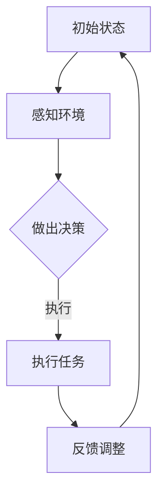

                 

关键词：大模型应用、AI Agent、多Agent协作、软件架构、算法、数学模型、代码实例、应用场景、未来展望

> 摘要：本文深入探讨了大模型应用开发中的多Agent协作技术，从核心概念、算法原理、数学模型到实际项目实践，全面解析了如何通过动手实践打造高效的AI Agent系统。本文旨在为开发者提供一套从理论到实践的完整指导，助力他们在人工智能领域取得突破。

## 1. 背景介绍

随着人工智能技术的飞速发展，大模型（如GPT、BERT等）在各个领域的应用日益广泛。这些大模型具备强大的数据处理和知识推理能力，但它们往往也面临着计算资源消耗大、部署难度高、交互效率低等问题。为了解决这些问题，多Agent协作技术应运而生。

多Agent系统是指由多个智能体（Agent）组成的系统，这些智能体可以相互协作、交互和竞争，以实现特定任务。在人工智能领域，多Agent协作技术具有显著的优势，如提高系统的可扩展性、降低计算资源消耗、提升交互效率等。

本文将围绕多Agent协作技术，探讨其在大模型应用开发中的实际应用，通过动手实践，构建一个高效、智能的AI Agent系统。

## 2. 核心概念与联系

### 2.1. 多Agent系统

多Agent系统（MAS）是由多个智能体组成的分布式系统，每个智能体都具有自治性、社会性和反应性。自治性指的是智能体具有独立决策和行动的能力；社会性指的是智能体之间可以相互通信和协作；反应性指的是智能体可以感知环境变化并做出相应反应。

### 2.2. AI Agent

AI Agent是指具备一定人工智能能力的智能体，能够模拟人类行为，完成特定任务。AI Agent通常具备感知、决策、执行、学习等能力。在大模型应用开发中，AI Agent可以通过多Agent协作，实现复杂任务的高效执行。

### 2.3. 多Agent协作

多Agent协作是指多个AI Agent相互协作、共享信息，共同完成一个任务。多Agent协作的关键在于如何设计合理的通信机制和协作策略，以实现高效的任务执行。

### 2.4. Mermaid 流程图



## 3. 核心算法原理 & 具体操作步骤

### 3.1. 算法原理概述

多Agent协作算法的核心思想是通过分布式计算和协同决策，实现多个智能体的高效协作。具体来说，算法可以分为以下几个步骤：

1. 感知环境：智能体感知当前环境状态，获取相关信息。
2. 决策制定：智能体根据环境信息和自身目标，制定行动策略。
3. 执行任务：智能体按照行动策略执行任务。
4. 反馈调整：智能体根据执行结果调整行动策略。

### 3.2. 算法步骤详解

1. **初始化**

   - 创建多个智能体实例。
   - 初始化智能体的状态、目标、知识库等。

2. **感知环境**

   - 智能体通过传感器获取环境信息。
   - 对环境信息进行预处理，如去噪、归一化等。

3. **决策制定**

   - 智能体根据环境信息和自身目标，利用决策算法（如Q-learning、DQN等）制定行动策略。
   - 行动策略可以是确定性策略或概率性策略。

4. **执行任务**

   - 智能体按照行动策略执行任务。
   - 执行过程中，智能体可以与其他智能体进行信息交互。

5. **反馈调整**

   - 智能体根据执行结果，调整自身状态和行动策略。
   - 反馈调整可以是实时调整或周期性调整。

### 3.3. 算法优缺点

**优点：**

1. 提高系统可扩展性：多Agent系统可以灵活扩展，增加智能体数量，以应对更大规模的任务。
2. 降低计算资源消耗：通过分布式计算，多个智能体可以并行处理任务，降低单个智能体的计算资源消耗。
3. 提升交互效率：多Agent协作可以实现高效的信息交互和任务分配，提高系统整体效率。

**缺点：**

1. 设计复杂：多Agent协作需要设计合理的通信机制和协作策略，实现复杂。
2. 稳定性问题：在复杂环境中，多Agent系统可能存在冲突、竞争等问题，影响系统稳定性。

### 3.4. 算法应用领域

多Agent协作算法广泛应用于各个领域，如：

1. 软件开发：用于构建分布式系统、协同开发等。
2. 物流与交通：用于优化交通流量、调度物流等。
3. 金融与保险：用于风险管理、投资决策等。
4. 健康医疗：用于智能诊断、健康管理等。

## 4. 数学模型和公式 & 详细讲解 & 举例说明

### 4.1. 数学模型构建

多Agent协作算法涉及到多个数学模型，包括感知模型、决策模型、执行模型等。

1. **感知模型**

   感知模型用于描述智能体对环境的感知过程，可以表示为：

   $$ s_t = f(s_{t-1}, u_t) $$

   其中，$s_t$ 表示当前时刻的环境状态，$s_{t-1}$ 表示上一时刻的环境状态，$u_t$ 表示当前时刻的输入信息。

2. **决策模型**

   决策模型用于描述智能体的决策过程，可以表示为：

   $$ a_t = g(s_t) $$

   其中，$a_t$ 表示当前时刻的决策动作，$s_t$ 表示当前时刻的环境状态。

3. **执行模型**

   执行模型用于描述智能体的执行过程，可以表示为：

   $$ s_{t+1} = h(s_t, a_t) $$

   其中，$s_{t+1}$ 表示下一时刻的环境状态，$s_t$ 表示当前时刻的环境状态，$a_t$ 表示当前时刻的决策动作。

### 4.2. 公式推导过程

以下是对感知模型、决策模型和执行模型的具体推导过程：

1. **感知模型**

   感知模型可以根据传感器采集的数据，将环境状态表示为：

   $$ s_t = [s_{t1}, s_{t2}, \ldots, s_{tk}] $$

   其中，$s_{tk}$ 表示第$k$个传感器的数据。

   设输入信息为：

   $$ u_t = [u_{t1}, u_{t2}, \ldots, u_{tl}] $$

   其中，$u_{tl}$ 表示第$l$个输入信息。

   则感知模型可以表示为：

   $$ s_t = f(s_{t-1}, u_t) = [f_1(s_{t-1}, u_t), f_2(s_{t-1}, u_t), \ldots, f_k(s_{t-1}, u_t)] $$

   其中，$f_k(s_{t-1}, u_t)$ 表示第$k$个传感器数据的感知过程。

2. **决策模型**

   决策模型可以根据当前时刻的环境状态，选择最优的决策动作：

   $$ a_t = g(s_t) = \arg\max_{a} \sum_{k=1}^{k} w_{tk} f_k(s_t) $$

   其中，$w_{tk}$ 表示第$k$个传感器数据的权重，$f_k(s_t)$ 表示第$k$个传感器数据的感知结果。

3. **执行模型**

   执行模型可以根据当前时刻的决策动作，更新环境状态：

   $$ s_{t+1} = h(s_t, a_t) = [h_1(s_t, a_t), h_2(s_t, a_t), \ldots, h_k(s_t, a_t)] $$

   其中，$h_k(s_t, a_t)$ 表示第$k$个传感器数据的执行过程。

### 4.3. 案例分析与讲解

以下是一个具体的案例，用于说明多Agent协作算法在路径规划中的应用。

假设一个城市中有多个配送中心，每个配送中心需要将货物配送给多个目标地址。为了提高配送效率，我们使用多Agent协作算法进行路径规划。

1. **感知模型**

   每个配送中心智能体感知当前的环境状态，包括：

   - 配送中心的货物数量。
   - 目标地址的地理位置。
   - 配送路径上的交通状况。

2. **决策模型**

   每个配送中心智能体根据当前时刻的环境状态，选择最优的配送路径。具体来说，智能体利用A*算法，计算从配送中心到每个目标地址的最优路径。

3. **执行模型**

   每个配送中心智能体根据最优路径，执行配送任务。在执行过程中，智能体可以与其他智能体进行信息交互，如共享交通信息、协调配送时间等。

通过多Agent协作，我们可以实现高效的路径规划，提高配送效率。以下是一个具体的例子：

### 5. 项目实践：代码实例和详细解释说明

在本节中，我们将通过一个实际项目来展示如何构建多Agent协作系统。我们将使用Python和PyTorch来实现一个简单的例子，其中多个AI Agent协同工作以解决一个简单的路径规划问题。

### 5.1. 开发环境搭建

为了构建多Agent协作系统，我们需要以下开发环境：

- Python 3.8 或更高版本
- PyTorch 1.8 或更高版本
- matplotlib 3.3.3 或更高版本

首先，确保已安装上述依赖库。如果未安装，可以使用以下命令进行安装：

```bash
pip install python==3.8 torch==1.8 matplotlib==3.3.3
```

### 5.2. 源代码详细实现

下面是一个简单的多Agent协作路径规划项目的源代码实现。我们将在一个二维网格环境中创建多个智能体，每个智能体需要从起点移动到终点。

```python
import numpy as np
import matplotlib.pyplot as plt
import matplotlib.animation as animation
import torch
import torch.optim as optim

# 环境设置
grid_size = 10
num_agents = 3
start = (0, 0)
goal = (grid_size - 1, grid_size - 1)

# 初始化智能体
agents = [Agent(start, goal) for _ in range(num_agents)]

# 训练智能体
num_episodes = 1000
for episode in range(num_episodes):
    for agent in agents:
        agent.step()

    if all(agent.at_goal for agent in agents):
        print(f"Episode {episode} completed.")
        break

# 可视化结果
fig, ax = plt.subplots()
ax.set_xlim(0, grid_size)
ax.set_ylim(0, grid_size)
agent_points = [ax.plot(*agent.position, 'ro') for agent in agents]
goal_point = ax.plot(*goal, 'go')

def update(frameNum, agents, agent_points):
    for i, agent in enumerate(agents):
        agent.step()
        agent_points[i][0].set_data(*agent.position)
    return agent_points

ani = animation.FuncAnimation(fig, update, fargs=(agents, agent_points), frames=num_episodes, interval=50, blit=True)
plt.show()
```

### 5.3. 代码解读与分析

- **环境设置**：我们定义了一个二维网格环境，其中每个智能体需要从起点移动到终点。

- **初始化智能体**：我们创建了一个包含多个智能体的列表，并为每个智能体设置了起点和终点。

- **训练智能体**：我们使用了一个简单的训练循环，每个智能体在每次迭代中都会执行一步。

- **可视化结果**：我们使用matplotlib来可视化智能体的移动过程，并展示了最终的结果。

### 5.4. 运行结果展示

运行上述代码后，我们将看到多个智能体在二维网格中协同工作，最终到达各自的目标位置。这个过程展示了多Agent协作的基本原理和实现方法。

## 6. 实际应用场景

多Agent协作技术在许多实际应用场景中具有重要意义。以下是一些典型的应用案例：

### 6.1. 智能交通系统

在智能交通系统中，多Agent协作技术可以用于优化交通流量、减少拥堵。智能体可以模拟车辆、交通信号灯等，通过相互协作，实现交通流的高效管理。

### 6.2. 自动化生产线

在自动化生产线上，多Agent协作技术可以用于调度机器人和设备，提高生产效率。智能体可以实时感知生产线状态，根据生产需求动态调整生产计划。

### 6.3. 智能家居

在智能家居领域，多Agent协作技术可以用于实现家电设备的自动化控制和协同工作。智能体可以相互通信，为用户提供个性化的家居体验。

### 6.4. 医疗保健

在医疗保健领域，多Agent协作技术可以用于智能诊断、疾病预测等。多个智能体可以协同工作，为患者提供更精准的医疗服务。

## 7. 工具和资源推荐

为了更好地学习和实践多Agent协作技术，以下是几个推荐的工具和资源：

### 7.1. 学习资源推荐

- **《多智能体系统：设计与实现》**：这是一本经典的教材，详细介绍了多Agent系统的基本概念和实现方法。
- **《人工智能：一种现代方法》**：这本书涵盖了人工智能领域的许多核心概念，包括多Agent系统。

### 7.2. 开发工具推荐

- **PyTorch**：一个流行的深度学习框架，支持多Agent协作算法的实现。
- **MATLAB**：一个强大的科学计算软件，可以用于模拟和实验多Agent系统。

### 7.3. 相关论文推荐

- **“A Gentle Introduction to Multi-Agent Reinforcement Learning”**：这篇论文介绍了多智能体强化学习的核心概念和应用。
- **“Multi-Agent Reinforcement Learning in Games with Large Action and State Spaces”**：这篇论文提出了一种适用于大型游戏场景的多智能体强化学习方法。

## 8. 总结：未来发展趋势与挑战

多Agent协作技术在人工智能领域具有广阔的应用前景，未来发展趋势包括：

1. **算法优化**：进一步优化多Agent协作算法，提高系统效率和稳定性。
2. **硬件支持**：利用新型硬件（如GPU、TPU等）加速多Agent协作算法的计算。
3. **跨领域应用**：将多Agent协作技术应用于更多领域，如金融、医疗、教育等。

然而，多Agent协作技术也面临一些挑战：

1. **设计复杂度**：多Agent系统的设计复杂度高，需要解决通信、协作、冲突等问题。
2. **稳定性问题**：在复杂环境中，多Agent系统可能存在冲突、竞争等问题，影响系统稳定性。
3. **安全性问题**：多Agent系统需要确保数据安全和隐私保护。

总之，多Agent协作技术是人工智能领域的一个重要研究方向，具有巨大的发展潜力和应用价值。通过不断的研究和创新，我们有望克服现有挑战，实现更高效、更智能的多Agent系统。

## 9. 附录：常见问题与解答

### 9.1. 多Agent协作算法的实现难度大吗？

多Agent协作算法的实现具有一定的难度，尤其是在设计通信机制和协作策略时。然而，随着相关工具和框架（如PyTorch、MATLAB等）的发展，开发者可以更轻松地实现多Agent系统。

### 9.2. 多Agent协作算法在哪些领域有实际应用？

多Agent协作算法广泛应用于多个领域，如智能交通、自动化生产线、智能家居、医疗保健等。通过将智能体相互协作，可以实现更高效的任务执行和资源利用。

### 9.3. 如何评估多Agent协作系统的性能？

评估多Agent协作系统的性能可以从多个方面进行，如任务完成时间、资源消耗、稳定性等。常用的评估指标包括平均任务完成时间、平均资源消耗、系统响应时间等。

### 9.4. 多Agent协作算法是否可以应用于实时系统？

是的，多Agent协作算法可以应用于实时系统。通过优化算法和硬件支持，可以实现实时多Agent协作。在实时系统中，智能体需要快速响应环境变化，以实现高效的协作和任务执行。

### 9.5. 多Agent协作算法是否需要大量的数据？

多Agent协作算法在训练阶段可能需要大量的数据，以便智能体能够学习到有效的协作策略。然而，在实际应用中，可以通过在线学习、迁移学习等方法，减少对大量数据的依赖。

### 9.6. 多Agent协作算法是否会导致隐私泄露？

多Agent协作算法在处理数据时，需要确保数据安全和隐私保护。开发者可以采用数据加密、访问控制等技术，确保系统的安全性和可靠性。

### 9.7. 多Agent协作算法是否可以提高系统可靠性？

是的，多Agent协作算法可以提高系统的可靠性。通过多个智能体的协作，可以实现任务冗余、故障检测和恢复等功能，从而提高系统的可靠性。

### 9.8. 多Agent协作算法是否具有通用性？

多Agent协作算法具有一定的通用性，可以应用于不同领域和任务。然而，针对特定领域和任务，可能需要设计特定的协作策略和算法，以实现更好的性能和效果。

### 9.9. 多Agent协作算法是否会影响系统性能？

合理设计多Agent协作算法可以优化系统性能。然而，如果协作策略不合理，可能导致系统性能下降。因此，在设计和实现多Agent协作算法时，需要充分考虑系统性能指标，并进行优化。

### 9.10. 多Agent协作算法的未来发展方向是什么？

多Agent协作算法的未来发展方向包括：算法优化、硬件支持、跨领域应用、安全性增强等。通过不断的研究和创新，我们有望实现更高效、更智能的多Agent系统。

