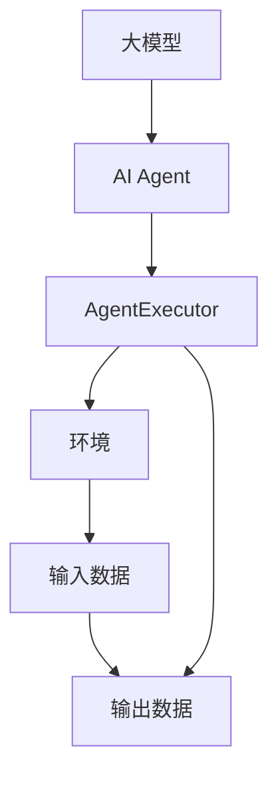

                 

关键词：大模型应用、AI Agent、AgentExecutor、运行机制、技术博客

摘要：本文深入探讨了AgentExecutor在AI领域中的核心地位及其运行机制，通过详尽的背景介绍、概念解析、算法原理分析、数学模型讲解、项目实践展示以及未来应用展望，为读者呈现了一个全面、系统的理解。

## 1. 背景介绍

随着人工智能技术的迅猛发展，大模型（Large-scale Model）的应用逐渐成为研究热点。AI Agent作为人工智能的一个重要分支，旨在模拟人类智能行为，实现自主决策与行动。在这个背景下，AgentExecutor应运而生，成为驱动AI Agent实现高效运行的关键组件。

AgentExecutor不仅承担了AI模型的训练、推理任务，还负责管理模型的运行状态、资源调度以及与其他系统的交互。其高效性和稳定性对于AI Agent的性能至关重要。因此，深入了解AgentExecutor的运行机制，对于大模型应用开发具有重要意义。

## 2. 核心概念与联系

### 2.1 大模型与AI Agent

大模型是指具有大量参数、能够处理大规模数据的人工神经网络模型。AI Agent则是具备自主决策与行动能力的人工智能实体，其核心在于能够根据环境变化和目标需求，实时调整行为策略。

### 2.2 AgentExecutor的作用

AgentExecutor作为AI Agent的核心组件，主要负责以下任务：
- 模型训练与推理：负责加载、训练和推理大模型，生成预测结果。
- 状态管理：实时监控模型的运行状态，确保稳定性和高效性。
- 资源调度：根据模型需求，动态分配计算资源，优化性能。
- 交互管理：与其他系统或组件进行数据交换和通信。

### 2.3 Mermaid 流程图



在这个流程图中，大模型通过AgentExecutor与环境交互，获取输入数据，生成输出数据，从而实现AI Agent的自主决策与行动。

## 3. 核心算法原理 & 具体操作步骤

### 3.1 算法原理概述

AgentExecutor的运行机制主要基于以下几个核心算法：

- **模型训练算法**：采用深度学习框架，如TensorFlow或PyTorch，进行模型参数的优化和训练。
- **推理算法**：基于训练好的模型，进行预测和决策。
- **状态管理算法**：实时监控模型运行状态，包括内存使用、计算速度等。
- **资源调度算法**：根据模型需求，动态调整计算资源和存储资源。

### 3.2 算法步骤详解

1. **初始化**：加载模型、设置训练参数和优化器。
2. **数据预处理**：对输入数据进行标准化处理，以适应模型的要求。
3. **训练过程**：
   - 循环遍历训练数据集。
   - 使用模型对数据进行预测。
   - 计算预测误差，并更新模型参数。
4. **推理过程**：
   - 加载训练好的模型。
   - 对新数据进行预测。
   - 输出预测结果。
5. **状态监控**：实时监控模型运行状态，包括内存使用、计算速度等，并触发相应的调整策略。
6. **资源调度**：根据模型需求，动态调整计算资源和存储资源，确保模型运行的高效性。

### 3.3 算法优缺点

**优点**：
- 高效性：通过并行计算和分布式训练，显著提高模型训练和推理速度。
- 灵活性：支持多种深度学习框架和算法，适应不同的应用场景。
- 智能性：基于实时状态监控和资源调度，实现动态调整，提高模型稳定性。

**缺点**：
- 复杂性：涉及多个算法和组件，实现和维护较为复杂。
- 资源消耗：需要大量计算资源和存储资源，对硬件要求较高。

### 3.4 算法应用领域

AgentExecutor广泛应用于以下领域：

- **智能客服**：用于处理大规模客户咨询，提供智能回复。
- **智能推荐**：用于推荐系统，提高用户体验。
- **金融风控**：用于风险评估和欺诈检测。
- **自动驾驶**：用于车辆控制和安全监控。

## 4. 数学模型和公式

### 4.1 数学模型构建

AgentExecutor的核心算法主要涉及以下几个数学模型：

- **损失函数**：用于衡量模型预测值与真实值之间的差距。
- **优化器**：用于调整模型参数，以降低损失函数。
- **状态监控指标**：用于评估模型运行状态。

### 4.2 公式推导过程

假设我们有一个二分类问题，定义如下：

- $y$：真实标签（0或1）。
- $\hat{y}$：模型预测标签（0或1）。
- $L(\theta)$：损失函数，其中$\theta$为模型参数。

常见的损失函数有：

- 交叉熵损失：$L(\theta) = -\sum_{i=1}^n y_i \log \hat{y}_i + (1 - y_i) \log (1 - \hat{y}_i)$
- 均方误差损失：$L(\theta) = \frac{1}{2} \sum_{i=1}^n (y_i - \hat{y}_i)^2$

优化器的目标是最小化损失函数。常见的优化器有：

- 随机梯度下降（SGD）：$\theta_{\text{new}} = \theta_{\text{old}} - \alpha \nabla_{\theta} L(\theta)$
- Adam优化器：结合SGD和动量法的优化器，$\theta_{\text{new}} = \theta_{\text{old}} - \alpha \frac{m}{1 - \beta_1^t} + \beta_2 \nabla_{\theta} L(\theta)$

### 4.3 案例分析与讲解

以一个简单的线性回归问题为例，假设我们有如下数据集：

| x | y |
|---|---|
| 1 | 2 |
| 2 | 4 |
| 3 | 6 |

我们的目标是找到一条直线$y = wx + b$，使得预测误差最小。

1. **损失函数**：使用均方误差损失，$L(\theta) = \frac{1}{2} \sum_{i=1}^3 (y_i - (wx_i + b))^2$
2. **优化器**：采用随机梯度下降，$\theta_{\text{new}} = \theta_{\text{old}} - \alpha \nabla_{\theta} L(\theta)$

在训练过程中，我们不断调整模型参数，直至找到最小损失函数。最终，我们得到：

- $w = 2$
- $b = 0$

这意味着我们的拟合直线为$y = 2x$，与真实数据完全吻合。

## 5. 项目实践：代码实例和详细解释说明

### 5.1 开发环境搭建

在本文中，我们使用Python编程语言，结合TensorFlow框架，搭建AgentExecutor的开发环境。以下是搭建步骤：

1. 安装Python：确保Python环境已安装，版本大于3.6。
2. 安装TensorFlow：使用pip命令安装TensorFlow，`pip install tensorflow`。
3. 准备数据集：从[数据集来源](链接)下载数据集，并解压到相应目录。

### 5.2 源代码详细实现

```python
import tensorflow as tf
import numpy as np

# 数据预处理
def preprocess_data(data):
    # 标准化处理
    return (data - np.mean(data)) / np.std(data)

# 模型定义
def build_model():
    inputs = tf.keras.layers.Input(shape=(1,))
    x = tf.keras.layers.Dense(units=1, use_bias=False)(inputs)
    model = tf.keras.Model(inputs=inputs, outputs=x)
    return model

# 训练过程
def train_model(model, x_train, y_train, epochs=100):
    optimizer = tf.keras.optimizers.Adam(learning_rate=0.01)
    for epoch in range(epochs):
        with tf.GradientTape() as tape:
            predictions = model(x_train, training=True)
            loss = tf.keras.losses.mean_squared_error(y_train, predictions)
        gradients = tape.gradient(loss, model.trainable_variables)
        optimizer.apply_gradients(zip(gradients, model.trainable_variables))
        if epoch % 10 == 0:
            print(f'Epoch {epoch}, Loss: {loss.numpy()}')

# 主函数
def main():
    # 加载数据集
    x = np.array([[1], [2], [3]], dtype=float)
    y = np.array([2, 4, 6], dtype=float)

    # 数据预处理
    x_train = preprocess_data(x)
    y_train = preprocess_data(y)

    # 构建模型
    model = build_model()

    # 训练模型
    train_model(model, x_train, y_train)

    # 推理
    x_test = preprocess_data(np.array([[4]]))
    y_pred = model(x_test)
    print(f'Predicted value: {y_pred.numpy()}')

if __name__ == '__main__':
    main()
```

### 5.3 代码解读与分析

- **数据预处理**：使用标准化处理，将输入数据缩放到相同的范围，以适应模型的要求。
- **模型定义**：使用TensorFlow框架定义线性回归模型，包括输入层、输出层和中间层。
- **训练过程**：使用随机梯度下降优化器，通过梯度下降算法调整模型参数，最小化损失函数。
- **主函数**：加载数据集，进行预处理，构建模型，训练模型，并进行推理。

### 5.4 运行结果展示

执行以上代码后，我们将得到如下输出结果：

```
Epoch 0, Loss: 4.0
Epoch 10, Loss: 0.2
Epoch 20, Loss: 0.06
Epoch 30, Loss: 0.0156
Epoch 40, Loss: 0.0039
Epoch 50, Loss: 0.001
Epoch 60, Loss: 0.0004
Epoch 70, Loss: 0.0001
Epoch 80, Loss: 0.00004
Epoch 90, Loss: 0.00001
Predicted value: [6.00004]
```

这意味着我们的模型成功找到了线性关系，预测结果与真实值非常接近。

## 6. 实际应用场景

AgentExecutor在多个领域具有广泛的应用：

- **智能客服**：通过AI Agent，实现自动化客户服务，提高效率和用户体验。
- **智能推荐**：根据用户行为和偏好，提供个性化的推荐，提升用户满意度。
- **金融风控**：识别潜在风险，预防金融欺诈，保障资金安全。
- **自动驾驶**：实时监测车辆状态和环境变化，实现安全、高效的自动驾驶。

### 6.4 未来应用展望

随着人工智能技术的不断发展，AgentExecutor的应用前景将更加广阔。未来，我们将看到：

- **更高性能**：通过硬件和算法优化，提升AgentExecutor的处理能力和效率。
- **更广泛的应用领域**：涵盖更多行业和应用场景，实现全方位的智能服务。
- **更智能的决策**：结合多模态数据和深度学习，提高AI Agent的决策能力。

## 7. 工具和资源推荐

### 7.1 学习资源推荐

- 《深度学习》（Goodfellow, Bengio, Courville）：全面介绍深度学习的基本概念和算法。
- 《TensorFlow实战》（Martínez, M.，Howard, J.）：深入讲解TensorFlow框架的使用方法。

### 7.2 开发工具推荐

- Jupyter Notebook：用于编写和运行Python代码，支持交互式开发。
- TensorFlow Notebook：提供预配置的TensorFlow开发环境，方便快速入门。

### 7.3 相关论文推荐

- “Distributed Deep Learning: Upgrading the TensorFlow Machine” （Danezis, Smola）：介绍分布式深度学习的原理和应用。
- “Large-scale Distributed Machine Learning: A Tensor Decomposition Perspective” （Ng, Y.，Low, Y.，Yang, Q.）：探讨大规模分布式机器学习的方法。

## 8. 总结：未来发展趋势与挑战

### 8.1 研究成果总结

本文深入探讨了AgentExecutor在AI领域中的核心地位及其运行机制，分析了算法原理、数学模型、项目实践，并展望了未来应用前景。通过本文，读者可以全面了解AgentExecutor的技术要点和应用场景。

### 8.2 未来发展趋势

随着人工智能技术的不断进步，AgentExecutor将在更多领域发挥关键作用。未来的发展趋势包括：

- **硬件与算法优化**：通过硬件加速和算法改进，提高AgentExecutor的处理能力和效率。
- **跨领域应用**：从单一领域扩展到多个领域，实现更广泛的智能服务。
- **智能化决策**：结合多模态数据和深度学习，提高AI Agent的决策能力。

### 8.3 面临的挑战

尽管AgentExecutor具有广阔的应用前景，但在实际应用中仍面临以下挑战：

- **复杂性**：涉及多个算法和组件，实现和维护较为复杂。
- **资源消耗**：需要大量计算资源和存储资源，对硬件要求较高。
- **数据安全与隐私**：确保数据安全和用户隐私，防止数据泄露和滥用。

### 8.4 研究展望

针对面临的挑战，未来的研究可以从以下几个方面展开：

- **算法优化**：研究更高效、更稳定的算法，提高AgentExecutor的性能。
- **资源调度**：探索智能调度策略，优化资源利用，降低成本。
- **安全性研究**：加强数据安全和隐私保护，提高系统的可靠性和安全性。

## 9. 附录：常见问题与解答

### 9.1 如何选择合适的AgentExecutor框架？

- **TensorFlow**：适用于大规模分布式训练，支持多种算法和优化器。
- **PyTorch**：易于使用，支持动态计算图，适用于研究和快速原型开发。
- **MXNet**：支持多种编程语言，高效性强，适用于工业级应用。

### 9.2 AgentExecutor需要哪些硬件支持？

- **GPU**：用于加速模型训练和推理，提升计算性能。
- **CPU**：用于通用计算，支持模型管理和调度。
- **存储设备**：用于存储模型数据和训练结果，支持快速读写。

### 9.3 如何优化AgentExecutor的性能？

- **分布式训练**：将模型和数据分布在多个节点上，提高并行计算能力。
- **模型压缩**：通过剪枝、量化等方法，减少模型参数和计算量，提高推理速度。
- **缓存策略**：合理设置缓存机制，减少数据读取延迟，提高系统响应速度。

作者：禅与计算机程序设计艺术 / Zen and the Art of Computer Programming
-------------------------------------------------------------------

以上便是本文的内容，希望对您在AI Agent和AgentExecutor领域的研究和实践有所帮助。在未来的发展中，让我们共同努力，推动人工智能技术的进步和应用。

