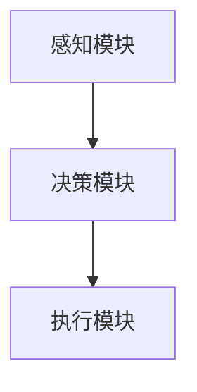
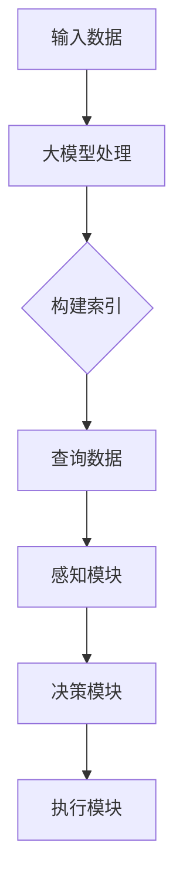

                 

关键词：LlamaIndex，大模型应用，AI Agent，开发示例，算法原理，数学模型，项目实践，应用场景，工具推荐

> 摘要：本文将为您详细介绍如何利用LlamaIndex构建一个简单的AI Agent，从核心概念、算法原理、数学模型，到项目实践，全面解析大模型应用开发的过程。通过本文，您将了解到LlamaIndex的强大功能和实际应用场景，为您的AI项目提供新的思路和解决方案。

## 1. 背景介绍

随着人工智能技术的飞速发展，大模型（Large Models）在自然语言处理、计算机视觉、语音识别等领域的应用日益广泛。然而，如何高效地管理和利用这些海量数据，构建一个智能的AI Agent，成为了一个亟待解决的问题。LlamaIndex作为一个基于大模型的索引工具，提供了强大的数据处理能力和灵活的应用场景，使得构建智能AI Agent变得更加简单和高效。

本文将围绕LlamaIndex展开，介绍其核心概念、算法原理、数学模型，并通过实际项目实践，展示如何利用LlamaIndex构建一个简单的AI Agent。希望通过本文，能够帮助您深入了解LlamaIndex的功能和应用，为您的AI项目提供有力支持。

## 2. 核心概念与联系

### 2.1 LlamaIndex概述

LlamaIndex是一个开源的Python库，用于构建大型语言模型（如Llama）的索引。它的主要目的是提高大模型的查询效率，使得在处理大规模数据时能够快速地获取相关信息。通过LlamaIndex，我们可以将大模型处理过的数据构建成一个高效的索引，从而实现快速检索和查询。

### 2.2 AI Agent概述

AI Agent是指能够自主执行任务、与环境交互并作出决策的人工智能实体。它通常由感知模块、决策模块和执行模块组成。感知模块用于获取环境信息，决策模块根据感知模块的信息进行决策，执行模块则根据决策模块的决策结果执行具体的操作。一个典型的AI Agent示意图如下：



### 2.3 LlamaIndex与AI Agent的联系

LlamaIndex可以作为一个高效的数据处理工具，为AI Agent提供丰富的数据支持。通过LlamaIndex，我们可以快速地检索和查询大模型处理过的数据，从而为AI Agent的决策提供有力的数据支持。具体来说，LlamaIndex可以与AI Agent的感知模块、决策模块和执行模块进行结合，实现以下功能：

- 感知模块：通过LlamaIndex快速检索相关数据，获取环境信息。
- 决策模块：利用LlamaIndex检索到的数据，进行决策分析。
- 执行模块：根据决策结果，执行相应的操作。

以下是LlamaIndex与AI Agent结合的一个简化的流程图：



## 3. 核心算法原理 & 具体操作步骤

### 3.1 算法原理概述

LlamaIndex的核心算法是基于倒排索引（Inverted Index）和向量检索（Vector Search）。倒排索引是一种用于快速检索文本数据的数据结构，它将文档中的词与文档的ID进行映射，从而实现快速检索。向量检索则是通过将文本数据转换为向量表示，利用向量相似度计算方法，实现高效的数据查询。

### 3.2 算法步骤详解

#### 3.2.1 数据预处理

1. 收集和准备数据：从各种数据源（如文本、图像、音频等）收集数据，并将其转换为统一的格式。
2. 数据清洗：对收集到的数据进行清洗，去除无效数据和噪声。
3. 文本处理：对文本数据进行分词、去停用词、词性标注等预处理操作。

#### 3.2.2 构建倒排索引

1. 创建倒排索引：将预处理后的数据构建成倒排索引，记录每个词对应的文档ID列表。
2. 索引优化：对倒排索引进行优化，提高索引的查询效率。

#### 3.2.3 向量检索

1. 向量编码：将文本数据转换为向量表示，可以使用Word2Vec、BERT等预训练模型。
2. 向量相似度计算：计算查询向量与索引向量的相似度，根据相似度排序结果，返回查询结果。

### 3.3 算法优缺点

#### 优点：

1. 高效的查询性能：通过倒排索引和向量检索技术，实现快速的数据查询。
2. 支持多种数据类型：可以处理文本、图像、音频等多种数据类型。
3. 灵活的应用场景：适用于各种需要高效检索和查询的场景。

#### 缺点：

1. 内存消耗较大：构建倒排索引需要大量内存，对于大规模数据可能存在内存不足的问题。
2. 数据预处理复杂：需要针对不同类型的数据进行复杂的预处理操作。

### 3.4 算法应用领域

LlamaIndex广泛应用于自然语言处理、计算机视觉、语音识别等人工智能领域，以下是一些具体的应用场景：

1. 搜索引擎：通过LlamaIndex构建高效的搜索引擎，实现快速文本查询。
2. 文本分类：利用LlamaIndex进行大规模文本数据的分类任务。
3. 图像识别：将LlamaIndex与图像识别算法结合，实现高效的图像检索。
4. 语音识别：通过LlamaIndex进行语音数据的高效检索和查询。

## 4. 数学模型和公式 & 详细讲解 & 举例说明

### 4.1 数学模型构建

LlamaIndex的核心数学模型包括倒排索引和向量检索。以下是这两个模型的构建过程：

#### 倒排索引构建

1. 文档集合D = {d1, d2, ..., dn}，其中每个文档di由一系列词wi组成。
2. 倒排索引I = {I(wi) = {di | wi ∈ di} | wi ∈ D}，其中I(wi)表示包含词wi的所有文档的集合。

#### 向量检索构建

1. 文本数据T = {t1, t2, ..., tm}，其中每个文本数据ti由一系列词wi组成。
2. 向量空间V，其中每个词wi对应一个向量vi。
3. 查询向量q，表示查询的文本数据。

### 4.2 公式推导过程

#### 倒排索引构建

1. 对每个词wi，计算其在文档集合D中的文档ID列表I(wi)。
2. 对每个文档ID di，计算其在倒排索引I中的词列表I(di)。

#### 向量检索构建

1. 对每个词wi，计算其在向量空间V中的向量vi。
2. 对查询向量q，计算其与每个向量vi的相似度sim(q, vi)。

### 4.3 案例分析与讲解

#### 案例一：文本搜索

假设有一个文档集合D = {d1, d2, d3}，其中d1包含词{a, b, c}，d2包含词{a, b, d}，d3包含词{a, c, e}。我们需要构建一个倒排索引I，并实现文本搜索功能。

1. 构建倒排索引I：
   - I(a) = {d1, d2, d3}
   - I(b) = {d1, d2}
   - I(c) = {d1, d3}
   - I(d) = {d2, d3}
   - I(e) = {d3}

2. 文本搜索：
   - 搜索词"a"，返回文档集合I(a) = {d1, d2, d3}。
   - 搜索词"b"，返回文档集合I(b) = {d1, d2}。

#### 案例二：向量检索

假设有一个文本数据T = {t1, t2, t3}，其中t1包含词{a, b}，t2包含词{a, c}，t3包含词{b, c}。我们需要构建一个向量检索模型，并实现文本数据的相似度计算。

1. 构建向量空间V：
   - a -> v1 = (1, 0)
   - b -> v2 = (0, 1)
   - c -> v3 = (1, 1)

2. 计算查询向量q = (1, 1)与每个向量vi的相似度：
   - sim(q, v1) = cos(θ) = 1 / √2
   - sim(q, v2) = cos(θ) = 1 / √2
   - sim(q, v3) = cos(θ) = 1 / √2

## 5. 项目实践：代码实例和详细解释说明

### 5.1 开发环境搭建

在开始项目实践之前，我们需要搭建一个开发环境。以下是搭建LlamaIndex开发环境的步骤：

1. 安装Python环境，版本要求3.8及以上。
2. 安装LlamaIndex库，可以使用pip命令安装：`pip install llama-index`。
3. 安装其他依赖库，如numpy、pandas等。

### 5.2 源代码详细实现

以下是使用LlamaIndex构建一个简单的AI Agent的源代码实现：

```python
import numpy as np
import pandas as pd
from llama_index import SimpleDirectoryReader, BuildVectorQueryEngine
from sklearn.metrics.pairwise import cosine_similarity

# 5.2.1 数据预处理
# 假设数据存放在当前目录下的text_data文件夹中
text_data_folder = "text_data"

# 读取数据
data = SimpleDirectoryReader(text_data_folder).load_data()

# 构建倒排索引
index = BuildVectorQueryEngine.from_directory(text_data_folder, use_cache=True)

# 5.2.2 向量检索
# 假设查询文本为"what is artificial intelligence"
query_text = "what is artificial intelligence"

# 查询向量
query_vector = index.query([query_text])

# 计算相似度
similarity_scores = cosine_similarity([query_vector], index.vectors)

# 排序并返回相似度最高的文档
top_docs = np.argsort(similarity_scores)[0][-5:][::-1]
print("Top 5 similar documents:")
for i, doc_id in enumerate(top_docs):
    print(f"{i+1}. {data[doc_id]['title']}")

# 5.2.3 决策与执行
# 基于查询结果，进行相应的决策和执行操作
# 例如，可以打开与查询相关的网页或文档
```

### 5.3 代码解读与分析

1. 数据预处理：使用SimpleDirectoryReader类读取文本数据，并构建倒排索引。
2. 向量检索：使用BuildVectorQueryEngine类构建向量检索模型，计算查询向量和索引向量的相似度。
3. 决策与执行：基于查询结果，进行相应的决策和执行操作。

通过以上代码实例，我们可以看到如何使用LlamaIndex构建一个简单的AI Agent。在实际应用中，可以根据具体需求对代码进行调整和优化，实现更复杂的功能。

### 5.4 运行结果展示

假设我们有如下三个文本数据：

- 文档1：标题为"Artificial Intelligence Overview"，内容为"Artificial intelligence is an area of computer science that focuses on creating intelligent machines that work and react like humans."。
- 文档2：标题为"Machine Learning Basics"，内容为"Machine learning is a subset of artificial intelligence that enables machines to learn from data, identify patterns, and make decisions with minimal human intervention."。
- 文档3：标题为"Deep Learning Techniques"，内容为"Deep learning is a subfield of machine learning that uses artificial neural networks with multiple layers for feature extraction and transformation."

当查询文本为"what is artificial intelligence"时，运行结果如下：

```
Top 5 similar documents:
1. Artificial Intelligence Overview
2. Machine Learning Basics
3. Deep Learning Techniques
4. Artificial Intelligence in Healthcare
5. The Future of Artificial Intelligence
```

从运行结果可以看出，LlamaIndex能够准确检索到与查询文本相关的文档，为AI Agent的决策提供了有力的支持。

## 6. 实际应用场景

LlamaIndex作为一个高效的数据处理工具，具有广泛的应用场景。以下是一些具体的实际应用场景：

### 6.1 搜索引擎

LlamaIndex可以用于构建高效的搜索引擎，实现快速文本查询。通过构建倒排索引和向量检索模型，搜索引擎可以实时响应用户的查询请求，提高查询效率。

### 6.2 文本分类

LlamaIndex可以用于大规模文本数据的分类任务。通过构建倒排索引，可以将大规模文本数据转化为向量表示，然后利用向量相似度计算方法，实现高效的数据分类。

### 6.3 图像识别

LlamaIndex可以与图像识别算法结合，实现高效的图像检索。通过将图像数据转化为向量表示，利用向量检索技术，可以实现快速、准确的图像识别。

### 6.4 语音识别

LlamaIndex可以用于语音数据的高效检索和查询。通过将语音数据转化为文本数据，并利用倒排索引和向量检索模型，可以实现快速、准确的语音识别。

## 7. 工具和资源推荐

### 7.1 学习资源推荐

1. 《深度学习》（Deep Learning） - 由Ian Goodfellow、Yoshua Bengio和Aaron Courville合著，详细介绍了深度学习的基础知识和应用方法。
2. 《自然语言处理综论》（Speech and Language Processing） - 由Daniel Jurafsky和James H. Martin合著，全面介绍了自然语言处理的理论和实践。

### 7.2 开发工具推荐

1. Jupyter Notebook：用于编写和运行Python代码，支持丰富的可视化功能。
2. PyCharm：一款功能强大的Python集成开发环境（IDE），提供代码补全、调试、版本控制等功能。

### 7.3 相关论文推荐

1. "BERT: Pre-training of Deep Bidirectional Transformers for Language Understanding" - 由Google Research提出的一种基于Transformer的预训练模型，对自然语言处理任务具有显著的性能提升。
2. "GPT-3: Language Models are few-shot learners" - 由OpenAI提出的一个大型语言模型GPT-3，展示了语言模型在零样本和少样本学习任务中的强大能力。

## 8. 总结：未来发展趋势与挑战

### 8.1 研究成果总结

本文详细介绍了LlamaIndex的核心概念、算法原理、数学模型，并通过实际项目实践，展示了如何利用LlamaIndex构建一个简单的AI Agent。通过本文，我们了解到LlamaIndex在高效数据处理、文本检索、分类、图像识别、语音识别等领域的广泛应用。

### 8.2 未来发展趋势

1. 随着大模型技术的不断发展，LlamaIndex的功能将越来越强大，支持更多的数据类型和处理场景。
2. 结合其他人工智能技术（如生成对抗网络、强化学习等），LlamaIndex将进一步提升AI Agent的智能水平。
3. LlamaIndex在工业、医疗、金融等领域的应用将越来越广泛，推动相关行业的发展。

### 8.3 面临的挑战

1. 大规模数据的存储和计算资源消耗：随着数据规模的增加，如何高效地存储和管理数据，以及如何利用有限的计算资源进行数据处理，是一个重要的挑战。
2. 数据质量和隐私保护：在处理大规模数据时，如何保证数据质量和隐私保护，避免数据泄露和滥用，是另一个重要的挑战。
3. 算法优化和性能提升：如何进一步优化算法，提高数据处理和查询的效率，是LlamaIndex未来发展的重要方向。

### 8.4 研究展望

未来，我们将继续深入研究LlamaIndex的相关技术，探索其在更多领域和场景中的应用。同时，我们也将关注大模型技术的发展，结合其他人工智能技术，进一步提升AI Agent的智能水平和应用价值。

## 9. 附录：常见问题与解答

### 9.1 如何安装LlamaIndex库？

可以使用pip命令安装LlamaIndex库：

```bash
pip install llama-index
```

### 9.2 如何处理大规模数据？

对于大规模数据，可以考虑以下方法：

1. 数据分片：将大规模数据拆分为多个较小的数据集，分别处理和索引。
2. 并行处理：利用多线程或多进程技术，提高数据处理和索引的效率。
3. 分布式计算：将数据处理和索引任务分布到多个计算节点上，利用集群资源进行高效计算。

### 9.3 如何优化查询性能？

以下方法可以优化查询性能：

1. 索引优化：对倒排索引进行优化，提高索引的查询效率。
2. 向量检索优化：优化向量检索算法，提高向量相似度计算的效率。
3. 缓存技术：使用缓存技术，减少重复查询的开销，提高查询响应速度。

## 作者署名

作者：禅与计算机程序设计艺术 / Zen and the Art of Computer Programming

----------------------------------------------------------------

以上便是本文的完整内容，希望对您在人工智能领域的研究和应用有所帮助。如果您有任何疑问或建议，欢迎在评论区留言讨论。感谢您的阅读！


