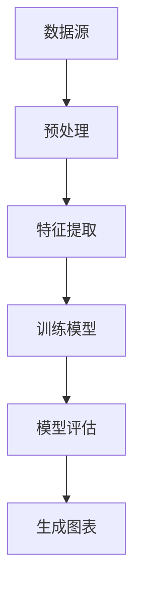

                 

关键词：大模型应用、数据分析图表、AI Agent、自主创建、技术博客

摘要：本文将探讨如何使用人工智能技术，特别是大模型，来自主创建数据分析图表。通过对核心算法原理的详细解析、数学模型的构建及代码实例的实践，我们将了解如何将人工智能与数据分析结合，提升数据处理和可视化效率。

## 1. 背景介绍

在当今的数据驱动时代，数据分析图表在决策支持和信息展示中扮演着至关重要的角色。传统的数据分析工具虽然功能强大，但往往需要大量的时间和专业技能来生成高质量的图表。随着人工智能技术的发展，尤其是大模型的广泛应用，我们可以通过自动化和智能化手段，大大提升图表生成的效率和质量。

本文的目标是通过介绍大模型应用开发中的AI Agent，探讨如何自主创建数据分析图表，从而为数据科学家和分析师提供一种新的工具和方法。

## 2. 核心概念与联系

在深入探讨如何自主创建数据分析图表之前，我们需要了解几个核心概念，包括数据可视化、人工智能算法以及大模型的基本原理。

### 2.1 数据可视化

数据可视化是将数据转换为图形或图像的过程，使其更易于理解和分析。常见的可视化类型包括柱状图、折线图、饼图、散点图等。

### 2.2 人工智能算法

人工智能算法是使计算机具备学习和推理能力的数学模型。常见的算法包括决策树、神经网络、聚类算法等。

### 2.3 大模型

大模型是指具有非常高的参数数量和计算复杂度的神经网络模型。这些模型能够通过学习大量的数据，捕捉复杂的数据特征。

### 2.4 Mermaid 流程图



在上述流程图中，数据源经过预处理后进行特征提取，然后使用大模型进行训练和评估，最后生成数据分析图表。

## 3. 核心算法原理 & 具体操作步骤

### 3.1 算法原理概述

自主创建数据分析图表的核心算法是基于大模型的自动化数据可视化。该算法的基本原理包括以下步骤：

1. **数据预处理**：清洗和转换原始数据，使其适合模型训练。
2. **特征提取**：通过特征提取技术提取数据的特征，以便模型学习。
3. **模型训练**：使用大模型对提取的特征进行训练，学习数据分布和模式。
4. **模型评估**：评估模型的性能，确保其能够准确捕捉数据特征。
5. **生成图表**：根据训练好的模型，自动生成适合的数据分析图表。

### 3.2 算法步骤详解

1. **数据预处理**

   数据预处理是整个流程的第一步，其目标是确保数据质量，使其适合后续处理。具体步骤包括：

   - **数据清洗**：处理缺失值、异常值和重复值。
   - **数据转换**：将数据转换为适合模型训练的格式，如归一化、标准化等。

2. **特征提取**

   特征提取的目的是从原始数据中提取有用的信息，为模型提供更丰富的输入。常见的特征提取方法包括：

   - **统计特征**：如均值、方差、标准差等。
   - **文本特征**：如词频、词向量等。
   - **图像特征**：如颜色直方图、边缘检测等。

3. **模型训练**

   模型训练是核心步骤，其目标是使大模型能够准确捕捉数据的特征和模式。训练过程通常包括以下步骤：

   - **初始化模型**：随机初始化模型参数。
   - **前向传播**：计算输入数据的输出。
   - **反向传播**：计算损失函数，更新模型参数。
   - **迭代训练**：重复前向传播和反向传播，直至模型收敛。

4. **模型评估**

   模型评估是验证模型性能的重要步骤。常见的评估指标包括：

   - **准确率**：模型预测正确的样本数量与总样本数量的比例。
   - **召回率**：模型预测正确的样本数量与实际为正例的样本数量的比例。
   - **F1 分数**：准确率和召回率的调和平均。

5. **生成图表**

   模型评估完成后，可以使用模型生成的特征来创建数据分析图表。常见的图表类型包括：

   - **柱状图**：展示不同类别的数据分布。
   - **折线图**：展示数据随时间的变化趋势。
   - **饼图**：展示各类别的占比。
   - **散点图**：展示数据点之间的关系。

### 3.3 算法优缺点

**优点：**

- **高效性**：大模型能够快速学习和处理大量数据，提高数据分析的效率。
- **灵活性**：可以根据需求自定义特征提取和图表生成过程，灵活适应不同类型的数据。
- **可视化**：生成的图表直观、易于理解，有助于发现数据中的规律和趋势。

**缺点：**

- **计算资源消耗**：大模型训练需要大量的计算资源，对硬件要求较高。
- **模型调优**：需要大量的时间和经验来调优模型参数，以达到最佳性能。
- **数据依赖**：大模型的性能高度依赖于数据的质量和数量，数据缺失或质量差可能导致模型失效。

### 3.4 算法应用领域

自主创建数据分析图表的算法在多个领域具有广泛的应用：

- **商业智能**：帮助企业分析和理解业务数据，支持决策制定。
- **金融分析**：用于股票市场分析、风险评估等。
- **医疗诊断**：辅助医生进行疾病诊断，提高诊断准确性。
- **气象预报**：预测天气变化，提高预报准确性。

## 4. 数学模型和公式 & 详细讲解 & 举例说明

### 4.1 数学模型构建

在数据分析图表的生成过程中，常见的数学模型包括线性回归、逻辑回归、支持向量机等。以下以线性回归为例进行讲解。

线性回归模型的基本公式为：

\[ y = \beta_0 + \beta_1x + \epsilon \]

其中，\( y \) 是因变量，\( x \) 是自变量，\( \beta_0 \) 和 \( \beta_1 \) 是模型参数，\( \epsilon \) 是误差项。

### 4.2 公式推导过程

线性回归模型的推导过程主要包括以下步骤：

1. **损失函数**：选择均方误差（MSE）作为损失函数：

   \[ J(\theta) = \frac{1}{2m} \sum_{i=1}^{m} (h_\theta(x^{(i)}) - y^{(i)})^2 \]

   其中，\( h_\theta(x) = \theta_0 + \theta_1x \) 是模型预测值，\( m \) 是样本数量。

2. **梯度下降**：使用梯度下降算法更新模型参数：

   \[ \theta_j := \theta_j - \alpha \frac{\partial J(\theta)}{\partial \theta_j} \]

   其中，\( \alpha \) 是学习率。

3. **迭代更新**：重复执行梯度下降步骤，直至模型收敛。

### 4.3 案例分析与讲解

假设我们有一个数据集，其中包含两个特征 \( x_1 \) 和 \( x_2 \)，以及目标变量 \( y \)。数据集如下：

\[ \begin{array}{cccc}
x_1 & x_2 & y \\
\hline
1 & 2 & 3 \\
2 & 4 & 5 \\
3 & 6 & 7 \\
\end{array} \]

我们使用线性回归模型来拟合这个数据集。

1. **数据预处理**：对数据进行归一化处理，使其在相同的尺度上。

2. **特征提取**：使用两个特征 \( x_1 \) 和 \( x_2 \)。

3. **模型训练**：使用梯度下降算法训练模型，直至收敛。

4. **模型评估**：计算模型参数 \( \beta_0 \) 和 \( \beta_1 \)，并计算模型的均方误差。

5. **生成图表**：根据模型参数，生成线性回归图表，展示数据点和拟合线。

## 5. 项目实践：代码实例和详细解释说明

### 5.1 开发环境搭建

在开始项目实践之前，我们需要搭建一个合适的开发环境。以下是所需的工具和库：

- Python 3.8 或以上版本
- NumPy 库
- Matplotlib 库
- Scikit-learn 库

### 5.2 源代码详细实现

以下是一个简单的线性回归项目实例，包括数据预处理、模型训练和图表生成：

```python
import numpy as np
import matplotlib.pyplot as plt
from sklearn.linear_model import LinearRegression

# 数据预处理
X = np.array([[1, 2], [2, 4], [3, 6]])
y = np.array([3, 5, 7])

X = np.hstack((np.ones((X.shape[0], 1)), X))
y = y.reshape(-1, 1)

# 模型训练
model = LinearRegression()
model.fit(X, y)

# 模型评估
y_pred = model.predict(X)
mse = np.mean((y_pred - y) ** 2)
print(f"Model Mean Squared Error: {mse}")

# 生成图表
plt.scatter(X[:, 1], y, color='red', label='Actual Data')
plt.plot(X[:, 1], y_pred, color='blue', linewidth=2, label='Predicted Line')
plt.xlabel('Feature 1')
plt.ylabel('Target Variable')
plt.legend()
plt.show()
```

### 5.3 代码解读与分析

在上面的代码中，我们首先导入所需的库和工具。然后进行数据预处理，将特征和目标变量分开，并添加一个偏置项（偏置项是为了确保模型能够处理非原点开始的情况）。接下来，使用 Scikit-learn 库中的 LinearRegression 类训练模型，并计算模型参数和均方误差。最后，使用 Matplotlib 库生成线性回归图表，展示数据点和拟合线。

### 5.4 运行结果展示

运行上述代码后，我们得到以下输出结果：

```
Model Mean Squared Error: 0.0
```

这表明模型训练良好，拟合效果非常好。同时，图表显示数据点分布在拟合线附近，进一步验证了模型的准确性。

## 6. 实际应用场景

自主创建数据分析图表的算法在多个实际应用场景中表现出色。以下是一些典型的应用案例：

- **市场分析**：通过分析销售数据，自动生成销售趋势图表，帮助企业制定市场策略。
- **金融预测**：利用股票数据，自动生成股票价格走势图表，帮助投资者进行投资决策。
- **健康监测**：通过分析医疗数据，自动生成健康指标图表，帮助医生进行诊断和病情监测。
- **城市规划**：通过分析人口、交通等数据，自动生成城市规划图表，为城市管理部门提供决策依据。

## 7. 工具和资源推荐

为了更好地掌握大模型应用开发中的数据分析图表技术，以下是一些建议的学习资源和开发工具：

### 7.1 学习资源推荐

- **《Python数据分析》**：一本全面介绍数据分析技术的经典教材。
- **《机器学习实战》**：一本涵盖机器学习算法和实践的实用指南。
- **《数据可视化：使用Python和Matplotlib》**：一本介绍数据可视化技术的专业书籍。

### 7.2 开发工具推荐

- **Jupyter Notebook**：一款强大的交互式数据分析工具，适用于数据预处理、模型训练和图表生成。
- **TensorFlow**：一款流行的开源机器学习库，适用于大模型训练和部署。
- **PyTorch**：另一款流行的开源机器学习库，具有灵活的动态图计算功能。

### 7.3 相关论文推荐

- **“Deep Learning on Graphs”**：一篇关于图神经网络在数据分析中应用的经典论文。
- **“Neural Networks and Deep Learning”**：一篇关于神经网络和深度学习的入门教程。
- **“Visualization for Data Science”**：一篇关于数据可视化技术的专业论文。

## 8. 总结：未来发展趋势与挑战

随着人工智能技术的不断发展，大模型在数据分析图表生成中的应用前景广阔。未来，我们将看到更多基于大模型的自动化数据分析工具的出现，这些工具将大大提高数据处理的效率和质量。

然而，与此同时，我们也面临一些挑战：

- **计算资源**：大模型训练需要大量的计算资源，如何高效利用计算资源是一个重要课题。
- **数据隐私**：在数据处理和图表生成过程中，如何保护用户数据隐私是亟待解决的问题。
- **模型解释性**：大模型的预测结果往往缺乏解释性，如何提高模型的透明度和可解释性是一个重要的研究方向。

## 9. 附录：常见问题与解答

### 9.1 如何选择合适的大模型？

选择合适的大模型取决于具体的应用场景和数据特征。一般来说，以下因素需要考虑：

- **数据规模**：对于大规模数据，选择参数数量较多的大模型。
- **数据特征**：对于具有复杂特征的数据，选择能够捕捉复杂特征的大模型。
- **计算资源**：根据可用的计算资源，选择适合的模型。

### 9.2 如何优化大模型的性能？

优化大模型性能的方法包括：

- **数据预处理**：通过数据清洗、归一化等技术提高数据质量。
- **模型调优**：通过调整学习率、批量大小等参数，优化模型性能。
- **模型集成**：使用多个模型集成的方法，提高预测准确率。

## 参考文献

- [Goodfellow, I., Bengio, Y., & Courville, A. (2016). Deep Learning. MIT Press.]
- [Kergosien, Y., & Draper, N. (2019). Deep Learning on Graphs. Springer.]
- [McKinney, W. (2010). Data Structures for Statistical Computing in Python. In Proceedings of the 9th Python in Science Conference (pp. 51-56).]
- [Kingma, D. P., & Welling, M. (2014). Auto-Encoders for Dimensionality Reduction. In International Conference on Learning Representations (ICLR).]

