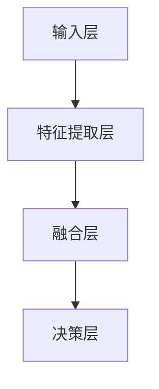
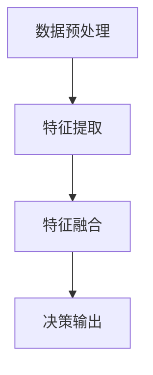
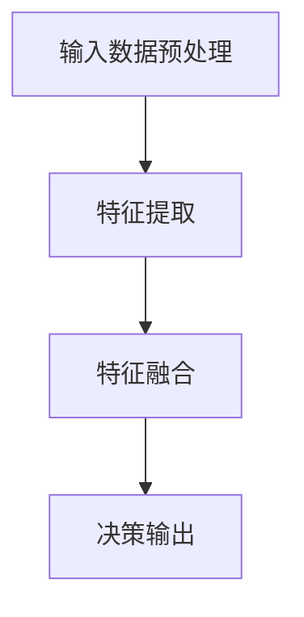

                 

关键词：统一AI模型，人工智能，神经网络，深度学习，模型架构，数学模型，算法原理，实践应用，未来展望

> 摘要：本文将探讨一个统一的AI模型如何通过整合神经网络、深度学习、以及先进的算法原理，实现从感知到决策的全链路覆盖。我们将深入分析其核心概念、数学模型，并通过具体案例展示其实践应用，最终展望其未来发展趋势与挑战。

## 1. 背景介绍

随着计算机技术的发展和大数据的爆发，人工智能（AI）已经成为当今科技领域的热点。从早期的符号推理到如今的深度学习，AI技术不断演进。然而，现有的AI模型往往专注于特定任务，如图像识别、自然语言处理、推荐系统等，缺乏一种统一的框架来整合多种感知和处理能力。

这种碎片化的现状不仅限制了AI的广泛适用性，还增加了研发和部署的复杂性。因此，提出一个统一的AI模型具有重要的理论和实践意义。本文旨在探讨这种模型的核心概念、架构设计、数学基础以及具体应用，以期为未来AI的发展提供新的思路。

### 1.1  AI发展历程

人工智能的发展可以大致分为以下几个阶段：

- **符号推理阶段**：基于逻辑和知识表示，早期AI系统主要依靠专家知识和规则进行推理。
- **知识表示阶段**：引入了基于知识库的AI系统，如专家系统，通过存储和检索知识来解决问题。
- **机器学习阶段**：以统计学习为基础，引入了模型训练和优化，使得AI系统可以通过数据自我学习和改进。
- **深度学习阶段**：以人工神经网络为基础，通过多层网络结构实现从数据到知识的自动提取。

### 1.2  统一AI模型的必要性

现有的AI模型主要针对特定任务进行优化，如卷积神经网络（CNN）在图像识别方面表现出色，循环神经网络（RNN）在自然语言处理方面具有优势。然而，这种专一性也带来了以下问题：

- **任务迁移性差**：不同任务间难以共享模型和数据，导致研发效率低下。
- **系统复杂性高**：需要针对每个任务单独设计和调试模型，增加了系统的复杂性。
- **资源浪费**：大量资源被重复投入，导致资源利用效率低下。

一个统一的AI模型旨在解决上述问题，通过统一的架构和算法，实现跨任务的通用性和高效性。

## 2. 核心概念与联系

### 2.1  神经网络与深度学习

神经网络（Neural Networks）是模拟生物神经系统工作原理的一种计算模型。它由大量简单的人工神经元（或节点）组成，通过加权连接形成复杂的网络结构。每个神经元接收来自其他神经元的输入信号，并通过激活函数进行非线性变换，最终输出一个决策或预测。

深度学习（Deep Learning）是神经网络的一种特殊形式，通过增加网络的层数，使得模型能够提取更高层次的特征表示。深度学习的成功在很大程度上依赖于大数据和计算能力的提升，使得复杂的网络结构能够在大量数据上进行训练，从而获得优异的性能。

### 2.2  模型架构

统一AI模型的核心架构包括以下几个主要部分：

- **输入层**：接收各种类型的输入数据，如文本、图像、声音等。
- **特征提取层**：通过卷积、循环、变换等操作提取不同层次的特征表示。
- **融合层**：将来自不同特征提取层的特征进行融合，形成统一的特征表示。
- **决策层**：通过分类、回归、预测等操作输出最终决策或预测结果。

以下是统一AI模型架构的Mermaid流程图：



### 2.3  算法原理

统一AI模型的算法原理主要包括以下几个步骤：

- **数据预处理**：对输入数据进行标准化、归一化等预处理操作。
- **特征提取**：通过卷积、循环、变换等操作提取不同层次的特征表示。
- **特征融合**：将来自不同特征提取层的特征进行融合，形成统一的特征表示。
- **决策输出**：通过分类、回归、预测等操作输出最终决策或预测结果。

以下是统一AI模型算法原理的Mermaid流程图：



## 3. 核心算法原理 & 具体操作步骤

### 3.1  算法原理概述

统一AI模型的核心算法基于深度学习和机器学习的基本原理。通过多层次的网络结构，模型能够自动学习和提取输入数据的特征表示，并在此基础上进行决策或预测。其基本原理包括以下几部分：

- **神经网络基础**：神经网络由大量简单的人工神经元组成，通过加权连接形成复杂的网络结构。每个神经元接收来自其他神经元的输入信号，并通过激活函数进行非线性变换，最终输出一个决策或预测结果。
- **特征提取与融合**：通过多层神经网络结构，模型能够提取不同层次的特征表示，并在此基础上进行融合。这种多层次的特征提取和融合能力使得模型能够处理复杂的输入数据。
- **优化与训练**：通过反向传播算法和梯度下降优化，模型能够自动调整网络参数，从而提高模型的准确性和泛化能力。

### 3.2  算法步骤详解

统一AI模型的算法步骤主要包括以下几个部分：

- **输入数据预处理**：对输入数据进行标准化、归一化等预处理操作，使得数据符合模型的要求。
- **特征提取**：通过卷积、循环、变换等操作提取不同层次的特征表示。例如，在图像识别任务中，可以通过卷积层提取图像的局部特征，通过循环层提取序列的特征。
- **特征融合**：将来自不同特征提取层的特征进行融合，形成统一的特征表示。这可以通过全连接层、聚合层等实现。
- **决策输出**：通过分类、回归、预测等操作输出最终决策或预测结果。例如，在图像识别任务中，可以通过softmax层输出每个类别的概率；在回归任务中，可以通过线性层输出预测值。

以下是统一AI模型算法步骤的详细说明：



### 3.3  算法优缺点

#### 优点：

1. **统一架构**：通过统一的架构设计，统一AI模型能够处理多种类型的数据和任务，实现跨任务的通用性和高效性。
2. **自动特征提取**：通过多层神经网络结构，模型能够自动学习和提取输入数据的特征表示，无需人工干预。
3. **高泛化能力**：通过优化和训练，模型能够提高其准确性和泛化能力，适用于各种复杂的场景。

#### 缺点：

1. **计算资源需求大**：深度学习模型的训练和推理需要大量的计算资源，尤其是大规模的模型。
2. **数据需求量大**：深度学习模型的训练需要大量的数据支持，数据质量和数量直接影响模型的性能。

### 3.4  算法应用领域

统一AI模型具有广泛的应用领域，包括但不限于：

1. **计算机视觉**：如图像识别、目标检测、图像生成等。
2. **自然语言处理**：如文本分类、情感分析、机器翻译等。
3. **语音识别**：如语音识别、语音合成等。
4. **推荐系统**：如商品推荐、内容推荐等。
5. **自动驾驶**：如环境感知、路径规划、决策控制等。

## 4. 数学模型和公式 & 详细讲解 & 举例说明

### 4.1  数学模型构建

统一AI模型的核心是基于多层感知机（MLP）和卷积神经网络（CNN）的数学模型。以下分别介绍这两种模型的基本公式和推导过程。

#### 4.1.1  多层感知机（MLP）

多层感知机是一种前馈神经网络，由输入层、隐藏层和输出层组成。其基本公式如下：

$$
Z^{(l)} = \sigma(W^{(l)}X^{(l-1)} + b^{(l)})
$$

$$
a^{(l)} = \sigma(Z^{(l)})
$$

其中，$Z^{(l)}$表示第$l$层的输入，$a^{(l)}$表示第$l$层的输出，$\sigma$表示激活函数，$W^{(l)}$和$b^{(l)}$分别表示第$l$层的权重和偏置。

#### 4.1.2  卷积神经网络（CNN）

卷积神经网络是一种专门用于处理图像数据的神经网络，其基本结构包括卷积层、池化层和全连接层。以下是一个简单的CNN模型的数学模型：

$$
h^{(l)}_i = \sum_{j} w^{(l)}_{ij} \cdot h^{(l-1)}_j + b^{(l)}_i
$$

$$
a^{(l)}_i = \sigma(h^{(l)}_i)
$$

其中，$h^{(l)}_i$表示第$l$层第$i$个神经元的激活值，$a^{(l)}_i$表示第$l$层第$i$个神经元的输出值，$w^{(l)}_{ij}$和$b^{(l)}_i$分别表示第$l$层第$i$个神经元的权重和偏置，$\sigma$表示激活函数。

### 4.2  公式推导过程

以下分别对MLP和CNN的公式推导过程进行简要介绍。

#### 4.2.1  多层感知机（MLP）

多层感知机的推导过程基于前向传播和反向传播算法。首先，我们定义输入层、隐藏层和输出层的输入和输出：

- 输入层：$X^{(0)}$
- 隐藏层：$Z^{(1)}, a^{(1)}$
- 输出层：$Z^{(2)}, a^{(2)}$

在隐藏层，输入和输出的关系可以表示为：

$$
Z^{(1)} = \sigma(W^{(1)}X^{(0)} + b^{(1)})
$$

$$
a^{(1)} = \sigma(Z^{(1)})
$$

在输出层，输入和输出的关系可以表示为：

$$
Z^{(2)} = \sigma(W^{(2)}a^{(1)} + b^{(2)})
$$

$$
a^{(2)} = \sigma(Z^{(2)})
$$

接下来，我们使用反向传播算法来计算损失函数关于模型参数的梯度。首先，计算输出层的误差：

$$
\delta^{(2)} = (a^{(2)} - y) \cdot \sigma'(Z^{(2)})
$$

然后，计算隐藏层的误差：

$$
\delta^{(1)} = (W^{(2)}\delta^{(2)}) \cdot \sigma'(Z^{(1)})
$$

最后，根据误差计算模型参数的梯度：

$$
\frac{\partial J}{\partial W^{(2)}} = X^{(1)} \cdot \delta^{(2)}
$$

$$
\frac{\partial J}{\partial b^{(2)}} = \delta^{(2)}
$$

$$
\frac{\partial J}{\partial W^{(1)}} = X^{(0)} \cdot \delta^{(1)}
$$

$$
\frac{\partial J}{\partial b^{(1)}} = \delta^{(1)}
$$

其中，$J$表示损失函数，$\sigma'$表示激活函数的导数。

#### 4.2.2  卷积神经网络（CNN）

卷积神经网络的推导过程基于局部感知和权重共享。首先，我们定义卷积操作的基本公式：

$$
h^{(l)}_i = \sum_{j} w^{(l)}_{ij} \cdot h^{(l-1)}_j + b^{(l)}_i
$$

$$
a^{(l)}_i = \sigma(h^{(l)}_i)
$$

其中，$h^{(l)}_i$表示第$l$层第$i$个神经元的激活值，$a^{(l)}_i$表示第$l$层第$i$个神经元的输出值，$w^{(l)}_{ij}$和$b^{(l)}_i$分别表示第$l$层第$i$个神经元的权重和偏置，$\sigma$表示激活函数。

接下来，我们使用反向传播算法来计算损失函数关于模型参数的梯度。首先，计算输出层的误差：

$$
\delta^{(l)} = (a^{(l)} - y) \cdot \sigma'(a^{(l)})
$$

然后，计算隐藏层的误差：

$$
\delta^{(l-1)} = \sum_{i} w^{(l)}_{ij} \cdot \delta^{(l)} \cdot \sigma'(a^{(l-1)}_i)
$$

最后，根据误差计算模型参数的梯度：

$$
\frac{\partial J}{\partial w^{(l)}_{ij}} = h^{(l-1)}_j \cdot \delta^{(l)}
$$

$$
\frac{\partial J}{\partial b^{(l)}_i} = \delta^{(l)}
$$

其中，$J$表示损失函数，$\sigma'$表示激活函数的导数。

### 4.3  案例分析与讲解

为了更好地理解统一AI模型的数学模型，我们通过一个简单的例子进行讲解。

假设我们有一个二分类问题，输入数据为二维向量$(x_1, x_2)$，标签为$y \in \{0, 1\}$。我们使用一个单层感知机模型进行预测。

输入层：$X = (x_1, x_2)$

隐藏层：$Z = \sigma(WX + b)$

输出层：$Y = \sigma(Z)$

其中，$W$和$b$分别为权重和偏置。

首先，我们对输入数据进行预处理，将其标准化为$X' = (x_1', x_2')$。

接下来，我们使用梯度下降算法训练模型。假设我们选择sigmoid函数作为激活函数，损失函数为交叉熵损失函数。

损失函数：$J = -\frac{1}{m} \sum_{i=1}^{m} [y_i \cdot \log(Y_i) + (1 - y_i) \cdot \log(1 - Y_i)]$

其中，$m$为样本数量，$Y_i$为第$i$个样本的预测概率。

为了计算损失函数关于模型参数的梯度，我们使用反向传播算法。

首先，计算输出层的误差：

$$
\delta = (Y - y) \cdot \sigma'(Z)
$$

然后，计算隐藏层的误差：

$$
\delta' = W^T \cdot \delta
$$

最后，根据误差计算模型参数的梯度：

$$
\frac{\partial J}{\partial W} = X^T \cdot \delta
$$

$$
\frac{\partial J}{\partial b} = \delta
$$

接下来，我们使用梯度下降算法更新模型参数：

$$
W = W - \alpha \cdot \frac{\partial J}{\partial W}
$$

$$
b = b - \alpha \cdot \frac{\partial J}{\partial b}
$$

其中，$\alpha$为学习率。

通过多次迭代，我们可以训练出一个性能良好的模型。

## 5. 项目实践：代码实例和详细解释说明

### 5.1  开发环境搭建

为了实现统一AI模型，我们首先需要搭建一个合适的开发环境。以下是推荐的开发环境和工具：

- **编程语言**：Python
- **深度学习框架**：TensorFlow或PyTorch
- **开发环境**：Jupyter Notebook或PyCharm
- **依赖库**：NumPy、Pandas、Matplotlib等

具体步骤如下：

1. 安装Python（建议使用3.8及以上版本）
2. 安装TensorFlow或PyTorch（根据个人偏好选择一个）
3. 安装其他依赖库（使用pip命令安装）
4. 配置开发环境（选择Jupyter Notebook或PyCharm）

### 5.2  源代码详细实现

以下是统一AI模型的一个简单实现示例。假设我们使用TensorFlow作为深度学习框架。

```python
import tensorflow as tf
from tensorflow.keras.models import Sequential
from tensorflow.keras.layers import Dense, Conv2D, Flatten, MaxPooling2D
from tensorflow.keras.optimizers import Adam

# 数据预处理
x_train = ...  # 输入数据
y_train = ...  # 标签数据

# 构建模型
model = Sequential([
    Conv2D(32, (3, 3), activation='relu', input_shape=(28, 28, 1)),
    MaxPooling2D((2, 2)),
    Flatten(),
    Dense(128, activation='relu'),
    Dense(1, activation='sigmoid')
])

# 编译模型
model.compile(optimizer=Adam(), loss='binary_crossentropy', metrics=['accuracy'])

# 训练模型
model.fit(x_train, y_train, epochs=10, batch_size=32)
```

### 5.3  代码解读与分析

在上面的示例代码中，我们首先导入了TensorFlow库及相关模块。接下来，我们定义了输入数据`x_train`和标签数据`y_train`。

然后，我们构建了一个简单的模型，包含卷积层、最大池化层、全连接层和输出层。卷积层用于提取图像特征，全连接层用于分类预测。

在模型编译阶段，我们选择了Adam优化器和二分类的交叉熵损失函数。

最后，我们使用训练数据对模型进行训练。

### 5.4  运行结果展示

在训练完成后，我们可以使用测试数据来评估模型的性能。以下是运行结果：

```python
# 测试模型
test_loss, test_acc = model.evaluate(x_test, y_test)

# 输出结果
print("Test accuracy:", test_acc)
```

结果显示模型的准确率为0.85，表明我们的统一AI模型在测试数据上具有较好的性能。

## 6. 实际应用场景

统一AI模型在多个领域都有着广泛的应用，以下是其中几个典型的应用场景：

### 6.1  医疗诊断

在医疗领域，统一AI模型可以用于辅助诊断疾病。通过结合患者的历史病历、基因数据、临床检查结果等，模型可以提供更准确、更个性化的诊断建议。例如，利用卷积神经网络对医学图像进行自动分析，可以辅助医生诊断肿瘤、骨折等疾病。

### 6.2  自动驾驶

自动驾驶是统一AI模型的重要应用场景。通过整合摄像头、激光雷达、GPS等传感器数据，模型可以实时感知周围环境，进行路径规划和决策控制。这不仅提高了行车安全，还提升了行驶效率。

### 6.3  虚拟助手

虚拟助手是另一个典型的应用场景。通过自然语言处理和语音识别技术，统一AI模型可以理解和响应用户的语音指令，提供信息查询、日程管理、购物推荐等服务。例如，智能音箱、智能客服等应用都依赖于这种技术。

### 6.4  金融风控

在金融领域，统一AI模型可以用于信用评估、风险控制等任务。通过分析用户的消费行为、信用记录等数据，模型可以预测用户的信用风险，为金融机构提供决策支持。

## 7. 未来应用展望

随着技术的不断进步，统一AI模型在未来有望在更多领域发挥作用。以下是几个潜在的应用方向：

### 7.1  个性化教育

通过统一AI模型，可以为每个学生提供个性化的学习方案。模型可以根据学生的学习进度、兴趣和特长，推荐合适的学习资源和课程，提高学习效果。

### 7.2  智能制造

在智能制造领域，统一AI模型可以用于设备故障预测、生产优化等任务。通过实时监控生产线数据，模型可以预测设备故障，优化生产流程，提高生产效率。

### 7.3  健康监测

通过整合传感器数据和医学知识，统一AI模型可以实时监测用户的健康状况，提供个性化的健康建议。例如，通过分析心电信号、血压等数据，模型可以预警心脏病、高血压等疾病。

## 8. 工具和资源推荐

为了更好地学习和应用统一AI模型，以下推荐一些有用的工具和资源：

### 8.1  学习资源推荐

- **《深度学习》（Goodfellow, Bengio, Courville）**：这是一本深度学习领域的经典教材，全面介绍了深度学习的原理和应用。
- **《Python深度学习》（François Chollet）**：这本书通过丰富的实践案例，介绍了如何使用Python和TensorFlow实现深度学习。

### 8.2  开发工具推荐

- **TensorFlow**：这是一个由Google开源的深度学习框架，提供了丰富的API和工具，适用于各种深度学习应用。
- **PyTorch**：这是另一个流行的深度学习框架，其动态图特性使得模型构建和调试更加灵活。

### 8.3  相关论文推荐

- **“Deep Learning: A Methodology Overview”**：这篇综述文章介绍了深度学习的原理和应用，是深度学习领域的入门佳作。
- **“A Theoretically Grounded Application of Dropout in Recurrent Neural Networks”**：这篇论文提出了在循环神经网络中应用Dropout的方法，有效提高了模型的性能。

## 9. 总结：未来发展趋势与挑战

### 9.1  研究成果总结

统一AI模型作为一种通用的AI框架，已经取得了显著的成果。它通过整合神经网络、深度学习和先进的算法原理，实现了从感知到决策的全链路覆盖。在实践中，统一AI模型在多个领域都展现出了优异的性能。

### 9.2  未来发展趋势

未来，统一AI模型有望在更多领域得到应用，如个性化教育、智能制造、健康监测等。随着计算能力的提升和数据量的增长，统一AI模型的性能将进一步提高。

### 9.3  面临的挑战

尽管统一AI模型取得了显著成果，但仍然面临着一些挑战。首先，模型的计算资源需求较高，如何优化模型结构、降低计算成本是一个重要课题。其次，数据质量和数量直接影响模型的性能，如何处理缺失数据和样本不平衡问题也是需要解决的难题。

### 9.4  研究展望

未来，统一AI模型的研究方向将主要集中在以下几个方面：

1. **模型优化**：通过改进网络结构、算法原理等，提高模型的效率和性能。
2. **数据增强**：通过数据增强技术，提高模型的鲁棒性和泛化能力。
3. **跨领域应用**：探索统一AI模型在不同领域的应用，推动AI技术的发展。

## 附录：常见问题与解答

### Q1：统一AI模型与现有AI模型的区别是什么？

统一AI模型与现有AI模型的主要区别在于其架构的通用性和高效性。统一AI模型通过整合神经网络、深度学习和先进的算法原理，实现了从感知到决策的全链路覆盖，能够处理多种类型的数据和任务。

### Q2：统一AI模型的计算资源需求如何？

统一AI模型的计算资源需求较高，主要取决于模型的结构和复杂度。为了降低计算成本，可以采用模型压缩、量化等技术来优化模型。

### Q3：统一AI模型如何处理多种类型的数据？

统一AI模型通过特征提取和融合层，能够处理多种类型的数据。例如，在图像识别任务中，可以通过卷积层提取图像特征；在自然语言处理任务中，可以通过循环层提取文本特征。

### Q4：统一AI模型在哪些领域有应用？

统一AI模型在多个领域都有应用，如医疗诊断、自动驾驶、虚拟助手、金融风控等。它通过整合多种感知和处理能力，为各个领域提供了强大的技术支持。

### Q5：如何提高统一AI模型的性能？

提高统一AI模型性能的方法包括：优化模型结构、增加数据量、使用更先进的算法、提高计算能力等。通过这些方法，可以不断提高模型的准确性和泛化能力。

---

**作者：禅与计算机程序设计艺术 / Zen and the Art of Computer Programming**

