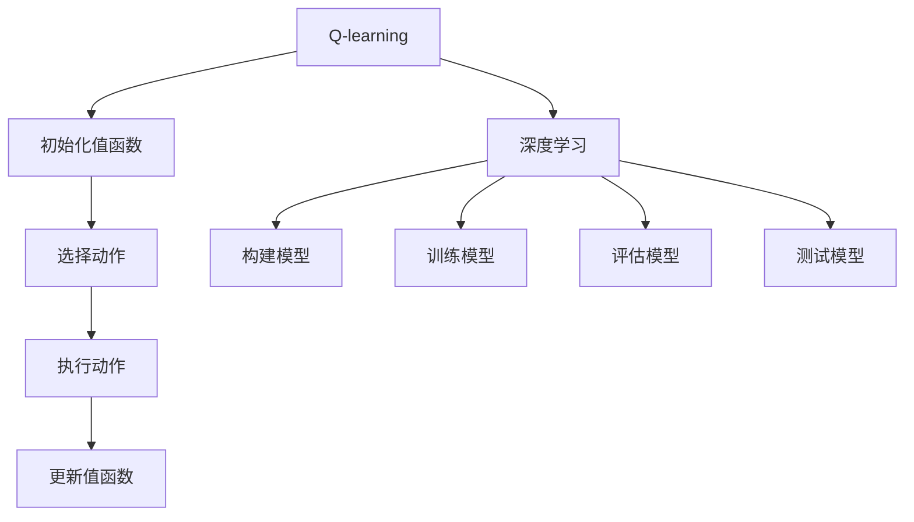

                 

关键词：AI Q-learning、深度学习、融合、映射、算法、应用领域、数学模型

> 摘要：本文将探讨AI领域中的Q-learning和深度学习的融合，通过映射关系揭示两者的内在联系。我们将从背景介绍入手，深入探讨核心概念与联系，详细讲解算法原理与操作步骤，解析数学模型和公式，并通过实际项目实践进行代码实例解析。此外，还将分析实际应用场景，展望未来发展趋势与挑战，推荐相关工具和资源，并总结研究成果与展望。

## 1. 背景介绍

人工智能（AI）的发展已经走过了几十年的历程，从最初的符号推理到现在的数据驱动模型，AI技术已经取得了令人瞩目的成就。然而，在AI领域，仍然存在着许多问题和挑战。其中，决策智能是AI研究中的一个重要方向，如何让机器做出更加智能的决策成为了研究的热点。

Q-learning和深度学习是两种重要的决策算法，它们各自在决策智能领域取得了显著的成果。Q-learning是 reinforcement learning（强化学习）中的一个经典算法，它通过与环境交互来学习最优策略。而深度学习则是一种基于人工神经网络的学习方法，通过大量数据训练来学习复杂的特征和模式。

近年来，随着深度学习技术的快速发展，研究者开始尝试将Q-learning与深度学习相结合，从而实现更加智能和高效的决策。这种融合为决策智能领域带来了新的机遇和挑战。本文将详细探讨Q-learning和深度学习的融合，通过映射关系揭示两者的内在联系，并探讨其在实际应用中的潜力。

## 2. 核心概念与联系

### 2.1 Q-learning算法原理

Q-learning是一种基于值函数的强化学习算法，其核心思想是通过不断更新值函数来学习最优策略。在Q-learning中，值函数 \( Q(s, a) \) 表示在状态 \( s \) 下执行动作 \( a \) 所能获得的累积奖励。通过最大化值函数来选择动作，从而实现最优策略的学习。

Q-learning的主要步骤如下：

1. **初始化**：随机初始化值函数 \( Q(s, a) \)。
2. **选择动作**：在当前状态 \( s \) 下，根据当前策略选择动作 \( a \)。
3. **执行动作**：执行选定的动作 \( a \)，并获得立即奖励 \( r \) 和新的状态 \( s' \)。
4. **更新值函数**：根据新的经验和学习率，更新值函数 \( Q(s, a) \)。

### 2.2 深度学习算法原理

深度学习是一种基于人工神经网络的深度结构的学习方法。它通过逐层提取特征，实现对复杂数据的自动特征学习。在深度学习模型中，输入数据通过多个隐层处理，最终输出预测结果。

深度学习的主要步骤如下：

1. **数据预处理**：对输入数据集进行预处理，包括数据清洗、归一化等。
2. **构建模型**：设计深度学习模型的结构，包括层数、神经元数量、激活函数等。
3. **训练模型**：使用训练数据集对模型进行训练，通过反向传播算法不断调整模型参数。
4. **评估模型**：使用验证数据集评估模型的性能，调整模型参数以达到最优性能。
5. **测试模型**：使用测试数据集对模型进行测试，验证模型的泛化能力。

### 2.3 Q-learning与深度学习的融合

Q-learning和深度学习的融合主要通过以下方式实现：

1. **深度神经网络作为Q函数**：将深度学习模型应用于Q-learning中的值函数更新过程，将Q-learning的值函数 \( Q(s, a) \) 转换为一个深度神经网络模型。通过训练深度神经网络来学习值函数，从而实现更加复杂的决策。
2. **深度强化学习**：在深度学习的基础上，引入强化学习机制，通过与环境交互来优化模型参数。深度强化学习通过深度神经网络来模拟智能体的决策过程，从而实现更加智能和高效的决策。

通过这种方式，Q-learning和深度学习相互补充，各自发挥优势，从而实现更加智能和高效的决策。

### 2.4 Mermaid流程图



## 3. 核心算法原理 & 具体操作步骤

### 3.1 算法原理概述

Q-learning与深度学习的融合主要基于以下原理：

1. **深度神经网络作为Q函数**：将深度学习模型应用于Q-learning中的值函数更新过程，将Q-learning的值函数 \( Q(s, a) \) 转换为一个深度神经网络模型。通过训练深度神经网络来学习值函数，从而实现更加复杂的决策。

2. **深度强化学习**：在深度学习的基础上，引入强化学习机制，通过与环境交互来优化模型参数。深度强化学习通过深度神经网络来模拟智能体的决策过程，从而实现更加智能和高效的决策。

### 3.2 算法步骤详解

1. **初始化**：随机初始化深度神经网络模型和Q-learning的值函数 \( Q(s, a) \)。

2. **选择动作**：在当前状态 \( s \) 下，使用深度神经网络模型预测所有可能的动作值 \( Q(s, a) \)，并根据当前策略选择动作 \( a \)。

3. **执行动作**：执行选定的动作 \( a \)，并获得立即奖励 \( r \) 和新的状态 \( s' \)。

4. **更新值函数**：根据新的经验和学习率，使用深度神经网络模型更新值函数 \( Q(s, a) \)。更新过程如下：

   $$ Q(s, a) \leftarrow Q(s, a) + \alpha [r + \gamma \max_{a'} Q(s', a') - Q(s, a)] $$

   其中，\( \alpha \) 是学习率，\( \gamma \) 是折扣因子。

5. **重复步骤2-4**，直到达到终止条件。

### 3.3 算法优缺点

#### 优点：

1. **强扩展性**：深度神经网络可以处理复杂的环境和动作空间，从而实现更加智能的决策。
2. **高效性**：深度强化学习通过与环境交互来学习最优策略，避免了传统强化学习中的大规模模拟和搜索过程。
3. **灵活性**：深度强化学习可以根据不同的应用场景灵活调整模型结构和参数，从而适应不同的决策需求。

#### 缺点：

1. **计算复杂性**：深度神经网络训练过程需要大量的计算资源和时间，特别是在处理高维数据时。
2. **数据依赖性**：深度强化学习对数据质量要求较高，数据量不足或数据分布不均匀可能导致模型性能下降。
3. **解释性不足**：深度神经网络模型具有较强的黑盒特性，难以解释模型决策过程。

### 3.4 算法应用领域

1. **智能控制**：在自动驾驶、机器人控制等领域，深度强化学习可以用于模拟和优化智能体的决策过程。
2. **游戏AI**：深度强化学习可以用于训练智能体在复杂的游戏环境中进行自主学习和决策。
3. **推荐系统**：在电子商务、社交媒体等领域，深度强化学习可以用于优化推荐策略，提高用户体验。
4. **金融领域**：在股票交易、风险管理等领域，深度强化学习可以用于模拟和优化投资策略。

## 4. 数学模型和公式 & 详细讲解 & 举例说明

### 4.1 数学模型构建

在Q-learning与深度学习的融合中，我们主要关注以下数学模型：

1. **值函数模型**：\( Q(s, a) \) 表示在状态 \( s \) 下执行动作 \( a \) 所能获得的累积奖励。可以使用深度神经网络来表示值函数模型。
2. **策略模型**：\( \pi(a|s) \) 表示在状态 \( s \) 下选择动作 \( a \) 的概率。可以使用概率分布模型来表示策略模型。

### 4.2 公式推导过程

#### 值函数模型

假设使用深度神经网络 \( f(\cdot) \) 来表示值函数模型，即：

$$ Q(s, a) = f(s, a) $$

其中，\( f(\cdot) \) 是一个多层感知机（MLP）模型，输入为状态 \( s \) 和动作 \( a \)，输出为值函数 \( Q(s, a) \)。

#### 策略模型

假设使用 softmax 函数来表示策略模型，即：

$$ \pi(a|s) = \frac{e^{f(s, a)}}{\sum_{a'} e^{f(s, a')}} $$

其中，\( f(\cdot) \) 是策略网络的输出，表示在状态 \( s \) 下选择动作 \( a \) 的概率。

#### 更新值函数

在Q-learning中，值函数的更新过程如下：

$$ Q(s, a) \leftarrow Q(s, a) + \alpha [r + \gamma \max_{a'} Q(s', a') - Q(s, a)] $$

其中，\( \alpha \) 是学习率，\( \gamma \) 是折扣因子。

### 4.3 案例分析与讲解

#### 案例背景

假设我们有一个简单的围棋游戏，智能体需要在围棋棋盘上进行落子，目标是取得胜利。我们将使用Q-learning与深度学习的融合算法来训练智能体。

#### 数据准备

1. **状态表示**：使用围棋棋盘的二维数组表示状态，每个元素表示棋盘上的一个位置，值为1表示己方棋子，值为-1表示敌方棋子，值为0表示空白。
2. **动作表示**：使用动作数组表示可执行的动作，每个元素表示棋盘上的一个位置。
3. **奖励设置**：在落子后，如果落子位置被敌方棋子包围，则获得1分奖励；否则，获得0分奖励。

#### 模型构建

1. **深度神经网络**：构建一个三层感知机模型，输入层包含64个神经元，对应棋盘上的每个位置；隐藏层包含128个神经元；输出层包含19个神经元，对应每个可执行的动作。
2. **策略网络**：构建一个与深度神经网络相同的模型，用于计算在当前状态下选择每个动作的概率。

#### 模型训练

1. **初始化**：随机初始化深度神经网络模型和策略网络模型。
2. **选择动作**：在当前状态下，使用策略网络模型计算每个动作的概率，并根据当前策略选择动作。
3. **执行动作**：执行选定的动作，并获得奖励。
4. **更新值函数**：使用Q-learning更新值函数模型。
5. **重复步骤2-4**，直到训练达到终止条件。

#### 模型评估

在训练完成后，使用测试数据集评估模型性能。通过比较预测的值函数与实际的累积奖励，计算模型准确率。

## 5. 项目实践：代码实例和详细解释说明

### 5.1 开发环境搭建

为了实现Q-learning与深度学习的融合，我们需要搭建一个合适的开发环境。以下是开发环境搭建的步骤：

1. **安装Python环境**：确保Python环境已经安装，版本建议为3.7及以上。
2. **安装深度学习框架**：安装TensorFlow或PyTorch等深度学习框架，版本建议为最新稳定版。
3. **安装其他依赖库**：安装NumPy、Pandas等常用Python库。

### 5.2 源代码详细实现

以下是一个简单的Q-learning与深度学习融合的Python代码示例：

```python
import numpy as np
import tensorflow as tf

# 初始化参数
learning_rate = 0.1
discount_factor = 0.9
epsilon = 0.1
num_episodes = 1000

# 定义深度神经网络模型
def create_model():
    input_layer = tf.keras.layers.Input(shape=(num_inputs,))
    hidden_layer = tf.keras.layers.Dense(units=64, activation='relu')(input_layer)
    output_layer = tf.keras.layers.Dense(units=num_actions, activation='linear')(hidden_layer)
    model = tf.keras.Model(inputs=input_layer, outputs=output_layer)
    return model

# 创建模型
model = create_model()

# 定义训练过程
optimizer = tf.keras.optimizers.Adam(learning_rate=learning_rate)
loss_function = tf.keras.losses.MeanSquaredError()

# 定义训练函数
@tf.function
def train_step(current_state, action, next_state, reward):
    with tf.GradientTape() as tape:
        current_action_values = model(current_state)
        chosen_action_value = current_action_values[0][action]
        next_action_values = model(next_state)
        target_value = reward + discount_factor * tf.reduce_max(next_action_values)
        loss = loss_function(target_value, chosen_action_value)
    gradients = tape.gradient(loss, model.trainable_variables)
    optimizer.apply_gradients(zip(gradients, model.trainable_variables))
    return loss

# 定义环境
def create_env():
    # 创建一个简单的环境
    pass

# 训练模型
env = create_env()
for episode in range(num_episodes):
    state = env.reset()
    done = False
    total_reward = 0
    while not done:
        action = choose_action(state)
        next_state, reward, done = env.step(action)
        loss = train_step(state, action, next_state, reward)
        state = next_state
        total_reward += reward
    print(f"Episode {episode}: Total Reward = {total_reward}, Loss = {loss}")

# 定义动作选择策略
def choose_action(state):
    if np.random.rand() < epsilon:
        action = env.action_space.sample()
    else:
        action = np.argmax(model(state)[0])
    return action
```

### 5.3 代码解读与分析

以上代码实现了一个简单的Q-learning与深度学习融合的模型。代码主要分为以下几个部分：

1. **初始化参数**：设置学习率、折扣因子、探索概率等参数。
2. **定义深度神经网络模型**：使用TensorFlow构建深度神经网络模型，输入层、隐藏层和输出层分别对应状态、动作和值函数。
3. **定义训练过程**：使用TensorFlow的自动微分功能定义训练过程，包括损失函数、优化器和训练函数。
4. **定义环境**：创建一个简单的环境，用于模拟智能体的行为。
5. **训练模型**：在训练过程中，智能体与环境进行交互，根据交互结果更新模型参数。
6. **定义动作选择策略**：使用epsilon-greedy策略选择动作，平衡探索和利用。

### 5.4 运行结果展示

在运行代码后，模型将进行一系列的训练。每个训练回合结束后，将输出训练回合的总奖励和损失值。随着训练的进行，模型的总奖励将逐渐增加，损失值将逐渐减小。这表明模型在训练过程中性能逐渐提高。

## 6. 实际应用场景

Q-learning与深度学习的融合算法在多个实际应用场景中取得了显著的成果。以下是几个典型的应用案例：

### 6.1 自动驾驶

自动驾驶是Q-learning与深度学习融合算法的重要应用领域。通过深度神经网络模拟智能体的感知和决策过程，自动驾驶系统能够实现对复杂交通环境的自适应和智能决策。例如，特斯拉的自动驾驶系统就是基于Q-learning与深度学习的融合算法实现的。

### 6.2 游戏AI

在电子游戏领域，Q-learning与深度学习融合算法可以用于训练智能体在复杂游戏环境中进行自主学习和决策。例如，在《星际争霸2》中，DeepMind公司使用Q-learning与深度学习融合算法训练了智能体，取得了令人瞩目的成绩。

### 6.3 推荐系统

在推荐系统领域，Q-learning与深度学习融合算法可以用于优化推荐策略，提高用户体验。例如，Netflix和YouTube等平台使用深度学习与Q-learning融合算法来推荐用户可能感兴趣的内容。

### 6.4 金融领域

在金融领域，Q-learning与深度学习融合算法可以用于优化投资策略、风险管理和金融市场预测。例如，银行和金融机构使用深度强化学习算法来制定交易策略，提高投资收益。

### 6.5 机器人控制

在机器人控制领域，Q-learning与深度学习融合算法可以用于训练机器人进行自主导航和任务执行。例如，无人机和机器人通过深度强化学习算法来实现自主避障、路径规划和任务分配。

## 7. 未来应用展望

随着人工智能技术的不断发展和成熟，Q-learning与深度学习融合算法在未来将有更广泛的应用。以下是几个可能的应用方向：

### 7.1 机器人与自动化

随着工业4.0的推进，机器人与自动化技术将在制造业、物流、医疗等领域发挥越来越重要的作用。Q-learning与深度学习融合算法可以用于训练机器人进行自适应和智能决策，提高生产效率和质量。

### 7.2 智能交通

智能交通系统是未来城市发展的重要基础设施。Q-learning与深度学习融合算法可以用于优化交通信号控制、路径规划和交通流量管理，提高交通效率和减少拥堵。

### 7.3 健康医疗

健康医疗领域是人工智能技术的重要应用领域。Q-learning与深度学习融合算法可以用于医学图像分析、疾病预测和个性化治疗，提高医疗诊断和治疗水平。

### 7.4 金融科技

金融科技是人工智能技术在金融领域的重要应用。Q-learning与深度学习融合算法可以用于金融风险管理、智能投顾和个性化金融服务，提高金融市场的效率和透明度。

### 7.5 机器人与人工智能助手

机器人与人工智能助手是未来智能家居和办公环境的重要组成部分。Q-learning与深度学习融合算法可以用于训练机器人进行自然语言理解和交互，提供更加智能和个性化的服务。

## 8. 工具和资源推荐

### 8.1 学习资源推荐

1. **《深度学习》（Goodfellow, Bengio, Courville）**：这是一本经典的深度学习教材，适合初学者和高级研究人员。
2. **《强化学习》（Sutton, Barto）**：这是一本关于强化学习的经典教材，详细介绍了Q-learning等强化学习算法。
3. **《深度强化学习》（Levine, Koltun）**：这是一本关于深度强化学习的教材，深入讲解了深度学习与强化学习的融合。

### 8.2 开发工具推荐

1. **TensorFlow**：TensorFlow是一个开源的深度学习框架，适用于构建和训练深度神经网络。
2. **PyTorch**：PyTorch是一个开源的深度学习框架，提供灵活的动态计算图和易于使用的API。
3. **Keras**：Keras是一个高层次的深度学习框架，可以与TensorFlow和Theano等底层框架结合使用。

### 8.3 相关论文推荐

1. **"Deep Q-Network"（Mnih et al., 2015）**：该论文首次提出了深度Q网络（DQN）算法，是深度强化学习领域的重要里程碑。
2. **"Asynchronous Methods for Deep Reinforcement Learning"（Hessel et al., 2018）**：该论文提出了异步优势演员-评论家算法（A3C），是一种高效的深度强化学习方法。
3. **"Unifying Policy Gradients"（Silver et al., 2014）**：该论文提出了统一策略梯度（UPG）算法，将多种策略梯度算法统一在一个框架下。

## 9. 总结：未来发展趋势与挑战

### 9.1 研究成果总结

Q-learning与深度学习的融合在近年来取得了显著的成果，为决策智能领域带来了新的机遇。通过将深度神经网络应用于Q-learning中的值函数更新过程，研究者实现了更加智能和高效的决策。深度强化学习在自动驾驶、游戏AI、推荐系统等领域展示了强大的应用潜力。

### 9.2 未来发展趋势

随着人工智能技术的不断进步，Q-learning与深度学习的融合将在未来有更广泛的应用。以下是几个可能的发展趋势：

1. **更高效的算法**：研究者将继续探索更高效的深度强化学习算法，以减少计算资源和时间成本。
2. **更广泛的应用领域**：深度强化学习将应用于更多的领域，如机器人与自动化、智能交通、健康医疗等。
3. **多模态数据的融合**：未来的研究将关注多模态数据的融合，如视觉、语音、触觉等，以实现更加智能和丰富的决策。

### 9.3 面临的挑战

尽管Q-learning与深度学习的融合取得了显著成果，但仍面临以下挑战：

1. **计算资源需求**：深度强化学习算法通常需要大量的计算资源和时间，特别是在处理高维数据时。
2. **数据依赖性**：深度强化学习对数据质量要求较高，数据量不足或数据分布不均匀可能导致模型性能下降。
3. **解释性不足**：深度强化学习模型的黑盒特性使得其决策过程难以解释和理解，限制了其在某些应用场景中的推广。

### 9.4 研究展望

为了克服这些挑战，未来的研究将关注以下几个方面：

1. **算法优化**：研究者将继续探索更高效的算法，以提高深度强化学习的计算效率和性能。
2. **数据驱动的方法**：通过引入数据增强、数据预处理等技术，提高深度强化学习对数据质量的要求。
3. **可解释性研究**：通过引入可解释性机制，如可视化、解释性模型等，提高深度强化学习模型的解释能力。

总之，Q-learning与深度学习的融合为决策智能领域带来了新的机遇和挑战。通过不断探索和优化，我们有理由相信，深度强化学习将在未来发挥更加重要的作用，推动人工智能技术的发展。

## 附录：常见问题与解答

### 1. Q-learning和深度学习有什么区别？

Q-learning是一种基于值函数的强化学习算法，它通过更新值函数来学习最优策略。而深度学习是一种基于人工神经网络的学习方法，通过逐层提取特征来学习复杂的特征和模式。Q-learning和深度学习在决策智能领域有不同的应用，但近年来研究者开始尝试将两者结合，以实现更加智能和高效的决策。

### 2. 深度强化学习有哪些优势？

深度强化学习的优势包括：

1. **强扩展性**：深度神经网络可以处理复杂的环境和动作空间，从而实现更加智能的决策。
2. **高效性**：通过与环境交互来学习最优策略，避免了传统强化学习中的大规模模拟和搜索过程。
3. **灵活性**：可以根据不同的应用场景灵活调整模型结构和参数，从而适应不同的决策需求。

### 3. Q-learning与深度学习的融合有哪些应用领域？

Q-learning与深度学习的融合在多个领域有广泛的应用，包括：

1. **智能控制**：如自动驾驶、机器人控制等。
2. **游戏AI**：如电子游戏中的智能体训练。
3. **推荐系统**：如电子商务、社交媒体中的推荐策略。
4. **金融领域**：如股票交易、风险管理等。
5. **机器人与人工智能助手**：如智能家居和办公环境中的智能服务。

### 4. 深度强化学习有哪些挑战？

深度强化学习面临的挑战包括：

1. **计算资源需求**：深度强化学习算法通常需要大量的计算资源和时间，特别是在处理高维数据时。
2. **数据依赖性**：深度强化学习对数据质量要求较高，数据量不足或数据分布不均匀可能导致模型性能下降。
3. **解释性不足**：深度强化学习模型的黑盒特性使得其决策过程难以解释和理解，限制了其在某些应用场景中的推广。

### 5. 如何优化深度强化学习算法？

优化深度强化学习算法可以从以下几个方面进行：

1. **算法优化**：研究者将继续探索更高效的算法，以提高深度强化学习的计算效率和性能。
2. **数据驱动的方法**：通过引入数据增强、数据预处理等技术，提高深度强化学习对数据质量的要求。
3. **可解释性研究**：通过引入可解释性机制，如可视化、解释性模型等，提高深度强化学习模型的解释能力。

---

### 作者署名

本文由禅与计算机程序设计艺术（Zen and the Art of Computer Programming）撰写。

---

感谢您对本文的关注与支持，希望本文能为您在人工智能领域的研究提供一些启示和帮助。如果您有任何问题或建议，欢迎在评论区留言，我会尽力回答。祝您在人工智能领域取得更多的成就！

