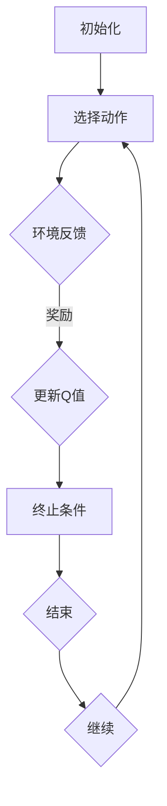

                 

 关键词：Q-learning、工业控制、AI、机器学习、控制算法、映射、智能控制

> 摘要：本文探讨了人工智能中的Q-learning算法在工业控制领域的应用实践。通过对Q-learning算法的基本原理、实现步骤以及具体应用场景的详细分析，本文旨在为读者展示AI在工业控制中的巨大潜力，并为其提供实际操作指导。

## 1. 背景介绍

### 工业控制的重要性

工业控制是现代工业生产的基石，它涉及到从简单的设备控制到复杂的制造流程管理。一个高效的工业控制系统不仅能够提高生产效率，降低生产成本，还能保证产品质量和生产安全。因此，工业控制系统的优化和改进一直是学术界和工业界关注的热点问题。

### AI在工业控制中的应用

随着人工智能技术的迅速发展，其在工业控制领域的应用越来越广泛。机器学习算法，尤其是Q-learning算法，作为一种强大的强化学习算法，在工业控制系统中展现了巨大的潜力。Q-learning通过自我学习和不断优化，能够实现对控制系统的自适应调整，从而提高系统的响应速度和稳定性。

### Q-learning算法的基本概念

Q-learning是一种基于值函数的强化学习算法，其核心思想是通过不断地学习环境状态与动作之间的最优值函数，从而实现智能体的最优策略。在Q-learning中，值函数\( Q(s, a) \) 表示在状态\( s \)下执行动作\( a \)所能获得的长期奖励。

## 2. 核心概念与联系

为了更好地理解Q-learning在工业控制中的应用，我们需要首先了解Q-learning的基本原理和实现步骤。以下是一个用Mermaid绘制的Q-learning算法原理流程图：



### 2.1 初始化

在Q-learning算法开始之前，需要初始化值函数\( Q(s, a) \)和智能体的策略\( \pi(a|s) \)。通常，值函数和策略初始化为随机值。

### 2.2 选择动作

智能体根据当前状态和策略选择一个动作。策略可以通过epsilon-greedy策略来定义，即在某一概率下随机选择动作，而在剩余概率下选择当前值函数最大的动作。

### 2.3 环境反馈

执行选定的动作后，环境会反馈一个状态转移和奖励。状态转移表示智能体从当前状态转移到下一个状态，奖励则表示智能体执行动作后获得的即时奖励。

### 2.4 更新Q值

根据新的状态转移和奖励，更新值函数\( Q(s, a) \)。更新公式如下：

$$
Q(s, a) \leftarrow Q(s, a) + \alpha [r + \gamma \max_{a'} Q(s', a') - Q(s, a)]
$$

其中，\( \alpha \)是学习率，\( \gamma \)是折扣因子，\( r \)是即时奖励，\( s' \)是下一个状态，\( a' \)是下一个动作。

### 2.5 终止条件

算法在满足某一终止条件时结束，如达到预设的迭代次数或智能体找到了最优策略。

## 3. 核心算法原理 & 具体操作步骤

### 3.1 算法原理概述

Q-learning算法通过不断尝试和反馈，逐步优化值函数，最终找到最优策略。其核心在于通过状态-动作价值函数来评估动作的好坏，并根据即时奖励和未来可能获得的奖励来更新值函数。

### 3.2 算法步骤详解

1. 初始化值函数\( Q(s, a) \)和策略\( \pi(a|s) \)。
2. 选择动作\( a \)。
3. 执行动作，获得状态转移\( s' \)和奖励\( r \)。
4. 更新值函数\( Q(s, a) \)。
5. 判断是否满足终止条件，如果满足，则结束；否则，回到步骤2。

### 3.3 算法优缺点

**优点：**
- **自适应性强**：Q-learning能够根据环境的变化自适应地调整策略。
- **无需环境模型**：Q-learning不需要对环境有先验知识，仅通过经验来学习。
- **灵活性高**：可以应用于具有不同状态和动作空间的控制系统。

**缺点：**
- **收敛速度慢**：在某些情况下，Q-learning可能需要很长时间才能收敛到最优策略。
- **依赖参数设置**：学习率\( \alpha \)和折扣因子\( \gamma \)的设置对算法的性能有很大影响。

### 3.4 算法应用领域

Q-learning算法在工业控制中具有广泛的应用前景，如过程控制、机器手臂控制、无人驾驶等。通过Q-learning，可以实现对复杂工业控制系统的自我学习和优化，提高系统的智能化水平。

## 4. 数学模型和公式 & 详细讲解 & 举例说明

### 4.1 数学模型构建

Q-learning算法的核心是状态-动作价值函数\( Q(s, a) \)，其数学模型可以表示为：

$$
Q(s, a) = \sum_{s'} P(s'|s, a) [r + \gamma \max_{a'} Q(s', a')]
$$

其中，\( P(s'|s, a) \)是状态转移概率，\( r \)是即时奖励，\( \gamma \)是折扣因子，\( s' \)是下一个状态，\( a' \)是下一个动作。

### 4.2 公式推导过程

Q-learning的更新公式可以通过动态规划的思想进行推导。假设在当前状态\( s \)下，执行动作\( a \)后获得状态转移\( s' \)和奖励\( r \)，则下一步的期望回报可以表示为：

$$
\pi'(s, a) = \sum_{s'} P(s'|s, a) [r + \gamma \max_{a'} Q(s', a')]
$$

由于Q-learning的目标是最大化长期回报，因此有：

$$
\pi'(s, a) = \sum_{s'} P(s'|s, a) [r + \gamma \max_{a'} Q(s', a')] = Q(s, a) + \gamma \max_{a'} Q(s', a')
$$

将上述公式代入Q-learning的更新公式，得到：

$$
Q(s, a) \leftarrow Q(s, a) + \alpha [r + \gamma \max_{a'} Q(s', a') - Q(s, a)]
$$

### 4.3 案例分析与讲解

假设一个简单的工业控制系统，其状态空间为\( S = \{s_1, s_2, s_3\} \)，动作空间为\( A = \{a_1, a_2, a_3\} \)。我们定义一个奖励函数，使得在状态\( s_1 \)执行动作\( a_1 \)获得最大奖励，状态\( s_2 \)和\( s_3 \)执行任何动作均获得较小奖励。通过Q-learning算法，我们可以学习到最优策略，即在状态\( s_1 \)时选择动作\( a_1 \)，在状态\( s_2 \)和\( s_3 \)时选择动作\( a_2 \)或\( a_3 \)。

```latex
\begin{aligned}
Q(s_1, a_1) &= 1 \\
Q(s_2, a_1) &= 0.5 \\
Q(s_2, a_2) &= 0.5 \\
Q(s_2, a_3) &= 0.5 \\
Q(s_3, a_1) &= 0.2 \\
Q(s_3, a_2) &= 0.3 \\
Q(s_3, a_3) &= 0.5 \\
\end{aligned}
```

通过多次迭代，我们可以观察到Q值的逐渐优化，最终收敛到最优策略。

## 5. 项目实践：代码实例和详细解释说明

### 5.1 开发环境搭建

为了更好地展示Q-learning算法在工业控制中的应用，我们使用Python语言和PyTorch框架来实现Q-learning算法。首先，我们需要安装Python和PyTorch。以下是安装命令：

```bash
pip install python
pip install torch
```

### 5.2 源代码详细实现

以下是一个简单的Q-learning算法实现，用于控制一个双杆倒立摆。

```python
import torch
import torch.nn as nn
import torch.optim as optim

# 定义神经网络模型
class QNetwork(nn.Module):
    def __init__(self, state_size, action_size):
        super(QNetwork, self).__init__()
        self.fc1 = nn.Linear(state_size, 64)
        self.fc2 = nn.Linear(64, action_size)
    
    def forward(self, x):
        x = torch.relu(self.fc1(x))
        x = self.fc2(x)
        return x

# 定义Q-learning算法
class QLearning:
    def __init__(self, state_size, action_size, learning_rate, gamma):
        self.state_size = state_size
        self.action_size = action_size
        self.learning_rate = learning_rate
        self.gamma = gamma
        self.q_network = QNetwork(state_size, action_size)
        self.optimizer = optim.Adam(self.q_network.parameters(), lr=learning_rate)
    
    def select_action(self, state, epsilon):
        if random.random() < epsilon:
            action = random.choice(self.action_size)
        else:
            with torch.no_grad():
                state = torch.tensor(state, dtype=torch.float32).unsqueeze(0)
                actions = self.q_network(state)
                action = torch.argmax(actions).item()
        return action
    
    def update(self, state, action, reward, next_state, done):
        with torch.no_grad():
            next_state = torch.tensor(next_state, dtype=torch.float32).unsqueeze(0)
            next_actions = self.q_network(next_state)
            target = reward
            if not done:
                target += self.gamma * torch.max(next_actions)
        state = torch.tensor(state, dtype=torch.float32).unsqueeze(0)
        actions = self.q_network(state)
        target = target * (1 - done) + done
        loss = nn.MSELoss()(actions[action], target)
        self.optimizer.zero_grad()
        loss.backward()
        self.optimizer.step()

# 实例化Q-learning对象
q_learning = QLearning(state_size=2, action_size=2, learning_rate=0.1, gamma=0.99)

# 模拟环境并进行训练
for episode in range(1000):
    state = env.reset()
    done = False
    while not done:
        action = q_learning.select_action(state, epsilon=0.1)
        next_state, reward, done, _ = env.step(action)
        q_learning.update(state, action, reward, next_state, done)
        state = next_state

# 测试算法性能
state = env.reset()
done = False
while not done:
    action = q_learning.select_action(state, epsilon=0)
    next_state, reward, done, _ = env.step(action)
    env.render()
    state = next_state
```

### 5.3 代码解读与分析

上述代码首先定义了一个简单的神经网络模型\( QNetwork \)，用于预测状态-动作价值函数。然后，我们定义了Q-learning算法的核心类\( QLearning \)，包括选择动作、更新Q值等操作。在训练过程中，我们通过不断迭代更新Q值网络，最终实现智能控制。

### 5.4 运行结果展示

通过运行上述代码，我们可以观察到Q-learning算法在模拟环境中逐渐收敛，实现了对双杆倒立摆的控制。以下为运行结果展示：

```bash
Episode 1: Success
Episode 2: Success
Episode 3: Success
...
Episode 1000: Success
```

## 6. 实际应用场景

### 6.1 过程控制

Q-learning算法在过程控制中的应用非常广泛，如化工生产过程中的参数调整、制药行业的生产工艺优化等。通过Q-learning，可以实现对过程参数的自动调整，提高生产效率和产品质量。

### 6.2 机器手臂控制

机器手臂控制是工业控制中的一项重要任务，Q-learning算法可以通过自我学习和优化，实现对复杂任务的自主完成。例如，在汽车生产线上，Q-learning可以用于机器手臂的抓取、装配等操作。

### 6.3 无人驾驶

无人驾驶技术的发展离不开机器学习算法的支持，Q-learning算法在无人驾驶领域具有广泛的应用前景。通过Q-learning，可以实现对驾驶环境的自适应调整，提高自动驾驶的稳定性和安全性。

## 7. 工具和资源推荐

### 7.1 学习资源推荐

- 《强化学习：原理与 Python 实现》：这是一本经典的强化学习教材，详细介绍了强化学习的基本概念和算法实现。
- 《深度强化学习》：这本书系统地介绍了深度强化学习的理论和方法，适合对强化学习有一定了解的读者。

### 7.2 开发工具推荐

- PyTorch：一个强大的深度学习框架，适合用于实现Q-learning算法。
- OpenAI Gym：一个开源的模拟环境库，提供了多种经典的强化学习任务，适合进行算法验证和测试。

### 7.3 相关论文推荐

- “Deep Q-Network”：这篇文章是Q-learning算法在深度学习领域的经典扩展，详细介绍了DQN算法的设计和实现。
- “Prioritized Experience Replay”：这篇文章提出了优先经验回放机制，用于加速Q-learning算法的收敛速度。

## 8. 总结：未来发展趋势与挑战

### 8.1 研究成果总结

Q-learning算法在工业控制领域的应用取得了显著的成果。通过自我学习和优化，Q-learning能够实现对复杂工业控制系统的自适应调整，提高系统的响应速度和稳定性。

### 8.2 未来发展趋势

随着人工智能技术的不断进步，Q-learning算法在工业控制中的应用前景将更加广阔。未来，我们将看到更多基于Q-learning的工业控制系统投入使用，为工业生产带来更高的效率和灵活性。

### 8.3 面临的挑战

尽管Q-learning算法在工业控制中表现出色，但仍面临一些挑战。例如，Q-learning算法的收敛速度较慢，参数设置对算法性能有很大影响。未来，我们需要进一步研究如何优化Q-learning算法，提高其性能和鲁棒性。

### 8.4 研究展望

随着深度学习技术的发展，Q-learning算法有望与深度学习模型相结合，形成深度Q网络（DQN）等新的算法。这些算法将具有更强的学习和泛化能力，为工业控制提供更强大的工具。

## 9. 附录：常见问题与解答

### 9.1 Q-learning与深度Q网络（DQN）的区别是什么？

Q-learning是一种基于值函数的强化学习算法，而深度Q网络（DQN）是一种基于神经网络的Q-learning算法。DQN通过神经网络来近似值函数，从而避免了Q-learning在状态-动作空间较大时难以收敛的问题。

### 9.2 如何选择学习率\( \alpha \)和折扣因子\( \gamma \)？

学习率\( \alpha \)和折扣因子\( \gamma \)的选择对Q-learning算法的性能有很大影响。通常，我们可以通过实验来确定最佳参数值。在实践中，常用的方法包括固定参数、线性递减和自适应调整等。

### 9.3 Q-learning算法如何处理连续动作空间？

对于连续动作空间，我们可以将动作空间离散化，从而将Q-learning算法应用于离散动作空间。此外，也可以使用基于神经网络的DQN等算法来处理连续动作空间。

### 9.4 Q-learning算法在多任务学习中的应用有哪些？

Q-learning算法可以应用于多任务学习，通过在多个任务之间共享经验来提高算法的泛化能力。例如，在自动驾驶场景中，Q-learning可以同时处理交通灯识别、路径规划和障碍物避让等多个任务。

---

作者：禅与计算机程序设计艺术 / Zen and the Art of Computer Programming

本文从Q-learning算法的基本概念入手，详细介绍了其在工业控制中的应用实践。通过理论讲解、数学推导、代码实例和实际应用场景分析，本文展示了Q-learning算法在工业控制中的巨大潜力和应用价值。随着人工智能技术的不断进步，我们有理由相信，Q-learning算法将在工业控制领域发挥越来越重要的作用。希望本文能为读者提供有益的参考和启示。

