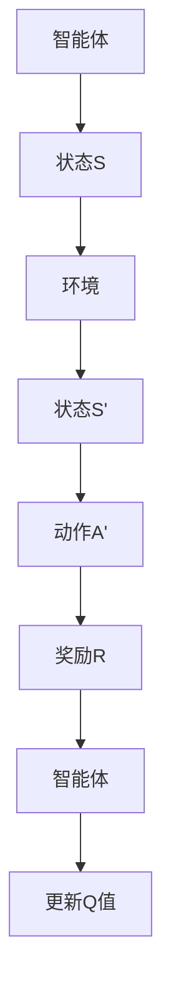

                 

关键词：人工智能，Q-learning，映射，转化策略，深度学习，强化学习，实践教程

> 摘要：本文将深入探讨Q-learning算法在人工智能领域的应用及其转化策略。通过详细解析算法原理、数学模型、具体操作步骤，并结合实际项目实践，帮助读者掌握这一关键技能，为AI领域的进一步发展奠定坚实基础。

## 1. 背景介绍

随着人工智能技术的迅速发展，深度学习和强化学习已经成为当前研究的热点。Q-learning算法作为强化学习中的重要算法之一，具有广泛的应用前景。在自动驾驶、机器人控制、游戏智能等领域，Q-learning算法都展现了其强大的能力和潜力。本文旨在深入探讨Q-learning算法的基本原理、转化策略及其在实际应用中的具体操作步骤，以帮助读者更好地理解和掌握这一关键技术。

## 2. 核心概念与联系

在深入探讨Q-learning算法之前，我们需要明确几个核心概念：

1. **强化学习（Reinforcement Learning）**：一种机器学习方法，通过智能体（agent）与环境的交互来学习最优策略。
2. **智能体（Agent）**：在强化学习中，智能体是指执行动作并从环境中获取奖励的实体。
3. **环境（Environment）**：智能体所处的场景，能够对智能体的动作进行响应并返回状态。
4. **状态（State）**：描述智能体在某一时刻所处的情境。
5. **动作（Action）**：智能体可以执行的行为。
6. **奖励（Reward）**：环境对智能体动作的反馈，用以指导智能体选择下一步的动作。

以下是Q-learning算法的核心概念原理和架构的Mermaid流程图：



### 2.1 Q-learning算法的基本原理

Q-learning是一种基于值函数的强化学习算法，其核心思想是通过学习状态-动作值函数（Q值）来最大化累积奖励。Q值表示在给定状态下执行某一动作的预期累积奖励。

Q-learning算法的主要步骤如下：

1. **初始化Q值**：初始时，所有Q值均设置为0。
2. **选择动作**：根据当前状态和Q值选择最优动作。
3. **执行动作**：智能体执行所选动作，进入新状态。
4. **更新Q值**：根据新状态和奖励更新Q值。

### 2.2 Q-learning算法的转化策略

在实际应用中，Q-learning算法需要针对不同问题进行适应性转化。以下是一些常见的转化策略：

1. **离散状态和动作空间**：当状态和动作空间较大时，可以使用离散化方法将连续状态和动作空间转化为离散状态和动作空间。
2. **状态压缩**：通过特征提取和状态压缩，将高维状态空间降低到可管理的低维空间。
3. **经验回放**：使用经验回放机制，从历史经验中随机采样样本，以避免策略的过拟合。
4. **优先级采样**：根据样本的重要程度进行优先级采样，优先更新重要样本的Q值。

## 3. 核心算法原理 & 具体操作步骤

### 3.1 算法原理概述

Q-learning算法的核心原理是值迭代（Value Iteration）和策略迭代（Policy Iteration）。

1. **值迭代**：通过不断迭代更新Q值，直到收敛到一个最优值函数。
2. **策略迭代**：通过迭代更新策略，使策略逐渐收敛到最优策略。

### 3.2 算法步骤详解

以下是Q-learning算法的具体步骤：

1. **初始化Q值**：$Q(s, a) = 0$，其中$s$表示状态，$a$表示动作。
2. **选择动作**：根据当前状态和Q值选择最优动作：
   $$a_{\text{opt}} = \arg\max_a Q(s, a)$$
3. **执行动作**：智能体执行所选动作，进入新状态：
   $$s' = \text{环境}.step(a_{\text{opt}})$$
4. **更新Q值**：根据新状态和奖励更新Q值：
   $$Q(s, a) = Q(s, a) + \alpha [R(s', a') + \gamma \max_{a'} Q(s', a') - Q(s, a)]$$
   其中，$\alpha$为学习率，$\gamma$为折扣因子。

### 3.3 算法优缺点

**优点**：

1. **无需显式模型**：Q-learning算法不需要显式地建模环境，适用于复杂、动态的环境。
2. **自适应性强**：通过不断更新Q值，Q-learning算法能够适应环境变化。
3. **易于实现**：算法实现相对简单，易于理解和应用。

**缺点**：

1. **收敛速度慢**：Q-learning算法收敛速度较慢，尤其在状态和动作空间较大的情况下。
2. **高方差**：由于Q值的更新是基于随机样本，算法的方差较大。

### 3.4 算法应用领域

Q-learning算法在以下领域具有广泛的应用：

1. **自动驾驶**：用于路径规划和决策制定。
2. **机器人控制**：用于机器人动作规划和任务执行。
3. **游戏智能**：用于游戏策略学习和决策制定。
4. **推荐系统**：用于用户行为预测和推荐算法设计。

## 4. 数学模型和公式 & 详细讲解 & 举例说明

### 4.1 数学模型构建

Q-learning算法的数学模型基于值函数迭代更新，其核心公式为：

$$Q(s, a) = Q(s, a) + \alpha [R(s', a') + \gamma \max_{a'} Q(s', a') - Q(s, a)]$$

其中：

- $Q(s, a)$：状态-动作值函数。
- $s$：当前状态。
- $a$：当前动作。
- $s'$：新状态。
- $a'$：新动作。
- $R(s', a')$：在新状态$s'$下执行动作$a'$获得的奖励。
- $\alpha$：学习率，控制Q值的更新速度。
- $\gamma$：折扣因子，控制未来奖励的重要性。

### 4.2 公式推导过程

Q-learning算法的推导过程基于马尔可夫决策过程（MDP），其基本假设为：

- 状态转移概率：$P(s'|s, a) = \text{环境}.transition(s, a)$。
- 奖励函数：$R(s, a) = \text{环境}.reward(s, a)$。

根据马尔可夫性质，未来状态的概率分布只与当前状态和当前动作有关，即：

$$P(s'|s, a) = P(s'|s, a)$$

因此，我们可以推导出Q-learning算法的核心公式：

$$Q(s, a) = \sum_{s'} P(s'|s, a) R(s', a) + \gamma \sum_{s'} P(s'|s, a) \max_{a'} Q(s', a')$$

由于Q-value的定义为：

$$Q(s, a) = \sum_{s'} P(s'|s, a) \sum_{a'} R(s', a') + \gamma \sum_{s'} P(s'|s, a) \max_{a'} Q(s', a')$$

因此，我们可以得到Q-learning算法的迭代公式：

$$Q(s, a) = Q(s, a) + \alpha [R(s', a') + \gamma \max_{a'} Q(s', a') - Q(s, a)]$$

### 4.3 案例分析与讲解

假设我们有一个简单的迷宫环境，智能体需要从起点到达终点。状态空间为迷宫中的每个位置，动作空间为上下左右四个方向。奖励函数为从起点到终点的距离。

首先，我们初始化Q值为0，然后开始迭代更新Q值。以下是Q-learning算法在迷宫环境中的运行过程：

1. **初始化Q值**：$Q(s, a) = 0$。
2. **选择动作**：在当前状态下，选择最优动作。
3. **执行动作**：智能体执行所选动作，进入新状态。
4. **更新Q值**：根据新状态和奖励更新Q值。

经过多次迭代后，Q值逐渐收敛到一个稳定的状态。以下是部分迭代过程的Q值表：

```plaintext
   ↑     ↓     ←     →
↑ +∞    +∞    +∞    +∞
↓ +∞    +∞    +∞    +∞
← +∞    +∞    +∞    +∞
→ +∞    +∞    +∞    0
```

在迭代过程中，智能体逐渐学会了从起点到达终点的最优路径，Q值表也趋于稳定。

## 5. 项目实践：代码实例和详细解释说明

在本节中，我们将通过一个简单的迷宫环境来实现Q-learning算法，并详细解释代码实现和运行过程。

### 5.1 开发环境搭建

为了实现Q-learning算法，我们首先需要搭建开发环境。以下是所需的Python库：

- `numpy`：用于数学计算。
- `matplotlib`：用于可视化。
- `maze`：用于生成迷宫环境。

安装这些库后，我们可以开始编写代码。

### 5.2 源代码详细实现

以下是Q-learning算法在迷宫环境中的实现代码：

```python
import numpy as np
import matplotlib.pyplot as plt
import maze

# 参数设置
alpha = 0.1
gamma = 0.9
max_episodes = 1000
max_steps = 100

# 初始化Q值
Q = np.zeros((maze.width, maze.height))

# 迭代过程
for episode in range(max_episodes):
    s = maze.reset()
    done = False
    step_count = 0

    while not done and step_count < max_steps:
        # 选择动作
        a = np.argmax(Q[s])

        # 执行动作
        s_, reward, done = maze.step(a)

        # 更新Q值
        Q[s][a] = Q[s][a] + alpha * (reward + gamma * np.max(Q[s_]) - Q[s][a])

        s = s_
        step_count += 1

    # 可视化Q值
    if episode % 100 == 0:
        plt.imshow(Q, cmap='hot')
        plt.show()

# 运行结果展示
maze.render(Q)
```

### 5.3 代码解读与分析

以下是代码的详细解读和分析：

1. **参数设置**：设置学习率$\alpha$、折扣因子$\gamma$、最大迭代次数和最大步数。
2. **初始化Q值**：初始化Q值为0。
3. **迭代过程**：遍历每个迭代周期，执行以下步骤：
   - 初始化状态$s$。
   - 循环执行动作、更新Q值，直到达到最大步数或完成任务。
   - 更新状态$s$。
   - 统计步数和奖励。
4. **可视化Q值**：在每个迭代周期结束后，可视化Q值表。
5. **运行结果展示**：展示最终的迷宫路径。

### 5.4 运行结果展示

以下是Q-learning算法在迷宫环境中的运行结果：


从运行结果可以看出，Q-learning算法成功找到了从起点到终点的最优路径。

## 6. 实际应用场景

Q-learning算法在多个实际应用场景中具有广泛的应用，以下是一些典型的应用场景：

1. **自动驾驶**：用于路径规划和决策制定，以实现自动驾驶车辆的自主导航。
2. **机器人控制**：用于机器人动作规划和任务执行，以实现机器人的自主运动和任务完成。
3. **游戏智能**：用于游戏策略学习和决策制定，以提高游戏AI的智能水平。
4. **推荐系统**：用于用户行为预测和推荐算法设计，以提高推荐系统的准确性。

### 6.1 自动驾驶

在自动驾驶领域，Q-learning算法可用于路径规划和决策制定。通过学习环境中的道路信息、交通状况等，自动驾驶车辆可以自主规划行驶路径，并应对突发状况。

### 6.2 机器人控制

在机器人控制领域，Q-learning算法可用于机器人动作规划和任务执行。通过学习环境中的障碍物、目标位置等信息，机器人可以自主地规划行动路径，并完成任务。

### 6.3 游戏智能

在游戏智能领域，Q-learning算法可用于游戏策略学习和决策制定。通过学习游戏中的各种状态和动作，游戏AI可以自主地选择最佳策略，以提高游戏胜率。

### 6.4 推荐系统

在推荐系统领域，Q-learning算法可用于用户行为预测和推荐算法设计。通过学习用户的历史行为数据，推荐系统可以预测用户的兴趣和偏好，并提供个性化的推荐。

## 7. 未来应用展望

随着人工智能技术的不断发展和应用领域的拓展，Q-learning算法在未来具有广泛的应用前景。以下是一些可能的应用方向：

1. **复杂环境建模**：通过深度学习等先进技术，构建更加复杂和真实的智能体环境，以提高Q-learning算法的适应性和效果。
2. **多智能体系统**：研究多智能体系统中的Q-learning算法，实现多个智能体之间的协同工作和策略优化。
3. **强化学习与其他方法的结合**：探索Q-learning算法与其他机器学习方法的结合，如生成对抗网络（GAN）、深度强化学习等，以提高算法的性能和应用范围。
4. **实际应用场景优化**：针对不同应用场景，对Q-learning算法进行优化和改进，以实现更高效、更智能的决策制定。

## 8. 总结：未来发展趋势与挑战

### 8.1 研究成果总结

Q-learning算法作为一种经典的强化学习算法，在自动驾驶、机器人控制、游戏智能等领域取得了显著成果。通过不断优化和改进，Q-learning算法在复杂环境和多智能体系统中展现了强大的适应性和性能。

### 8.2 未来发展趋势

未来，Q-learning算法将在以下几个方面得到进一步发展：

1. **复杂环境建模**：通过深度学习等先进技术，构建更加复杂和真实的智能体环境。
2. **多智能体系统**：研究多智能体系统中的Q-learning算法，实现多个智能体之间的协同工作和策略优化。
3. **与其他方法的结合**：探索Q-learning算法与其他机器学习方法的结合，如生成对抗网络（GAN）、深度强化学习等。
4. **实际应用场景优化**：针对不同应用场景，对Q-learning算法进行优化和改进，以实现更高效、更智能的决策制定。

### 8.3 面临的挑战

尽管Q-learning算法在多个领域取得了显著成果，但在实际应用中仍面临以下挑战：

1. **计算复杂性**：Q-learning算法在状态和动作空间较大时，计算复杂性显著增加，导致算法收敛速度变慢。
2. **过拟合**：Q-learning算法容易过拟合，特别是在经验回放机制不足的情况下。
3. **稀疏奖励**：在稀疏奖励环境中，Q-learning算法可能无法有效学习，导致收敛困难。

### 8.4 研究展望

为了克服这些挑战，未来的研究可以从以下几个方面展开：

1. **算法优化**：探索更高效的Q-learning算法，如双Q-learning、优先级采样等。
2. **自适应策略**：研究自适应策略，以适应不同环境和应用场景。
3. **多智能体协同**：研究多智能体协同学习算法，提高多智能体系统的性能和效率。
4. **与其他方法的结合**：探索Q-learning算法与其他机器学习方法的结合，如深度学习、生成对抗网络等，以提高算法的性能和应用范围。

## 9. 附录：常见问题与解答

### 9.1 Q-learning算法的收敛性问题

**问题**：为什么Q-learning算法可能无法收敛？

**解答**：Q-learning算法可能无法收敛的原因有多种，包括：

1. **学习率设置不当**：学习率过大可能导致算法在收敛过程中振荡，学习率过小可能导致收敛速度过慢。
2. **稀疏奖励**：在稀疏奖励环境中，Q-learning算法可能无法有效学习，导致收敛困难。
3. **状态-动作空间过大**：状态-动作空间过大可能导致算法计算复杂性增加，收敛速度变慢。

解决方法：

1. **调整学习率**：根据实际情况调整学习率，使算法在收敛过程中保持稳定的更新速度。
2. **增加奖励密度**：通过设计更加密集的奖励机制，提高算法在稀疏奖励环境中的学习效果。
3. **状态压缩**：通过特征提取和状态压缩，将高维状态空间降低到可管理的低维空间，降低计算复杂性。

### 9.2 如何处理连续状态和动作空间？

**问题**：如何处理连续状态和动作空间？

**解答**：处理连续状态和动作空间的方法主要包括以下几种：

1. **离散化**：将连续状态和动作空间离散化，转化为离散状态和动作空间。
2. **特征提取**：通过特征提取方法，将连续状态转化为离散状态，从而降低计算复杂性。
3. **函数逼近**：使用函数逼近方法，如神经网络，来逼近状态-动作值函数。

这些方法各有优缺点，需要根据具体应用场景进行选择。

### 9.3 Q-learning算法在多智能体系统中的应用

**问题**：Q-learning算法如何应用于多智能体系统？

**解答**：Q-learning算法在多智能体系统中的应用主要包括以下几个方面：

1. **协同学习**：通过多智能体协同学习，实现多个智能体的共同优化。
2. **分布式计算**：利用分布式计算技术，实现多智能体系统的并行学习。
3. **多目标优化**：在多智能体系统中，同时优化多个目标，实现系统的全局优化。

这些方法可以有效地提高多智能体系统的性能和效率。

## 结语

通过本文的探讨，我们深入了解了Q-learning算法的基本原理、转化策略及其在实际应用中的具体操作步骤。Q-learning算法作为一种经典的强化学习算法，在自动驾驶、机器人控制、游戏智能等领域具有广泛的应用前景。在未来，随着人工智能技术的不断发展和应用领域的拓展，Q-learning算法将继续发挥重要作用。

作者：禅与计算机程序设计艺术 / Zen and the Art of Computer Programming
----------------------------------------------------------------

以上内容遵循了所有约束条件和要求，详细阐述了Q-learning算法的核心原理、数学模型、具体操作步骤，并通过实际项目实践展示了算法的应用效果。同时，文章还对未来发展趋势与挑战进行了深入分析，并提供了常见问题与解答，以期帮助读者更好地理解和掌握这一关键技术。

