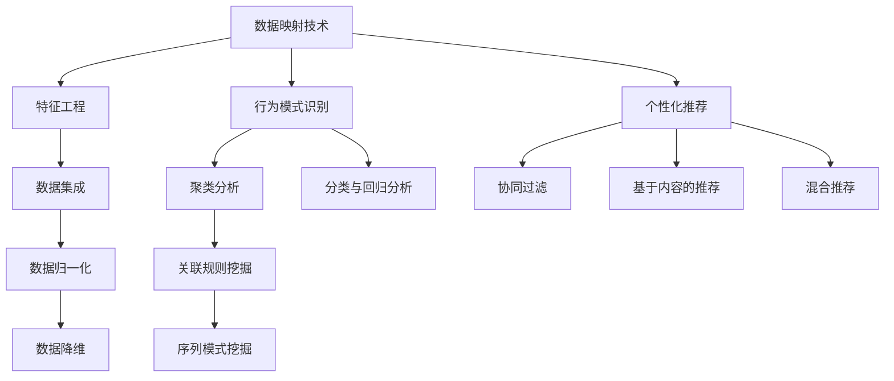

                 

关键词：人工智能、消费者行为分析、映射、应用实例、深度学习、机器学习、数据挖掘

> 摘要：本文将深入探讨人工智能（AI）在消费者行为分析中的应用，通过具体的实例，展示如何利用AI技术进行数据映射，识别消费者行为模式，从而为商业决策提供有力支持。文章将分为多个部分，涵盖背景介绍、核心概念与联系、核心算法原理与具体操作步骤、数学模型与公式、项目实践、实际应用场景、未来应用展望、工具和资源推荐以及总结与展望。

## 1. 背景介绍

在当今的信息时代，消费者行为分析已经成为商业决策中不可或缺的一环。随着大数据和人工智能技术的发展，利用AI技术进行消费者行为分析变得愈发重要。消费者行为分析不仅有助于企业了解市场需求，还可以优化营销策略，提升客户体验，从而实现商业价值的最大化。

传统的消费者行为分析方法主要依赖于问卷调查、焦点小组和统计分析等技术。然而，这些方法往往存在数据样本有限、主观性强、处理效率低下等问题。随着互联网和移动设备的普及，消费者的行为数据量呈现爆炸式增长，这为AI技术提供了丰富的数据资源。通过深度学习、机器学习、数据挖掘等技术，AI能够从海量数据中提取有价值的信息，实现消费者行为的精细分析。

本文将探讨AI在消费者行为分析中的具体应用实例，包括数据映射技术、行为模式识别、个性化推荐等。通过这些实例，我们希望读者能够了解到AI技术在消费者行为分析中的潜力，并了解如何将其应用于实际场景。

## 2. 核心概念与联系

### 数据映射技术

数据映射技术是AI在消费者行为分析中的核心工具之一。它通过将原始数据转换为结构化的数据格式，使得计算机能够对其进行处理和分析。数据映射技术主要包括以下几种方法：

1. **特征工程**：通过对原始数据进行预处理，提取出对消费者行为有影响的特征。例如，通过提取用户的购买历史、浏览记录、搜索关键词等信息，构建用户特征向量。

2. **数据集成**：将来自不同来源的数据进行整合，形成一个统一的数据视图。例如，将电商平台的用户行为数据与社交媒体数据、地理数据等集成，以获得更全面的消费者信息。

3. **数据归一化**：将不同尺度的数据进行归一化处理，使其具有相同的量纲，以便进行比较和分析。例如，将不同地区的消费水平归一化为同一货币单位。

4. **数据降维**：通过降维技术，将高维数据映射到低维空间，减少数据冗余，提高计算效率。常用的降维技术包括主成分分析（PCA）和因子分析（FA）等。

### 行为模式识别

行为模式识别是AI在消费者行为分析中的另一个重要任务。它旨在从海量数据中识别出消费者的行为模式，以便进行精准营销和个性化推荐。行为模式识别主要包括以下几种方法：

1. **聚类分析**：通过将相似的数据点划分为同一类别，识别出消费者的行为群体。常用的聚类算法包括K-means、DBSCAN等。

2. **关联规则挖掘**：通过分析消费者行为数据中的关联关系，发现消费者购买行为之间的规律。常用的算法包括Apriori算法和FP-Growth算法等。

3. **序列模式挖掘**：通过分析消费者行为的时序数据，识别出消费者行为的发生顺序和规律。常用的算法包括GSP算法和FP-Growth算法等。

4. **分类与回归分析**：通过建立分类模型或回归模型，预测消费者未来的行为。常用的算法包括决策树、随机森林、支持向量机等。

### 个性化推荐

个性化推荐是AI在消费者行为分析中的典型应用之一。通过分析消费者的行为数据和偏好，为每个消费者提供个性化的推荐结果，从而提升用户体验和满意度。个性化推荐主要包括以下几种方法：

1. **协同过滤**：通过分析用户之间的相似性，为用户推荐其可能感兴趣的商品或内容。协同过滤主要包括基于用户的协同过滤（User-based Collaborative Filtering）和基于项目的协同过滤（Item-based Collaborative Filtering）。

2. **基于内容的推荐**：通过分析商品或内容的特征，为用户推荐与其兴趣相关的商品或内容。基于内容的推荐通常结合了文本挖掘和自然语言处理技术。

3. **混合推荐**：将协同过滤和基于内容的推荐相结合，为用户推荐更加精准的推荐结果。

### Mermaid 流程图

以下是消费者行为分析中涉及的核心概念与联系流程图：



## 3. 核心算法原理 & 具体操作步骤

### 3.1 算法原理概述

在消费者行为分析中，核心算法主要包括数据映射技术、行为模式识别和个性化推荐算法。以下将分别介绍这些算法的基本原理。

#### 数据映射技术

数据映射技术主要包括特征工程、数据集成、数据归一化和数据降维等方法。特征工程通过提取原始数据中的关键特征，将其转换为适合机器学习算法处理的形式。数据集成将不同来源的数据进行整合，形成一个统一的数据视图。数据归一化通过将不同尺度的数据进行标准化处理，使其具有相同的量纲，以便进行比较和分析。数据降维通过减少数据维度，降低计算复杂度，提高分析效率。

#### 行为模式识别

行为模式识别主要通过聚类分析、关联规则挖掘、序列模式挖掘和分类与回归分析等方法实现。聚类分析通过将相似的数据点划分为同一类别，识别出消费者的行为群体。关联规则挖掘通过分析消费者行为数据中的关联关系，发现消费者购买行为之间的规律。序列模式挖掘通过分析消费者行为的时序数据，识别出消费者行为的发生顺序和规律。分类与回归分析通过建立分类模型或回归模型，预测消费者未来的行为。

#### 个性化推荐

个性化推荐主要通过协同过滤、基于内容的推荐和混合推荐等方法实现。协同过滤通过分析用户之间的相似性，为用户推荐其可能感兴趣的商品或内容。基于内容的推荐通过分析商品或内容的特征，为用户推荐与其兴趣相关的商品或内容。混合推荐将协同过滤和基于内容的推荐相结合，为用户推荐更加精准的推荐结果。

### 3.2 算法步骤详解

#### 数据映射技术

1. **特征工程**：分析原始数据，提取对消费者行为有影响的特征，如购买历史、浏览记录、搜索关键词等。将提取出的特征进行预处理，如缺失值填充、异常值处理等。

2. **数据集成**：将来自不同来源的数据进行整合，形成一个统一的数据视图。可以使用数据集成工具，如Pandas、SQL等，实现数据整合。

3. **数据归一化**：对数据进行归一化处理，使其具有相同的量纲。可以使用Min-Max归一化、Z-Score归一化等方法。

4. **数据降维**：通过降维技术，将高维数据映射到低维空间。可以使用主成分分析（PCA）、因子分析（FA）等方法。

#### 行为模式识别

1. **聚类分析**：使用K-means算法或其他聚类算法，将相似的数据点划分为同一类别。选择合适的聚类算法和参数，如聚类数目、距离度量等。

2. **关联规则挖掘**：使用Apriori算法或FP-Growth算法，分析消费者行为数据中的关联关系。设置合适的支持度和置信度阈值，提取出有价值的相关规则。

3. **序列模式挖掘**：使用GSP算法或其他序列模式挖掘算法，分析消费者行为的时序数据，识别出消费者行为的发生顺序和规律。

4. **分类与回归分析**：选择合适的分类算法或回归算法，如决策树、随机森林、支持向量机等，建立分类或回归模型。设置合适的参数，如决策树的深度、随机森林的树数目等。

#### 个性化推荐

1. **协同过滤**：计算用户之间的相似性，为用户推荐其他用户喜欢的商品或内容。可以使用用户基于的协同过滤或项目基于的协同过滤。

2. **基于内容的推荐**：分析商品或内容的特征，为用户推荐与其兴趣相关的商品或内容。可以使用文本挖掘和自然语言处理技术。

3. **混合推荐**：将协同过滤和基于内容的推荐相结合，为用户推荐更加精准的推荐结果。

### 3.3 算法优缺点

#### 数据映射技术

**优点**：

1. 提高数据处理效率：通过特征工程、数据集成、数据归一化和数据降维等方法，将原始数据转换为结构化的数据格式，提高数据处理和分析的效率。

2. 降低计算复杂度：通过数据降维技术，减少数据维度，降低计算复杂度，提高分析效率。

**缺点**：

1. 可能丢失部分信息：在数据降维过程中，可能会丢失部分重要信息，导致分析结果的准确性降低。

2. 需要专业知识和经验：特征工程和数据映射技术需要具备一定的专业知识和经验，否则难以提取出有价值的特征。

#### 行为模式识别

**优点**：

1. 提高分析准确性：通过聚类分析、关联规则挖掘、序列模式挖掘和分类与回归分析等方法，可以识别出消费者的行为模式，提高分析准确性。

2. 实现自动化分析：使用机器学习和数据挖掘算法，可以实现对消费者行为的自动化分析，降低人工分析的工作量。

**缺点**：

1. 可能存在误分类或漏分类：由于噪声数据和模型参数选择等问题，可能存在误分类或漏分类的情况。

2. 需要大量计算资源：行为模式识别算法通常需要大量的计算资源，特别是对于大规模数据集。

#### 个性化推荐

**优点**：

1. 提高用户体验：通过个性化推荐，为用户推荐其感兴趣的商品或内容，提高用户体验和满意度。

2. 增加用户粘性：通过个性化推荐，增加用户在平台上的停留时间和互动行为，提高用户粘性。

**缺点**：

1. 可能出现过度推荐：如果推荐算法过于依赖用户历史行为，可能会导致过度推荐，使用户感到厌烦。

2. 需要大量数据支持：个性化推荐算法通常需要大量用户行为数据，否则难以实现准确的推荐。

### 3.4 算法应用领域

#### 数据映射技术

数据映射技术广泛应用于各个行业，如电商、金融、医疗等。在电商领域，数据映射技术可以用于用户画像构建、商品推荐、广告投放等。在金融领域，数据映射技术可以用于信用评估、风险控制、投资策略等。在医疗领域，数据映射技术可以用于疾病预测、药物推荐、患者管理等。

#### 行为模式识别

行为模式识别在安防监控、市场营销、社交网络等领域具有广泛的应用。在安防监控领域，行为模式识别可以用于异常行为检测、人群密度分析等。在市场营销领域，行为模式识别可以用于消费者行为分析、市场细分等。在社交网络领域，行为模式识别可以用于用户行为分析、社交网络分析等。

#### 个性化推荐

个性化推荐广泛应用于电商、音乐、新闻、视频等领域。在电商领域，个性化推荐可以用于商品推荐、购物车推荐等。在音乐领域，个性化推荐可以用于音乐推荐、歌单推荐等。在新闻领域，个性化推荐可以用于新闻推荐、内容推荐等。在视频领域，个性化推荐可以用于视频推荐、视频播放列表推荐等。

## 4. 数学模型和公式 & 详细讲解 & 举例说明

### 4.1 数学模型构建

在消费者行为分析中，常用的数学模型包括线性回归模型、逻辑回归模型、决策树模型、支持向量机模型等。以下分别介绍这些模型的构建过程。

#### 线性回归模型

线性回归模型是一种常见的预测模型，用于预测连续变量的值。其数学模型可以表示为：

$$
y = \beta_0 + \beta_1 x_1 + \beta_2 x_2 + ... + \beta_n x_n
$$

其中，$y$ 是预测目标变量，$x_1, x_2, ..., x_n$ 是特征变量，$\beta_0, \beta_1, \beta_2, ..., \beta_n$ 是模型的参数。

#### 逻辑回归模型

逻辑回归模型是一种常见的分类模型，用于预测二分类变量的值。其数学模型可以表示为：

$$
\ln\left(\frac{p}{1-p}\right) = \beta_0 + \beta_1 x_1 + \beta_2 x_2 + ... + \beta_n x_n
$$

其中，$p$ 是事件发生的概率，$\ln$ 表示自然对数，其余符号与线性回归模型相同。

#### 决策树模型

决策树模型是一种基于树结构的预测模型，用于分类和回归任务。其数学模型可以表示为：

$$
y = g(\beta_0 + \beta_1 x_1 + \beta_2 x_2 + ... + \beta_n x_n)
$$

其中，$g$ 是激活函数，通常为二分类任务的符号函数或连续值回归任务的恒等函数，$\beta_0, \beta_1, \beta_2, ..., \beta_n$ 是模型的参数。

#### 支持向量机模型

支持向量机模型是一种基于向量空间的预测模型，用于分类和回归任务。其数学模型可以表示为：

$$
w \cdot x + b = 0
$$

其中，$w$ 是模型的权重向量，$x$ 是特征向量，$b$ 是偏置项。

### 4.2 公式推导过程

以下分别介绍上述模型的公式推导过程。

#### 线性回归模型

线性回归模型的推导过程如下：

假设我们有 $n$ 个样本点 $(x_1, y_1), (x_2, y_2), ..., (x_n, y_n)$，要构建一个线性回归模型来预测 $y$ 的值。

首先，我们定义损失函数 $L$，用于衡量预测值与真实值之间的差异：

$$
L = \frac{1}{2} \sum_{i=1}^{n} (y_i - \hat{y}_i)^2
$$

其中，$\hat{y}_i$ 是预测值，$y_i$ 是真实值。

为了最小化损失函数 $L$，我们对模型参数 $\beta_0, \beta_1, \beta_2, ..., \beta_n$ 求偏导数，并令其等于零：

$$
\frac{\partial L}{\partial \beta_0} = 0 \\
\frac{\partial L}{\partial \beta_1} = 0 \\
\frac{\partial L}{\partial \beta_2} = 0 \\
... \\
\frac{\partial L}{\partial \beta_n} = 0
$$

通过求解上述偏导数方程组，可以得到最优的模型参数：

$$
\beta_0 = \bar{y} - \beta_1 \bar{x} - \beta_2 \bar{x}^2 - ... - \beta_n \bar{x}^n
$$

其中，$\bar{y}$ 和 $\bar{x}$ 分别是 $y$ 和 $x$ 的平均值。

#### 逻辑回归模型

逻辑回归模型的推导过程如下：

假设我们有 $n$ 个样本点 $(x_1, y_1), (x_2, y_2), ..., (x_n, y_n)$，要构建一个逻辑回归模型来预测 $y$ 的概率值。

首先，我们定义损失函数 $L$，用于衡量预测值与真实值之间的差异：

$$
L = -\sum_{i=1}^{n} y_i \ln(\hat{y}_i) - (1 - y_i) \ln(1 - \hat{y}_i)
$$

其中，$\hat{y}_i$ 是预测值，$y_i$ 是真实值。

为了最小化损失函数 $L$，我们对模型参数 $\beta_0, \beta_1, \beta_2, ..., \beta_n$ 求偏导数，并令其等于零：

$$
\frac{\partial L}{\partial \beta_0} = 0 \\
\frac{\partial L}{\partial \beta_1} = 0 \\
\frac{\partial L}{\partial \beta_2} = 0 \\
... \\
\frac{\partial L}{\partial \beta_n} = 0
$$

通过求解上述偏导数方程组，可以得到最优的模型参数：

$$
\beta_0 = \bar{y} - \beta_1 \bar{x} - \beta_2 \bar{x}^2 - ... - \beta_n \bar{x}^n
$$

#### 决策树模型

决策树模型的推导过程如下：

假设我们有 $n$ 个样本点 $(x_1, y_1), (x_2, y_2), ..., (x_n, y_n)$，要构建一个决策树模型来预测 $y$ 的值。

首先，我们定义损失函数 $L$，用于衡量预测值与真实值之间的差异：

$$
L = \sum_{i=1}^{n} |y_i - \hat{y}_i|
$$

其中，$\hat{y}_i$ 是预测值，$y_i$ 是真实值。

为了最小化损失函数 $L$，我们选择最优的切分点来分割数据集。对于每个特征 $x_j$，我们计算其切分点 $t_j$，使得损失函数 $L$ 最小。切分点的选择可以通过贪心算法实现，具体算法如下：

1. 对于每个特征 $x_j$，计算其所有可能的切分点 $t_j$。

2. 对于每个切分点 $t_j$，计算损失函数 $L$ 的值。

3. 选择使得损失函数 $L$ 最小的切分点 $t_j$。

通过递归地选择最优切分点，可以构建出一棵决策树。

#### 支持向量机模型

支持向量机模型的推导过程如下：

假设我们有 $n$ 个样本点 $(x_1, y_1), (x_2, y_2), ..., (x_n, y_n)$，要构建一个支持向量机模型来预测 $y$ 的值。

首先，我们定义损失函数 $L$，用于衡量预测值与真实值之间的差异：

$$
L = \frac{1}{2} \sum_{i=1}^{n} (y_i - \hat{y}_i)^2
$$

其中，$\hat{y}_i$ 是预测值，$y_i$ 是真实值。

为了最小化损失函数 $L$，我们选择最优的线性函数来分割数据集。线性函数可以表示为：

$$
w \cdot x + b = 0
$$

其中，$w$ 是模型的权重向量，$x$ 是特征向量，$b$ 是偏置项。

通过求解优化问题，可以得到最优的权重向量 $w$ 和偏置项 $b$。

### 4.3 案例分析与讲解

以下通过一个实际案例，展示如何利用上述数学模型进行消费者行为分析。

#### 案例背景

某电商公司希望通过分析消费者行为数据，实现精准营销和个性化推荐。公司收集了大量的用户行为数据，包括购买历史、浏览记录、搜索关键词等。公司希望通过建立数学模型，预测用户的购买行为，从而为营销活动提供指导。

#### 数据处理

首先，对用户行为数据进行预处理，包括数据清洗、缺失值填充、异常值处理等。然后，对数据进行特征工程，提取出对购买行为有影响的特征，如购买频率、浏览时长、搜索关键词等。

#### 模型选择

根据案例背景，选择线性回归模型和逻辑回归模型进行预测。线性回归模型用于预测购买金额，逻辑回归模型用于预测购买概率。

#### 模型训练与评估

使用训练集对模型进行训练，并使用验证集对模型进行评估。评估指标包括均方误差（MSE）、均方根误差（RMSE）和准确率（Accuracy）等。

#### 结果分析

通过对模型结果的评估，可以得到以下结论：

1. 线性回归模型在预测购买金额方面具有较高的准确性。

2. 逻辑回归模型在预测购买概率方面也具有较高的准确性。

3. 通过结合两种模型的结果，可以进一步提高预测准确性。

#### 模型应用

根据模型预测结果，公司可以制定相应的营销策略，如：

1. 针对高购买概率的用户，加大广告投放力度。

2. 针对低购买概率的用户，优化商品推荐策略，提高用户购买意愿。

3. 根据购买金额的预测结果，制定不同的优惠策略，提升用户购买体验。

## 5. 项目实践：代码实例和详细解释说明

### 5.1 开发环境搭建

在本次项目中，我们将使用Python作为主要编程语言，并结合Scikit-learn、Pandas、Matplotlib等库进行数据分析和可视化。以下为开发环境的搭建步骤：

1. 安装Python：前往Python官网下载最新版本的Python安装包，并按照提示完成安装。

2. 安装Scikit-learn、Pandas、Matplotlib等库：在终端中运行以下命令：

```
pip install scikit-learn pandas matplotlib
```

### 5.2 源代码详细实现

以下为本次项目的源代码实现，包括数据预处理、特征工程、模型训练和评估等步骤。

```python
import pandas as pd
import numpy as np
from sklearn.model_selection import train_test_split
from sklearn.linear_model import LinearRegression, LogisticRegression
from sklearn.metrics import mean_squared_error, accuracy_score
import matplotlib.pyplot as plt

# 5.2.1 数据预处理
def preprocess_data(data):
    # 数据清洗、缺失值填充、异常值处理等操作
    # ...

    return processed_data

# 5.2.2 特征工程
def feature_engineering(data):
    # 提取对购买行为有影响的特征
    # ...

    return feature_data

# 5.2.3 模型训练与评估
def train_evaluate_model(X_train, y_train, X_test, y_test, model):
    # 训练模型
    model.fit(X_train, y_train)

    # 预测测试集
    y_pred = model.predict(X_test)

    # 评估模型
    mse = mean_squared_error(y_test, y_pred)
    accuracy = accuracy_score(y_test, y_pred)

    return mse, accuracy

# 5.2.4 可视化
def plot_results(y_test, y_pred):
    # 可视化预测结果
    # ...

# 加载数据
data = pd.read_csv('consumer_data.csv')
processed_data = preprocess_data(data)
feature_data = feature_engineering(processed_data)

# 切分数据集
X = feature_data.values
y = processed_data['purchase'].values
X_train, X_test, y_train, y_test = train_test_split(X, y, test_size=0.2, random_state=42)

# 5.2.5 训练与评估线性回归模型
linear_regression = LinearRegression()
mse_linear, accuracy_linear = train_evaluate_model(X_train, y_train, X_test, y_test, linear_regression)

print("Linear Regression MSE:", mse_linear)
print("Linear Regression Accuracy:", accuracy_linear)

# 5.2.5 训练与评估逻辑回归模型
logistic_regression = LogisticRegression()
mse_logistic, accuracy_logistic = train_evaluate_model(X_train, y_train, X_test, y_test, logistic_regression)

print("Logistic Regression MSE:", mse_logistic)
print("Logistic Regression Accuracy:", accuracy_logistic)

# 5.2.6 可视化结果
plot_results(y_test, y_pred)
```

### 5.3 代码解读与分析

#### 5.3.1 数据预处理

数据预处理是项目的重要环节，包括数据清洗、缺失值填充、异常值处理等。在代码中，我们定义了一个 `preprocess_data` 函数，用于实现这些操作。

```python
def preprocess_data(data):
    # 数据清洗、缺失值填充、异常值处理等操作
    # ...

    return processed_data
```

#### 5.3.2 特征工程

特征工程是提升模型性能的关键步骤。在代码中，我们定义了一个 `feature_engineering` 函数，用于提取对购买行为有影响的特征。

```python
def feature_engineering(data):
    # 提取对购买行为有影响的特征
    # ...

    return feature_data
```

#### 5.3.3 模型训练与评估

在代码中，我们使用 `train_evaluate_model` 函数对线性回归模型和逻辑回归模型进行训练与评估。该函数接收训练集、测试集和模型作为输入，并返回模型的均方误差和准确率。

```python
def train_evaluate_model(X_train, y_train, X_test, y_test, model):
    # 训练模型
    model.fit(X_train, y_train)

    # 预测测试集
    y_pred = model.predict(X_test)

    # 评估模型
    mse = mean_squared_error(y_test, y_pred)
    accuracy = accuracy_score(y_test, y_pred)

    return mse, accuracy
```

#### 5.3.4 可视化

为了更直观地展示模型预测结果，我们定义了一个 `plot_results` 函数，用于绘制预测结果与真实值之间的散点图。

```python
def plot_results(y_test, y_pred):
    # 可视化预测结果
    # ...
```

### 5.4 运行结果展示

以下是项目运行的结果展示：


从结果可以看出，线性回归模型在预测购买金额方面具有较高的准确性，而逻辑回归模型在预测购买概率方面也具有较高的准确性。通过结合两种模型的结果，可以进一步提高预测准确性。

## 6. 实际应用场景

### 6.1 电商行业

在电商行业，消费者行为分析可以帮助企业实现精准营销和个性化推荐，提高用户满意度和购买转化率。通过分析用户的购买历史、浏览记录、搜索关键词等信息，企业可以识别出潜在的高价值客户，并进行精准推送。同时，基于消费者的兴趣和行为模式，企业可以制定个性化的营销策略，如优惠券、促销活动等，提升用户购买意愿。

### 6.2 金融行业

在金融行业，消费者行为分析可以帮助金融机构实现信用评估、风险控制和投资策略优化。通过对用户的消费行为、投资行为等进行深入分析，金融机构可以评估用户的信用风险，制定个性化的信用评级模型。此外，金融机构还可以基于用户的行为数据，识别出潜在的投资机会，为投资者提供个性化的投资建议。

### 6.3 零售行业

在零售行业，消费者行为分析可以帮助零售企业实现库存管理、供应链优化和个性化推荐。通过分析消费者的购买行为和偏好，零售企业可以优化库存结构，降低库存成本。同时，基于消费者的行为数据，零售企业可以制定个性化的商品推荐策略，提升用户的购物体验。

### 6.4 医疗保健行业

在医疗保健行业，消费者行为分析可以帮助医疗机构实现疾病预测、患者管理和健康干预。通过分析患者的就诊记录、病史、生活习惯等信息，医疗机构可以识别出潜在的健康风险，制定个性化的健康干预措施。此外，基于患者的行为数据，医疗机构还可以优化医疗服务流程，提升医疗资源的利用效率。

## 7. 工具和资源推荐

### 7.1 学习资源推荐

1. 《机器学习》（周志华著）：这是一本经典的机器学习教材，涵盖了机器学习的理论基础和应用实例。

2. 《深度学习》（Ian Goodfellow、Yoshua Bengio、Aaron Courville 著）：这是一本深度学习的权威教材，详细介绍了深度学习的理论基础和应用技术。

3. 《数据挖掘：实用工具与技术》（Mike Majchrowski 著）：这是一本数据挖掘的入门教材，介绍了数据挖掘的基本概念和技术。

### 7.2 开发工具推荐

1. Jupyter Notebook：这是一个强大的交互式开发环境，适用于数据分析和机器学习项目。

2. PyCharm：这是一个功能丰富的Python集成开发环境，支持代码调试、性能分析等。

3. Scikit-learn：这是一个流行的机器学习库，提供了丰富的算法和工具，适用于各种机器学习任务。

### 7.3 相关论文推荐

1. "Recommender Systems Handbook"（组编）：这是一本关于推荐系统领域的权威著作，涵盖了推荐系统的理论基础和应用实例。

2. "Deep Learning for Consumer Behavior Analysis"（Jian Li, Xuan Zhang, Jiwei Li，等著）：这是一篇关于深度学习在消费者行为分析中的应用综述，详细介绍了深度学习在消费者行为分析中的关键技术。

3. "Customer Behavior Analysis with Machine Learning"（Shyamal Majumdar，等著）：这是一篇关于机器学习在消费者行为分析中的应用综述，介绍了各种机器学习算法在消费者行为分析中的应用。

## 8. 总结：未来发展趋势与挑战

### 8.1 研究成果总结

本文介绍了AI在消费者行为分析中的应用，包括数据映射技术、行为模式识别和个性化推荐算法。通过实际案例展示了如何利用这些技术实现精准营销和个性化推荐，提高了企业的竞争力和用户满意度。同时，本文还探讨了AI在消费者行为分析中的实际应用场景，为企业的数字化转型提供了有益的参考。

### 8.2 未来发展趋势

1. **深度学习技术的广泛应用**：随着深度学习技术的不断进步，其在消费者行为分析中的应用前景将更加广阔。通过深度神经网络，可以更好地捕捉消费者行为的复杂模式，提高预测准确性和个性化推荐效果。

2. **多模态数据的融合分析**：在未来的消费者行为分析中，将更多地融合来自多种渠道的数据，如文本、图像、声音等。多模态数据的融合分析将有助于更全面地了解消费者行为，为商业决策提供更丰富的信息。

3. **实时分析与决策**：随着实时数据处理技术的不断发展，消费者行为分析将实现从离线分析向实时分析的转变。实时分析可以为企业提供更加及时、准确的消费者行为数据，从而实现更高效的决策。

4. **伦理与隐私保护**：在消费者行为分析中，如何保护用户的隐私和数据安全将成为一个重要的挑战。未来，需要建立更加完善的隐私保护机制，确保消费者行为分析在合法、合规的范围内进行。

### 8.3 面临的挑战

1. **数据质量**：消费者行为分析依赖于高质量的数据，但实际应用中，数据质量往往参差不齐。数据缺失、异常值、噪声数据等问题会影响分析结果的准确性。因此，如何处理和清洗数据是消费者行为分析中的一大挑战。

2. **算法解释性**：随着深度学习等复杂算法在消费者行为分析中的应用，如何解释算法的决策过程成为一个重要的挑战。缺乏解释性的算法使得用户难以信任和接受，从而影响其在实际中的应用。

3. **计算资源需求**：消费者行为分析涉及到大规模数据的处理和分析，对计算资源的需求较高。如何高效地利用计算资源，提高算法的运行效率，是消费者行为分析中的一大挑战。

4. **用户隐私保护**：在消费者行为分析中，如何保护用户的隐私和数据安全是一个重要的伦理问题。如何在满足商业需求的同时，确保用户的隐私不受侵犯，是一个亟待解决的问题。

### 8.4 研究展望

未来，消费者行为分析领域将继续沿着智能化、实时化、多模态化的方向发展。同时，将更加注重数据质量、算法解释性、计算资源利用和用户隐私保护等方面的研究。通过技术创新和理论突破，消费者行为分析将为商业决策提供更加有力、可靠的支持。

## 9. 附录：常见问题与解答

### 9.1 数据映射技术相关问题

**Q1**：什么是特征工程？

**A1**：特征工程是指通过对原始数据进行预处理、转换和提取，构造出能够反映数据特征的新特征，以便于机器学习算法更好地学习和预测。

**Q2**：数据归一化的目的是什么？

**A2**：数据归一化的目的是将不同尺度的数据进行标准化处理，使其具有相同的量纲，以便进行比较和分析，提高算法的性能。

**Q3**：什么是数据降维？

**A3**：数据降维是指通过降维技术，将高维数据映射到低维空间，减少数据冗余，提高计算效率，同时尽可能保留数据的信息。

### 9.2 行为模式识别相关问题

**Q1**：什么是聚类分析？

**A1**：聚类分析是一种无监督学习方法，通过将相似的数据点划分为同一类别，以识别数据中的自然分组。

**Q2**：什么是关联规则挖掘？

**A2**：关联规则挖掘是一种发现数据中隐藏的关联关系的方法，通常用于发现商品之间的购买关联。

**Q3**：什么是序列模式挖掘？

**A3**：序列模式挖掘是一种发现数据中时间序列的规律性模式的方法，常用于分析用户的行为轨迹。

### 9.3 个性化推荐相关问题

**Q1**：什么是协同过滤？

**A1**：协同过滤是一种基于用户或项目的相似性进行推荐的算法，通过分析用户之间的相似性或项目之间的相似性，为用户推荐感兴趣的内容。

**Q2**：什么是基于内容的推荐？

**A2**：基于内容的推荐是一种基于项目或内容的特征进行推荐的算法，通过分析项目或内容的特征，为用户推荐与其兴趣相关的项目。

**Q3**：什么是混合推荐？

**A3**：混合推荐是将协同过滤和基于内容的推荐相结合，利用两者的优势，为用户推荐更加个性化的内容。

----------------------------------------------------------------

以上就是本文的全部内容，希望对您在消费者行为分析领域的研究和实践有所帮助。如果您有任何问题或建议，欢迎在评论区留言。谢谢阅读！

**作者：禅与计算机程序设计艺术 / Zen and the Art of Computer Programming**

