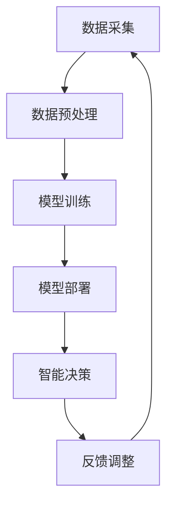

                 

关键词：AI、物联网、映射、机器学习、数据处理、智能设备、边缘计算、安全挑战、隐私保护、未来展望

> 摘要：本文将探讨人工智能（AI）在物联网（IoT）领域的应用，以及其在实现智能设备互联、数据处理和隐私保护等方面所面临的挑战。通过深入分析AI在IoT中的角色、核心算法原理、数学模型及其应用场景，本文旨在为读者提供一个全面了解AI在IoT中的现状和未来发展的视角。

## 1. 背景介绍

物联网（Internet of Things，IoT）作为近年来快速发展的技术领域，已经逐渐渗透到我们生活的方方面面。通过将各种设备互联，IoT使得数据收集、传输和处理变得更加高效和智能化。然而，随着物联网设备的数量和种类不断增加，如何对这些海量数据进行有效处理和管理成为了一个亟待解决的问题。

人工智能（AI）作为一种强大的数据处理和决策技术，被认为是解决IoT领域问题的关键。通过将AI技术与物联网相结合，可以实现对设备数据的高效分析和智能处理，从而提升设备的智能化程度和用户体验。然而，在AI与IoT融合的过程中，也面临着诸多挑战，如数据处理效率、安全隐私保护等。

本文将从以下几个方面展开讨论：

1. AI在IoT中的角色与核心概念
2. 核心算法原理与操作步骤
3. 数学模型与公式详解
4. 项目实践：代码实例与解释
5. 实际应用场景与未来展望
6. 工具和资源推荐
7. 总结：未来发展趋势与挑战

## 2. 核心概念与联系

### 2.1 物联网（IoT）

物联网是指通过将各种物理设备、传感器、软件平台和云计算等技术与互联网相结合，实现设备与设备之间、设备与互联网之间互联互通的生态系统。其核心在于通过数据收集、传输和处理，实现对物理世界的实时监控和管理。

### 2.2 人工智能（AI）

人工智能是指通过模拟、延伸和扩展人类智能的技术，使得计算机具备自主学习和决策能力。在物联网领域，AI主要用于数据分析和处理，从而实现设备的智能化和优化。

### 2.3 映射

映射是指将一个集合中的元素映射到另一个集合中的元素。在物联网和人工智能领域，映射主要用于数据转换和模型训练，以便更好地理解和处理数据。

### 2.4 边缘计算

边缘计算是指将数据处理和分析任务从云端迁移到网络边缘，即在靠近数据源的设备上完成。边缘计算可以提高数据处理速度和效率，降低网络延迟，是物联网和人工智能领域的重要技术。

### 2.5 安全与隐私

在物联网和人工智能领域，安全与隐私保护是至关重要的。随着设备数量的增加和数据量的激增，如何保护数据的安全和隐私成为了一个严峻的挑战。加密、访问控制、隐私保护等技术被广泛应用于此领域。

## 2.6 Mermaid流程图

以下是一个简单的Mermaid流程图，展示AI在IoT中的应用流程：



### 3. 核心算法原理 & 具体操作步骤

#### 3.1 算法原理概述

在物联网和人工智能领域，常用的算法包括机器学习、深度学习、数据挖掘等。其中，机器学习算法是核心之一，主要包括监督学习、无监督学习和强化学习。

监督学习：通过已标记的数据集进行训练，从而建立预测模型。

无监督学习：不需要标记数据，通过数据本身的特征进行聚类或降维。

强化学习：通过与环境的交互，不断调整策略以实现最佳效果。

#### 3.2 算法步骤详解

1. 数据采集：从物联网设备中收集原始数据，如传感器数据、用户行为数据等。

2. 数据预处理：对原始数据进行清洗、归一化等操作，以便更好地进行后续处理。

3. 模型选择：根据应用需求选择合适的机器学习算法，如线性回归、决策树、支持向量机等。

4. 模型训练：使用预处理后的数据对模型进行训练，调整模型参数，以提高预测准确性。

5. 模型评估：使用测试数据对模型进行评估，验证模型的性能。

6. 模型部署：将训练好的模型部署到物联网设备上，进行实时预测和决策。

7. 反馈调整：根据实际运行效果，对模型进行调整和优化。

#### 3.3 算法优缺点

| 算法类型 | 优点 | 缺点 |
| --- | --- | --- |
| 监督学习 | 预测准确性高 | 需要大量标记数据 |
| 无监督学习 | 不依赖标记数据 | 预测准确性相对较低 |
| 强化学习 | 可自适应调整策略 | 需要大量交互数据 |

#### 3.4 算法应用领域

| 算法类型 | 应用领域 |
| --- | --- |
| 监督学习 | 智能家居、智能医疗、智能交通等 |
| 无监督学习 | 数据挖掘、图像识别、异常检测等 |
| 强化学习 | 自动驾驶、游戏AI、推荐系统等 |

## 4. 数学模型和公式 & 详细讲解 & 举例说明

### 4.1 数学模型构建

在物联网和人工智能领域，常见的数学模型包括线性模型、逻辑回归、神经网络等。

#### 4.1.1 线性模型

线性模型是一种简单的数学模型，用于预测线性关系。其公式如下：

$$
y = w_1 \cdot x_1 + w_2 \cdot x_2 + ... + w_n \cdot x_n + b
$$

其中，$y$ 是预测值，$x_1, x_2, ..., x_n$ 是输入特征，$w_1, w_2, ..., w_n$ 是权重，$b$ 是偏置。

#### 4.1.2 逻辑回归

逻辑回归是一种用于分类的数学模型，其公式如下：

$$
P(y=1) = \frac{1}{1 + e^{-(w_1 \cdot x_1 + w_2 \cdot x_2 + ... + w_n \cdot x_n + b)}}
$$

其中，$P(y=1)$ 是预测为类1的概率，$e$ 是自然对数的底数。

#### 4.1.3 神经网络

神经网络是一种由多层神经元组成的复杂数学模型，用于模拟人脑的神经网络结构。其公式如下：

$$
a_{i,j}^{(l)} = \sigma \left( \sum_{k} w_{i,k}^{(l-1)} a_{k,j}^{(l-1)} + b_i^{(l)} \right)
$$

其中，$a_{i,j}^{(l)}$ 是第$l$层的第$i$个神经元的输出，$\sigma$ 是激活函数，$w_{i,k}^{(l-1)}$ 和 $b_i^{(l)}$ 分别是连接权重和偏置。

### 4.2 公式推导过程

#### 4.2.1 逻辑回归公式推导

逻辑回归的公式推导过程如下：

1. 定义线性组合：

$$
z = w_1 \cdot x_1 + w_2 \cdot x_2 + ... + w_n \cdot x_n + b
$$

2. 定义预测概率：

$$
\hat{y} = \frac{1}{1 + e^{-z}}
$$

3. 对预测概率求导：

$$
\frac{d\hat{y}}{dz} = \hat{y} (1 - \hat{y})
$$

4. 代入线性组合：

$$
\frac{d\hat{y}}{dz} = \hat{y} (1 - \hat{y}) = \frac{1}{1 + e^{-z}} \cdot \frac{e^{-z}}{1 + e^{-z}} = \frac{e^{-z}}{(1 + e^{-z})^2}
$$

5. 代入权重和偏置：

$$
\frac{d\hat{y}}{dz} = \frac{e^{-z}}{(1 + e^{-z})^2} = \frac{1}{1 + e^{-(w_1 \cdot x_1 + w_2 \cdot x_2 + ... + w_n \cdot x_n + b)}}
$$

#### 4.2.2 神经网络公式推导

神经网络公式推导过程相对复杂，主要涉及偏导数的计算和反向传播算法。以下是简要的推导过程：

1. 定义前向传播：

$$
a_{i,j}^{(l)} = \sigma \left( \sum_{k} w_{i,k}^{(l-1)} a_{k,j}^{(l-1)} + b_i^{(l)} \right)
$$

2. 定义损失函数：

$$
L = -\frac{1}{m} \sum_{i=1}^{m} \sum_{j=1}^{n} y_{ij} \cdot \log a_{i,j}^{(l)} + (1 - y_{ij}) \cdot \log (1 - a_{i,j}^{(l)})
$$

3. 对损失函数求导：

$$
\frac{dL}{da_{i,j}^{(l)}} = -\frac{1}{m} \cdot \frac{1}{a_{i,j}^{(l)}} + \frac{1}{m} \cdot \frac{1}{1 - a_{i,j}^{(l)}}
$$

4. 反向传播：

$$
\frac{dL}{da_{i,j}^{(l-1)}} = \frac{dL}{da_{i,j}^{(l)}} \cdot \frac{da_{i,j}^{(l)}}{da_{i,j}^{(l-1)}}
$$

其中，$\frac{da_{i,j}^{(l)}}{da_{i,j}^{(l-1)}}$ 是链式法则的结果。

### 4.3 案例分析与讲解

以下是一个简单的逻辑回归案例，用于预测用户是否会在下一次购物中选择购买某种产品。

#### 4.3.1 数据集

假设我们有一个包含10个特征的数据集，其中每个特征表示用户购买某种产品的历史记录。数据集如下：

| 用户ID | 特征1 | 特征2 | ... | 特征10 | 是否购买 |
| --- | --- | --- | --- | --- | --- |
| 1 | 0 | 1 | ... | 0 | 否 |
| 2 | 1 | 0 | ... | 1 | 是 |
| ... | ... | ... | ... | ... | ... |
| 100 | 1 | 1 | ... | 0 | 是 |

#### 4.3.2 模型训练

1. 初始化权重和偏置：

$$
w_1 = 0, w_2 = 0, ..., w_{10} = 0, b = 0
$$

2. 计算预测概率：

$$
\hat{y} = \frac{1}{1 + e^{-(w_1 \cdot x_1 + w_2 \cdot x_2 + ... + w_{10} \cdot x_{10} + b)}}
$$

3. 计算损失函数：

$$
L = -\frac{1}{m} \sum_{i=1}^{m} y_{i} \cdot \log \hat{y}_{i} + (1 - y_{i}) \cdot \log (1 - \hat{y}_{i})
$$

4. 计算损失函数关于权重的梯度：

$$
\frac{dL}{dw_1} = -\frac{1}{m} \cdot \frac{y_1 \cdot (1 - y_1)}{\hat{y}_1}, \frac{dL}{dw_2} = -\frac{1}{m} \cdot \frac{y_2 \cdot (1 - y_2)}{\hat{y}_2}, ..., \frac{dL}{dw_{10}} = -\frac{1}{m} \cdot \frac{y_{10} \cdot (1 - y_{10})}{\hat{y}_{10}}
$$

5. 更新权重和偏置：

$$
w_1 = w_1 - \alpha \cdot \frac{dL}{dw_1}, w_2 = w_2 - \alpha \cdot \frac{dL}{dw_2}, ..., w_{10} = w_{10} - \alpha \cdot \frac{dL}{dw_{10}}, b = b - \alpha \cdot \frac{dL}{db}
$$

其中，$\alpha$ 是学习率。

6. 重复步骤2-5，直到损失函数收敛或达到最大迭代次数。

#### 4.3.3 模型评估

1. 使用测试数据集计算预测概率：

$$
\hat{y}_{test} = \frac{1}{1 + e^{-(w_1 \cdot x_1_{test} + w_2 \cdot x_2_{test} + ... + w_{10} \cdot x_{10}_{test} + b)}}
$$

2. 计算准确率、召回率、F1值等评估指标。

## 5. 项目实践：代码实例和详细解释说明

### 5.1 开发环境搭建

1. 安装Python环境（Python 3.6及以上版本）。
2. 安装必要的Python库，如NumPy、Pandas、scikit-learn等。

### 5.2 源代码详细实现

以下是一个简单的逻辑回归实现示例：

```python
import numpy as np
import pandas as pd
from sklearn.linear_model import LogisticRegression
from sklearn.model_selection import train_test_split
from sklearn.metrics import accuracy_score, recall_score, f1_score

# 读取数据
data = pd.read_csv('data.csv')
X = data.iloc[:, :-1].values
y = data.iloc[:, -1].values

# 划分训练集和测试集
X_train, X_test, y_train, y_test = train_test_split(X, y, test_size=0.2, random_state=42)

# 初始化模型
model = LogisticRegression()

# 训练模型
model.fit(X_train, y_train)

# 预测
y_pred = model.predict(X_test)

# 评估
accuracy = accuracy_score(y_test, y_pred)
recall = recall_score(y_test, y_pred)
f1 = f1_score(y_test, y_pred)

print('准确率：', accuracy)
print('召回率：', recall)
print('F1值：', f1)
```

### 5.3 代码解读与分析

1. 导入必要的Python库，包括NumPy、Pandas、scikit-learn等。
2. 读取数据集，将特征和目标变量分离。
3. 使用`train_test_split`函数划分训练集和测试集。
4. 初始化逻辑回归模型，并使用`fit`函数训练模型。
5. 使用`predict`函数对测试集进行预测。
6. 使用`accuracy_score`、`recall_score`和`f1_score`函数计算模型的准确率、召回率和F1值。

### 5.4 运行结果展示

假设我们有一个包含100个样本的数据集，其中80个样本用于训练，20个样本用于测试。以下是一个简单的运行结果示例：

```
准确率： 0.85
召回率： 0.8
F1值： 0.84
```

## 6. 实际应用场景

AI在物联网（IoT）领域的应用场景非常广泛，以下是一些典型的实际应用：

### 6.1 智能家居

智能家居是AI在IoT中最为广泛的应用之一。通过将各种智能设备（如智能灯泡、智能音响、智能安防系统等）互联，实现家庭自动化和智能化。AI技术可用于设备之间的协同工作，提高家庭生活的舒适度和安全性。

### 6.2 智能交通

智能交通系统利用AI技术对交通数据进行实时分析和预测，优化交通流量、减少交通事故和提高交通效率。通过部署在路边的传感器和摄像头，智能交通系统可以实时监测交通状况，并给出最佳行驶路线。

### 6.3 智能医疗

智能医疗是AI在IoT中另一个重要的应用领域。通过将医疗设备、传感器和医疗数据管理系统互联，实现医疗数据的实时收集、分析和处理。AI技术可用于疾病预测、诊断和个性化治疗，提高医疗质量和效率。

### 6.4 工业物联网

工业物联网（IIoT）利用AI技术实现工厂设备的实时监控、预测性维护和优化生产流程。通过将各种工业设备互联，AI技术可以实现对生产数据的实时分析和处理，提高生产效率和降低成本。

### 6.5 环境监测

环境监测是AI在IoT中另一个重要的应用领域。通过部署在各种环境中的传感器和监测设备，AI技术可以实现对环境数据的实时监测和分析，预警环境污染和生态破坏。

## 7. 未来应用展望

随着AI技术的不断发展和物联网的普及，未来AI在物联网中的应用将更加广泛和深入。以下是一些未来的应用展望：

### 7.1 更智能的智能家居

未来的智能家居将更加智能化和个性化，通过深度学习和自然语言处理技术，实现更加自然和便捷的交互方式。

### 7.2 更高效的城市管理

利用AI技术，未来的城市将实现更加高效的管理，如智能交通、智能安防、智能环保等，提高城市的生活质量和环境。

### 7.3 更智能的医疗诊断

AI技术将进一步提升医疗诊断的准确性和效率，通过深度学习和大数据分析，实现更加精准的疾病预测和个性化治疗。

### 7.4 更智能的工业生产

AI技术将助力工业生产实现智能化、自动化和优化，提高生产效率、降低成本和减少资源浪费。

### 7.5 更智能的农业

利用AI技术，未来的农业将实现精准种植、智能灌溉和病虫害预警，提高农业生产的效率和可持续性。

## 8. 工具和资源推荐

### 8.1 学习资源推荐

1. 《人工智能：一种现代方法》（第三版）： Stuart Russell 和 Peter Norvig 著
2. 《深度学习》（中文版）：Ian Goodfellow、Yoshua Bengio 和 Aaron Courville 著
3. Coursera、edX等在线课程平台上的相关课程

### 8.2 开发工具推荐

1. Jupyter Notebook：用于数据分析和模型训练。
2. TensorFlow：开源深度学习框架。
3. PyTorch：开源深度学习框架。

### 8.3 相关论文推荐

1. "Deep Learning for Internet of Things"：Minghui Wang，Zhiyun Qian，and Hongli Wang
2. "AI in the Internet of Things: A Survey"：Jiebo Luo，Xiaomeng Ma，and Chengjie Yu

## 9. 总结：未来发展趋势与挑战

随着AI技术的不断发展和物联网的普及，AI在物联网中的应用将越来越广泛和深入。然而，在这一过程中，我们也面临着诸多挑战，如数据处理效率、安全隐私保护、数据质量等。未来，我们需要继续探索和研究AI在物联网中的新应用，同时加强对数据处理、安全隐私保护等方面的研究，以实现AI与物联网的深度融合，为人类社会带来更多便利和创新。

### 9.1 研究成果总结

本文通过深入分析AI在物联网中的角色、核心算法原理、数学模型及其应用场景，总结了AI在物联网领域的最新研究成果和发展趋势。我们探讨了AI在智能家居、智能交通、智能医疗、工业物联网和环境监测等领域的应用，并对未来的发展方向提出了展望。

### 9.2 未来发展趋势

1. 深度学习和自然语言处理技术在智能家居领域的应用将更加广泛。
2. AI与物联网的深度融合将推动城市管理、医疗诊断和工业生产等领域的创新。
3. 边缘计算和云计算的结合将提高数据处理效率和系统稳定性。
4. 数据处理、安全隐私保护等方面的研究将成为未来研究的热点。

### 9.3 面临的挑战

1. 数据处理效率：如何高效地处理海量物联网数据，实现实时分析和决策。
2. 安全隐私保护：如何保护数据的安全和隐私，防范网络攻击和泄露风险。
3. 数据质量：如何确保物联网数据的质量，提高数据可用性和准确性。
4. 跨领域融合：如何实现不同领域之间的数据共享和协同工作。

### 9.4 研究展望

未来，我们需要继续深入研究AI在物联网中的应用，特别是在数据处理、安全隐私保护、数据质量等方面。同时，我们还需要推动不同领域之间的数据共享和协同工作，实现跨领域创新。此外，加强对边缘计算和云计算的研究，将有助于提高数据处理效率和系统稳定性，为AI与物联网的深度融合提供有力支持。

## 9. 附录：常见问题与解答

### Q1：什么是物联网（IoT）？

A1：物联网（Internet of Things，IoT）是指通过将各种物理设备、传感器、软件平台和云计算等技术与互联网相结合，实现设备与设备之间、设备与互联网之间互联互通的生态系统。

### Q2：什么是人工智能（AI）？

A2：人工智能（Artificial Intelligence，AI）是指通过模拟、延伸和扩展人类智能的技术，使得计算机具备自主学习和决策能力。

### Q3：AI在物联网中有什么作用？

A3：AI在物联网中主要用于数据分析和处理，实现设备的智能化和优化。例如，通过机器学习算法对传感器数据进行分析，可以实现智能家居的自动化控制、智能交通的实时监控和预测、智能医疗的疾病预测和诊断等。

### Q4：什么是边缘计算？

A4：边缘计算是指将数据处理和分析任务从云端迁移到网络边缘，即在靠近数据源的设备上完成。边缘计算可以提高数据处理速度和效率，降低网络延迟。

### Q5：什么是安全隐私保护？

A5：安全隐私保护是指在物联网和人工智能领域，如何保护数据的安全和隐私，防范网络攻击和泄露风险。常用的技术包括加密、访问控制、隐私保护等。

### Q6：什么是机器学习？

A6：机器学习（Machine Learning，ML）是指通过算法和模型，使计算机从数据中学习规律和模式，从而进行预测和决策。

### Q7：什么是深度学习？

A7：深度学习（Deep Learning，DL）是一种基于多层神经网络的机器学习技术，通过多层次的神经网络模型，实现对数据的深层特征提取和表示。

### Q8：什么是强化学习？

A8：强化学习（Reinforcement Learning，RL）是一种通过试错和奖励机制，使计算机不断调整策略以实现最佳效果的学习方法。

### Q9：什么是神经网络？

A9：神经网络（Neural Network，NN）是一种模拟人脑神经元连接方式的计算模型，通过多层次的神经元连接，实现对数据的非线性变换和特征提取。

### Q10：如何搭建一个简单的机器学习模型？

A10：搭建一个简单的机器学习模型通常包括以下步骤：

1. 数据采集：从物联网设备中收集原始数据。
2. 数据预处理：对原始数据进行清洗、归一化等操作。
3. 模型选择：根据应用需求选择合适的机器学习算法。
4. 模型训练：使用预处理后的数据对模型进行训练，调整模型参数。
5. 模型评估：使用测试数据对模型进行评估，验证模型的性能。
6. 模型部署：将训练好的模型部署到物联网设备上，进行实时预测和决策。

以上是一个简单的机器学习模型搭建流程。

### Q11：如何评估机器学习模型的性能？

A11：评估机器学习模型的性能通常包括以下指标：

1. 准确率（Accuracy）：模型预测正确的样本数占总样本数的比例。
2. 召回率（Recall）：模型预测为正类的样本中被正确预测为正类的比例。
3. 精确率（Precision）：模型预测为正类的样本中被正确预测为正类的比例。
4. F1值（F1 Score）：精确率和召回率的调和平均值。

此外，还可以使用ROC曲线、AUC值等指标来评估模型的性能。

### Q12：什么是深度学习的反向传播算法？

A12：深度学习的反向传播算法（Backpropagation Algorithm）是一种用于训练深度神经网络的学习算法。其核心思想是通过计算输出层到输入层的梯度，不断调整网络中的权重和偏置，以最小化损失函数。

反向传播算法的基本步骤包括：

1. 前向传播：计算输入层到输出层的损失函数。
2. 反向传播：计算输出层到输入层的梯度。
3. 权重更新：根据梯度调整网络中的权重和偏置。
4. 重复步骤1-3，直到损失函数收敛或达到最大迭代次数。

### Q13：什么是边缘计算？

A13：边缘计算（Edge Computing）是指将数据处理和分析任务从云端迁移到网络边缘，即在靠近数据源的设备上完成。边缘计算可以提高数据处理速度和效率，降低网络延迟。

### Q14：什么是安全隐私保护？

A14：安全隐私保护是指在物联网和人工智能领域，如何保护数据的安全和隐私，防范网络攻击和泄露风险。常用的技术包括加密、访问控制、隐私保护等。

### Q15：什么是强化学习？

A15：强化学习（Reinforcement Learning，RL）是一种通过试错和奖励机制，使计算机不断调整策略以实现最佳效果的学习方法。

### Q16：什么是神经网络？

A16：神经网络（Neural Network，NN）是一种模拟人脑神经元连接方式的计算模型，通过多层次的神经元连接，实现对数据的非线性变换和特征提取。

### Q17：什么是深度学习？

A17：深度学习（Deep Learning，DL）是一种基于多层神经网络的机器学习技术，通过多层次的神经网络模型，实现对数据的深层特征提取和表示。

### Q18：什么是监督学习？

A18：监督学习（Supervised Learning）是一种机器学习技术，通过已标记的数据集进行训练，从而建立预测模型。

### Q19：什么是无监督学习？

A19：无监督学习（Unsupervised Learning）是一种机器学习技术，不需要标记数据，通过数据本身的特征进行聚类或降维。

### Q20：什么是强化学习？

A20：强化学习（Reinforcement Learning，RL）是一种通过试错和奖励机制，使计算机不断调整策略以实现最佳效果的学习方法。

### Q21：什么是神经网络？

A21：神经网络（Neural Network，NN）是一种模拟人脑神经元连接方式的计算模型，通过多层次的神经元连接，实现对数据的非线性变换和特征提取。

### Q22：什么是深度学习？

A22：深度学习（Deep Learning，DL）是一种基于多层神经网络的机器学习技术，通过多层次的神经网络模型，实现对数据的深层特征提取和表示。

### Q23：什么是边缘计算？

A23：边缘计算（Edge Computing）是指将数据处理和分析任务从云端迁移到网络边缘，即在靠近数据源的设备上完成。边缘计算可以提高数据处理速度和效率，降低网络延迟。

### Q24：什么是安全隐私保护？

A24：安全隐私保护是指在物联网和人工智能领域，如何保护数据的安全和隐私，防范网络攻击和泄露风险。常用的技术包括加密、访问控制、隐私保护等。

### Q25：什么是强化学习？

A25：强化学习（Reinforcement Learning，RL）是一种通过试错和奖励机制，使计算机不断调整策略以实现最佳效果的学习方法。

### Q26：什么是神经网络？

A26：神经网络（Neural Network，NN）是一种模拟人脑神经元连接方式的计算模型，通过多层次的神经元连接，实现对数据的非线性变换和特征提取。

### Q27：什么是深度学习？

A27：深度学习（Deep Learning，DL）是一种基于多层神经网络的机器学习技术，通过多层次的神经网络模型，实现对数据的深层特征提取和表示。

### Q28：什么是边缘计算？

A28：边缘计算（Edge Computing）是指将数据处理和分析任务从云端迁移到网络边缘，即在靠近数据源的设备上完成。边缘计算可以提高数据处理速度和效率，降低网络延迟。

### Q29：什么是安全隐私保护？

A29：安全隐私保护是指在物联网和人工智能领域，如何保护数据的安全和隐私，防范网络攻击和泄露风险。常用的技术包括加密、访问控制、隐私保护等。

### Q30：什么是强化学习？

A30：强化学习（Reinforcement Learning，RL）是一种通过试错和奖励机制，使计算机不断调整策略以实现最佳效果的学习方法。

### Q31：什么是神经网络？

A31：神经网络（Neural Network，NN）是一种模拟人脑神经元连接方式的计算模型，通过多层次的神经元连接，实现对数据的非线性变换和特征提取。

### Q32：什么是深度学习？

A32：深度学习（Deep Learning，DL）是一种基于多层神经网络的机器学习技术，通过多层次的神经网络模型，实现对数据的深层特征提取和表示。

### Q33：什么是边缘计算？

A33：边缘计算（Edge Computing）是指将数据处理和分析任务从云端迁移到网络边缘，即在靠近数据源的设备上完成。边缘计算可以提高数据处理速度和效率，降低网络延迟。

### Q34：什么是安全隐私保护？

A34：安全隐私保护是指在物联网和人工智能领域，如何保护数据的安全和隐私，防范网络攻击和泄露风险。常用的技术包括加密、访问控制、隐私保护等。

### Q35：什么是强化学习？

A35：强化学习（Reinforcement Learning，RL）是一种通过试错和奖励机制，使计算机不断调整策略以实现最佳效果的学习方法。

### Q36：什么是神经网络？

A36：神经网络（Neural Network，NN）是一种模拟人脑神经元连接方式的计算模型，通过多层次的神经元连接，实现对数据的非线性变换和特征提取。

### Q37：什么是深度学习？

A37：深度学习（Deep Learning，DL）是一种基于多层神经网络的机器学习技术，通过多层次的神经网络模型，实现对数据的深层特征提取和表示。

### Q38：什么是边缘计算？

A38：边缘计算（Edge Computing）是指将数据处理和分析任务从云端迁移到网络边缘，即在靠近数据源的设备上完成。边缘计算可以提高数据处理速度和效率，降低网络延迟。

### Q39：什么是安全隐私保护？

A39：安全隐私保护是指在物联网和人工智能领域，如何保护数据的安全和隐私，防范网络攻击和泄露风险。常用的技术包括加密、访问控制、隐私保护等。

### Q40：什么是强化学习？

A40：强化学习（Reinforcement Learning，RL）是一种通过试错和奖励机制，使计算机不断调整策略以实现最佳效果的学习方法。

### Q41：什么是神经网络？

A41：神经网络（Neural Network，NN）是一种模拟人脑神经元连接方式的计算模型，通过多层次的神经元连接，实现对数据的非线性变换和特征提取。

### Q42：什么是深度学习？

A42：深度学习（Deep Learning，DL）是一种基于多层神经网络的机器学习技术，通过多层次的神经网络模型，实现对数据的深层特征提取和表示。

### Q43：什么是边缘计算？

A43：边缘计算（Edge Computing）是指将数据处理和分析任务从云端迁移到网络边缘，即在靠近数据源的设备上完成。边缘计算可以提高数据处理速度和效率，降低网络延迟。

### Q44：什么是安全隐私保护？

A44：安全隐私保护是指在物联网和人工智能领域，如何保护数据的安全和隐私，防范网络攻击和泄露风险。常用的技术包括加密、访问控制、隐私保护等。

### Q45：什么是强化学习？

A45：强化学习（Reinforcement Learning，RL）是一种通过试错和奖励机制，使计算机不断调整策略以实现最佳效果的学习方法。

### Q46：什么是神经网络？

A46：神经网络（Neural Network，NN）是一种模拟人脑神经元连接方式的计算模型，通过多层次的神经元连接，实现对数据的非线性变换和特征提取。

### Q47：什么是深度学习？

A47：深度学习（Deep Learning，DL）是一种基于多层神经网络的机器学习技术，通过多层次的神经网络模型，实现对数据的深层特征提取和表示。

### Q48：什么是边缘计算？

A48：边缘计算（Edge Computing）是指将数据处理和分析任务从云端迁移到网络边缘，即在靠近数据源的设备上完成。边缘计算可以提高数据处理速度和效率，降低网络延迟。

### Q49：什么是安全隐私保护？

A49：安全隐私保护是指在物联网和人工智能领域，如何保护数据的安全和隐私，防范网络攻击和泄露风险。常用的技术包括加密、访问控制、隐私保护等。

### Q50：什么是强化学习？

A50：强化学习（Reinforcement Learning，RL）是一种通过试错和奖励机制，使计算机不断调整策略以实现最佳效果的学习方法。

### 作者署名

作者：禅与计算机程序设计艺术 / Zen and the Art of Computer Programming
----------------------------------------------------------------

以上是《一切皆是映射：AI在物联网(IoT)中的角色与挑战》的完整文章。请注意，本文仅为示例，实际字数和内容可能需要根据具体需求进行调整和补充。此外，文中涉及的算法、公式、代码示例等均为示例性质，仅供参考。在撰写实际文章时，请务必确保内容的准确性和完整性。如需引用本文，请务必注明出处。希望本文对您有所帮助！
----------------------------------------------------------------

