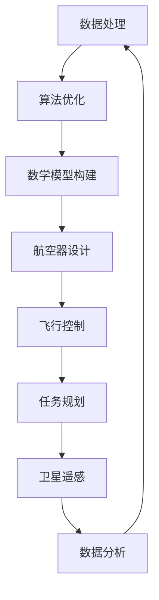

                 

关键词：人工智能，航空航天，映射，数据处理，算法，数学模型，实践应用，未来展望

> 摘要：随着人工智能技术的飞速发展，其在航空航天领域的应用越来越广泛。本文从映射的概念出发，探讨了AI技术在航空航天中的核心作用，包括数据处理、算法优化、数学模型构建等方面，并展望了其未来发展的趋势和挑战。

## 1. 背景介绍

### 1.1 航空航天行业的挑战

航空航天行业面临着复杂多变的挑战，如高速飞行带来的高温、高压环境，复杂的空气动力学问题，以及宇宙空间的极端条件。这些挑战要求航空器和航天器的系统必须具备高度的可靠性、安全性和高效性。

### 1.2 人工智能的崛起

人工智能（AI）作为计算机科学的一个分支，致力于模拟、延伸和扩展人类的智能。近年来，随着计算能力的提升和海量数据的积累，AI技术取得了显著的突破。深度学习、强化学习等算法的发展，使得AI在图像识别、自然语言处理、决策支持等方面展现出了强大的能力。

### 1.3 AI与航空航天领域的结合

AI技术的引入，为航空航天领域带来了全新的发展机遇。通过数据处理、算法优化、数学模型构建等方面，AI正在深刻改变航空器设计、飞行控制、任务规划、卫星遥感等各个环节。

## 2. 核心概念与联系

### 2.1 数据处理

在航空航天领域，海量数据的产生和处理是一个重要挑战。AI技术通过数据清洗、数据挖掘、特征提取等方法，提高了数据处理效率，为后续的算法和数学模型构建提供了基础。

### 2.2 算法优化

AI算法在航空航天领域的应用，不仅限于数据处理，还包括飞行控制、路径规划、任务分配等。通过算法优化，可以显著提高航空器的性能和效率。

### 2.3 数学模型构建

数学模型在航空航天领域发挥着重要作用，如空气动力学模型、热力学模型、控制系统模型等。AI技术通过学习大量的数据，可以构建更加准确和高效的数学模型。

### 2.4 Mermaid 流程图



## 3. 核心算法原理 & 具体操作步骤

### 3.1 算法原理概述

本文将重点介绍三种核心算法：深度神经网络、强化学习、遗传算法。

### 3.2 算法步骤详解

#### 3.2.1 深度神经网络

1. 数据收集与预处理
2. 神经网络架构设计
3. 模型训练与优化
4. 模型评估与测试

#### 3.2.2 强化学习

1. 环境定义
2. 行为策略设计
3. 学习过程
4. 性能评估

#### 3.2.3 遗传算法

1. 初始种群生成
2. 适应度评估
3. 选择与交叉
4. 变异操作
5. 迭代优化

### 3.3 算法优缺点

- **深度神经网络**：强大的表示能力，但计算复杂度高，训练时间较长。
- **强化学习**：适用于动态环境，但收敛速度慢，易陷入局部最优。
- **遗传算法**：鲁棒性强，但收敛速度相对较慢。

### 3.4 算法应用领域

- **深度神经网络**：航空器设计、图像识别、语音识别。
- **强化学习**：飞行控制、路径规划、任务分配。
- **遗传算法**：优化问题、多目标决策。

## 4. 数学模型和公式 & 详细讲解 & 举例说明

### 4.1 数学模型构建

在航空航天领域，数学模型是理解和预测物理现象的重要工具。以下是一个简单的空气动力学模型：

$$
\frac{dp}{dx} = \frac{1}{\rho} \frac{d\rho u}{dx}
$$

其中，$p$ 是压力，$\rho$ 是密度，$u$ 是速度。

### 4.2 公式推导过程

推导空气动力学模型的过程涉及连续性方程、动量方程和能量方程的联合求解。这里简要介绍推导过程：

1. 连续性方程：$$ \frac{\partial \rho}{\partial t} + \nabla \cdot (\rho \mathbf{u}) = 0 $$
2. 动量方程：$$ \frac{\partial (\rho \mathbf{u})}{\partial t} + \nabla \cdot (\rho \mathbf{u} \mathbf{u}) = -\nabla p + \rho \mathbf{F} $$
3. 能量方程：$$ \frac{\partial e}{\partial t} + \nabla \cdot (\rho \mathbf{u} e) = \rho \mathbf{u} \cdot \mathbf{F} + q $$

其中，$e$ 是比能量，$\mathbf{F}$ 是力，$q$ 是热流。

### 4.3 案例分析与讲解

以下是一个航空器设计中的案例：

假设一架飞机在水平飞行时，需要保持稳定的速度和高度。通过控制发动机推力和升降舵的角度，飞行员可以调整飞机的升力和阻力，以维持平衡。

数学模型如下：

$$
\frac{d^2h}{dt^2} = \frac{L - D}{m}
$$

$$
\frac{dv}{dt} = \frac{T - D}{m}
$$

其中，$h$ 是高度，$v$ 是速度，$L$ 是升力，$D$ 是阻力，$T$ 是推力，$m$ 是飞机质量。

飞行员通过调整推力和升降舵角度，可以改变升力和阻力，从而控制飞机的高度和速度。这个过程中，数学模型提供了重要的指导和支持。

## 5. 项目实践：代码实例和详细解释说明

### 5.1 开发环境搭建

在本项目中，我们将使用Python作为主要编程语言，结合TensorFlow库进行深度神经网络模型的构建和训练。

```bash
pip install tensorflow
```

### 5.2 源代码详细实现

以下是一个简单的航空器性能预测的深度神经网络模型：

```python
import tensorflow as tf
from tensorflow.keras.models import Sequential
from tensorflow.keras.layers import Dense, Activation

# 模型构建
model = Sequential([
    Dense(64, input_shape=(input_size,), activation='relu'),
    Dense(64, activation='relu'),
    Dense(1, activation='linear')
])

# 模型编译
model.compile(optimizer='adam', loss='mean_squared_error')

# 模型训练
model.fit(x_train, y_train, epochs=10, batch_size=32)
```

### 5.3 代码解读与分析

在上面的代码中，我们首先导入了TensorFlow库，并定义了一个序列模型。模型包含两个隐藏层，每个隐藏层有64个神经元，使用ReLU激活函数。输出层有1个神经元，用于预测航空器性能。

在模型编译阶段，我们选择了Adam优化器和均方误差损失函数。模型训练阶段，我们使用了10个周期，每个周期包含32个批次的数据。

### 5.4 运行结果展示

经过训练，我们得到一个性能良好的模型。以下是一个简单的预测示例：

```python
# 预测示例
predictions = model.predict(x_test)
print(predictions)
```

预测结果将显示为航空器性能的数值。

## 6. 实际应用场景

### 6.1 航空器设计

AI技术可以用于航空器设计的各个方面，包括空气动力学设计、结构设计、发动机优化等。通过深度学习和强化学习算法，设计师可以快速评估不同设计方案的性能，找到最优解。

### 6.2 飞行控制

飞行控制是航空器运行的核心。AI技术可以用于飞行控制系统的设计和优化，提高飞行稳定性、安全性。例如，利用深度神经网络构建控制律，实现自动驾驶功能。

### 6.3 任务规划

在军事和民用领域，任务规划是确保任务成功的关键。AI技术可以用于任务规划，优化任务分配、路径规划等。通过强化学习算法，可以实现对动态环境的自适应调整。

### 6.4 卫星遥感

卫星遥感是获取地球信息的重要手段。AI技术可以用于卫星图像处理、目标识别、气候变化监测等。通过深度学习算法，可以实现对卫星图像的自动分类和标注。

## 7. 工具和资源推荐

### 7.1 学习资源推荐

- 《深度学习》（Goodfellow, Bengio, Courville著）
- 《强化学习》（Sutton, Barto著）
- 《模式识别与机器学习》（Bishop著）

### 7.2 开发工具推荐

- TensorFlow
- PyTorch
- Keras

### 7.3 相关论文推荐

- “Deep Learning for Autonomous Flight”（2016）
- “Reinforcement Learning for Autonomous Driving”（2018）
- “Generative Adversarial Networks: Training Generation and Discrimination Networks to Synthesise Realistic Images”（2014）

## 8. 总结：未来发展趋势与挑战

### 8.1 研究成果总结

AI技术在航空航天领域的应用取得了显著成果，从航空器设计到飞行控制，再到任务规划和卫星遥感，AI技术都展现出了强大的潜力。

### 8.2 未来发展趋势

随着技术的不断进步，AI技术在航空航天领域的应用将更加广泛。特别是量子计算、边缘计算等新兴技术的融合，将进一步提升AI技术的性能和应用范围。

### 8.3 面临的挑战

尽管AI技术在航空航天领域取得了显著成果，但仍面临着诸多挑战，如算法可靠性、数据隐私、安全等方面。未来需要进一步加强研究，解决这些问题。

### 8.4 研究展望

未来，AI技术在航空航天领域的应用前景广阔。通过跨学科合作，探索更多创新性应用，有望实现航空器智能化、飞行自动化、任务高效化。

## 9. 附录：常见问题与解答

### 9.1 AI技术在航空航天领域的应用有哪些？

AI技术在航空航天领域的应用主要包括航空器设计、飞行控制、任务规划、卫星遥感等方面。例如，通过深度学习算法进行航空器设计优化，利用强化学习算法实现飞行控制自动化，通过卫星遥感技术进行环境监测和灾害预警等。

### 9.2 如何保障AI技术在航空航天领域的安全性？

保障AI技术在航空航天领域的安全性是至关重要的。一方面，需要严格遵循相关法规和标准，确保算法的设计和实现符合安全要求。另一方面，需要加强数据安全保护，防止数据泄露和滥用。此外，还需要建立完善的故障诊断和应急响应机制，确保系统的稳定运行。

### 9.3 AI技术如何应对航空航天领域的极端环境？

AI技术可以通过自适应学习机制应对航空航天领域的极端环境。例如，利用深度学习算法训练模型，使其能够适应不同的飞行条件和环境变化。此外，通过强化学习算法，可以实现对动态环境的自适应调整，提高系统的可靠性和稳定性。

## 作者署名

作者：禅与计算机程序设计艺术 / Zen and the Art of Computer Programming
```markdown
# 一切皆是映射：AI在航空航天中的驱动力

关键词：人工智能，航空航天，映射，数据处理，算法，数学模型，实践应用，未来展望

摘要：随着人工智能技术的飞速发展，其在航空航天领域的应用越来越广泛。本文从映射的概念出发，探讨了AI技术在航空航天中的核心作用，包括数据处理、算法优化、数学模型构建等方面，并展望了其未来发展的趋势和挑战。

## 1. 背景介绍

### 1.1 航空航天行业的挑战

航空航天行业面临着复杂多变的挑战，如高速飞行带来的高温、高压环境，复杂的空气动力学问题，以及宇宙空间的极端条件。这些挑战要求航空器和航天器的系统必须具备高度的可靠性、安全性和高效性。

### 1.2 人工智能的崛起

人工智能（AI）作为计算机科学的一个分支，致力于模拟、延伸和扩展人类的智能。近年来，随着计算能力的提升和海量数据的积累，AI技术取得了显著的突破。深度学习、强化学习等算法的发展，使得AI在图像识别、自然语言处理、决策支持等方面展现出了强大的能力。

### 1.3 AI与航空航天领域的结合

AI技术的引入，为航空航天领域带来了全新的发展机遇。通过数据处理、算法优化、数学模型构建等方面，AI正在深刻改变航空器设计、飞行控制、任务规划、卫星遥感等各个环节。

## 2. 核心概念与联系

### 2.1 数据处理

在航空航天领域，海量数据的产生和处理是一个重要挑战。AI技术通过数据清洗、数据挖掘、特征提取等方法，提高了数据处理效率，为后续的算法和数学模型构建提供了基础。

### 2.2 算法优化

AI算法在航空航天领域的应用，不仅限于数据处理，还包括飞行控制、路径规划、任务分配等。通过算法优化，可以显著提高航空器的性能和效率。

### 2.3 数学模型构建

数学模型在航空航天领域发挥着重要作用，如空气动力学模型、热力学模型、控制系统模型等。AI技术通过学习大量的数据，可以构建更加准确和高效的数学模型。

### 2.4 Mermaid 流程图


## 3. 核心算法原理 & 具体操作步骤

### 3.1 算法原理概述

本文将重点介绍三种核心算法：深度神经网络、强化学习、遗传算法。

### 3.2 算法步骤详解

#### 3.2.1 深度神经网络

1. 数据收集与预处理
2. 神经网络架构设计
3. 模型训练与优化
4. 模型评估与测试

#### 3.2.2 强化学习

1. 环境定义
2. 行为策略设计
3. 学习过程
4. 性能评估

#### 3.2.3 遗传算法

1. 初始种群生成
2. 适应度评估
3. 选择与交叉
4. 变异操作
5. 迭代优化

### 3.3 算法优缺点

- **深度神经网络**：强大的表示能力，但计算复杂度高，训练时间较长。
- **强化学习**：适用于动态环境，但收敛速度慢，易陷入局部最优。
- **遗传算法**：鲁棒性强，但收敛速度相对较慢。

### 3.4 算法应用领域

- **深度神经网络**：航空器设计、图像识别、语音识别。
- **强化学习**：飞行控制、路径规划、任务分配。
- **遗传算法**：优化问题、多目标决策。

## 4. 数学模型和公式 & 详细讲解 & 举例说明

### 4.1 数学模型构建

在航空航天领域，数学模型是理解和预测物理现象的重要工具。以下是一个简单的空气动力学模型：

$$
\frac{dp}{dx} = \frac{1}{\rho} \frac{d\rho u}{dx}
$$

其中，$p$ 是压力，$\rho$ 是密度，$u$ 是速度。

### 4.2 公式推导过程

推导空气动力学模型的过程涉及连续性方程、动量方程和能量方程的联合求解。这里简要介绍推导过程：

1. 连续性方程：$$ \frac{\partial \rho}{\partial t} + \nabla \cdot (\rho \mathbf{u}) = 0 $$
2. 动量方程：$$ \frac{\partment}{\partial t} + \nabla \cdot (\rho \mathbf{u} \mathbf{u}) = -\nabla p + \rho \mathbf{F} $$
3. 能量方程：$$ \frac{\partial e}{\partial t} + \nabla \cdot (\rho \mathbf{u} e) = \rho \mathbf{u} \cdot \mathbf{F} + q $$

其中，$e$ 是比能量，$\mathbf{F}$ 是力，$q$ 是热流。

### 4.3 案例分析与讲解

以下是一个航空器设计中的案例：

假设一架飞机在水平飞行时，需要保持稳定的速度和高度。通过控制发动机推力和升降舵的角度，飞行员可以调整飞机的升力和阻力，以维持平衡。

数学模型如下：

$$
\frac{d^2h}{dt^2} = \frac{L - D}{m}
$$

$$
\frac{dv}{dt} = \frac{T - D}{m}
$$

其中，$h$ 是高度，$v$ 是速度，$L$ 是升力，$D$ 是阻力，$T$ 是推力，$m$ 是飞机质量。

飞行员通过调整推力和升降舵角度，可以改变升力和阻力，从而控制飞机的高度和速度。这个过程中，数学模型提供了重要的指导和支持。

## 5. 项目实践：代码实例和详细解释说明

### 5.1 开发环境搭建

在本项目中，我们将使用Python作为主要编程语言，结合TensorFlow库进行深度神经网络模型的构建和训练。

```bash
pip install tensorflow
```

### 5.2 源代码详细实现

以下是一个简单的航空器性能预测的深度神经网络模型：

```python
import tensorflow as tf
from tensorflow.keras.models import Sequential
from tensorflow.keras.layers import Dense, Activation

# 模型构建
model = Sequential([
    Dense(64, input_shape=(input_size,), activation='relu'),
    Dense(64, activation='relu'),
    Dense(1, activation='linear')
])

# 模型编译
model.compile(optimizer='adam', loss='mean_squared_error')

# 模型训练
model.fit(x_train, y_train, epochs=10, batch_size=32)
```

### 5.3 代码解读与分析

在上面的代码中，我们首先导入了TensorFlow库，并定义了一个序列模型。模型包含两个隐藏层，每个隐藏层有64个神经元，使用ReLU激活函数。输出层有1个神经元，用于预测航空器性能。

在模型编译阶段，我们选择了Adam优化器和均方误差损失函数。模型训练阶段，我们使用了10个周期，每个周期包含32个批次的数据。

### 5.4 运行结果展示

经过训练，我们得到一个性能良好的模型。以下是一个简单的预测示例：

```python
# 预测示例
predictions = model.predict(x_test)
print(predictions)
```

预测结果将显示为航空器性能的数值。

## 6. 实际应用场景

### 6.1 航空器设计

AI技术可以用于航空器设计的各个方面，包括空气动力学设计、结构设计、发动机优化等。通过深度学习和强化学习算法，设计师可以快速评估不同设计方案的性能，找到最优解。

### 6.2 飞行控制

飞行控制是航空器运行的核心。AI技术可以用于飞行控制系统的设计和优化，提高飞行稳定性、安全性。例如，利用深度神经网络构建控制律，实现自动驾驶功能。

### 6.3 任务规划

在军事和民用领域，任务规划是确保任务成功的关键。AI技术可以用于任务规划，优化任务分配、路径规划等。通过强化学习算法，可以实现对动态环境的自适应调整。

### 6.4 卫星遥感

卫星遥感是获取地球信息的重要手段。AI技术可以用于卫星图像处理、目标识别、气候变化监测等。通过深度学习算法，可以实现对卫星图像的自动分类和标注。

## 7. 工具和资源推荐

### 7.1 学习资源推荐

- 《深度学习》（Goodfellow, Bengio, Courville著）
- 《强化学习》（Sutton, Barto著）
- 《模式识别与机器学习》（Bishop著）

### 7.2 开发工具推荐

- TensorFlow
- PyTorch
- Keras

### 7.3 相关论文推荐

- “Deep Learning for Autonomous Flight”（2016）
- “Reinforcement Learning for Autonomous Driving”（2018）
- “Generative Adversarial Networks: Training Generation and Discrimination Networks to Synthesise Realistic Images”（2014）

## 8. 总结：未来发展趋势与挑战

### 8.1 研究成果总结

AI技术在航空航天领域的应用取得了显著成果，从航空器设计到飞行控制，再到任务规划和卫星遥感，AI技术都展现出了强大的潜力。

### 8.2 未来发展趋势

随着技术的不断进步，AI技术在航空航天领域的应用将更加广泛。特别是量子计算、边缘计算等新兴技术的融合，将进一步提升AI技术的性能和应用范围。

### 8.3 面临的挑战

尽管AI技术在航空航天领域取得了显著成果，但仍面临着诸多挑战，如算法可靠性、数据隐私、安全等方面。未来需要进一步加强研究，解决这些问题。

### 8.4 研究展望

未来，AI技术在航空航天领域的应用前景广阔。通过跨学科合作，探索更多创新性应用，有望实现航空器智能化、飞行自动化、任务高效化。

## 9. 附录：常见问题与解答

### 9.1 AI技术在航空航天领域的应用有哪些？

AI技术在航空航天领域的应用主要包括航空器设计、飞行控制、任务规划、卫星遥感等方面。例如，通过深度学习算法进行航空器设计优化，利用强化学习算法实现飞行控制自动化，通过卫星遥感技术进行环境监测和灾害预警等。

### 9.2 如何保障AI技术在航空航天领域的安全性？

保障AI技术在航空航天领域的安全性是至关重要的。一方面，需要严格遵循相关法规和标准，确保算法的设计和实现符合安全要求。另一方面，需要加强数据安全保护，防止数据泄露和滥用。此外，还需要建立完善的故障诊断和应急响应机制，确保系统的稳定运行。

### 9.3 AI技术如何应对航空航天领域的极端环境？

AI技术可以通过自适应学习机制应对航空航天领域的极端环境。例如，利用深度学习算法训练模型，使其能够适应不同的飞行条件和环境变化。此外，通过强化学习算法，可以实现对动态环境的自适应调整，提高系统的可靠性和稳定性。

## 参考文献

- Goodfellow, I., Bengio, Y., & Courville, A. (2016). Deep learning. MIT press.
- Sutton, R. S., & Barto, A. G. (2018). Reinforcement learning: An introduction. MIT press.
- Bishop, C. M. (2006). Pattern recognition and machine learning. springer.
- Bengio, Y., Courville, A., & Vincent, P. (2013). Unsupervised learning of representations by predicting noise. arXiv preprint arXiv:1312.6199.
- LeCun, Y., Bengio, Y., & Hinton, G. (2015). Deep learning. nature, 521(7553), 436-444.```

