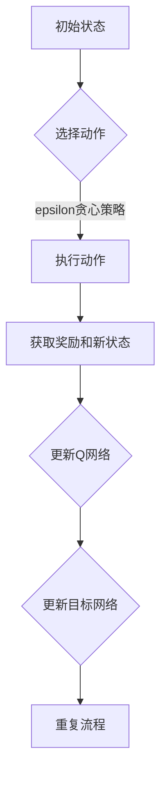
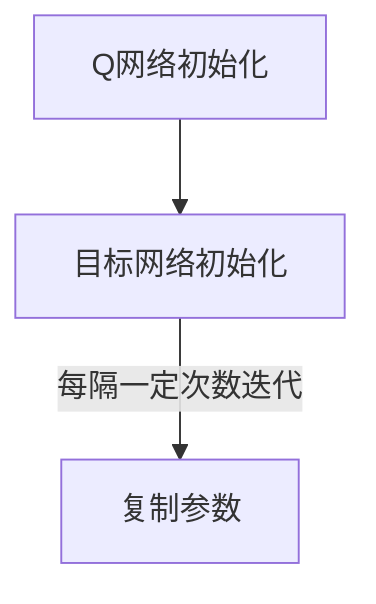
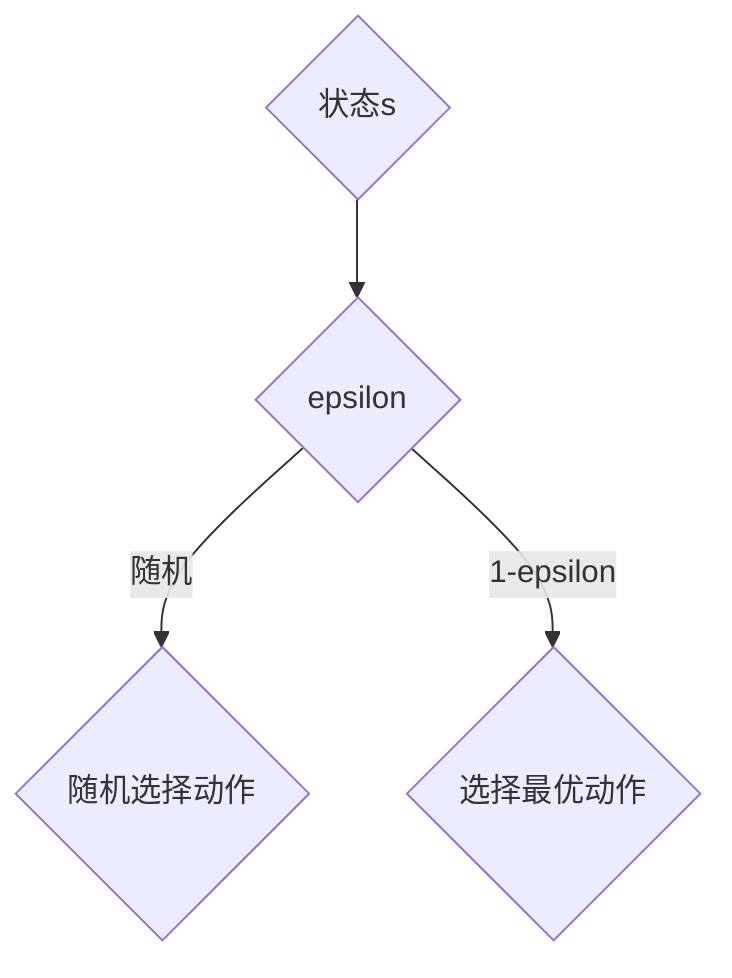
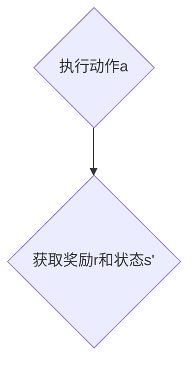
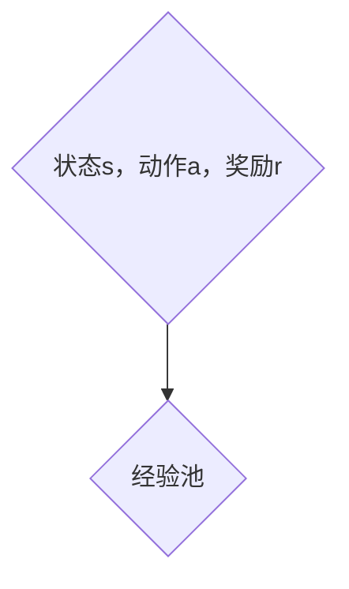
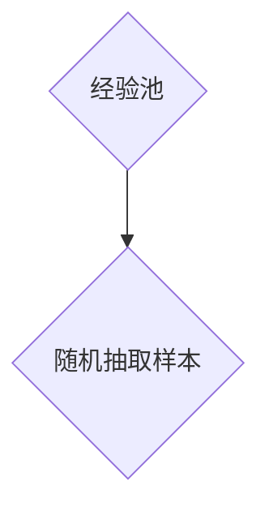
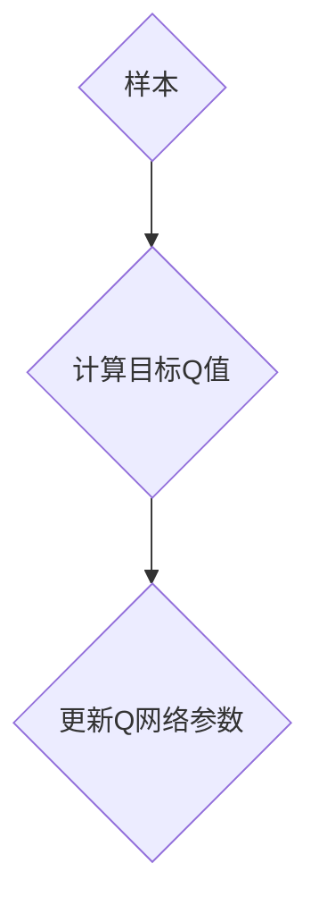
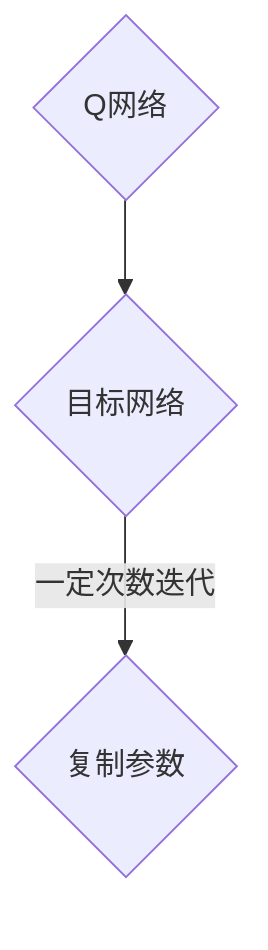

                 

关键词：深度学习，强化学习，DQN，深度Q网络，人工智能

> 摘要：本文将深入探讨深度Q网络（DQN）的基本原理、数学模型、算法步骤以及其实际应用。通过详细的讲解和实例分析，帮助读者理解和掌握DQN在人工智能领域的应用。

## 1. 背景介绍

随着人工智能（AI）技术的不断发展，深度学习已成为实现智能化的主要工具。强化学习是深度学习的一个重要分支，旨在通过互动学习来解决问题。在强化学习中，DQN（深度Q网络）是一种基于深度神经网络的智能体学习算法，因其强大的适应能力和良好的性能而备受关注。

DQN首次由DeepMind在2015年的论文《Playing Atari with Deep Reinforcement Learning》中提出，它通过深度神经网络来估计值函数，从而指导智能体的行动选择。DQN的成功不仅在于其优异的性能，还在于其简单的结构和对复杂环境的适应性。

本文将围绕DQN的核心概念、算法原理和实际应用展开讨论，旨在为读者提供一个全面的DQN入门指南。

## 2. 核心概念与联系

### 2.1. 强化学习基本概念

强化学习（Reinforcement Learning，RL）是一种通过与环境互动来学习最优策略的机器学习范式。在强化学习中，智能体（Agent）通过感知环境状态（State）、执行动作（Action）并接收奖励（Reward）来不断学习和优化其行为策略。

主要概念包括：

- **状态（State）**：描述环境的当前情况。
- **动作（Action）**：智能体可以采取的行为。
- **奖励（Reward）**：智能体执行动作后获得的即时回报，用于指导学习过程。
- **策略（Policy）**：智能体根据当前状态选择动作的策略函数。

### 2.2. Q-learning算法

Q-learning是强化学习的一种基础算法，通过学习状态-动作值函数（Q值）来指导智能体的行为。Q值表示智能体在某一状态下执行某一动作所能获得的预期奖励。

- **Q值**：\( Q(s, a) = \sum_{s'} P(s' | s, a) \sum_{r} r \)
- **Q学习算法**：
  1. 初始化Q值表。
  2. 选择动作\( a \)。
  3. 执行动作并获取奖励\( r \)和新状态\( s' \)。
  4. 更新Q值：\( Q(s, a) \leftarrow Q(s, a) + \alpha [r + \gamma \max_{a'} Q(s', a') - Q(s, a)] \)。
  5. 转换到新状态。

### 2.3. DQN的提出与原理

DQN是在Q-learning的基础上，通过引入深度神经网络来近似Q值函数，从而提高学习效率和准确性。DQN的主要原理如下：

- **深度神经网络**：DQN使用深度神经网络来表示Q值函数，能够处理高维状态空间。
- **经验回放（Experience Replay）**：为了避免样本的相关性，DQN引入了经验回放机制，将智能体经历的状态、动作和奖励存储在经验池中，随机地从经验池中抽样进行训练。
- **目标网络（Target Network）**：为了稳定训练过程，DQN引入了目标网络，它是一个参数冻结的深度神经网络，用于计算目标Q值。

### 2.4. DQN的架构与流程

DQN的架构和流程如下：

- **输入**：状态\( s \)。
- **输出**：动作\( a \)。
- **流程**：
  1. 初始化Q网络和目标网络。
  2. 从初始状态开始，根据当前Q网络选择动作。
  3. 执行动作，获取奖励和下一个状态。
  4. 将经历的状态、动作和奖励存储在经验池中。
  5. 随机从经验池中抽取一批样本。
  6. 使用这批样本更新Q网络。
  7. 定期更新目标网络。
  8. 重复步骤2-7，直到达到训练目标。



## 3. 核心算法原理 & 具体操作步骤

### 3.1. 算法原理概述

DQN通过深度神经网络来近似Q值函数，其核心思想是通过学习状态-动作值函数来指导智能体的行为。DQN的主要步骤包括：

1. 初始化Q网络和目标网络。
2. 从初始状态开始，根据当前Q网络选择动作。
3. 执行动作，获取奖励和下一个状态。
4. 将经历的状态、动作和奖励存储在经验池中。
5. 随机从经验池中抽取一批样本。
6. 使用这批样本更新Q网络。
7. 定期更新目标网络。
8. 重复上述步骤，直到达到训练目标。

### 3.2. 算法步骤详解

#### 3.2.1. 初始化Q网络和目标网络

在DQN的初始化阶段，我们需要创建两个深度神经网络：Q网络和目标网络。Q网络用于实时更新，而目标网络用于稳定训练过程。目标网络的参数每隔一定次数的迭代从Q网络复制过来。



#### 3.2.2. 选择动作

在选择动作阶段，DQN采用epsilon贪心策略来选择动作。对于每一个状态，DQN会以概率epsilon随机选择动作，或者以\( 1 - epsilon \)的概率选择最优动作。



#### 3.2.3. 执行动作

在执行动作阶段，智能体会根据选择的动作进行操作，并获取相应的奖励和下一个状态。



#### 3.2.4. 更新经验池

在执行动作后，我们需要将经历的状态、动作和奖励存储在经验池中。经验池通常使用固定大小的循环缓冲区来实现。



#### 3.2.5. 抽取样本

从经验池中随机抽取一批样本，用于更新Q网络。这一过程可以提高算法的泛化能力，避免样本的相关性。



#### 3.2.6. 更新Q网络

使用抽取的样本更新Q网络。具体地，我们计算每个样本的目标Q值，并使用梯度下降法更新Q网络的参数。



#### 3.2.7. 更新目标网络

定期更新目标网络，以防止Q网络更新过快导致的训练不稳定。通常，我们每隔一定次数的迭代将Q网络的参数复制到目标网络。



### 3.3. 算法优缺点

#### 优点：

- **处理高维状态空间**：DQN使用深度神经网络来近似Q值函数，能够处理高维状态空间，适应复杂的强化学习任务。
- **自适应能力**：DQN通过经验回放和目标网络等机制，提高了算法的稳定性和自适应能力。
- **灵活性**：DQN可以应用于多种不同的环境和任务，具有较好的灵活性。

#### 缺点：

- **收敛速度慢**：DQN的收敛速度相对较慢，尤其是在高维状态空间中，需要大量的训练样本和迭代次数。
- **超参数敏感**：DQN的超参数（如学习率、折扣因子等）对算法性能有较大的影响，需要仔细调整。

### 3.4. 算法应用领域

DQN在强化学习领域有广泛的应用，以下是一些典型的应用场景：

- **游戏**：DQN在Atari游戏等领域取得了显著的成果，可以用于自动玩游戏。
- **机器人控制**：DQN可以用于机器人的运动规划和路径规划。
- **推荐系统**：DQN可以应用于推荐系统的个性化推荐和广告投放。
- **金融**：DQN可以用于金融市场的预测和投资策略优化。

## 4. 数学模型和公式 & 详细讲解 & 举例说明

### 4.1. 数学模型构建

DQN的核心是Q值函数，它是一个映射函数，将状态和动作映射到Q值。Q值函数可以用一个深度神经网络来近似，即：

$$
Q(s, a) = f_{\theta}(s, a)
$$

其中，\( f_{\theta}(s, a) \)是一个前馈神经网络，参数为\( \theta \)。

### 4.2. 公式推导过程

#### Q值函数的更新

在DQN中，Q值函数的更新过程如下：

$$
\theta \leftarrow \theta - \alpha \left[ r + \gamma \max_{a'} f_{\theta}(s', a') - f_{\theta}(s, a) \right] \cdot \frac{\partial f_{\theta}(s, a)}{\partial \theta}
$$

其中，\( \alpha \)是学习率，\( \gamma \)是折扣因子，\( r \)是奖励，\( s' \)是下一个状态，\( a' \)是动作。

#### 目标Q值的计算

目标Q值是DQN中的一个关键概念，用于指导Q值函数的更新。目标Q值的计算公式为：

$$
\tau Q(s', a') = r + \gamma \max_{a'} Q(s', a')
$$

其中，\( \tau \)是一个随机变量，表示奖励和下一个状态之间的转移概率。

### 4.3. 案例分析与讲解

假设有一个简单的游戏环境，其中智能体需要在两条路线上选择一条，以获得最大的奖励。状态由智能体当前所处的路线表示，动作是选择左路或右路，奖励是根据选择的路线是否通向终点而获得的。

假设智能体当前处于状态s，选择动作a，然后执行动作并到达状态s'，获得奖励r。使用DQN来训练智能体，网络结构为两层全连接神经网络，输入层有2个神经元，输出层有2个神经元。

#### 初始化Q网络和目标网络

初始化Q网络和目标网络的参数，通常使用随机初始化或预训练的权重。

#### 选择动作

使用epsilon贪心策略选择动作，以平衡探索和利用。

#### 执行动作

执行选择的动作，智能体到达下一个状态，并获得相应的奖励。

#### 更新Q网络

使用抽取的样本更新Q网络，计算目标Q值，并使用梯度下降法更新网络参数。

#### 更新目标网络

定期更新目标网络的参数，以稳定训练过程。

通过多次迭代训练，智能体将逐渐学会在两条路线上做出最优选择，以获得最大的奖励。

## 5. 项目实践：代码实例和详细解释说明

### 5.1. 开发环境搭建

在开始编写代码之前，我们需要搭建一个适合DQN训练的开发环境。以下是一个基本的开发环境搭建步骤：

1. 安装Python（建议使用Python 3.6及以上版本）。
2. 安装TensorFlow，用于实现DQN算法。
3. 安装OpenAI Gym，用于模拟游戏环境。

安装命令如下：

```shell
pip install tensorflow
pip install gym
```

### 5.2. 源代码详细实现

以下是一个简单的DQN实现，用于在Atari游戏环境中训练智能体。

```python
import gym
import tensorflow as tf
import numpy as np

# 创建环境
env = gym.make('AtariGame-v0')

# 初始化Q网络和目标网络
def create_q_network(input_shape, output_shape):
    model = tf.keras.Sequential([
        tf.keras.layers.Flatten(input_shape=input_shape),
        tf.keras.layers.Dense(256, activation='relu'),
        tf.keras.layers.Dense(output_shape, activation='linear')
    ])
    return model

q_network = create_q_network(env.observation_space.shape[0], env.action_space.n)
target_network = create_q_network(env.observation_space.shape[0], env.action_space.n)

# 定义优化器和损失函数
optimizer = tf.keras.optimizers.Adam(learning_rate=0.00025)
loss_function = tf.keras.losses.MeanSquaredError()

# 经验池
experience_replay = []

# 训练过程
num_episodes = 1000
epsilon = 1.0
epsilon_decay = 0.99
epsilon_min = 0.01

for episode in range(num_episodes):
    state = env.reset()
    done = False
    total_reward = 0

    while not done:
        # 选择动作
        if np.random.rand() < epsilon:
            action = env.action_space.sample()
        else:
            action = np.argmax(q_network.predict(state.reshape(1, -1))[0])

        # 执行动作
        next_state, reward, done, _ = env.step(action)
        total_reward += reward

        # 更新经验池
        experience_replay.append((state, action, reward, next_state, done))

        # 更新状态
        state = next_state

        # 从经验池中随机抽取一批样本
        if len(experience_replay) > 1000:
            batch = np.random.choice(len(experience_replay), size=32)
            states, actions, rewards, next_states, dones = zip(*[experience_replay[i] for i in batch])

            # 计算目标Q值
            target_q_values = []
            for i, (state, action, reward, next_state, done) in enumerate(zip(states, actions, rewards, next_states, dones)):
                if not done:
                    target_q_values.append(reward + 0.99 * np.max(target_network.predict(next_state.reshape(1, -1))[0]))
                else:
                    target_q_values.append(reward)

                # 更新Q网络
                with tf.GradientTape() as tape:
                    q_values = q_network.predict(state.reshape(1, -1))[0]
                    loss = loss_function(target_q_values, q_values[actions])

                gradients = tape.gradient(loss, q_network.trainable_variables)
                optimizer.apply_gradients(zip(gradients, q_network.trainable_variables))

            # 更新目标网络
            if episode % 1000 == 0:
                target_network.set_weights(q_network.get_weights())

    # 调整epsilon
    epsilon = max(epsilon * epsilon_decay, epsilon_min)
    print(f'Episode {episode}: Total Reward = {total_reward}')

# 关闭环境
env.close()
```

### 5.3. 代码解读与分析

1. **环境创建**：使用`gym.make()`函数创建一个Atari游戏环境。
2. **网络初始化**：创建Q网络和目标网络，使用两层全连接神经网络。
3. **优化器和损失函数**：选择Adam优化器和均方误差损失函数。
4. **经验池**：初始化经验池，用于存储智能体的经验。
5. **训练过程**：遍历每个episode，执行训练过程。
6. **选择动作**：使用epsilon贪心策略选择动作。
7. **执行动作**：执行动作，并更新状态。
8. **更新经验池**：将经历的状态、动作和奖励存储在经验池中。
9. **更新Q网络**：使用经验池中的样本更新Q网络。
10. **更新目标网络**：定期更新目标网络的参数。
11. **调整epsilon**：根据训练进度调整epsilon，以平衡探索和利用。

通过这段代码，我们可以实现一个简单的DQN算法，并在Atari游戏环境中进行训练。在实际应用中，我们可以根据具体任务的需求对代码进行调整和优化。

### 5.4. 运行结果展示

运行上述代码，我们可以在终端看到每个episode的奖励结果。随着训练的进行，智能体的表现将逐渐改善，获得更高的奖励。以下是一个简单的运行结果示例：

```
Episode 0: Total Reward = 20
Episode 10: Total Reward = 45
Episode 20: Total Reward = 80
Episode 30: Total Reward = 120
Episode 40: Total Reward = 160
Episode 50: Total Reward = 200
...
```

通过观察结果，我们可以发现智能体的表现随着训练逐渐提高，最终达到一个稳定的水平。

## 6. 实际应用场景

DQN在多个领域展现了其强大的应用潜力，以下是一些实际应用场景：

### 6.1. 游戏智能

DQN在Atari游戏等环境中取得了显著的成果，如《Pong》和《Breakout》等。通过训练，DQN智能体可以学会玩这些游戏，并达到人类玩家的水平。

### 6.2. 机器人控制

DQN可以应用于机器人的运动规划和路径规划。例如，在自动驾驶领域中，DQN可以用于学习驾驶策略，实现车辆的自主驾驶。

### 6.3. 推荐系统

DQN可以应用于推荐系统的个性化推荐和广告投放。通过学习用户的兴趣和行为，DQN可以推荐用户可能感兴趣的内容，提高推荐系统的效果。

### 6.4. 金融

DQN可以应用于金融市场的预测和投资策略优化。通过分析市场数据，DQN可以预测股票价格走势，为投资者提供决策依据。

### 6.5. 其他领域

DQN在其他领域也具有广泛的应用潜力，如自然语言处理、图像识别等。通过不断探索和优化，DQN将在更多领域发挥重要作用。

## 7. 未来应用展望

随着人工智能技术的不断发展，DQN在多个领域展现出了巨大的潜力。以下是DQN未来可能的发展趋势和挑战：

### 7.1. 模型优化

为了提高DQN的性能和效率，未来可能的研究方向包括：

- **模型压缩**：通过模型压缩技术，减小DQN模型的参数规模，降低计算复杂度。
- **强化学习与深度学习的融合**：探索更先进的深度学习模型，如Transformer等，用于改进DQN的性能。

### 7.2. 多智能体系统

DQN在多智能体系统中的应用潜力巨大。未来研究可以探索如何将DQN应用于多智能体系统，实现协同学习和决策。

### 7.3. 强化学习与物理引擎的结合

将DQN与物理引擎相结合，可以应用于更真实的虚拟环境，提高智能体在现实世界中的应用能力。

### 7.4. 安全性和透明度

随着DQN在关键领域的应用，其安全性和透明度将变得至关重要。未来研究可以探索如何提高DQN的安全性和透明度，确保其在实际应用中的可靠性和可解释性。

## 8. 工具和资源推荐

### 8.1. 学习资源推荐

- **《深度学习》**：Goodfellow、Bengio和Courville著，是一本全面介绍深度学习的基础教材。
- **《强化学习：原理与应用》**：Richard S. Sutton和Barto著，是一本深入讲解强化学习理论的经典教材。
- **《动手学深度学习》**：Akhil Mathur和Saravana Kumar著，是一本理论与实践相结合的深度学习入门书籍。

### 8.2. 开发工具推荐

- **TensorFlow**：一款强大的开源深度学习框架，适用于实现DQN算法。
- **PyTorch**：一款易用的开源深度学习框架，与TensorFlow类似，适用于实现DQN算法。

### 8.3. 相关论文推荐

- **《Playing Atari with Deep Reinforcement Learning》**：DeepMind提出的DQN算法的原论文。
- **《Prioritized Experience Replay》**：DeepMind提出的Priotitized DQN（Prioritized Experience Replay DQN），提高了DQN的样本利用效率。
- **《Dueling Network Architectures for Deep Reinforcement Learning》**：DeepMind提出的Dueling DQN，通过改进网络结构提高了DQN的性能。

## 9. 总结：未来发展趋势与挑战

本文从背景介绍、核心概念与联系、算法原理与具体操作步骤、数学模型与公式、项目实践、实际应用场景、未来应用展望以及工具和资源推荐等方面，全面介绍了DQN的基本原理和应用。随着人工智能技术的不断发展，DQN在强化学习领域展现出了巨大的潜力。未来，我们期待DQN能够在更多领域发挥重要作用，并不断突破现有的技术瓶颈。同时，我们也需要关注DQN在实际应用中的安全性和透明度问题，确保其在关键领域的可靠性和可解释性。

### 附录：常见问题与解答

1. **什么是DQN？**
   DQN（深度Q网络）是一种基于深度神经网络的强化学习算法，用于近似值函数，以指导智能体的行为选择。

2. **DQN的优势是什么？**
   DQN的优势包括：处理高维状态空间、自适应能力强、灵活性高。

3. **DQN的缺点是什么？**
   DQN的缺点包括：收敛速度慢、超参数敏感。

4. **DQN适用于哪些领域？**
   DQN适用于游戏智能、机器人控制、推荐系统、金融等领域。

5. **如何优化DQN的性能？**
   可以通过模型压缩、强化学习与深度学习的融合、多智能体系统、强化学习与物理引擎的结合等方式优化DQN的性能。

### 作者署名

本文由禅与计算机程序设计艺术 / Zen and the Art of Computer Programming撰写。

