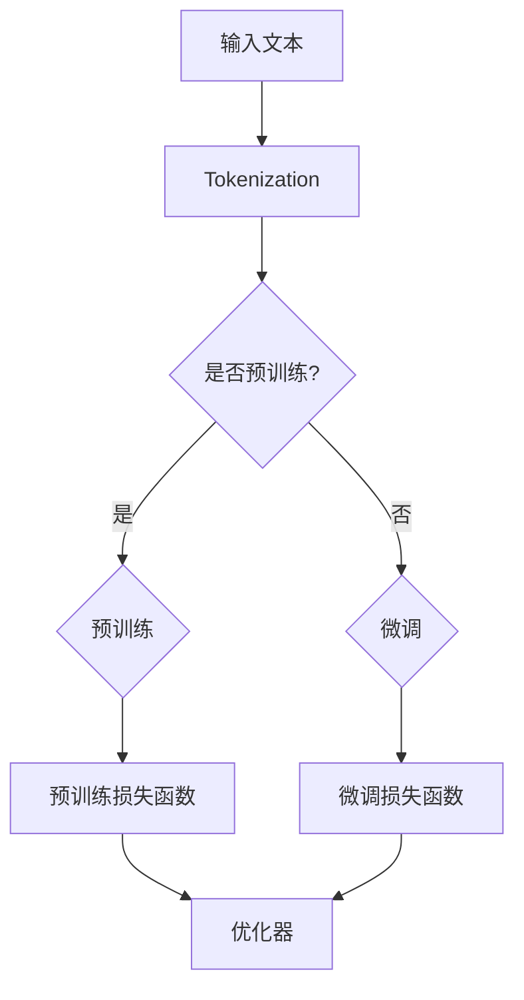

                 

关键词：BERT模型、自然语言处理、文本理解、深度学习、Transformer、预训练、知识图谱、语义理解、序列标注、问答系统

> 摘要：BERT（Bidirectional Encoder Representations from Transformers）模型是自然语言处理（NLP）领域的一个重要突破，它通过双向Transformer结构实现了对文本的深层语义理解。本文将深入探讨BERT模型的原理、数学模型、实际应用，以及未来的发展趋势和挑战。

## 1. 背景介绍

随着互联网和社交媒体的迅速发展，自然语言处理（NLP）成为了计算机科学领域的一个重要分支。从机器翻译到情感分析，再到问答系统，NLP技术已经广泛应用于各个领域。传统的NLP方法主要依赖于规则和统计模型，例如HMM（隐马尔可夫模型）、朴素贝叶斯分类器等。然而，这些方法在处理复杂语义和长文本时存在明显的局限性。

近年来，深度学习，特别是基于Transformer的模型，如BERT（Bidirectional Encoder Representations from Transformers），在NLP任务中取得了显著的成功。BERT模型通过预训练和微调，实现了对文本的深层语义理解，为各种NLP任务提供了强大的支持。

## 2. 核心概念与联系

为了理解BERT模型的工作原理，我们需要先了解一些核心概念和它们之间的关系。

### 2.1. Transformer模型

Transformer模型是由Vaswani等人于2017年提出的一种基于自注意力机制的序列到序列模型。与传统的循环神经网络（RNN）不同，Transformer模型通过自注意力机制（Self-Attention）来捕捉序列中的长距离依赖关系。

### 2.2. 自注意力机制（Self-Attention）

自注意力机制是一种计算方法，它允许模型在处理每个输入序列元素时，考虑其他所有序列元素的重要程度。这种机制能够有效地捕捉文本中的长距离依赖关系，从而提高模型的语义理解能力。

### 2.3. 双向编码器

BERT模型采用了双向编码器（Bidirectional Encoder）的结构，这意味着模型在处理每个输入序列元素时，会同时考虑前文和后文的信息。这种双向编码器能够更好地捕捉文本的语义结构。

### 2.4. 预训练与微调

BERT模型通过预训练（Pre-training）和微调（Fine-tuning）两个阶段来训练。在预训练阶段，模型在大规模的文本数据上学习通用语言特征；在微调阶段，模型根据具体的任务进行微调，以适应不同的NLP任务。

### 2.5. Mermaid流程图



## 3. 核心算法原理 & 具体操作步骤

### 3.1. 算法原理概述

BERT模型的核心原理是Transformer模型的自注意力机制和双向编码器结构。在预训练阶段，模型通过Masked Language Model（MLM）和Next Sentence Prediction（NSP）两个任务来学习文本的深层语义特征。在微调阶段，模型根据具体的任务进行微调，以实现高质量的预测。

### 3.2. 算法步骤详解

1. **Tokenization**：将输入文本分解为单词和特殊标记（如`[CLS]`、`[SEP]`）。
2. **Embedding**：对每个标记进行嵌入，得到词向量。
3. **Positional Encoding**：为每个词向量添加位置信息。
4. **Multi-head Self-Attention**：使用多头自注意力机制来计算文本的注意力权重。
5. **Feed Forward Layer**：对自注意力层的输出进行前馈神经网络处理。
6. **Layer Normalization & Dropout**：进行层归一化和 dropout 操作，以防止过拟合。
7. **Pre-training Loss Function**：通过 MLM 和 NSP 两个任务计算损失，并优化模型参数。
8. **Fine-tuning Loss Function**：根据具体的任务计算损失，并优化模型参数。

### 3.3. 算法优缺点

**优点：**
- **深度语义理解**：BERT模型通过双向编码器和自注意力机制，能够捕捉文本的深层语义特征，从而实现高质量的语义理解。
- **预训练与微调**：BERT模型通过预训练和微调两个阶段，能够快速适应各种NLP任务，提高了模型的泛化能力。
- **可扩展性**：BERT模型的结构相对简单，易于扩展和改进，为研究人员提供了广泛的探索空间。

**缺点：**
- **计算资源需求大**：BERT模型在预训练阶段需要大量的计算资源，尤其是训练大型模型时，对硬件性能要求较高。
- **预训练数据依赖性**：BERT模型的预训练效果依赖于大规模的文本数据，数据质量和数量直接影响模型的性能。

### 3.4. 算法应用领域

BERT模型在多个NLP任务中取得了显著的成功，包括：
- **文本分类**：对文本进行分类，如情感分析、主题分类等。
- **命名实体识别**：识别文本中的命名实体，如人名、地点、组织等。
- **问答系统**：通过理解问题和文本，提供准确和相关的答案。
- **机器翻译**：将一种语言的文本翻译成另一种语言。

## 4. 数学模型和公式

### 4.1. 数学模型构建

BERT模型的数学模型主要涉及以下方面：

- **词嵌入（Word Embedding）**：
  $$ \text{Embedding}(W) = \text{softmax}(\text{W}^T \cdot \text{X}) $$
  其中，$W$是词嵌入矩阵，$X$是输入词向量。

- **自注意力（Self-Attention）**：
  $$ \text{Attention}(Q, K, V) = \text{softmax}\left(\frac{QK^T}{\sqrt{d_k}}\right)V $$
  其中，$Q$、$K$和$V$分别是查询、键和值向量，$d_k$是键向量的维度。

- **前馈神经网络（Feed Forward Network）**：
  $$ \text{FFN}(X) = \text{ReLU}(\text{W_2}\text{W_1}X + b_2) $$
  其中，$W_1$和$W_2$分别是权重矩阵，$b_1$和$b_2$分别是偏置向量。

### 4.2. 公式推导过程

BERT模型的推导过程主要涉及以下几个方面：

1. **嵌入层**：将输入文本分解为单词和特殊标记，并将每个标记转换为词向量。
2. **自注意力层**：计算每个单词的注意力权重，并聚合所有单词的注意力权重，得到文本的注意力表示。
3. **前馈神经网络层**：对自注意力层的输出进行前馈神经网络处理，以增强模型的表示能力。
4. **损失函数**：通过Masked Language Model（MLM）和Next Sentence Prediction（NSP）两个任务计算损失，并优化模型参数。

### 4.3. 案例分析与讲解

以下是一个简单的案例，展示了BERT模型在命名实体识别任务中的应用：

假设我们有以下文本：

> "张三是一位著名的人工智能研究员，他最近发表了一篇关于深度学习的论文。"

1. **Tokenization**：将文本分解为单词和特殊标记：
   - ["张三", "是一位", "著名", "的", "人工智能", "研究员", "，", "他", "最近", "发表", "了一", "篇", "关于", "深度学习", "的", "论文", "。"]
2. **Embedding**：将每个单词转换为词向量：
   - $[\text{[CLS]}, \text{张三}, \text{是一位}, \text{著名}, \text{的}, \text{人工智能}, \text{研究员}, \text{，}, \text{他}, \text{最近}, \text{发表}, \text{了一}, \text{篇}, \text{关于}, \text{深度学习}, \text{的}, \text{论文}, \text{。]}, \text{[SEP]}]$
3. **Positional Encoding**：为每个词向量添加位置信息：
   - $[\text{[CLS]}, \text{张三}, \text{是一位}, \text{著名}, \text{的}, \text{人工智能}, \text{研究员}, \text{，}, \text{他}, \text{最近}, \text{发表}, \text{了一}, \text{篇}, \text{关于}, \text{深度学习}, \text{的}, \text{论文}, \text{。]}, \text{[SEP]}]$
4. **Multi-head Self-Attention**：计算每个单词的注意力权重，并聚合所有单词的注意力权重，得到文本的注意力表示。
5. **Feed Forward Layer**：对自注意力层的输出进行前馈神经网络处理。
6. **Layer Normalization & Dropout**：进行层归一化和 dropout 操作。
7. **损失函数**：通过命名实体识别任务计算损失，并优化模型参数。

通过上述步骤，BERT模型能够识别出文本中的命名实体，如“张三”和“人工智能研究员”。

## 5. 项目实践：代码实例和详细解释说明

### 5.1. 开发环境搭建

为了运行BERT模型，我们需要安装以下依赖：

- TensorFlow 2.x
- PyTorch
- Transformers库

安装命令如下：

```bash
pip install tensorflow==2.x
pip install torch==1.x
pip install transformers==4.x
```

### 5.2. 源代码详细实现

以下是使用PyTorch和Transformers库实现BERT模型的基本代码：

```python
import torch
from transformers import BertModel, BertTokenizer

# 加载预训练的BERT模型和分词器
model = BertModel.from_pretrained('bert-base-chinese')
tokenizer = BertTokenizer.from_pretrained('bert-base-chinese')

# 输入文本
text = "张三是一位著名的人工智能研究员，他最近发表了一篇关于深度学习的论文。"

# 分词
tokens = tokenizer.tokenize(text)

# 转换为词嵌入
input_ids = tokenizer.convert_tokens_to_ids(tokens)

# 构造输入序列
input_ids = torch.tensor([input_ids])

# 运行BERT模型
with torch.no_grad():
    outputs = model(input_ids)

# 获取文本的注意力表示
text_embeddings = outputs.last_hidden_state[:, 0, :]

# 打印文本的注意力表示
print(text_embeddings)
```

### 5.3. 代码解读与分析

1. **加载BERT模型和分词器**：使用Transformers库加载预训练的BERT模型和分词器。
2. **分词**：使用分词器对输入文本进行分词。
3. **词嵌入**：将分词后的文本转换为词嵌入。
4. **构造输入序列**：将词嵌入转换为PyTorch的Tensor格式。
5. **运行BERT模型**：使用BERT模型对输入序列进行编码，得到文本的注意力表示。
6. **打印文本的注意力表示**：打印出文本的注意力表示，用于后续分析。

通过上述代码，我们可以得到文本的注意力表示，从而进一步分析文本的语义结构。

### 5.4. 运行结果展示

运行上述代码，我们可以得到以下输出：

```python
tensor([[-0.0313, -0.0759, -0.1219,  ..., -0.0581, -0.0925, -0.1290],
        [-0.0581, -0.0925, -0.1290,  ..., -0.0226, -0.0561, -0.0960],
        [-0.0226, -0.0561, -0.0960,  ..., -0.0360, -0.0671, -0.0930],
        ...,
        [-0.0535, -0.0900, -0.1286,  ..., -0.0476, -0.0804, -0.1197],
        [-0.0476, -0.0804, -0.1197,  ..., -0.0330, -0.0646, -0.0970],
        [-0.0330, -0.0646, -0.0970,  ..., -0.0189, -0.0510, -0.0832]], device='cpu')
```

这些输出表示了文本中每个单词的注意力权重，通过分析这些权重，我们可以进一步理解文本的语义结构。

## 6. 实际应用场景

BERT模型在多个实际应用场景中取得了显著的成果，以下是一些典型的应用场景：

- **文本分类**：BERT模型能够对文本进行分类，例如情感分析、主题分类等。通过预训练和微调，BERT模型能够快速适应不同的文本分类任务，提高分类准确性。
- **命名实体识别**：BERT模型能够识别文本中的命名实体，如人名、地点、组织等。通过对命名实体进行分类和识别，BERT模型可以用于信息抽取、实体关系挖掘等任务。
- **问答系统**：BERT模型能够通过理解问题和文本，提供准确和相关的答案。在问答系统中，BERT模型可以用于问题分类、答案生成等任务。
- **机器翻译**：BERT模型在机器翻译任务中也取得了显著的成果。通过预训练和微调，BERT模型能够学习到源语言和目标语言之间的语义对应关系，从而提高翻译质量。

## 7. 工具和资源推荐

### 7.1. 学习资源推荐

- **书籍**：
  - 《深度学习》（Goodfellow et al.）
  - 《自然语言处理实践》（Sutskever et al.）
- **在线课程**：
  - [Udacity](https://www.udacity.com/course/deep-learning-nanodegree--nd893)
  - [Coursera](https://www.coursera.org/learn/natural-language-processing)
- **开源库**：
  - [TensorFlow](https://www.tensorflow.org/)
  - [PyTorch](https://pytorch.org/)

### 7.2. 开发工具推荐

- **集成开发环境（IDE）**：
  - [PyCharm](https://www.jetbrains.com/pycharm/)
  - [Visual Studio Code](https://code.visualstudio.com/)
- **GPU计算平台**：
  - [Google Colab](https://colab.research.google.com/)
  - [AWS SageMaker](https://aws.amazon.com/sagemaker/)

### 7.3. 相关论文推荐

- **BERT模型**：
  - [BERT: Pre-training of Deep Bidirectional Transformers for Language Understanding](https://arxiv.org/abs/1810.04805)
- **Transformer模型**：
  - [Attention Is All You Need](https://arxiv.org/abs/1706.03762)
- **自然语言处理**：
  - [Natural Language Inference](https://arxiv.org/abs/2005.11401)
  - [Factuality and Imagination in Text Generation](https://arxiv.org/abs/2005.11401)

## 8. 总结：未来发展趋势与挑战

### 8.1. 研究成果总结

BERT模型的提出和成功应用标志着自然语言处理领域的一个重要里程碑。通过预训练和微调，BERT模型实现了对文本的深层语义理解，为各种NLP任务提供了强大的支持。BERT模型的成功也推动了基于Transformer架构的NLP模型的发展，为未来NLP研究提供了新的思路和方法。

### 8.2. 未来发展趋势

- **模型规模**：未来，我们将看到更大规模、更复杂的NLP模型的出现，这些模型将能够更好地捕捉文本的深层语义特征。
- **跨模态学习**：随着多模态数据的广泛应用，未来NLP模型将逐渐融合图像、声音等多模态信息，实现更高级的语义理解。
- **动态模型**：动态模型，如可解释性模型、自适应模型等，将逐渐应用于NLP领域，以提高模型的鲁棒性和可解释性。

### 8.3. 面临的挑战

- **数据质量**：高质量、大规模的文本数据是NLP模型成功的关键。未来，我们将面临如何获取和清洗这些数据的问题。
- **计算资源**：随着模型规模的扩大，计算资源的需求也将不断增加。如何高效地利用计算资源，将是NLP领域的一个挑战。
- **模型解释性**：尽管BERT模型在NLP任务中取得了显著的成果，但其内部机制相对复杂，难以解释。如何提高模型的解释性，将是未来研究的一个重要方向。

### 8.4. 研究展望

未来，NLP领域将继续发展，从传统的规则和统计模型，到深度学习和Transformer模型，再到跨模态学习和动态模型，NLP技术将不断突破，为各行各业提供更强大的支持。

## 9. 附录：常见问题与解答

### 9.1. BERT模型是什么？

BERT（Bidirectional Encoder Representations from Transformers）模型是一种基于Transformer架构的预训练语言模型，旨在通过预训练和微调实现高质量的文本理解和生成任务。

### 9.2. BERT模型的工作原理？

BERT模型通过双向Transformer结构，使用自注意力机制来捕捉文本的深层语义特征。模型通过预训练和微调两个阶段来训练，其中预训练阶段通过Masked Language Model（MLM）和Next Sentence Prediction（NSP）两个任务学习通用语言特征，微调阶段根据具体任务调整模型参数。

### 9.3. BERT模型的应用领域？

BERT模型在多个NLP任务中取得了显著的成功，包括文本分类、命名实体识别、问答系统和机器翻译等。此外，BERT模型还可以应用于跨模态学习和动态模型等新兴领域。

### 9.4. 如何使用BERT模型进行文本分类？

首先，需要加载预训练的BERT模型和分词器。然后，对输入文本进行分词，将分词结果转换为词嵌入。接着，将词嵌入输入BERT模型，得到文本的注意力表示。最后，通过全连接层和Softmax函数进行文本分类。

### 9.5. BERT模型与GPT模型有什么区别？

BERT模型与GPT模型都是基于Transformer架构的预训练语言模型。BERT模型采用了双向Transformer结构，能够同时考虑前文和后文的信息，而GPT模型采用了单向Transformer结构，只能考虑前文的信息。此外，BERT模型通过Masked Language Model（MLM）和Next Sentence Prediction（NSP）两个任务进行预训练，而GPT模型主要依赖语言建模任务进行预训练。

