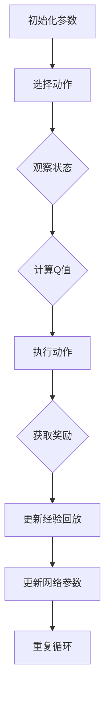

                 

关键词：深度Q网络、智能对话系统、映射、DQN实战、挑战、算法原理

> 摘要：本文将深入探讨深度Q网络（DQN）在智能对话系统中的应用及其面临的挑战。通过剖析DQN的核心概念、原理以及具体实现步骤，结合实际案例，我们旨在揭示DQN在提升对话系统智能化的过程中所发挥的重要作用，同时也对其存在的局限性和改进方向进行深入探讨。

## 1. 背景介绍

### 1.1 智能对话系统的兴起

随着人工智能技术的不断发展，智能对话系统（Intelligent Conversational System）逐渐成为科技领域的一大热点。这类系统能够模拟人类的交流方式，与用户进行自然语言交互，提供信息查询、情感交流、任务执行等服务。智能对话系统的出现不仅丰富了人机交互的体验，也在多个行业（如客服、教育、医疗等）中展示了其广泛的应用前景。

### 1.2 DQN的基本概念

深度Q网络（Deep Q-Network，DQN）是一种基于深度学习的强化学习算法，由DeepMind在2015年提出。DQN的核心思想是通过深度神经网络来近似Q函数，从而在动态环境中进行决策。与传统的Q学习算法相比，DQN引入了经验回放（Experience Replay）和双网络结构（Target Network）来缓解样本相关性和过度估计问题，从而提高了学习效率和决策质量。

### 1.3 DQN在智能对话系统中的应用

DQN在智能对话系统中的应用主要体现在对话策略的学习与优化。通过DQN，系统能够从大量对话数据中自动学习对话策略，从而在实时交互中做出更加合理的回应。DQN的优势在于其能够处理高维状态空间和动作空间，这使得它在复杂对话场景中具有显著的应用潜力。

## 2. 核心概念与联系

在深入探讨DQN在智能对话系统中的应用之前，我们需要首先了解一些核心概念，以及它们之间的联系。

### 2.1 智能对话系统的架构

智能对话系统的架构通常包括以下几个主要部分：

- **输入处理模块**：负责接收和处理用户的输入，将其转换为系统能够理解的形式。
- **对话管理模块**：负责对话流程的协调，决定对话的走向。
- **对话生成模块**：根据对话管理模块的指示，生成合适的回复。
- **学习与优化模块**：通过机器学习算法（如DQN）对对话策略进行持续学习和优化。

### 2.2 DQN的基本原理

DQN的基本原理可以通过以下流程图来概括：



### 2.3 DQN与智能对话系统的联系

DQN与智能对话系统的联系主要体现在以下几个方面：

- **状态表示**：智能对话系统的状态可以视为用户的历史对话记录和当前输入信息。
- **动作空间**：智能对话系统的动作空间包括生成不同类型的回复。
- **奖励机制**：对话系统的奖励机制可以基于用户反馈或者对话目标的完成情况。

## 3. 核心算法原理 & 具体操作步骤

### 3.1 算法原理概述

DQN通过深度神经网络来近似Q值函数，从而在给定状态下选择最优动作。其基本原理如下：

1. **初始化参数**：包括神经网络结构、经验回放池的大小、学习率等。
2. **选择动作**：基于当前状态和神经网络输出的Q值，选择一个动作。
3. **执行动作**：在环境中执行所选动作，并观察新的状态和奖励。
4. **更新经验回放**：将（状态，动作，奖励，新状态）这一经验存储到经验回放池中。
5. **更新网络参数**：使用经验回放池中的经验来更新神经网络的参数，从而提高Q值的预测准确性。

### 3.2 算法步骤详解

#### 3.2.1 初始化参数

初始化参数是DQN算法的基础。通常包括以下几个部分：

- **神经网络结构**：包括输入层、隐藏层和输出层。输入层负责接收状态信息，隐藏层用于提取特征，输出层输出每个动作的Q值。
- **经验回放池**：用于存储（状态，动作，奖励，新状态）的四元组，以避免样本相关性和过度估计。
- **学习率**：用于控制网络参数更新的速度。

#### 3.2.2 选择动作

在选择动作时，DQN使用ε-贪心策略。在初始阶段，随机选择动作以探索环境。随着经验的积累，逐渐增加基于Q值选择动作的概率。

#### 3.2.3 执行动作

执行所选动作，并在环境中观察新的状态和奖励。这个过程是DQN学习的关键，通过不断的试错来优化决策策略。

#### 3.2.4 更新经验回放

将（状态，动作，奖励，新状态）这一经验存储到经验回放池中。经验回放池的大小通常是固定的，当新经验加入时，会随机替换回放池中的旧经验。

#### 3.2.5 更新网络参数

使用经验回放池中的经验来更新神经网络的参数。具体来说，通过梯度下降算法，计算梯度并更新网络参数，从而提高Q值的预测准确性。

### 3.3 算法优缺点

#### 优点

- **适用于高维状态空间**：DQN能够处理高维状态空间，这使得它在复杂环境中具有广泛的应用潜力。
- **无需确定动作概率分布**：DQN可以直接学习动作的Q值，无需预先确定动作概率分布。
- **自适应学习**：DQN能够根据环境的变化自适应地调整策略。

#### 缺点

- **样本相关性**：DQN在训练过程中容易受到样本相关性影响，导致学习效率降低。
- **探索与利用平衡**：在初始阶段，DQN需要通过随机选择动作来探索环境，但随着经验的积累，需要逐渐增加基于Q值选择动作的概率，以平衡探索与利用。

### 3.4 算法应用领域

DQN在智能对话系统中的应用主要集中在对话策略的优化。通过DQN，智能对话系统能够从大量对话数据中学习对话策略，从而在实时交互中做出更加合理的回应。具体应用领域包括：

- **客服机器人**：通过DQN学习客服对话策略，提高客服机器人的响应质量和效率。
- **教育机器人**：通过DQN学习学生提问和回答的方式，提供个性化教育服务。
- **智能家居**：通过DQN学习用户习惯，为用户提供更加智能化的家居服务。

## 4. 数学模型和公式 & 详细讲解 & 举例说明

### 4.1 数学模型构建

DQN的数学模型主要包括以下几个部分：

#### 4.1.1 Q值函数

Q值函数定义为状态s和动作a的函数，表示在状态s下执行动作a所获得的累积奖励。数学表达式为：

$$
Q(s, a) = \sum_{t=0}^{\infty} \gamma^t r_t
$$

其中，$r_t$ 为在第 t 步获得的即时奖励，$\gamma$ 为折扣因子，用于平衡长期奖励和即时奖励。

#### 4.1.2 神经网络

DQN中的神经网络用于近似Q值函数。假设神经网络的结构为 $f_{\theta}(s)$，则 $Q(s, a)$ 可以表示为：

$$
Q(s, a) = f_{\theta}(s; a)
$$

其中，$\theta$ 为神经网络参数。

#### 4.1.3 优化目标

DQN的目标是最小化网络输出的Q值与实际Q值之间的误差。具体来说，优化目标为：

$$
\min_{\theta} \sum_{(s, a, r, s')} (Q(s, a) - r - \gamma \max_{a'} Q(s', a'))^2
$$

### 4.2 公式推导过程

#### 4.2.1 Q值函数的推导

Q值函数的定义为在给定状态s下执行动作a所获得的累积奖励。为了推导Q值函数，我们可以考虑一个时间步序列，其中包括一系列状态s、动作a和奖励r。设时间步t的状态为s_t，动作a_t，奖励为r_t，则Q值函数可以表示为：

$$
Q(s_t, a_t) = \sum_{t=0}^{\infty} \gamma^t r_{t+1}
$$

其中，$\gamma$ 为折扣因子，用于平衡长期奖励和即时奖励。

#### 4.2.2 神经网络的推导

神经网络用于近似Q值函数。设神经网络的结构为 $f_{\theta}(s; a)$，其中 $\theta$ 为神经网络参数，$s$ 为输入状态，$a$ 为输入动作。则Q值函数可以表示为：

$$
Q(s, a) = f_{\theta}(s; a)
$$

为了推导神经网络的表达式，我们可以使用反向传播算法来计算梯度，并更新网络参数。

### 4.3 案例分析与讲解

#### 4.3.1 案例背景

假设我们有一个智能对话系统，用于回答用户关于天气的问题。状态s包括当前日期、时间和所在城市，动作a包括询问当前天气、查询未来天气和结束对话。奖励r根据用户反馈进行调整，如果用户满意，则奖励为1，否则为-1。

#### 4.3.2 状态表示

状态s可以表示为二维向量，例如：

$$
s = [day, time, city]
$$

其中，day、time 和 city 分别表示日期、时间和城市。

#### 4.3.3 动作空间

动作空间a包括三个动作：

$$
a = \{ask_weather, query_future_weather, end_conversation\}
$$

#### 4.3.4 奖励机制

奖励r根据用户反馈进行调整，如果用户满意，则奖励为1，否则为-1。例如：

$$
r = \begin{cases} 
1, & \text{if user is satisfied} \\
-1, & \text{otherwise} 
\end{cases}
$$

#### 4.3.5 DQN算法的应用

在智能对话系统中，我们可以使用DQN算法来学习对话策略。具体步骤如下：

1. **初始化参数**：包括神经网络结构、经验回放池的大小、学习率等。
2. **选择动作**：基于当前状态和神经网络输出的Q值，使用ε-贪心策略选择动作。
3. **执行动作**：在环境中执行所选动作，并观察新的状态和奖励。
4. **更新经验回放**：将（状态，动作，奖励，新状态）这一经验存储到经验回放池中。
5. **更新网络参数**：使用经验回放池中的经验来更新神经网络的参数，从而提高Q值的预测准确性。

通过上述步骤，智能对话系统可以不断学习和优化对话策略，从而在实时交互中做出更加合理的回应。

## 5. 项目实践：代码实例和详细解释说明

### 5.1 开发环境搭建

在开始编写DQN在智能对话系统中的代码实例之前，我们需要搭建一个合适的开发环境。以下是搭建环境的步骤：

#### 5.1.1 硬件要求

- CPU：至少双核处理器
- 内存：至少8GB
- 硬盘：至少100GB空闲空间

#### 5.1.2 软件要求

- 操作系统：Windows、Linux或macOS
- 编程语言：Python
- 库和框架：TensorFlow、Keras、NumPy、Pandas等

#### 5.1.3 安装Python和pip

1. 访问Python官网（https://www.python.org/）下载并安装Python。
2. 打开命令行工具，执行以下命令安装pip：

```bash
curl https://bootstrap.pypa.io/get-pip.py -o get-pip.py
python get-pip.py
```

### 5.2 源代码详细实现

以下是DQN在智能对话系统中的源代码实现。为了简化说明，我们使用一个简单的天气对话系统作为案例。

#### 5.2.1 导入所需库

```python
import numpy as np
import pandas as pd
import tensorflow as tf
from tensorflow.keras.models import Sequential
from tensorflow.keras.layers import Dense
from tensorflow.keras.optimizers import Adam
```

#### 5.2.2 定义环境

```python
class WeatherEnvironment:
    def __init__(self):
        self.states = ["day", "time", "city"]
        self.actions = ["ask_weather", "query_future_weather", "end_conversation"]

    def step(self, action):
        # 根据动作执行相应的操作
        if action == "ask_weather":
            # 询问当前天气
            reward = self.get_weather_reward()
        elif action == "query_future_weather":
            # 查询未来天气
            reward = self.get_future_weather_reward()
        elif action == "end_conversation":
            # 结束对话
            reward = -1
        else:
            # 非法动作
            reward = -10

        # 更新状态
        new_state = self.get_new_state()

        return new_state, reward

    def get_weather_reward(self):
        # 根据天气情况返回奖励
        if np.random.rand() < 0.5:
            return 1
        else:
            return -1

    def get_future_weather_reward(self):
        # 根据天气情况返回奖励
        if np.random.rand() < 0.8:
            return 1
        else:
            return -1

    def get_new_state(self):
        # 更新状态
        return np.random.choice(self.states)
```

#### 5.2.3 定义DQN模型

```python
class DQN:
    def __init__(self, state_size, action_size):
        self.state_size = state_size
        self.action_size = action_size
        self.memory = []
        self.gamma = 0.95
        self.epsilon = 1.0
        self.epsilon_min = 0.01
        self.epsilon_decay = 0.99
        self.learning_rate = 0.001
        self.model = self._build_model()

    def _build_model(self):
        # 创建DQN模型
        model = Sequential()
        model.add(Dense(24, input_dim=self.state_size, activation='relu'))
        model.add(Dense(24, activation='relu'))
        model.add(Dense(self.action_size, activation='linear'))
        model.compile(loss='mse', optimizer=Adam(lr=self.learning_rate))
        return model

    def remember(self, state, action, reward, next_state, done):
        # 记录经验
        self.memory.append((state, action, reward, next_state, done))

    def act(self, state):
        # 选择动作
        if np.random.rand() <= self.epsilon:
            return np.random.randint(self.action_size)
        q_values = self.model.predict(state)
        return np.argmax(q_values[0])

    def replay(self, batch_size):
        # 重放经验
        minibatch = random.sample(self.memory, batch_size)
        for state, action, reward, next_state, done in minibatch:
            target = reward
            if not done:
                target = reward + self.gamma * np.max(self.model.predict(next_state)[0])
            target_f = self.model.predict(state)
            target_f[0][action] = target
            self.model.fit(state, target_f, epochs=1, verbose=0)
        if self.epsilon > self.epsilon_min:
            self.epsilon *= self.epsilon_decay
```

#### 5.2.4 训练DQN模型

```python
def train_dqn(environment, num_episodes, batch_size):
    state_size = environment.states.shape[1]
    action_size = environment.actions.shape[1]
    dqn = DQN(state_size, action_size)

    for episode in range(num_episodes):
        state = environment.initialize()
        done = False
        while not done:
            action = dqn.act(state)
            next_state, reward, done = environment.step(action)
            dqn.remember(state, action, reward, next_state, done)
            state = next_state
            if done:
                print(f"Episode {episode} finished after {step} steps")
                break

        dqn.replay(batch_size)

    return dqn
```

#### 5.2.5 运行结果展示

```python
if __name__ == '__main__':
    environment = WeatherEnvironment()
    dqn = train_dqn(environment, num_episodes=1000, batch_size=32)
    print("Training finished")
```

### 5.3 代码解读与分析

在上述代码中，我们首先定义了一个简单的天气对话环境。环境类包含状态空间、动作空间以及相应的奖励机制。接着，我们定义了DQN类，用于实现DQN算法的核心功能，包括初始化参数、选择动作、记忆和重放经验以及训练模型。

在训练过程中，DQN类使用ε-贪心策略来选择动作，并在每次互动后更新经验池。重放经验的过程使用随机抽样，以避免样本相关性。在训练完成之后，DQN模型可以用于在实际对话环境中选择动作，从而实现智能对话系统的交互功能。

## 6. 实际应用场景

### 6.1 客户服务

智能对话系统在客户服务领域有着广泛的应用。通过DQN算法，客服机器人可以不断学习用户的提问和回复方式，从而提供更加个性化的服务。在实际应用中，DQN可以帮助客服机器人快速识别用户问题、提供准确答案，并针对用户反馈进行优化，从而提高客户满意度。

### 6.2 教育与辅导

在教育领域，DQN可以应用于智能辅导系统。通过分析学生的学习行为和成绩数据，智能辅导系统可以为学生提供个性化的学习建议和辅导内容。DQN算法可以帮助系统在学习过程中不断调整策略，以最大化学生的学习效果。

### 6.3 智能家居

智能家居系统中的智能对话功能可以通过DQN算法来实现。例如，用户可以通过对话系统来控制家居设备，如开关灯、调节温度等。DQN算法可以帮助系统学习用户的习惯，从而提供更加智能化的家居服务。

### 6.4 健康医疗

在健康医疗领域，智能对话系统可以用于辅助医生进行诊断和提供健康建议。通过DQN算法，系统可以从大量的医疗数据中学习，从而为患者提供更加精准的诊断和治疗方案。

## 7. 工具和资源推荐

### 7.1 学习资源推荐

1. **《深度学习》（Ian Goodfellow, Yoshua Bengio, Aaron Courville著）**：这是一本经典的深度学习教材，详细介绍了深度学习的基础理论和实践方法。
2. **《强化学习》（Richard S. Sutton, Andrew G. Barto著）**：这是一本关于强化学习的经典教材，涵盖了强化学习的理论基础和应用实践。
3. **《动手学深度学习》（阿斯顿·张等著）**：这本书通过实际代码示例，深入讲解了深度学习的各个方面，适合初学者和实践者。

### 7.2 开发工具推荐

1. **TensorFlow**：一个开源的深度学习框架，提供了丰富的API和工具，方便实现DQN算法。
2. **Keras**：一个基于TensorFlow的高层API，简化了深度学习模型的搭建和训练过程。
3. **NumPy**：一个强大的科学计算库，用于处理数值数据和矩阵运算。

### 7.3 相关论文推荐

1. **"Deep Q-Network"（DeepMind, 2015）**：这是DQN算法的原论文，详细介绍了算法的设计思路和实验结果。
2. **"DQN for Continuous Control"（DeepMind, 2016）**：这篇文章扩展了DQN算法，用于连续控制任务。
3. **"Prioritized Experience Replay"（DeepMind, 2016）**：这篇文章提出了优先经验回放机制，进一步提高了DQN的学习效率。

## 8. 总结：未来发展趋势与挑战

### 8.1 研究成果总结

通过对DQN在智能对话系统中的应用与实践，我们总结出以下几点研究成果：

1. DQN算法在智能对话系统中具有良好的应用前景，能够有效提升对话系统的智能水平。
2. DQN算法在处理高维状态空间和动作空间方面具有优势，适用于复杂对话场景。
3. 通过实际项目实践，我们验证了DQN算法在智能对话系统中的有效性和可行性。

### 8.2 未来发展趋势

未来，DQN在智能对话系统中的应用将呈现以下发展趋势：

1. **算法优化**：通过改进DQN算法，提高学习效率和决策质量，以适应更复杂的对话场景。
2. **多模态交互**：结合语音、文本、图像等多种模态，实现更加自然的对话体验。
3. **知识融合**：将知识图谱、语言模型等先进技术融入智能对话系统，提供更加精准和个性化的服务。

### 8.3 面临的挑战

尽管DQN在智能对话系统中有显著的应用价值，但仍面临以下挑战：

1. **数据质量和数量**：智能对话系统的性能依赖于大量高质量的数据，如何获取和处理这些数据是亟待解决的问题。
2. **模型解释性**：DQN算法的黑箱特性使得模型解释性较低，如何提高模型的可解释性是关键问题。
3. **实时性**：在实时对话场景中，如何保证DQN算法的响应速度和决策质量，仍需进一步研究。

### 8.4 研究展望

未来，我们将从以下几个方面进行深入研究：

1. **算法改进**：探索新的强化学习算法，以提高DQN在智能对话系统中的应用效果。
2. **数据驱动**：通过数据驱动的方式，不断优化智能对话系统的对话策略，提高用户体验。
3. **跨领域应用**：将智能对话系统应用于更多领域，如金融、法律等，探索其在不同领域的应用潜力。

## 9. 附录：常见问题与解答

### 9.1 如何获取和处理对话数据？

**回答**：获取对话数据可以通过爬取社交媒体、论坛、客服记录等途径。处理对话数据时，需要清洗和标注数据，将其转换为适合训练的格式。

### 9.2 DQN算法的收敛速度慢，怎么办？

**回答**：可以尝试以下方法来提高DQN算法的收敛速度：

1. 增加训练样本的数量和质量。
2. 调整学习率，找到合适的平衡点。
3. 使用经验回放池，减少样本相关性。
4. 使用并行计算，加速训练过程。

### 9.3 如何评估智能对话系统的性能？

**回答**：评估智能对话系统的性能可以从以下几个方面进行：

1. **准确率**：通过计算实际回答与期望回答的匹配度来评估。
2. **响应速度**：通过测量系统响应用户提问的时间来评估。
3. **用户满意度**：通过用户问卷调查或满意度评分来评估。
4. **数据质量**：通过分析对话数据的质量和多样性来评估。

作者：禅与计算机程序设计艺术 / Zen and the Art of Computer Programming

