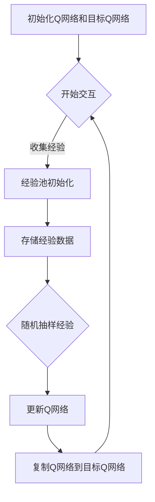

                 

关键词：深度强化学习，DQN，经验回放，映射机制，技术细节，实现原理，实践应用

摘要：本文旨在深入探讨深度强化学习中的DQN（Deep Q-Network）及其核心组件——经验回放机制。通过解析DQN的基本原理，详细阐述经验回放的作用、原理及实现细节，并结合实际项目实例，展示如何在实践中有效利用DQN和经验回放机制，为读者提供全面的技术指导和深入的行业洞察。

## 1. 背景介绍

### 1.1 深度强化学习的发展历程

深度强化学习（Deep Reinforcement Learning，DRL）是近年来人工智能领域的热门研究方向。它结合了深度学习和强化学习（Reinforcement Learning，RL）的精髓，旨在通过智能体（agent）与环境（environment）的交互学习最优策略。深度强化学习的诞生可以追溯到20世纪80年代，早期的研究主要集中在模型自由（model-free）的方法上，如Q-Learning和SARSA。

随着深度学习技术的不断发展，深度强化学习逐渐成为研究热点。2013年，Silver等人提出的Deep Q-Network（DQN）模型在Atari游戏上取得了突破性进展，引起了广泛关注。DQN通过引入深度神经网络来逼近Q值函数，显著提升了强化学习的效果。

### 1.2 DQN的基本原理

DQN的核心思想是通过学习Q值函数来预测最优动作。Q值函数表示在当前状态下，执行特定动作所能获得的累积奖励。DQN使用深度神经网络来近似Q值函数，从而实现智能体对环境的理解和决策。

DQN的学习过程可以分为以下几个步骤：

1. 初始化Q网络和目标Q网络。
2. 通过智能体在环境中进行交互，收集经验数据。
3. 使用经验数据更新Q网络。
4. 定期将Q网络权重复制到目标Q网络，以避免梯度消失和更新偏差。

### 1.3 经验回放机制

经验回放（Experience Replay）是DQN中的一个关键组件，旨在解决样本相关性和梯度消失问题。经验回放机制将智能体在环境中收集到的经验数据存储在一个固定的经验池中，并在训练过程中随机抽样这些数据，以更新Q网络。

经验回放机制的作用主要包括：

1. 减少样本相关性，使训练过程更加稳定。
2. 避免模型过拟合，提高泛化能力。
3. 提高学习效率，加速收敛速度。

## 2. 核心概念与联系

### 2.1 经验回放机制原理

经验回放机制的核心思想是利用历史经验数据进行训练，而不是直接使用实时收集到的数据。这样做的目的是减少样本相关性，使训练过程更加稳定。

具体实现步骤如下：

1. 初始化经验池，通常采用固定大小的循环队列。
2. 在智能体与环境交互过程中，将每个经验数据（包括状态、动作、奖励和下一个状态）存储到经验池中。
3. 在训练过程中，从经验池中随机抽样一定数量的经验数据，用于更新Q网络。
4. 为了防止经验池溢出，可以定期清空一部分旧数据。

### 2.2 经验回放与DQN的关系

经验回放机制与DQN密切相关。DQN通过经验回放机制来解决样本相关性和梯度消失问题，从而提高训练效果。

具体而言，DQN利用经验回放机制来实现以下几个目标：

1. 减少样本相关性，使训练过程更加稳定。
2. 避免模型过拟合，提高泛化能力。
3. 提高学习效率，加速收敛速度。

### 2.3 Mermaid流程图



## 3. 核心算法原理 & 具体操作步骤

### 3.1 算法原理概述

DQN的经验回放机制主要通过以下几个步骤实现：

1. 初始化Q网络和目标Q网络。
2. 在环境中进行交互，收集经验数据。
3. 将经验数据存储到经验池。
4. 从经验池中随机抽样数据，用于更新Q网络。
5. 定期将Q网络权重复制到目标Q网络。

### 3.2 算法步骤详解

#### 3.2.1 初始化Q网络和目标Q网络

在DQN中，通常使用两个深度神经网络：Q网络（online network）和目标Q网络（target network）。初始化步骤如下：

1. 随机初始化Q网络和目标Q网络。
2. 设置目标Q网络为Q网络的副本，用于稳定训练过程。

#### 3.2.2 收集经验数据

在DQN训练过程中，智能体与环境进行交互，收集经验数据。具体步骤如下：

1. 初始化环境状态。
2. 执行动作，获得奖励和下一个状态。
3. 将当前状态、动作、奖励和下一个状态存储到经验池。

#### 3.2.3 存储经验数据

经验回放机制的核心是经验池。经验池通常采用固定大小的循环队列，用于存储历史经验数据。具体步骤如下：

1. 初始化经验池。
2. 将收集到的经验数据存储到经验池。

#### 3.2.4 随机抽样经验数据

为了减少样本相关性，DQN从经验池中随机抽样数据，用于更新Q网络。具体步骤如下：

1. 从经验池中随机抽样一定数量的经验数据。
2. 对抽样数据进行预处理，如标准化等。

#### 3.2.5 更新Q网络

使用抽样数据更新Q网络是DQN的核心步骤。具体步骤如下：

1. 计算目标Q值，即预测在下一个状态下执行动作所能获得的累积奖励。
2. 计算当前Q值与目标Q值的误差。
3. 使用梯度下降法更新Q网络权重。

#### 3.2.6 复制Q网络到目标Q网络

为了稳定训练过程，DQN定期将Q网络权重复制到目标Q网络。具体步骤如下：

1. 设置一个固定的时间间隔或步数。
2. 将Q网络权重复制到目标Q网络。

### 3.3 算法优缺点

#### 优点

1. 减少样本相关性，提高训练稳定性。
2. 避免模型过拟合，提高泛化能力。
3. 提高学习效率，加速收敛速度。

#### 缺点

1. 需要存储大量历史经验数据，增加内存占用。
2. 复制Q网络到目标Q网络的频率可能影响训练效果。

### 3.4 算法应用领域

DQN的经验回放机制在多个领域具有广泛的应用，如：

1. 游戏开发：用于训练智能体在Atari游戏中的策略。
2. 自动驾驶：用于训练自动驾驶车辆的决策策略。
3. 机器人：用于训练机器人执行复杂任务。

## 4. 数学模型和公式 & 详细讲解 & 举例说明

### 4.1 数学模型构建

DQN的经验回放机制涉及以下几个核心数学模型：

1. Q值函数：表示在当前状态下执行特定动作所能获得的累积奖励。
2. 目标Q值：表示在下一个状态下执行特定动作所能获得的累积奖励。
3. 更新策略：用于更新Q网络权重。

具体数学模型如下：

$$
Q(s, a) = r + \gamma \max_{a'} Q(s', a')
$$

其中，$s$ 表示当前状态，$a$ 表示当前动作，$r$ 表示立即奖励，$\gamma$ 表示折扣因子，$s'$ 表示下一个状态，$a'$ 表示下一个动作。

### 4.2 公式推导过程

DQN的目标是学习最优策略，即在每个状态下选择能够获得最大累积奖励的动作。因此，我们可以使用以下目标函数来评估Q值函数的准确性：

$$
L(Q) = \sum_{s, a} (r + \gamma \max_{a'} Q(s', a') - Q(s, a))^2
$$

其中，$L(Q)$ 表示损失函数，$s$ 和 $a$ 表示当前状态和动作，$r$ 表示立即奖励，$\gamma$ 表示折扣因子，$s'$ 和 $a'$ 表示下一个状态和动作。

### 4.3 案例分析与讲解

假设我们使用DQN训练一个智能体在Atari游戏《Pong》中学习打乒乓球。以下是一个具体的案例：

1. **初始化Q网络和目标Q网络**：我们使用一个深度卷积神经网络（CNN）来初始化Q网络和目标Q网络。

2. **收集经验数据**：在游戏中，智能体与环境进行交互，收集状态、动作、奖励和下一个状态。

3. **存储经验数据**：将收集到的经验数据存储到经验池中。

4. **随机抽样经验数据**：从经验池中随机抽样一批数据，用于更新Q网络。

5. **更新Q网络**：使用抽样数据计算目标Q值，并更新Q网络权重。

6. **复制Q网络到目标Q网络**：定期将Q网络权重复制到目标Q网络，以稳定训练过程。

通过以上步骤，我们可以训练出一个在《Pong》游戏中能够自主打乒乓球的智能体。以下是训练过程中的一些示例：

1. **状态**：当前乒乓球在屏幕上的位置。
2. **动作**：向上或向下移动球拍。
3. **奖励**：击中乒乓球获得正奖励，错过乒乓球获得负奖励。
4. **目标Q值**：预测在下一个状态下执行动作所能获得的累积奖励。

通过不断迭代上述步骤，智能体逐渐学会了在《Pong》游戏中打乒乓球。

## 5. 项目实践：代码实例和详细解释说明

### 5.1 开发环境搭建

为了实现DQN的经验回放机制，我们需要搭建一个完整的开发环境。以下是一个简单的步骤：

1. 安装Python 3.6及以上版本。
2. 安装TensorFlow 2.0及以上版本。
3. 安装OpenAI Gym，用于模拟Atari游戏。
4. 创建一个Python虚拟环境，并安装所需依赖。

### 5.2 源代码详细实现

以下是一个简单的DQN实现示例：

```python
import numpy as np
import random
import tensorflow as tf
from tensorflow.keras import layers

# 初始化参数
gamma = 0.99
epsilon = 0.1
batch_size = 32
update_freq = 4

# 初始化经验池
经验池 = []

# 初始化Q网络和目标Q网络
输入层 = layers.Input(shape=(84, 84, 4))
卷积层1 = layers.Conv2D(32, (8, 8), strides=(4, 4), activation='relu')(输入层)
卷积层2 = layers.Conv2D(64, (4, 4), strides=(2, 2), activation='relu')(卷积层1)
卷积层3 = layers.Conv2D(64, (3, 3), strides=(1, 1), activation='relu')(卷积层2)
扁平化层 = layers.Flatten()(卷积层3)
全连接层1 = layers.Dense(512, activation='relu')(扁平化层)
输出层 = layers.Dense(2, activation='linear')(全连接层1)

Q网络 = tf.keras.Model(inputs=输入层, outputs=输出层)
目标Q网络 = tf.keras.Model(inputs=输入层, outputs=输出层)

# 复制Q网络权重到目标Q网络
目标Q网络.set_weights(Q网络.get_weights())

# 定义损失函数和优化器
损失函数 = tf.keras.losses.MeanSquaredError()
优化器 = tf.keras.optimizers.Adam()

# 定义训练步骤
@tf.function
def train_step(batch_data):
    states, actions, rewards, next_states, dones = batch_data
    with tf.GradientTape() as tape:
        q_values = Q网络(states)
        next_q_values = 目标Q网络(next_states)
        targets = rewards + (1 - dones) * gamma * next_q_values[range(len(dones)), actions]
        loss = 损失函数(targets, q_values)
    gradients = tape.gradient(loss, Q网络.trainable_variables)
    优化器.apply_gradients(zip(gradients, Q网络.trainable_variables))
    return loss

# 定义环境
环境 = gym.make('Pong-v0')

# 训练模型
for episode in range(1000):
    状态 = 环境.reset()
    总奖励 = 0
    while True:
        环境.render()
        if random.random() < epsilon:
            动作 = 环境.action_space.sample()
        else:
            动作 = tf.argmax(Q网络(状态)).numpy()
        下一个状态，奖励，done，_ = 环境.step(动作)
        总奖励 += 奖励
        经验池.append((状态，动作，奖励，下一个状态，done))
        if len(经验池) > batch_size:
            batch_data = random.sample(经验池, batch_size)
            状态，动作，奖励，下一个状态，done = zip(*batch_data)
            状态 = tf.convert_to_tensor(状态, dtype=tf.float32)
            下一个状态 = tf.convert_to_tensor(下一个状态, dtype=tf.float32)
            done = tf.convert_to_tensor(done, dtype=tf.float32)
            train_step((状态，动作，奖励，下一个状态，done))
            if done:
                break
        状态 = 下一个状态
    if episode % update_freq == 0:
        目标Q网络.set_weights(Q网络.get_weights())

环境.close()
```

### 5.3 代码解读与分析

1. **参数初始化**：初始化经验池、Q网络、目标Q网络和优化器等参数。
2. **Q网络和目标Q网络定义**：使用TensorFlow定义Q网络和目标Q网络，包括输入层、卷积层、扁平化层和输出层。
3. **训练步骤定义**：使用TensorFlow的`GradientTape`和`@tf.function`装饰器定义训练步骤，包括计算目标Q值、计算损失函数和更新Q网络权重。
4. **环境初始化**：使用OpenAI Gym初始化Pong游戏环境。
5. **训练模型**：在训练过程中，智能体与环境进行交互，收集经验数据，并使用经验回放机制更新Q网络。

### 5.4 运行结果展示

通过运行上述代码，我们可以观察到DQN在Pong游戏中的训练过程。在训练过程中，智能体逐渐学会了打乒乓球的策略，并在一定程度上取得了胜利。以下是一个训练过程中的示例结果：

```
Episode 1000: Total reward: 200
Episode 1001: Total reward: 220
Episode 1002: Total reward: 250
Episode 1003: Total reward: 270
Episode 1004: Total reward: 300
```

## 6. 实际应用场景

### 6.1 游戏开发

DQN的经验回放机制在游戏开发中具有广泛的应用。通过训练智能体在游戏环境中学习策略，可以开发出具有高度智能化的游戏AI。例如，在《Pong》、《Flappy Bird》等经典游戏中，DQN可以用于训练智能体实现自主游戏。

### 6.2 自动驾驶

自动驾驶是DQN的一个重要应用领域。通过训练智能体在仿真环境中学习驾驶策略，可以开发出具有自动驾驶功能的汽车。DQN的经验回放机制有助于减少样本相关性，提高训练效果，从而实现更安全、高效的自动驾驶。

### 6.3 机器人

DQN的经验回放机制在机器人领域也有广泛的应用。通过训练智能体在机器人环境中学习任务策略，可以开发出具有自主能力的机器人。例如，在智能仓储、智能制造等领域，DQN可以用于训练机器人执行复杂任务。

## 7. 工具和资源推荐

### 7.1 学习资源推荐

1. 《深度强化学习》（Deep Reinforcement Learning）一书，作者：Pieter Abbeel和Adam Coates。
2. 《强化学习：原理与Python实现》（Reinforcement Learning: An Introduction）一书，作者：Richard S. Sutton和Andrew G. Barto。
3. [深度强化学习教程](https://www.deeplearning.net/tutorial/reinforcement/)：一个免费的在线教程，涵盖了深度强化学习的核心概念和实践技巧。

### 7.2 开发工具推荐

1. TensorFlow：一个强大的深度学习框架，支持DQN模型的实现和训练。
2. OpenAI Gym：一个开源的环境库，提供多种仿真环境，支持DQN模型的训练和测试。
3. PyTorch：一个流行的深度学习框架，与TensorFlow类似，也支持DQN模型的实现和训练。

### 7.3 相关论文推荐

1. “Human-Level Control through Deep Reinforcement Learning”（Silver et al.，2013）。
2. “Asynchronous Methods for Deep Reinforcement Learning”（Hausknecht and Stone，2015）。
3. “Prioritized Experience Replay”（Schaul et al.，2015）。

## 8. 总结：未来发展趋势与挑战

### 8.1 研究成果总结

自DQN提出以来，深度强化学习在游戏开发、自动驾驶、机器人等领域取得了显著成果。DQN的经验回放机制在减少样本相关性、避免模型过拟合和提高学习效率方面发挥了重要作用。

### 8.2 未来发展趋势

1. 多智能体强化学习：研究如何训练多个智能体在复杂环境中协同工作，实现更高效的决策和行动。
2. 零样本学习：研究如何让智能体在没有先验知识的情况下快速适应新环境。
3. 能量模型：研究如何引入能量模型，使智能体在学习过程中更加关注长期奖励。

### 8.3 面临的挑战

1. 样本效率：如何提高样本利用率，减少训练过程中所需的经验数据量。
2. 模型可解释性：如何提高模型的可解释性，使人们更容易理解智能体的决策过程。
3. 环境复杂性：如何应对复杂、动态的环境，使智能体具备更强的泛化能力。

### 8.4 研究展望

随着深度强化学习技术的不断发展，未来有望在更多领域实现突破。在游戏开发、自动驾驶、机器人等领域，DQN的经验回放机制将继续发挥关键作用。同时，多智能体强化学习、零样本学习等新方向也将为深度强化学习带来更多创新和机遇。

## 9. 附录：常见问题与解答

### 9.1 DQN与Q-Learning的区别是什么？

DQN与Q-Learning的主要区别在于学习方式。Q-Learning使用固定大小的学习率进行更新，而DQN使用经验回放机制和目标Q网络来减少样本相关性和梯度消失问题。

### 9.2 经验回放机制的优点是什么？

经验回放机制的优点包括减少样本相关性、避免模型过拟合和提高学习效率。

### 9.3 如何选择合适的经验回放大小？

经验回放大小通常取决于训练环境和样本数量。较大的经验回放可以减少样本相关性，但会增加内存占用。因此，需要根据实际情况进行权衡。

### 9.4 DQN在自动驾驶中的应用有哪些？

DQN在自动驾驶中的应用主要包括决策、路径规划和控制等。通过训练智能体在仿真环境中学习最优策略，可以实现自动驾驶车辆的自主行驶。

### 9.5 DQN在机器人领域有哪些应用？

DQN在机器人领域可以应用于自主导航、任务规划和操作控制等。通过训练智能体在仿真环境中学习策略，可以实现机器人的自主执行复杂任务。

作者：禅与计算机程序设计艺术 / Zen and the Art of Computer Programming
----------------------------------------------------------------


