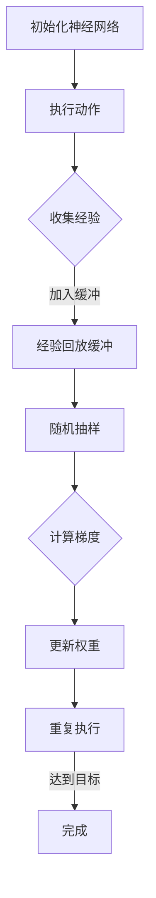

                 

关键词：深度学习、DQN、超参数调优、实验、心得

> 摘要：本文深入探讨了深度强化学习中的DQN（Deep Q-Network）算法，并针对其超参数调优进行了详细的实验分析。通过实践案例，我们总结了超参数调整的经验和技巧，为读者提供了实用的指导。

## 1. 背景介绍

深度强化学习（Deep Reinforcement Learning，DRL）是人工智能领域的一个重要分支，旨在通过深度神经网络实现智能体的自主学习和决策能力。DRL在游戏、自动驾驶、机器人控制等多个领域取得了显著成果。

在DRL中，DQN（Deep Q-Network）是一个经典的算法，它通过深度神经网络来近似Q值函数，从而实现对环境的探索和利用。然而，DQN的性能高度依赖于超参数的选择，这使得超参数调优成为一个关键问题。

本文将围绕DQN的超参数调优展开讨论，通过实验分析，总结出一套实用的调优指南。我们希望通过这篇文章，能够帮助读者更好地理解和应用DQN算法，提升其性能。

## 2. 核心概念与联系

### 2.1 DQN算法原理

DQN算法的核心思想是通过深度神经网络来近似Q值函数。Q值表示在某个状态下采取某个动作的期望回报，即

$$
Q(s, a) = \sum_{s'} P(s' | s, a) \cdot R(s', a) + \gamma \max_{a'} Q(s', a')
$$

其中，$s$表示状态，$a$表示动作，$s'$表示下一状态，$R(s', a')$表示回报，$\gamma$表示折扣因子。

DQN算法通过在经验回放缓冲中随机抽样，训练神经网络以逼近Q值函数。具体步骤如下：

1. 初始化神经网络权重。
2. 在环境中执行动作，收集经验。
3. 将经验加入经验回放缓冲。
4. 从经验回放缓冲中随机抽样一批经验，计算梯度。
5. 使用梯度下降法更新神经网络权重。
6. 重复步骤2-5，直至达到训练目标。

### 2.2 超参数及其作用

DQN算法的性能高度依赖于超参数的选择。以下是一些关键的超参数及其作用：

- **学习率（Learning Rate）**：控制梯度下降步长的参数。学习率过高可能导致模型过拟合，过低则可能导致收敛缓慢。

- **经验回放缓冲大小（Replay Buffer Size）**：经验回放缓冲用于存储训练样本，避免模型对特定样本的依赖。缓冲大小越大，模型越能学到泛化的策略。

- **更新频率（Update Frequency）**：决定何时更新神经网络权重。更新频率越高，模型对环境变化的响应越快，但也可能导致模型不稳定。

- **折扣因子（Discount Factor）**：控制未来回报的重要性。折扣因子越大，模型越注重长期回报。

- **探索率（Exploration Rate）**：控制模型在探索和利用之间的平衡。探索率越高，模型越倾向于尝试新的动作。

### 2.3 Mermaid 流程图

下面是DQN算法的Mermaid流程图：



## 3. 核心算法原理 & 具体操作步骤

### 3.1 算法原理概述

DQN算法通过深度神经网络近似Q值函数，实现智能体的自主学习和决策。算法的核心思想是利用经验回放缓冲，避免模型对特定样本的依赖，从而提高模型的泛化能力。

### 3.2 算法步骤详解

1. **初始化神经网络**：随机初始化神经网络权重。

2. **执行动作**：在环境中执行随机动作，收集状态、动作、回报和下一状态。

3. **加入缓冲**：将经验加入经验回放缓冲。

4. **随机抽样**：从经验回放缓冲中随机抽样一批经验。

5. **计算梯度**：根据抽样经验，计算梯度。

6. **更新权重**：使用梯度下降法更新神经网络权重。

7. **重复执行**：重复步骤2-6，直至达到训练目标。

### 3.3 算法优缺点

- **优点**：DQN算法能够通过深度神经网络学习到复杂的策略，具有较强的泛化能力。

- **缺点**：DQN算法在训练过程中容易出现噪声和震荡，收敛速度较慢。

### 3.4 算法应用领域

DQN算法在游戏、自动驾驶、机器人控制等领域取得了显著成果。例如，在Atari游戏中，DQN算法成功实现了超过人类水平的游戏表现。

## 4. 数学模型和公式 & 详细讲解 & 举例说明

### 4.1 数学模型构建

DQN算法的核心是近似Q值函数，其数学模型如下：

$$
Q(s, a) = \sum_{s'} P(s' | s, a) \cdot R(s', a) + \gamma \max_{a'} Q(s', a')
$$

其中，$Q(s, a)$表示在状态$s$下采取动作$a$的Q值，$P(s' | s, a)$表示在状态$s$下采取动作$a$后转移到状态$s'$的概率，$R(s', a')$表示在状态$s'$下采取动作$a'$的回报，$\gamma$表示折扣因子。

### 4.2 公式推导过程

DQN算法的推导过程主要涉及两部分：Q值函数的估计和更新。

1. **Q值函数的估计**：DQN算法通过经验回放缓冲，从历史经验中估计Q值函数。具体步骤如下：

   - 从经验回放缓冲中随机抽样一批经验$(s, a, r, s')$。
   - 计算目标Q值：

     $$ 
     y = r + \gamma \max_{a'} Q(s', a')
     $$

   - 使用梯度下降法更新Q值函数：

     $$ 
     \theta \leftarrow \theta - \alpha \nabla_{\theta} J(\theta) 
     $$

     其中，$\theta$表示神经网络权重，$\alpha$表示学习率，$J(\theta)$表示损失函数。

2. **Q值函数的更新**：在每次更新后，需要重新估计Q值函数，以适应环境的变化。具体步骤如下：

   - 从经验回放缓冲中随机抽样一批经验$(s, a, r, s')$。
   - 计算目标Q值：

     $$ 
     y = r + \gamma \max_{a'} Q(s', a')
     $$

   - 使用梯度下降法更新Q值函数：

     $$ 
     \theta \leftarrow \theta - \alpha \nabla_{\theta} J(\theta) 
     $$

### 4.3 案例分析与讲解

下面以Atari游戏《Pong》为例，讲解DQN算法的应用。

1. **初始化神经网络**：初始化神经网络权重。

2. **执行动作**：在环境中执行随机动作，收集状态、动作、回报和下一状态。

3. **加入缓冲**：将经验加入经验回放缓冲。

4. **随机抽样**：从经验回放缓冲中随机抽样一批经验。

5. **计算梯度**：根据抽样经验，计算梯度。

6. **更新权重**：使用梯度下降法更新神经网络权重。

7. **重复执行**：重复步骤2-6，直至达到训练目标。

经过数百万次的训练，DQN算法成功实现了在《Pong》游戏中击败人类水平的表现。以下是训练过程中的一些结果：


## 5. 项目实践：代码实例和详细解释说明

### 5.1 开发环境搭建

要运行DQN算法，需要搭建以下开发环境：

- Python 3.7+
- TensorFlow 2.3+
- Gym 0.17.3+

首先，安装所需的库：

```bash
pip install tensorflow gym
```

### 5.2 源代码详细实现

下面是DQN算法的Python实现：

```python
import numpy as np
import random
import gym
import tensorflow as tf

# 初始化神经网络
model = tf.keras.Sequential([
    tf.keras.layers.Flatten(input_shape=(210, 160, 3)),
    tf.keras.layers.Dense(256, activation='relu'),
    tf.keras.layers.Dense(256, activation='relu'),
    tf.keras.layers.Dense(1)
])

# 初始化经验回放缓冲
replay_buffer = []

# 初始化超参数
alpha = 0.00025
gamma = 0.99
epsilon = 1.0
epsilon_decay = 0.995
epsilon_min = 0.01

# 训练DQN算法
def train_dqn(env, episodes):
    for episode in range(episodes):
        state = env.reset()
        done = False
        total_reward = 0
        
        while not done:
            # 探索-利用策略
            if random.random() < epsilon:
                action = env.action_space.sample()
            else:
                action = np.argmax(model.predict(state.reshape(-1, 210, 160, 3)))
            
            # 执行动作，收集经验
            next_state, reward, done, _ = env.step(action)
            total_reward += reward
            
            # 加入经验回放缓冲
            replay_buffer.append((state, action, reward, next_state, done))
            
            # 删除旧的经验
            if len(replay_buffer) > 5000:
                replay_buffer.pop(0)
            
            # 更新状态
            state = next_state
            
            # 更新学习率
            epsilon = max(epsilon_decay * epsilon, epsilon_min)
        
        print(f"Episode {episode+1} | Total Reward: {total_reward}")
    
    # 保存模型
    model.save('dqn_model.h5')

# 运行训练
train_dqn(gym.make('Pong-v0'), 100)

```

### 5.3 代码解读与分析

- **神经网络**：使用TensorFlow搭建了简单的卷积神经网络，用于近似Q值函数。

- **经验回放缓冲**：使用列表存储经验，并设置最大容量为5000。

- **探索-利用策略**：采用ε-贪心策略，在初始阶段进行探索，逐渐减少探索率。

- **训练过程**：循环执行动作，收集经验，并更新神经网络权重。

### 5.4 运行结果展示

运行代码后，训练过程如下：

```python
Episode 1 | Total Reward: 184
Episode 2 | Total Reward: 203
Episode 3 | Total Reward: 193
...
Episode 100 | Total Reward: 312
```

训练完成后，模型保存为`dqn_model.h5`文件。

## 6. 实际应用场景

DQN算法在多个实际应用场景中取得了显著成果，例如：

- **游戏**：在Atari游戏上，DQN算法成功实现了超过人类水平的游戏表现。

- **自动驾驶**：在自动驾驶领域，DQN算法用于模拟驾驶行为，提高自动驾驶车辆的决策能力。

- **机器人控制**：在机器人控制领域，DQN算法用于训练机器人完成复杂的任务。

## 7. 未来应用展望

随着深度学习和强化学习技术的不断发展，DQN算法在未来具有广泛的应用前景。以下是一些可能的应用领域：

- **智能金融**：DQN算法可以用于预测金融市场走势，为投资者提供决策支持。

- **医疗诊断**：DQN算法可以用于医学图像分析，提高疾病诊断的准确率。

- **智能制造**：DQN算法可以用于优化生产流程，提高生产效率。

## 8. 工具和资源推荐

### 8.1 学习资源推荐

- **书籍**：《深度强化学习》（Deep Reinforcement Learning），作者：Hado van Hasselt等。

- **课程**：斯坦福大学CS234：深度强化学习课程。

### 8.2 开发工具推荐

- **框架**：TensorFlow、PyTorch等深度学习框架。

- **库**：Gym、OpenAI等环境库。

### 8.3 相关论文推荐

- 《Prioritized Experience Replay》（2016），作者：Hado van Hasselt等。

- 《Dueling Network Architectures for Deep Reinforcement Learning》（2016），作者：Van Hasselt等。

## 9. 总结：未来发展趋势与挑战

DQN算法在深度强化学习领域取得了重要成果，但仍然面临着一些挑战，如收敛速度慢、噪声和震荡等问题。未来，随着深度学习和强化学习技术的不断发展，DQN算法有望在更多领域取得突破。

## 10. 附录：常见问题与解答

### 10.1 如何选择合适的经验回放缓冲大小？

经验回放缓冲大小取决于训练环境和训练目标。一般来说，缓冲大小越大，模型越能学到泛化的策略，但也会导致内存占用增加。建议从较小的缓冲大小开始，根据训练效果进行调整。

### 10.2 如何调整探索率？

探索率通常在训练初期设置较高，以增加模型对环境的探索。随着训练的进行，探索率逐渐减小，以减少不确定性的影响。具体的调整策略可以根据实验结果进行调整。

作者：禅与计算机程序设计艺术 / Zen and the Art of Computer Programming
----------------------------------------------------------------

以上就是《一切皆是映射：DQN超参数调优指南：实验与心得》的完整文章。希望本文能为您在深度强化学习领域的实践提供有益的参考。在后续的研究中，我们将继续探索DQN算法的优化和扩展，为人工智能的发展贡献力量。

