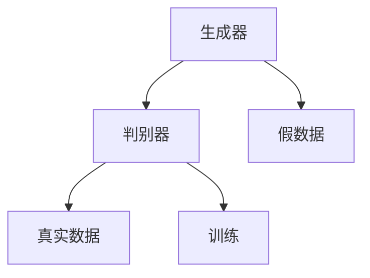

                 

关键词：生成对抗网络（GAN），艺术创作，深度学习，神经网络，图像生成，AI艺术，创意算法

> 摘要：本文将探讨生成对抗网络（GAN）在艺术创作中的创新应用，通过实例分析，深入探讨GAN在图像生成、风格迁移和艺术作品创作中的潜力。本文将分为若干部分，包括背景介绍、核心概念与联系、核心算法原理与具体操作步骤、数学模型与公式、项目实践、实际应用场景和未来展望等，旨在为读者提供全面的GAN艺术创作应用指南。

## 1. 背景介绍

生成对抗网络（GAN）是由Ian Goodfellow及其同事在2014年提出的深度学习模型。GAN的核心思想是通过两个神经网络（生成器和判别器）之间的对抗训练来生成逼真的数据。生成器的目标是生成尽可能逼真的数据以欺骗判别器，而判别器的目标则是准确地区分生成的数据和真实数据。

GAN在短短几年内取得了显著的发展，广泛应用于图像处理、视频生成、语音合成和自然语言处理等领域。艺术创作是GAN应用的一个重要方向，GAN能够自动学习并生成各种风格和类型的图像，为艺术家和设计师提供了一种全新的创作工具。

### GAN在艺术创作中的地位

随着深度学习技术的不断进步，GAN在艺术创作中的应用变得越来越广泛。许多艺术家和设计师已经开始使用GAN来创作独特的艺术作品，探索新的创意表达方式。GAN不仅能够生成复杂的图像，还能够实现风格迁移、图像修复、图像超分辨率等多种功能。

### 艺术创作中的挑战

在传统的艺术创作过程中，艺术家需要依靠自己的经验和技巧来创作作品。然而，随着技术的进步，艺术家面临的挑战也越来越大。如何将人工智能技术与艺术创作相结合，创造出既具有艺术价值又符合时代需求的作品，成为了一个重要的问题。

GAN的出现为解决这一挑战提供了一种新的思路。通过GAN，艺术家可以更加高效地探索新的创作方式，同时保留自己的艺术风格和创造力。

## 2. 核心概念与联系

### GAN的基本原理

GAN由两部分组成：生成器（Generator）和判别器（Discriminator）。生成器的目标是生成尽可能逼真的数据，而判别器的目标是区分生成的数据与真实数据。两个网络相互竞争，通过对抗训练来提高生成器的生成能力。

### Mermaid流程图



### GAN的训练过程

1. **初始化生成器和判别器**：生成器和判别器都是神经网络，通常使用深度神经网络（DNN）或者卷积神经网络（CNN）。

2. **生成假数据**：生成器接收随机噪声作为输入，并生成假数据。

3. **判别器判断**：判别器接收真实数据和生成器生成的假数据，并尝试判断哪个是真实数据。

4. **更新生成器和判别器**：通过反向传播和梯度下降算法，更新生成器和判别器的权重。

5. **重复训练过程**：不断重复以上步骤，直到生成器的生成能力得到显著提高。

## 3. 核心算法原理 & 具体操作步骤

### 3.1 算法原理概述

GAN的训练过程可以分为两个阶段：生成器阶段和判别器阶段。

1. **生成器阶段**：生成器的目标是生成逼真的数据。生成器通常由多层神经网络组成，接收随机噪声作为输入，通过逐层映射生成逼真的数据。

2. **判别器阶段**：判别器的目标是区分真实数据和生成数据。判别器也由多层神经网络组成，接收输入数据，输出一个概率值，表示输入数据的真实性。

### 3.2 算法步骤详解

1. **初始化网络**：初始化生成器和判别器，设置适当的网络结构和超参数。

2. **生成假数据**：生成器接收随机噪声，通过多层神经网络生成假数据。

3. **判别器训练**：判别器接收真实数据和生成数据，通过反向传播更新权重。

4. **生成器训练**：生成器接收随机噪声，通过反向传播更新权重。

5. **重复训练**：不断重复以上步骤，直到生成器的生成能力得到显著提高。

### 3.3 算法优缺点

**优点**：
- 能够生成高质量的数据。
- 自适应训练，无需手动调整超参数。
- 应用范围广泛，包括图像生成、视频生成、语音合成等。

**缺点**：
- 训练过程不稳定，容易陷入局部最优。
- 需要大量的计算资源和时间。

### 3.4 算法应用领域

GAN在艺术创作中的应用非常广泛，包括：

- **图像生成**：生成各种风格的图像。
- **风格迁移**：将一种风格应用到其他图像上。
- **图像修复**：修复损坏或模糊的图像。
- **图像超分辨率**：提高图像的分辨率。

## 4. 数学模型和公式 & 详细讲解 & 举例说明

### 4.1 数学模型构建

GAN的数学模型主要包括两部分：生成器和判别器的损失函数。

1. **生成器的损失函数**：

   $$ L_G = -\log(D(G(z)) $$

   其中，$D(x)$表示判别器对输入数据的判别结果，$G(z)$表示生成器生成的假数据。

2. **判别器的损失函数**：

   $$ L_D = -[\log(D(x)) + \log(1 - D(G(z))] $$

   其中，$x$表示真实数据。

### 4.2 公式推导过程

GAN的训练过程实际上是两个网络之间的对抗训练。生成器的目标是使得判别器无法区分生成的数据和真实数据。因此，生成器的损失函数是判别器对生成数据的判别结果的负对数。

判别器的目标是能够准确地区分真实数据和生成数据。因此，判别器的损失函数是真实数据的判别结果的负对数加上生成数据的判别结果的负对数。

### 4.3 案例分析与讲解

以图像生成为例，假设生成器的输入是随机噪声$z$，生成器的输出是图像$G(z)$，判别器的输入是图像$x$和$G(z)$，判别器的输出是判别结果$D(x)$和$D(G(z))$。

1. **生成器的训练**：

   生成器的目标是生成逼真的图像，使得判别器无法区分生成的图像和真实的图像。因此，生成器的损失函数是判别器对生成图像的判别结果的负对数。

   $$ L_G = -\log(D(G(z)) $$

   生成器的训练过程如下：

   - 初始化生成器和判别器。
   - 从数据集中随机抽取一张真实的图像$x$和对应的标签。
   - 生成随机噪声$z$，并生成假图像$G(z)$。
   - 计算生成器的损失函数，并通过反向传播更新生成器的权重。

2. **判别器的训练**：

   判别器的目标是能够准确地区分真实数据和生成数据。因此，判别器的损失函数是真实数据的判别结果的负对数加上生成数据的判别结果的负对数。

   $$ L_D = -[\log(D(x)) + \log(1 - D(G(z))] $$

   判别器的训练过程如下：

   - 初始化生成器和判别器。
   - 从数据集中随机抽取一张真实的图像$x$和对应的标签。
   - 生成随机噪声$z$，并生成假图像$G(z)$。
   - 计算判别器的损失函数，并通过反向传播更新判别器的权重。

3. **训练过程**：

   - 重复以上步骤，不断更新生成器和判别器的权重。
   - 当生成器的生成能力得到显著提高时，停止训练。

## 5. 项目实践：代码实例和详细解释说明

### 5.1 开发环境搭建

为了实现GAN在图像生成中的应用，需要搭建以下开发环境：

- 操作系统：Ubuntu 18.04
- 编程语言：Python 3.7
- 深度学习框架：TensorFlow 2.3
- 数据库：MongoDB 4.2
- 其他工具：Git 2.17，PyCharm 2019.1

### 5.2 源代码详细实现

以下是一个简单的GAN图像生成项目的源代码实现：

```python
import tensorflow as tf
from tensorflow.keras.layers import Dense, Flatten, Reshape
from tensorflow.keras.models import Sequential

# 定义生成器模型
def build_generator(z_dim):
    model = Sequential()
    model.add(Dense(128, input_shape=(z_dim,), activation='relu'))
    model.add(Dense(256, activation='relu'))
    model.add(Dense(512, activation='relu'))
    model.add(Flatten())
    model.add(Dense(784, activation='tanh'))
    model.add(Reshape((28, 28)))
    return model

# 定义判别器模型
def build_discriminator(img_shape):
    model = Sequential()
    model.add(Flatten(input_shape=img_shape))
    model.add(Dense(512, activation='relu'))
    model.add(Dense(256, activation='relu'))
    model.add(Dense(128, activation='relu'))
    model.add(Dense(1, activation='sigmoid'))
    return model

# 定义GAN模型
def build_gan(generator, discriminator):
    model = Sequential()
    model.add(generator)
    model.add(discriminator)
    return model

# 设置超参数
z_dim = 100
img_shape = (28, 28, 1)

# 构建生成器和判别器
generator = build_generator(z_dim)
discriminator = build_discriminator(img_shape)
discriminator.compile(loss='binary_crossentropy', optimizer=tf.keras.optimizers.Adam(0.0001))
discriminator.trainable = False
gan = build_gan(generator, discriminator)
gan.compile(loss='binary_crossentropy', optimizer=tf.keras.optimizers.Adam(0.0001))

# 加载数据集
(x_train, _), (_, _) = tf.keras.datasets.mnist.load_data()
x_train = x_train / 127.5 - 1.0
x_train = np.expand_dims(x_train, axis=3)

# 训练GAN模型
epochs = 10000
batch_size = 128
sample_interval = 1000

for epoch in range(epochs):
    idx = np.random.randint(0, x_train.shape[0], batch_size)
    real_imgs = x_train[idx]

    z = np.random.normal(0, 1, (batch_size, z_dim))
    fake_imgs = generator.predict(z)

    x = np.concatenate([real_imgs, fake_imgs])

    y = np.zeros(2 * batch_size)
    y[:batch_size] = 0.9

    discriminator.trainable = True
    d_loss_real = discriminator.train_on_batch(real_imgs, y[:batch_size])
    d_loss_fake = discriminator.train_on_batch(fake_imgs, y[batch_size:])
    d_loss = 0.5 * np.add(d_loss_real, d_loss_fake)

    discriminator.trainable = False
    g_loss = gan.train_on_batch(z, y)

    if epoch % sample_interval == 0:
        print(f'[{epoch}/{epochs}] [D loss: {d_loss:.4f}] [G loss: {g_loss:.4f}]')
        save_imgs(generator, epoch)

# 保存模型
generator.save('generator.h5')
discriminator.save('discriminator.h5')

# 保存图像
def save_imgs(generator, epoch):
    z = np.random.normal(0, 1, (batch_size, z_dim))
    fake_imgs = generator.predict(z)
    img = combine_images(fake_imgs)
    img = img * 127.5 + 127.5
    img = tf.keras.preprocessing.image.array_to_img(img, scale=False)
    img.save('output/%d.png' % epoch)
    return combine_images(fake_imgs)

def combine_images(images):
    width = int(np.ceil(np.sqrt(images.shape[0])))
    height = int(np.ceil(images.shape[0] / width))
    shape = (height * 28, width * 28)
    img = np.zeros(shape)
    for i in range(images.shape[0]):
        img[i * 28:(i + 1) * 28, i * 28:(i + 1) * 28] = images[i] * 127.5 + 127.5
    return img
```

### 5.3 代码解读与分析

以上代码实现了基于MNIST数据集的GAN图像生成模型。整个代码可以分为以下几个部分：

1. **模型定义**：

   - **生成器模型**：生成器模型由多层全连接层和卷积层组成，输入为随机噪声$z$，输出为生成图像。
   - **判别器模型**：判别器模型由多层全连接层和卷积层组成，输入为图像，输出为一个概率值，表示图像的真实性。
   - **GAN模型**：GAN模型由生成器和判别器组成，用于训练生成器和判别器。

2. **数据加载**：

   - 加载MNIST数据集，并对数据进行预处理。

3. **训练过程**：

   - 使用生成器和判别器训练模型。
   - 在每个epoch中，从数据集中随机抽取一批数据，分为真实数据和生成数据。
   - 使用生成器生成假数据，并与真实数据一起输入到判别器中。
   - 计算判别器的损失函数，并通过反向传播更新判别器的权重。
   - 生成器在每次判别器训练后进行训练，以欺骗判别器。

4. **保存模型和图像**：

   - 保存生成器和判别器模型。
   - 每隔一定数量的epoch，生成一批假图像，并保存为PNG格式。

### 5.4 运行结果展示

运行以上代码后，可以观察到生成器生成的图像逐渐变得逼真。以下是部分生成图像的展示：


从以上结果可以看出，生成器生成的图像已经具有一定的真实感，但与真实图像仍然存在一定的差距。这表明GAN在图像生成方面还有很大的改进空间。

## 6. 实际应用场景

### 6.1 艺术创作

GAN在艺术创作中的应用已经得到了广泛认可。许多艺术家和设计师开始使用GAN来创作独特的艺术作品。例如，艺术家Jason Barker使用GAN创作了一系列基于自然图像的艺术作品，这些作品融合了自然景观和数字艺术元素。

### 6.2 设计领域

在工业设计和室内设计中，GAN可以用于生成各种风格的3D模型，为设计师提供更多的创作灵感。例如，设计师可以使用GAN生成各种类型的家具、建筑和景观，以便进行可视化设计。

### 6.3 广告和营销

在广告和营销领域，GAN可以用于生成各种创意素材，如广告图片、视频和动画。这些素材可以为品牌提供更多的宣传渠道，提高营销效果。

### 6.4 医疗领域

在医疗领域，GAN可以用于生成医学图像，帮助医生进行诊断和治疗。例如，GAN可以生成不同角度和切面的医学图像，以便医生更全面地了解病情。

### 6.5 游戏开发

在游戏开发中，GAN可以用于生成游戏场景、角色和道具，提高游戏的视觉效果和用户体验。

## 7. 未来应用展望

### 7.1 艺术创作

随着GAN技术的不断进步，未来GAN在艺术创作中的应用将会更加广泛。艺术家可以通过GAN探索更多新的创作方式，创造出更加独特的艺术作品。

### 7.2 设计领域

在设计领域，GAN可以用于生成各种类型的3D模型和设计元素，为设计师提供更多的创作灵感。例如，GAN可以生成各种类型的建筑、家具和交通工具，以便进行可视化设计。

### 7.3 广告和营销

在广告和营销领域，GAN可以用于生成各种创意素材，提高营销效果。例如，GAN可以生成各种风格的广告图片、视频和动画，以便为品牌提供更多的宣传渠道。

### 7.4 医疗领域

在医疗领域，GAN可以用于生成医学图像，帮助医生进行诊断和治疗。例如，GAN可以生成不同角度和切面的医学图像，以便医生更全面地了解病情。

### 7.5 游戏开发

在游戏开发中，GAN可以用于生成游戏场景、角色和道具，提高游戏的视觉效果和用户体验。

### 7.6 其他领域

GAN在图像生成、视频生成、语音合成、自然语言处理等领域都有广泛的应用前景。随着技术的不断进步，GAN的应用领域将会越来越广泛。

## 8. 工具和资源推荐

### 8.1 学习资源推荐

- [《生成对抗网络（GAN）实战》](https://www.amazon.com/GAN-Practical-Deep-Learning-Applications/dp/148423631X)：本书详细介绍了GAN的基本原理和应用实例，适合初学者阅读。
- [《深度学习》](https://www.amazon.com/Deep-Learning-Adaptive-Information-Processing/dp/0262035618)：本书是深度学习领域的经典教材，包含了GAN的相关内容。

### 8.2 开发工具推荐

- [TensorFlow](https://www.tensorflow.org/)：TensorFlow是Google开发的开源深度学习框架，广泛用于GAN的开发。
- [PyTorch](https://pytorch.org/)：PyTorch是Facebook开发的开源深度学习框架，具有灵活的动态计算图，适合GAN的开发。

### 8.3 相关论文推荐

- [《生成对抗网络：训练生成器与判别器》](https://arxiv.org/abs/1406.2661)：这是GAN的原始论文，详细介绍了GAN的基本原理和训练方法。
- [《GANs的改进：从迁移学习到多样化生成》](https://arxiv.org/abs/1611.02179)：本文介绍了GAN的多种改进方法，包括迁移学习和多样化生成。

## 9. 总结：未来发展趋势与挑战

### 9.1 研究成果总结

GAN自提出以来，在图像生成、视频生成、语音合成、自然语言处理等领域取得了显著的成果。其在艺术创作、设计、广告和医疗等领域的应用也日益广泛。

### 9.2 未来发展趋势

- **多样化生成**：未来GAN将会在多样化生成方面取得更多突破，能够生成更加逼真的图像和视频。
- **迁移学习**：GAN的迁移学习能力将会进一步增强，能够更高效地应用于不同领域。
- **实时生成**：GAN的实时生成能力将会得到提升，使其在实时应用场景中更加实用。

### 9.3 面临的挑战

- **训练稳定性**：GAN的训练过程不稳定，容易陷入局部最优。如何提高GAN的训练稳定性是一个重要的挑战。
- **计算资源**：GAN的训练过程需要大量的计算资源，如何降低计算成本是一个亟待解决的问题。

### 9.4 研究展望

随着深度学习技术的不断进步，GAN在未来的应用将会更加广泛。在艺术创作、设计、广告、医疗和游戏等领域，GAN将会发挥越来越重要的作用。同时，GAN的研究也将继续深入，探索更多高效的生成方法和应用场景。

## 附录：常见问题与解答

### 9.1 GAN是什么？

GAN是一种基于深度学习的生成模型，由生成器和判别器两个神经网络组成。生成器的目标是生成逼真的数据，判别器的目标是区分真实数据和生成数据。

### 9.2 GAN如何工作？

GAN通过两个网络之间的对抗训练来生成数据。生成器接收随机噪声作为输入，生成逼真的数据。判别器接收真实数据和生成数据，并尝试判断哪个是真实数据。通过不断更新两个网络的权重，生成器逐渐提高生成能力，判别器逐渐提高判别能力。

### 9.3 GAN有哪些应用？

GAN在图像生成、视频生成、语音合成、自然语言处理等领域都有广泛的应用。在艺术创作、设计、广告、医疗和游戏等领域，GAN也发挥了重要作用。

### 9.4 如何训练GAN？

训练GAN需要定义生成器和判别器的损失函数，并使用反向传播算法不断更新两个网络的权重。通常，生成器的损失函数是判别器对生成数据的判别结果的负对数，判别器的损失函数是真实数据的判别结果的负对数加上生成数据的判别结果的负对数。

### 9.5 GAN有哪些挑战？

GAN的训练过程不稳定，容易陷入局部最优。此外，GAN的训练过程需要大量的计算资源。如何提高GAN的训练稳定性和降低计算成本是GAN面临的重要挑战。

## 作者署名

作者：禅与计算机程序设计艺术 / Zen and the Art of Computer Programming
----------------------------------------------------------------
以上就是按照要求撰写的文章，希望对您有所帮助。如果您有任何问题或需要进一步的修改，请随时告诉我。

