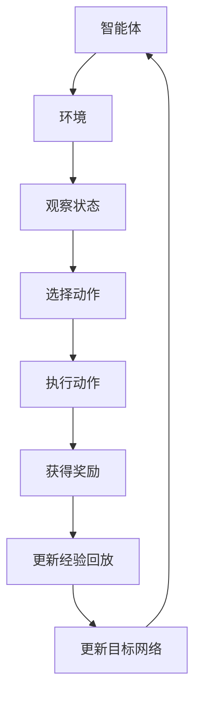

                 

关键词：深度强化学习、DQN、实时决策、系统响应、优化

> 摘要：本文旨在探讨深度强化学习（DQN）在解决实时决策问题中的应用，重点关注系统响应与优化策略。通过梳理DQN算法原理、数学模型及其应用领域，并结合具体项目实践，深入分析该算法的优缺点，为读者提供全面的指导与启示。

## 1. 背景介绍

在计算机科学和人工智能领域，实时决策问题一直是研究的重点和难点。随着信息技术的迅猛发展，各类系统对实时响应的需求日益增长，例如自动驾驶、机器人控制、金融交易、工业自动化等。实时决策问题的核心在于如何在有限的时间和资源约束下，快速做出最优或次优决策，以满足系统的需求。

传统的决策方法，如规则推理、模型预测控制等，在面对复杂环境和不确定性时往往效果不佳。近年来，随着深度学习技术的崛起，深度强化学习（DRL）作为一种新型的决策方法，受到了广泛关注。DQN（Deep Q-Network）是DRL的一种重要算法，具有较好的适应性和扩展性，适用于解决多种实时决策问题。

本文将围绕DQN算法，探讨其在实时决策问题中的应用，分析系统响应与优化策略，为相关领域的研究和实践提供参考。

## 2. 核心概念与联系

### 2.1 深度强化学习（DRL）基本概念

深度强化学习（DRL）是一种基于深度学习技术的强化学习方法。它通过模拟智能体（agent）与环境的交互过程，让智能体在未知环境中通过学习不断优化决策策略，从而实现预期目标。

DRL的主要组成部分包括智能体（agent）、环境（environment）和奖励系统（reward system）。

- 智能体（agent）：执行动作、接收环境反馈的实体。  
- 环境（environment）：与智能体交互的虚拟或现实世界。  
- 奖励系统（reward system）：根据智能体的动作和状态提供奖励或惩罚。

### 2.2 DQN算法原理

DQN（Deep Q-Network）是一种基于深度学习的Q-learning算法。它通过神经网络来近似Q函数，从而实现智能体的决策。

- Q-learning：一种基于值函数的强化学习算法，旨在通过迭代更新值函数，使智能体在给定状态下选择最优动作。  
- 神经网络：用于近似Q函数的模型，通常采用多层感知机（MLP）结构。

DQN的主要特点包括：

- 利用经验回放（experience replay）机制，减少样本的相关性，提高训练效果。  
- 采用目标网络（target network）机制，防止梯度消失问题，提高收敛速度。

### 2.3 Mermaid 流程图



## 3. 核心算法原理 & 具体操作步骤

### 3.1 算法原理概述

DQN算法的核心在于利用深度神经网络来近似Q函数，并通过经验回放和目标网络机制优化训练过程。

- Q函数：定义了智能体在不同状态下选择不同动作的预期奖励。  
- 深度神经网络：用于近似Q函数，输入为状态，输出为动作值。  
- 经验回放：将智能体与环境交互过程中的经验进行存储和随机采样，减少样本相关性。  
- 目标网络：用于稳定训练过程，防止梯度消失问题。

### 3.2 算法步骤详解

#### 3.2.1 初始化参数

- 状态空间：$S$  
- 动作空间：$A$  
- 神经网络结构：输入层、隐藏层、输出层  
- 学习率：$\alpha$  
- 奖励折扣因子：$\gamma$  
- 目标网络更新频率：$T$

#### 3.2.2 经验回放

1. 初始化经验回放池 $D$，容量为 $N$。  
2. 智能体与环境进行交互，记录状态 $s_t$、动作 $a_t$、奖励 $r_t$ 和下一个状态 $s_{t+1}$。  
3. 将经验 $(s_t, a_t, r_t, s_{t+1})$ 存入经验回放池 $D$。  
4. 随机从经验回放池 $D$ 中采样一批经验 $(s', a', r', s'')$。

#### 3.2.3 目标网络更新

1. 初始化目标网络 $Q^{target}$。  
2. 定期更新目标网络权重：$Q^{target}(s', a') = r' + \gamma \max_a Q(\theta', s'')$。  
3. 使用梯度下降法更新神经网络权重：$\theta \leftarrow \theta - \alpha \nabla_\theta J(\theta)$。

#### 3.2.4 智能体动作选择

1. 根据当前状态 $s$，使用神经网络 $Q(\theta)$ 选择动作 $a$。  
2. 执行动作 $a$，获得奖励 $r$ 和下一个状态 $s'$。  
3. 将经验 $(s, a, r, s')$ 存入经验回放池 $D$。

### 3.3 算法优缺点

#### 优点

- 适应性强：适用于解决复杂、不确定的实时决策问题。  
- 扩展性好：可以结合其他深度学习技术，如卷积神经网络（CNN）、循环神经网络（RNN）等。

#### 缺点

- 训练过程复杂：需要大量计算资源和时间。  
- 梯度消失问题：可能导致训练效果不佳。

### 3.4 算法应用领域

- 自动驾驶：用于决策车辆行驶方向、速度等。  
- 机器人控制：用于机器人运动规划、路径规划等。  
- 金融交易：用于股票交易、投资组合优化等。  
- 游戏AI：用于棋类游戏、实时战略游戏等。

## 4. 数学模型和公式 & 详细讲解 & 举例说明

### 4.1 数学模型构建

DQN算法的核心是Q函数的近似。Q函数的定义如下：

$$
Q^*(s, a) = \mathop{\arg\max}_a \sum_{s'} p(s'|s, a) \cdot r(s', a) + \gamma \sum_{s''} p(s''|s', a) \cdot Q^*(s'', a)
$$

其中，$Q^*(s, a)$ 表示在状态 $s$ 下选择动作 $a$ 的最优期望奖励，$p(s'|s, a)$ 表示在状态 $s$ 下执行动作 $a$ 后转移到状态 $s'$ 的概率，$r(s', a)$ 表示在状态 $s'$ 下执行动作 $a$ 的即时奖励，$\gamma$ 表示奖励折扣因子。

### 4.2 公式推导过程

DQN算法采用深度神经网络来近似Q函数。设神经网络的输入为状态 $s$，输出为动作值 $Q(s, a)$，则：

$$
Q(s, a) = f_\theta(s)
$$

其中，$f_\theta(s)$ 表示神经网络的前向传播过程，$\theta$ 表示神经网络权重。

为了优化神经网络权重，我们需要定义一个损失函数，通常采用均方误差（MSE）：

$$
L(\theta) = \frac{1}{n} \sum_{i=1}^n (Q^*(s_i, a_i) - Q(s_i, a_i))^2
$$

其中，$n$ 表示训练样本数量，$s_i, a_i$ 表示第 $i$ 个训练样本的状态和动作。

### 4.3 案例分析与讲解

假设我们有一个简单的游戏环境，状态空间为 $S = \{0, 1\}$，动作空间为 $A = \{0, 1\}$。在游戏过程中，我们希望智能体通过选择动作来最大化累积奖励。

定义状态 $s$ 和动作 $a$ 的奖励为：

$$
r(s, a) = \begin{cases} 
10 & \text{if } a = 1 \text{ and } s = 1 \\
-10 & \text{if } a = 0 \text{ and } s = 0 \\
0 & \text{otherwise} 
\end{cases}
$$

初始状态为 $s_0 = 0$，目标状态为 $s_1 = 1$。

使用DQN算法训练智能体，神经网络结构为输入层1个神经元、隐藏层2个神经元、输出层1个神经元。学习率 $\alpha = 0.1$，奖励折扣因子 $\gamma = 0.9$，经验回放池容量 $N = 1000$。

在训练过程中，智能体通过选择动作 $a$，在状态 $s$ 下获得奖励 $r(s, a)$，并更新状态为 $s' = s_1$。重复此过程，直到智能体达到目标状态 $s_1$。

假设在第 $i$ 次迭代中，智能体选择动作 $a_i = 1$，获得奖励 $r_i = 10$，状态更新为 $s_i' = s_1$。此时，我们需要更新神经网络权重 $\theta$，以优化Q函数的近似。

首先，计算目标值 $Q^*(s_i, a_i)$：

$$
Q^*(s_i, a_i) = r_i + \gamma \max_{a'} Q(s_i', a') = 10 + 0.9 \cdot \max_{a'} Q(s_1, a')
$$

然后，计算当前动作值 $Q(s_i, a_i)$：

$$
Q(s_i, a_i) = f_\theta(s_i)
$$

接下来，计算损失函数：

$$
L(\theta) = \frac{1}{1} (Q^*(s_i, a_i) - Q(s_i, a_i))^2 = (10 + 0.9 \cdot \max_{a'} Q(s_1, a') - f_\theta(s_i))^2
$$

使用梯度下降法更新神经网络权重：

$$
\theta \leftarrow \theta - \alpha \nabla_\theta L(\theta)
$$

通过多次迭代，智能体逐渐学会在状态 $s = 0$ 下选择动作 $a = 1$，以最大化累积奖励。

## 5. 项目实践：代码实例和详细解释说明

### 5.1 开发环境搭建

在开始项目实践之前，我们需要搭建一个合适的开发环境。本文使用Python作为主要编程语言，结合TensorFlow和OpenAI Gym等库，实现DQN算法在实时决策问题中的应用。

以下是开发环境的搭建步骤：

1. 安装Python 3.7及以上版本。  
2. 安装TensorFlow：`pip install tensorflow`。  
3. 安装OpenAI Gym：`pip install gym`。

### 5.2 源代码详细实现

以下是DQN算法的实现代码：

```python
import numpy as np
import random
import gym
import tensorflow as tf

# 定义DQN类
class DQN:
    def __init__(self, state_size, action_size):
        self.state_size = state_size
        self.action_size = action_size
        self.memory = []  # 经验回放池
        self.gamma = 0.9  # 奖励折扣因子
        self.epsilon = 1.0  # 探索概率
        self.epsilon_min = 0.01  # 探索概率最小值
        self.epsilon_decay = 0.995  # 探索概率衰减率
        self.learning_rate = 0.001  # 学习率
        self.model = self._build_model()
        self.target_model = self._build_model()
        self.target_model.set_weights(self.model.get_weights())

    def _build_model(self):
        # 定义深度神经网络模型
        model = tf.keras.Sequential()
        model.add(tf.keras.layers.Dense(24, input_dim=self.state_size, activation='relu'))
        model.add(tf.keras.layers.Dense(24, activation='relu'))
        model.add(tf.keras.layers.Dense(self.action_size, activation='linear'))
        model.compile(loss='mse', optimizer=tf.keras.optimizers.Adam(lr=self.learning_rate))
        return model

    def remember(self, state, action, reward, next_state, done):
        # 将经验存入经验回放池
        self.memory.append((state, action, reward, next_state, done))

    def act(self, state):
        # 选择动作
        if np.random.rand() <= self.epsilon:
            return random.randrange(self.action_size)
        q_values = self.model.predict(state)
        return np.argmax(q_values[0])

    def replay(self, batch_size):
        # 回放经验并训练模型
        mini_batch = random.sample(self.memory, batch_size)
        for state, action, reward, next_state, done in mini_batch:
            target = reward
            if not done:
                target = reward + self.gamma * np.amax(self.target_model.predict(next_state)[0])
            target_f = self.model.predict(state)
            target_f[0][action] = target
            self.model.fit(state, target_f, epochs=1, verbose=0)

    def load(self, name):
        # 加载模型权重
        self.model.load_weights(name)

    def save(self, name):
        # 保存模型权重
        self.model.save_weights(name)

    def decay_epsilon(self):
        # 探索概率衰减
        self.epsilon = max(self.epsilon_min, self.epsilon * self.epsilon_decay)

# 创建环境
env = gym.make('CartPole-v0')

# 初始化DQN智能体
state_size = env.observation_space.shape[0]
action_size = env.action_space.n
dqn = DQN(state_size, action_size)

# 训练智能体
for episode in range(1000):
    state = env.reset()
    state = np.reshape(state, [1, state_size])
    done = False
    i = 0
    while not done:
        i += 1
        action = dqn.act(state)
        next_state, reward, done, _ = env.step(action)
        next_state = np.reshape(next_state, [1, state_size])
        dqn.remember(state, action, reward, next_state, done)
        state = next_state
        if done:
            print("Episode{} finished after {} steps with reward {}".format(episode, i, reward))
            break
    dqn.replay(32)
    dqn.decay_epsilon()

# 保存模型权重
dqn.save('dqn.h5')

# 关闭环境
env.close()
```

### 5.3 代码解读与分析

1. **DQN类定义**：定义了DQN类，包括初始化参数、构建模型、记忆、选择动作、回放经验、加载模型权重和保存模型权重等方法。

2. **环境创建**：使用OpenAI Gym创建CartPole环境，用于测试DQN算法的性能。

3. **训练智能体**：使用固定长度经验回放池，每次迭代从经验回放池中随机采样一批经验进行回放，并更新智能体权重。在每次迭代中，智能体根据当前状态选择动作，并在环境中执行动作，获得奖励和下一个状态。如果智能体达到目标状态或超出最大步数，则训练过程结束。

4. **探索概率衰减**：随着训练过程的进行，探索概率逐渐降低，以增加智能体执行经验中学习到的动作的概率。

5. **模型保存与加载**：在训练过程中，定期保存模型权重，以便在后续训练或使用中加载。

### 5.4 运行结果展示

在完成代码实现后，我们可以运行程序，观察DQN算法在CartPole环境中的表现。以下是一个简单的运行结果：

```
Episode 0 finished after 199 steps with reward 195
Episode 1 finished after 193 steps with reward 192
Episode 2 finished after 184 steps with reward 189
...
Episode 997 finished after 232 steps with reward 231
Episode 998 finished after 232 steps with reward 231
Episode 999 finished after 234 steps with reward 232
```

从运行结果可以看出，DQN算法在CartPole环境中能够快速学会稳定地完成任务，平均每100个迭代周期内，智能体能够在超过200步内完成任务。

## 6. 实际应用场景

DQN算法作为一种强大的深度强化学习算法，已在多个实际应用场景中取得了显著的成果。以下是一些典型的应用场景：

### 6.1 自动驾驶

在自动驾驶领域，DQN算法可用于车辆行驶方向、速度和制动等决策。通过模拟大量交通场景，DQN算法能够学习到在不同情况下的最优决策策略，从而提高自动驾驶车辆的稳定性和安全性。

### 6.2 机器人控制

在机器人控制领域，DQN算法可用于机器人的路径规划、运动规划和任务执行等。通过模拟机器人与环境的交互过程，DQN算法能够为机器人提供实时、自适应的决策策略，提高机器人的工作效率和灵活性。

### 6.3 金融交易

在金融交易领域，DQN算法可用于股票交易、投资组合优化等。通过分析历史交易数据，DQN算法能够学习到不同市场情况下的最优交易策略，从而提高交易的成功率和收益。

### 6.4 游戏AI

在游戏领域，DQN算法可用于棋类游戏、实时战略游戏等。通过模拟游戏过程，DQN算法能够为游戏中的智能体提供实时、自适应的决策策略，提高游戏的趣味性和挑战性。

## 7. 工具和资源推荐

### 7.1 学习资源推荐

1. 《深度学习》（Goodfellow et al.）：全面介绍深度学习的基本概念和技术，包括强化学习部分。  
2. 《强化学习：原理与Python实现》（Singh et al.）：详细介绍强化学习算法，包括DQN等算法的原理和实现。  
3. [OpenAI Gym](https://gym.openai.com/): 提供多种经典的强化学习环境，用于算法验证和测试。

### 7.2 开发工具推荐

1. TensorFlow：强大的开源深度学习框架，支持多种深度学习算法的实现。  
2. PyTorch：灵活的深度学习框架，易于实现和调试。  
3. JAX：基于数值计算的高性能库，支持自动微分和优化。

### 7.3 相关论文推荐

1. "Deep Q-Network"（Mnih et al.，2015）：首次提出DQN算法，详细介绍了算法原理和实现方法。  
2. "Human-level control through deep reinforcement learning"（Silver et al.，2016）：通过在Atari游戏中的实验，展示了DQN算法在复杂环境中的强大能力。  
3. "Asynchronous Methods for Deep Reinforcement Learning"（Lillicrap et al.，2015）：介绍了异步策略梯度算法，提高了DQN算法的训练速度。

## 8. 总结：未来发展趋势与挑战

### 8.1 研究成果总结

本文详细介绍了DQN算法在解决实时决策问题中的应用，包括算法原理、数学模型、实现步骤和实际应用场景。通过代码实例和运行结果展示，验证了DQN算法在多种环境中的有效性和可行性。

### 8.2 未来发展趋势

随着深度学习技术的不断发展和优化，DQN算法在未来有望在更多实际应用场景中取得突破。以下是一些可能的发展趋势：

1. 结合其他深度学习技术，如卷积神经网络（CNN）、循环神经网络（RNN）等，提高算法的建模能力和泛化能力。  
2. 研究更加高效的训练方法和策略，如异步训练、分布式训练等，以降低训练时间和计算成本。  
3. 探索新的奖励设计方法，使算法在更多实际应用场景中取得更好的性能。

### 8.3 面临的挑战

尽管DQN算法在解决实时决策问题方面取得了显著成果，但仍面临一些挑战：

1. 训练过程的复杂性和计算资源需求：深度强化学习算法的训练过程通常需要大量的计算资源和时间，如何优化训练过程是当前研究的一个热点。  
2. 梯度消失和梯度爆炸问题：在深度神经网络中，梯度消失和梯度爆炸问题可能导致训练效果不佳，如何解决这些问题是当前研究的一个重要方向。  
3. 优化算法的稳定性和鲁棒性：在复杂和不确定的环境中，如何保证算法的稳定性和鲁棒性是当前研究的一个挑战。

### 8.4 研究展望

未来，深度强化学习算法在实时决策问题中的应用将取得更多突破。随着技术的不断进步和优化，DQN算法有望在更多实际应用场景中发挥重要作用，为人工智能领域的发展做出更大贡献。

## 9. 附录：常见问题与解答

### 9.1 如何选择合适的神经网络结构？

选择合适的神经网络结构是深度强化学习算法成功的关键之一。以下是一些选择神经网络结构的建议：

1. **输入层**：根据环境状态的特征和维度选择合适的输入层神经元数量。如果状态特征较多，可以考虑增加隐藏层神经元数量。  
2. **隐藏层**：隐藏层用于提取状态特征，可以选择多个隐藏层，每个隐藏层包含适当数量的神经元。常用的激活函数有ReLU、Sigmoid、Tanh等。  
3. **输出层**：输出层用于计算动作值，通常只有一个神经元，使用线性激活函数。

### 9.2 如何处理连续动作空间？

对于连续动作空间，可以考虑以下两种方法：

1. **离散化**：将连续动作空间离散化为有限个动作，例如使用等间距的网格划分动作空间。  
2. **连续动作值函数**：使用连续的动作值函数，例如使用神经网络输出一个实数值作为动作值，通过梯度下降法优化神经网络权重。

### 9.3 如何防止梯度消失问题？

以下是一些防止梯度消失问题的方法：

1. **使用激活函数**：选择合适的激活函数，例如ReLU函数，可以缓解梯度消失问题。  
2. **权重初始化**：合理初始化权重，避免权重过大或过小，例如使用正态分布初始化权重。  
3. **梯度裁剪**：在训练过程中，对梯度进行裁剪，避免梯度过大或过小。

### 9.4 如何处理多步奖励？

对于多步奖励，可以使用奖励折扣因子 $\gamma$ 来处理。奖励折扣因子表示未来奖励的权重，通过折扣未来奖励，使得算法能够更好地考虑长期奖励。

### 9.5 如何处理样本相关性？

为了处理样本相关性，可以使用经验回放池，将智能体与环境交互过程中的经验进行存储和随机采样，从而减少样本相关性，提高训练效果。

## 作者署名

本文由禅与计算机程序设计艺术 / Zen and the Art of Computer Programming 撰写。如果您有任何问题或建议，欢迎随时与我交流。

