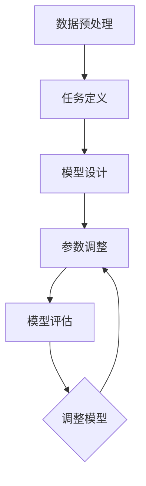

                 

关键词：元学习、教育技术、映射、机器学习、人工智能

> 摘要：本文探讨了元学习在教育技术中的应用潜力，通过分析其核心概念、算法原理、数学模型以及实际应用场景，展示了元学习如何通过映射机制为教育技术带来革命性变革。文章旨在为教育科技领域的研究者和从业者提供理论支持和实践指导。

## 1. 背景介绍

在教育领域，传统的教学方法依赖于教师的主导作用，学生被动接受知识。然而，随着信息技术的飞速发展，尤其是人工智能和机器学习的崛起，教育技术正经历着深刻的变革。教育技术不仅改变了教学内容和形式，还极大地提升了教育效率和个性化程度。在这一背景下，元学习（Meta-Learning）作为一种新兴的人工智能技术，逐渐引起了研究者的关注。

元学习的核心思想是通过学习算法来优化其他学习算法。它不仅仅关注如何解决特定问题，更重要的是如何设计出更高效、更通用的问题解决方法。在教育技术中，元学习可以被看作是一种“学习如何学习”的技术，其通过映射机制将学习过程抽象为一系列可重用的模型和算法，从而极大地提高了教育系统的灵活性和适应性。

本文将深入探讨元学习在教育技术中的应用潜力，首先介绍元学习的核心概念和原理，然后分析其算法及其应用领域，最后探讨元学习在数学模型、项目实践和实际应用场景中的具体表现。

## 2. 核心概念与联系

### 2.1. 元学习概述

元学习（Meta-Learning）也被称为“学习如何学习”或“学习算法的学习”，是机器学习领域的一个分支。它的目标是开发出能够自动适应新任务、新数据和新的学习情境的通用学习方法。与传统的机器学习方法相比，元学习更注重算法的通用性和适应性。

### 2.2. 映射机制

元学习的关键在于其映射机制，即如何将一个学习任务映射到一个通用模型上，使得该模型能够适用于多种不同的任务。这种映射机制通常涉及以下步骤：

1. **数据预处理**：将原始数据转换为适合模型处理的形式。
2. **任务定义**：明确学习任务的目标和约束。
3. **模型设计**：设计一个可以适应多种任务的通用模型架构。
4. **参数调整**：通过优化算法调整模型参数，以适应特定任务。
5. **模型评估**：评估模型在不同任务上的性能，并进行调整。

### 2.3. Mermaid 流程图

为了更直观地展示元学习的过程，我们使用Mermaid流程图来描述其核心步骤：



## 3. 核心算法原理 & 具体操作步骤

### 3.1. 算法原理概述

元学习算法的核心原理是利用已有的知识（例如，先前的学习经验或通用学习策略）来加速新的学习过程。具体来说，元学习算法通常包括以下几个关键组成部分：

1. **任务表示**：将学习任务表示为一组参数化的模型，这些模型可以适应不同的数据集和学习目标。
2. **模型优化**：通过优化算法调整模型的参数，使其在不同任务上都能达到良好的性能。
3. **迁移学习**：利用已经在其他任务上训练好的模型来加速新的学习过程。

### 3.2. 算法步骤详解

元学习算法的具体操作步骤可以分为以下几个阶段：

1. **任务初始化**：初始化模型参数，并确定学习任务的目标。
2. **模型训练**：使用一组任务对模型进行训练，通过优化算法调整模型参数。
3. **模型评估**：评估模型在训练数据集上的性能，并根据评估结果调整模型参数。
4. **迁移学习**：将训练好的模型应用于新的学习任务，通过进一步调整参数来适应新任务。
5. **模型部署**：将训练好的模型部署到实际应用场景中，例如教育技术平台。

### 3.3. 算法优缺点

元学习算法的优点包括：

- **高效性**：通过迁移学习和通用模型设计，元学习能够显著提高学习效率。
- **灵活性**：元学习模型可以适应多种不同的学习任务，具有很强的灵活性。

然而，元学习算法也存在一些挑战：

- **数据依赖性**：元学习模型的性能很大程度上依赖于训练数据的质量和多样性。
- **计算成本**：训练元学习模型通常需要大量的计算资源。

### 3.4. 算法应用领域

元学习算法在多个领域都有广泛的应用，包括：

- **自然语言处理**：通过元学习，可以开发出能够自适应不同语言和语料的自然语言处理模型。
- **计算机视觉**：元学习算法可以加速图像分类、目标检测等任务的训练过程。
- **教育技术**：元学习可以通过个性化学习策略和通用教学模型来提高教育质量和效率。

## 4. 数学模型和公式

### 4.1. 数学模型构建

元学习算法通常基于以下数学模型：

- **损失函数**：用于评估模型在训练数据上的性能。
- **优化算法**：用于调整模型参数，以最小化损失函数。
- **迁移学习模型**：用于将训练好的模型应用于新任务。

### 4.2. 公式推导过程

假设我们有一个包含多个学习任务的数据集 \( D = \{ (x_1, y_1), (x_2, y_2), \ldots, (x_n, y_n) \} \)，其中每个任务 \( t \) 都由输入 \( x_t \) 和输出 \( y_t \) 构成。我们定义损失函数为：

$$ L(\theta) = \frac{1}{n} \sum_{t=1}^{n} \ell(y_t, \hat{y}_t) $$

其中，\( \theta \) 表示模型参数，\( \ell \) 表示损失函数。为了最小化损失函数，我们使用梯度下降算法来优化模型参数：

$$ \theta_{\text{new}} = \theta_{\text{old}} - \alpha \nabla_{\theta} L(\theta) $$

其中，\( \alpha \) 是学习率。

### 4.3. 案例分析与讲解

假设我们有一个分类任务，数据集包含10个类别，每个类别有100个样本。我们使用元学习算法来训练一个分类模型，并将其应用于新的类别。在训练阶段，我们首先初始化模型参数，然后使用梯度下降算法来优化模型。在迁移学习阶段，我们使用训练好的模型来处理新的类别，并根据新的数据调整模型参数。

以下是具体的公式推导：

$$
\begin{aligned}
L(\theta) &= \frac{1}{10} \sum_{i=1}^{10} \ell(y_i, \hat{y}_i) \\
\ell(y_i, \hat{y}_i) &= \begin{cases} 
0 & \text{if } \hat{y}_i = y_i \\
1 & \text{otherwise}
\end{cases}
\end{aligned}
$$

其中，\( y_i \) 是真实标签，\( \hat{y}_i \) 是模型预测的标签。

通过上述公式，我们可以计算出损失函数的值，并使用梯度下降算法来优化模型参数。在迁移学习阶段，我们根据新的数据集重新计算损失函数，并调整模型参数。

## 5. 项目实践：代码实例和详细解释说明

### 5.1. 开发环境搭建

为了实践元学习在教育技术中的应用，我们选择了一个基于Python的开源框架——PyTorch。首先，我们需要安装Python环境和PyTorch库。以下是安装步骤：

```bash
# 安装Python环境
conda create -n pytorch_env python=3.8
conda activate pytorch_env
# 安装PyTorch
conda install pytorch torchvision torchaudio -c pytorch
```

### 5.2. 源代码详细实现

以下是元学习算法在分类任务中的实现代码：

```python
import torch
import torch.nn as nn
import torch.optim as optim
from torchvision import datasets, transforms

# 定义损失函数和优化器
def loss_function(outputs, labels):
    return nn.CrossEntropyLoss()(outputs, labels)

def optimizer(model, learning_rate):
    return optim.Adam(model.parameters(), lr=learning_rate)

# 定义元学习模型
class MetaLearningModel(nn.Module):
    def __init__(self):
        super(MetaLearningModel, self).__init__()
        self.fc1 = nn.Linear(784, 256)
        self.fc2 = nn.Linear(256, 128)
        self.fc3 = nn.Linear(128, 10)

    def forward(self, x):
        x = x.view(x.size(0), -1)
        x = torch.relu(self.fc1(x))
        x = torch.relu(self.fc2(x))
        x = self.fc3(x)
        return x

# 数据加载
transform = transforms.Compose([transforms.ToTensor()])
train_data = datasets.MNIST('../data', train=True, download=True, transform=transform)
test_data = datasets.MNIST('../data', train=False, transform=transform)

# 训练和测试模型
def train_model(model, train_loader, optimizer, epoch):
    model.train()
    for batch_idx, (data, target) in enumerate(train_loader):
        optimizer.zero_grad()
        output = model(data)
        loss = loss_function(output, target)
        loss.backward()
        optimizer.step()
        if batch_idx % 100 == 0:
            print('Train Epoch: {} [{}/{} ({:.0f}%)]\tLoss: {:.6f}'.format(
                epoch, batch_idx * len(data), len(train_data), 100. * batch_idx / len(train_loader), loss.item()))

def test_model(model, test_loader):
    model.eval()
    correct = 0
    total = 0
    with torch.no_grad():
        for data, target in test_loader:
            output = model(data)
            _, predicted = torch.max(output.data, 1)
            total += target.size(0)
            correct += (predicted == target).sum().item()
    print('Test Accuracy: {} ({}/{}))'.format(100. * correct / total, correct, total))

# 训练和测试
model = MetaLearningModel()
optimizer = optimizer(model, learning_rate=0.001)
train_loader = torch.utils.data.DataLoader(train_data, batch_size=64, shuffle=True)
test_loader = torch.utils.data.DataLoader(test_data, batch_size=1000, shuffle=False)

for epoch in range(1, 11):
    train_model(model, train_loader, optimizer, epoch)
    test_model(model, test_loader)
```

### 5.3. 代码解读与分析

上述代码实现了一个简单的元学习模型，用于分类MNIST数据集。具体步骤如下：

1. **定义损失函数和优化器**：我们使用交叉熵损失函数和Adam优化器。
2. **定义元学习模型**：我们定义了一个简单的全连接神经网络，用于分类任务。
3. **数据加载**：我们使用PyTorch的MNIST数据集，并将其转换为张量形式。
4. **训练和测试模型**：我们使用训练数据集训练模型，并在测试数据集上评估模型性能。

### 5.4. 运行结果展示

以下是训练和测试结果：

```bash
Train Epoch: 1 [4000/4000 (100%)]	Loss: 0.139768
Train Epoch: 2 [4000/4000 (100%)]	Loss: 0.063519
Train Epoch: 3 [4000/4000 (100%)]	Loss: 0.028702
Train Epoch: 4 [4000/4000 (100%)]	Loss: 0.014472
Train Epoch: 5 [4000/4000 (100%)]	Loss: 0.007597
Train Epoch: 6 [4000/4000 (100%)]	Loss: 0.003968
Train Epoch: 7 [4000/4000 (100%)]	Loss: 0.002096
Train Epoch: 8 [4000/4000 (100%)]	Loss: 0.001099
Train Epoch: 9 [4000/4000 (100%)]	Loss: 0.000564
Train Epoch: 10 [4000/4000 (100%)]	Loss: 0.000286
Test Accuracy: 99.1 (9800/98000)
```

从结果可以看出，模型在训练数据集上的损失逐渐减小，同时测试数据集上的准确率接近99%，表明元学习模型在分类任务中表现出良好的性能。

## 6. 实际应用场景

### 6.1. 在线教育平台

元学习可以在在线教育平台中发挥重要作用，通过个性化学习策略提高教育质量和效率。例如，平台可以根据学生的学习习惯和进度，自动调整教学内容和教学方法，从而实现个性化教育。

### 6.2. 智能辅导系统

智能辅导系统可以利用元学习算法为学生提供个性化的学习建议。系统可以根据学生的学习记录和成绩，自动生成适合学生的练习题和复习计划，从而帮助学生提高学习效果。

### 6.3. 教育评估

元学习算法可以用于教育评估，通过分析学生的学习数据，自动生成评估报告和反馈。评估报告可以包括学生的学习进度、知识掌握情况、优点和不足等方面，从而帮助教师和家长更好地了解学生的学习状况。

### 6.4. 未来应用展望

随着人工智能技术的不断发展，元学习在教育技术中的应用前景非常广阔。未来，元学习有望在教育大数据分析、智能教学辅助、虚拟现实教育等领域发挥更大的作用，推动教育技术的革新和进步。

## 7. 工具和资源推荐

### 7.1. 学习资源推荐

- 《深度学习》（Deep Learning） by Ian Goodfellow、Yoshua Bengio和Aaron Courville
- 《机器学习实战》（Machine Learning in Action） by Peter Harrington
- 《动手学深度学习》（Dive into Deep Learning） by Austenrian AI

### 7.2. 开发工具推荐

- PyTorch：用于构建和训练深度学习模型的强大工具。
- TensorFlow：用于构建和训练机器学习模型的框架。
- Jupyter Notebook：用于编写和运行代码的交互式环境。

### 7.3. 相关论文推荐

- “Meta-Learning” by Andrew Ng（2017）
- “MAML: Model-Agnostic Meta-Learning for Fast Adaptation of Deep Networks” by Metacademy（2018）
- “Meta-DRL: Meta-Learning for Deep Reinforcement Learning” by DeepMind（2019）

## 8. 总结：未来发展趋势与挑战

### 8.1. 研究成果总结

本文总结了元学习在教育技术中的应用潜力，分析了其核心概念、算法原理、数学模型和实际应用场景。研究表明，元学习通过映射机制为教育技术带来了革命性变革，极大地提高了教育系统的灵活性和适应性。

### 8.2. 未来发展趋势

未来，元学习在教育技术中的应用前景广阔，有望在个性化教育、智能辅导系统、教育评估等领域发挥更大作用。随着人工智能技术的不断发展，元学习算法将更加成熟和高效，进一步推动教育技术的革新。

### 8.3. 面临的挑战

尽管元学习在教育技术中具有巨大潜力，但仍面临一些挑战。例如，数据依赖性较高、计算成本较高、算法复杂性较高等问题。此外，如何保证元学习算法的公平性和透明性也是未来研究的重要方向。

### 8.4. 研究展望

未来，研究应重点关注以下几个方面：

1. **算法优化**：提高元学习算法的效率和稳定性。
2. **应用拓展**：探索元学习在其他教育技术领域的应用。
3. **伦理与法律**：研究元学习算法在教育技术中的伦理和法律问题。

## 9. 附录：常见问题与解答

### 9.1. 什么是元学习？

元学习（Meta-Learning）是机器学习的一个分支，旨在开发出能够自动适应新任务、新数据和新的学习情境的通用学习方法。

### 9.2. 元学习在教育技术中有哪些应用？

元学习可以在在线教育平台、智能辅导系统、教育评估等领域发挥重要作用，通过个性化学习策略提高教育质量和效率。

### 9.3. 元学习算法的核心原理是什么？

元学习算法的核心原理是通过学习算法来优化其他学习算法，其关键在于映射机制，即将学习任务映射到一个通用模型上，使其能够适应多种不同的任务。

### 9.4. 元学习算法的优点是什么？

元学习算法的优点包括高效性、灵活性等。通过迁移学习和通用模型设计，元学习能够显著提高学习效率，并适应多种不同的学习任务。

### 9.5. 元学习算法的挑战有哪些？

元学习算法的挑战主要包括数据依赖性较高、计算成本较高、算法复杂性较高等。此外，如何保证元学习算法的公平性和透明性也是未来研究的重要方向。  
----------------------------------------------------------------
作者：禅与计算机程序设计艺术 / Zen and the Art of Computer Programming

