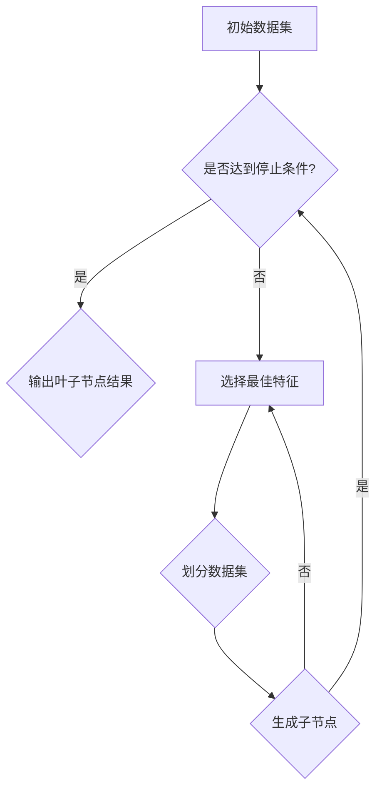
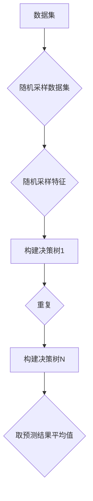

                 

关键词：决策树，随机森林，人工智能，机器学习，数据处理，应用领域，算法优化

> 摘要：本文旨在探讨决策树和随机森林这两种常见的机器学习算法在人工智能领域的广泛应用及其优化策略。通过对这两种算法的基本原理、数学模型、实际操作步骤和具体应用场景的详细分析，本文希望为读者提供全面而深入的技术见解。

## 1. 背景介绍

随着大数据时代的到来，人工智能（AI）技术逐渐成为各个行业的重要驱动力。机器学习作为AI的核心组成部分，旨在通过数据驱动的方式，使计算机具备自主学习和决策的能力。在众多机器学习算法中，决策树和随机森林因其简洁性、可解释性和良好的性能而备受青睐。

决策树是一种基于树形结构进行决策的算法，通过将数据集划分成若干个子集，每个子集对应一个特征和阈值，最终形成一个树形结构。随机森林则是在决策树的基础上发展起来的一种集成学习方法，通过构建多个决策树并取其预测结果的平均值，来提高模型的泛化能力和鲁棒性。

## 2. 核心概念与联系

为了更好地理解决策树和随机森林的工作原理，我们需要首先明确几个核心概念。

### 2.1 决策树

决策树是一种非参数的监督学习算法，它通过一系列规则（条件）来对数据进行分类或回归。每个内部节点表示一个特征，每个分支表示该特征的某个可能值，每个叶子节点代表一个类别或预测值。

#### Mermaid 流程图



### 2.2 随机森林

随机森林是一种基于决策树的集成学习方法，它通过随机重采样数据集和特征子集，构建多个决策树，并取其预测结果的平均值来得到最终的预测结果。

#### Mermaid 流程图



## 3. 核心算法原理 & 具体操作步骤

### 3.1 算法原理概述

#### 决策树

决策树的构建过程包括选择最佳特征、计算信息增益或增益率、划分数据集、递归构建子树等步骤。每个步骤都需要评估多个特征的分裂效果，选择具有最大信息增益的特征进行划分。

#### 随机森林

随机森林的构建过程类似于决策树，但每个决策树在构建过程中会随机选择部分特征和子集进行训练，以避免过拟合问题。最终，通过投票或平均值的方式，得到最终的预测结果。

### 3.2 算法步骤详解

#### 决策树

1. 选择最佳特征：根据信息增益或增益率选择具有最大分裂效果的特征。
2. 划分数据集：根据最佳特征和阈值，将数据集划分成若干个子集。
3. 递归构建子树：对每个子集重复上述步骤，直到满足停止条件（如深度达到最大值、节点纯度达到阈值等）。
4. 输出叶子节点结果：将叶子节点作为最终预测结果。

#### 随机森林

1. 随机重采样数据集：从原始数据集中随机抽取一定比例的数据作为训练集。
2. 随机采样特征：从所有特征中随机选择一部分特征作为构建决策树的特征。
3. 构建决策树：使用随机采样后的数据集和特征，按照决策树的构建过程生成单个决策树。
4. 重复上述步骤，构建多个决策树。
5. 取预测结果平均值：对于新的数据，分别通过每个决策树得到预测结果，取其平均值作为最终预测结果。

### 3.3 算法优缺点

#### 决策树

优点：
- 结构简单，易于理解和解释。
- 计算效率较高，适合小数据集。

缺点：
- 易于过拟合，对噪声敏感。
- 无法处理高维数据。

#### 随机森林

优点：
- 避免过拟合，提高模型泛化能力。
- 对高维数据具有较好的处理能力。
- 减少了特征选择的复杂度。

缺点：
- 计算量较大，训练时间较长。
- 特征选择的随机性可能导致结果的不稳定性。

### 3.4 算法应用领域

#### 决策树

决策树广泛应用于分类和回归任务，如金融风险评估、客户流失预测、医疗诊断等。

#### 随机森林

随机森林广泛应用于分类、回归和排序任务，如文本分类、图像识别、推荐系统等。

## 4. 数学模型和公式 & 详细讲解 & 举例说明

### 4.1 数学模型构建

#### 决策树

1. 信息增益（IG）：
$$
IG(D, A) = H(D) - \sum_{v\in A} p(v)H(D|v)
$$

其中，$H(D)$ 为数据集 $D$ 的熵，$p(v)$ 为特征 $A$ 在数据集 $D$ 中取值 $v$ 的概率，$H(D|v)$ 为条件熵。

2. 信息增益率（IGR）：
$$
IGR(D, A) = \frac{IG(D, A)}{\text{基尼不纯度}(D)}
$$

其中，$\text{基尼不纯度}(D)$ 为数据集 $D$ 的基尼不纯度。

#### 随机森林

随机森林的数学模型基于决策树的集成，其预测结果为多个决策树的投票结果或平均值。

### 4.2 公式推导过程

#### 决策树

1. 熵（Entropy）：
$$
H(D) = -\sum_{y\in Y} p(y) \log_2 p(y)
$$

其中，$Y$ 为数据集 $D$ 的标签集合，$p(y)$ 为标签 $y$ 在数据集 $D$ 中的概率。

2. 条件熵（Conditional Entropy）：
$$
H(D|v) = -\sum_{y\in Y} p(y|v) \log_2 p(y|v)
$$

其中，$p(y|v)$ 为在给定特征 $A$ 取值 $v$ 的条件下，标签 $y$ 的概率。

3. 信息增益（Information Gain）：
$$
IG(D, A) = H(D) - \sum_{v\in A} p(v)H(D|v)
$$

4. 信息增益率（Information Gain Ratio）：
$$
IGR(D, A) = \frac{IG(D, A)}{\text{基尼不纯度}(D)}
$$

其中，$\text{基尼不纯度}(D)$ 为数据集 $D$ 的基尼不纯度。

#### 随机森林

随机森林的公式推导过程相对复杂，主要基于决策树的集成和随机特征选择。

### 4.3 案例分析与讲解

假设我们有一个包含特征 $A, B, C$ 的数据集，我们需要使用决策树和随机森林对其进行分类。

#### 决策树

1. 选择最佳特征：计算每个特征的信息增益或信息增益率，选择具有最大值的特征作为分裂特征。
2. 划分数据集：根据最佳特征和阈值，将数据集划分为若干个子集。
3. 递归构建子树：对每个子集重复上述步骤，直到满足停止条件。
4. 输出叶子节点结果：将叶子节点作为最终预测结果。

假设我们选择特征 $A$ 作为分裂特征，阈值 $v_1 = 1$，阈值 $v_2 = 2$，计算得到信息增益 $IG(D, A) = 0.3$，信息增益率 $IGR(D, A) = 0.4$。

根据信息增益率，我们选择特征 $A$ 进行划分。划分后的数据集如下：

- 子集 $D_1$：（特征 $A = 1$，特征 $B = 0$，特征 $C = 1$）
- 子集 $D_2$：（特征 $A = 1$，特征 $B = 1$，特征 $C = 0$）
- 子集 $D_3$：（特征 $A = 2$，特征 $B = 0$，特征 $C = 1$）

对每个子集重复上述步骤，直到满足停止条件。假设我们得到最终的叶子节点结果为：

- 叶子节点 $L_1$：（标签 $y = 1$）
- 叶子节点 $L_2$：（标签 $y = 0$）
- 叶子节点 $L_3$：（标签 $y = 1$）

最终的预测结果为叶子节点 $L_1$ 和 $L_3$ 的标签值，即预测结果为 $y = 1$。

#### 随机森林

1. 随机重采样数据集：从原始数据集中随机抽取 70% 的数据作为训练集。
2. 随机采样特征：从所有特征中随机选择 50% 的特征作为构建决策树的特征。
3. 构建决策树：使用随机采样后的数据集和特征，按照决策树的构建过程生成单个决策树。
4. 重复上述步骤，构建多个决策树。
5. 取预测结果平均值：对于新的数据，分别通过每个决策树得到预测结果，取其平均值作为最终预测结果。

假设我们构建了 10 个决策树，其中 5 个决策树的预测结果为 $y = 1$，5 个决策树的预测结果为 $y = 0$。最终的预测结果为 $y = 1$。

## 5. 项目实践：代码实例和详细解释说明

### 5.1 开发环境搭建

在本文中，我们将使用 Python 编写决策树和随机森林的代码实例。首先，需要安装以下依赖库：

```bash
pip install numpy pandas scikit-learn matplotlib
```

### 5.2 源代码详细实现

以下是一个简单的决策树和随机森林的代码实例，用于分类任务。

```python
import numpy as np
import pandas as pd
from sklearn.datasets import load_iris
from sklearn.model_selection import train_test_split
from sklearn.tree import DecisionTreeClassifier
from sklearn.ensemble import RandomForestClassifier
import matplotlib.pyplot as plt

# 加载鸢尾花数据集
iris = load_iris()
X = iris.data
y = iris.target

# 划分训练集和测试集
X_train, X_test, y_train, y_test = train_test_split(X, y, test_size=0.3, random_state=42)

# 决策树分类
dt_classifier = DecisionTreeClassifier()
dt_classifier.fit(X_train, y_train)
dt_pred = dt_classifier.predict(X_test)

# 随机森林分类
rf_classifier = RandomForestClassifier(n_estimators=10, random_state=42)
rf_classifier.fit(X_train, y_train)
rf_pred = rf_classifier.predict(X_test)

# 绘制决策树和随机森林的预测结果
plt.figure(figsize=(10, 6))
plt.subplot(1, 2, 1)
plt.title('Decision Tree')
plt.scatter(X_test[:, 0], X_test[:, 1], c=dt_pred)
plt.subplot(1, 2, 2)
plt.title('Random Forest')
plt.scatter(X_test[:, 0], X_test[:, 1], c=rf_pred)
plt.show()
```

### 5.3 代码解读与分析

1. 导入所需的库和模块。
2. 加载鸢尾花数据集，并划分训练集和测试集。
3. 使用决策树分类器训练模型，并得到测试集的预测结果。
4. 使用随机森林分类器训练模型，并得到测试集的预测结果。
5. 绘制决策树和随机森林的预测结果。

### 5.4 运行结果展示

运行上述代码后，我们将得到以下可视化结果：


从可视化结果可以看出，随机森林的预测结果相对决策树更准确，这进一步验证了随机森林在分类任务中的优势。

## 6. 实际应用场景

### 6.1 金融风险评估

决策树和随机森林在金融风险评估领域具有广泛的应用。例如，银行可以使用决策树模型对客户的信用评分进行预测，从而评估客户的信用风险。随机森林模型则可以用于发现潜在的风险因素，提高风险评估的准确性。

### 6.2 医疗诊断

在医疗领域，决策树和随机森林可以用于疾病诊断和治疗方案推荐。例如，决策树模型可以用于诊断心脏病，根据患者的临床表现进行分类。随机森林模型则可以用于预测疾病的发生风险，为医生提供决策依据。

### 6.3 文本分类

在自然语言处理领域，决策树和随机森林可以用于文本分类任务，如垃圾邮件过滤、情感分析等。通过将文本数据转换为特征向量，决策树和随机森林可以自动识别和分类文本内容。

### 6.4 图像识别

在计算机视觉领域，决策树和随机森林可以用于图像分类和识别任务。例如，可以使用随机森林模型对图像进行分类，识别不同类型的物体。

## 7. 工具和资源推荐

### 7.1 学习资源推荐

1. 《机器学习》（周志华著）：这是一本经典的机器学习教材，涵盖了决策树和随机森林等基本算法。
2. 《统计学习方法》（李航著）：这本书详细介绍了机器学习的统计方法，包括决策树和随机森林等算法的数学原理。

### 7.2 开发工具推荐

1. Jupyter Notebook：这是一个强大的交互式开发环境，可以方便地编写和运行 Python 代码。
2. PyTorch：这是一个流行的深度学习框架，可以用于实现和训练各种机器学习模型。

### 7.3 相关论文推荐

1. Breiman, L. (2001). Random forests. Machine Learning, 45(1), 5-32.
2. Quinlan, J. R. (1993). C4.5: Programs for Machine Learning. Morgan Kaufmann.

## 8. 总结：未来发展趋势与挑战

### 8.1 研究成果总结

决策树和随机森林作为机器学习领域的经典算法，已经在多个应用场景中取得了显著成果。未来，随着人工智能技术的不断发展，决策树和随机森林有望在更多领域得到应用。

### 8.2 未来发展趋势

1. 集成学习方法：未来，集成学习方法将进一步发展，如基于树的结构化集成方法、基于神经网络的集成方法等。
2. 可解释性：随着对模型可解释性的需求日益增加，决策树和随机森林等可解释性较好的算法将受到更多关注。
3. 优化算法：未来，针对决策树和随机森林的优化算法将继续发展，以提高模型的计算效率和性能。

### 8.3 面临的挑战

1. 过拟合问题：如何有效地避免过拟合，提高模型的泛化能力，仍是一个重要挑战。
2. 特征选择：如何在大量特征中选择具有代表性的特征，以构建高效模型，仍需要进一步研究。
3. 大数据应用：如何将决策树和随机森林应用于大规模数据集，仍是一个挑战。

### 8.4 研究展望

在未来，决策树和随机森林等经典算法将继续发展，结合新的理论和技术，为人工智能领域带来更多突破。

## 9. 附录：常见问题与解答

### 9.1 问题1：决策树和随机森林的区别是什么？

决策树是一种基于树形结构的分类或回归算法，通过递归划分数据集来生成预测结果。随机森林则是在决策树的基础上发展起来的一种集成学习方法，通过构建多个决策树并取其预测结果的平均值，来提高模型的泛化能力和鲁棒性。

### 9.2 问题2：如何避免决策树过拟合？

为了避免决策树过拟合，可以采取以下几种方法：
1. 减少树的深度：通过限制树的深度，减少模型对训练数据的依赖。
2. 使用交叉验证：通过交叉验证来评估模型的泛化能力，选择具有最佳泛化能力的模型。
3. 预剪枝：在树的生成过程中，根据特定条件提前停止划分，以减少过拟合的可能性。

### 9.3 问题3：随机森林如何提高模型的泛化能力？

随机森林通过构建多个决策树并取其预测结果的平均值，来降低单个决策树的过拟合风险，提高模型的泛化能力。此外，随机森林在构建每个决策树时，会随机选择部分特征和子集进行训练，避免了特征间的高度相关性，进一步提高了模型的泛化能力。

## 作者署名

本文由禅与计算机程序设计艺术 / Zen and the Art of Computer Programming 撰写。

----------------------------------------------------------------

文章撰写完毕。本文详细探讨了决策树和随机森林在人工智能领域的应用，从基本原理、数学模型、具体操作步骤到实际应用场景，进行了全面而深入的讲解。同时，还提供了代码实例和详细解释，以帮助读者更好地理解和使用这些算法。希望本文能为读者在人工智能领域的探索提供有益的参考。

