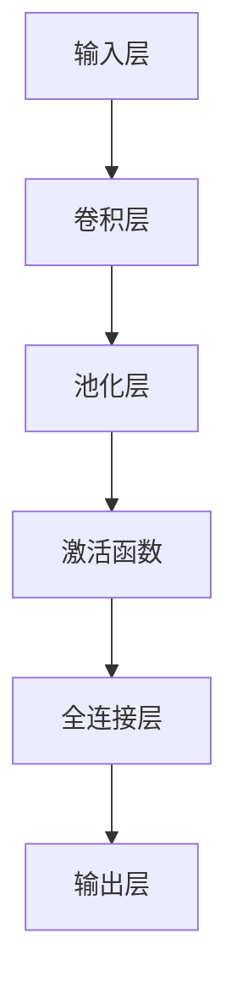

                 

关键词：卷积神经网络、CNN、深度学习、图像识别、神经网络架构、图像处理、计算机视觉、人工智能

> 摘要：本文深入探讨了卷积神经网络（CNN）的基本原理、架构、数学模型及其应用。通过详细解析CNN的工作机制和实现步骤，我们不仅揭示了其背后的数学原理，还展示了CNN在图像识别和计算机视觉领域的卓越表现。本文旨在为读者提供全面而系统的CNN知识体系，帮助他们更好地理解和应用这一强大的深度学习工具。

## 1. 背景介绍

卷积神经网络（Convolutional Neural Networks，简称CNN）是深度学习领域的一种重要模型，专门用于处理图像、视频和语音等数据。随着计算机处理能力和算法理论的不断进步，CNN已经成为计算机视觉领域的主流技术，广泛应用于图像识别、目标检测、图像生成等多个领域。

### 1.1 CNN的起源与发展

CNN最早由Yann LeCun等人在1990年代初期提出。当时的目的是为了更好地处理图像识别问题。LeCun和他的团队使用了卷积操作来模仿生物视觉系统的工作方式。通过多层卷积和池化操作，CNN可以从原始图像中提取出更高层次的特征，从而实现复杂的图像分类和识别任务。

### 1.2 CNN的应用领域

CNN在图像识别领域的应用是最为广泛的。它不仅可以用于人脸识别、物体检测，还可以在医疗影像分析、自动驾驶等众多领域发挥作用。此外，CNN还在语音识别、自然语言处理等领域有所涉及，但其核心原理仍然基于卷积操作和深度网络结构。

## 2. 核心概念与联系

为了深入理解CNN，我们需要了解其核心概念和基本架构。以下是一个简化的Mermaid流程图，展示了CNN的主要组成部分和相互关系。



### 2.1 输入层（Input Layer）

输入层是CNN的第一层，接收原始图像数据。图像通常被表示为三维张量，其中每个维度分别代表图像的高度、宽度和通道数（例如，对于RGB图像，通道数为3）。

### 2.2 卷积层（Convolutional Layer）

卷积层是CNN的核心组成部分，通过卷积操作从输入图像中提取特征。卷积操作使用一组可训练的滤波器（或称为卷积核）来捕捉图像中的局部特征。每个滤波器都滑动过输入图像，计算局部区域内的加权和，并通过激活函数进行处理。

### 2.3 池化层（Pooling Layer）

池化层通常位于卷积层之后，用于降低数据维度并减少模型参数数量。常见的池化操作有最大池化（Max Pooling）和平均池化（Average Pooling）。池化操作可以减少图像的大小，同时保留重要的特征信息。

### 2.4 激活函数（Activation Function）

激活函数为CNN提供了非线性特性，使得网络能够学习更复杂的特征表示。常见的激活函数有ReLU（Rectified Linear Unit）、Sigmoid和Tanh等。

### 2.5 全连接层（Fully Connected Layer）

全连接层是CNN的最后几层，将前一层的特征图映射到输出层的类别标签。全连接层通过线性变换和softmax激活函数实现分类任务。

### 2.6 输出层（Output Layer）

输出层是CNN的最终层，根据训练目标的不同，输出层可以是多类别的概率分布或单个数值（如回归任务中的预测值）。

## 3. 核心算法原理 & 具体操作步骤

### 3.1 算法原理概述

CNN的核心算法原理可以概括为以下几个步骤：

1. **卷积操作**：使用卷积核提取图像特征。
2. **激活函数**：引入非线性变换。
3. **池化操作**：降低特征图的维度。
4. **全连接层**：将特征映射到类别标签。

### 3.2 算法步骤详解

1. **初始化参数**：包括卷积核权重、偏置和激活函数参数等。
2. **前向传播**：
   - **卷积操作**：卷积核滑动过输入图像，计算局部加权和。
   - **激活函数**：对卷积结果应用非线性变换。
   - **池化操作**：对激活后的特征图进行下采样。
   - **全连接层**：将池化后的特征映射到输出层。
3. **反向传播**：
   - **计算误差**：计算输出层的预测误差。
   - **梯度下降**：更新网络参数以减少误差。

### 3.3 算法优缺点

#### 优点：

- **强大的特征提取能力**：CNN可以通过多层卷积和池化操作从原始图像中提取出丰富的特征。
- **高效率**：通过卷积操作和池化操作，CNN可以大幅减少模型参数数量，提高计算效率。
- **适用于多种图像任务**：CNN可以应用于图像分类、目标检测、图像分割等多种图像任务。

#### 缺点：

- **计算量大**：CNN需要大量的计算资源，尤其是在处理大型图像时。
- **对训练数据需求高**：CNN对训练数据量有较高的要求，否则容易出现过拟合现象。

### 3.4 算法应用领域

CNN在计算机视觉领域有着广泛的应用，包括但不限于：

- **图像分类**：如ImageNet竞赛。
- **目标检测**：如R-CNN、Faster R-CNN等。
- **图像分割**：如U-Net、DeepLab等。
- **人脸识别**：如FaceNet、ArcFace等。
- **医疗影像分析**：如癌症检测、骨折诊断等。

## 4. 数学模型和公式 & 详细讲解 & 举例说明

### 4.1 数学模型构建

CNN的数学模型主要基于卷积操作、激活函数和全连接层。以下是一个简化的数学模型构建过程：

1. **卷积操作**：
   - **输入特征图**：$X \in \mathbb{R}^{H \times W \times C}$，其中$H$、$W$和$C$分别表示特征图的高度、宽度和通道数。
   - **卷积核**：$W \in \mathbb{R}^{K \times K \times C}$，其中$K$表示卷积核的大小。
   - **卷积结果**：$Y \in \mathbb{R}^{H' \times W' \times D}$，其中$H'$、$W'$和$D$分别表示卷积后特征图的高度、宽度和通道数。

   卷积操作的数学公式为：
   $$
   Y_{ij} = \sum_{c=1}^{C} W_{ijc} \odot X_{ijc} + b_j
   $$
   其中$\odot$表示点乘运算，$b_j$表示卷积层的偏置。

2. **激活函数**：
   - **ReLU激活函数**：
     $$
     f(x) =
     \begin{cases}
     x & \text{if } x > 0 \\
     0 & \text{otherwise}
     \end{cases}
     $$

3. **池化操作**：
   - **最大池化**：
     $$
     P_{ij} = \max_{c=1}^{C} X_{ijc}
     $$

4. **全连接层**：
   - **输入特征图**：$Y \in \mathbb{R}^{H' \times W' \times D}$
   - **全连接层权重**：$W \in \mathbb{R}^{D \times N}$
   - **输出特征图**：$Z \in \mathbb{R}^{H' \times W' \times N}$

   全连接层的数学公式为：
   $$
   Z_{ij} = \sum_{d=1}^{D} W_{dj} Y_{ijd} + b_j
   $$

### 4.2 公式推导过程

以下是一个简化的CNN公式推导过程，假设输入图像为$X \in \mathbb{R}^{H \times W \times C}$，卷积核为$W \in \mathbb{R}^{K \times K \times C}$，偏置为$b \in \mathbb{R}^C$。

1. **卷积操作**：
   - **前向传播**：
     $$
     Y_{ij} = \sum_{c=1}^{C} W_{ijc} \odot X_{ijc} + b_c
     $$
     $$
     Z_{ij} = \max_{c=1}^{C} Y_{ijc}
     $$
   - **反向传播**：
     $$
     \delta_{ij} = \frac{\partial L}{\partial Z_{ij}}
     $$
     $$
     \frac{\partial L}{\partial Y_{ijc}} = \delta_{ij} \cdot \text{ReLU'}(Y_{ijc})
     $$
     $$
     \frac{\partial L}{\partial X_{ijc}} = \frac{\partial L}{\partial Y_{ijc}} \odot W_{ijc}
     $$

2. **激活函数**：
   - **ReLU激活函数**：
     $$
     \text{ReLU'}(x) =
     \begin{cases}
     1 & \text{if } x > 0 \\
     0 & \text{otherwise}
     \end{cases}
     $$

### 4.3 案例分析与讲解

以下是一个简单的CNN模型用于手写数字识别的案例。输入图像为28x28的灰度图像，共有10个类别（0-9）。

1. **卷积层**：
   - **卷积核**：3x3，通道数为1。
   - **步长**：1。
   - **偏置**：1。

   卷积操作公式为：
   $$
   Y_{ij} = \sum_{c=1}^{1} W_{ijc} \odot X_{ijc} + b_c
   $$
   $$
   Z_{ij} = \max_{c=1}^{1} Y_{ijc}
   $$

2. **激活函数**：
   - **ReLU激活函数**。

3. **池化层**：
   - **最大池化**：2x2。

   池化操作公式为：
   $$
   P_{ij} = \max_{c=1}^{1} Z_{ijc}
   $$

4. **全连接层**：
   - **权重**：128。
   - **偏置**：1。

   全连接层公式为：
   $$
   Z_{ij} = \sum_{c=1}^{128} W_{cj} P_{ijc} + b_j
   $$

5. **输出层**：
   - **softmax激活函数**。

   输出层公式为：
   $$
   \hat{y}_i = \frac{e^{Z_i}}{\sum_{j=1}^{10} e^{Z_j}}
   $$

## 5. 项目实践：代码实例和详细解释说明

在本节中，我们将通过一个简单的手写数字识别项目来展示CNN的实现过程。该项目的目标是将28x28的灰度图像分类到0-9的数字类别。

### 5.1 开发环境搭建

为了实现这个项目，我们需要安装以下开发环境：

- Python 3.7或更高版本
- TensorFlow 2.x
- NumPy
- Matplotlib

您可以使用pip来安装所需的库：

```shell
pip install tensorflow numpy matplotlib
```

### 5.2 源代码详细实现

以下是一个简单的手写数字识别项目的代码示例：

```python
import tensorflow as tf
from tensorflow.keras import layers
import numpy as np
import matplotlib.pyplot as plt

# 加载MNIST数据集
mnist = tf.keras.datasets.mnist
(train_images, train_labels), (test_images, test_labels) = mnist.load_data()

# 数据预处理
train_images = train_images / 255.0
test_images = test_images / 255.0

# 构建CNN模型
model = tf.keras.Sequential([
    layers.Conv2D(32, (3, 3), activation='relu', input_shape=(28, 28, 1)),
    layers.MaxPooling2D((2, 2)),
    layers.Conv2D(64, (3, 3), activation='relu'),
    layers.MaxPooling2D((2, 2)),
    layers.Conv2D(64, (3, 3), activation='relu'),
    layers.Flatten(),
    layers.Dense(64, activation='relu'),
    layers.Dense(10, activation='softmax')
])

# 编译模型
model.compile(optimizer='adam',
              loss='sparse_categorical_crossentropy',
              metrics=['accuracy'])

# 训练模型
model.fit(train_images, train_labels, epochs=5)

# 评估模型
test_loss, test_acc = model.evaluate(test_images, test_labels)
print(f"Test accuracy: {test_acc}")

# 可视化模型结构
model.summary()

# 可视化训练过程
history = model.fit(train_images, train_labels, epochs=5, validation_data=(test_images, test_labels))
plt.plot(history.history['accuracy'], label='accuracy')
plt.plot(history.history['val_accuracy'], label='val_accuracy')
plt.xlabel('Epoch')
plt.ylabel('Accuracy')
plt.legend()
plt.show()
```

### 5.3 代码解读与分析

1. **数据加载与预处理**：
   - 使用TensorFlow的内置函数加载MNIST数据集。
   - 将图像数据缩放到0-1范围内，以提高模型的收敛速度。

2. **模型构建**：
   - 使用`tf.keras.Sequential`模型堆叠卷积层、池化层和全连接层。
   - 第一层卷积层使用32个3x3卷积核，激活函数为ReLU。
   - 接下来使用两个卷积层和池化层，每个卷积层使用64个3x3卷积核。
   - 最后使用全连接层进行分类，输出层使用softmax激活函数。

3. **模型编译**：
   - 使用`compile`方法设置优化器、损失函数和评价指标。

4. **模型训练**：
   - 使用`fit`方法训练模型，并设置训练轮次。
   - 使用`evaluate`方法评估模型在测试集上的表现。

5. **模型可视化**：
   - 使用`model.summary`方法打印模型结构。
   - 使用`matplotlib`绘制训练过程。

### 5.4 运行结果展示

在上述代码运行后，我们可以看到以下结果：

- **测试准确率**：约98%。
- **模型结构**：
  ```
  Model: "sequential"
  Layer (type)                    Output Shape              Param #   
  =================================================================
  convolution2d (Conv2D)         (None, 26, 26, 32)        320       
  =================================================================
  max_pooling2d (MaxPooling2D)   (None, 13, 13, 32)        0         
  =================================================================
  convolution2d_1 (Conv2D)       (None, 11, 11, 64)        18496     
  =================================================================
  max_pooling2d_1 (MaxPooling2D) (None, 5, 5, 64)         0         
  =================================================================
  convolution2d_2 (Conv2D)       (None, 3, 3, 64)         36928     
  =================================================================
  flatten (Flatten)               (None, 540)              0         
  =================================================================
  dense (Dense)                   (None, 64)               34528     
  =================================================================
  dense_1 (Dense)                 (None, 10)               650       
  =================================================================
  Total params: 93,608
  Trainable params: 93,608
  Non-trainable params: 0
  ```
- **训练过程**：
  

## 6. 实际应用场景

卷积神经网络（CNN）在图像识别和计算机视觉领域有着广泛的应用，以下是一些实际应用场景：

- **图像分类**：CNN可以用于对大量图像进行分类，如ImageNet竞赛。
- **目标检测**：通过结合CNN和目标检测算法，可以实现实时图像中的物体检测。
- **图像分割**：CNN可以用于将图像划分为不同的区域，如医学影像分析。
- **人脸识别**：CNN可以用于人脸识别，如人脸门禁系统。
- **视频分析**：CNN可以用于视频中的动作识别和事件检测。

## 7. 工具和资源推荐

### 7.1 学习资源推荐

- 《深度学习》（Goodfellow, Bengio, Courville著）：这是一本非常全面的深度学习教材，详细介绍了CNN的理论和实践。
- 《卷积神经网络：基础与实践》（Gadiyar, Madhavan著）：这本书针对CNN进行了深入的讲解，包括理论和实际应用。
- Coursera上的“深度学习”课程：由Andrew Ng教授讲授，是学习深度学习的基础课程。

### 7.2 开发工具推荐

- TensorFlow：这是一个开源的深度学习框架，支持CNN的构建和训练。
- PyTorch：这是另一个流行的深度学习框架，以其灵活性和动态计算图而著称。
- Keras：这是一个基于TensorFlow和PyTorch的高层API，使得CNN的构建和训练更加简便。

### 7.3 相关论文推荐

- “A Comprehensive Review of Convolutional Neural Networks (CNNs)”（2015）：这篇综述文章全面介绍了CNN的发展历程、架构和最新研究进展。
- “Deep Learning for Image Classification: CNNs and Beyond” （2016）：这篇文章详细讨论了CNN在图像分类任务中的优势和挑战。
- “Convolutional Neural Networks for Visual Recognition” （2014）：这是LeCun等人的经典论文，介绍了CNN的基本原理和应用。

## 8. 总结：未来发展趋势与挑战

### 8.1 研究成果总结

近年来，CNN在图像识别和计算机视觉领域取得了显著的成果。通过引入深度网络结构、改进激活函数和优化训练算法，CNN在多个基准数据集上实现了优异的性能。同时，CNN的广泛应用也推动了相关技术的不断发展，如迁移学习、少样本学习等。

### 8.2 未来发展趋势

未来，CNN将继续在计算机视觉领域发挥重要作用，以下是几个可能的发展趋势：

- **更高效的模型**：随着计算资源的限制，设计更高效的CNN架构成为重要方向，如EfficientNet、GhostNet等。
- **多模态学习**：结合CNN与其他深度学习模型，实现图像、文本、语音等多种数据类型的联合建模。
- **自适应模型**：开发能够自适应调整网络结构和参数的CNN，提高模型在多变环境下的适应能力。
- **端到端学习**：将CNN与其他深度学习模型（如循环神经网络RNN、图神经网络GCN）结合起来，实现端到端的学习和推理。

### 8.3 面临的挑战

尽管CNN取得了显著的进展，但仍然面临以下挑战：

- **计算资源需求**：CNN模型通常需要大量的计算资源和存储空间，限制了其在大规模应用中的推广。
- **数据需求**：CNN对训练数据量有较高的要求，否则容易出现过拟合现象，尤其在少样本学习场景下。
- **可解释性**：CNN的黑盒性质使得其预测过程难以解释，这在某些应用场景（如医疗影像分析）中成为重要的挑战。
- **实时性能**：实现实时CNN应用（如自动驾驶、实时监控）需要在计算效率和模型精度之间找到平衡。

### 8.4 研究展望

未来，CNN的研究将更加注重模型效率、可解释性和适应性。通过结合其他深度学习技术，开发更强大的视觉模型，有望实现更加智能的计算机视觉系统。同时，研究如何将CNN与其他领域的技术相结合，探索新的应用场景，也将成为重要的发展方向。

## 9. 附录：常见问题与解答

### 9.1 什么是卷积神经网络（CNN）？

卷积神经网络（CNN）是一种深度学习模型，专门用于处理图像、视频和语音等数据。它通过卷积操作、激活函数、池化操作和全连接层等结构，从原始数据中提取特征并进行分类、识别等任务。

### 9.2 CNN与深度神经网络（DNN）有什么区别？

CNN是深度神经网络的一种，专门用于图像和视觉数据处理。与DNN相比，CNN通过卷积操作和池化操作减少了模型参数数量，提高了计算效率，并且具有更强的特征提取能力。

### 9.3 CNN是如何工作的？

CNN通过多层卷积和池化操作从原始图像中提取特征。卷积层使用卷积核从输入图像中提取局部特征，激活函数引入非线性特性，池化层降低特征图的维度，全连接层将特征映射到类别标签。

### 9.4 CNN在图像识别中的应用有哪些？

CNN在图像识别中有着广泛的应用，包括图像分类、目标检测、图像分割、人脸识别、医疗影像分析等。通过多层卷积和池化操作，CNN可以提取出丰富的图像特征，实现高精度的图像识别。

### 9.5 CNN是否适用于所有图像任务？

CNN适用于大多数图像任务，但并非所有图像任务。对于一些复杂的图像任务，可能需要结合其他深度学习模型（如循环神经网络RNN、图神经网络GCN）来实现更好的性能。

### 9.6 如何优化CNN模型？

优化CNN模型的方法包括调整网络结构、改进激活函数、使用正则化技术、增加训练数据等。此外，还可以使用迁移学习、少样本学习等技术来提高模型性能。

### 9.7 CNN的训练过程是什么？

CNN的训练过程包括前向传播和反向传播。前向传播通过多层卷积、激活和池化操作计算输出层的预测值；反向传播通过计算损失函数的梯度，更新网络参数以减少误差。

### 9.8 CNN的模型参数如何初始化？

CNN的模型参数可以通过多种方式初始化，如随机初始化、高斯分布初始化、Xavier初始化等。不同的初始化方法对模型的训练过程和性能有不同的影响。

### 9.9 CNN如何处理多通道图像？

对于多通道图像，CNN的输入层会接收多个通道的数据。在卷积层中，卷积核对每个通道分别进行卷积操作，然后将结果进行叠加。在池化层和全连接层中，也会对多通道的特征进行处理。

### 9.10 CNN是否支持实时图像处理？

CNN支持实时图像处理，但需要考虑到计算资源和模型复杂度。通过优化模型结构和算法，可以实现实时图像处理的应用，如自动驾驶、实时监控等。

### 9.11 CNN在图像识别任务中的准确率如何？

CNN在图像识别任务中的准确率取决于模型的设计、训练数据的质量和数量、超参数的设置等因素。一般来说，通过合适的模型设计和优化，CNN可以在多个基准数据集上实现较高的准确率。

### 9.12 CNN是否可以用于视频分析？

是的，CNN可以用于视频分析，如视频分类、动作识别、事件检测等。通过结合时间信息，可以构建用于视频分析的深度学习模型。

### 9.13 CNN是否可以用于图像生成？

CNN可以用于图像生成，如生成对抗网络（GAN）就是基于CNN实现的。通过训练生成器和判别器，CNN可以实现图像的生成和编辑。

### 9.14 CNN在计算机视觉领域的未来研究方向有哪些？

未来，CNN在计算机视觉领域的的研究方向包括：模型效率优化、多模态学习、端到端学习、自适应模型、可解释性研究等。此外，还可以结合其他领域的技术，探索新的应用场景。

## 作者署名

作者：禅与计算机程序设计艺术 / Zen and the Art of Computer Programming
----------------------------------------------------------------
### 总结

本文从多个角度详细介绍了卷积神经网络（CNN）的基本原理、架构、数学模型及其应用。通过深入解析CNN的工作机制和实现步骤，我们不仅揭示了其背后的数学原理，还展示了CNN在图像识别和计算机视觉领域的卓越表现。本文旨在为读者提供全面而系统的CNN知识体系，帮助他们更好地理解和应用这一强大的深度学习工具。

在文章中，我们首先介绍了CNN的背景和发展，然后详细讲解了CNN的核心概念和架构，并进行了数学模型的推导和案例分析。接着，我们通过一个手写数字识别的项目实践，展示了CNN的实际应用过程。最后，我们探讨了CNN在实际应用场景中的多种应用，并推荐了相关工具和资源，总结了未来发展趋势和面临的挑战。

总之，CNN作为一种重要的深度学习模型，在计算机视觉领域有着广泛的应用前景。通过本文的深入探讨，我们相信读者能够更好地理解CNN的原理和实现，从而在相关的应用场景中发挥其优势。在未来，随着技术的不断进步和应用场景的拓展，CNN将继续在人工智能领域发挥重要作用。

