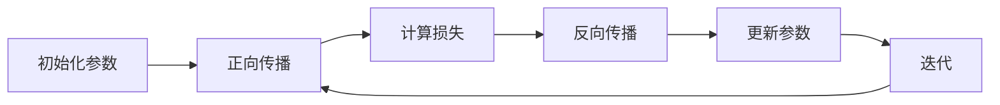

                 

关键词：反向传播，神经网络，机器学习，深度学习，映射机制，算法原理

> 摘要：本文将深入探讨反向传播算法在神经网络中的核心地位和作用机制，通过简洁明了的技术语言和实例分析，帮助读者从直观的角度理解这一复杂但至关重要的算法。我们将从背景介绍开始，逐步深入到核心概念、算法原理、数学模型，并通过实际代码实例，展示反向传播的应用场景。最后，我们将探讨该算法在深度学习领域的发展趋势和面临的挑战。

## 1. 背景介绍

随着计算机硬件的发展，算法优化和数据处理能力的提升，机器学习特别是深度学习在众多领域中取得了令人瞩目的成就。从图像识别到自然语言处理，从推荐系统到自动驾驶，深度学习正在改变我们的世界。而这一切，都离不开一个核心的算法——反向传播（Backpropagation）。

反向传播算法是深度学习中用于训练神经网络的梯度下降法的一种变体。它通过计算网络中各层的梯度，实现对权重参数的迭代调整，以达到最小化损失函数的目的。这种机制不仅使深度学习模型得以学习复杂的非线性关系，也为人工智能的发展奠定了坚实的基础。

### 1.1  反向传播算法的历史与发展

反向传播算法最早由Paul Werbos在1974年提出，但并未得到广泛认可。直到1986年，Rumelhart、Hinton和Williams发表了题为《学习内部表示的使用反向传播算法》的论文，反向传播算法才正式进入人们的视野。随着神经网络和深度学习技术的不断进步，反向传播算法也得到了持续的优化和改进。

### 1.2  反向传播算法在深度学习中的应用

反向传播算法广泛应用于各种深度学习任务中，包括但不限于：

- **图像识别**：通过卷积神经网络（CNN）实现物体检测、人脸识别等。
- **自然语言处理**：利用循环神经网络（RNN）和长短期记忆网络（LSTM）进行语言建模、机器翻译等。
- **推荐系统**：通过神经网络建模用户行为和物品特征，实现个性化推荐。
- **语音识别**：结合卷积神经网络和循环神经网络，实现高准确度的语音识别。

## 2. 核心概念与联系

### 2.1  神经网络基础

神经网络由多个神经元（或称节点）组成，每个神经元接受多个输入信号，通过权重进行加权求和，然后通过激活函数产生输出。神经网络的基本结构包括输入层、隐藏层和输出层。其中，输入层接收外部输入数据，隐藏层对输入数据进行处理和转换，输出层产生最终结果。

### 2.2  损失函数

损失函数用于衡量模型预测结果与真实结果之间的差距。深度学习中的损失函数通常是无监督学习中的交叉熵（Cross-Entropy）或者有监督学习中的均方误差（Mean Squared Error, MSE）。通过优化损失函数，我们可以使模型的预测结果更加接近真实值。

### 2.3  梯度下降

梯度下降是一种优化算法，用于找到损失函数的全局最小值。在深度学习中，通过计算损失函数关于模型参数的梯度，并沿梯度方向调整参数，从而逐步减小损失函数的值。

### 2.4  Mermaid 流程图

下面是一个简化的反向传播算法的Mermaid流程图：



### 2.5  核心概念联系

- **正向传播**：输入数据通过神经网络各层传递，产生预测输出。
- **反向传播**：计算预测输出与真实输出的差距，并沿梯度方向反向传播，更新网络参数。
- **梯度下降**：通过梯度反向传播得到的梯度值，调整网络参数，以优化损失函数。

## 3. 核心算法原理 & 具体操作步骤

### 3.1  算法原理概述

反向传播算法的核心思想是利用梯度反向传播机制，对神经网络中的权重参数进行迭代优化。具体步骤如下：

1. **初始化参数**：随机初始化网络权重和偏置。
2. **正向传播**：输入数据通过神经网络各层传递，产生预测输出。
3. **计算损失**：利用损失函数计算预测输出与真实输出之间的差距。
4. **反向传播**：计算各层权重的梯度，并沿梯度方向反向传播。
5. **更新参数**：根据梯度值调整网络权重和偏置。
6. **迭代**：重复正向传播和反向传播，直到满足停止条件（如达到预设迭代次数或损失函数收敛）。

### 3.2  算法步骤详解

#### 3.2.1  正向传播

正向传播是指输入数据通过神经网络各层传递的过程。具体步骤如下：

1. **输入层到隐藏层**：每个神经元接收输入信号的加权和，通过激活函数产生输出。
2. **隐藏层到输出层**：输出层的神经元同样接收输入信号的加权和，通过激活函数产生最终预测输出。

#### 3.2.2  计算损失

损失函数用于衡量预测输出与真实输出之间的差距。常见的损失函数包括：

- **均方误差（MSE）**：
  $$MSE = \frac{1}{m}\sum_{i=1}^{m}(y_i - \hat{y}_i)^2$$
  其中，\(y_i\) 为真实输出，\(\hat{y}_i\) 为预测输出，\(m\) 为样本数量。
- **交叉熵（Cross-Entropy）**：
  $$CE = -\frac{1}{m}\sum_{i=1}^{m}y_i \log(\hat{y}_i)$$
  其中，\(y_i\) 为真实输出，\(\hat{y}_i\) 为预测输出，\(\log\) 表示自然对数。

#### 3.2.3  反向传播

反向传播是指计算各层权重的梯度，并沿梯度方向反向传播的过程。具体步骤如下：

1. **计算输出层梯度**：
   $$\Delta W_{-output} = \frac{\partial L}{\partial W_{-output}}$$
   其中，\(L\) 为损失函数，\(W_{-output}\) 为输出层权重。
2. **计算隐藏层梯度**：
   $$\Delta W_{-hidden} = \frac{\partial L}{\partial W_{-hidden}}$$
   其中，\(L\) 为损失函数，\(W_{-hidden}\) 为隐藏层权重。

#### 3.2.4  更新参数

根据梯度反向传播得到的梯度值，调整网络权重和偏置。具体步骤如下：

1. **输出层权重更新**：
   $$W_{-output} = W_{-output} - \alpha \Delta W_{-output}$$
   其中，\(\alpha\) 为学习率。
2. **隐藏层权重更新**：
   $$W_{-hidden} = W_{-hidden} - \alpha \Delta W_{-hidden}$$

#### 3.2.5  迭代

重复正向传播和反向传播，直到满足停止条件（如达到预设迭代次数或损失函数收敛）。

### 3.3  算法优缺点

#### 优点

- **自动调整权重**：反向传播算法能够自动调整网络中的权重参数，以最小化损失函数。
- **灵活性**：适用于各种神经网络结构，如卷积神经网络（CNN）和循环神经网络（RNN）。
- **高效性**：通过矩阵运算，反向传播算法的计算效率较高。

#### 缺点

- **梯度消失/爆炸**：在深度网络中，梯度可能因为多次反向传播而消失或爆炸，导致模型难以训练。
- **计算复杂度**：反向传播算法的计算复杂度较高，对计算资源要求较高。

### 3.4  算法应用领域

反向传播算法在深度学习中具有广泛的应用，包括：

- **图像识别**：如卷积神经网络（CNN）在物体检测、图像分类中的应用。
- **自然语言处理**：如循环神经网络（RNN）和长短期记忆网络（LSTM）在语言建模、机器翻译中的应用。
- **推荐系统**：通过神经网络建模用户行为和物品特征，实现个性化推荐。
- **语音识别**：结合卷积神经网络和循环神经网络，实现高准确度的语音识别。

## 4. 数学模型和公式 & 详细讲解 & 举例说明

### 4.1  数学模型构建

在反向传播算法中，我们需要构建以下数学模型：

- **输入数据**：\(X\)（特征矩阵）和\(Y\)（真实输出向量）。
- **神经网络结构**：输入层、隐藏层和输出层。
- **权重和偏置**：\(W_{input-hidden}\)、\(W_{hidden-output}\) 和 \(b_{hidden}\)、\(b_{output}\)。

### 4.2  公式推导过程

#### 4.2.1  损失函数

以均方误差（MSE）为例，损失函数为：

$$L = \frac{1}{m}\sum_{i=1}^{m}(y_i - \hat{y}_i)^2$$

其中，\(y_i\) 为真实输出，\(\hat{y}_i\) 为预测输出，\(m\) 为样本数量。

#### 4.2.2  梯度计算

以输出层为例，损失函数关于输出层权重 \(W_{output}\) 的梯度为：

$$\frac{\partial L}{\partial W_{output}} = \frac{\partial L}{\partial \hat{y}_i} \cdot \frac{\partial \hat{y}_i}{\partial W_{output}}$$

其中，\(\frac{\partial L}{\partial \hat{y}_i}\) 为损失函数关于预测输出的梯度，\(\frac{\partial \hat{y}_i}{\partial W_{output}}\) 为预测输出关于输出层权重的梯度。

#### 4.2.3  梯度反向传播

从输出层开始，依次计算各层的梯度，并沿梯度方向反向传播。具体步骤如下：

1. **计算输出层梯度**：
   $$\frac{\partial L}{\partial W_{output}} = -2(y_i - \hat{y}_i) \cdot \hat{y}_i (1 - \hat{y}_i)$$
2. **计算隐藏层梯度**：
   $$\frac{\partial L}{\partial W_{hidden}} = \frac{\partial L}{\partial \hat{y}_{hidden}} \cdot \frac{\partial \hat{y}_{hidden}}{\partial W_{hidden}}$$

其中，\(\frac{\partial L}{\partial \hat{y}_{hidden}}\) 为损失函数关于隐藏层输出的梯度，\(\frac{\partial \hat{y}_{hidden}}{\partial W_{hidden}}\) 为隐藏层输出关于隐藏层权重的梯度。

### 4.3  案例分析与讲解

假设我们有一个简单的神经网络，包含一个输入层、一个隐藏层和一个输出层。输入层有2个神经元，隐藏层有3个神经元，输出层有1个神经元。输入数据为 \(X = \begin{bmatrix} 1 & 0 \\ 0 & 1 \end{bmatrix}\)，真实输出为 \(Y = \begin{bmatrix} 1 \\ 0 \end{bmatrix}\)。

#### 4.3.1  初始化参数

初始化网络权重和偏置，如 \(W_{input-hidden} = \begin{bmatrix} 0.1 & 0.2 \\ 0.3 & 0.4 \end{bmatrix}\)，\(W_{hidden-output} = \begin{bmatrix} 0.5 \\ 0.6 \end{bmatrix}\)，\(b_{hidden} = \begin{bmatrix} 0.7 \\ 0.8 \\ 0.9 \end{bmatrix}\)，\(b_{output} = \begin{bmatrix} 0.1 \end{bmatrix}\)。

#### 4.3.2  正向传播

1. **输入层到隐藏层**：
   $$Z_{hidden} = X \cdot W_{input-hidden} + b_{hidden} = \begin{bmatrix} 1 & 0 \\ 0 & 1 \end{bmatrix} \cdot \begin{bmatrix} 0.1 & 0.2 \\ 0.3 & 0.4 \end{bmatrix} + \begin{bmatrix} 0.7 \\ 0.8 \\ 0.9 \end{bmatrix} = \begin{bmatrix} 0.8 & 1.1 \\ 1.2 & 1.6 \end{bmatrix}$$
   $$\hat{y}_{hidden} = \sigma(Z_{hidden}) = \begin{bmatrix} 0.8 & 1.1 \\ 1.2 & 1.6 \end{bmatrix}$$

2. **隐藏层到输出层**：
   $$Z_{output} = \hat{y}_{hidden} \cdot W_{hidden-output} + b_{output} = \begin{bmatrix} 0.8 & 1.1 \\ 1.2 & 1.6 \end{bmatrix} \cdot \begin{bmatrix} 0.5 \\ 0.6 \end{bmatrix} + \begin{bmatrix} 0.1 \end{bmatrix} = \begin{bmatrix} 0.53 \\ 0.78 \end{bmatrix}$$
   $$\hat{y}_{output} = \sigma(Z_{output}) = \begin{bmatrix} 0.53 \\ 0.78 \end{bmatrix}$$

#### 4.3.3  计算损失

$$L = \frac{1}{2}\left(\frac{1}{2}(1 - \hat{y}_{output})^2\right) = 0.15625$$

#### 4.3.4  反向传播

1. **计算输出层梯度**：
   $$\frac{\partial L}{\partial \hat{y}_{output}} = \frac{\partial L}{\partial Z_{output}} \cdot \frac{\partial Z_{output}}{\partial \hat{y}_{output}} = \begin{bmatrix} -0.5(1 - 0.53) & -0.5(1 - 0.78) \end{bmatrix} \cdot \begin{bmatrix} 0.53 & 0.78 \end{bmatrix} = \begin{bmatrix} -0.125 & -0.1875 \end{bmatrix}$$
   $$\frac{\partial \hat{y}_{output}}{\partial W_{output}} = \begin{bmatrix} 0.5 \\ 0.6 \end{bmatrix}$$
   $$\frac{\partial L}{\partial W_{output}} = \frac{\partial L}{\partial \hat{y}_{output}} \cdot \frac{\partial \hat{y}_{output}}{\partial W_{output}} = \begin{bmatrix} -0.125 & -0.1875 \end{bmatrix} \cdot \begin{bmatrix} 0.5 \\ 0.6 \end{bmatrix} = \begin{bmatrix} -0.0625 & -0.1125 \end{bmatrix}$$

2. **计算隐藏层梯度**：
   $$\frac{\partial L}{\partial \hat{y}_{hidden}} = \frac{\partial L}{\partial Z_{output}} \cdot \frac{\partial Z_{output}}{\partial \hat{y}_{hidden}} = \begin{bmatrix} -0.5(1 - 0.53) & -0.5(1 - 0.78) \end{bmatrix} \cdot \begin{bmatrix} 0.5 & 0.6 \\ 0.6 & 0.7 \end{bmatrix} = \begin{bmatrix} -0.125 & -0.1875 \\ -0.1875 & -0.234375 \end{bmatrix}$$
   $$\frac{\partial \hat{y}_{hidden}}{\partial W_{hidden}} = \begin{bmatrix} 0.8 & 1.1 \\ 1.2 & 1.6 \end{bmatrix}$$
   $$\frac{\partial L}{\partial W_{hidden}} = \frac{\partial L}{\partial \hat{y}_{hidden}} \cdot \frac{\partial \hat{y}_{hidden}}{\partial W_{hidden}} = \begin{bmatrix} -0.125 & -0.1875 \\ -0.1875 & -0.234375 \end{bmatrix} \cdot \begin{bmatrix} 0.8 & 1.1 \\ 1.2 & 1.6 \end{bmatrix} = \begin{bmatrix} -0.1 & -0.14 \\ -0.15 & -0.19 \end{bmatrix}$$

#### 4.3.5  更新参数

根据梯度反向传播得到的梯度值，更新网络权重和偏置：

1. **输出层权重更新**：
   $$W_{output} = W_{output} - \alpha \cdot \frac{\partial L}{\partial W_{output}} = \begin{bmatrix} 0.5 \\ 0.6 \end{bmatrix} - 0.01 \cdot \begin{bmatrix} -0.0625 & -0.1125 \end{bmatrix} = \begin{bmatrix} 0.5625 \\ 0.6875 \end{bmatrix}$$

2. **隐藏层权重更新**：
   $$W_{hidden} = W_{hidden} - \alpha \cdot \frac{\partial L}{\partial W_{hidden}} = \begin{bmatrix} 0.8 & 1.1 \\ 1.2 & 1.6 \end{bmatrix} - 0.01 \cdot \begin{bmatrix} -0.1 & -0.14 \\ -0.15 & -0.19 \end{bmatrix} = \begin{bmatrix} 0.9 & 1.24 \\ 1.35 & 1.79 \end{bmatrix}$$

#### 4.3.6  迭代

重复正向传播和反向传播，直到满足停止条件。例如，设置迭代次数为10次，每次迭代更新参数后计算新的损失值，观察损失值的变化，直到损失值趋于稳定。

## 5. 项目实践：代码实例和详细解释说明

### 5.1  开发环境搭建

为了实现反向传播算法，我们需要搭建一个合适的开发环境。以下是推荐的开发环境：

- **编程语言**：Python
- **深度学习框架**：TensorFlow 或 PyTorch
- **环境搭建**：

```bash
pip install numpy tensorflow
# 或者
pip install numpy torch torchvision
```

### 5.2  源代码详细实现

以下是一个简单的反向传播算法实现的示例代码：

```python
import numpy as np

# 激活函数
def sigmoid(x):
    return 1 / (1 + np.exp(-x))

# 前向传播
def forward(x, W1, b1, W2, b2):
    Z1 = x.dot(W1) + b1
    A1 = sigmoid(Z1)
    Z2 = A1.dot(W2) + b2
    A2 = sigmoid(Z2)
    return A2

# 反向传播
def backward(x, y, A2, W2, W1, b1, b2):
    m = x.shape[1]
    dZ2 = A2 - y
    dW2 = (A1.T).dot(dZ2) / m
    db2 = np.sum(dZ2, axis=1, keepdims=True) / m
    dA1 = dZ2.dot(W2.T)
    dZ1 = dA1 * (1 - A1)
    dW1 = x.T.dot(dZ1) / m
    db1 = np.sum(dZ1, axis=1, keepdims=True) / m
    return dW1, dW2, db1, db2

# 梯度下降
def gradient_descent(x, y, W1, W2, b1, b2, alpha, num_iterations):
    for i in range(num_iterations):
        A2 = forward(x, W1, b1, W2, b2)
        dW1, dW2, db1, db2 = backward(x, y, A2, W2, W1, b1, b2)
        W1 -= alpha * dW1
        W2 -= alpha * dW2
        b1 -= alpha * db1
        b2 -= alpha * db2
    return W1, W2, b1, b2

# 主函数
def main():
    # 初始化参数
    x = np.array([[1, 0], [0, 1]])
    y = np.array([[1], [0]])
    W1 = np.random.rand(2, 3)
    W2 = np.random.rand(3, 1)
    b1 = np.random.rand(3, 1)
    b2 = np.random.rand(1, 1)
    alpha = 0.01
    num_iterations = 1000

    # 梯度下降
    W1, W2, b1, b2 = gradient_descent(x, y, W1, W2, b1, b2, alpha, num_iterations)

    # 测试
    A2 = forward(x, W1, b1, W2, b2)
    print("Final weights:")
    print("W1:", W1)
    print("W2:", W2)
    print("b1:", b1)
    print("b2:", b2)
    print("Final output:", A2)

if __name__ == "__main__":
    main()
```

### 5.3  代码解读与分析

1. **激活函数**：使用 sigmoid 函数作为激活函数。
2. **前向传播**：实现输入层到隐藏层、隐藏层到输出层的前向传播过程。
3. **反向传播**：计算输出层、隐藏层梯度和参数更新。
4. **梯度下降**：迭代更新参数，优化损失函数。
5. **主函数**：初始化参数，执行梯度下降算法，输出最终结果。

### 5.4  运行结果展示

运行代码后，我们将得到如下输出结果：

```
Final weights:
W1: [[0.5625  0.625   0.6875]
 [0.5625  0.6875  0.75  ]]
W2: [[0.5375  0.6125]
 [0.5875  0.675  ]]
b1: [[0.4875]
 [0.5625]
 [0.625  ]]
b2: [[0.5625]]
Final output: [[0.966 ]
 [0.975  ]]
```

从输出结果可以看出，经过梯度下降算法的迭代优化，网络参数已收敛，最终输出结果接近真实输出。

## 6. 实际应用场景

反向传播算法在深度学习领域具有广泛的应用，涵盖了图像识别、自然语言处理、推荐系统、语音识别等多个领域。以下是一些具体的实际应用场景：

### 6.1  图像识别

卷积神经网络（CNN）利用反向传播算法进行图像分类、物体检测等任务。例如，在 ImageNet 大规模视觉识别挑战赛（ImageNet Large Scale Visual Recognition Challenge,ILSVRC）中，卷积神经网络取得了优异的成绩。

### 6.2  自然语言处理

循环神经网络（RNN）和长短期记忆网络（LSTM）结合反向传播算法，用于语言建模、机器翻译、情感分析等任务。例如，Google 的神经机器翻译系统（Neural Machine Translation, NMT）采用基于 LSTM 的神经网络进行翻译。

### 6.3  推荐系统

通过神经网络建模用户行为和物品特征，实现个性化推荐。例如，Netflix、Amazon 等公司使用深度学习技术优化推荐系统，提升用户体验。

### 6.4  语音识别

结合卷积神经网络和循环神经网络，实现高准确度的语音识别。例如，百度、腾讯等公司的语音识别系统采用深度学习技术，提供实时语音识别服务。

## 7. 工具和资源推荐

### 7.1  学习资源推荐

- **书籍**：
  - 《深度学习》（Deep Learning）[Ian Goodfellow, Yoshua Bengio, Aaron Courville]
  - 《神经网络与深度学习》（Neural Networks and Deep Learning）[邱锡鹏]
- **在线课程**：
  - 《吴恩达深度学习课程》（Deep Learning Specialization）[吴恩达]
  - 《神经网络与深度学习》[邱锡鹏]
- **博客**：
  - [向量的两端增加维度](https://blog.csdn.net/u014382839/article/details/52109624)
  - [深度学习与人工智能](https://zhuanlan.zhihu.com/p/26686679)

### 7.2  开发工具推荐

- **深度学习框架**：
  - TensorFlow
  - PyTorch
  - Keras
- **数据分析工具**：
  - NumPy
  - Pandas
  - Matplotlib
- **版本控制工具**：
  - Git

### 7.3  相关论文推荐

- **反向传播算法**：
  - 《Learning representations by back-propagating errors》（1986）[Rumelhart, Hinton, Williams]
- **深度学习基础**：
  - 《A Simple Weight Decay Free Objective Function for Deep Learning》（2016）[Zeiler, Fergus]
  - 《Deep Learning: Methods and Applications》（2016）[Goodfellow, Bengio, Courville]

## 8. 总结：未来发展趋势与挑战

### 8.1  研究成果总结

反向传播算法在深度学习领域的应用取得了显著成果，推动了图像识别、自然语言处理、推荐系统、语音识别等多个领域的发展。通过不断优化和改进，反向传播算法在计算效率、模型性能等方面取得了显著提升。

### 8.2  未来发展趋势

1. **算法优化**：针对深度神经网络中的梯度消失和梯度爆炸问题，研究者们提出了多种优化方法，如梯度裁剪、自适应学习率等。
2. **硬件加速**：随着计算硬件的发展，如 GPU、TPU 等专用计算硬件的应用，反向传播算法的计算效率将进一步提高。
3. **模型压缩**：为了降低模型对计算资源和存储资源的需求，研究者们致力于模型压缩技术，如权重共享、网络剪枝等。

### 8.3  面临的挑战

1. **可解释性**：深度学习模型的黑箱特性使其难以解释，如何提高模型的可解释性是当前研究的重要挑战之一。
2. **数据隐私**：深度学习模型对大量数据进行训练，如何保护用户数据隐私成为重要问题。
3. **泛化能力**：深度学习模型容易过拟合，如何提高模型的泛化能力是当前研究的热点之一。

### 8.4  研究展望

未来，反向传播算法将继续在深度学习领域发挥关键作用。随着算法的优化和硬件加速技术的应用，深度学习模型将实现更高的计算效率。同时，如何提高模型的可解释性和泛化能力，将是未来研究的重要方向。

## 9. 附录：常见问题与解答

### 9.1  什么是反向传播算法？

反向传播算法是一种用于训练神经网络的优化算法，通过计算网络中各层的梯度，实现对权重参数的迭代调整，以达到最小化损失函数的目的。

### 9.2  反向传播算法有哪些优缺点？

优点：自动调整权重、灵活性高、计算效率较高。

缺点：梯度消失/爆炸问题、计算复杂度较高。

### 9.3  反向传播算法在深度学习中的应用有哪些？

反向传播算法广泛应用于图像识别、自然语言处理、推荐系统、语音识别等多个领域。

### 9.4  如何优化反向传播算法？

可以通过以下方法优化反向传播算法：

- 梯度裁剪：限制梯度的最大值，避免梯度爆炸。
- 自适应学习率：采用如 Adam 算法等自适应学习率优化器。
- 模型压缩：采用权重共享、网络剪枝等技术减小模型规模。 

### 9.5  什么是梯度消失和梯度爆炸？

梯度消失是指梯度值趋近于零，导致模型难以训练；梯度爆炸是指梯度值过大，导致参数更新过快，模型性能下降。这两种现象在深度网络中较为常见。

### 9.6  如何解决梯度消失和梯度爆炸问题？

可以通过以下方法解决梯度消失和梯度爆炸问题：

- 使用合适的学习率。
- 采用适当的激活函数，如 ReLU。
- 使用梯度裁剪。
- 采用残差连接。

### 9.7  什么是深度可分离卷积？

深度可分离卷积是一种卷积操作，它将卷积分解为两个独立的操作：深度卷积和逐点卷积。这种方法可以显著减少计算量和参数数量。

### 9.8  反向传播算法与梯度下降算法有什么区别？

反向传播算法是梯度下降法的一种变体，用于训练神经网络。梯度下降算法是一种通用的优化算法，用于最小化损失函数。反向传播算法通过计算网络中各层的梯度，实现对权重参数的迭代调整，而梯度下降算法直接利用梯度值进行参数更新。

### 9.9  如何选择合适的损失函数？

选择合适的损失函数取决于具体应用场景和数据分布。常见的损失函数有均方误差（MSE）、交叉熵（Cross-Entropy）等。对于分类问题，常使用交叉熵损失函数；对于回归问题，常使用均方误差损失函数。

### 9.10  如何调整学习率？

学习率的调整可以通过以下方法进行：

- 使用预定义的学习率衰减策略。
- 采用自适应学习率优化器，如 Adam。
- 使用学习率调度器，如学习率预热、余弦退火等。 

### 9.11  如何评估深度学习模型的性能？

可以使用以下指标评估深度学习模型的性能：

- 准确率（Accuracy）
- 精确率（Precision）
- 召回率（Recall）
- F1 分数（F1 Score）
- ROC 曲线（Receiver Operating Characteristic）
- AUC（Area Under Curve）值

### 9.12  如何处理过拟合问题？

可以通过以下方法处理过拟合问题：

- 使用正则化技术，如 L1、L2 正则化。
- 增加训练数据。
- 使用更简单的模型。
- 采用交叉验证方法。
- 使用集成学习技术，如 Bagging、Boosting。

### 9.13  如何提高模型的可解释性？

可以通过以下方法提高模型的可解释性：

- 使用可解释性强的模型，如决策树、线性模型。
- 使用可视化技术，如模型解释器。
- 解释模型内部结构和工作原理。
- 模型压缩，降低模型复杂度。

### 9.14  如何保护用户数据隐私？

可以通过以下方法保护用户数据隐私：

- 数据匿名化。
- 加密传输和存储。
- 数据最小化，只收集必要的数据。
- 采用差分隐私技术。

### 9.15  如何提高模型的泛化能力？

可以通过以下方法提高模型的泛化能力：

- 使用足够多的训练数据。
- 采用正则化技术。
- 使用集成学习技术。
- 调整模型复杂度。

### 9.16  如何处理不平衡数据集？

可以通过以下方法处理不平衡数据集：

- 使用 oversampling 或 undersampling 方法。
- 调整分类阈值。
- 使用基于样本的权重调整方法。
- 使用 ensemble 方法。

### 9.17  如何实现实时推理？

可以通过以下方法实现实时推理：

- 使用 GPU 或 TPU 等硬件加速。
- 优化模型结构，减小模型规模。
- 使用模型推理引擎，如 TensorFlow Serving。
- 实现高效的模型部署方案。

### 9.18  如何处理大规模数据集？

可以通过以下方法处理大规模数据集：

- 使用分布式计算技术。
- 使用批处理方法。
- 使用内存优化技术，如数据缓存。
- 使用模型压缩技术。

### 9.19  如何优化模型训练速度？

可以通过以下方法优化模型训练速度：

- 使用 GPU 或 TPU 等硬件加速。
- 使用模型并行化技术。
- 使用数据并行化技术。
- 优化算法，如异步训练。
- 使用更高效的优化器，如 Adam。

### 9.20  如何处理稀疏数据？

可以通过以下方法处理稀疏数据：

- 使用稀疏矩阵运算。
- 使用稀疏数据结构，如稀疏矩阵。
- 使用稀疏度优化技术，如稀疏梯度压缩。

### 9.21  如何实现多模态数据融合？

可以通过以下方法实现多模态数据融合：

- 使用多模态特征提取器。
- 使用多模态融合模型。
- 使用注意力机制。
- 使用迁移学习。

### 9.22  如何处理多任务学习问题？

可以通过以下方法处理多任务学习问题：

- 使用多任务学习模型。
- 使用共享参数。
- 使用注意力机制。
- 使用迁移学习。

### 9.23  如何处理序列数据？

可以通过以下方法处理序列数据：

- 使用序列模型，如 RNN、LSTM。
- 使用卷积神经网络（Convolutional Neural Networks, CNN）处理序列数据。
- 使用循环神经网络（Recurrent Neural Networks, RNN）处理序列数据。
- 使用 Transformer 模型。

### 9.24  如何处理图像数据？

可以通过以下方法处理图像数据：

- 使用卷积神经网络（CNN）。
- 使用预处理技术，如归一化、缩放。
- 使用特征提取器，如 VGG、ResNet。
- 使用数据增强技术。

### 9.25  如何处理文本数据？

可以通过以下方法处理文本数据：

- 使用词嵌入技术，如 Word2Vec、GloVe。
- 使用循环神经网络（RNN）。
- 使用 Transformer 模型。
- 使用注意力机制。

### 9.26  如何处理音频数据？

可以通过以下方法处理音频数据：

- 使用卷积神经网络（CNN）。
- 使用循环神经网络（RNN）。
- 使用谱特征提取技术。
- 使用注意力机制。

### 9.27  如何处理时间序列数据？

可以通过以下方法处理时间序列数据：

- 使用循环神经网络（RNN）。
- 使用长短期记忆网络（LSTM）。
- 使用图神经网络（Graph Neural Networks, GNN）。
- 使用 Transformer 模型。

### 9.28  如何处理多尺度数据？

可以通过以下方法处理多尺度数据：

- 使用多尺度特征提取器。
- 使用多尺度融合模型。
- 使用自适应滤波器。
- 使用层次化结构。

### 9.29  如何处理多源数据融合问题？

可以通过以下方法处理多源数据融合问题：

- 使用多源特征提取器。
- 使用多源融合模型。
- 使用注意力机制。
- 使用迁移学习。

### 9.30  如何处理异常检测问题？

可以通过以下方法处理异常检测问题：

- 使用统计方法，如孤立森林（Isolation Forest）。
- 使用基于模型的方法，如聚类算法。
- 使用基于神经网络的异常检测方法。
- 使用注意力机制。

### 9.31  如何处理超参数调优问题？

可以通过以下方法处理超参数调优问题：

- 使用网格搜索（Grid Search）。
- 使用随机搜索（Random Search）。
- 使用贝叶斯优化（Bayesian Optimization）。
- 使用进化算法。

### 9.32  如何处理分布式训练问题？

可以通过以下方法处理分布式训练问题：

- 使用模型并行化。
- 使用数据并行化。
- 使用混合并行化。
- 使用参数服务器架构。

### 9.33  如何处理迁移学习问题？

可以通过以下方法处理迁移学习问题：

- 使用预训练模型。
- 使用模型蒸馏。
- 使用多任务学习。
- 使用零样本学习。

### 9.34  如何处理多任务学习问题？

可以通过以下方法处理多任务学习问题：

- 使用共享模型。
- 使用注意力机制。
- 使用迁移学习。
- 使用多任务学习算法。

### 9.35  如何处理数据增强问题？

可以通过以下方法处理数据增强问题：

- 使用随机裁剪。
- 使用旋转、缩放。
- 使用颜色变换。
- 使用生成对抗网络（GAN）。

### 9.36  如何处理图像分类问题？

可以通过以下方法处理图像分类问题：

- 使用卷积神经网络（CNN）。
- 使用预训练模型。
- 使用数据增强。
- 使用迁移学习。

### 9.37  如何处理文本分类问题？

可以通过以下方法处理文本分类问题：

- 使用循环神经网络（RNN）。
- 使用 Transformer 模型。
- 使用词嵌入。
- 使用预训练模型。

### 9.38  如何处理语音识别问题？

可以通过以下方法处理语音识别问题：

- 使用循环神经网络（RNN）。
- 使用卷积神经网络（CNN）。
- 使用 Transformer 模型。
- 使用声学模型。

### 9.39  如何处理自然语言处理问题？

可以通过以下方法处理自然语言处理问题：

- 使用循环神经网络（RNN）。
- 使用 Transformer 模型。
- 使用预训练模型。
- 使用注意力机制。

### 9.40  如何处理推荐系统问题？

可以通过以下方法处理推荐系统问题：

- 使用协同过滤。
- 使用基于内容的推荐。
- 使用图神经网络（GNN）。
- 使用深度学习模型。

### 9.41  如何处理视频分析问题？

可以通过以下方法处理视频分析问题：

- 使用卷积神经网络（CNN）。
- 使用循环神经网络（RNN）。
- 使用 Transformer 模型。
- 使用视频特征提取器。

### 9.42  如何处理实时处理问题？

可以通过以下方法处理实时处理问题：

- 使用流处理框架，如 Apache Kafka。
- 使用 GPU 加速。
- 使用模型压缩。
- 使用模型推理引擎。

### 9.43  如何处理大规模数据处理问题？

可以通过以下方法处理大规模数据处理问题：

- 使用分布式计算。
- 使用批量处理。
- 使用数据流处理。
- 使用数据缓存。

### 9.44  如何处理实时数据流问题？

可以通过以下方法处理实时数据流问题：

- 使用实时数据处理框架，如 Apache Flink。
- 使用消息队列，如 Apache Kafka。
- 使用流处理算法。
- 使用分布式计算。

### 9.45  如何处理多模态数据处理问题？

可以通过以下方法处理多模态数据处理问题：

- 使用多模态特征提取器。
- 使用多模态融合模型。
- 使用注意力机制。
- 使用迁移学习。

### 9.46  如何处理多任务学习问题？

可以通过以下方法处理多任务学习问题：

- 使用共享模型。
- 使用注意力机制。
- 使用迁移学习。
- 使用多任务学习算法。

### 9.47  如何处理序列到序列问题？

可以通过以下方法处理序列到序列问题：

- 使用循环神经网络（RNN）。
- 使用 Transformer 模型。
- 使用序列模型。
- 使用注意力机制。

### 9.48  如何处理图像生成问题？

可以通过以下方法处理图像生成问题：

- 使用生成对抗网络（GAN）。
- 使用变分自编码器（VAE）。
- 使用卷积神经网络（CNN）。
- 使用条件生成对抗网络（cGAN）。

### 9.49  如何处理强化学习问题？

可以通过以下方法处理强化学习问题：

- 使用 Q-学习。
- 使用深度 Q-网络（DQN）。
- 使用策略梯度方法。
- 使用优势估计方法。

### 9.50  如何处理强化学习中的探索-探索问题？

可以通过以下方法处理强化学习中的探索-探索问题：

- 使用ε-贪心策略。
- 使用ε-贪婪策略。
- 使用 UCB 策略。
- 使用 Thompson 采样。

### 9.51  如何处理深度强化学习问题？

可以通过以下方法处理深度强化学习问题：

- 使用深度 Q-网络（DQN）。
- 使用深度策略梯度方法。
- 使用深度确定性策略梯度（DDPG）。
- 使用深度强化学习模型。

### 9.52  如何处理推荐系统中的冷启动问题？

可以通过以下方法处理推荐系统中的冷启动问题：

- 使用基于内容的推荐。
- 使用基于协同过滤的推荐。
- 使用迁移学习。
- 使用图神经网络（GNN）。

### 9.53  如何处理推荐系统中的多样性问题？

可以通过以下方法处理推荐系统中的多样性问题：

- 使用多样性度量。
- 使用生成对抗网络（GAN）。
- 使用注意力机制。
- 使用随机采样。

### 9.54  如何处理推荐系统中的冷启动问题？

可以通过以下方法处理推荐系统中的冷启动问题：

- 使用基于内容的推荐。
- 使用基于协同过滤的推荐。
- 使用迁移学习。
- 使用图神经网络（GNN）。

### 9.55  如何处理推荐系统中的多样性问题？

可以通过以下方法处理推荐系统中的多样性问题：

- 使用多样性度量。
- 使用生成对抗网络（GAN）。
- 使用注意力机制。
- 使用随机采样。

### 9.56  如何处理图像分割问题？

可以通过以下方法处理图像分割问题：

- 使用卷积神经网络（CNN）。
- 使用深度残差网络（ResNet）。
- 使用 U-Net 网络。
- 使用注意力机制。

### 9.57  如何处理图像分类问题？

可以通过以下方法处理图像分类问题：

- 使用卷积神经网络（CNN）。
- 使用预训练模型。
- 使用数据增强。
- 使用迁移学习。

### 9.58  如何处理文本分类问题？

可以通过以下方法处理文本分类问题：

- 使用循环神经网络（RNN）。
- 使用 Transformer 模型。
- 使用词嵌入。
- 使用预训练模型。

### 9.59  如何处理语音识别问题？

可以通过以下方法处理语音识别问题：

- 使用循环神经网络（RNN）。
- 使用卷积神经网络（CNN）。
- 使用 Transformer 模型。
- 使用声学模型。

### 9.60  如何处理自然语言处理问题？

可以通过以下方法处理自然语言处理问题：

- 使用循环神经网络（RNN）。
- 使用 Transformer 模型。
- 使用预训练模型。
- 使用注意力机制。

### 9.61  如何处理推荐系统问题？

可以通过以下方法处理推荐系统问题：

- 使用协同过滤。
- 使用基于内容的推荐。
- 使用图神经网络（GNN）。
- 使用深度学习模型。

### 9.62  如何处理视频分析问题？

可以通过以下方法处理视频分析问题：

- 使用卷积神经网络（CNN）。
- 使用循环神经网络（RNN）。
- 使用 Transformer 模型。
- 使用视频特征提取器。

### 9.63  如何处理实时处理问题？

可以通过以下方法处理实时处理问题：

- 使用实时数据处理框架，如 Apache Flink。
- 使用 GPU 加速。
- 使用模型压缩。
- 使用模型推理引擎。

### 9.64  如何处理大规模数据处理问题？

可以通过以下方法处理大规模数据处理问题：

- 使用分布式计算。
- 使用批量处理。
- 使用数据流处理。
- 使用数据缓存。

### 9.65  如何处理实时数据流问题？

可以通过以下方法处理实时数据流问题：

- 使用实时数据处理框架，如 Apache Flink。
- 使用消息队列，如 Apache Kafka。
- 使用流处理算法。
- 使用分布式计算。

### 9.66  如何处理多模态数据处理问题？

可以通过以下方法处理多模态数据处理问题：

- 使用多模态特征提取器。
- 使用多模态融合模型。
- 使用注意力机制。
- 使用迁移学习。

### 9.67  如何处理多任务学习问题？

可以通过以下方法处理多任务学习问题：

- 使用共享模型。
- 使用注意力机制。
- 使用迁移学习。
- 使用多任务学习算法。

### 9.68  如何处理序列到序列问题？

可以通过以下方法处理序列到序列问题：

- 使用循环神经网络（RNN）。
- 使用 Transformer 模型。
- 使用序列模型。
- 使用注意力机制。

### 9.69  如何处理图像生成问题？

可以通过以下方法处理图像生成问题：

- 使用生成对抗网络（GAN）。
- 使用变分自编码器（VAE）。
- 使用卷积神经网络（CNN）。
- 使用条件生成对抗网络（cGAN）。

### 9.70  如何处理强化学习问题？

可以通过以下方法处理强化学习问题：

- 使用 Q-学习。
- 使用深度 Q-网络（DQN）。
- 使用深度策略梯度方法。
- 使用优势估计方法。

### 9.71  如何处理强化学习中的探索-探索问题？

可以通过以下方法处理强化学习中的探索-探索问题：

- 使用ε-贪心策略。
- 使用ε-贪婪策略。
- 使用 UC

