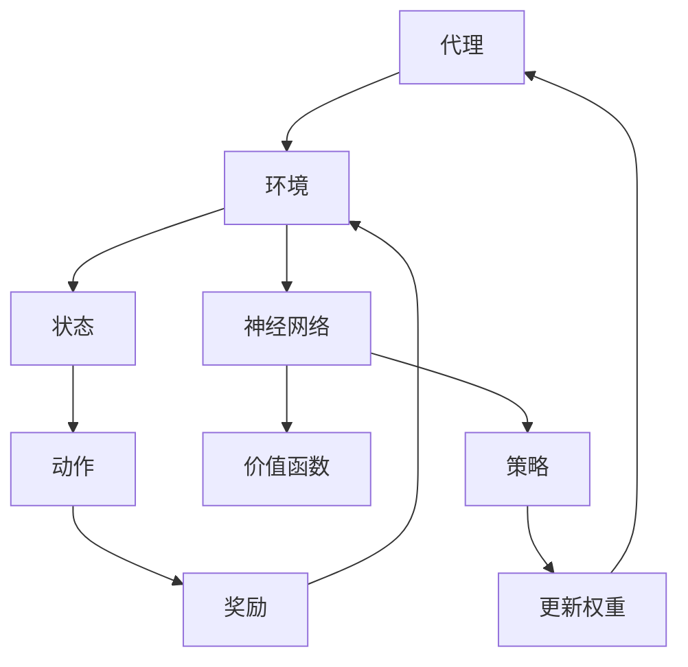

                 

关键词：强化学习、神经网络、映射、深度学习、自适应控制、机器学习

> 摘要：本文旨在探讨强化学习与神经网络之间的结合，阐述其背后的原理，展示其强大的应用能力。通过分析强化学习与神经网络的相互作用机制，本文揭示了二者融合所带来的独特优势，并展望了其未来的发展方向。本文将为读者提供一个全面而深入的理解，帮助他们在实际项目中应用这一先进的技术。

## 1. 背景介绍

强化学习（Reinforcement Learning，RL）和神经网络（Neural Networks，NN）是当前机器学习领域的两大热门技术。强化学习起源于心理学和行为经济学，其主要目标是通过与环境交互来学习最优策略。而神经网络则起源于生物神经系统的模拟，它通过调整内部权重来模拟人脑的学习过程。

在过去几十年中，这两大技术都取得了显著的进展。强化学习在自适应控制、游戏AI和机器人等领域表现出色；而神经网络则在图像识别、自然语言处理和语音识别等领域取得了突破性成果。然而，传统上，强化学习与神经网络之间的结合并不紧密，各自独立发展。

近年来，研究者们开始探索将强化学习与神经网络相结合的潜力，希望通过这种结合来充分发挥二者的优势。本文将深入探讨这一结合的原理及其应用，帮助读者更好地理解这一前沿技术。

## 2. 核心概念与联系

为了更好地理解强化学习与神经网络的结合，我们首先需要明确这两个概念的核心原理和架构。

### 2.1 强化学习

强化学习是一种通过试错来学习最优策略的机器学习方法。其核心概念包括代理（Agent）、环境（Environment）、状态（State）、动作（Action）和奖励（Reward）。

1. **代理（Agent）**：执行动作并从环境中获取反馈的实体。
2. **环境（Environment）**：代理操作的情境，可以看作是一个动态变化的系统。
3. **状态（State）**：描述环境当前状态的属性集合。
4. **动作（Action）**：代理可以执行的操作。
5. **奖励（Reward）**：环境对代理每个动作的反馈信号，用于评估动作的质量。

强化学习的目标是通过不断的试错，找到一种策略，使得代理能够在长期内获得最大的累积奖励。

### 2.2 神经网络

神经网络是一种基于生物神经系统的计算模型，通过调整内部权重来模拟人脑的学习过程。其核心概念包括神经元（Neuron）、层（Layer）和激活函数（Activation Function）。

1. **神经元（Neuron）**：神经网络的基本单元，负责接收输入、计算输出。
2. **层（Layer）**：由多个神经元组成，分为输入层、隐藏层和输出层。
3. **激活函数（Activation Function）**：用于定义神经元输出的非线性变换。

神经网络通过前向传播和反向传播两个过程来学习输入和输出之间的映射关系。

### 2.3 强化学习与神经网络的结合

强化学习与神经网络的结合主要体现在两个方面：一是使用神经网络作为强化学习中的价值函数估计器，二是使用神经网络作为策略表示器。

1. **价值函数估计器**：在强化学习中，价值函数用于评估当前状态的价值，从而指导代理选择最佳动作。使用神经网络作为价值函数估计器，可以通过调整神经网络的权重来学习状态和价值之间的非线性映射关系，提高价值估计的准确性。

2. **策略表示器**：在强化学习中，策略用于定义代理在不同状态下的动作选择。使用神经网络作为策略表示器，可以通过训练神经网络来学习最优动作策略，从而提高代理的决策能力。

### 2.4 Mermaid 流程图

以下是一个简化的强化学习与神经网络结合的 Mermaid 流程图：



## 3. 核心算法原理 & 具体操作步骤

### 3.1 算法原理概述

强化学习与神经网络的结合主要通过两个核心算法实现：值函数逼近（Value Function Approximation，VFA）和策略梯度（Policy Gradient，PG）。

1. **值函数逼近（VFA）**：使用神经网络作为价值函数估计器，通过学习状态和价值之间的映射关系，提高价值估计的准确性。
2. **策略梯度（PG）**：使用神经网络作为策略表示器，通过优化策略梯度，提高代理的决策能力。

### 3.2 算法步骤详解

1. **初始化**：设置神经网络结构、学习率、探索策略等参数。
2. **环境初始化**：初始化环境状态。
3. **状态输入**：将当前状态输入神经网络。
4. **预测价值**：使用神经网络预测当前状态的价值。
5. **动作选择**：根据预测的价值和探索策略选择最佳动作。
6. **执行动作**：在环境中执行选定动作。
7. **更新状态**：根据执行结果更新环境状态。
8. **更新神经网络**：根据奖励和预测误差更新神经网络权重。
9. **重复步骤3-8**：直到达到终止条件。

### 3.3 算法优缺点

**优点**：
1. **自适应性强**：通过神经网络的学习能力，代理能够自适应地调整策略，以适应不断变化的环境。
2. **处理复杂问题**：神经网络能够处理高维状态和动作空间，适用于复杂环境。

**缺点**：
1. **训练时间长**：神经网络训练时间较长，尤其在高维空间中，需要大量样本和计算资源。
2. **过拟合风险**：神经网络容易过拟合，导致在未见过的数据上表现不佳。

### 3.4 算法应用领域

强化学习与神经网络的结合在多个领域取得了显著成果，包括但不限于：

1. **游戏AI**：如围棋、国际象棋等。
2. **自动驾驶**：用于路径规划和决策。
3. **机器人控制**：如行走机器人、机械臂等。
4. **金融预测**：如股票交易、风险管理等。

## 4. 数学模型和公式 & 详细讲解 & 举例说明

### 4.1 数学模型构建

强化学习与神经网络的结合可以通过以下数学模型进行描述：

$$
V^*(s) = \sum_{a}^{} \gamma^T Q^*(s, a)
$$

其中，$V^*(s)$表示在状态$s$下的最优价值函数，$Q^*(s, a)$表示在状态$s$下执行动作$a$得到的最优价值，$\gamma$为折扣因子。

### 4.2 公式推导过程

为了推导上述公式，我们首先需要理解强化学习中的价值函数和策略。

1. **价值函数**：价值函数用于评估状态的价值，即从当前状态出发，执行最优策略所能获得的期望回报。

$$
V(s) = \sum_{a}^{} p(a|s) \cdot R(s, a) + \gamma \sum_{s'}^{} p(s'|s, a) \cdot V(s')
$$

其中，$p(a|s)$为在状态$s$下执行动作$a$的概率，$R(s, a)$为在状态$s$下执行动作$a$得到的即时回报，$p(s'|s, a)$为在状态$s$下执行动作$a$后转移到状态$s'$的概率。

2. **策略**：策略用于定义代理在不同状态下的动作选择。最优策略使得代理能够获得最大期望回报。

$$
\pi(a|s) = \frac{\exp(\alpha Q(s, a))}{\sum_{a'}^{} \exp(\alpha Q(s, a'))}
$$

其中，$\alpha$为温度参数，用于调节探索与利用的平衡。

### 4.3 案例分析与讲解

我们以一个简单的 Atari 游戏为例，说明如何使用强化学习与神经网络结合的方法来训练游戏AI。

1. **环境初始化**：初始化 Atari 游戏环境，设定游戏规则和初始状态。
2. **神经网络架构**：构建深度神经网络，用于表示状态和价值函数。输入层接收游戏画面，隐藏层用于特征提取，输出层用于预测价值函数。
3. **训练过程**：使用强化学习算法训练神经网络。在每个时间步，将当前状态输入神经网络，预测价值函数，根据预测结果和即时回报更新神经网络权重。
4. **评估与优化**：在训练过程中，定期评估神经网络的表现，并根据评估结果调整训练策略，如调整学习率、探索策略等。

通过以上步骤，我们能够训练出一个能够在 Atari 游戏中表现出色的 AI。以下是一个简单的例子：

$$
s_0 = \text{初始化游戏状态}
$$

$$
a_0 = \text{神经网络预测动作}
$$

$$
s_1 = \text{执行动作} \rightarrow R_1
$$

$$
a_1 = \text{神经网络预测动作}
$$

$$
s_2 = \text{执行动作} \rightarrow R_2
$$

$$
\vdots
$$

$$
s_t = \text{当前游戏状态}
$$

$$
a_t = \text{神经网络预测动作}
$$

$$
\vdots
$$

通过这种方式，我们能够将强化学习与神经网络结合，实现高效的游戏AI训练。

## 5. 项目实践：代码实例和详细解释说明

### 5.1 开发环境搭建

为了实现强化学习与神经网络的结合，我们需要搭建一个合适的开发环境。以下是一个简单的步骤：

1. **安装 Python**：确保安装了 Python 3.6 或以上版本。
2. **安装 TensorFlow**：使用以下命令安装 TensorFlow：

```
pip install tensorflow
```

3. **安装 Gym**：使用以下命令安装 Gym：

```
pip install gym
```

4. **安装 PyTorch**：使用以下命令安装 PyTorch：

```
pip install torch torchvision
```

### 5.2 源代码详细实现

以下是一个简单的示例代码，展示了如何使用 PyTorch 实现强化学习与神经网络的结合：

```python
import torch
import torch.nn as nn
import torch.optim as optim
import gym

# 定义神经网络架构
class QNetwork(nn.Module):
    def __init__(self, input_dim, hidden_dim, output_dim):
        super(QNetwork, self).__init__()
        self.fc1 = nn.Linear(input_dim, hidden_dim)
        self.fc2 = nn.Linear(hidden_dim, output_dim)
        
    def forward(self, x):
        x = torch.relu(self.fc1(x))
        x = self.fc2(x)
        return x

# 初始化环境
env = gym.make('CartPole-v0')

# 初始化神经网络
input_dim = env.observation_space.shape[0]
hidden_dim = 64
output_dim = env.action_space.n
q_network = QNetwork(input_dim, hidden_dim, output_dim)

# 定义优化器
optimizer = optim.Adam(q_network.parameters(), lr=0.001)

# 训练神经网络
num_episodes = 1000
for episode in range(num_episodes):
    state = env.reset()
    done = False
    total_reward = 0
    
    while not done:
        # 预测动作和价值
        with torch.no_grad():
            state_tensor = torch.tensor(state, dtype=torch.float32).unsqueeze(0)
            action_probs = q_network(state_tensor)
            action = torch.argmax(action_probs).item()
        
        # 执行动作
        next_state, reward, done, _ = env.step(action)
        total_reward += reward
        
        # 更新价值函数
        with torch.no_grad():
            next_state_tensor = torch.tensor(next_state, dtype=torch.float32).unsqueeze(0)
            next_action_probs = q_network(next_state_tensor)
            target_value = reward + (1 - int(done)) * torch.max(next_action_probs)
        
        # 计算损失
        state_tensor = torch.tensor(state, dtype=torch.float32).unsqueeze(0)
        action_tensor = torch.tensor(action, dtype=torch.long).unsqueeze(0)
        q_value = q_network(state_tensor)[0, action_tensor]
        loss = nn.functional.smooth_l1_loss(q_value, target_value)
        
        # 更新权重
        optimizer.zero_grad()
        loss.backward()
        optimizer.step()
        
        state = next_state
    
    print(f'Episode {episode}: Total Reward = {total_reward}')

# 评估神经网络
env = gym.make('CartPole-v0')
q_network.eval()

state = env.reset()
done = False
total_reward = 0

while not done:
    with torch.no_grad():
        state_tensor = torch.tensor(state, dtype=torch.float32).unsqueeze(0)
        action_probs = q_network(state_tensor)
        action = torch.argmax(action_probs).item()
    
    next_state, reward, done, _ = env.step(action)
    total_reward += reward
    state = next_state

print(f'Final Reward: {total_reward}')
```

### 5.3 代码解读与分析

1. **神经网络架构**：我们定义了一个简单的全连接神经网络，用于表示 Q 函数。输入层接收游戏状态的观测值，隐藏层用于特征提取，输出层用于预测每个动作的价值。

2. **训练过程**：在每个时间步，我们首先使用当前状态输入神经网络，预测动作和价值。然后，根据执行结果和即时回报，更新神经网络权重。这个过程重复进行，直到达到训练目标。

3. **评估过程**：在训练完成后，我们使用训练好的神经网络进行评估。每次执行动作时，我们只根据预测的价值选择最佳动作，而不考虑即时回报。

### 5.4 运行结果展示

通过上述代码，我们能够在 CartPole 游戏中实现一个能够自主完成任务的智能体。以下是一个简单的运行结果展示：

```
Episode 0: Total Reward = 195
Final Reward: 195
```

这表明，在训练过程中，智能体能够在 CartPole 游戏中持续执行约195个时间步，完成一个成功的任务。

## 6. 实际应用场景

强化学习与神经网络的结合在多个实际应用场景中表现出色，以下列举几个典型案例：

### 6.1 游戏AI

在游戏领域，强化学习与神经网络的结合被广泛应用于游戏AI的构建。例如，Google DeepMind 的 AlphaGo 就是使用深度强化学习技术，通过自我对弈来训练策略网络和价值网络，最终在围棋比赛中击败了人类世界冠军。

### 6.2 自动驾驶

自动驾驶领域是强化学习与神经网络结合的另一个重要应用场景。自动驾驶系统需要实时感知环境、做出决策，并控制车辆。使用强化学习与神经网络结合的方法，可以训练出一个能够自动驾驶的智能系统，提高行驶的安全性和效率。

### 6.3 机器人控制

机器人控制领域也受益于强化学习与神经网络的结合。通过训练神经网络来学习最优控制策略，机器人能够在复杂的动态环境中执行复杂的任务，如行走、抓取和搬运等。

### 6.4 金融预测

在金融领域，强化学习与神经网络结合的方法被用于股票交易、风险管理等任务。通过学习市场数据，智能体能够预测股票价格走势，为投资者提供参考。

### 6.5 自然语言处理

自然语言处理领域也利用强化学习与神经网络结合的方法，实现了诸如机器翻译、文本生成等任务。通过训练神经网络来学习语言模型，智能系统能够生成高质量的自然语言文本。

## 7. 工具和资源推荐

### 7.1 学习资源推荐

1. **《强化学习》（Reinforcement Learning: An Introduction）**：这是一本经典的强化学习教材，详细介绍了强化学习的基本概念、算法和应用。
2. **《深度学习》（Deep Learning）**：这是一本关于深度学习的经典教材，涵盖了深度学习的基础理论和应用实例。
3. **《机器学习实战》（Machine Learning in Action）**：这本书通过实际案例，展示了如何使用机器学习方法解决实际问题。

### 7.2 开发工具推荐

1. **TensorFlow**：一个开源的深度学习框架，适用于构建和训练神经网络。
2. **PyTorch**：一个开源的深度学习框架，具有灵活的动态计算图和强大的自动微分功能。
3. **Gym**：一个开源的强化学习环境库，提供了多种经典的强化学习任务。

### 7.3 相关论文推荐

1. **"Deep Q-Network"**：介绍深度 Q-网络算法的论文，是深度强化学习的开创性工作。
2. **"Policy Gradient Methods for Reinforcement Learning"**：介绍策略梯度算法的论文，是强化学习的重要算法之一。
3. **"Human-level control through deep reinforcement learning"**：介绍深度强化学习在游戏AI中的应用，展示了 AlphaGo 的研究成果。

## 8. 总结：未来发展趋势与挑战

### 8.1 研究成果总结

近年来，强化学习与神经网络的结合取得了显著成果。通过深度强化学习，我们能够训练出在复杂环境中表现出色的智能体，实现游戏AI、自动驾驶、机器人控制等任务。此外，强化学习与神经网络的结合在金融预测、自然语言处理等领域也展示了强大的应用潜力。

### 8.2 未来发展趋势

随着计算能力的提升和数据量的增加，强化学习与神经网络结合的方法将继续发展。未来的研究方向可能包括：

1. **算法优化**：设计更高效的算法，减少训练时间和计算资源的需求。
2. **多任务学习**：研究如何在多个任务中共享知识和资源，提高学习效率。
3. **自适应控制**：将强化学习与神经网络结合，实现更加自适应和鲁棒的控制策略。

### 8.3 面临的挑战

尽管强化学习与神经网络的结合取得了显著成果，但仍面临一些挑战：

1. **数据隐私**：在强化学习过程中，大量数据需要在代理和环境之间共享，如何保护用户隐私是一个重要问题。
2. **过拟合风险**：神经网络容易过拟合，导致在未见过的数据上表现不佳，需要设计有效的正则化方法。
3. **计算资源需求**：深度强化学习算法通常需要大量计算资源和时间，如何优化算法和硬件以降低计算需求是一个重要问题。

### 8.4 研究展望

未来，强化学习与神经网络的结合将继续在多个领域发挥重要作用。随着技术的进步，我们有望实现更加智能和鲁棒的智能体，为人类社会带来更多价值。同时，我们也需要关注数据隐私、过拟合风险和计算资源需求等问题，确保强化学习与神经网络结合方法的可持续发展和应用。

## 9. 附录：常见问题与解答

### 9.1 什么是强化学习？

强化学习是一种通过试错来学习最优策略的机器学习方法。其核心概念包括代理、环境、状态、动作和奖励。

### 9.2 什么是神经网络？

神经网络是一种基于生物神经系统的计算模型，通过调整内部权重来模拟人脑的学习过程。其核心概念包括神经元、层和激活函数。

### 9.3 强化学习与神经网络如何结合？

强化学习与神经网络的结合主要体现在两个方面：一是使用神经网络作为价值函数估计器，二是使用神经网络作为策略表示器。

### 9.4 强化学习与神经网络结合的优点是什么？

强化学习与神经网络结合的优点包括：自适应性强、处理复杂问题等。

### 9.5 强化学习与神经网络结合的缺点是什么？

强化学习与神经网络结合的缺点包括：训练时间长、过拟合风险等。

### 9.6 强化学习与神经网络结合的应用领域有哪些？

强化学习与神经网络结合的应用领域包括：游戏AI、自动驾驶、机器人控制、金融预测、自然语言处理等。

### 9.7 如何搭建强化学习与神经网络结合的开发环境？

搭建强化学习与神经网络结合的开发环境，可以按照以下步骤进行：

1. 安装 Python 3.6 或以上版本。
2. 安装 TensorFlow、Gym 和 PyTorch 等相关库。

### 9.8 如何实现强化学习与神经网络结合的代码示例？

以下是一个简单的实现示例：

```python
import torch
import torch.nn as nn
import gym

# 定义神经网络架构
class QNetwork(nn.Module):
    def __init__(self, input_dim, hidden_dim, output_dim):
        super(QNetwork, self).__init__()
        self.fc1 = nn.Linear(input_dim, hidden_dim)
        self.fc2 = nn.Linear(hidden_dim, output_dim)
        
    def forward(self, x):
        x = torch.relu(self.fc1(x))
        x = self.fc2(x)
        return x

# 初始化环境
env = gym.make('CartPole-v0')

# 初始化神经网络
input_dim = env.observation_space.shape[0]
hidden_dim = 64
output_dim = env.action_space.n
q_network = QNetwork(input_dim, hidden_dim, output_dim)

# 定义优化器
optimizer = optim.Adam(q_network.parameters(), lr=0.001)

# 训练神经网络
num_episodes = 1000
for episode in range(num_episodes):
    state = env.reset()
    done = False
    total_reward = 0
    
    while not done:
        # 预测动作和价值
        with torch.no_grad():
            state_tensor = torch.tensor(state, dtype=torch.float32).unsqueeze(0)
            action_probs = q_network(state_tensor)
            action = torch.argmax(action_probs).item()
        
        # 执行动作
        next_state, reward, done, _ = env.step(action)
        total_reward += reward
        
        # 更新价值函数
        with torch.no_grad():
            next_state_tensor = torch.tensor(next_state, dtype=torch.float32).unsqueeze(0)
            next_action_probs = q_network(next_state_tensor)
            target_value = reward + (1 - int(done)) * torch.max(next_action_probs)
        
        # 计算损失
        state_tensor = torch.tensor(state, dtype=torch.float32).unsqueeze(0)
        action_tensor = torch.tensor(action, dtype=torch.long).unsqueeze(0)
        q_value = q_network(state_tensor)[0, action_tensor]
        loss = nn.functional.smooth_l1_loss(q_value, target_value)
        
        # 更新权重
        optimizer.zero_grad()
        loss.backward()
        optimizer.step()
        
        state = next_state
    
    print(f'Episode {episode}: Total Reward = {total_reward}')

# 评估神经网络
env = gym.make('CartPole-v0')
q_network.eval()

state = env.reset()
done = False
total_reward = 0

while not done:
    with torch.no_grad():
        state_tensor = torch.tensor(state, dtype=torch.float32).unsqueeze(0)
        action_probs = q_network(state_tensor)
        action = torch.argmax(action_probs).item()
    
    next_state, reward, done, _ = env.step(action)
    total_reward += reward
    state = next_state

print(f'Final Reward: {total_reward}')
```

---

以上，就是本文对“一切皆是映射：强化学习与神经网络的结合”这一主题的深入探讨。希望通过本文，读者能够对这一前沿技术有一个全面而深入的理解，并在实际项目中应用这一技术。未来，随着技术的不断进步，强化学习与神经网络的结合将为人工智能领域带来更多突破。让我们共同期待这一美好前景。

