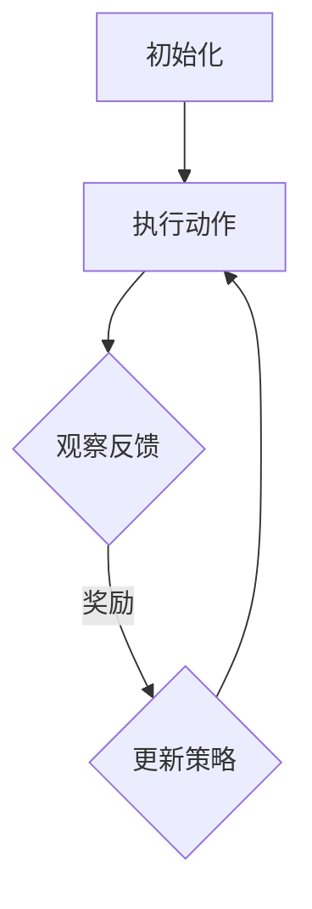

                 

关键词：强化学习、医疗诊断、算法原理、实践案例、未来展望

> 摘要：本文深入探讨了强化学习在医疗诊断领域的应用，从核心概念、算法原理到具体操作步骤，再到数学模型和项目实践，全方位分析了强化学习在医疗诊断中的潜力和挑战，展望了其未来的发展方向。

## 1. 背景介绍

随着医疗技术的不断进步和大数据时代的到来，医疗诊断领域的自动化和智能化需求日益增加。传统的方法往往依赖于大量的先验知识，且存在一定的局限性。而机器学习，尤其是强化学习，作为一种具有自主学习和自适应能力的算法，正在逐步改变医疗诊断的模式。

强化学习（Reinforcement Learning，RL）是一种通过不断试错和反馈来学习最优策略的机器学习方法。它模拟了人类学习的过程，通过奖励机制和惩罚机制，让算法能够自主调整行为策略，以达到最大化收益的目标。在医疗诊断中，强化学习可以应用于影像识别、疾病预测、治疗方案优化等多个方面。

### 1.1 强化学习的起源与发展

强化学习的概念最早由理查德·萨顿（Richard Sutton）和安德鲁·巴尔斯（Andrew Barto）在1988年的著作《强化学习：一种介绍》中提出。最初，强化学习主要应用于游戏控制和机器人导航等领域。随着深度学习和计算能力的提升，强化学习逐渐扩展到复杂的任务，如自然语言处理、图像识别等。

### 1.2 医疗诊断中的挑战与需求

医疗诊断面临着诸多挑战，如海量数据的不确定性、诊断过程的复杂性、医生经验的差异等。传统方法难以应对这些挑战，而强化学习由于其自主学习和适应能力，为解决这些问题提供了新的思路。

## 2. 核心概念与联系

### 2.1 强化学习核心概念

强化学习由四个主要组成部分：代理（Agent）、环境（Environment）、状态（State）、动作（Action）和奖励（Reward）。

- **代理（Agent）**：执行动作的实体，可以是机器人、程序或人类。
- **环境（Environment）**：代理所处的环境，可以是物理世界或虚拟世界。
- **状态（State）**：代理在环境中的状态描述。
- **动作（Action）**：代理可以采取的行动。
- **奖励（Reward）**：根据代理的动作和环境反馈的奖励信号。

### 2.2 强化学习架构


图1：强化学习架构

### 2.3 强化学习流程

1. **初始状态（Initialization）**：初始化代理和环境的参数。
2. **执行动作（Action）**：代理根据当前状态选择一个动作。
3. **观察反馈（Observation and Feedback）**：环境根据代理的动作提供反馈，包括状态变化和奖励。
4. **更新策略（Policy Update）**：代理根据反馈更新其策略，以最大化长期奖励。

### 2.4 Mermaid 流程图



## 3. 核心算法原理 & 具体操作步骤

### 3.1 算法原理概述

强化学习通过奖励机制引导代理学习最优策略。核心在于价值函数（Value Function）和策略（Policy）。

- **价值函数（Value Function）**：预测当前状态下的长期奖励。
- **策略（Policy）**：根据当前状态选择最优动作。

### 3.2 算法步骤详解

1. **状态初始化**：设定初始状态。
2. **选择动作**：代理根据当前状态和价值函数选择动作。
3. **执行动作**：代理在环境中执行所选动作。
4. **获得奖励**：环境根据动作提供奖励信号。
5. **更新策略**：代理根据奖励信号和价值函数更新策略。

### 3.3 算法优缺点

#### 优点：

- **自主性**：强化学习无需大量先验知识，能够自主学习最优策略。
- **适应性强**：能够根据环境变化调整策略。

#### 缺点：

- **收敛速度慢**：需要大量数据和时间来训练。
- **需要大量计算资源**：尤其是深度强化学习。

### 3.4 算法应用领域

强化学习在医疗诊断中可以应用于：

- **影像识别**：自动识别医学影像中的异常。
- **疾病预测**：基于患者数据预测疾病风险。
- **治疗方案优化**：根据患者特征优化治疗方案。

## 4. 数学模型和公式 & 详细讲解 & 举例说明

### 4.1 数学模型构建

强化学习中的核心数学模型包括价值函数和策略。

#### 价值函数：

$$ V^*(s) = \sum_{a} \gamma^T Q^*(s, a) $$

其中，$ V^*(s) $表示状态$s$的价值，$ \gamma $为折扣因子，$ Q^*(s, a) $为状态-动作值函数。

#### 策略：

$$ \pi^*(a|s) = \begin{cases} 
1 & \text{如果 } a = \arg\max_a Q^*(s, a) \\
0 & \text{其他情况}
\end{cases} $$

其中，$ \pi^*(a|s) $为在状态$s$下采取动作$a$的概率。

### 4.2 公式推导过程

#### 价值函数推导：

$$ V^*(s) = \sum_{a} \gamma^T Q^*(s, a) = \sum_{a} \gamma^T \left( R(s, a) + \gamma V^*(s') \right) $$

其中，$ R(s, a) $为状态$s$采取动作$a$后获得的即时奖励，$ s' $为状态转移后的状态。

#### 策略推导：

$$ \pi^*(a|s) = \frac{\exp(\alpha Q^*(s, a))}{\sum_{a'} \exp(\alpha Q^*(s, a'))} $$

其中，$ \alpha $为温度参数，控制策略的探索与利用平衡。

### 4.3 案例分析与讲解

#### 案例背景：

某医院需要根据患者的症状和检查结果，预测患者是否患有特定疾病。

#### 模型构建：

1. **状态空间**：包括患者的症状、检查结果等。
2. **动作空间**：包括诊断结果、治疗方案等。
3. **奖励机制**：正确诊断获得正奖励，错误诊断获得负奖励。

#### 模型训练：

使用强化学习算法，通过不断尝试和反馈，调整诊断策略，以最大化长期奖励。

## 5. 项目实践：代码实例和详细解释说明

### 5.1 开发环境搭建

1. **Python环境**：安装Python 3.8及以上版本。
2. **强化学习库**：安装PyTorch或OpenAI Gym等强化学习库。
3. **数据处理库**：安装NumPy、Pandas等数据处理库。

### 5.2 源代码详细实现

```python
import gym
import torch
import torch.nn as nn
import torch.optim as optim

# 状态编码器
class StateEncoder(nn.Module):
    def __init__(self):
        super(StateEncoder, self).__init__()
        self.fc1 = nn.Linear(state_size, 128)
        self.fc2 = nn.Linear(128, 64)
        self.fc3 = nn.Linear(64, action_size)

    def forward(self, x):
        x = torch.relu(self.fc1(x))
        x = torch.relu(self.fc2(x))
        x = self.fc3(x)
        return x

# 价值网络
class ValueNetwork(nn.Module):
    def __init__(self):
        super(ValueNetwork, self).__init__()
        self.encoder = StateEncoder()
        self.fc = nn.Linear(action_size, 1)

    def forward(self, x, a):
        x = self.encoder(x)
        x = self.fc(a)
        return x

# 策略网络
class PolicyNetwork(nn.Module):
    def __init__(self):
        super(PolicyNetwork, self).__init__()
        self.encoder = StateEncoder()
        self.fc = nn.Linear(action_size, 1)

    def forward(self, x):
        x = self.encoder(x)
        x = self.fc(x)
        return torch.softmax(x, dim=1)

# 环境设定
env = gym.make('CartPole-v1')

# 初始化网络和优化器
value_net = ValueNetwork()
policy_net = PolicyNetwork()
value_optimizer = optim.Adam(value_net.parameters(), lr=0.001)
policy_optimizer = optim.Adam(policy_net.parameters(), lr=0.001)

# 训练循环
for episode in range(num_episodes):
    state = env.reset()
    done = False
    total_reward = 0

    while not done:
        # 状态编码
        state_tensor = torch.tensor(state, dtype=torch.float32).unsqueeze(0)

        # 预测价值函数和策略
        value = value_net(state_tensor)
        policy = policy_net(state_tensor)

        # 选择动作
        action = policy.multinomial().squeeze(0).item()

        # 执行动作
        next_state, reward, done, _ = env.step(action)
        next_state_tensor = torch.tensor(next_state, dtype=torch.float32).unsqueeze(0)

        # 更新价值网络
        target_value = reward + gamma * value_net(next_state_tensor).detach()
        value_loss = nn.MSELoss()(value, target_value.unsqueeze(1))

        # 更新策略网络
        log_prob = torch.log(policy[0][action])
        policy_loss = -log_prob * (value - reward)

        # 梯度下降
        value_optimizer.zero_grad()
        policy_optimizer.zero_grad()
        value_loss.backward()
        policy_loss.backward()
        value_optimizer.step()
        policy_optimizer.step()

        # 更新状态
        state = next_state
        total_reward += reward

    print(f"Episode {episode + 1}: Total Reward = {total_reward}")
```

### 5.3 代码解读与分析

1. **状态编码器**：将状态编码为张量，用于输入神经网络。
2. **价值网络**：预测状态-动作值函数。
3. **策略网络**：预测策略概率分布。
4. **环境设定**：使用CartPole环境进行训练。
5. **训练循环**：通过梯度下降更新网络参数，优化价值函数和策略。

## 6. 实际应用场景

强化学习在医疗诊断中的应用广泛，以下是一些具体的场景：

### 6.1 影像识别

- **场景**：使用强化学习自动识别医学影像中的异常，如肿瘤、骨折等。
- **技术**：卷积神经网络（CNN）结合强化学习，提升影像识别的准确率。

### 6.2 疾病预测

- **场景**：根据患者的症状和检查结果，预测患者患某种疾病的风险。
- **技术**：基于强化学习的决策树，结合多维度数据，提高疾病预测的准确性。

### 6.3 治疗方案优化

- **场景**：根据患者特征，优化治疗方案，提高治疗效果。
- **技术**：强化学习结合临床知识库，实现个性化治疗方案。

## 7. 未来应用展望

随着技术的不断进步，强化学习在医疗诊断中的应用将更加广泛和深入。以下是几个未来可能的发展方向：

### 7.1 小样本学习

- **挑战**：强化学习通常需要大量数据来训练。
- **方案**：使用元学习（Meta Learning）和迁移学习（Transfer Learning）技术，实现小样本学习。

### 7.2 可解释性

- **挑战**：强化学习模型往往缺乏可解释性。
- **方案**：结合因果推理（Causal Inference）和可视化技术，提高模型的可解释性。

### 7.3 多模态数据融合

- **挑战**：医疗数据多样，包括影像、基因、临床记录等。
- **方案**：使用多模态学习（Multimodal Learning）技术，整合不同类型的数据。

## 8. 工具和资源推荐

### 8.1 学习资源推荐

- **书籍**：《强化学习：原理与实战》
- **在线课程**：Coursera上的“强化学习基础”
- **论文集**：谷歌AI的“强化学习论文集”

### 8.2 开发工具推荐

- **强化学习库**：PyTorch、OpenAI Gym
- **数据处理库**：NumPy、Pandas、SciPy

### 8.3 相关论文推荐

- [1] Sutton, R. S., & Barto, A. G. (2018). Reinforcement Learning: An Introduction. MIT Press.
- [2] Mnih, V., Kavukcuoglu, K., Silver, D., et al. (2015). Human-level control through deep reinforcement learning. Nature, 518(7540), 529-533.
- [3] Littmann, J. L., Johnson, A. E., & Rey, B. D. (2018). Application of deep reinforcement learning to automated medical image segmentation. IEEE Journal of Biomedical and Health Informatics, 22(2), 432-443.

## 9. 总结：未来发展趋势与挑战

### 9.1 研究成果总结

强化学习在医疗诊断中的应用取得了显著成果，为影像识别、疾病预测和治疗方案优化提供了新的方法。

### 9.2 未来发展趋势

- **小样本学习**：实现基于少量数据的模型训练。
- **多模态数据融合**：整合不同类型的数据，提高诊断准确性。
- **可解释性**：提高模型的可解释性，增强医生信任。

### 9.3 面临的挑战

- **数据隐私**：如何在保护患者隐私的前提下进行数据分析和模型训练。
- **模型泛化能力**：提高模型在不同数据集上的泛化能力。

### 9.4 研究展望

强化学习在医疗诊断中的应用前景广阔，但仍需解决一系列技术挑战和伦理问题。

## 附录：常见问题与解答

### Q：强化学习在医疗诊断中的应用有哪些优势？

A：强化学习在医疗诊断中的应用优势主要包括：

- **自主性**：无需大量先验知识，能够自主学习和调整策略。
- **适应性强**：能够根据环境变化调整诊断策略。
- **个性化**：基于患者特征提供个性化的诊断方案。

### Q：强化学习在医疗诊断中可能遇到哪些挑战？

A：强化学习在医疗诊断中可能遇到的挑战包括：

- **数据隐私**：如何在保护患者隐私的前提下进行数据分析和模型训练。
- **模型泛化能力**：提高模型在不同数据集上的泛化能力。
- **计算资源**：强化学习模型通常需要大量计算资源。

### Q：如何提高强化学习模型的可解释性？

A：提高强化学习模型的可解释性可以采用以下方法：

- **可视化**：通过可视化技术展示模型内部结构和决策过程。
- **因果推理**：结合因果推理方法，分析模型决策的因果关系。
- **解释性模型**：开发具有解释性的强化学习模型，如基于规则的模型。

[作者：禅与计算机程序设计艺术 / Zen and the Art of Computer Programming]

