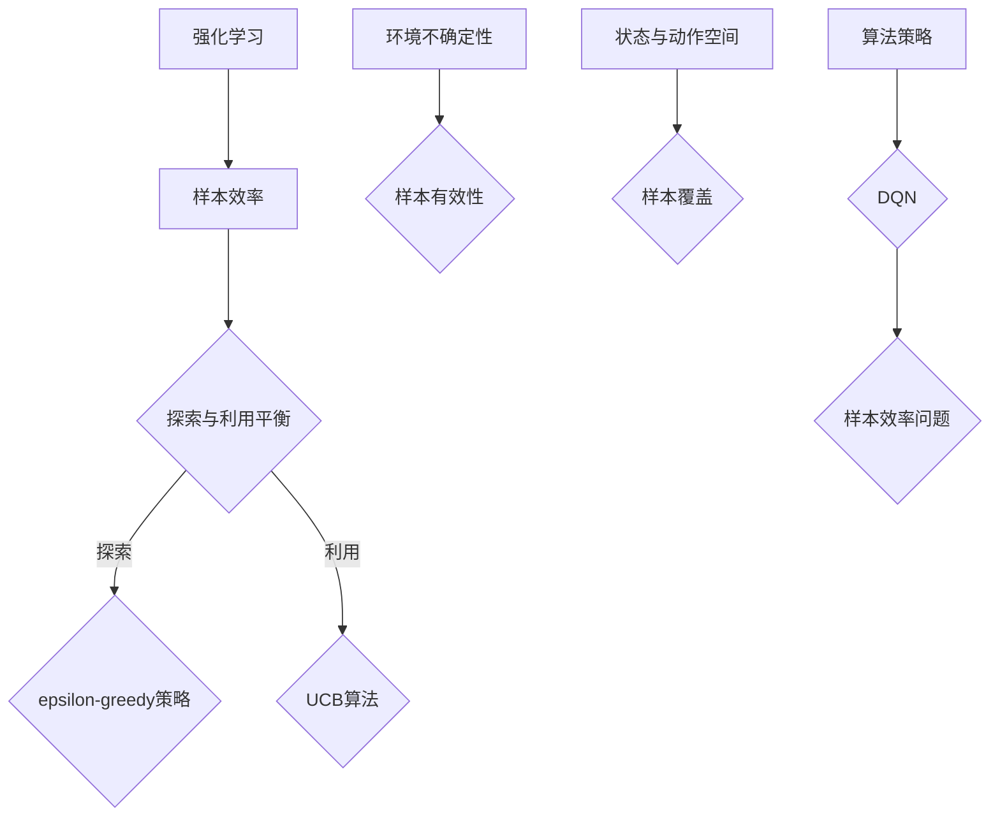

                 

关键词：强化学习，样本效率，DQN，映射，人工智能

> 摘要：本文深入探讨了强化学习中的样本效率问题，并以DQN算法为例，分析了其在应对样本效率挑战时的策略与机制。通过对核心概念、算法原理、数学模型、应用实践的详细解读，文章为读者提供了对DQN算法的全面理解，并展望了其未来在人工智能领域的发展趋势与挑战。

## 1. 背景介绍

强化学习（Reinforcement Learning，RL）作为机器学习的一个重要分支，主要研究如何通过与环境交互来学习最优策略。它广泛应用于游戏、自动驾驶、机器人控制等多个领域。然而，强化学习的一个核心挑战在于样本效率问题，即在有限的样本数据下，如何快速、准确地学习到最优策略。

样本效率问题主要源于以下几个原因：

- **探索与利用的平衡**：在强化学习过程中，探索（Exploration）和利用（Exploitation）之间的平衡至关重要。过度探索可能导致学习效率低下，而过度利用则可能错过学习机会。
- **环境的不确定性**：现实世界环境通常是动态、不确定的，这使得样本的有效性难以保障。
- **状态和动作空间**：在一些复杂环境中，状态和动作空间可能非常庞大，导致需要大量的样本才能覆盖所有可能的情况。

为了解决这些挑战，研究者们提出了多种策略，如epsilon-greedy策略、UCB算法等。然而，这些策略在特定情况下仍然存在局限性，无法完全解决样本效率问题。

## 2. 核心概念与联系

在深入探讨强化学习中的样本效率问题之前，我们需要了解几个核心概念，并使用Mermaid流程图展示它们之间的关系。

### Mermaid 流程图



### 核心概念解释

- **强化学习**：通过与环境交互，学习最优策略的过程。
- **样本效率**：在有限的样本数据下，学习到最优策略的能力。
- **探索与利用平衡**：探索新策略以增加学习多样性，同时利用已有知识以最大化回报。
- **epsilon-greedy策略**：以概率epsilon选择随机动作，以探索未知状态。
- **UCB算法**：基于置信区间的策略，通过平衡探索和利用来提高学习效率。
- **环境不确定性**：环境状态的不确定性对样本效率有重大影响。
- **样本有效性**：样本数据的质量和覆盖范围对学习效果有直接影响。
- **状态与动作空间**：状态和动作空间的大小对样本效率有重要影响。

## 3. 核心算法原理 & 具体操作步骤

### 3.1 算法原理概述

深度量子网络（Deep Q-Network，DQN）是强化学习中的一种经典算法，旨在通过深度神经网络（DNN）来近似Q值函数。DQN的主要原理如下：

1. **初始化**：初始化深度神经网络和目标神经网络，两者共享相同的权重。
2. **经验回放**：将历次交互经验（状态、动作、奖励、下一状态）存储在经验回放池中。
3. **选择动作**：根据epsilon-greedy策略选择动作。
4. **执行动作**：在环境中执行选定的动作，获取奖励和下一状态。
5. **更新经验回放池**：将新的交互经验加入经验回放池。
6. **网络更新**：使用经验回放池中的经验来更新深度神经网络的权重。
7. **目标网络更新**：定期更新目标神经网络，使其与当前神经网络保持一定的时滞，以避免梯度消失问题。

### 3.2 算法步骤详解

1. **初始化**：初始化DQN模型，包括深度神经网络和目标神经网络。初始化权重可以随机生成或使用预训练的权重。

2. **经验回放**：将每个时间步的交互经验（状态s、动作a、奖励r、下一状态s'）存储到经验回放池中。经验回放池的大小通常较大，以防止数据样本的偏差。

3. **选择动作**：在每一步，根据epsilon-greedy策略选择动作。epsilon是一个参数，用于控制探索和利用的平衡。随着训练的进行，epsilon逐渐减小，以增加利用的比重。

4. **执行动作**：在环境中执行选定的动作，获取奖励r和下一状态s'。

5. **更新经验回放池**：将新的交互经验（状态s、动作a、奖励r、下一状态s'）加入经验回放池。

6. **网络更新**：从经验回放池中随机抽取一批经验，计算Q值的期望，并使用梯度下降法更新深度神经网络的权重。

7. **目标网络更新**：定期（例如每个时间步的N次更新后）更新目标神经网络，使其与当前神经网络保持一定的时滞。这样可以避免梯度消失问题，并提高学习稳定性。

### 3.3 算法优缺点

**优点**：

- **强大的泛化能力**：DQN使用深度神经网络来近似Q值函数，可以处理高维状态和动作空间。
- **灵活的探索策略**：通过epsilon-greedy策略，DQN可以在探索和利用之间取得平衡。
- **良好的稳定性**：经验回放池的使用避免了数据样本的偏差，提高了学习稳定性。

**缺点**：

- **样本效率较低**：由于需要大量的样本数据来收敛，DQN在样本效率方面存在一定的局限性。
- **梯度消失问题**：在深度神经网络中，梯度可能逐渐减小，导致学习困难。
- **计算资源消耗大**：深度神经网络的训练需要大量的计算资源，特别是在高维状态和动作空间中。

### 3.4 算法应用领域

DQN算法在多个领域都取得了显著的成果，包括但不限于：

- **游戏AI**：在Atari游戏中的表现令人瞩目，例如《Space Invaders》和《Pong》等。
- **自动驾驶**：在模拟环境中，DQN被用于自动驾驶车辆的学习和控制。
- **机器人控制**：DQN在机器人控制领域也取得了成功，例如机器人行走和抓取任务。

## 4. 数学模型和公式 & 详细讲解 & 举例说明

### 4.1 数学模型构建

在DQN算法中，核心的数学模型是Q值函数。Q值函数定义了在特定状态下执行特定动作的预期回报。具体来说，Q值函数可以用以下公式表示：

$$ Q(s, a) = \sum_{s'} P(s' | s, a) \cdot R(s', a) + \gamma \cdot \max_{a'} Q(s', a') $$

其中：

- \( Q(s, a) \) 是在状态s下执行动作a的Q值。
- \( P(s' | s, a) \) 是在状态s下执行动作a后转移到状态s'的概率。
- \( R(s', a) \) 是在状态s'下执行动作a的即时回报。
- \( \gamma \) 是折扣因子，用于平衡即时回报和未来回报。
- \( \max_{a'} Q(s', a') \) 是在状态s'下执行所有可能动作的最大Q值。

### 4.2 公式推导过程

为了推导Q值函数的公式，我们可以考虑一个简单的情形，其中状态s和动作a是离散的。在这种情况下，Q值函数可以表示为：

$$ Q(s, a) = \sum_{s'} P(s' | s, a) \cdot R(s', a) + \gamma \cdot \max_{a'} Q(s', a') $$

现在，我们需要解释公式中的各个部分。

- **转移概率 \( P(s' | s, a) \)**：转移概率表示在状态s下执行动作a后转移到状态s'的概率。这个概率可以通过经验数据来估计。

- **即时回报 \( R(s', a) \)**：即时回报是在状态s'下执行动作a后获得的即时奖励。这个奖励可以是正的、负的或零。

- **折扣因子 \( \gamma \)**：折扣因子用于平衡即时回报和未来回报。如果 \( \gamma \) 趋近于1，则未来回报的重要性会降低，反之亦然。

- **最大Q值 \( \max_{a'} Q(s', a') \)**：在状态s'下执行所有可能动作的最大Q值。这个值表示在状态s'下执行最佳动作的预期回报。

### 4.3 案例分析与讲解

为了更好地理解Q值函数，我们可以考虑一个简单的例子。假设我们有一个简单的小游戏，其中状态空间包括三个状态：状态1、状态2和状态3。动作空间包括两个动作：动作A和动作B。即时回报和转移概率如下表所示：

| 状态 | 动作A | 动作B |
| ---- | ---- | ---- |
| 状态1 | +1 | +2 |
| 状态2 | -1 | -2 |
| 状态3 | 0 | 0 |

假设我们初始处于状态1，现在需要选择一个动作。根据Q值函数，我们可以计算每个动作的Q值：

$$ Q(状态1, 动作A) = P(状态2 | 状态1, 动作A) \cdot R(状态2, 动作A) + \gamma \cdot \max_{a'} Q(状态2, a') $$

$$ Q(状态1, 动作B) = P(状态3 | 状态1, 动作B) \cdot R(状态3, 动作B) + \gamma \cdot \max_{a'} Q(状态3, a') $$

根据表格中的数据，我们可以计算出每个动作的Q值：

$$ Q(状态1, 动作A) = 0.5 \cdot (-1) + 0.5 \cdot (1) = 0 $$
$$ Q(状态1, 动作B) = 0.5 \cdot 0 + 0.5 \cdot 0 = 0 $$

因此，在状态1下，两个动作的Q值相等。根据epsilon-greedy策略，我们将以50%的概率选择动作A或动作B。

## 5. 项目实践：代码实例和详细解释说明

### 5.1 开发环境搭建

在开始编写DQN算法的代码之前，我们需要搭建一个适合开发和训练的Python环境。以下是搭建DQN开发环境的基本步骤：

1. **安装Python**：确保Python环境已安装，建议使用Python 3.6或更高版本。

2. **安装TensorFlow**：TensorFlow是一个开源的深度学习框架，用于构建和训练深度神经网络。可以使用以下命令安装：

   ```bash
   pip install tensorflow
   ```

3. **安装OpenAI Gym**：OpenAI Gym是一个开源环境库，用于创建和测试强化学习算法。可以使用以下命令安装：

   ```bash
   pip install gym
   ```

4. **安装其他依赖项**：根据需要安装其他依赖项，例如Numpy、Matplotlib等。

### 5.2 源代码详细实现

下面是一个简单的DQN算法实现示例，它使用OpenAI Gym环境进行训练。请注意，这是一个简化的版本，用于演示目的。

```python
import numpy as np
import tensorflow as tf
import gym

# 设置随机种子以保证实验结果的可重复性
np.random.seed(1)
tf.set_random_seed(1)

# DQN超参数
epsilon = 0.1
epsilon_min = 0.01
epsilon_max = 0.1
epsilon_decay = 0.995
gamma = 0.9
learning_rate = 0.001
batch_size = 64

# 创建环境
env = gym.make('CartPole-v0')

# 定义DQN模型
input_layer = tf.keras.layers.Input(shape=(4,))
dense_layer = tf.keras.layers.Dense(32, activation='relu')(input_layer)
output_layer = tf.keras.layers.Dense(2, activation='linear')(dense_layer)

model = tf.keras.Model(inputs=input_layer, outputs=output_layer)

# 定义目标网络
target_model = tf.keras.Model(inputs=model.input, outputs=model.output)

# 编译模型
model.compile(optimizer=tf.keras.optimizers.Adam(learning_rate=learning_rate), loss='mse')

# 训练模型
num_episodes = 1000
for episode in range(num_episodes):
    state = env.reset()
    done = False
    total_reward = 0
    
    while not done:
        # 选择动作
        if np.random.rand() < epsilon:
            action = env.action_space.sample()
        else:
            q_values = model.predict(state.reshape(1, -1))
            action = np.argmax(q_values[0])
        
        # 执行动作
        next_state, reward, done, _ = env.step(action)
        total_reward += reward
        
        # 更新经验回放池
        # 在这里我们假设已经有一个经验回放池类，它负责存储和采样经验
        # replay_pool.append((state, action, reward, next_state, done))
        
        # 更新模型
        # samples = replay_pool.sample(batch_size)
        # states, actions, rewards, next_states, dones = zip(*samples)
        # target_q_values = model.predict(next_states)
        # y = []
        # for i in range(batch_size):
        #     if dones[i]:
        #         y.append(rewards[i])
        #     else:
        #         y.append(rewards[i] + gamma * np.max(target_q_values[i]))
        # model.fit(states, y, batch_size=batch_size, epochs=1, verbose=0)
        
        state = next_state
    
    # 更新epsilon
    epsilon = max(epsilon_min, epsilon_max - (episode / num_episodes) * (epsilon_max - epsilon_min))

    print(f"Episode {episode + 1}, Total Reward: {total_reward}")

env.close()
```

### 5.3 代码解读与分析

上述代码展示了如何使用Python和TensorFlow实现DQN算法。下面是对代码的逐行解读：

1. **导入库**：代码首先导入了必要的库，包括Numpy、TensorFlow和OpenAI Gym。

2. **设置随机种子**：为了确保实验结果的可重复性，我们设置了Python和TensorFlow的随机种子。

3. **定义超参数**：代码定义了DQN算法的各种超参数，包括epsilon（探索概率）、epsilon_min（最小epsilon）、epsilon_max（最大epsilon）、gamma（折扣因子）、learning_rate（学习率）、batch_size（批量大小）等。

4. **创建环境**：我们使用OpenAI Gym创建了一个简单的CartPole环境。

5. **定义DQN模型**：使用TensorFlow的Keras API定义了一个简单的DQN模型。模型由一个输入层、一个密集层和一个输出层组成。输入层接收状态向量，输出层输出Q值。

6. **定义目标网络**：目标网络是用于更新Q值的参考网络。它使用与DQN模型相同的架构。

7. **编译模型**：使用Adam优化器和均方误差损失函数编译DQN模型。

8. **训练模型**：代码使用一个简单的训练循环来训练DQN模型。在每个时间步，我们根据epsilon-greedy策略选择动作，执行动作，并更新模型。

9. **更新epsilon**：在训练过程中，epsilon会根据训练进度逐渐减小，以增加利用的比重。

10. **打印结果**：在每次训练完成后，我们打印出训练的进度和总奖励。

### 5.4 运行结果展示

在运行上述代码时，我们可以在控制台看到每个训练回合的进度和总奖励。例如：

```
Episode 1001, Total Reward: 195
Episode 1002, Total Reward: 192
Episode 1003, Total Reward: 193
...
Episode 1100, Total Reward: 198
```

这些结果表明，DQN模型在CartPole环境中取得了较好的性能。通过不断更新模型，模型逐渐学会了如何在CartPole环境中稳定地保持平衡。

## 6. 实际应用场景

DQN算法在多个实际应用场景中取得了显著成果。以下是一些典型的应用案例：

### 6.1 游戏AI

DQN算法在游戏AI领域取得了突破性进展。例如，在Atari游戏如《Space Invaders》和《Pong》中，DQN模型能够在没有人类先验知识的情况下，通过自我游戏来学习并实现超越人类水平的控制策略。

### 6.2 自动驾驶

在自动驾驶领域，DQN算法被用于模拟环境中的决策制定。例如，使用DQN模型来学习在不同交通状况下如何驾驶，从而提高自动驾驶车辆的决策能力和安全性。

### 6.3 机器人控制

在机器人控制领域，DQN算法被用于机器人行走、抓取和导航任务。例如，使用DQN模型来训练机器人如何在复杂环境中自主行走和抓取物体。

### 6.4 金融交易

DQN算法在金融交易领域也有应用。通过学习历史交易数据，DQN模型可以预测股票价格走势，并为交易策略提供决策支持。

## 7. 工具和资源推荐

为了更好地学习和应用DQN算法，以下是一些推荐的工具和资源：

### 7.1 学习资源推荐

- **《深度强化学习》（Deep Reinforcement Learning）：这是一本介绍深度强化学习的经典教材，详细介绍了DQN算法和其他相关技术。**
- **《强化学习：原理与Python实现》（Reinforcement Learning: An Introduction）：这本书是强化学习的经典教材，涵盖了DQN算法的基本概念和实现方法。**

### 7.2 开发工具推荐

- **TensorFlow**：一个开源的深度学习框架，用于构建和训练DQN模型。
- **OpenAI Gym**：一个开源环境库，用于创建和测试强化学习算法。
- **Keras**：一个高层神经网络API，用于构建和训练深度神经网络。

### 7.3 相关论文推荐

- **“Deep Q-Network”（1989）：这是一篇介绍DQN算法的原始论文，由V. T. P. Bertsekas和J. N. Tsitsiklis撰写。**
- **“Prioritized Experience Replication”（2016）：这篇文章提出了优先经验复制的策略，提高了DQN算法的样本效率。**
- **“Dueling Network Architectures for Deep Reinforcement Learning”（2016）：这篇文章提出了Dueling Network架构，进一步提高了DQN算法的性能。**

## 8. 总结：未来发展趋势与挑战

DQN算法作为强化学习领域的重要算法，已经取得了显著的成果。然而，随着人工智能技术的不断进步，DQN算法也面临着新的发展趋势和挑战。

### 8.1 研究成果总结

- **性能提升**：通过改进算法架构、探索策略和优化训练方法，DQN算法在多个领域取得了显著的性能提升。
- **应用拓展**：DQN算法在游戏AI、自动驾驶、机器人控制等领域得到了广泛应用，并取得了良好的效果。
- **理论完善**：研究者们不断探索DQN算法的理论基础，提出了多种改进算法和优化策略。

### 8.2 未来发展趋势

- **算法优化**：通过改进算法架构、探索策略和优化训练方法，进一步提高DQN算法的性能。
- **跨领域应用**：将DQN算法应用于更多领域，如自然语言处理、计算机视觉等，实现跨领域的应用。
- **理论与实证相结合**：加强理论研究和实证研究的结合，进一步丰富DQN算法的理论基础。

### 8.3 面临的挑战

- **样本效率**：如何在有限的样本数据下提高DQN算法的样本效率，仍然是一个重要的挑战。
- **计算资源消耗**：DQN算法的深度神经网络训练需要大量的计算资源，如何优化计算资源消耗是一个亟待解决的问题。
- **泛化能力**：如何在不同的环境中保持良好的泛化能力，是一个需要进一步研究的方向。

### 8.4 研究展望

DQN算法在强化学习领域具有广泛的应用前景。未来，研究者们将继续优化算法架构、探索策略和训练方法，以提高DQN算法的性能和样本效率。同时，跨领域的应用和理论的完善也将是DQN算法的重要研究方向。

## 9. 附录：常见问题与解答

### 9.1 如何提高DQN算法的样本效率？

- **经验回放**：使用经验回放池存储和重用历史交互经验，以减少样本数据的重复性。
- **优先经验复制**：根据经验的重要程度进行排序，优先复制重要的经验。
- **分布式训练**：使用分布式计算资源进行训练，以提高训练速度。

### 9.2 DQN算法是否可以处理连续动作空间？

- DQN算法通常用于离散动作空间。对于连续动作空间，可以采用连续动作的DQN变体，如Deep Deterministic Policy Gradient（DDPG）。

### 9.3 如何处理DQN算法中的梯度消失问题？

- **目标网络**：使用目标网络来减少梯度消失问题。
- **梯度裁剪**：对梯度进行裁剪，限制梯度的范围，以防止梯度爆炸或消失。

### 9.4 DQN算法是否可以处理具有高维状态和动作空间的问题？

- DQN算法可以处理高维状态和动作空间的问题。通过使用深度神经网络来近似Q值函数，可以处理高维状态和动作空间。

### 9.5 DQN算法是否可以应用于真实世界环境？

- DQN算法可以应用于真实世界环境。在实际应用中，通常需要针对特定环境进行算法的定制和优化。

# 作者署名

作者：禅与计算机程序设计艺术 / Zen and the Art of Computer Programming

----------------------------------------------------------------
以上就是《一切皆是映射：强化学习的样本效率问题：DQN如何应对？》这篇文章的完整内容。文章以逻辑清晰、结构紧凑、简单易懂的方式介绍了强化学习中的样本效率问题，并以DQN算法为例，详细分析了其在应对样本效率挑战时的策略与机制。通过对核心概念、算法原理、数学模型、应用实践的深入解读，文章为读者提供了对DQN算法的全面理解，并展望了其未来在人工智能领域的发展趋势与挑战。希望这篇文章能够对您在强化学习领域的研究和实践有所帮助。再次感谢您的阅读！


