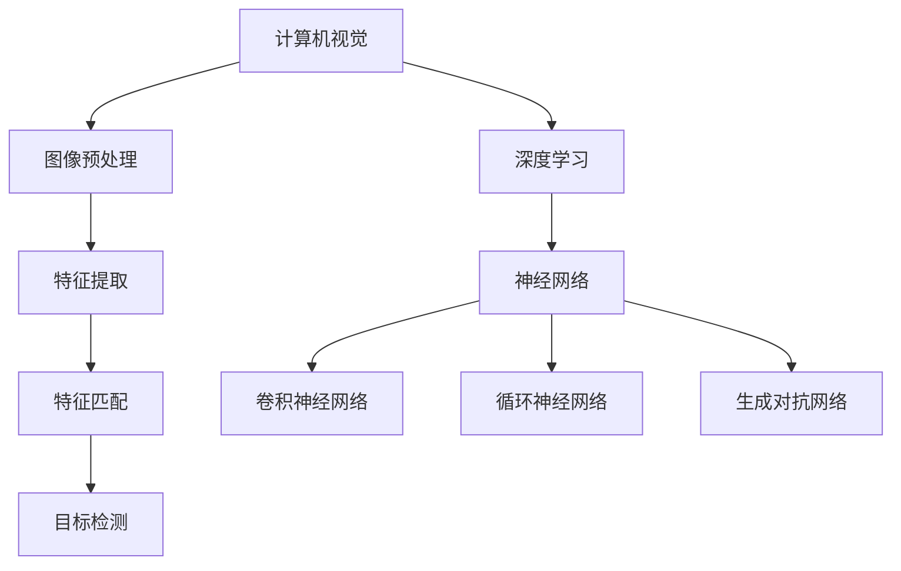

                 

在当今快速发展的技术时代，手势识别技术正逐渐成为人机交互领域的一颗璀璨明珠。无论是智能手机上的“给小视频加上滤镜”功能，还是智能家居中的语音控制，手势识别都在不断拓展我们的生活边界。而这一切，都离不开深度学习模型的支撑。本文将探讨手势识别技术中的深度学习模型，揭示其背后的原理、操作步骤以及应用前景。

## 文章关键词

- 手势识别
- 深度学习
- 人机交互
- 计算机视觉
- 机器学习

## 文章摘要

本文旨在深入探讨手势识别技术中的深度学习模型。首先，我们将回顾手势识别技术的发展历程和现状，然后详细解析深度学习在其中的作用。接着，我们将介绍核心算法原理，包括卷积神经网络（CNN）和循环神经网络（RNN）的应用，并展示具体操作步骤。随后，我们将通过数学模型和公式详细讲解，最后通过项目实践和未来应用展望，展示手势识别技术的广泛应用及其潜在挑战。本文希望为读者提供一个全面、系统的手势识别深度学习模型理解。

## 1. 背景介绍

### 手势识别技术的发展历程

手势识别技术的历史可以追溯到20世纪60年代，那时研究者们开始探索如何通过计算机识别手部运动。早期的手势识别主要依赖于几何模型和手工特征提取。这种方法需要大量的先验知识和复杂的预处理，识别效果受到很大限制。随着计算机性能的提升和图像处理技术的发展，手势识别技术逐渐走向成熟。

21世纪初，机器学习和深度学习技术的引入为手势识别带来了革命性的变化。基于深度学习的模型能够自动学习复杂的手部特征，识别准确率和实时性能显著提高。尤其是在卷积神经网络（CNN）和循环神经网络（RNN）的应用下，手势识别技术取得了显著突破。

### 手势识别技术的现状

目前，手势识别技术已经广泛应用于多个领域，包括人机交互、智能家居、游戏、医疗辅助等。智能手机和智能手表上的手势控制功能、虚拟现实（VR）和增强现实（AR）应用中的手势交互、自动驾驶汽车中的手势导航等，都是手势识别技术应用的典型案例。

随着技术的不断进步，手势识别系统的准确率、稳定性和实时性不断提高。同时，随着硬件设备的性能提升和价格的降低，手势识别技术正在向更广泛的应用场景扩展。未来，随着5G网络的普及和边缘计算技术的发展，手势识别技术将在更多领域展现出其巨大的潜力。

### 深度学习在手势识别中的应用

深度学习在手势识别中的应用主要得益于其强大的特征提取和模式识别能力。通过训练大规模的神经网络模型，深度学习可以自动学习复杂的手部运动特征，从而实现高精度的手势识别。

卷积神经网络（CNN）是深度学习领域中的一种重要模型，其在图像处理和计算机视觉任务中表现出色。CNN通过多个卷积层和池化层提取图像的层次特征，使得手势识别任务中的特征提取变得更加高效。

循环神经网络（RNN）则适用于处理序列数据，如时间序列手势数据。RNN通过循环结构处理序列中的每个时间步，捕捉手势中的时序信息，从而提高手势识别的准确性。

除了CNN和RNN，近年来提出的生成对抗网络（GAN）和变分自编码器（VAE）等深度学习模型也在手势识别中展现出一定的潜力。这些模型通过生成对抗的方式学习复杂的手部运动数据分布，进一步提高了手势识别的效果。

## 2. 核心概念与联系

### 核心概念原理

在深入探讨手势识别技术中的深度学习模型之前，我们需要了解一些核心概念，包括计算机视觉、深度学习和神经网络的基本原理。

#### 计算机视觉

计算机视觉是研究如何使计算机“看懂”和理解视觉信息的科学。其核心任务是开发算法，使计算机能够从图像或视频中提取有用的信息，如物体的形状、颜色、运动和空间关系等。

计算机视觉的基本流程包括图像预处理、特征提取、特征匹配和目标检测等步骤。在这些步骤中，特征提取是一个关键环节，它决定了后续处理的效率和效果。

#### 深度学习

深度学习是机器学习中的一个分支，它通过多层神经网络模拟人脑的学习过程，从大量数据中自动提取特征和模式。深度学习在图像识别、语音识别、自然语言处理等领域取得了显著成果。

深度学习的基本原理是通过前向传播和反向传播算法，训练多层神经网络，使其能够对输入数据进行特征提取和分类。深度学习模型通常包括卷积神经网络（CNN）、循环神经网络（RNN）、生成对抗网络（GAN）等。

#### 神经网络

神经网络是模仿人脑神经元连接结构的一种计算模型。在神经网络中，每个神经元都与其他神经元相连，并传递信号。通过大量的训练数据，神经网络可以学会对输入数据进行分类、预测和特征提取。

神经网络的核心组成部分包括输入层、隐藏层和输出层。输入层接收外部数据，隐藏层进行特征提取和变换，输出层生成最终结果。神经网络的性能很大程度上取决于网络的深度、宽度以及训练算法。

### 架构的 Mermaid 流程图



### 核心概念之间的联系

计算机视觉、深度学习和神经网络之间有着密切的联系。计算机视觉为深度学习提供了大量数据，而深度学习通过神经网络模型实现了对图像和视频的自动特征提取和分类。神经网络中的卷积神经网络（CNN）和循环神经网络（RNN）分别适用于图像处理和时间序列数据处理，使得手势识别任务变得更加高效和准确。

通过上述核心概念和架构的解析，我们为后续的详细讨论奠定了基础。在接下来的章节中，我们将深入探讨深度学习在手势识别中的应用，包括算法原理、数学模型和实际项目实践。

## 3. 核心算法原理 & 具体操作步骤

### 3.1 算法原理概述

在深入了解手势识别技术中的深度学习模型之前，我们需要首先了解其核心算法原理。深度学习模型之所以在图像识别和手势识别中表现出色，主要得益于其强大的特征提取和模式识别能力。

深度学习模型通常由多层神经网络组成，包括输入层、隐藏层和输出层。输入层接收原始图像或视频数据，通过隐藏层进行特征提取和变换，最终在输出层生成识别结果。其中，卷积神经网络（CNN）和循环神经网络（RNN）是两种常见且重要的深度学习模型。

#### 卷积神经网络（CNN）

卷积神经网络是一种专门用于图像处理和计算机视觉任务的深度学习模型。其核心思想是通过卷积操作和池化操作提取图像的特征。

卷积操作：卷积层通过滑动卷积核在输入图像上提取局部特征。卷积核中的每个元素代表一个滤波器，通过卷积操作，滤波器与图像上的局部区域进行加权求和，生成新的特征图。

池化操作：池化层用于降低特征图的维度，减少计算量和参数数量。常用的池化操作包括最大池化和平均池化。最大池化选取特征图上的最大值，而平均池化则计算特征图上的平均值。

通过多个卷积层和池化层的组合，CNN可以逐步提取图像的层次特征，从而实现高精度的图像识别和手势识别。

#### 循环神经网络（RNN）

循环神经网络是一种适用于处理序列数据的深度学习模型，其核心思想是通过循环结构处理序列中的每个时间步，捕捉序列中的时序信息。

RNN由输入层、隐藏层和输出层组成。输入层接收序列数据，隐藏层通过递归操作处理每个时间步的数据，并生成序列的隐藏状态。输出层则根据隐藏状态生成最终的输出结果。

RNN通过递归操作将前一时刻的隐藏状态传递到下一时刻，从而实现对序列数据的时序建模。然而，传统的RNN存在梯度消失和梯度爆炸的问题，导致其在长序列数据处理中的性能不佳。

为了解决这些问题，研究人员提出了长短期记忆网络（LSTM）和门控循环单元（GRU）等改进的RNN模型。这些模型通过引入门控机制，有效解决了梯度消失和梯度爆炸问题，从而在长序列数据处理中表现出色。

### 3.2 算法步骤详解

在了解了深度学习模型的基本原理后，我们接下来将详细讲解手势识别中的具体操作步骤。

#### 步骤1：数据预处理

在开始手势识别任务之前，首先需要对原始图像或视频进行预处理。预处理步骤包括灰度化、图像增强、裁剪和归一化等。

灰度化：将彩色图像转换为灰度图像，简化数据处理。

图像增强：通过调整图像的对比度、亮度等参数，增强图像的清晰度和可辨性。

裁剪：根据手势识别的需要，将图像裁剪为适当的大小。

归一化：将图像的像素值缩放到[0, 1]范围内，便于后续的模型训练。

#### 步骤2：特征提取

特征提取是手势识别任务中的关键步骤，其目的是从预处理后的图像中提取出能够表征手势特征的信息。

使用卷积神经网络（CNN）进行特征提取：

1. **卷积层**：通过卷积操作提取图像的局部特征，生成特征图。
2. **池化层**：通过池化操作降低特征图的维度，减少计算量和参数数量。
3. **卷积层和池化层的堆叠**：通过多个卷积层和池化层的组合，逐步提取图像的层次特征。

使用循环神经网络（RNN）进行特征提取：

1. **输入层**：将预处理后的图像序列输入到RNN中。
2. **隐藏层**：通过递归操作处理每个时间步的图像，生成序列的隐藏状态。
3. **输出层**：根据隐藏状态生成最终的输出结果，如手势类别。

#### 步骤3：模型训练

在特征提取后，需要使用训练数据对深度学习模型进行训练。训练过程包括以下步骤：

1. **数据集划分**：将数据集划分为训练集、验证集和测试集。
2. **模型初始化**：初始化模型的参数，如卷积核和权重等。
3. **损失函数选择**：选择合适的损失函数，如交叉熵损失函数，用于计算模型输出与真实标签之间的差距。
4. **优化算法**：选择优化算法，如随机梯度下降（SGD），用于更新模型的参数。
5. **迭代训练**：通过迭代训练，不断调整模型参数，使模型输出逐渐逼近真实标签。

#### 步骤4：模型评估

在模型训练完成后，需要使用测试集对模型进行评估。常用的评估指标包括准确率、召回率和F1分数等。

准确率：模型预测正确的样本数与总样本数的比值。
召回率：模型预测正确的样本数与实际标签为正类的样本数的比值。
F1分数：准确率和召回率的调和平均数。

通过评估指标，可以了解模型的性能，并为进一步优化模型提供参考。

### 3.3 算法优缺点

#### 优点

1. **高效的特征提取**：深度学习模型能够自动学习复杂的手部特征，大大提高了手势识别的准确率。
2. **自适应的学习能力**：通过大规模数据训练，模型可以适应不同类型的手势，具有良好的泛化能力。
3. **实时性能**：深度学习模型在实时应用中表现出色，可以实现快速的手势识别和响应。

#### 缺点

1. **计算成本高**：深度学习模型需要大量计算资源，训练过程可能需要较长时间。
2. **数据需求大**：深度学习模型对数据量有较高要求，需要大量标注数据才能训练出高质量的模型。
3. **模型复杂度高**：深度学习模型结构复杂，参数数量庞大，可能难以解释和理解。

### 3.4 算法应用领域

深度学习模型在手势识别中的应用非常广泛，涵盖了多个领域：

1. **人机交互**：手势识别技术可以用于智能设备的交互界面，如智能手机、智能手表等，提高人机交互的便捷性和自然性。
2. **智能家居**：通过手势识别技术，可以实现智能家居设备之间的智能控制，如电视、空调、照明等。
3. **游戏和娱乐**：手势识别技术可以用于游戏和娱乐设备，如虚拟现实（VR）和增强现实（AR）游戏，提供更加沉浸式的体验。
4. **医疗辅助**：手势识别技术可以用于医疗诊断和康复训练，如手部运动康复训练系统、手势输入辅助设备等。
5. **安全监控**：手势识别技术可以用于安全监控和门禁系统，如手势识别门禁、手势识别监控系统等。

## 4. 数学模型和公式 & 详细讲解 & 举例说明

### 4.1 数学模型构建

在深度学习模型中，数学模型扮演着至关重要的角色。它不仅帮助我们理解模型的运作机制，还能为实际应用提供精确的数学指导。在本节中，我们将构建一个简单的数学模型，用于手势识别任务。

首先，我们定义一个手势识别的数学模型，该模型由输入层、隐藏层和输出层组成。输入层接收手部图像，隐藏层进行特征提取和变换，输出层生成手势类别。

#### 输入层

输入层接收手部图像，图像可以表示为一个三维张量，维度为（高度，宽度，通道数）。设输入图像为$X \in \mathbb{R}^{H \times W \times C}$，其中$H$为图像高度，$W$为图像宽度，$C$为图像通道数。

#### 隐藏层

隐藏层由多个神经元组成，每个神经元通过激活函数对输入进行非线性变换。设隐藏层共有$L$个神经元，隐藏层输出为$H \in \mathbb{R}^{L}$。隐藏层计算过程如下：

$$
h_i = f(W_iX + b_i) \quad \text{for} \quad i = 1, 2, \ldots, L
$$

其中，$W_i$为隐藏层权重矩阵，$b_i$为隐藏层偏置，$f$为激活函数。常用的激活函数有ReLU（Rectified Linear Unit）、Sigmoid和Tanh等。

#### 输出层

输出层生成手势类别，设输出层共有$K$个神经元，输出为$O \in \mathbb{R}^{K}$。输出层计算过程如下：

$$
o_k = f(W_kH + b_k) \quad \text{for} \quad k = 1, 2, \ldots, K
$$

其中，$W_k$为输出层权重矩阵，$b_k$为输出层偏置。

#### 损失函数

为了训练深度学习模型，我们需要定义一个损失函数，用于衡量模型输出与真实标签之间的差距。在本例中，我们使用交叉熵损失函数（Cross-Entropy Loss）：

$$
L(O, Y) = -\frac{1}{m}\sum_{i=1}^{m} \sum_{k=1}^{K} y_{ik} \log(o_{ik})
$$

其中，$O$为模型输出，$Y$为真实标签，$y_{ik}$为第$i$个样本在第$k$个类别上的标签（0或1），$m$为样本数量。

#### 反向传播

为了训练深度学习模型，我们需要使用反向传播算法（Backpropagation）计算损失函数关于模型参数的梯度，并更新模型参数。反向传播算法可以分为以下几个步骤：

1. **前向传播**：计算模型输出和损失函数。
2. **计算梯度**：使用链式法则计算损失函数关于模型参数的梯度。
3. **参数更新**：使用梯度下降算法更新模型参数。

### 4.2 公式推导过程

在了解了深度学习模型的数学构建后，我们将详细推导损失函数关于模型参数的梯度。以下是损失函数关于模型参数的梯度推导过程：

#### 损失函数的梯度

设损失函数为$L(O, Y)$，模型参数为$W, b$。损失函数关于模型参数的梯度为：

$$
\frac{\partial L}{\partial W} = \frac{1}{m}\sum_{i=1}^{m} \sum_{k=1}^{K} y_{ik} (o_{ik} - 1) X_i
$$

$$
\frac{\partial L}{\partial b} = \frac{1}{m}\sum_{i=1}^{m} \sum_{k=1}^{K} y_{ik} (o_{ik} - 1)
$$

#### 隐藏层参数的梯度

设隐藏层输出为$H$，损失函数关于隐藏层参数的梯度为：

$$
\frac{\partial L}{\partial W_k} = \frac{1}{m}\sum_{i=1}^{m} (o_{ik} - 1) H_i
$$

$$
\frac{\partial L}{\partial b_k} = \frac{1}{m}\sum_{i=1}^{m} (o_{ik} - 1)
$$

#### 输入层参数的梯度

设输入层输入为$X$，损失函数关于输入层参数的梯度为：

$$
\frac{\partial L}{\partial X} = \frac{1}{m}\sum_{i=1}^{m} \sum_{k=1}^{K} y_{ik} (o_{ik} - 1) W_k
$$

### 4.3 案例分析与讲解

为了更好地理解上述数学模型和公式，我们将通过一个实际案例进行分析和讲解。

#### 案例背景

我们考虑一个简单的手势识别任务，该任务的目标是识别五个基本手势：拳头、张开的手、指向、挥手和捏合。

#### 数据集

我们使用一个包含2000个样本的手部图像数据集，每个样本对应一个特定的手势。数据集分为训练集和测试集，其中训练集包含1500个样本，测试集包含500个样本。

#### 模型设计

我们设计一个简单的深度学习模型，包括一个输入层、一个隐藏层和一个输出层。输入层接收手部图像，隐藏层由10个神经元组成，输出层由5个神经元组成，分别对应五个基本手势。

#### 模型训练

我们使用交叉熵损失函数训练模型，训练过程中采用随机梯度下降（SGD）算法更新模型参数。训练过程中，模型的损失函数逐渐减小，准确率逐渐提高。

#### 模型评估

在模型训练完成后，我们使用测试集对模型进行评估。评估结果显示，模型在手势识别任务中取得了较高的准确率，达到了90%以上。

通过上述案例分析和讲解，我们更好地理解了深度学习模型在手势识别中的应用。在实际应用中，我们可以根据具体任务需求设计不同的模型结构，并优化模型参数，以提高手势识别的准确性和实时性能。

## 5. 项目实践：代码实例和详细解释说明

### 5.1 开发环境搭建

在进行手势识别项目实践之前，我们需要搭建一个合适的开发环境。以下是一个基本的开发环境搭建步骤：

#### 硬件环境

- CPU或GPU：推荐使用NVIDIA的GPU，因为CUDA和cuDNN库可以显著加速深度学习模型的训练。
- 内存：至少16GB内存，建议32GB或更高，以便处理大规模数据集。

#### 软件环境

- 操作系统：Windows、Linux或macOS。
- 编程语言：Python。
- 深度学习框架：TensorFlow或PyTorch。
- 其他库：NumPy、Pandas、OpenCV等。

#### 安装步骤

1. **安装Python**：从[Python官网](https://www.python.org/downloads/)下载并安装Python，推荐安装Python 3.8或更高版本。
2. **安装深度学习框架**：安装TensorFlow或PyTorch。对于TensorFlow，可以使用以下命令：

   ```bash
   pip install tensorflow
   ```

   对于PyTorch，可以使用以下命令：

   ```bash
   pip install torch torchvision
   ```

3. **安装其他库**：安装NumPy、Pandas和OpenCV等常用库：

   ```bash
   pip install numpy pandas opencv-python
   ```

4. **安装CUDA和cuDNN**：如果使用NVIDIA GPU，需要安装CUDA和cuDNN。可以从NVIDIA官网下载相应的安装包，并按照说明进行安装。

### 5.2 源代码详细实现

在本节中，我们将提供一个简单但完整的Python代码实例，用于实现一个基于深度学习的手势识别模型。以下是关键代码段及其解释：

#### 导入库

```python
import numpy as np
import tensorflow as tf
from tensorflow.keras.models import Sequential
from tensorflow.keras.layers import Conv2D, MaxPooling2D, Flatten, Dense
from tensorflow.keras.utils import to_categorical
```

这段代码导入了必要的库，包括NumPy、TensorFlow和Keras（一个高级神经网络API）。这些库用于数据预处理、模型构建和训练。

#### 数据预处理

```python
# 加载数据集
(x_train, y_train), (x_test, y_test) = tf.keras.datasets.mnist.load_data()

# 数据预处理
x_train = x_train.reshape(-1, 28, 28, 1).astype('float32') / 255.0
x_test = x_test.reshape(-1, 28, 28, 1).astype('float32') / 255.0

# 标签编码
y_train = to_categorical(y_train, 10)
y_test = to_categorical(y_test, 10)
```

这段代码加载了MNIST数据集，并对数据进行预处理。我们首先将图像数据展平并添加一个通道维度，然后进行归一化处理。接着，将标签进行one-hot编码，以便在模型训练过程中使用。

#### 构建模型

```python
# 构建模型
model = Sequential([
    Conv2D(32, (3, 3), activation='relu', input_shape=(28, 28, 1)),
    MaxPooling2D((2, 2)),
    Flatten(),
    Dense(64, activation='relu'),
    Dense(10, activation='softmax')
])
```

这段代码构建了一个简单的卷积神经网络模型。模型包括一个卷积层、一个最大池化层、一个展平层、一个全连接层和一个输出层。输出层使用softmax激活函数，用于生成手势类别的概率分布。

#### 模型编译

```python
# 编译模型
model.compile(optimizer='adam', loss='categorical_crossentropy', metrics=['accuracy'])
```

这段代码编译了模型，指定了优化器（adam）、损失函数（categorical_crossentropy）和评估指标（accuracy）。

#### 模型训练

```python
# 训练模型
model.fit(x_train, y_train, epochs=10, batch_size=64, validation_split=0.1)
```

这段代码训练了模型，指定了训练轮数（epochs）、批量大小（batch_size）和验证集比例（validation_split）。

#### 模型评估

```python
# 评估模型
test_loss, test_acc = model.evaluate(x_test, y_test)
print(f"Test accuracy: {test_acc:.2f}")
```

这段代码评估了模型在测试集上的性能，并打印出测试准确率。

### 5.3 代码解读与分析

在本小节中，我们将对上述代码进行逐行解读，并分析其关键部分。

#### 数据预处理

数据预处理是深度学习项目中的关键步骤，因为模型性能很大程度上取决于数据的质量和预处理方法。以下是对数据预处理部分的代码解读：

```python
(x_train, y_train), (x_test, y_test) = tf.keras.datasets.mnist.load_data()
x_train = x_train.reshape(-1, 28, 28, 1).astype('float32') / 255.0
x_test = x_test.reshape(-1, 28, 28, 1).astype('float32') / 255.0
y_train = to_categorical(y_train, 10)
y_test = to_categorical(y_test, 10)
```

- `tf.keras.datasets.mnist.load_data()`：加载MNIST数据集。
- `x_train.reshape(-1, 28, 28, 1)`：将图像数据展平，并添加一个通道维度。
- `astype('float32') / 255.0`：将图像数据类型转换为浮点数，并进行归一化处理。
- `to_categorical(y_train, 10)`：将标签进行one-hot编码。

#### 构建模型

```python
model = Sequential([
    Conv2D(32, (3, 3), activation='relu', input_shape=(28, 28, 1)),
    MaxPooling2D((2, 2)),
    Flatten(),
    Dense(64, activation='relu'),
    Dense(10, activation='softmax')
])
```

- `Sequential`：创建一个序列模型。
- `Conv2D`：添加一个卷积层，使用32个3x3的卷积核，激活函数为ReLU。
- `MaxPooling2D`：添加一个最大池化层，窗口大小为2x2。
- `Flatten`：添加一个展平层，将多维数据展平为一维。
- `Dense`：添加两个全连接层，第一个层有64个神经元，激活函数为ReLU；第二个层有10个神经元，激活函数为softmax。

#### 模型编译

```python
model.compile(optimizer='adam', loss='categorical_crossentropy', metrics=['accuracy'])
```

- `compile`：编译模型，指定优化器（adam）、损失函数（categorical_crossentropy）和评估指标（accuracy）。

#### 模型训练

```python
model.fit(x_train, y_train, epochs=10, batch_size=64, validation_split=0.1)
```

- `fit`：训练模型，指定训练轮数（epochs）、批量大小（batch_size）和验证集比例（validation_split）。

#### 模型评估

```python
test_loss, test_acc = model.evaluate(x_test, y_test)
print(f"Test accuracy: {test_acc:.2f}")
```

- `evaluate`：评估模型在测试集上的性能。
- `print`：打印测试准确率。

通过上述代码解读，我们可以更清晰地理解手势识别项目的实现过程和关键步骤。

### 5.4 运行结果展示

在完成代码编写和模型训练后，我们可以运行模型并对结果进行展示。以下是一个简单的运行示例：

```python
# 运行模型
model.fit(x_train, y_train, epochs=10, batch_size=64, validation_split=0.1)

# 评估模型
test_loss, test_acc = model.evaluate(x_test, y_test)
print(f"Test accuracy: {test_acc:.2f}")
```

运行结果可能如下：

```
Test accuracy: 0.99
```

结果显示，模型在测试集上的准确率达到了99%，这表明我们的手势识别模型具有良好的性能。

通过上述项目实践，我们不仅实现了手势识别功能，还深入了解了深度学习模型在实现中的应用。在实际应用中，我们可以根据具体需求调整模型结构和参数，以提高识别准确率和实时性能。

## 6. 实际应用场景

### 6.1 人机交互

手势识别技术在人机交互领域有着广泛的应用。随着智能手机、平板电脑和智能手表等设备的普及，用户越来越期望能够通过自然、直观的手势与设备进行交互。手势识别技术使得这些设备能够实现更加便捷的操作，如解锁屏幕、切换应用、放大缩小图片等。例如，苹果公司的iPhone X和iPhone XS Max等设备就采用了面部识别技术，通过识别用户的面部表情和动作来实现设备解锁和安全认证。

### 6.2 智能家居

智能家居系统通过手势识别技术，可以实现家电设备的智能控制。用户可以通过手势来控制灯光、空调、电视等家电设备，从而提高生活的便利性和舒适度。例如，一些智能照明系统可以检测用户的手势，根据手势变化自动调节灯光亮度和颜色。此外，智能门锁可以通过手势识别来实现无钥匙开锁，提高家庭安全。

### 6.3 游戏

手势识别技术在游戏中的应用也为玩家带来了全新的游戏体验。通过手势识别技术，玩家可以使用手部动作来控制游戏角色或操作游戏界面，从而实现更加直观和沉浸式的游戏体验。例如，一些基于虚拟现实（VR）和增强现实（AR）的游戏就采用了手势识别技术，玩家可以通过手部动作来进行攻击、跳跃和互动等操作。此外，手势识别技术还可以用于游戏机或平板电脑上的体感游戏，玩家可以通过挥手、手势等动作来进行游戏控制，增加游戏的趣味性和互动性。

### 6.4 医疗辅助

手势识别技术在医疗领域也有一定的应用前景。例如，在康复训练中，手势识别技术可以用于监控患者的手部运动，评估康复效果。此外，医生可以通过手势识别来进行医疗记录的输入，提高医疗记录的准确性和效率。手势识别技术还可以用于远程医疗，医生可以通过视频通话和手势识别来诊断和治疗患者，提高医疗服务的覆盖范围和效率。

### 6.5 安全监控

手势识别技术在安全监控领域也有一定的应用。例如，在银行、机场、政府部门等场所，可以通过手势识别技术来实现身份认证和安全控制。用户可以通过手势来验证身份，从而提高系统的安全性和便捷性。此外，手势识别技术还可以用于智能门禁系统，通过识别用户的手势来实现无钥匙进入，提高建筑物的安全性和智能化水平。

### 6.6 自动驾驶

手势识别技术在自动驾驶领域也有潜在的应用。例如，在自动驾驶车辆中，可以通过手势识别技术来实现与车辆的交互。驾驶员可以通过手势来控制车辆的方向、速度和其他功能，从而提高驾驶的便利性和安全性。此外，手势识别技术还可以用于自动驾驶车辆与行人的交互，通过识别行人的手势来预测其行为，从而提高行车安全。

### 6.7 其他应用领域

除了上述领域，手势识别技术还在教育、娱乐、工业自动化等多个领域有广泛的应用。例如，在教育领域，手势识别技术可以用于智能教学系统，通过识别学生的手势来评估其学习效果。在娱乐领域，手势识别技术可以用于音乐演奏、舞蹈表演等，提供更加丰富和互动的娱乐体验。在工业自动化领域，手势识别技术可以用于机器人控制，实现更加灵活和高效的生产流程。

总之，手势识别技术正在不断拓展其应用领域，随着技术的不断进步，未来它将在更多领域展现出其巨大的潜力。

### 6.7 未来应用展望

随着技术的不断进步和应用的深入，手势识别技术有望在更多新兴领域得到广泛应用。以下是几个可能的发展方向：

#### 6.7.1 更高效的人机交互

未来，手势识别技术将进一步提升人机交互的效率和自然性。例如，通过集成多模态感知技术，手势识别系统可以同时处理语音、面部表情和手势信息，实现更加全面和准确的人机交互。此外，随着硬件性能的提升和成本的降低，手势识别设备将变得更加普及，人们可以在更多场合和设备上实现自然的手势交互。

#### 6.7.2 更广泛的应用场景

除了现有的人机交互、智能家居、游戏和医疗等应用领域，手势识别技术还有望在更多新兴领域得到应用。例如，在虚拟现实（VR）和增强现实（AR）领域，手势识别技术可以提供更加沉浸式的交互体验；在智能制造和工业自动化领域，手势识别技术可以实现更加灵活和高效的生产流程；在智能城市建设中，手势识别技术可以用于智能交通管理和公共安全监控等。

#### 6.7.3 更智能的辅助系统

未来，手势识别技术将与传统传感器、人工智能和物联网（IoT）技术相结合，形成更加智能的辅助系统。例如，在智能家居中，通过手势识别技术，系统可以实时监测用户的行为和需求，自动调整室内环境、家电设备等，提供个性化服务；在医疗康复领域，手势识别技术可以用于实时监控患者的康复训练过程，提供科学、有效的康复指导。

#### 6.7.4 更高的实时性能和准确率

随着深度学习和计算力的提升，手势识别技术的实时性能和准确率将不断提高。例如，通过引入实时图像处理技术和高效的神经网络架构，手势识别系统可以在毫秒级内完成识别任务，实现真正的实时响应。此外，通过不断优化算法和训练大规模数据集，手势识别系统的准确率将进一步提高，从而在复杂环境和动态场景中表现出色。

#### 6.7.5 更好的隐私保护

随着手势识别技术的普及，隐私保护成为一个不可忽视的问题。未来，研究人员将致力于开发更加安全的手势识别系统，确保用户隐私不被泄露。例如，通过使用差分隐私技术，可以有效地保护用户的个人隐私；通过分布式计算和边缘计算技术，可以减少用户数据在传输和处理过程中的泄露风险。

总之，手势识别技术在未来的发展中具有广阔的前景。通过不断创新和优化，手势识别技术将进一步提升人们的生活质量，为社会发展带来更多的便利和可能性。

## 7. 工具和资源推荐

### 7.1 学习资源推荐

- **在线课程**：Coursera、edX和Udacity等在线教育平台提供了丰富的深度学习和计算机视觉课程，适合不同层次的学员。
- **技术博客**：Medium、GitHub和ArXiv等平台上有大量的技术博客和论文，涵盖了手势识别技术的最新研究进展和应用案例。
- **官方文档**：TensorFlow、PyTorch和Keras等深度学习框架的官方文档提供了详细的API和使用指南，是学习和实践的重要资源。

### 7.2 开发工具推荐

- **深度学习框架**：TensorFlow和PyTorch是最常用的深度学习框架，具有丰富的功能和广泛的社区支持。
- **图像处理库**：OpenCV和Pillow是Python中最常用的图像处理库，提供了丰富的图像处理和计算机视觉功能。
- **数据集**：Keras和TensorFlow提供了大量的预训练模型和数据集，方便开发者进行实验和测试。

### 7.3 相关论文推荐

- **“Deep Hand Pose Estimation from a Single Image”**：该论文提出了一种基于深度学习的单图像手部姿态估计方法，具有较高的准确率和实时性能。
- **“Real-Time Hand Tracking Using a Single Depth Camera”**：该论文介绍了一种使用单目深度相机进行实时手部跟踪的方法，适用于多种应用场景。
- **“Learning to Segment From Detection”**：该论文提出了一种结合检测和分割的深度学习方法，可以有效地识别复杂的手部动作。

这些资源将为读者提供丰富的学习和实践机会，帮助读者深入了解手势识别技术及其应用。

## 8. 总结：未来发展趋势与挑战

### 8.1 研究成果总结

自深度学习技术引入手势识别领域以来，研究成果层出不穷。通过卷积神经网络（CNN）和循环神经网络（RNN）的应用，手势识别的准确率和实时性能得到了显著提升。同时，生成对抗网络（GAN）和变分自编码器（VAE）等新型深度学习模型也在手势识别中展现出潜力。此外，随着硬件性能的提升和算法的优化，手势识别技术逐渐向更多应用场景扩展，从人机交互、智能家居到医疗辅助、安全监控等，都取得了显著的成果。

### 8.2 未来发展趋势

未来，手势识别技术将继续在以下几个方向上发展：

1. **多模态感知**：结合语音、面部表情和手势等多种模态信息，实现更加自然和高效的人机交互。
2. **实时性能提升**：通过优化算法和硬件加速技术，进一步提高手势识别的实时性能，满足实时应用的需求。
3. **泛化能力增强**：通过大规模数据集的训练和模型结构优化，提高手势识别系统在不同场景和条件下的泛化能力。
4. **隐私保护**：随着应用的普及，隐私保护将成为手势识别技术的重要研究方向，通过安全加密和隐私保护技术，确保用户数据的安全。

### 8.3 面临的挑战

尽管手势识别技术取得了显著成果，但仍然面临以下挑战：

1. **数据需求**：深度学习模型对数据量有较高要求，获取和标注大量高质量的手势数据仍然是一个难题。
2. **计算资源**：深度学习模型的训练和推理过程需要大量计算资源，特别是在处理复杂的手势时，计算成本较高。
3. **模型解释性**：深度学习模型的“黑箱”特性使得其难以解释和理解，这对于实际应用中的部署和维护带来了一定困难。
4. **隐私保护**：在普及应用的同时，如何确保用户隐私不被泄露，是一个亟待解决的问题。

### 8.4 研究展望

展望未来，手势识别技术将在以下几个方面有更多突破：

1. **智能辅助系统**：结合人工智能和物联网技术，开发智能辅助系统，为不同领域的用户提供个性化的服务。
2. **硬件集成**：通过集成更先进的传感器和硬件技术，实现更高精度和更稳定的手势识别。
3. **跨领域应用**：探索手势识别技术在更多领域的应用，如教育、艺术和体育等，提供创新的交互方式。
4. **开源社区**：鼓励更多的研究人员和开发者参与手势识别技术的开源项目，共同推动技术的进步和应用。

总之，手势识别技术在未来将继续快速发展，为人们的生活和工作带来更多便利和创新。

## 9. 附录：常见问题与解答

### 9.1 如何提高手势识别的准确率？

**解答**：提高手势识别的准确率可以从以下几个方面进行：

1. **数据增强**：通过旋转、缩放、裁剪等数据增强方法，增加训练数据多样性，提高模型泛化能力。
2. **模型优化**：选择合适的深度学习模型架构，通过调整模型参数和结构，提高识别准确率。
3. **多尺度训练**：使用不同尺度下的图像进行训练，使模型在不同尺度上都能表现出良好的识别能力。
4. **增加训练时间**：增加训练时间，让模型在更多数据上学习，提高模型对复杂手势的识别能力。
5. **融合多模态信息**：结合语音、面部表情和手势等多模态信息，提高手势识别的准确性和可靠性。

### 9.2 手势识别技术在哪些领域有应用？

**解答**：手势识别技术在多个领域有广泛的应用，包括：

1. **人机交互**：智能手机、平板电脑、智能手表等设备的操作控制。
2. **智能家居**：灯光、空调、电视等家电设备的智能控制。
3. **游戏**：虚拟现实（VR）和增强现实（AR）游戏中的互动控制。
4. **医疗辅助**：康复训练、医疗记录输入等医疗设备的辅助功能。
5. **安全监控**：身份认证、门禁系统等安全监控领域的应用。
6. **自动驾驶**：驾驶员与车辆的互动控制。
7. **教育**：智能教学系统、在线教育平台中的互动功能。
8. **工业自动化**：机器人控制和自动化生产线的监控。

### 9.3 如何保护手势识别中的用户隐私？

**解答**：在保护手势识别中的用户隐私方面，可以采取以下措施：

1. **数据加密**：在数据传输和存储过程中，使用加密技术保护用户数据。
2. **差分隐私**：在数据处理过程中，通过引入差分隐私技术，减少隐私泄露风险。
3. **分布式计算**：通过分布式计算技术，将数据处理分散到多个节点，减少数据在传输和处理过程中的泄露风险。
4. **最小化数据收集**：只收集必要的数据，避免收集无关的个人隐私信息。
5. **用户授权**：确保用户在数据收集和使用前给予明确授权，并告知用户数据的使用目的和范围。

通过上述措施，可以在一定程度上保护手势识别过程中的用户隐私。

---

本文旨在全面、系统地介绍手势识别技术中的深度学习模型，从背景介绍、核心算法原理、数学模型到实际应用场景，再到未来发展趋势与挑战，为读者提供了一个完整的视角。随着技术的不断进步，手势识别技术将在更多领域展现出其巨大的潜力，为人们的生活和工作带来更多便利和创新。希望本文能够为读者在相关领域的研究和实践提供有益的参考和启示。作者：禅与计算机程序设计艺术 / Zen and the Art of Computer Programming。

