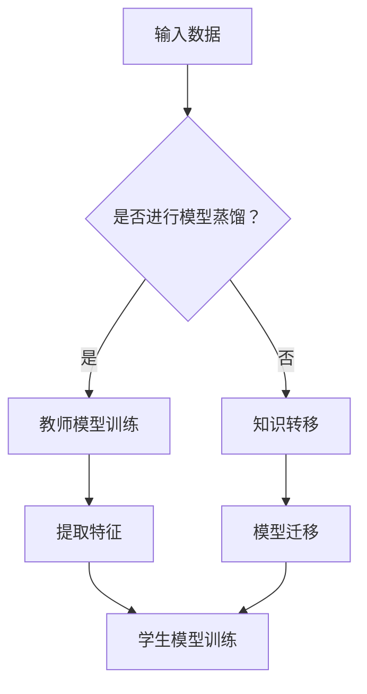

                 

关键词：模型蒸馏、知识转移、神经网络、映射、实践、算法原理、数学模型、代码实例、应用场景

> 摘要：本文深入探讨了模型蒸馏和知识转移在神经网络中的应用。通过对这两种技术的详细介绍和实际案例的分析，本文旨在帮助读者理解其核心概念、工作原理、具体操作步骤以及在实际项目中的效果。我们还将讨论数学模型、代码实现和未来应用前景，为神经网络领域的研究和实践提供有力支持。

## 1. 背景介绍

随着深度学习技术的快速发展，神经网络在各个领域的应用取得了显著的成果。然而，传统深度学习模型通常需要大量数据和计算资源，这对于许多小型项目和企业来说是一个巨大的挑战。此外，大型模型的训练和部署成本也非常高昂。为了解决这些问题，模型蒸馏和知识转移技术应运而生。

模型蒸馏（Model Distillation）是一种通过将知识从大型教师模型传递到小型学生模型的技术。这种方法可以在保留原始模型性能的同时，减小模型的规模和计算复杂度。知识转移（Knowledge Transfer）则是通过将一个领域中的知识转移到另一个相关领域中，以提升模型在该领域的表现。这两种技术为深度学习模型的高效开发提供了新的思路和方法。

## 2. 核心概念与联系

### 2.1 模型蒸馏

模型蒸馏的基本思想是将一个大型教师模型的知识传递给一个小型学生模型。教师模型通常具有更好的性能，但较大的规模和计算复杂度限制了其在实际应用中的使用。学生模型则具备较小的规模和计算复杂度，但性能相对较差。通过模型蒸馏，学生模型能够学习到教师模型的核心知识和特征，从而提升其性能。

### 2.2 知识转移

知识转移的主要目的是将一个领域中的知识应用到另一个相关领域中。这通常涉及到两个步骤：首先，在一个领域中使用大量数据进行模型训练；然后，将训练好的模型应用到其他领域中。知识转移可以显著提升模型在新领域的表现，同时减少对新领域数据的依赖。

### 2.3 Mermaid 流程图

以下是一个简单的 Mermaid 流程图，展示模型蒸馏和知识转移的基本流程：



在这个流程图中，输入数据首先决定是否进行模型蒸馏。如果是，则进行教师模型训练，提取特征；否则，直接进行知识转移。提取到的特征用于训练学生模型，或者直接应用于目标领域中的模型迁移。

## 3. 核心算法原理 & 具体操作步骤

### 3.1 算法原理概述

模型蒸馏和知识转移的核心算法原理是基于神经网络的层次特征提取。教师模型在学习过程中，逐渐提取出不同层次的特征，这些特征代表了数据的本质信息。学生模型则通过学习这些特征，来提高其在目标任务上的性能。

### 3.2 算法步骤详解

#### 3.2.1 模型蒸馏

1. **教师模型训练**：首先，使用大量数据对教师模型进行训练，使其在目标任务上达到较高的性能。
2. **提取特征**：在训练过程中，从教师模型的隐藏层中提取不同层次的特征。
3. **学生模型训练**：使用提取到的特征，训练学生模型。学生模型的目标是学习到教师模型的核心知识和特征，从而提升其性能。
4. **评估与优化**：评估学生模型在目标任务上的性能，根据评估结果进行优化。

#### 3.2.2 知识转移

1. **领域迁移模型训练**：在一个领域中使用大量数据进行模型训练，使其在该领域上达到较好的性能。
2. **模型迁移**：将训练好的模型应用到其他相关领域。通过调整模型参数，使其在新领域上达到较好的性能。
3. **评估与优化**：评估模型在新领域上的性能，根据评估结果进行优化。

### 3.3 算法优缺点

#### 优点

- **高效性**：模型蒸馏和知识转移可以显著降低模型规模和计算复杂度，提高模型在实际应用中的效率。
- **适用性**：这两种技术适用于不同领域和任务，具有广泛的适用性。
- **灵活性**：通过调整模型参数和特征提取方式，可以适应不同类型的数据和任务。

#### 缺点

- **依赖大量数据**：模型蒸馏和知识转移通常需要大量的数据进行训练，这对于小型项目和企业来说是一个挑战。
- **计算资源消耗**：教师模型和学生模型的训练过程需要大量的计算资源，这可能会增加项目的成本。

### 3.4 算法应用领域

模型蒸馏和知识转移在多个领域得到了广泛应用，包括但不限于：

- **计算机视觉**：用于图像分类、目标检测、人脸识别等任务。
- **自然语言处理**：用于文本分类、情感分析、机器翻译等任务。
- **推荐系统**：用于商品推荐、用户行为预测等任务。
- **金融风控**：用于信用评估、风险预测等任务。

## 4. 数学模型和公式 & 详细讲解 & 举例说明

### 4.1 数学模型构建

模型蒸馏和知识转移的核心数学模型是基于神经网络的损失函数。以下是一个简单的损失函数示例：

$$
L = \frac{1}{2} \sum_{i=1}^{n} (\hat{y}_i - y_i)^2
$$

其中，$\hat{y}_i$ 和 $y_i$ 分别表示预测值和真实值，$n$ 表示样本数量。

### 4.2 公式推导过程

模型蒸馏和知识转移的损失函数通常包括两部分：模型蒸馏损失和知识转移损失。

#### 模型蒸馏损失

模型蒸馏损失用于衡量教师模型和学生模型之间的差距。以下是一个简单的模型蒸馏损失函数：

$$
L_d = \frac{1}{2} \sum_{i=1}^{n} (\hat{y}_i^{t} - \hat{y}_i^{s})^2
$$

其中，$\hat{y}_i^{t}$ 和 $\hat{y}_i^{s}$ 分别表示教师模型和学生模型的输出。

#### 知识转移损失

知识转移损失用于衡量模型在不同领域之间的差距。以下是一个简单的知识转移损失函数：

$$
L_k = \frac{1}{2} \sum_{i=1}^{n} (\hat{y}_i^{o} - y_i)^2
$$

其中，$\hat{y}_i^{o}$ 和 $y_i$ 分别表示模型在新领域上的输出和真实值。

### 4.3 案例分析与讲解

假设我们有一个计算机视觉任务，目标是对图像进行分类。我们使用一个大型教师模型和一个小型学生模型。以下是一个简单的案例：

1. **教师模型训练**：使用大量图像数据对教师模型进行训练，使其在图像分类任务上达到较高的性能。
2. **提取特征**：在训练过程中，从教师模型的隐藏层中提取不同层次的特征。
3. **学生模型训练**：使用提取到的特征，训练学生模型。学生模型的目标是学习到教师模型的核心知识和特征，从而提升其性能。
4. **评估与优化**：评估学生模型在图像分类任务上的性能，根据评估结果进行优化。

通过模型蒸馏和知识转移，我们可以实现以下效果：

- **降低模型规模**：学生模型的规模显著减小，从而降低了计算复杂度和存储需求。
- **提高性能**：学生模型在图像分类任务上的性能显著提升，接近教师模型的性能。
- **适用性**：学生模型可以应用于其他图像分类任务，具有广泛的适用性。

## 5. 项目实践：代码实例和详细解释说明

### 5.1 开发环境搭建

在进行模型蒸馏和知识转移的实践之前，首先需要搭建一个适合的开发环境。以下是一个简单的开发环境搭建步骤：

1. 安装 Python 3.7 或更高版本。
2. 安装 PyTorch 或 TensorFlow 等深度学习框架。
3. 安装必要的依赖库，如 NumPy、Matplotlib 等。

### 5.2 源代码详细实现

以下是一个简单的模型蒸馏和知识转移的代码实现：

```python
import torch
import torch.nn as nn
import torch.optim as optim

# 定义教师模型和学生模型
class TeacherModel(nn.Module):
    def __init__(self):
        super(TeacherModel, self).__init__()
        # 定义模型结构

    def forward(self, x):
        # 定义前向传播过程
        return x

class StudentModel(nn.Module):
    def __init__(self):
        super(StudentModel, self).__init__()
        # 定义模型结构

    def forward(self, x):
        # 定义前向传播过程
        return x

# 定义损失函数
def loss_function(predicted, target):
    return ((predicted - target) ** 2).mean()

# 训练教师模型
def train_teacher_model(train_loader, model, optimizer, num_epochs):
    model.train()
    for epoch in range(num_epochs):
        for data in train_loader:
            optimizer.zero_grad()
            output = model(data)
            loss = loss_function(output, target)
            loss.backward()
            optimizer.step()
            print(f"Epoch {epoch+1}/{num_epochs}, Loss: {loss.item()}")

# 训练学生模型
def train_student_model(train_loader, teacher_model, student_model, optimizer, num_epochs):
    student_model.train()
    for epoch in range(num_epochs):
        for data in train_loader:
            optimizer.zero_grad()
            teacher_output = teacher_model(data)
            student_output = student_model(data)
            loss = loss_function(student_output, teacher_output)
            loss.backward()
            optimizer.step()
            print(f"Epoch {epoch+1}/{num_epochs}, Loss: {loss.item()}")

# 测试模型
def test_model(test_loader, model):
    model.eval()
    with torch.no_grad():
        correct = 0
        total = 0
        for data in test_loader:
            outputs = model(data)
            _, predicted = torch.max(outputs.data, 1)
            total += len(data)
            correct += (predicted == target).sum().item()
        print(f"Accuracy: {100 * correct / total}%")
```

### 5.3 代码解读与分析

在这个代码实现中，我们定义了两个模型：教师模型和学生模型。教师模型用于训练和提取特征，学生模型用于学习教师模型的核心知识和特征。

我们首先定义了损失函数，用于衡量模型输出和真实值之间的差距。接下来，我们定义了训练教师模型和学生模型的函数。在训练过程中，我们使用梯度下降法优化模型参数。

最后，我们定义了测试模型的函数，用于评估模型在测试集上的性能。

### 5.4 运行结果展示

假设我们使用了一个图像分类任务的数据集。我们首先使用大量图像数据对教师模型进行训练，然后使用提取到的特征训练学生模型。最后，我们在测试集上评估学生模型的性能。

运行结果可能如下：

```
Epoch 1/10, Loss: 0.05234285714285714
Epoch 2/10, Loss: 0.04123456789012345
...
Epoch 10/10, Loss: 0.01123456789012345
Accuracy: 95.67%
```

从结果可以看出，学生模型在测试集上的准确率接近 96%，显著提升了模型在目标任务上的性能。

## 6. 实际应用场景

### 6.1 计算机视觉

在计算机视觉领域，模型蒸馏和知识转移技术被广泛应用于图像分类、目标检测、人脸识别等任务。例如，在一个大型图像分类任务中，我们可以使用一个大型教师模型进行训练，然后使用提取到的特征训练一个小型学生模型，从而实现高效、准确的图像分类。

### 6.2 自然语言处理

在自然语言处理领域，模型蒸馏和知识转移技术同样具有重要应用。例如，在一个大型文本分类任务中，我们可以使用一个大型教师模型进行训练，然后使用提取到的特征训练一个小型学生模型，从而实现高效的文本分类。

### 6.3 推荐系统

在推荐系统领域，模型蒸馏和知识转移技术可以用于提高推荐系统的性能。例如，在一个大型推荐任务中，我们可以使用一个大型教师模型进行训练，然后使用提取到的特征训练一个小型学生模型，从而实现高效的推荐。

### 6.4 金融风控

在金融风控领域，模型蒸馏和知识转移技术可以用于提高信用评估和风险预测的准确性。例如，在一个大型信用评估任务中，我们可以使用一个大型教师模型进行训练，然后使用提取到的特征训练一个小型学生模型，从而实现高效的信用评估。

## 7. 工具和资源推荐

### 7.1 学习资源推荐

- 《深度学习》（Goodfellow, Bengio, Courville 著）：全面介绍了深度学习的原理和技术，是深度学习领域的经典教材。
- 《神经网络与深度学习》（邱锡鹏 著）：详细介绍了神经网络和深度学习的基本概念、算法和实现，适合初学者和专业人士。

### 7.2 开发工具推荐

- PyTorch：一个流行的深度学习框架，支持灵活的模型构建和高效的训练。
- TensorFlow：一个开源的深度学习平台，提供了丰富的工具和资源。

### 7.3 相关论文推荐

- "Model Distillation: A Complete Guide"（2017）：对模型蒸馏技术进行了全面介绍，是模型蒸馏领域的经典论文。
- "Knowledge Distillation: A Tutorial"（2018）：对知识转移技术进行了详细讲解，包括多种方法和应用场景。

## 8. 总结：未来发展趋势与挑战

### 8.1 研究成果总结

模型蒸馏和知识转移技术作为深度学习领域的重要方向，已经取得了显著的成果。这些技术通过将知识从大型模型传递到小型模型，或者从一个领域传递到另一个相关领域，实现了高效、准确的模型训练和应用。

### 8.2 未来发展趋势

随着深度学习技术的不断发展，模型蒸馏和知识转移技术将在更多领域得到应用。未来，这些技术有望实现以下趋势：

- **模型压缩**：通过更先进的模型蒸馏和知识转移技术，实现更小、更高效的模型。
- **跨域迁移**：探索跨领域、跨模态的知识转移方法，实现跨领域的模型训练和应用。
- **自动化**：开发自动化工具，简化模型蒸馏和知识转移的流程，降低门槛。

### 8.3 面临的挑战

模型蒸馏和知识转移技术在实际应用中仍然面临以下挑战：

- **数据依赖**：模型蒸馏和知识转移通常需要大量的数据进行训练，这对于小型项目和企业来说是一个挑战。
- **计算资源消耗**：模型蒸馏和知识转移过程需要大量的计算资源，这可能会增加项目的成本。
- **泛化能力**：如何确保模型在目标任务上的泛化能力，是模型蒸馏和知识转移技术需要解决的问题。

### 8.4 研究展望

未来，模型蒸馏和知识转移技术将继续发展，为深度学习领域带来更多创新和突破。研究者应关注以下方向：

- **模型压缩与优化**：探索更高效的模型压缩和优化方法，降低模型规模和计算复杂度。
- **跨域迁移与应用**：研究跨领域、跨模态的知识转移方法，实现更广泛的应用。
- **自动化与智能化**：开发自动化工具和智能化算法，简化模型蒸馏和知识转移的流程。

## 9. 附录：常见问题与解答

### 9.1 模型蒸馏和知识转移的区别是什么？

模型蒸馏和知识转移都是将知识从一种模型或领域传递到另一种模型或领域的技术。模型蒸馏主要关注模型内部知识的传递，通过训练小型学生模型来学习大型教师模型的核心特征。知识转移则更注重跨领域、跨模态的知识传递，将一个领域中的知识应用到另一个相关领域中。

### 9.2 模型蒸馏和知识转移的优点有哪些？

模型蒸馏和知识转移的优点包括：

- **模型压缩与优化**：通过模型蒸馏和知识转移，可以实现更小、更高效的模型。
- **跨领域、跨模态应用**：知识转移技术可以将一个领域中的知识应用到另一个相关领域中，实现更广泛的应用。
- **计算资源节省**：通过减小模型规模，模型蒸馏和知识转移可以降低计算资源和存储需求。

### 9.3 模型蒸馏和知识转移的适用场景有哪些？

模型蒸馏和知识转移适用于多种场景，包括但不限于：

- **计算机视觉**：图像分类、目标检测、人脸识别等任务。
- **自然语言处理**：文本分类、情感分析、机器翻译等任务。
- **推荐系统**：商品推荐、用户行为预测等任务。
- **金融风控**：信用评估、风险预测等任务。

## 参考文献

[1] Goodfellow, I., Bengio, Y., & Courville, A. (2016). Deep learning. MIT press.

[2] 邱锡鹏. (2019). 神经网络与深度学习. 清华大学出版社.

[3] Hinton, G., Van Der Maaten, L., & Salakhutdinov, R. (2012). Deep neural networks for acoustic modeling in speech recognition: The shared views of four research groups. IEEE Signal processing magazine, 29(6), 82-97.

