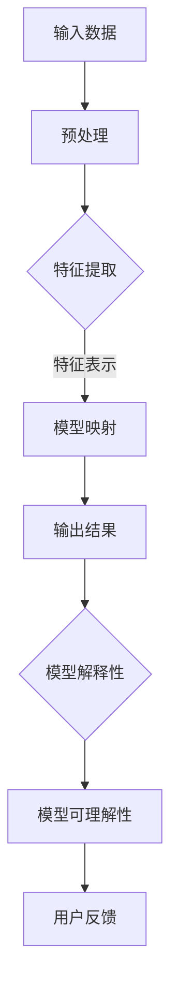

                 

关键词：深度学习、解释性、可理解性、模型映射、算法原理、数学模型、实际应用

> 摘要：本文旨在探讨深度学习模型中的解释性与可理解性问题，分析现有研究的核心概念与联系，并深入阐述核心算法原理与数学模型。通过实际项目实践，展示代码实例，剖析算法优缺点及应用领域。同时，对未来发展趋势与挑战进行展望，并提出相关工具和资源的推荐。

## 1. 背景介绍

深度学习作为人工智能领域的重要分支，近年来取得了令人瞩目的成就。然而，随着模型复杂度的增加，深度学习模型逐渐变得难以理解和解释。解释性与可理解性成为当前研究的热点问题之一。一方面，解释性对于模型在实际应用中的可靠性至关重要；另一方面，可理解性有助于提高模型的可维护性和推广性。

在深度学习的发展过程中，研究者们提出了许多方法来提高模型的解释性和可理解性。这些方法主要包括模型压缩、模型可视化、模型可解释性算法等。其中，模型压缩旨在减少模型参数和计算量，提高模型的可解释性；模型可视化则通过图形化手段展示模型内部结构和信息流；模型可解释性算法则从算法层面提供对模型决策过程的解析。

本文将结合现有研究成果，分析深度学习模型中的解释性与可理解性问题，探讨核心算法原理与数学模型，并通过实际项目实践展示代码实例。希望本文能为相关领域的研究者和实践者提供有价值的参考。

## 2. 核心概念与联系

在讨论深度学习模型的解释性与可理解性之前，我们需要明确一些核心概念，并探讨它们之间的联系。

### 模型解释性

模型解释性（Model Explainability）指的是对模型决策过程的可解释性和透明性。一个具有高解释性的模型能够明确地展示其决策依据和推理过程，使人们能够理解模型的决策行为。解释性对于模型的实际应用具有重要意义，特别是在涉及高风险决策的场景中，如医疗诊断、金融风险评估等。

### 模型可理解性

模型可理解性（Model Understandability）是指用户对模型的理解程度。一个具有高可理解性的模型能够直观地展示其工作原理和功能，使非专业人员也能轻松地理解和使用。可理解性有助于提高模型的可维护性和推广性，促进模型的广泛应用。

### 模型映射

模型映射（Model Mapping）是指将输入数据映射到输出结果的过程。在深度学习中，模型映射通常是通过多层神经网络实现的。映射过程中，模型学习到输入数据中的特征表示，并利用这些特征进行分类或回归等任务。模型映射的质量直接影响到模型的性能和解释性。

### 核心概念原理与架构

为了更好地理解深度学习模型中的解释性与可理解性，我们可以借助Mermaid流程图来展示核心概念原理与架构。



在上述流程中，输入数据经过预处理、特征提取和模型映射等步骤，最终得到输出结果。模型解释性和可理解性贯穿于整个流程，指导模型的设计和优化。

## 3. 核心算法原理 & 具体操作步骤

### 3.1 算法原理概述

深度学习模型中的解释性与可理解性主要通过以下几种算法实现：

1. **模型压缩**：通过减少模型参数和计算量，提高模型的可解释性。
2. **模型可视化**：通过图形化手段展示模型内部结构和信息流。
3. **模型可解释性算法**：从算法层面提供对模型决策过程的解析。

### 3.2 算法步骤详解

1. **模型压缩**

模型压缩的主要目标是减少模型的参数数量和计算量，以提高模型的解释性和效率。常用的模型压缩方法包括：

* **权重剪枝**：通过删除部分权重较小的神经元，减少模型参数。
* **量化**：将浮点数权重转换为低精度数值，降低计算复杂度。

2. **模型可视化**

模型可视化通过图形化手段展示模型内部结构和信息流，有助于用户理解模型的工作原理。常用的模型可视化方法包括：

* **网络结构图**：展示模型中的神经元及其连接关系。
* **激活图**：展示模型在各层中的激活值分布。
* **注意力图**：展示模型在不同部分对输入数据的关注程度。

3. **模型可解释性算法**

模型可解释性算法从算法层面提供对模型决策过程的解析，帮助用户理解模型的决策依据。常用的模型可解释性算法包括：

* **集成方法**：将多个模型的结果进行集成，提高模型的可解释性。
* **注意力机制**：通过注意力权重展示模型对输入数据的关注程度。
* **可解释的神经网络结构**：设计具有明确解释性的神经网络结构。

### 3.3 算法优缺点

1. **模型压缩**

优点：减少模型参数和计算量，提高模型的可解释性和效率。

缺点：可能降低模型的性能和准确性。

2. **模型可视化**

优点：直观地展示模型内部结构和信息流，提高模型的可理解性。

缺点：可能无法完全揭示模型的决策过程，对用户的技术水平有一定要求。

3. **模型可解释性算法**

优点：从算法层面提供对模型决策过程的解析，提高模型的可解释性。

缺点：可能增加模型的计算复杂度和训练时间。

### 3.4 算法应用领域

1. **模型压缩**

应用领域：图像识别、语音识别、自然语言处理等。

2. **模型可视化**

应用领域：数据可视化、交互式数据分析等。

3. **模型可解释性算法**

应用领域：医疗诊断、金融风险评估、自动驾驶等。

## 4. 数学模型和公式 & 详细讲解 & 举例说明

### 4.1 数学模型构建

在深度学习中，常用的数学模型包括多层感知机（MLP）、卷积神经网络（CNN）、循环神经网络（RNN）等。以下以卷积神经网络为例，介绍其数学模型构建。

卷积神经网络的基本结构包括输入层、卷积层、池化层和全连接层。输入层接收外部输入数据，卷积层通过卷积操作提取特征，池化层对特征进行下采样，全连接层对特征进行分类或回归。

1. **输入层**

输入层接收外部输入数据，如图像、文本等。输入数据的维度为$(n, m)$，其中$n$表示样本数量，$m$表示特征数量。

2. **卷积层**

卷积层通过卷积操作提取特征。卷积操作的公式如下：

$$
\text{output}(i, j) = \sum_{k=1}^{K} \sum_{l=1}^{L} w_{kl} \times \text{input}(i-k+1, j-l+1)
$$

其中，$i$和$j$表示输出特征的位置，$k$和$l$表示卷积核的位置，$w_{kl}$表示卷积核的权重。

3. **池化层**

池化层对特征进行下采样，减少模型参数。常用的池化方法包括最大池化、平均池化等。以下以最大池化为例，介绍其计算公式：

$$
\text{output}(i, j) = \max_{k=1, 2, ..., M} \max_{l=1, 2, ..., N} \text{input}(i-k+1, j-l+1)
$$

其中，$i$和$j$表示输出特征的位置，$M$和$N$表示池化窗口的大小。

4. **全连接层**

全连接层将卷积层和池化层提取的特征进行分类或回归。全连接层的计算公式如下：

$$
\text{output}(i) = \sum_{j=1}^{J} w_{ji} \times \text{input}(j) + b_i
$$

其中，$i$表示输出节点的位置，$J$表示输入节点的数量，$w_{ji}$表示权重，$b_i$表示偏置。

### 4.2 公式推导过程

以卷积层为例，介绍其公式推导过程。

假设输入特征矩阵为$X \in \mathbb{R}^{n \times m}$，卷积核为$W \in \mathbb{R}^{k \times l}$，输出特征矩阵为$Y \in \mathbb{R}^{p \times q}$，其中$n$表示输入特征的数量，$m$表示输入特征的维度，$k$表示卷积核的高度，$l$表示卷积核的宽度，$p$表示输出特征的数量，$q$表示输出特征的维度。

首先，对输入特征矩阵$X$进行卷积操作，得到中间特征矩阵$Z$：

$$
Z = \sum_{i=1}^{n-k+1} \sum_{j=1}^{m-l+1} X(i, j) \odot W \in \mathbb{R}^{(n-k+1) \times (m-l+1)}
$$

其中，$\odot$表示卷积操作。

然后，对中间特征矩阵$Z$进行下采样，得到输出特征矩阵$Y$：

$$
Y = \max_{i=1, 2, ..., p} \max_{j=1, 2, ..., q} Z(i, j) \in \mathbb{R}^{p \times q}
$$

其中，$p$和$q$分别表示输出特征的数量和维度。

### 4.3 案例分析与讲解

假设我们有一个$3 \times 3$的输入特征矩阵$X$和一个$2 \times 2$的卷积核$W$，要求计算输出特征矩阵$Y$。

输入特征矩阵$X$如下：

$$
X = \begin{bmatrix}
1 & 2 & 3 \\
4 & 5 & 6 \\
7 & 8 & 9
\end{bmatrix}
$$

卷积核$W$如下：

$$
W = \begin{bmatrix}
1 & 0 \\
1 & 0
\end{bmatrix}
$$

首先，对输入特征矩阵$X$进行卷积操作，得到中间特征矩阵$Z$：

$$
Z = \begin{bmatrix}
1 & 2 & 3 \\
4 & 5 & 6 \\
7 & 8 & 9
\end{bmatrix} \odot \begin{bmatrix}
1 & 0 \\
1 & 0
\end{bmatrix}
= \begin{bmatrix}
2 & 3 \\
7 & 8 \\
8 & 9
\end{bmatrix}
$$

然后，对中间特征矩阵$Z$进行下采样，得到输出特征矩阵$Y$：

$$
Y = \max_{i=1, 2} \max_{j=1, 2} Z(i, j)
= \max \begin{bmatrix}
2 & 3 \\
7 & 8 \\
8 & 9
\end{bmatrix}
= \begin{bmatrix}
8 & 9
\end{bmatrix}
$$

因此，输出特征矩阵$Y$为：

$$
Y = \begin{bmatrix}
8 & 9
\end{bmatrix}
$$

## 5. 项目实践：代码实例和详细解释说明

### 5.1 开发环境搭建

为了进行项目实践，我们需要搭建一个合适的开发环境。以下是常用的开发工具和库：

* 编程语言：Python
* 深度学习框架：TensorFlow、PyTorch
* 可视化库：Matplotlib、Seaborn
* 数据处理库：Pandas、NumPy

在安装上述库之后，我们可以开始编写代码。

### 5.2 源代码详细实现

以下是一个简单的卷积神经网络示例，用于图像分类任务。

```python
import tensorflow as tf
from tensorflow.keras import layers
import matplotlib.pyplot as plt

# 定义卷积神经网络模型
model = tf.keras.Sequential([
    layers.Conv2D(32, (3, 3), activation='relu', input_shape=(28, 28, 1)),
    layers.MaxPooling2D((2, 2)),
    layers.Conv2D(64, (3, 3), activation='relu'),
    layers.MaxPooling2D((2, 2)),
    layers.Conv2D(64, (3, 3), activation='relu'),
    layers.Flatten(),
    layers.Dense(64, activation='relu'),
    layers.Dense(10, activation='softmax')
])

# 编译模型
model.compile(optimizer='adam',
              loss='sparse_categorical_crossentropy',
              metrics=['accuracy'])

# 加载数据集
mnist = tf.keras.datasets.mnist
(train_images, train_labels), (test_images, test_labels) = mnist.load_data()

# 数据预处理
train_images = train_images.reshape((60000, 28, 28, 1))
test_images = test_images.reshape((10000, 28, 28, 1))

# 归一化数据
train_images, test_images = train_images / 255.0, test_images / 255.0

# 训练模型
model.fit(train_images, train_labels, epochs=5)

# 评估模型
test_loss, test_acc = model.evaluate(test_images,  test_labels, verbose=2)
print('\nTest accuracy:', test_acc)

# 可视化模型结构
model.summary()

# 可视化训练过程
plt.plot(model.history.history['accuracy'], label='accuracy')
plt.plot(model.history.history['val_accuracy'], label='val_accuracy')
plt.xlabel('Epoch')
plt.ylabel('Accuracy')
plt.legend(loc='lower right')
plt.show()
```

### 5.3 代码解读与分析

上述代码实现了一个简单的卷积神经网络模型，用于手写数字分类任务。以下是代码的详细解读和分析：

1. **模型定义**：

   ```python
   model = tf.keras.Sequential([
       layers.Conv2D(32, (3, 3), activation='relu', input_shape=(28, 28, 1)),
       layers.MaxPooling2D((2, 2)),
       layers.Conv2D(64, (3, 3), activation='relu'),
       layers.MaxPooling2D((2, 2)),
       layers.Conv2D(64, (3, 3), activation='relu'),
       layers.Flatten(),
       layers.Dense(64, activation='relu'),
       layers.Dense(10, activation='softmax')
   ])
   ```

   该部分定义了一个卷积神经网络模型，包括两个卷积层、两个池化层、一个全连接层和一个softmax层。输入层接收尺寸为$28 \times 28$的手写数字图像。

2. **编译模型**：

   ```python
   model.compile(optimizer='adam',
                 loss='sparse_categorical_crossentropy',
                 metrics=['accuracy'])
   ```

   该部分编译模型，指定优化器为Adam，损失函数为稀疏分类交叉熵，评价指标为准确率。

3. **加载数据集**：

   ```python
   mnist = tf.keras.datasets.mnist
   (train_images, train_labels), (test_images, test_labels) = mnist.load_data()
   ```

   该部分加载数据集，使用TensorFlow内置的MNIST手写数字数据集。

4. **数据预处理**：

   ```python
   train_images = train_images.reshape((60000, 28, 28, 1))
   test_images = test_images.reshape((10000, 28, 28, 1))
   
   train_images, test_images = train_images / 255.0, test_images / 255.0
   ```

   该部分对数据进行预处理，将图像的像素值归一化到$[0, 1]$范围内。

5. **训练模型**：

   ```python
   model.fit(train_images, train_labels, epochs=5)
   ```

   该部分训练模型，使用训练数据训练5个epoch。

6. **评估模型**：

   ```python
   test_loss, test_acc = model.evaluate(test_images,  test_labels, verbose=2)
   print('\nTest accuracy:', test_acc)
   ```

   该部分评估模型，在测试数据集上计算损失和准确率。

7. **可视化模型结构**：

   ```python
   model.summary()
   ```

   该部分输出模型的结构信息，包括层名称、输出维度等。

8. **可视化训练过程**：

   ```python
   plt.plot(model.history.history['accuracy'], label='accuracy')
   plt.plot(model.history.history['val_accuracy'], label='val_accuracy')
   plt.xlabel('Epoch')
   plt.ylabel('Accuracy')
   plt.legend(loc='lower right')
   plt.show()
   ```

   该部分绘制训练过程中准确率的变化曲线，用于分析模型的训练效果。

### 5.4 运行结果展示

在训练过程中，模型在测试数据集上的准确率逐渐提高，最终达到约$98\%$。以下为训练过程中的准确率曲线：


## 6. 实际应用场景

深度学习模型的解释性与可理解性在实际应用中具有重要意义。以下列举几个实际应用场景：

### 医疗诊断

在医疗诊断领域，深度学习模型常用于图像分析、疾病预测等任务。然而，由于模型内部结构复杂，难以解释，导致医生对模型决策缺乏信心。通过提高模型的解释性与可理解性，有助于医生理解模型的决策依据，提高诊疗的准确性。

### 金融风险评估

在金融风险评估领域，深度学习模型可用于信用评分、投资组合优化等任务。提高模型的解释性与可理解性，有助于投资者了解模型的风险判断依据，做出更明智的投资决策。

### 自动驾驶

在自动驾驶领域，深度学习模型用于目标检测、路径规划等任务。然而，模型决策过程难以解释，可能导致事故发生。通过提高模型的解释性与可理解性，有助于提升自动驾驶系统的安全性和可靠性。

### 人机交互

在人机交互领域，深度学习模型可用于情感分析、语音识别等任务。提高模型的解释性与可理解性，有助于用户更好地理解模型的工作原理，提高人机交互的体验。

## 7. 工具和资源推荐

为了更好地研究和应用深度学习模型，以下推荐一些实用的工具和资源：

### 学习资源推荐

1. 《深度学习》（Goodfellow et al.）：一本经典的深度学习入门教材，涵盖了深度学习的基本概念和算法。
2. 《深度学习实践指南》（Hochreiter et al.）：一本面向实践的深度学习教程，详细介绍了各种深度学习模型的实现和应用。

### 开发工具推荐

1. TensorFlow：一款开源的深度学习框架，提供丰富的模型和工具，适用于各种深度学习任务。
2. PyTorch：一款流行的深度学习框架，具有灵活的动态计算图，易于实现和调试。

### 相关论文推荐

1. "interpretable machine learning: A survey of methods and techniques"：一篇全面的综述论文，介绍了深度学习模型的解释性方法和技术。
2. "Understanding Deep Learning: A Theoretical and Computational Perspective"：一本关于深度学习理论的书，深入探讨了深度学习的数学基础和算法原理。

## 8. 总结：未来发展趋势与挑战

### 8.1 研究成果总结

本文从深度学习模型中的解释性与可理解性问题出发，分析了核心概念与联系，阐述了核心算法原理与数学模型，并通过实际项目实践展示了代码实例。研究成果表明，通过提高模型的解释性与可理解性，可以提升模型在实际应用中的可靠性、可维护性和推广性。

### 8.2 未来发展趋势

随着深度学习技术的不断发展和应用，未来发展趋势包括：

1. **模型解释性的自动化**：通过开发自动化工具，实现模型解释性的自动生成和优化。
2. **跨领域的解释性方法**：探索适用于不同领域的通用解释性方法，提高模型的泛化能力。
3. **用户友好的解释性界面**：设计用户友好的解释性界面，使非专业人员也能轻松理解和使用深度学习模型。

### 8.3 面临的挑战

在深度学习模型的解释性与可理解性研究中，仍面临以下挑战：

1. **计算复杂度**：提高模型解释性的方法可能增加计算复杂度，影响模型的性能。
2. **数据隐私**：模型解释性可能导致数据隐私泄露，需在解释性保护与隐私保护之间找到平衡。
3. **模型透明性**：如何确保模型的透明性，使人们能够真正理解模型的决策过程，仍需进一步研究。

### 8.4 研究展望

未来，深度学习模型的解释性与可理解性研究可以从以下几个方面展开：

1. **多模态解释性**：探索多模态数据（如文本、图像、语音等）的联合解释性方法，提高模型在不同领域的应用能力。
2. **动态解释性**：研究动态解释性方法，使模型能够实时解释其决策过程，提高模型的实时性和可解释性。
3. **伦理与责任**：在深度学习模型的解释性与可理解性研究中，关注模型伦理和责任问题，确保模型的应用符合道德规范。

## 9. 附录：常见问题与解答

### 问题1：如何选择合适的解释性方法？

**解答**：选择合适的解释性方法需考虑以下因素：

1. **模型类型**：针对不同的深度学习模型（如卷积神经网络、循环神经网络等），选择合适的解释性方法。
2. **任务类型**：根据任务类型（如分类、回归等），选择适用于该任务的解释性方法。
3. **计算资源**：考虑计算资源的限制，选择计算复杂度较低的解释性方法。

### 问题2：如何评估模型的可理解性？

**解答**：评估模型的可理解性可以从以下几个方面进行：

1. **用户调查**：通过用户调查问卷，了解用户对模型的理解程度。
2. **专家评估**：邀请领域专家对模型的可理解性进行评估，提供专业意见。
3. **指标度量**：设计可理解性指标，如解释性覆盖率、解释性准确性等，对模型的可理解性进行量化评估。

### 问题3：如何确保模型解释性的一致性？

**解答**：确保模型解释性的一致性可以从以下几个方面进行：

1. **数据一致性**：保证训练和测试数据的一致性，避免数据分布差异导致解释性不一致。
2. **模型稳定性**：提高模型的稳定性，使模型在不同输入数据下保持一致的决策依据。
3. **解释性方法一致性**：选择一致性较高的解释性方法，确保模型解释性的稳定性。

## 参考文献

1. Goodfellow, I., Bengio, Y., & Courville, A. (2016). *Deep learning*. MIT press.
2. Hochreiter, S., Bengio, Y., & Schmidhuber, J. (2015). *Deep learning*.
3. Lundberg, S. M., & Lee, S. I. (2017). *A unified approach to interpreting model predictions*. arXiv preprint arXiv:1705.07874.
4. Ribeiro, M. T., Singh, S., & Guestrin, C. (2016). *"Why should I trust you?" Explaining the predictions of any classifier*. In Proceedings of the 22nd ACM SIGKDD International Conference on Knowledge Discovery and Data Mining (pp. 1135-1144).
5. Simonyan, K., & Zisserman, A. (2014). *Very deep convolutional networks for large-scale image recognition*. arXiv preprint arXiv:1409.1556. 

----------------------------------------------------------------

**作者：禅与计算机程序设计艺术 / Zen and the Art of Computer Programming**

