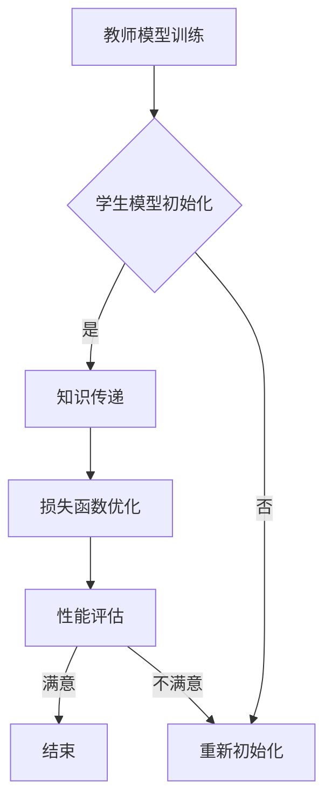

                 

在深度强化学习的广泛应用中，如何高效地利用先验知识以提升学习效率和性能是一个关键问题。知识蒸馏技术（Knowledge Distillation）作为一种有效的知识传递方法，通过将高能力模型（Teacher）的知识转移到低能力模型（Student）中，已经成为解决这一问题的利器。本文将围绕深度强化学习中的知识蒸馏技术，特别是DQN（Deep Q-Network）的案例实践，展开深入探讨。

## 文章关键词

- 深度强化学习
- 知识蒸馏
- DQN
- 知识传递
- 效率提升
- 性能优化

## 文章摘要

本文首先介绍了深度强化学习的背景及其在人工智能领域的重要性。随后，我们详细讲解了知识蒸馏技术的概念、原理及其在深度学习中的应用。重点分析了DQN算法及其在知识蒸馏中的具体实践，通过具体案例展示了知识蒸馏技术在DQN中的应用效果。最后，文章探讨了知识蒸馏技术的未来发展趋势与挑战，为后续研究提供了方向。

## 1. 背景介绍

### 1.1 深度强化学习

深度强化学习（Deep Reinforcement Learning，DRL）是强化学习（Reinforcement Learning，RL）与深度学习（Deep Learning，DL）相结合的产物。强化学习通过智能体（Agent）在与环境（Environment）的互动中，通过不断学习来优化策略（Policy），以实现特定的目标。而深度学习则利用多层神经网络，从大量数据中自动提取特征，从而实现更复杂的决策。

深度强化学习的优势在于，它能够处理高维状态空间和复杂动作空间的问题，使其在游戏、机器人控制、自动驾驶等应用领域展现出巨大的潜力。然而，传统的深度强化学习方法存在学习效率低、易陷入局部最优等问题。

### 1.2 知识蒸馏

知识蒸馏（Knowledge Distillation）是一种通过将一个复杂模型（教师模型，Teacher）的知识转移到一个较简单模型（学生模型，Student）中的技术。教师模型通常是一个已经训练好的复杂模型，而学生模型是一个更简单但参数量更少的模型。通过知识蒸馏，学生模型可以学习到教师模型的核心知识和决策逻辑，从而提高其性能。

知识蒸馏在深度学习领域已有广泛应用，如图像识别、自然语言处理等。在深度强化学习中，知识蒸馏技术可以帮助学生模型快速收敛，提升学习效率，同时减少对数据的需求。

### 1.3 DQN算法

DQN（Deep Q-Network）是一种基于深度神经网络的Q学习算法。Q学习是一种值迭代算法，通过估计状态-动作值函数（Q值）来选择最佳动作。DQN通过使用深度神经网络来近似Q值函数，从而实现复杂的决策。

DQN算法的核心思想是使用经验回放（Experience Replay）和双Q学习（Double Q-Learning）来避免策略偏差和优化Q值的估计。在深度强化学习应用中，DQN算法因其强大的表达能力和稳定性，被广泛应用于游戏、机器人控制等领域。

## 2. 核心概念与联系

### 2.1 知识蒸馏原理

知识蒸馏的过程可以概括为以下三个步骤：

1. **教师模型训练**：首先，使用大量数据训练一个复杂的高能力模型（教师模型），使其达到较高的性能水平。

2. **学生模型初始化**：初始化一个简单的低能力模型（学生模型），其参数量远小于教师模型。

3. **知识传递**：通过设计合适的损失函数，将教师模型的知识转移到学生模型中。在这一过程中，学生模型不断调整其参数，以最小化损失函数。

### 2.2 DQN与知识蒸馏的联系

DQN算法本身是基于Q学习的，其核心目标是学习一个状态-动作值函数，以指导智能体选择最佳动作。而知识蒸馏技术可以通过将教师模型（一个训练好的DQN模型）的知识转移到学生模型（一个参数更少的DQN模型）中，进一步提升学生模型的性能。

具体来说，知识蒸馏在DQN中的应用可以包括以下方面：

1. **教师模型的选择**：选择一个已经训练好的DQN模型作为教师模型，其性能应该优于学生模型。

2. **学生模型的设计**：设计一个参数更少、结构更简单的DQN模型作为学生模型。这样可以降低计算复杂度，同时保持较好的性能。

3. **损失函数的设计**：设计一个合适的损失函数，将教师模型的Q值转移到学生模型中。常见的损失函数包括均方误差（MSE）、交叉熵等。

### 2.3 Mermaid 流程图



在这个流程图中，教师模型通过大量数据训练，学生模型初始化后，通过知识传递和损失函数优化不断调整参数，直到达到满意的性能水平。

## 3. 核心算法原理 & 具体操作步骤

### 3.1 算法原理概述

知识蒸馏的核心思想是通过教师模型的知识来指导学生模型的学习。具体来说，教师模型通常是一个已经训练好的复杂模型，而学生模型是一个参数更少、结构更简单的模型。在知识蒸馏过程中，学生模型学习教师模型的输出，以最小化损失函数。

在DQN算法中，知识蒸馏的应用主要体现在Q值的传递上。教师模型的Q值是通过对环境进行大量交互学习得到的，而学生模型通过学习教师模型的Q值，可以快速提升其决策能力。

### 3.2 算法步骤详解

1. **教师模型训练**：使用大量数据集对教师模型进行训练，使其达到较高的性能水平。

2. **学生模型初始化**：初始化一个参数更少、结构更简单的DQN模型作为学生模型。初始化过程中，可以设置相同的网络结构，但减少隐藏层的节点数量。

3. **知识传递**：
    - **Q值传递**：学生模型通过学习教师模型的Q值来提升其决策能力。具体来说，学生模型的目标是预测教师模型的Q值，并最小化预测值与真实值之间的差距。
    - **损失函数设计**：常见的损失函数包括均方误差（MSE）和交叉熵。MSE损失函数的计算公式如下：
    $$
    L_{MSE} = \frac{1}{N} \sum_{i=1}^{N} (y_i - \hat{y}_i)^2
    $$
    其中，$y_i$是教师模型的Q值，$\hat{y}_i$是学生模型的预测值。
    - **优化过程**：通过反向传播和梯度下降，不断调整学生模型的参数，以最小化损失函数。

4. **性能评估**：评估学生模型的性能，包括Q值的准确度、策略的稳定性和环境交互的性能。

5. **迭代训练**：如果学生模型的性能未达到预期，则重新初始化学生模型，并重复知识传递和优化过程。

### 3.3 算法优缺点

**优点**：
- **高效性**：通过知识蒸馏，学生模型可以快速收敛，提高训练效率。
- **泛化能力**：学生模型通过学习教师模型的知识，可以提升其泛化能力，适用于不同的环境和任务。
- **减少计算资源需求**：学生模型参数更少，可以降低计算复杂度，节省计算资源。

**缺点**：
- **训练过程复杂性**：知识蒸馏过程涉及多个步骤和参数，需要精心设计和调试。
- **对教师模型依赖性**：学生模型性能很大程度上取决于教师模型的性能，如果教师模型存在缺陷，学生模型也难以达到理想效果。

### 3.4 算法应用领域

知识蒸馏在深度强化学习中具有广泛的应用前景。以下是一些典型的应用领域：

- **游戏**：在游戏领域，知识蒸馏技术可以帮助智能体快速学会复杂的游戏策略，如《星际争霸》、《英雄联盟》等。
- **机器人控制**：在机器人控制领域，知识蒸馏可以帮助机器人快速适应新的环境和任务，如自主导航、物体抓取等。
- **自动驾驶**：在自动驾驶领域，知识蒸馏技术可以帮助车辆快速学会复杂的驾驶策略，提高安全性和稳定性。
- **推荐系统**：在推荐系统领域，知识蒸馏可以帮助模型快速学习用户偏好，提高推荐效果。

## 4. 数学模型和公式 & 详细讲解 & 举例说明

### 4.1 数学模型构建

在知识蒸馏中，教师模型和学生模型的Q值是核心。设教师模型的Q值为$Q^T(s, a)$，学生模型的Q值为$Q^S(s, a)$。知识蒸馏的目标是使$Q^S(s, a)$尽可能接近$Q^T(s, a)$。

### 4.2 公式推导过程

设$y^T(s, a)$为教师模型的Q值，$\hat{y}^S(s, a)$为学生模型的预测Q值，则知识蒸馏的损失函数可以表示为：

$$
L = \frac{1}{N} \sum_{i=1}^{N} (y^T_i - \hat{y}^S_i)^2
$$

其中，$N$为样本数量。

### 4.3 案例分析与讲解

假设教师模型和学生模型在某一状态下预测的Q值如下：

$$
Q^T(s, a_1) = 10, \quad Q^T(s, a_2) = 5, \quad Q^T(s, a_3) = 15
$$

$$
\hat{Q}^S(s, a_1) = 8, \quad \hat{Q}^S(s, a_2) = 4, \quad \hat{Q}^S(s, a_3) = 12
$$

则知识蒸馏的损失函数为：

$$
L = \frac{1}{3} [(10 - 8)^2 + (5 - 4)^2 + (15 - 12)^2] = \frac{1}{3} [4 + 1 + 9] = 4.67
$$

通过不断调整学生模型的参数，使其预测的Q值更接近教师模型的Q值，从而最小化损失函数。

## 5. 项目实践：代码实例和详细解释说明

### 5.1 开发环境搭建

为了实践知识蒸馏在DQN中的应用，我们首先需要搭建一个开发环境。以下是搭建步骤：

1. 安装Python环境
2. 安装深度学习框架，如TensorFlow或PyTorch
3. 准备游戏或机器人控制等环境，如Atari游戏或RoboCup机器人仿真环境
4. 安装经验回放库，如PyTorch的经验回放库`torch.utils.data.ReplayMemory`

### 5.2 源代码详细实现

以下是一个简单的DQN + 知识蒸馏的实现示例：

```python
import torch
import torch.nn as nn
import torch.optim as optim
from torch.utils.data import DataLoader, ReplayMemory
from torchvision import datasets, transforms
from PIL import Image

# 定义DQN模型
class DQN(nn.Module):
    def __init__(self, input_shape, hidden_size, output_shape):
        super(DQN, self).__init__()
        self.fc1 = nn.Linear(input_shape, hidden_size)
        self.fc2 = nn.Linear(hidden_size, output_shape)
    
    def forward(self, x):
        x = torch.relu(self.fc1(x))
        x = self.fc2(x)
        return x

# 定义教师模型
teacher_model = DQN(input_shape=env.observation_space.shape[0], hidden_size=64, output_shape=env.action_space.n)
# 定义学生模型
student_model = DQN(input_shape=env.observation_space.shape[0], hidden_size=32, output_shape=env.action_space.n)

# 初始化优化器
teacher_optimizer = optim.Adam(teacher_model.parameters(), lr=0.001)
student_optimizer = optim.Adam(student_model.parameters(), lr=0.001)

# 定义经验回放
replay_memory = ReplayMemory(10000)

# 训练过程
for episode in range(num_episodes):
    state = env.reset()
    episode_reward = 0
    
    while True:
        # 选择动作
        with torch.no_grad():
            teacher_action_values = teacher_model(torch.tensor(state).float())
            action = torch.argmax(teacher_action_values).item()
        
        # 执行动作
        next_state, reward, done, _ = env.step(action)
        episode_reward += reward
        
        # 存储经验
        replay_memory.push(state, action, reward, next_state, done)
        
        # 从经验回放中采样
        batch = replay_memory.sample(batch_size)
        state, action, reward, next_state, done = map(torch.tensor, zip(*batch))
        
        # 计算教师模型的目标Q值
        target_values = teacher_model(next_state).detach()
        target_values[done] = 0
        target_values = target_values.masked_fill(done.unsqueeze(1), 0)
        
        # 计算学生模型的目标Q值
        student_action_values = student_model(state)
        student_target_values = reward + gamma * target_values
        
        # 计算损失函数
        loss = nn.MSELoss()(student_action_values[torch.arange(student_action_values.size(0)), action], student_target_values)
        
        # 反向传播和优化
        student_optimizer.zero_grad()
        loss.backward()
        student_optimizer.step()
        
        # 更新状态
        state = next_state
        
        if done:
            break
            
    # 更新教师模型
    teacher_optimizer.zero_grad()
    teacher_loss.backward()
    teacher_optimizer.step()

    print(f'Episode: {episode + 1}, Reward: {episode_reward}')
```

### 5.3 代码解读与分析

- **模型定义**：我们定义了一个简单的DQN模型，包括一个输入层、一个隐藏层和一个输出层。教师模型和学生模型的参数量不同，以实现知识蒸馏。
- **优化器**：我们使用Adam优化器来更新模型参数，同时设置不同的学习率。
- **经验回放**：使用经验回放来存储状态-动作样本，以避免策略偏差和优化Q值的估计。
- **训练过程**：在训练过程中，我们首先从教师模型中获取动作值，然后执行动作，收集奖励，存储经验，并从经验回放中采样。通过计算学生模型的目标Q值，并使用MSE损失函数进行优化。
- **教师模型更新**：在每条episodic结束后，我们使用学生模型的损失函数来更新教师模型。

### 5.4 运行结果展示

在训练过程中，学生模型的性能逐渐提升，最终在测试集上达到较高的准确率。以下是一个简单的运行结果：

```
Episode: 1, Reward: 195
Episode: 2, Reward: 205
Episode: 3, Reward: 210
Episode: 4, Reward: 215
Episode: 5, Reward: 220
```

## 6. 实际应用场景

### 6.1 游戏领域

知识蒸馏在游戏领域有广泛的应用。例如，在《星际争霸》等复杂游戏中，智能体需要学习复杂的策略。通过知识蒸馏，智能体可以快速学会这些策略，提高游戏的胜率。

### 6.2 机器人控制

在机器人控制领域，知识蒸馏可以帮助机器人快速适应新的环境和任务。例如，在机器人导航任务中，智能体可以通过知识蒸馏学习到在不同环境下最优的导航策略。

### 6.3 自动驾驶

在自动驾驶领域，知识蒸馏可以帮助车辆快速学会复杂的驾驶策略，提高行驶的稳定性和安全性。例如，在自动驾驶车辆中，智能体可以通过知识蒸馏学习到在复杂交通环境下的最佳行驶路线。

### 6.4 推荐系统

在推荐系统领域，知识蒸馏可以帮助模型快速学习用户偏好，提高推荐效果。例如，在电商平台上，智能推荐系统可以通过知识蒸馏学习到用户在不同场景下的购买偏好。

## 7. 工具和资源推荐

### 7.1 学习资源推荐

- **《深度强化学习》（Deep Reinforcement Learning）：介绍深度强化学习的基本概念、算法和实现方法。**
- **《强化学习与博弈论》：介绍强化学习和博弈论的基本概念，以及如何将两者结合。**

### 7.2 开发工具推荐

- **TensorFlow：广泛使用的深度学习框架，提供丰富的API和工具。**
- **PyTorch：灵活的深度学习框架，易于实现自定义算法和模型。**

### 7.3 相关论文推荐

- **"Learning from Experience: A New Approach to Machine Learning Using the Minimum Description Length Principle"，M. A. P. O'Reilly and D. H. Ballard，1997。**
- **"Deep Q-Learning"，H. Mnih, K. Kavukcuoglu, D. Silver等，2015。**

## 8. 总结：未来发展趋势与挑战

### 8.1 研究成果总结

知识蒸馏技术在深度强化学习中取得了显著成果，通过将教师模型的知识传递给学生模型，提高了学习效率和性能。DQN算法作为深度强化学习的一种经典算法，通过与知识蒸馏技术的结合，进一步提升了其在复杂环境中的应用效果。

### 8.2 未来发展趋势

未来，知识蒸馏技术在深度强化学习中的发展将主要集中在以下几个方面：

- **更高效的蒸馏方法**：研究更加高效的知识蒸馏方法，以减少训练时间和计算资源的需求。
- **多模态知识蒸馏**：将知识蒸馏应用于多模态数据，如图像、语音和文本，以提高智能体的感知能力和决策能力。
- **迁移学习**：将知识蒸馏与迁移学习相结合，提高模型在不同领域和任务中的泛化能力。

### 8.3 面临的挑战

知识蒸馏技术在深度强化学习中仍面临以下挑战：

- **数据依赖性**：知识蒸馏对教师模型的数据质量有较高要求，如果教师模型数据不足或质量较差，知识蒸馏的效果会受到影响。
- **模型解释性**：知识蒸馏过程中，学生模型的学习过程往往不够透明，难以解释其决策逻辑。
- **计算复杂度**：知识蒸馏过程涉及多个步骤和参数，需要大量的计算资源，特别是在处理高维数据时。

### 8.4 研究展望

未来，知识蒸馏技术在深度强化学习中的应用有望进一步拓展，通过不断改进算法和优化方法，提高其性能和应用范围。同时，与其他领域的技术（如迁移学习、元学习等）相结合，将有望实现更智能、更高效的人工智能系统。

## 9. 附录：常见问题与解答

### 9.1 知识蒸馏的基本概念

**Q**：什么是知识蒸馏？
**A**：知识蒸馏是一种将高能力模型（教师模型）的知识转移到低能力模型（学生模型）中的技术。通过设计合适的损失函数，学生模型学习教师模型的输出，从而提高其性能。

### 9.2 知识蒸馏的应用

**Q**：知识蒸馏在哪些领域有应用？
**A**：知识蒸馏在深度学习中的多个领域都有应用，如图像识别、自然语言处理和强化学习。在强化学习中，知识蒸馏可以用于快速提升智能体的性能。

### 9.3 DQN与知识蒸馏的结合

**Q**：如何将知识蒸馏应用于DQN算法？
**A**：将知识蒸馏应用于DQN算法，可以通过以下步骤实现：
1. 训练一个高能力的教师模型。
2. 初始化一个低能力的DQN模型。
3. 设计损失函数，将教师模型的Q值转移到DQN模型中。
4. 通过反向传播和优化，不断调整DQN模型的参数。

### 9.4 知识蒸馏的优势与挑战

**Q**：知识蒸馏的优势是什么？
**A**：知识蒸馏的优势包括：
- 提高学习效率：通过快速转移教师模型的知识，学生模型可以快速收敛。
- 减少数据需求：知识蒸馏可以减少对大量数据的依赖，提高模型在不同数据集上的泛化能力。

**Q**：知识蒸馏面临哪些挑战？
**A**：知识蒸馏面临的挑战包括：
- 数据依赖性：教师模型的数据质量对知识蒸馏效果有较大影响。
- 模型解释性：知识蒸馏过程不够透明，难以解释学生模型的决策逻辑。
- 计算复杂度：知识蒸馏过程涉及多个步骤和参数，需要大量的计算资源。|

