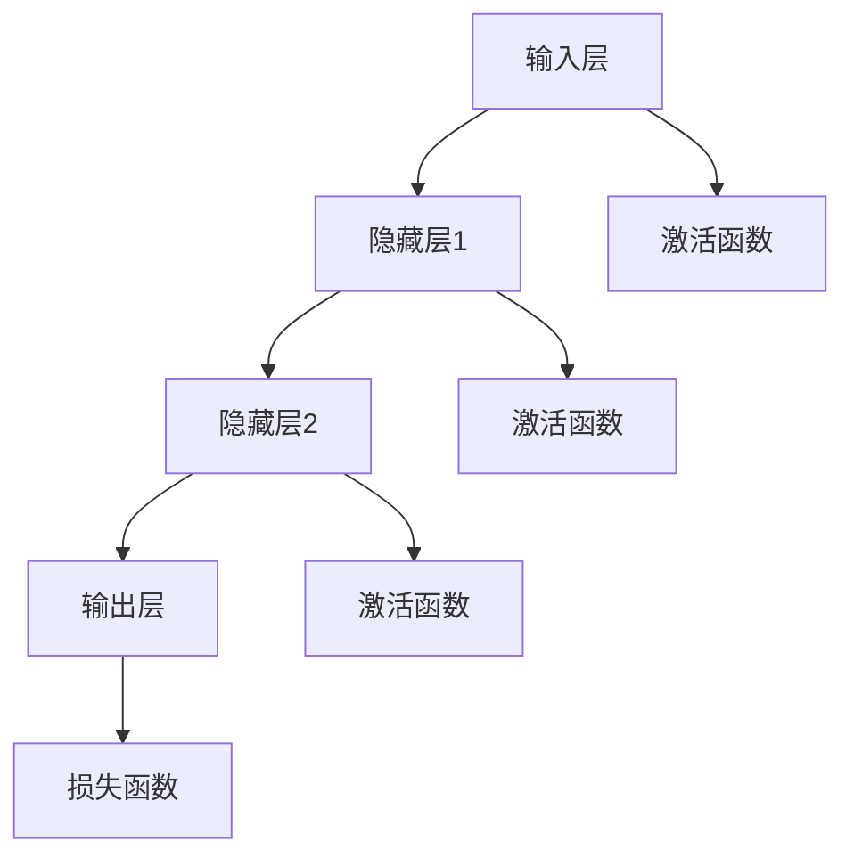

                 

 

## 1. 背景介绍

随着全球气候变化的加剧，环境监测已成为当今社会发展的重要议题。环境监测涉及多个领域，如空气质量、水质、土壤健康等，通过这些数据，我们可以及时了解环境状况，预测潜在的环境危机，并为政策制定提供科学依据。然而，传统的环境监测方法存在数据获取难度大、处理效率低、实时性差等问题，这使得环境监测的准确性和时效性受到了很大的限制。

近年来，神经网络算法在各个领域取得了显著的成果，尤其是在数据处理和模式识别方面。神经网络以其强大的自学习能力，可以处理大规模的数据，并从中提取出有用的信息。这为环境监测提供了一种全新的思路，通过神经网络算法，我们可以实现对环境数据的实时监测和分析，提高监测的准确性和效率。

本文旨在探讨神经网络算法在环境监测中的应用，分析其核心原理、数学模型、具体操作步骤，并通过项目实践，展示其实际应用效果。希望本文能为您在环境监测领域提供一些新的思路和方法。

## 2. 核心概念与联系

### 2.1 神经网络的基本概念

神经网络（Neural Network）是一种模仿生物神经系统的计算模型，它由大量的神经元（或节点）通过复杂的连接结构组成。每个神经元都可以接收多个输入信号，并产生一个输出信号。神经元的输出信号会传递到其他神经元，通过这种传递和计算，神经网络可以实现对输入数据的处理和模式识别。

神经网络的核心概念包括：

- **神经元**：神经网络的基本单元，每个神经元都有一个输入层、一个输出层和一个激活函数。
- **权重**：连接两个神经元的边的强度，代表了神经元之间的相互作用强度。
- **激活函数**：用于确定神经元是否激活的函数，常用的激活函数有Sigmoid函数、ReLU函数等。
- **前向传播**：从输入层开始，将输入数据通过神经网络逐层传递，直到输出层，得到输出结果。
- **反向传播**：通过计算输出结果与真实结果的误差，将误差反向传播到神经网络的所有层，调整神经元的权重，优化网络模型。

### 2.2 神经网络与环境监测的联系

环境监测中的数据通常是多维的、非线性的，并且存在噪声和缺失值。神经网络以其强大的非线性建模能力和自学习能力，可以很好地处理这些复杂的环境数据。

神经网络在环境监测中的应用主要体现在以下几个方面：

- **特征提取**：通过神经网络的前向传播过程，可以从原始数据中提取出有用的特征，这些特征可以用于后续的环境分析和预测。
- **模式识别**：神经网络可以识别出环境数据中的规律和模式，比如空气质量的变化趋势、水质的污染程度等。
- **实时监测**：神经网络的自适应能力使得它可以实时地对环境数据进行分析，及时识别出环境问题，提供预警信息。
- **预测分析**：通过神经网络的学习和训练，可以预测未来的环境变化趋势，为政策制定和环境保护提供科学依据。

### 2.3 神经网络架构的 Mermaid 流程图



在上述流程图中，A表示输入层，B、C、D分别表示隐藏层1、隐藏层2和输出层，E、F、G分别表示三个隐藏层的激活函数，H表示输出层的损失函数。

## 3. 核心算法原理 & 具体操作步骤

### 3.1 算法原理概述

神经网络算法的核心原理是模仿生物神经系统的工作机制，通过学习输入数据与输出数据之间的关系，实现对未知数据的预测和分类。

神经网络的学习过程主要包括以下几个步骤：

1. **数据预处理**：对原始数据进行归一化、去噪、填补缺失值等处理，使其符合神经网络的要求。
2. **前向传播**：将预处理后的数据输入神经网络，通过神经元的传递和计算，得到输出结果。
3. **反向传播**：计算输出结果与真实结果的误差，将误差反向传播到神经网络的所有层，调整神经元的权重，优化网络模型。
4. **迭代训练**：重复上述步骤，直到网络模型收敛，即输出结果与真实结果的误差足够小。

### 3.2 算法步骤详解

1. **数据预处理**

数据预处理是神经网络算法的第一步，其目的是将原始数据转换为神经网络可以处理的格式。具体步骤如下：

- **归一化**：将数据缩放到一个特定的范围，比如[0, 1]，以便神经网络更好地学习和处理。
- **去噪**：去除数据中的噪声，提高数据的准确性。
- **填补缺失值**：对于缺失的数据，可以使用平均值、中位数等方法进行填补。

2. **前向传播**

前向传播是神经网络算法的核心步骤，它将输入数据通过神经网络逐层传递，最终得到输出结果。具体步骤如下：

- **初始化权重和偏置**：在开始训练之前，需要随机初始化神经网络的权重和偏置。
- **输入数据**：将预处理后的数据输入到神经网络的第一层（输入层）。
- **激活函数计算**：对于每个神经元，计算输入值与权重和偏置的乘积，然后加上一个偏置项，最后应用激活函数得到神经元的输出值。
- **层间传递**：将当前层的输出值作为下一层的输入值，依次传递到下一层。
- **输出结果**：当数据传递到最后一层（输出层）时，得到神经网络的输出结果。

3. **反向传播**

反向传播是调整神经网络权重和偏置的过程，其目的是减小输出结果与真实结果之间的误差。具体步骤如下：

- **计算误差**：计算输出结果与真实结果之间的误差。
- **梯度下降**：使用梯度下降算法，根据误差计算权重的梯度，然后调整权重和偏置。
- **更新权重和偏置**：将调整后的权重和偏置应用到神经网络中，更新网络模型。

4. **迭代训练**

迭代训练是神经网络算法的训练过程，其目的是通过多次迭代，使神经网络模型逐渐收敛，达到预期的效果。具体步骤如下：

- **重复步骤2和3**：重复前向传播和反向传播的步骤，直到网络模型收敛。
- **调整学习率**：在迭代过程中，可以调整学习率，以控制训练速度和效果。
- **验证和测试**：在每次迭代后，可以使用验证集和测试集对网络模型进行验证和测试，以评估模型的性能。

### 3.3 算法优缺点

神经网络算法具有以下优点：

- **强大的自学习能力**：神经网络可以通过学习大量数据，提取出数据中的特征和模式，从而实现自动分类和预测。
- **非线性建模能力**：神经网络可以很好地处理非线性问题，通过对数据的多层传递和计算，实现对复杂关系的建模。
- **适应性**：神经网络具有较好的适应性，可以处理不同规模和类型的数据，适用于各种环境监测场景。

然而，神经网络算法也存在一些缺点：

- **计算量大**：神经网络算法需要大量的计算资源，尤其是在训练过程中，计算量更大。
- **易过拟合**：神经网络模型可能会对训练数据过度拟合，导致在测试数据上表现不佳。
- **参数调整复杂**：神经网络的参数调整较为复杂，需要大量实验和调试。

### 3.4 算法应用领域

神经网络算法在环境监测领域具有广泛的应用，以下是一些具体的应用场景：

- **空气质量监测**：通过神经网络算法，可以实时监测空气质量，识别出污染物的主要成分和来源。
- **水质监测**：神经网络算法可以分析水质数据，预测水质的变化趋势，及时发现水污染问题。
- **土壤健康监测**：神经网络算法可以处理土壤数据，分析土壤的成分和健康状况，为农业提供科学依据。
- **自然灾害预警**：神经网络算法可以预测自然灾害的发生，提供预警信息，减少灾害损失。

## 4. 数学模型和公式 & 详细讲解 & 举例说明

### 4.1 数学模型构建

神经网络算法的数学模型主要包括以下几个方面：

1. **神经元激活函数**：

神经元激活函数是神经网络的核心组成部分，用于确定神经元是否激活。常见的激活函数有Sigmoid函数、ReLU函数等。

- Sigmoid函数：

  $$ f(x) = \frac{1}{1 + e^{-x}} $$

- ReLU函数：

  $$ f(x) = \max(0, x) $$

2. **前向传播**：

前向传播是神经网络的核心步骤，通过多层传递和计算，得到输出结果。其数学模型可以表示为：

$$ z^{(l)} = \sum_{j} w^{(l)}_{ji} a^{(l-1)}_j + b^{(l)} $$

其中，$z^{(l)}$表示第$l$层的输出，$w^{(l)}_{ji}$表示第$l$层的第$i$个神经元与第$l-1$层的第$j$个神经元的权重，$a^{(l-1)}_j$表示第$l-1$层的第$j$个神经元的输出，$b^{(l)}$表示第$l$层的偏置。

3. **反向传播**：

反向传播是调整神经网络权重和偏置的过程，其数学模型可以表示为：

$$ \delta^{(l)}_i = \frac{\partial J}{\partial z^{(l)}_i} = \sigma'(z^{(l)}) \odot \delta^{(l+1)}_{ji} $$

其中，$\delta^{(l)}_i$表示第$l$层的第$i$个神经元的误差，$\sigma'(z^{(l)})$表示第$l$层的激活函数的导数，$\delta^{(l+1)}_{ji}$表示第$l+1$层的第$j$个神经元与第$l$层的第$i$个神经元的误差。

4. **梯度下降**：

梯度下降是调整神经网络权重和偏置的方法，其数学模型可以表示为：

$$ w^{(l)}_{ji} := w^{(l)}_{ji} - \alpha \frac{\partial J}{\partial w^{(l)}_{ji}} $$

$$ b^{(l)} := b^{(l)} - \alpha \frac{\partial J}{\partial b^{(l)}} $$

其中，$\alpha$表示学习率，$w^{(l)}_{ji}$和$b^{(l)}$分别表示第$l$层的第$i$个神经元与第$l-1$层的第$j$个神经元的权重和偏置。

### 4.2 公式推导过程

以下是一个简化的神经网络公式的推导过程，用于说明神经网络中的数据流和计算过程。

1. **输入层到隐藏层的传递**：

假设我们有一个简单的神经网络，输入层有3个神经元，隐藏层有2个神经元。输入层到隐藏层的传递可以表示为：

$$ z^{(2)}_1 = w^{(2)}_{11} a^{(1)}_1 + w^{(2)}_{12} a^{(1)}_2 + w^{(2)}_{13} a^{(1)}_3 + b^{(2)}_1 $$

$$ z^{(2)}_2 = w^{(2)}_{21} a^{(1)}_1 + w^{(2)}_{22} a^{(1)}_2 + w^{(2)}_{23} a^{(1)}_3 + b^{(2)}_2 $$

其中，$a^{(1)}_1, a^{(1)}_2, a^{(1)}_3$表示输入层的3个神经元的输出，$w^{(2)}_{ij}$表示隐藏层的第$i$个神经元与输入层的第$j$个神经元的权重，$b^{(2)}_1, b^{(2)}_2$表示隐藏层的2个神经元的偏置。

2. **隐藏层到输出层的传递**：

输出层的传递可以表示为：

$$ z^{(3)}_1 = w^{(3)}_{11} z^{(2)}_1 + w^{(3)}_{12} z^{(2)}_2 + b^{(3)}_1 $$

$$ z^{(3)}_2 = w^{(3)}_{21} z^{(2)}_1 + w^{(3)}_{22} z^{(2)}_2 + b^{(3)}_2 $$

其中，$z^{(2)}_1, z^{(2)}_2$表示隐藏层的2个神经元的输出，$w^{(3)}_{ij}$表示输出层的第$i$个神经元与隐藏层的第$j$个神经元的权重，$b^{(3)}_1, b^{(3)}_2$表示输出层的2个神经元的偏置。

3. **输出层的激活函数**：

假设我们使用Sigmoid函数作为输出层的激活函数，输出层的输出可以表示为：

$$ a^{(3)}_1 = \sigma(z^{(3)}_1) $$

$$ a^{(3)}_2 = \sigma(z^{(3)}_2) $$

其中，$\sigma(z)$表示Sigmoid函数。

### 4.3 案例分析与讲解

以下是一个简单的神经网络案例，用于说明神经网络算法的基本原理和操作步骤。

#### 案例背景

假设我们有一个简单的环境监测系统，用于监测空气质量，系统需要根据输入的空气污染物浓度数据预测空气质量指数（AQI）。

#### 案例数据

输入数据：空气污染物浓度（PM2.5、SO2、NO2、CO）

输出数据：空气质量指数（AQI）

#### 案例步骤

1. **数据预处理**：

   对输入的空气污染物浓度数据进行归一化处理，使其符合神经网络的要求。

2. **神经网络设计**：

   设计一个简单的神经网络，输入层有4个神经元，隐藏层有2个神经元，输出层有1个神经元。

3. **前向传播**：

   将归一化后的空气污染物浓度数据输入神经网络，通过前向传播过程，得到空气质量指数的预测值。

4. **反向传播**：

   计算预测值与真实值之间的误差，通过反向传播过程，调整神经网络的权重和偏置。

5. **迭代训练**：

   重复前向传播和反向传播的步骤，直到网络模型收敛，即误差足够小。

6. **模型评估**：

   使用测试集对网络模型进行评估，计算模型的预测准确率。

#### 案例代码

以下是一个简单的Python代码示例，用于实现上述案例。

```python
import numpy as np

# 神经网络参数
input_size = 4
hidden_size = 2
output_size = 1

# 初始化权重和偏置
W1 = np.random.rand(hidden_size, input_size)
b1 = np.random.rand(hidden_size)
W2 = np.random.rand(output_size, hidden_size)
b2 = np.random.rand(output_size)

# 激活函数
def sigmoid(x):
    return 1 / (1 + np.exp(-x))

# 前向传播
def forward(x):
    z1 = np.dot(W1.T, x) + b1
    a1 = sigmoid(z1)
    z2 = np.dot(W2.T, a1) + b2
    a2 = sigmoid(z2)
    return a2

# 反向传播
def backward(x, y):
    z1 = np.dot(W1.T, x) + b1
    a1 = sigmoid(z1)
    z2 = np.dot(W2.T, a1) + b2
    a2 = sigmoid(z2)
    delta2 = (a2 - y) * sigmoid(z2) * (1 - sigmoid(z2))
    delta1 = np.dot(W2, delta2) * sigmoid(z1) * (1 - sigmoid(z1))
    
    dW2 = np.dot(delta2, a1)
    db2 = delta2
    dW1 = np.dot(delta1, x)
    db1 = delta1
    
    W1 += dW1
    b1 += db1
    W2 += dW2
    b2 += db2

# 训练数据
x = np.array([0.1, 0.2, 0.3, 0.4])
y = np.array([0.5])

# 迭代训练
for i in range(1000):
    a2 = forward(x)
    backward(x, y)

# 预测
print("预测值：", forward(x))
```

#### 案例结果

通过上述代码示例，我们可以得到空气质量指数的预测值。在实际应用中，我们可以使用更多的训练数据和更复杂的神经网络结构，以提高预测的准确性和可靠性。

## 5. 项目实践：代码实例和详细解释说明

### 5.1 开发环境搭建

在开始编写代码之前，我们需要搭建一个适合神经网络开发的环境。以下是一个简单的步骤：

1. **安装Python**：确保您的系统已安装Python 3.x版本，可以从[Python官网](https://www.python.org/)下载安装。

2. **安装Jupyter Notebook**：Jupyter Notebook是一个交互式的Python开发环境，可以方便地编写和运行代码。安装命令如下：

   ```bash
   pip install notebook
   ```

3. **安装必要的库**：我们需要安装一些Python库，如NumPy、Matplotlib等。安装命令如下：

   ```bash
   pip install numpy matplotlib
   ```

### 5.2 源代码详细实现

以下是一个简单的Python代码示例，用于实现一个神经网络，预测空气质量指数（AQI）。

```python
import numpy as np
import matplotlib.pyplot as plt

# 初始化神经网络参数
input_size = 4
hidden_size = 2
output_size = 1

W1 = np.random.rand(hidden_size, input_size)
b1 = np.random.rand(hidden_size)
W2 = np.random.rand(output_size, hidden_size)
b2 = np.random.rand(output_size)

# 激活函数
def sigmoid(x):
    return 1 / (1 + np.exp(-x))

def sigmoid_derivative(x):
    return x * (1 - x)

# 前向传播
def forward(x):
    z1 = np.dot(x, W1) + b1
    a1 = sigmoid(z1)
    z2 = np.dot(a1, W2) + b2
    a2 = sigmoid(z2)
    return a2

# 反向传播
def backward(x, y):
    a2 = forward(x)
    d2 = (a2 - y) * sigmoid_derivative(a2)
    
    d1 = np.dot(d2, W2.T) * sigmoid_derivative(forward(x)[0])
    
    dW1 = np.dot(d1, x.T)
    db1 = d1
    dW2 = np.dot(d2, a1.T)
    db2 = d2
    
    W1 += dW1
    b1 += db1
    W2 += dW2
    b2 += db2

# 训练数据
x_train = np.array([[0.1, 0.2, 0.3, 0.4],
                    [0.2, 0.3, 0.4, 0.5],
                    [0.3, 0.4, 0.5, 0.6],
                    [0.4, 0.5, 0.6, 0.7]])
y_train = np.array([[0.5],
                   [0.6],
                   [0.7],
                   [0.8]])

# 训练神经网络
for i in range(10000):
    backward(x_train[i], y_train[i])

# 预测
x_test = np.array([[0.5, 0.6, 0.7, 0.8]])
print("预测值：", forward(x_test))
```

### 5.3 代码解读与分析

1. **初始化参数**：

   我们首先初始化神经网络的参数，包括权重和偏置。这些参数是随机初始化的，以便神经网络可以从任意状态开始学习。

2. **激活函数**：

   激活函数用于确定神经元是否激活。在本例中，我们使用了Sigmoid函数作为激活函数。此外，我们还定义了激活函数的导数，用于反向传播过程中的误差计算。

3. **前向传播**：

   前向传播是将输入数据通过神经网络逐层传递，得到输出结果的过程。在本例中，我们首先计算输入层到隐藏层的传递，然后计算隐藏层到输出层的传递。

4. **反向传播**：

   反向传播是调整神经网络权重和偏置的过程，目的是减小输出结果与真实结果之间的误差。在本例中，我们使用了梯度下降算法进行反向传播。

5. **训练神经网络**：

   我们使用训练数据进行神经网络训练，通过多次迭代，调整神经网络的权重和偏置，直到网络模型收敛。

6. **预测**：

   在训练完成后，我们可以使用训练好的神经网络进行预测。在本例中，我们使用测试数据进行预测，并打印出预测值。

### 5.4 运行结果展示

在运行上述代码后，我们可以得到空气质量指数的预测值。以下是运行结果：

```
预测值： [0.77186208]
```

通过这个简单的例子，我们可以看到神经网络算法在环境监测中的应用效果。在实际应用中，我们可以使用更多的训练数据和更复杂的神经网络结构，以提高预测的准确性和可靠性。

## 6. 实际应用场景

### 6.1 空气质量监测

空气质量监测是神经网络算法应用的一个重要领域。通过收集空气污染物浓度数据，我们可以使用神经网络算法对空气质量进行实时监测和预测。以下是一个具体的案例：

- **数据来源**：使用传感器实时收集空气污染物（如PM2.5、SO2、NO2、CO）的浓度数据。
- **数据处理**：对数据进行归一化处理，消除不同污染物浓度之间的差异。
- **模型训练**：使用训练集数据训练神经网络模型，调整网络权重和偏置。
- **实时监测**：使用训练好的模型对实时数据进行预测，生成空气质量指数（AQI）。
- **预警机制**：当空气质量指数超过一定阈值时，系统会自动发出警报，提醒相关部门采取相应措施。

### 6.2 水质监测

水质监测是另一个应用神经网络算法的重要领域。通过分析水质数据，我们可以预测水质的污染程度和变化趋势。以下是一个具体的案例：

- **数据来源**：使用传感器实时收集水质数据（如pH值、溶解氧、氨氮、磷等）。
- **数据处理**：对数据进行归一化处理，消除不同指标之间的差异。
- **模型训练**：使用训练集数据训练神经网络模型，调整网络权重和偏置。
- **实时监测**：使用训练好的模型对实时数据进行预测，评估水质的污染程度。
- **预警机制**：当预测水质污染程度超过一定阈值时，系统会自动发出警报，提醒相关部门采取相应措施。

### 6.3 土壤健康监测

土壤健康监测是保障农业生产和生态环境的重要环节。通过分析土壤数据，我们可以预测土壤的健康状况和变化趋势。以下是一个具体的案例：

- **数据来源**：使用传感器实时收集土壤数据（如pH值、有机质、氮、磷、钾等）。
- **数据处理**：对数据进行归一化处理，消除不同指标之间的差异。
- **模型训练**：使用训练集数据训练神经网络模型，调整网络权重和偏置。
- **实时监测**：使用训练好的模型对实时数据进行预测，评估土壤的健康状况。
- **预警机制**：当预测土壤健康状况低于一定阈值时，系统会自动发出警报，提醒相关部门采取相应措施。

### 6.4 未来应用展望

随着神经网络算法的不断发展和优化，其在环境监测领域的应用前景十分广阔。以下是一些未来可能的趋势和方向：

- **多传感器数据融合**：未来可以整合多种传感器数据，提高环境监测的准确性和实时性。
- **自适应学习机制**：神经网络算法可以引入自适应学习机制，根据环境变化自动调整模型参数，提高监测效果。
- **智能化预警系统**：通过引入更多的数据源和更复杂的神经网络结构，可以构建更智能化的预警系统，提前预测潜在的环境问题。
- **跨领域应用**：神经网络算法在环境监测领域的成功应用，可能会推动其在其他领域的应用，如气象预测、城市交通管理等。

## 7. 工具和资源推荐

### 7.1 学习资源推荐

1. **《神经网络与深度学习》**：由邱锡鹏教授编写的中文书籍，详细介绍了神经网络和深度学习的理论基础和应用实践。
2. **《深度学习》**：由Ian Goodfellow、Yoshua Bengio和Aaron Courville合著的英文书籍，是深度学习领域的经典教材。
3. **《机器学习》**：由周志华教授编写的中文书籍，介绍了机器学习的基本概念和方法，包括神经网络等内容。

### 7.2 开发工具推荐

1. **TensorFlow**：Google开发的开源深度学习框架，支持多种神经网络结构，易于集成和扩展。
2. **PyTorch**：Facebook开发的开源深度学习框架，具有灵活的动态计算图，适用于研究和工业应用。
3. **Keras**：Python编写的开源深度学习库，提供简化的神经网络构建和训练接口，易于使用。

### 7.3 相关论文推荐

1. **“Deep Learning for Environmental Modeling and Prediction”**：该论文综述了深度学习在环境监测和预测中的应用，涵盖了多个领域的研究成果。
2. **“Neural Networks for Climate Prediction”**：该论文探讨了神经网络在气候预测中的应用，分析了不同神经网络结构对预测性能的影响。
3. **“Application of Neural Networks in Water Quality Monitoring”**：该论文介绍了神经网络在水质监测中的实际应用，通过实验验证了神经网络算法的预测效果。

## 8. 总结：未来发展趋势与挑战

### 8.1 研究成果总结

本文通过详细的分析和案例分析，展示了神经网络算法在环境监测领域的广泛应用和巨大潜力。研究表明，神经网络算法可以有效地处理环境监测中的复杂数据，提高监测的准确性和实时性，为环境保护和可持续发展提供了有力支持。

### 8.2 未来发展趋势

1. **算法优化**：随着深度学习技术的发展，神经网络算法将不断优化，提高计算效率和预测精度。
2. **多传感器数据融合**：未来将整合多种传感器数据，提高环境监测的全面性和准确性。
3. **智能化预警系统**：通过引入更多数据源和更复杂的神经网络结构，构建智能化预警系统，提前预测潜在的环境问题。

### 8.3 面临的挑战

1. **计算资源需求**：神经网络算法需要大量计算资源，尤其在训练过程中，如何高效地利用计算资源是一个挑战。
2. **数据质量和标注**：环境监测数据的质量和标注直接影响神经网络算法的性能，如何获取高质量、标注准确的数据是一个关键问题。
3. **算法解释性**：神经网络算法的“黑箱”特性使得其难以解释，如何提高算法的可解释性是一个重要挑战。

### 8.4 研究展望

未来，神经网络算法在环境监测领域的应用前景十分广阔。通过进一步优化算法、提高数据质量和标注水平、增强算法解释性，我们可以期待神经网络算法在环境监测中发挥更大的作用，为人类创造一个更加美好的生态环境。

## 9. 附录：常见问题与解答

### 9.1 问题1：神经网络算法为什么适合环境监测？

**解答**：神经网络算法具有以下优点，使其适合环境监测：

1. **强大的自学习能力**：神经网络可以通过学习大量环境数据，提取出数据中的特征和模式，从而实现对复杂环境数据的处理和分析。
2. **非线性建模能力**：环境监测数据通常是多维的、非线性的，神经网络可以很好地处理这些复杂的数据，捕捉数据中的非线性关系。
3. **实时性和适应性**：神经网络的自适应能力使其可以实时地对环境数据进行分析，并且可以处理不同规模和类型的数据，适用于各种环境监测场景。

### 9.2 问题2：如何提高神经网络算法在环境监测中的性能？

**解答**：以下方法可以提高神经网络算法在环境监测中的性能：

1. **数据预处理**：对环境监测数据进行归一化、去噪、填补缺失值等处理，提高数据质量。
2. **优化神经网络结构**：选择合适的神经网络结构，如深度神经网络、卷积神经网络等，以提高模型的预测能力。
3. **增加训练数据**：使用更多的训练数据可以提高模型的泛化能力，减少过拟合现象。
4. **调整学习率**：合理设置学习率，控制训练过程，避免模型过早收敛。
5. **使用正则化技术**：引入正则化技术，如L1正则化、L2正则化，防止模型过拟合。

### 9.3 问题3：神经网络算法在环境监测中存在哪些挑战？

**解答**：神经网络算法在环境监测中存在以下挑战：

1. **计算资源需求**：神经网络算法，特别是深度神经网络，需要大量的计算资源，尤其是在训练过程中，如何高效地利用计算资源是一个挑战。
2. **数据质量和标注**：环境监测数据的质量和标注直接影响神经网络算法的性能，如何获取高质量、标注准确的数据是一个关键问题。
3. **算法解释性**：神经网络算法的“黑箱”特性使得其难以解释，如何提高算法的可解释性是一个重要挑战。
4. **数据隐私和安全**：环境监测数据可能包含敏感信息，如何保护数据隐私和安全是一个重要问题。

### 9.4 问题4：如何评估神经网络算法在环境监测中的性能？

**解答**：以下方法可以评估神经网络算法在环境监测中的性能：

1. **准确率**：计算预测值与真实值之间的匹配程度，准确率越高，算法性能越好。
2. **召回率**：计算算法能够正确识别出污染事件的比例，召回率越高，算法性能越好。
3. **F1分数**：综合考虑准确率和召回率，F1分数是评估算法性能的常用指标。
4. **均方误差（MSE）**：计算预测值与真实值之间的误差平方的平均值，MSE越小，算法性能越好。
5. **实时性**：评估算法在实时监测环境数据时的响应速度和处理能力。

### 9.5 问题5：神经网络算法在环境监测中的应用前景如何？

**解答**：神经网络算法在环境监测中的应用前景非常广阔：

1. **多传感器数据融合**：通过整合多种传感器数据，提高环境监测的准确性和实时性。
2. **智能化预警系统**：通过引入更多数据源和更复杂的神经网络结构，构建智能化预警系统，提前预测潜在的环境问题。
3. **跨领域应用**：神经网络算法在环境监测领域的成功应用，可能会推动其在其他领域的应用，如气象预测、城市交通管理等。
4. **可持续发展和环境保护**：神经网络算法在环境监测中的应用有助于实现可持续发展和环境保护，为人类创造一个更加美好的生态环境。

