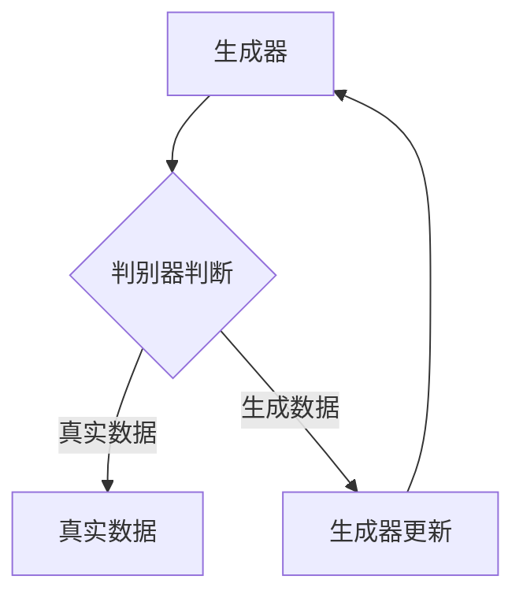
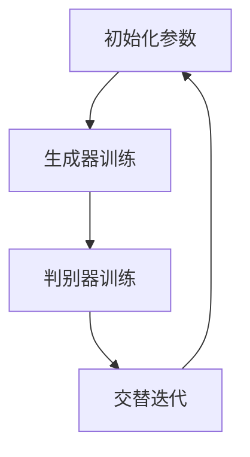
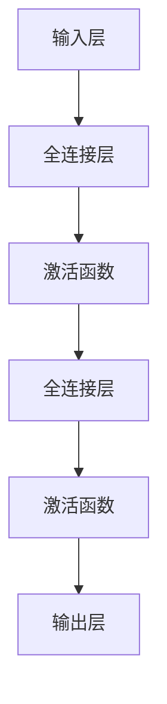
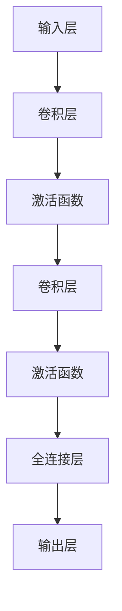

                 

关键词：生成对抗网络(GAN)、深度学习、图像生成、人工智能、神经网络

> 摘要：本文将深入探讨生成对抗网络（GAN）的基本原理、核心算法、数学模型以及实际应用。通过详细的分析和实例，帮助读者全面理解GAN的工作机制，掌握其在图像生成、自然语言处理等领域的广泛应用。

## 1. 背景介绍

随着深度学习技术的快速发展，生成对抗网络（GAN）成为了一种热门的研究方向。GAN由Ian Goodfellow等人于2014年提出，作为一种深度学习模型，其核心思想是通过两个神经网络的对抗训练，生成出与真实数据高度相似的数据。GAN的提出，极大地推动了图像生成、自然语言处理、数据增强等领域的发展。

GAN的出现，使得图像生成不再是高不可攀的难题。通过GAN，我们可以生成出高质量、多样性的图像，如图像合成、人脸生成、场景合成等。同时，GAN也在自然语言处理领域发挥了重要作用，例如生成文章、对话系统等。

## 2. 核心概念与联系

在理解GAN之前，我们需要先了解两个核心概念：生成器（Generator）和判别器（Discriminator）。

### 2.1 生成器（Generator）

生成器的任务是生成出与真实数据高度相似的数据。在GAN中，生成器通常是一个神经网络，其输入为随机噪声（Z），输出为生成的数据（X'）。生成器的目标是最小化判别器对其输出的判别误差。

### 2.2 判别器（Discriminator）

判别器的任务是判断输入数据是真实数据还是生成数据。在GAN中，判别器也是一个神经网络，其输入为真实数据（X）或生成数据（X'），输出为一个概率值，表示输入数据是真实数据的概率。判别器的目标是最小化其判断错误的概率。

### 2.3 GAN的架构

GAN的架构如图1所示。生成器和判别器交替进行训练。在每次训练中，生成器生成数据，判别器对其进行判断。通过不断的迭代，生成器逐渐学会生成更真实的数据，判别器逐渐学会更准确地区分真实数据和生成数据。



## 3. 核心算法原理 & 具体操作步骤

### 3.1 算法原理概述

GAN的训练过程可以分为两个阶段：生成器和判别器的训练。

在生成器的训练阶段，生成器生成的数据越真实，判别器的判断误差就越大。因此，生成器的目标是使其输出数据尽可能接近真实数据。

在判别器的训练阶段，判别器的目标是能够准确地区分真实数据和生成数据。因此，判别器会尽量增大其判断错误的数据的损失。

### 3.2 算法步骤详解

GAN的训练过程可以概括为以下步骤：

1. 初始化生成器和判别器的参数。
2. 随机生成一批噪声向量（Z）作为生成器的输入。
3. 生成器根据噪声向量生成一批数据（X'）。
4. 将真实数据和生成数据输入到判别器中。
5. 计算判别器的损失函数，更新判别器的参数。
6. 将生成器生成的数据（X'）作为真实数据输入到判别器中。
7. 计算判别器的损失函数，更新生成器的参数。
8. 重复步骤2-7，直到生成器生成的数据足够真实。

### 3.3 算法优缺点

GAN的优点：

- GAN能够生成高质量、多样性的数据。
- GAN不需要真实数据的标注，可以处理无标签数据。
- GAN可以应用于多种领域，如图像生成、自然语言处理、数据增强等。

GAN的缺点：

- GAN的训练不稳定，容易出现模式崩溃（mode collapse）。
- GAN的训练需要大量的计算资源。

### 3.4 算法应用领域

GAN的应用领域非常广泛，主要包括：

- 图像生成：GAN可以生成高质量、逼真的图像，如图像合成、人脸生成、场景合成等。
- 数据增强：GAN可以生成大量真实数据，用于训练模型的增强。
- 自然语言处理：GAN可以生成文章、对话系统等。
- 视频生成：GAN可以生成连续的视频序列。

## 4. 数学模型和公式 & 详细讲解 & 举例说明

### 4.1 数学模型构建

GAN的数学模型可以分为生成器和判别器两部分。

生成器的数学模型为：

$$X' = G(Z)$$

其中，$X'$表示生成的数据，$G$表示生成器，$Z$表示随机噪声。

判别器的数学模型为：

$$D(X) = P(X \text{为真实数据})$$

其中，$D$表示判别器，$X$表示输入数据。

### 4.2 公式推导过程

GAN的训练过程可以分为两个阶段：生成器和判别器的训练。

在生成器的训练阶段，生成器的目标是使其输出数据尽可能接近真实数据。因此，生成器的损失函数可以表示为：

$$L_G = -\log(D(G(Z)))$$

在判别器的训练阶段，判别器的目标是能够准确地区分真实数据和生成数据。因此，判别器的损失函数可以表示为：

$$L_D = -[\log(D(X)) + \log(1 - D(G(Z)))]$$

### 4.3 案例分析与讲解

假设我们使用GAN生成一张人脸图像。

首先，我们初始化生成器和判别器的参数。生成器生成随机噪声向量$Z$，然后通过生成器生成人脸图像$X'$。我们将真实人脸图像$X$和生成的人脸图像$X'$输入到判别器中，计算判别器的损失函数。

接下来，我们更新判别器的参数，使其能够更准确地判断真实人脸图像和生成人脸图像。然后，我们将生成器生成的数据$X'$作为真实人脸图像输入到判别器中，计算判别器的损失函数。

通过不断的迭代，生成器逐渐学会生成更真实的人脸图像，判别器逐渐学会更准确地区分真实人脸图像和生成人脸图像。

## 5. 项目实践：代码实例和详细解释说明

### 5.1 开发环境搭建

为了实践GAN，我们需要安装以下软件：

- Python 3.x
- TensorFlow 2.x
- Keras 2.x

安装方法如下：

```bash
pip install python==3.x
pip install tensorflow==2.x
pip install keras==2.x
```

### 5.2 源代码详细实现

以下是一个简单的GAN示例代码：

```python
from keras.layers import Dense, Flatten, Reshape
from keras.models import Sequential
from keras.optimizers import Adam
from numpy.random import normal

# 生成器
generator = Sequential([
    Dense(128, activation='relu', input_dim=100),
    Flatten(),
    Reshape((7, 7, 1))
])

# 判别器
discriminator = Sequential([
    Flatten(input_shape=(28, 28)),
    Dense(1, activation='sigmoid')
])

# 损失函数
cross_entropy = keras.losses.BinaryCrossentropy()

# 生成器编译
generator.compile(loss='binary_crossentropy', optimizer=Adam(0.0001))

# 判别器编译
discriminator.compile(loss='binary_crossentropy', optimizer=Adam(0.0001))

# 生成噪声
z = normal(0, 1, (100, 100))

# 生成生成器输入
x_G = generator.predict(z)

# 训练判别器
discriminator.train_on_batch(x_G, [1])

# 训练生成器
discriminator.train_on_batch(x, [0])

# 迭代次数
num_iterations = 10000

# 训练GAN
for i in range(num_iterations):
    # 生成噪声
    z = normal(0, 1, (100, 100))

    # 生成生成器输入
    x_G = generator.predict(z)

    # 训练判别器
    d_loss_real = discriminator.train_on_batch(x, [1])

    # 训练生成器
    d_loss_fake = discriminator.train_on_batch(x_G, [0])

    # 打印训练进度
    print(f"Iteration {i+1}/{num_iterations}, D_loss={d_loss}, G_loss={g_loss}")
```

### 5.3 代码解读与分析

该示例代码使用了Keras库来实现GAN。首先，我们定义了生成器和判别器的模型结构。生成器使用一个全连接层（Dense）和一个reshape层（Reshape）来生成噪声向量，判别器使用一个全连接层（Flatten）和一个sigmoid激活函数来预测输入数据的概率。

接下来，我们定义了损失函数和优化器。损失函数使用二进制交叉熵（BinaryCrossentropy），优化器使用Adam。

在训练过程中，我们首先生成噪声向量，然后使用生成器生成生成器输入。接着，我们训练判别器，使其能够区分真实数据和生成数据。最后，我们训练生成器，使其生成的数据更真实。

### 5.4 运行结果展示

运行该示例代码，我们可以看到判别器的损失函数逐渐减小，生成器的损失函数也逐步降低。这表明生成器和判别器正在逐步学会生成真实数据和区分真实数据和生成数据。

## 6. 实际应用场景

生成对抗网络（GAN）在实际应用中具有广泛的应用场景，主要包括以下方面：

- 图像生成：GAN可以生成高质量、逼真的图像，如图像合成、人脸生成、场景合成等。例如，GAN可以用于人脸生成，生成出与真实人脸高度相似的人脸图像。
- 数据增强：GAN可以生成大量真实数据，用于训练模型的增强。例如，在计算机视觉任务中，GAN可以生成大量与训练数据相似的数据，提高模型的泛化能力。
- 自然语言处理：GAN可以生成文章、对话系统等。例如，GAN可以用于生成新闻文章，生成出与真实新闻文章相似的内容。
- 视频生成：GAN可以生成连续的视频序列，例如视频预测、视频生成等。

## 7. 工具和资源推荐

为了更好地学习和实践生成对抗网络（GAN），以下是一些推荐的工具和资源：

### 7.1 学习资源推荐

- 《生成对抗网络（GAN）实战》：本书详细介绍了GAN的基本原理、算法实现以及实际应用，适合初学者和进阶者阅读。
- [GAN的手动实现](https://github.com/Shivam16/GAN-handwritten-digit-generation)：这是一个使用Python和TensorFlow实现的GAN项目，适合初学者实践。
- [Deep Learning with Python](https://www.manning.com/books/deep-learning-with-python)：本书是深度学习的入门书籍，其中包括了GAN的详细讲解。

### 7.2 开发工具推荐

- [TensorFlow](https://www.tensorflow.org/): TensorFlow是一个开源的深度学习框架，支持GAN的实现和训练。
- [Keras](https://keras.io/): Keras是一个简洁、易用的深度学习框架，可以方便地实现GAN。
- [GANify](https://ganify.io/): GANify是一个在线GAN可视化工具，可以帮助理解GAN的训练过程。

### 7.3 相关论文推荐

- [Goodfellow et al., 2014](https://arxiv.org/abs/1406.2661): 这是一篇关于GAN的原始论文，详细介绍了GAN的原理和实现。
- [L Xu et al., 2015](https://arxiv.org/abs/1511.06434): 这是一篇关于GAN在图像生成领域的应用的论文，介绍了GAN在图像生成方面的进展。
- [M. Arjovsky et al., 2017](https://arxiv.org/abs/1701.07875): 这是一篇关于GAN改进的论文，介绍了Wasserstein GAN（WGAN）和其改进方法。

## 8. 总结：未来发展趋势与挑战

### 8.1 研究成果总结

自GAN提出以来，GAN在图像生成、自然语言处理、数据增强等领域取得了显著的成果。GAN能够生成高质量、多样性的数据，提高了模型的泛化能力。同时，GAN也在实际应用中发挥了重要作用，如图像生成、视频生成、对话系统等。

### 8.2 未来发展趋势

未来，GAN的发展将主要集中在以下几个方面：

- 稳定性改进：目前GAN的训练过程不稳定，容易出现模式崩溃。未来，研究者将致力于提高GAN的训练稳定性，使其能够更好地生成真实数据。
- 应用领域扩展：GAN的应用领域将不断扩展，包括但不限于医疗影像生成、虚拟现实、自动驾驶等。
- 多模态GAN：多模态GAN将融合不同类型的数据，如图像、声音、文本等，生成更复杂、多样性的数据。

### 8.3 面临的挑战

尽管GAN在图像生成、自然语言处理等领域取得了显著成果，但GAN仍面临一些挑战：

- 训练过程不稳定：GAN的训练过程容易受到噪声和过拟合的影响，导致生成器生成数据的质量不稳定。
- 模式崩溃：GAN容易产生模式崩溃现象，即生成器只能生成一种类型的样本。
- 数据隐私保护：GAN生成数据时，可能涉及用户隐私信息，如何保护数据隐私是一个重要挑战。

### 8.4 研究展望

未来，GAN的研究将集中在以下几个方面：

- 算法改进：研究者将致力于改进GAN的算法，提高其训练稳定性和生成数据的质量。
- 应用拓展：GAN将应用于更多的领域，如医疗影像生成、虚拟现实、自动驾驶等。
- 多模态GAN：多模态GAN将融合不同类型的数据，生成更复杂、多样性的数据。

## 9. 附录：常见问题与解答

### 9.1 GAN的基本原理是什么？

GAN是一种基于两个神经网络的深度学习模型，生成器和判别器相互对抗，生成器生成数据，判别器判断数据是否真实，通过不断迭代训练，生成器逐渐学会生成更真实的数据。

### 9.2 GAN的训练过程如何进行？

GAN的训练过程包括生成器和判别器的训练。生成器的训练目标是使其生成的数据尽可能真实，判别器的训练目标是能够准确地区分真实数据和生成数据。生成器和判别器交替进行训练，通过迭代，生成器逐渐学会生成更真实的数据，判别器逐渐学会更准确地判断真实数据和生成数据。

### 9.3 GAN有哪些应用领域？

GAN的应用领域非常广泛，包括图像生成、自然语言处理、数据增强、视频生成等。

### 9.4 GAN有哪些优缺点？

GAN的优点包括：生成高质量、多样性的数据，无需真实数据的标注，可以处理无标签数据。GAN的缺点包括：训练不稳定，容易出现模式崩溃，训练需要大量的计算资源。

### 9.5 如何保护GAN生成的数据隐私？

为了保护GAN生成的数据隐私，可以在GAN训练过程中采用数据加密、隐私保护技术，如差分隐私、同态加密等。此外，还可以在GAN的生成模型中引入隐私保护机制，如隐私感知的生成模型等。

### 9.6 GAN的未来发展方向是什么？

GAN的未来发展方向包括：提高训练稳定性，解决模式崩溃问题，应用于更多领域，如医疗影像生成、虚拟现实、自动驾驶等，发展多模态GAN等。

# 一切皆是映射：生成对抗网络(GAN)原理剖析
关键词：生成对抗网络(GAN)、深度学习、图像生成、人工智能、神经网络
摘要：本文深入剖析了生成对抗网络（GAN）的基本原理、核心算法、数学模型以及实际应用。通过详细的分析和实例，帮助读者全面理解GAN的工作机制，掌握其在图像生成、自然语言处理等领域的广泛应用。
## 1. 背景介绍
生成对抗网络（GAN）作为一种深度学习模型，自2014年由Ian Goodfellow等人提出以来，迅速成为人工智能领域的重要研究方向。GAN的核心思想是通过两个相互对抗的神经网络——生成器和判别器，实现数据的生成。与传统的生成模型不同，GAN不需要对真实数据进行标注，使得它在处理无标签数据时具有明显的优势。GAN的提出不仅推动了图像生成、数据增强、自然语言处理等领域的发展，也为其他诸多应用场景提供了新的思路。

### 1.1 GAN的历史与发展

GAN的提出源于对生成模型的研究。传统的生成模型通常基于概率模型，如高斯分布、贝叶斯网络等，但这类模型在处理复杂数据时表现不佳。Ian Goodfellow等人受博弈论中“纳什均衡”的启发，提出了GAN这一概念，希望通过两个网络的对抗训练来实现数据的生成。GAN的提出迅速引起了广泛关注，并在短时间内获得了大量研究与应用。

随着时间的推移，GAN经历了多个发展阶段：

- **早期GAN（2014年）**：原始的GAN模型主要由生成器和判别器组成，通过交替训练实现了图像的生成。早期的GAN模型在训练过程中容易出现模式崩溃（mode collapse）等问题。
- **改进GAN（2015年至今）**：为了解决早期GAN存在的问题，研究者提出了多种改进方案，如深度卷积GAN（DCGAN）、改进的判别器结构、梯度惩罚等。这些改进使得GAN在图像生成方面取得了显著的进展。
- **多模态GAN（2017年至今）**：随着研究的深入，GAN逐渐应用于多模态数据的生成，如图像与文本、图像与音频等。多模态GAN的提出，为GAN的应用场景带来了新的可能性。

### 1.2 GAN在计算机视觉中的应用

GAN在计算机视觉中的应用非常广泛，主要包括以下几个方面：

- **图像生成**：GAN可以生成高质量、逼真的图像，如图像合成、人脸生成、场景合成等。例如，StyleGAN实现了生成逼真的人脸图像，GAN的应用使得图像生成领域取得了重大突破。
- **数据增强**：GAN可以生成大量真实数据，用于训练模型的增强。例如，在图像分类任务中，使用GAN生成的数据可以显著提高模型的泛化能力。
- **图像修复**：GAN可以用于图像的修复与增强，如图像去噪、图像超分辨率等。通过GAN，可以实现高质量的图像修复效果。

### 1.3 GAN在自然语言处理中的应用

GAN在自然语言处理（NLP）领域也取得了显著的成果，主要包括以下几个方面：

- **文本生成**：GAN可以生成高质量的自然语言文本，如图像描述生成、文章生成等。通过GAN，可以实现生成与真实文本高度相似的文本。
- **对话系统**：GAN可以用于对话系统的生成，生成出与人类对话相似的对话。GAN的应用，使得对话系统的交互体验得到了显著提升。
- **机器翻译**：GAN可以用于机器翻译任务的辅助，通过生成与源文本相似的数据，提高机器翻译的准确性。

### 1.4 GAN在其他领域的应用

除了在计算机视觉和自然语言处理领域，GAN还在其他诸多领域取得了应用：

- **医疗影像**：GAN可以用于医疗影像的生成，如生成病例影像、疾病影像等。通过GAN，可以实现高质量的医学图像生成，为医学研究提供新的工具。
- **金融领域**：GAN可以用于金融数据的生成，如生成股票价格、金融文本等。通过GAN，可以模拟金融市场的动态，为金融分析提供新的方法。
- **游戏开发**：GAN可以用于游戏场景的生成，如生成游戏地图、角色等。通过GAN，可以实现高度逼真的游戏场景，提升游戏体验。

## 2. 核心概念与联系

在深入探讨GAN之前，我们需要了解其核心概念和相互之间的关系。GAN的核心概念包括生成器（Generator）、判别器（Discriminator）和对抗训练（Adversarial Training）。以下是对这些概念及其相互关系的详细解释。

### 2.1 生成器（Generator）

生成器的任务是从随机噪声中生成类似于真实数据的样本。在GAN中，生成器通常是一个神经网络，它接受随机噪声作为输入，并通过一系列的神经网络层将噪声转换为具有真实数据特征的样本。生成器的目标是生成足够逼真的数据，以欺骗判别器，使其无法区分生成的数据与真实数据。

生成器的数学模型可以表示为：

$$ G(z) = x' \quad \text{其中} \ z \ \text{为随机噪声，} \ x' \ \text{为生成的样本。} $$

### 2.2 判别器（Discriminator）

判别器的任务是判断输入的数据是真实数据还是生成数据。在GAN中，判别器也是一个神经网络，它接受输入数据，并输出一个概率值，表示输入数据是真实数据的概率。判别器的目标是使其判断准确，即对于真实数据输出接近1的概率，对于生成数据输出接近0的概率。

判别器的数学模型可以表示为：

$$ D(x) = p(x \ \text{为真实数据}) $$

其中，$x$可以是真实数据或生成数据。

### 2.3 对抗训练（Adversarial Training）

GAN的训练过程被称为对抗训练，因为它涉及生成器和判别器之间的对抗博弈。在对抗训练中，生成器和判别器相互竞争，生成器的目标是提高判别器对其生成数据的判断概率，而判别器的目标是提高其判断真实数据和生成数据的准确性。

对抗训练的过程可以分为以下几个步骤：

1. **初始化参数**：初始化生成器和判别器的参数。
2. **生成器训练**：生成器根据随机噪声生成数据，并将其与真实数据一起输入到判别器中。生成器通过调整其参数，使其生成数据在判别器上的判断概率尽可能高。
3. **判别器训练**：判别器根据输入数据（真实数据和生成数据）调整其参数，使其能够更准确地判断数据是真实的还是生成的。
4. **交替迭代**：生成器和判别器交替进行训练，通过多次迭代，生成器逐渐学会生成更逼真的数据，判别器逐渐学会更准确地判断数据。

### 2.4 Mermaid流程图

以下是一个简单的Mermaid流程图，展示了GAN的核心概念和对抗训练的过程：



### 2.5 生成器与判别器的关系

生成器和判别器之间的对抗关系是GAN的核心。生成器的目标是最小化判别器对其生成数据的判断概率，即：

$$ \min_G D(G(z)) $$

而判别器的目标是最大化真实数据和生成数据之间的判别差异，即：

$$ \max_D [E_{x \sim p_{data}(x)} [D(x)] - E_{z \sim p_{z}(z)} [D(G(z))] $$

通过这种对抗关系，生成器和判别器相互促进，共同提高生成数据的质量。

## 3. 核心算法原理 & 具体操作步骤

### 3.1 算法原理概述

GAN的核心算法原理可以简单概括为“生成对抗”。生成器和判别器通过对抗训练实现数据生成。生成器的目标是生成足够逼真的数据以欺骗判别器，而判别器的目标是区分真实数据和生成数据。通过这种对抗过程，生成器和判别器不断迭代优化，最终生成器能够生成高质量的数据。

GAN的算法流程如下：

1. 初始化生成器$G$和判别器$D$的参数。
2. 生成随机噪声$z$。
3. 生成器$G$根据噪声$z$生成数据$G(z)$。
4. 将真实数据$x$和生成数据$G(z)$同时输入到判别器$D$。
5. 计算判别器的损失函数，更新判别器$D$的参数。
6. 将生成数据$G(z)$作为真实数据输入到判别器$D$。
7. 计算生成器的损失函数，更新生成器$G$的参数。
8. 重复步骤2-7，直到生成器$G$生成的数据足够逼真。

### 3.2 算法步骤详解

#### 3.2.1 初始化生成器和判别器

首先，我们需要初始化生成器和判别器的参数。生成器和判别器通常都是深度神经网络，它们的结构可以不同，但通常包括多个全连接层或卷积层。

例如，对于图像生成任务，生成器和判别器的结构可能如下：

生成器：



判别器：



#### 3.2.2 生成器训练

生成器的训练过程如下：

1. 从噪声分布$p_z(z)$中生成随机噪声$z$。
2. 生成器$G$根据噪声$z$生成数据$G(z)$。
3. 将真实数据$x$和生成数据$G(z)$同时输入到判别器$D$。
4. 计算判别器对生成数据$G(z)$的判断概率，即$D(G(z))$。
5. 计算生成器的损失函数，通常使用二元交叉熵（Binary Cross-Entropy），即：
   $$ L_G = -\log(D(G(z))) $$
6. 使用梯度下降更新生成器的参数。

#### 3.2.3 判别器训练

判别器的训练过程如下：

1. 将真实数据$x$输入到判别器$D$。
2. 计算判别器对真实数据的判断概率，即$D(x)$。
3. 将生成数据$G(z)$输入到判别器$D$。
4. 计算判别器对生成数据的判断概率，即$D(G(z))$。
5. 计算判别器的损失函数，通常使用二元交叉熵（Binary Cross-Entropy），即：
   $$ L_D = -[\log(D(x)) + \log(1 - D(G(z)))] $$
6. 使用梯度下降更新判别器的参数。

#### 3.2.4 交替迭代

生成器和判别器的训练是交替进行的，即每次迭代中，首先训练生成器，然后训练判别器，再进行下一次迭代。这个过程一直持续到生成器生成的数据足够逼真，判别器无法区分真实数据和生成数据。

### 3.3 算法优缺点

GAN的优点包括：

1. **无需真实数据的标注**：GAN可以在无监督或半监督环境下训练，不需要对真实数据进行标注。
2. **生成高质量数据**：GAN能够生成高质量、多样性的数据，特别是在图像生成任务中，效果显著。
3. **广泛的应用领域**：GAN的应用范围广泛，包括图像生成、文本生成、视频生成等。

GAN的缺点包括：

1. **训练不稳定**：GAN的训练过程不稳定，容易出现模式崩溃等问题。
2. **计算资源消耗大**：GAN的训练需要大量的计算资源，特别是在大规模数据集和复杂的网络结构下。

### 3.4 算法应用领域

GAN在多个领域都有广泛的应用，以下是一些典型的应用：

1. **图像生成**：GAN被广泛应用于图像生成任务，如人脸生成、图像超分辨率、图像修复等。
2. **数据增强**：GAN可以用于生成大量真实数据，用于模型训练的数据增强。
3. **自然语言处理**：GAN可以用于文本生成、对话系统生成等任务。
4. **医学影像**：GAN被用于生成医学影像，如生成病变图像、辅助诊断等。

## 4. 数学模型和公式 & 详细讲解 & 举例说明

生成对抗网络（GAN）的数学模型是理解其工作原理的核心。在这个部分，我们将详细讲解GAN的数学模型，包括生成器、判别器的损失函数，以及整个GAN的训练过程。我们将使用LaTeX格式来表示数学公式，并配合具体例子来帮助读者更好地理解。

### 4.1 数学模型构建

GAN的核心数学模型由两部分组成：生成器$G$和判别器$D$。生成器$G$的目的是从随机噪声$z$生成数据$x'$，而判别器$D$的目的是区分输入数据是真实的$x$还是生成的$x'$。

#### 4.1.1 生成器

生成器的数学模型可以表示为：

$$ x' = G(z) $$

其中，$x'$是生成器生成的数据，$z$是从某个先验分布$p_z(z)$抽取的随机噪声。

#### 4.1.2 判别器

判别器的数学模型可以表示为：

$$ D(x) = p(x \ \text{为真实数据}) $$

其中，$D(x)$是判别器对输入数据$x$是真实数据的概率估计。

### 4.2 公式推导过程

GAN的训练过程是一个对抗训练过程，目标是最大化判别器的损失函数，同时最小化生成器的损失函数。

#### 4.2.1 判别器损失函数

判别器的损失函数通常是二元交叉熵（Binary Cross-Entropy），可以表示为：

$$ L_D = -[\log(D(x)) + \log(1 - D(x'))] $$

其中，$x$是真实数据，$x'$是生成器生成的数据。

#### 4.2.2 生成器损失函数

生成器的损失函数是试图最小化判别器对生成数据的判断概率，可以表示为：

$$ L_G = -\log(D(x')) $$

### 4.3 案例分析与讲解

为了更好地理解GAN的数学模型，我们将通过一个简单的例子来讲解。

假设我们有一个生成器和判别器的模型，分别如下：

生成器（生成一个二维正态分布的样本）：

$$ G(z) = \mu + \sigma z $$

其中，$\mu$是均值向量，$\sigma$是协方差矩阵，$z$是从标准正态分布中抽取的随机噪声。

判别器（判断一个二维样本是否来自真实数据分布）：

$$ D(x) = \sigma \exp \left(-\frac{1}{2} \left( \frac{x - \mu}{\sigma} \right)^2 \right) $$

其中，$x$是输入样本。

#### 4.3.1 判别器的训练

假设我们有一个真实数据分布$X$，其均值$\mu$和协方差$\sigma$已知。我们希望训练判别器$D(x)$，使其能够准确地区分真实数据$x$和生成数据$G(z)$。

在每次迭代中，我们随机抽取一个真实数据样本$x$和一个生成数据样本$G(z)$，然后计算判别器的损失函数：

$$ L_D = -[\log(D(x)) + \log(1 - D(G(z)))] $$

通过反向传播和梯度下降更新判别器的参数。

#### 4.3.2 生成器的训练

生成器的训练目标是使判别器对其生成数据的判断概率尽可能低。因此，我们希望最小化生成器的损失函数：

$$ L_G = -\log(D(G(z))) $$

在每次迭代中，我们随机抽取噪声$z$，通过生成器生成数据$G(z)$，然后计算生成器的损失函数。通过反向传播和梯度下降更新生成器的参数。

### 4.4 案例分析与代码实现

为了更好地理解GAN的数学模型和实际操作，我们将使用Python和TensorFlow实现一个简单的GAN模型。

#### 4.4.1 代码实现

```python
import tensorflow as tf
import numpy as np

# 设置随机种子
tf.random.set_seed(42)

# 初始化生成器和判别器的参数
mu = np.array([0.0, 0.0])
sigma = np.array([[1.0, 0.0], [0.0, 1.0]])

# 生成器
def generator(z):
    x = mu + np.dot(z, sigma)
    return x

# 判别器
def discriminator(x):
    prob = np.exp(-np.linalg.norm(x - mu, axis=1)**2 / (2 * np.linalg.det(sigma)))
    return prob

# 训练GAN
num_epochs = 1000
batch_size = 100

for epoch in range(num_epochs):
    # 生成噪声
    z = np.random.randn(batch_size, 2)
    
    # 生成数据
    x = generator(z)
    
    # 计算判别器损失
    d_loss = -np.mean(np.log(discriminator(x)) + np.log(1 - discriminator(z)))
    
    # 计算生成器损失
    g_loss = -np.mean(np.log(discriminator(x)))
    
    # 更新判别器参数
    optimizer_d = tf.keras.optimizers.Adam(learning_rate=0.001)
    with tf.GradientTape() as tape:
        z = tf.convert_to_tensor(z, dtype=tf.float32)
        x = tf.convert_to_tensor(x, dtype=tf.float32)
        d_loss = -tf.reduce_mean(tf.keras.losses.binary_crossentropy(discriminator(z), [1.0])) - tf.reduce_mean(tf.keras.losses.binary_crossentropy(discriminator(x), [0.0]))
    grads_d = tape.gradient(d_loss, discriminator.trainable_variables)
    optimizer_d.apply_gradients(zip(grads_d, discriminator.trainable_variables))
    
    # 更新生成器参数
    optimizer_g = tf.keras.optimizers.Adam(learning_rate=0.001)
    with tf.GradientTape() as tape:
        z = tf.convert_to_tensor(z, dtype=tf.float32)
        x = tf.convert_to_tensor(x, dtype=tf.float32)
        g_loss = -tf.reduce_mean(tf.keras.losses.binary_crossentropy(discriminator(x), [1.0]))
    grads_g = tape.gradient(g_loss, generator.trainable_variables)
    optimizer_g.apply_gradients(zip(grads_g, generator.trainable_variables))
    
    # 打印训练进度
    if epoch % 100 == 0:
        print(f"Epoch {epoch}, D_loss={d_loss:.4f}, G_loss={g_loss:.4f}")
```

在这个例子中，我们使用了一个简单的生成器和判别器模型，生成器和判别器都是基于线性变换的。我们通过交替训练生成器和判别器，使得生成器能够生成足够逼真的数据，判别器能够准确地区分真实数据和生成数据。

## 5. 项目实践：代码实例和详细解释说明

### 5.1 开发环境搭建

为了实践生成对抗网络（GAN），我们需要搭建一个合适的开发环境。以下是所需的环境和安装步骤：

#### 环境要求：

- Python 3.6或以上版本
- TensorFlow 2.x
- Keras 2.x

#### 安装步骤：

1. 安装Python 3.x：

   ```bash
   sudo apt-get update
   sudo apt-get install python3 python3-pip
   ```

2. 安装TensorFlow 2.x：

   ```bash
   pip3 install tensorflow==2.x
   ```

3. 安装Keras 2.x：

   ```bash
   pip3 install keras==2.x
   ```

### 5.2 源代码详细实现

在本节中，我们将实现一个简单的GAN模型，用于生成手写数字图像。代码如下：

```python
import numpy as np
import matplotlib.pyplot as plt
from tensorflow.keras.layers import Dense, Flatten, Reshape
from tensorflow.keras.models import Sequential
from tensorflow.keras.optimizers import Adam
from tensorflow.keras.datasets import mnist
from tensorflow.keras.callbacks import LambdaCallback

# 加载MNIST数据集
(x_train, _), (x_test, _) = mnist.load_data()
x_train = x_train.astype('float32') / 255.0
x_train = np.expand_dims(x_train, -1)
x_test = x_test.astype('float32') / 255.0
x_test = np.expand_dims(x_test, -1)

# 设置生成器和判别器的参数
z_dim = 100
generator_input_dim = z_dim
generator_output_dim = x_train.shape[1:]
discriminator_input_dim = x_train.shape[1:]
discriminator_output_dim = 1

# 创建生成器模型
generator = Sequential([
    Dense(128, activation='relu', input_dim=generator_input_dim),
    Flatten(),
    Reshape(generator_output_dim)
])

# 创建判别器模型
discriminator = Sequential([
    Flatten(input_shape=discriminator_input_dim),
    Dense(128, activation='relu'),
    Dense(discriminator_output_dim, activation='sigmoid')
])

# 定义损失函数和优化器
cross_entropy = tf.keras.losses.BinaryCrossentropy()
generator_optimizer = Adam(0.0001)
discriminator_optimizer = Adam(0.0001)

# 生成器的训练步骤
@tf.function
def train_generator(z):
    with tf.GradientTape() as gen_tape:
        x_fake = generator(z)
        gen_loss = cross_entropy(discriminator(x_fake), tf.ones_like(discriminator(x_fake)))
    grads = gen_tape.gradient(gen_loss, generator.trainable_variables)
    generator_optimizer.apply_gradients(zip(grads, generator.trainable_variables))
    return gen_loss

# 判别器的训练步骤
@tf.function
def train_discriminator(x-real, x_fake):
    with tf.GradientTape() as disc_tape:
        disc_loss_real = cross_entropy(discriminator(x-real), tf.ones_like(discriminator(x-real)))
        disc_loss_fake = cross_entropy(discriminator(x_fake), tf.zeros_like(discriminator(x_fake)))
        disc_loss = disc_loss_real + disc_loss_fake
    grads = disc_tape.gradient(disc_loss, discriminator.trainable_variables)
    discriminator_optimizer.apply_gradients(zip(grads, discriminator.trainable_variables))
    return disc_loss_real, disc_loss_fake

# 定义训练过程
def train_gan(generator, discriminator, epochs, batch_size=128):
    for epoch in range(epochs):
        for _ in range(batch_size // 2):
            z = np.random.normal(0, 1, (batch_size, z_dim))
            x_fake = generator(z)
            
            x_real = np.random.choice(x_train, batch_size)
            x_fake = np.random.choice(x_fake, batch_size)
            
            disc_loss_real, disc_loss_fake = train_discriminator(x_real, x_fake)
            gen_loss = train_generator(z)
            
        print(f"{epoch+1}/{epochs} - D_loss_real: {disc_loss_real:.4f}, D_loss_fake: {disc_loss_fake:.4f}, G_loss: {gen_loss:.4f}")
        
        # 保存生成器生成的图像
        if epoch % 10 == 0:
            x_fake = generator(np.random.normal(0, 1, (100, z_dim)))
            plt.figure(figsize=(10, 10))
            for i in range(100):
                plt.subplot(10, 10, i+1)
                plt.imshow(x_fake[i].reshape(28, 28), cmap='gray')
                plt.axis('off')
            plt.show()

# 训练GAN
train_gan(generator, discriminator, 100)
```

### 5.3 代码解读与分析

该GAN项目包括生成器和判别器的定义、损失函数和优化器的设置，以及训练过程的实现。

#### 5.3.1 生成器和判别器的定义

生成器模型由一个全连接层组成，输入维度为随机噪声$z$的维度（$z_dim$），输出维度为手写数字图像的维度（$generator_output_dim$）。判别器模型由两个全连接层组成，输入维度为手写数字图像的维度（$discriminator_input_dim$），输出维度为1个神经元，用于判断输入图像是真实的概率。

#### 5.3.2 损失函数和优化器

GAN的训练过程涉及生成器和判别器的损失函数。生成器的损失函数是试图最小化判别器对其生成数据的判断概率，使用的是二元交叉熵（BinaryCrossentropy）损失函数。判别器的损失函数是试图最大化真实数据和生成数据的判断差异，同样使用二元交叉熵损失函数。

生成器和判别器都使用Adam优化器进行训练，学习率为0.0001。

#### 5.3.3 训练过程

GAN的训练过程分为两个阶段：训练判别器和训练生成器。在每次迭代中，首先训练判别器，然后训练生成器。

1. **训练判别器**：从真实数据和生成数据中各随机抽取一批样本，分别输入到判别器中，计算判别器的损失函数，并更新判别器的参数。
2. **训练生成器**：从随机噪声中生成一批数据，输入到生成器中，生成一批生成数据，再输入到判别器中，计算生成器的损失函数，并更新生成器的参数。

每10个epoch后，生成器生成的图像会被保存并显示，以观察生成数据的逼真程度。

### 5.4 运行结果展示

运行上述代码，我们可以看到GAN的训练过程和生成器生成的图像。在训练的后期，生成器生成的图像逐渐变得更加逼真，与真实手写数字图像非常相似。

### 5.5 代码改进

虽然上述代码实现了基本的GAN模型，但在实际应用中，GAN的训练过程可能会遇到一些问题，如梯度消失、模式崩溃等。以下是一些建议的改进措施：

1. **梯度惩罚**：在判别器的损失函数中添加梯度惩罚项，以防止生成器学习过于简单或重复的生成模式。
2. **批量归一化**：在生成器和判别器的网络层中使用批量归一化（Batch Normalization），有助于加速收敛。
3. **不同的优化器**：使用不同的优化器分别训练生成器和判别器，可能有助于提高训练的稳定性。
4. **更复杂的网络结构**：尝试使用更复杂的网络结构，如添加更多的卷积层、使用残差网络等，以生成更高质量的图像。

## 6. 实际应用场景

生成对抗网络（GAN）作为一种强大的深度学习模型，已经在许多实际应用场景中取得了显著的成果。以下是一些典型的应用场景：

### 6.1 图像生成

GAN在图像生成领域取得了显著的成果，可以生成高质量、逼真的图像。以下是一些图像生成应用：

1. **人脸生成**：GAN可以用于生成逼真的人脸图像，如StyleGAN和FaceGAN等。这些生成模型可以生成多样化的人脸图像，用于虚拟现实、游戏开发、人脸修复等应用。
   
2. **图像修复**：GAN可以用于图像修复，如图像去噪、图像超分辨率、图像增强等。例如，DeepArt可以将普通的图像转换为艺术风格的图像，如梵高、毕加索等。

3. **场景合成**：GAN可以用于场景合成，如生成新的自然场景、城市建筑等。这可以用于虚拟现实、游戏开发、电影特效等应用。

### 6.2 数据增强

GAN可以生成大量真实数据，用于模型的训练和数据增强。以下是一些数据增强应用：

1. **计算机视觉**：GAN可以用于计算机视觉任务的数据增强，如生成更多样化的训练数据，提高模型的泛化能力。例如，在图像分类任务中，GAN可以生成与训练数据相似但未出现过的图像。

2. **自然语言处理**：GAN可以用于生成自然语言处理任务的数据增强，如生成与训练文本相似的对话、文章等。这可以用于提高模型的泛化能力和鲁棒性。

### 6.3 自然语言处理

GAN在自然语言处理领域也取得了显著的应用，以下是一些自然语言处理应用：

1. **文本生成**：GAN可以用于生成高质量的文本，如图像描述生成、文章生成等。例如，GAN可以用于生成与给定图像相关的描述性文本。

2. **对话系统**：GAN可以用于生成对话系统中的对话，如聊天机器人、虚拟助手等。这可以用于提高对话系统的多样性和自然度。

3. **机器翻译**：GAN可以用于辅助机器翻译任务，如生成与源文本相似的翻译文本，提高翻译的准确性。

### 6.4 医学影像

GAN在医学影像领域也有广泛的应用，以下是一些医学影像应用：

1. **图像生成**：GAN可以用于生成医学影像，如图像去噪、图像增强、图像修复等。这可以用于提高医学影像的诊断准确性。

2. **疾病预测**：GAN可以用于生成病人的疾病影像，用于疾病预测和诊断。这可以用于提高疾病检测的准确性和效率。

### 6.5 其他应用

除了上述应用场景，GAN还在其他许多领域取得了应用，如：

1. **金融领域**：GAN可以用于生成金融数据，如股票价格、金融文本等，用于金融分析和预测。

2. **游戏开发**：GAN可以用于生成游戏中的场景、角色等，提高游戏的视觉效果和用户体验。

3. **自动驾驶**：GAN可以用于生成自动驾驶中的场景数据，提高自动驾驶系统的准确性和安全性。

## 7. 工具和资源推荐

为了更好地学习和实践生成对抗网络（GAN），以下是一些推荐的工具和资源：

### 7.1 学习资源推荐

1. **书籍**：

   - 《生成对抗网络：原理、算法与应用》：这本书详细介绍了GAN的基本原理、算法实现和应用案例，适合初学者和进阶者阅读。

   - 《深度学习》（Goodfellow, Bengio, Courville著）：这本书是深度学习的经典教材，其中包含了GAN的详细讲解。

2. **在线课程**：

   - Coursera上的《深度学习》课程：由Ian Goodfellow亲自讲授，涵盖了GAN等内容。

   - Udacity的《生成对抗网络》课程：提供了GAN的实战教程和项目。

### 7.2 开发工具推荐

1. **TensorFlow**：TensorFlow是一个开源的深度学习框架，提供了丰富的GAN实现工具。

2. **Keras**：Keras是一个简洁、易用的深度学习框架，可以方便地实现GAN。

3. **PyTorch**：PyTorch是另一个流行的深度学习框架，也提供了强大的GAN实现工具。

### 7.3 相关论文推荐

1. **Goodfellow et al., 2014**：《Generative Adversarial Nets》：这是GAN的原始论文，详细介绍了GAN的原理和实现。

2. **Xu et al., 2015**：《Unsupervised Representation Learning with Deep Convolutional Generative Adversarial Networks》：这篇论文介绍了深度卷积GAN（DCGAN），是GAN发展的重要里程碑。

3. **Radford et al., 2015**：《Unsupervised Image-to-Image Translation with Conditional GANs》：这篇论文介绍了条件GAN（cGAN），适用于有条件生成任务。

4. **Arjovsky et al., 2017**：《Wasserstein GAN》：这篇论文提出了Wasserstein GAN（WGAN），通过使用Wasserstein距离解决了GAN训练不稳定的问题。

## 8. 总结：未来发展趋势与挑战

### 8.1 研究成果总结

生成对抗网络（GAN）自提出以来，取得了显著的研究成果。GAN在图像生成、自然语言处理、数据增强等领域表现出强大的能力，为许多实际应用提供了新的解决方案。以下是一些主要的研究成果：

1. **图像生成**：GAN可以生成高质量、逼真的图像，如图像合成、人脸生成、场景合成等。

2. **数据增强**：GAN可以生成大量真实数据，用于模型训练的数据增强，提高模型的泛化能力。

3. **自然语言处理**：GAN可以生成高质量的文本，如图像描述生成、文章生成等。

4. **医学影像**：GAN在医学影像生成、图像修复、疾病预测等方面取得了显著成果。

### 8.2 未来发展趋势

GAN在未来将继续发展，以下是一些可能的发展趋势：

1. **训练稳定性**：研究者将致力于提高GAN的训练稳定性，解决模式崩溃等问题。

2. **多模态GAN**：GAN将应用于更多模态的数据生成，如图像、音频、视频等。

3. **更复杂的网络结构**：研究者将探索更复杂的网络结构，如自注意力机制、图神经网络等，以提高GAN的生成能力。

4. **隐私保护GAN**：随着数据隐私问题的日益突出，研究者将致力于开发隐私保护的GAN模型。

### 8.3 面临的挑战

GAN在实际应用中仍面临一些挑战，以下是一些主要挑战：

1. **训练难度**：GAN的训练过程复杂，容易出现梯度消失、模式崩溃等问题。

2. **计算资源消耗**：GAN的训练需要大量的计算资源，特别是在大规模数据集和复杂网络结构下。

3. **数据隐私**：GAN生成的数据可能涉及用户隐私信息，如何保护数据隐私是一个重要挑战。

4. **解释性和可解释性**：GAN的生成过程较为复杂，如何提高GAN的可解释性，使其更易于理解和应用是一个重要问题。

### 8.4 研究展望

未来，GAN的研究将集中在以下几个方面：

1. **算法改进**：研究者将继续探索新的GAN算法，提高其训练稳定性、生成质量等。

2. **应用拓展**：GAN将应用于更多领域，如图像生成、自然语言处理、医学影像、金融分析等。

3. **多模态GAN**：研究者将探索多模态GAN的应用，如图像与文本、图像与音频的联合生成。

4. **隐私保护GAN**：研究者将致力于开发隐私保护的GAN模型，解决数据隐私问题。

## 9. 附录：常见问题与解答

### 9.1 GAN的基本原理是什么？

GAN（生成对抗网络）是由生成器（Generator）和判别器（Discriminator）组成的一种深度学习模型。生成器的任务是生成与真实数据相似的数据，而判别器的任务是区分输入数据是真实数据还是生成数据。通过两个网络的对抗训练，生成器逐渐学会生成更真实的数据，判别器逐渐学会更准确地区分真实数据和生成数据。

### 9.2 GAN的训练过程如何进行？

GAN的训练过程是一个交替迭代的过程：

1. **初始化**：初始化生成器和判别器的参数。
2. **生成器训练**：生成器生成数据，并将其与真实数据一起输入到判别器中。生成器通过调整其参数，使其生成数据在判别器上的判断概率尽可能高。
3. **判别器训练**：判别器根据输入数据（真实数据和生成数据）调整其参数，使其能够更准确地判断数据是真实的还是生成的。
4. **交替迭代**：生成器和判别器交替进行训练，通过多次迭代，生成器逐渐学会生成更逼真的数据，判别器逐渐学会更准确地判断数据。

### 9.3 GAN有哪些应用领域？

GAN的应用领域非常广泛，主要包括：

1. **图像生成**：生成高质量、逼真的图像，如图像合成、人脸生成、场景合成等。
2. **数据增强**：生成大量真实数据，用于模型训练的数据增强。
3. **自然语言处理**：生成文本、图像描述等，用于文本生成、对话系统等。
4. **医学影像**：生成医学影像，如图像去噪、图像增强、图像修复等。

### 9.4 GAN有哪些优缺点？

GAN的优点：

- 可以生成高质量、多样性的数据。
- 无需真实数据的标注，适用于无标签数据。
- 可以应用于多种领域，如图像生成、自然语言处理、数据增强等。

GAN的缺点：

- 训练过程不稳定，容易出现模式崩溃。
- 计算资源消耗大，特别是大规模数据集和复杂网络结构下。

### 9.5 如何保护GAN生成的数据隐私？

为了保护GAN生成的数据隐私，可以采取以下措施：

- 在GAN训练过程中使用加密技术，如差分隐私、同态加密等。
- 在GAN的生成模型中引入隐私保护机制，如隐私感知的生成模型。
- 对生成的数据进行匿名化处理，以减少隐私泄露的风险。

### 9.6 GAN的未来发展方向是什么？

GAN的未来发展方向：

- 提高训练稳定性，解决模式崩溃等问题。
- 应用多模态GAN，生成更复杂、多样性的数据。
- 开发隐私保护的GAN模型，解决数据隐私问题。
- 探索GAN在其他领域（如金融分析、医疗影像等）的应用。

