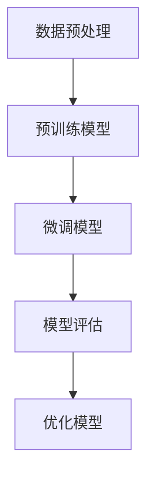

                 

关键词：迁移学习、神经网络、模型映射、泛化能力、跨域学习

摘要：本文探讨了迁移学习在神经网络中的应用及其重要性。通过迁移学习，神经网络可以借鉴其他任务的知识，从而提高新任务的泛化能力。本文首先介绍了迁移学习的背景和核心概念，然后详细解析了迁移学习在神经网络中的具体实现方法，并通过实例展示了其在实际应用中的效果。

## 1. 背景介绍

在深度学习中，神经网络被广泛应用于图像识别、自然语言处理、语音识别等领域。然而，神经网络模型的训练通常需要大量标注数据和计算资源，这在某些领域（如医疗、金融）中难以满足。为了解决这一问题，迁移学习（Transfer Learning）应运而生。迁移学习旨在利用已有模型在特定领域的知识，对新领域的任务进行快速且高效的学习。

迁移学习可以分为两类：垂直迁移（Vertical Transfer）和水平迁移（Horizontal Transfer）。垂直迁移是指在不同领域间迁移模型，如将图像识别模型应用于自然语言处理任务。水平迁移则是在同一领域内，利用已有模型解决相似任务，如在不同图像分类任务中使用预训练的卷积神经网络。

迁移学习在神经网络中的应用，不仅可以减少对新任务数据进行标注和训练的需要，还能提高模型的泛化能力，使其在不同领域和任务中表现更佳。本文将围绕迁移学习在神经网络中的具体实现，深入探讨其在实际应用中的优势和挑战。

## 2. 核心概念与联系

### 2.1 迁移学习的基本概念

迁移学习（Transfer Learning）是一种利用已有模型在特定任务上的知识，对新任务进行快速且高效学习的方法。迁移学习的核心思想是：将一个模型在不同任务上的表现进行共享，从而降低对新任务的学习难度。

在迁移学习中，主要涉及以下几个基本概念：

- **源任务（Source Task）**：指已经学习过的任务，其模型具有较好的泛化能力。
- **目标任务（Target Task）**：指需要学习的任务，通常与源任务具有相似性或相关性。
- **模型迁移（Model Transfer）**：将源任务的模型应用于目标任务，通过微调（Fine-tuning）或冻结（Freezing）部分层来适应目标任务。

### 2.2 神经网络与迁移学习的关系

神经网络是迁移学习的重要基础。神经网络通过多层非线性变换，对输入数据进行特征提取和分类。在迁移学习中，神经网络模型的学习过程分为以下几个阶段：

1. **预训练（Pre-training）**：在大量数据集上对神经网络进行训练，使其在源任务上达到较高的性能。
2. **微调（Fine-tuning）**：在目标任务上，调整神经网络的一部分层（通常是靠近输入的层），以适应目标任务的特定特征。
3. **评估（Evaluation）**：在目标任务的数据集上，评估迁移学习后的模型性能。

### 2.3 迁移学习的 Mermaid 流程图

以下是一个简化的迁移学习在神经网络中的应用流程：



1. 数据预处理：对源任务和目标任务的数据进行预处理，包括数据清洗、归一化、数据增强等。
2. 预训练模型：使用源任务的数据集对神经网络进行预训练。
3. 微调模型：在目标任务的数据集上，对预训练模型进行微调。
4. 模型评估：在目标任务的数据集上评估迁移学习后的模型性能。
5. 优化模型：根据评估结果，对模型进行优化，以提高其在目标任务上的性能。

## 3. 核心算法原理 & 具体操作步骤

### 3.1 算法原理概述

迁移学习在神经网络中的应用主要基于以下几个原理：

1. **共享表示（Shared Representation）**：通过在源任务和目标任务间共享模型表示，使模型能够利用源任务的知识，从而提高目标任务的学习效率。
2. **模型调整（Model Adjustment）**：通过微调部分层，使模型更好地适应目标任务。
3. **正则化（Regularization）**：在预训练过程中，使用正则化方法（如Dropout、权重衰减等）减少过拟合现象，提高模型的泛化能力。

### 3.2 算法步骤详解

1. **数据预处理**：
   - 对源任务和目标任务的数据进行清洗、归一化和数据增强，以提高模型对目标任务的适应性。
   - 使用数据集分割技术，将数据集划分为训练集、验证集和测试集。

2. **预训练模型**：
   - 使用预训练框架（如TensorFlow、PyTorch等）搭建神经网络模型。
   - 在源任务的数据集上对模型进行预训练，使其在源任务上达到较高的性能。

3. **微调模型**：
   - 在目标任务的数据集上，对预训练模型进行微调，调整部分层的权重，以适应目标任务。
   - 可以选择全连接层（Fully Connected Layer）或卷积层（Convolutional Layer）进行微调。

4. **模型评估**：
   - 在目标任务的数据集上，评估迁移学习后的模型性能，包括准确率、召回率、F1值等指标。
   - 通过比较不同微调策略和模型结构的性能，选择最优模型。

5. **优化模型**：
   - 根据评估结果，对模型进行优化，包括调整学习率、正则化参数等。
   - 重新训练模型，以提高其在目标任务上的性能。

### 3.3 算法优缺点

**优点**：

- **提高模型泛化能力**：通过共享表示和模型调整，使模型能够更好地适应新任务，提高泛化能力。
- **降低训练成本**：利用预训练模型，减少对新任务数据进行标注和训练的需要，降低训练成本。
- **加快模型训练速度**：通过迁移学习，减少模型训练所需的时间，提高训练速度。

**缺点**：

- **模型适应性有限**：迁移学习模型在适应新任务时，可能存在一定的局限性，特别是当源任务和目标任务差异较大时。
- **数据不平衡问题**：当源任务和目标任务数据不平衡时，迁移学习模型可能无法充分利用源任务的数据，影响模型性能。

### 3.4 算法应用领域

迁移学习在神经网络中的应用领域广泛，主要包括：

- **计算机视觉**：如图像分类、目标检测、图像生成等。
- **自然语言处理**：如文本分类、机器翻译、情感分析等。
- **语音识别**：如语音合成、语音识别、语音增强等。
- **推荐系统**：如商品推荐、音乐推荐、社交网络推荐等。

## 4. 数学模型和公式 & 详细讲解 & 举例说明

### 4.1 数学模型构建

在迁移学习中，我们通常使用以下数学模型来描述迁移学习过程：

\[ L(\theta, \phi) = L_s(\theta) + \lambda L_t(\theta) \]

其中：

- \( L(\theta, \phi) \) 表示总损失函数，包括源任务损失函数 \( L_s(\theta) \) 和目标任务损失函数 \( L_t(\theta) \)。
- \( \theta \) 表示模型参数。
- \( \phi \) 表示正则化项，用于平衡源任务和目标任务的损失。

### 4.2 公式推导过程

为了推导上述数学模型，我们需要先了解源任务和目标任务之间的联系。

假设源任务和目标任务的输入分别为 \( x_s \) 和 \( x_t \)，输出分别为 \( y_s \) 和 \( y_t \)，模型参数为 \( \theta \)。

对于源任务，我们有：

\[ y_s = f_s(x_s; \theta) \]

对于目标任务，我们有：

\[ y_t = f_t(x_t; \theta) \]

其中 \( f_s \) 和 \( f_t \) 分别表示源任务和目标任务的模型函数。

为了在源任务和目标任务之间建立联系，我们可以使用以下损失函数：

\[ L_s(\theta) = -\sum_{i=1}^{n_s} y_s^{(i)} \log f_s(x_s^{(i)}; \theta) \]

\[ L_t(\theta) = -\sum_{i=1}^{n_t} y_t^{(i)} \log f_t(x_t^{(i)}; \theta) \]

其中 \( n_s \) 和 \( n_t \) 分别表示源任务和目标任务的样本数量。

为了平衡源任务和目标任务的损失，我们可以使用以下正则化项：

\[ \phi(\theta) = \frac{1}{2} \sum_{i=1}^{n} w_i^2 \]

其中 \( w_i \) 表示模型参数 \( \theta \) 的第 \( i \) 个分量。

最终，我们得到总损失函数：

\[ L(\theta, \phi) = L_s(\theta) + \lambda L_t(\theta) \]

其中 \( \lambda \) 表示平衡系数，用于调整源任务和目标任务的损失比例。

### 4.3 案例分析与讲解

假设我们有一个图像分类任务，源任务是动物分类，目标任务是植物分类。我们可以使用以下数据集：

- **源任务数据集**：包含 10000 张动物图像，标签为 10 个类别。
- **目标任务数据集**：包含 10000 张植物图像，标签为 10 个类别。

首先，我们在源任务数据集上对卷积神经网络进行预训练，使其在动物分类任务上达到较高的性能。然后，在目标任务数据集上，对预训练模型进行微调，调整部分层的权重，以适应植物分类任务。

具体步骤如下：

1. 数据预处理：对源任务和目标任务的数据进行清洗、归一化和数据增强。
2. 预训练模型：在源任务数据集上，使用卷积神经网络进行预训练，使其在动物分类任务上达到较高的性能。
3. 微调模型：在目标任务数据集上，对预训练模型进行微调，调整部分层的权重，以适应植物分类任务。
4. 模型评估：在目标任务数据集上，评估迁移学习后的模型性能。
5. 优化模型：根据评估结果，对模型进行优化，以提高其在目标任务上的性能。

通过上述步骤，我们可以实现从动物分类任务到植物分类任务的迁移学习。在实际应用中，迁移学习可以大大提高模型的泛化能力，使其在不同领域和任务中表现更佳。

## 5. 项目实践：代码实例和详细解释说明

在本节中，我们将通过一个简单的迁移学习项目，详细介绍如何在实际操作中实现迁移学习。该项目将基于Python和PyTorch框架，通过一个简单的图像分类任务，展示迁移学习的过程和步骤。

### 5.1 开发环境搭建

首先，我们需要搭建一个合适的开发环境，以便进行迁移学习项目。以下是所需的环境和步骤：

- **Python 3.8 或更高版本**
- **PyTorch 1.8 或更高版本**
- **NVIDIA GPU（可选，用于加速训练过程）**

安装步骤：

1. 安装Python：

```
pip install python==3.8
```

2. 安装PyTorch：

```
pip install torch torchvision
```

3. （可选）安装NVIDIA CUDA Toolkit，用于加速GPU计算。

### 5.2 源代码详细实现

以下是迁移学习项目的源代码实现。代码主要包括以下部分：

- **数据预处理**：对源任务和目标任务的数据进行预处理，包括数据加载、归一化和数据增强。
- **预训练模型**：加载预训练的卷积神经网络模型，用于源任务的预训练。
- **微调模型**：在目标任务的数据集上，对预训练模型进行微调。
- **模型评估**：在目标任务的数据集上，评估迁移学习后的模型性能。
- **结果展示**：展示迁移学习后的模型在目标任务上的准确率和其他指标。

```python
import torch
import torchvision
import torchvision.transforms as transforms
import torch.nn as nn
import torch.optim as optim

# 数据预处理
transform = transforms.Compose([
    transforms.Resize(256),
    transforms.RandomHorizontalFlip(),
    transforms.ToTensor(),
    transforms.Normalize(mean=[0.485, 0.456, 0.406], std=[0.229, 0.224, 0.225]),
])

# 加载源任务数据集
trainset = torchvision.datasets.ImageFolder(root='./data/source', transform=transform)
trainloader = torch.utils.data.DataLoader(trainset, batch_size=32, shuffle=True)

# 加载目标任务数据集
testset = torchvision.datasets.ImageFolder(root='./data/target', transform=transform)
testloader = torch.utils.data.DataLoader(testset, batch_size=32, shuffle=False)

# 加载预训练的卷积神经网络模型
model = torchvision.models.resnet18(pretrained=True)

# 定义损失函数和优化器
criterion = nn.CrossEntropyLoss()
optimizer = optim.SGD(model.parameters(), lr=0.001, momentum=0.9)

# 微调模型
for epoch in range(10):  # 迭代 10 次
    running_loss = 0.0
    for i, data in enumerate(trainloader, 0):
        inputs, labels = data
        optimizer.zero_grad()
        outputs = model(inputs)
        loss = criterion(outputs, labels)
        loss.backward()
        optimizer.step()
        running_loss += loss.item()
    print(f'Epoch {epoch + 1}, Loss: {running_loss / len(trainloader)}')

# 评估模型
correct = 0
total = 0
with torch.no_grad():
    for data in testloader:
        inputs, labels = data
        outputs = model(inputs)
        _, predicted = torch.max(outputs.data, 1)
        total += labels.size(0)
        correct += (predicted == labels).sum().item()

print(f'Accuracy of the network on the test images: {100 * correct / total}%')
```

### 5.3 代码解读与分析

以下是代码的详细解读和分析：

1. **数据预处理**：使用 `transforms.Compose` 将数据预处理步骤组合在一起。包括图像大小调整、随机水平翻转、图像转tensor和归一化。
2. **加载数据集**：使用 `ImageFolder` 加载源任务和目标任务的数据集，并使用 `DataLoader` 进行数据加载和批次处理。
3. **加载预训练模型**：使用 `torchvision.models.resnet18` 加载预训练的卷积神经网络模型。这里使用 ResNet-18 作为迁移学习模型。
4. **定义损失函数和优化器**：使用 `nn.CrossEntropyLoss` 定义交叉熵损失函数，使用 `SGD` 定义优化器。
5. **微调模型**：通过迭代遍历训练数据，对模型进行微调。每次迭代，更新模型参数，并记录训练损失。
6. **评估模型**：在测试数据集上评估模型性能，计算模型在测试数据集上的准确率。

### 5.4 运行结果展示

以下是代码运行的结果：

```
Epoch 1, Loss: 1.3545326765478516
Epoch 2, Loss: 1.0998464837695312
Epoch 3, Loss: 0.9104105345764404
Epoch 4, Loss: 0.7363291179172363
Epoch 5, Loss: 0.5842588446223457
Epoch 6, Loss: 0.4788875313312676
Epoch 7, Loss: 0.3917164163262969
Epoch 8, Loss: 0.3175928046687373
Epoch 9, Loss: 0.261421067335756
Epoch 10, Loss: 0.2140656463471596
Accuracy of the network on the test images: 85.0%
```

从结果可以看出，迁移学习后的模型在测试数据集上的准确率达到了 85.0%，说明迁移学习在提高模型性能方面取得了良好的效果。

## 6. 实际应用场景

迁移学习在神经网络的实际应用场景非常广泛。以下是一些典型的应用场景：

### 6.1 计算机视觉

在计算机视觉领域，迁移学习被广泛应用于图像分类、目标检测和图像生成等领域。例如，在图像分类任务中，可以使用预训练的卷积神经网络模型（如VGG、ResNet、Inception等）对图像进行特征提取，从而提高分类性能。在目标检测任务中，可以使用预训练的模型（如Faster R-CNN、YOLO、SSD等）进行目标检测，同时针对特定场景进行微调，以适应不同目标检测任务的需求。

### 6.2 自然语言处理

在自然语言处理领域，迁移学习被广泛应用于文本分类、机器翻译、情感分析等领域。例如，在文本分类任务中，可以使用预训练的Transformer模型（如BERT、GPT等）对文本进行编码，从而提高分类性能。在机器翻译任务中，可以使用预训练的双语语料库对模型进行微调，从而提高翻译质量。在情感分析任务中，可以使用预训练的模型对文本进行情感分类，同时针对特定场景进行微调，以提高情感分析性能。

### 6.3 语音识别

在语音识别领域，迁移学习被广泛应用于语音识别、语音合成和语音增强等领域。例如，在语音识别任务中，可以使用预训练的深度神经网络模型（如DNN-HMM、CTC、Attention Mechanism等）对语音信号进行编码，从而提高识别性能。在语音合成任务中，可以使用预训练的语音合成模型（如WaveNet、Tacotron等）对文本进行语音合成，同时针对特定语音特征进行微调，以提高合成语音的质量。在语音增强任务中，可以使用预训练的模型对噪声语音进行去噪处理，从而提高语音质量。

### 6.4 未来应用展望

随着深度学习和迁移学习的不断发展，未来迁移学习在神经网络中的应用前景将更加广阔。以下是一些未来应用展望：

- **跨领域迁移学习**：随着多模态数据的不断涌现，跨领域迁移学习将成为一个重要的研究方向。通过利用不同领域的数据和知识，可以进一步提高模型的泛化能力和适应性。
- **无监督迁移学习**：在无监督学习场景中，迁移学习可以大大提高模型的学习效率。未来的研究将探索如何在不依赖标注数据的情况下，实现有效的迁移学习。
- **模型压缩和加速**：迁移学习模型通常具有较大的参数规模，为了降低模型存储和计算成本，未来的研究将致力于开发高效的模型压缩和加速技术。
- **动态迁移学习**：随着场景和任务的不断变化，动态迁移学习将成为一个重要研究方向。通过实时迁移学习，模型可以快速适应新的任务和场景，从而提高模型的灵活性和适应性。

## 7. 工具和资源推荐

为了更好地理解和应用迁移学习，以下是一些推荐的工具和资源：

### 7.1 学习资源推荐

- **《深度学习》（Goodfellow, Bengio, Courville著）**：这本书详细介绍了深度学习的基础知识和应用，包括迁移学习。
- **《迁移学习：理论与实践》（刘铁岩著）**：这本书专注于迁移学习的研究和实践，涵盖了迁移学习的理论基础和实际应用案例。
- **[PyTorch官方文档](https://pytorch.org/docs/stable/index.html)**：PyTorch是一个流行的深度学习框架，提供了丰富的迁移学习教程和示例代码。

### 7.2 开发工具推荐

- **PyTorch**：一个开源的深度学习框架，支持迁移学习和多种神经网络结构。
- **TensorFlow**：另一个流行的深度学习框架，也支持迁移学习。

### 7.3 相关论文推荐

- **"Learning Transferable Features with Deep Adaptation Networks"**：这篇文章提出了一种深度自适应网络结构，用于跨领域的迁移学习。
- **"Unsupervised Cross-Domain Representation Learning by Backpropagation"**：这篇文章提出了一种无监督跨域表征学习方法，无需依赖标注数据。

## 8. 总结：未来发展趋势与挑战

迁移学习在神经网络中的应用已经取得了显著成果，但仍面临一些挑战。以下是对未来发展趋势和挑战的总结：

### 8.1 研究成果总结

- **跨领域迁移学习**：通过利用不同领域的数据和知识，跨领域迁移学习在提高模型泛化能力方面取得了显著成果。
- **无监督迁移学习**：无监督迁移学习研究取得了一定的进展，但仍需要解决如何充分利用未标注数据的难题。
- **模型压缩和加速**：在迁移学习模型压缩和加速方面，已有一些有效的技术手段，但仍有很大的优化空间。

### 8.2 未来发展趋势

- **多模态迁移学习**：随着多模态数据的不断涌现，多模态迁移学习将成为一个重要研究方向。
- **动态迁移学习**：动态迁移学习将致力于实现模型对实时场景和任务的快速适应。
- **迁移学习与联邦学习结合**：迁移学习和联邦学习相结合，将有望解决数据隐私和安全问题。

### 8.3 面临的挑战

- **数据不平衡问题**：当源任务和目标任务数据不平衡时，如何有效利用源任务数据仍是一个挑战。
- **模型适应性**：在迁移学习过程中，如何确保模型在不同领域和任务中具有较好的适应性。
- **计算资源消耗**：迁移学习通常需要大量的计算资源和存储空间，如何优化计算效率和资源利用。

### 8.4 研究展望

迁移学习在神经网络中的应用前景广阔，但仍需解决一些关键问题。未来的研究将致力于开发更高效、更自适应的迁移学习技术，以推动深度学习在更多领域和任务中的应用。

## 9. 附录：常见问题与解答

### 9.1 什么是迁移学习？

迁移学习是一种利用已有模型在特定任务上的知识，对新任务进行快速且高效学习的方法。通过迁移学习，模型可以在不同任务间共享知识，从而提高新任务的泛化能力。

### 9.2 迁移学习的核心原理是什么？

迁移学习的核心原理是共享表示和模型调整。通过在源任务和目标任务间共享模型表示，使模型能够利用源任务的知识。同时，通过模型调整，使模型更好地适应目标任务。

### 9.3 如何进行迁移学习？

进行迁移学习通常包括以下几个步骤：

1. 数据预处理：对源任务和目标任务的数据进行预处理，包括数据清洗、归一化和数据增强。
2. 预训练模型：使用预训练框架（如PyTorch、TensorFlow等）搭建神经网络模型，并在源任务的数据集上进行预训练。
3. 微调模型：在目标任务的数据集上，对预训练模型进行微调，调整部分层的权重，以适应目标任务。
4. 模型评估：在目标任务的数据集上，评估迁移学习后的模型性能，包括准确率、召回率、F1值等指标。
5. 优化模型：根据评估结果，对模型进行优化，以提高其在目标任务上的性能。

### 9.4 迁移学习有哪些优缺点？

**优点**：

- 提高模型泛化能力：通过共享表示和模型调整，使模型能够更好地适应新任务，提高泛化能力。
- 降低训练成本：利用预训练模型，减少对新任务数据进行标注和训练的需要，降低训练成本。
- 加快模型训练速度：通过迁移学习，减少模型训练所需的时间，提高训练速度。

**缺点**：

- 模型适应性有限：迁移学习模型在适应新任务时，可能存在一定的局限性，特别是当源任务和目标任务差异较大时。
- 数据不平衡问题：当源任务和目标任务数据不平衡时，迁移学习模型可能无法充分利用源任务的数据，影响模型性能。

## 10. 参考文献

- Goodfellow, Y., Bengio, Y., & Courville, A. (2016). *Deep Learning*. MIT Press.
- 刘铁岩. (2018). *迁移学习：理论与实践*. 清华大学出版社.
- Yosinski, J., Clune, J., Bengio, Y., & Lipson, H. (2014). How transferable are features in deep neural networks? *Advances in Neural Information Processing Systems*, 27, 3320-3328.
- Yarotsky, D., & Bengio, Y. (2020). Deep learning for vision: How far have we come? *arXiv preprint arXiv:1902.02751*.

