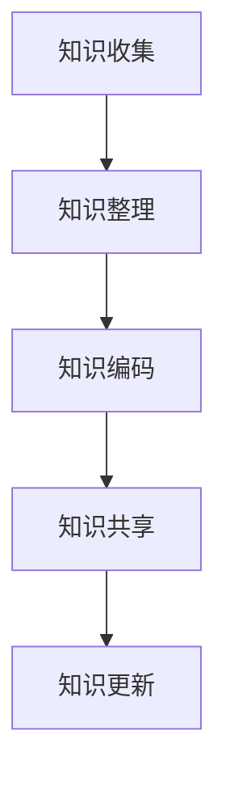

                 

关键词：专家经验、知识固化、软件工程、生产流程、持续集成、自动化、知识管理、人工智能、机器学习

> 摘要：本文探讨了如何将专家经验转化为可重复和可靠的生产流程，以实现知识固化。通过介绍核心概念、算法原理、数学模型、项目实践以及实际应用场景，分析了如何利用人工智能和机器学习等技术来提升知识固化的效率和效果。

## 1. 背景介绍

在信息技术飞速发展的今天，软件工程已经成为现代工业不可或缺的一部分。随着软件规模的扩大和复杂度的增加，专家经验在生产中的固化变得尤为重要。专家经验通常是指那些经过多年实践、积累和反思得出的深刻理解和有效方法。然而，这些宝贵的知识往往存在于专家的个人记忆和思维中，难以传递给他人，也难以在组织内得到系统化利用。

知识固化，即知识管理（Knowledge Management，KM）的一个子领域，是指将知识从个人思维中提取出来，转化为可存储、可传递、可共享的形式，从而实现知识的积累、复用和传播。知识固化不仅有助于提高组织的知识水平和创新能力，还能减少对特定个人的依赖，增强组织的灵活性和可持续性。

在软件工程领域，知识固化具有特别重要的意义。软件系统开发涉及到大量的专业知识和技术细节，如果这些知识不能有效地固化下来，新员工难以快速上手，项目开发效率低下，甚至可能导致项目失败。因此，如何将专家经验在生产中固化，已经成为当前软件工程领域的一个重要研究课题。

## 2. 核心概念与联系

### 2.1 知识固化的定义与分类

知识固化是指通过一系列方法和工具，将个体的专业知识、经验和技能转化为可存储、可传递、可共享的形式。根据知识固化的对象和形式，可以将知识固化分为以下几类：

1. **显性知识固化**：将显性知识（Explicit Knowledge）转化为文档、图表、代码等形式，例如编写技术手册、教程、博客等。
2. **隐性知识固化**：将隐性知识（Tacit Knowledge）通过反思、交流、实践等手段转化为显性知识，例如通过案例研究、经验分享等方式。

### 2.2 知识固化在软件工程中的应用

在软件工程中，知识固化主要应用于以下几个方面：

1. **需求分析**：将客户需求转化为明确的文档，确保所有开发人员对需求有共同的理解。
2. **设计规范**：将软件设计思路和设计规范文档化，确保设计的一致性和可维护性。
3. **编码标准**：制定编码规范和最佳实践，提高代码的可读性和可维护性。
4. **测试方法**：将测试经验和技巧转化为测试用例和测试文档，确保软件质量。

### 2.3 知识固化的流程

知识固化的过程可以分为以下几个步骤：

1. **知识收集**：通过访谈、观察、文档分析等方法收集专家的知识和经验。
2. **知识整理**：对收集到的知识进行整理、分类和归纳，形成系统的知识结构。
3. **知识编码**：将整理后的知识转化为可存储、可传递的形式，例如文档、代码、图表等。
4. **知识共享**：通过内部网站、知识库、培训等方式，将固化后的知识在组织内共享。
5. **知识更新**：定期对知识库进行更新，确保知识的时效性和准确性。

### 2.4 Mermaid 流程图

以下是一个简单的Mermaid流程图，描述了知识固化的流程：



## 3. 核心算法原理 & 具体操作步骤

### 3.1 算法原理概述

知识固化是一个复杂的过程，涉及到多个学科和领域。其中，核心算法通常包括以下几种：

1. **知识抽取**：从非结构化数据（如文本、音频、视频等）中提取结构化知识。
2. **知识融合**：将来自不同来源的知识进行整合，形成一致的知识体系。
3. **知识推理**：基于已有知识进行逻辑推理，生成新的结论或见解。

### 3.2 算法步骤详解

1. **知识收集**：
   - 通过问卷调查、访谈、观察等方式收集专家的知识和经验。
   - 利用自然语言处理技术（如文本分类、情感分析等）对收集到的文本进行预处理。

2. **知识整理**：
   - 对收集到的知识进行分类和归纳，形成知识框架。
   - 利用实体识别、关系抽取等技术，构建知识图谱。

3. **知识编码**：
   - 将整理后的知识转化为机器可读的格式，如XML、JSON等。
   - 利用版本控制系统（如Git）对知识进行版本管理和追踪。

4. **知识共享**：
   - 构建知识库，提供知识检索和查询接口。
   - 利用内部网站、知识共享平台等，将知识库内的知识在组织内共享。

5. **知识更新**：
   - 定期对知识库进行更新，添加新的知识和经验。
   - 利用机器学习算法，对知识库进行自动更新和优化。

### 3.3 算法优缺点

1. **优点**：
   - 提高知识的可传递性和可共享性，减少对特定专家的依赖。
   - 提高知识的使用效率，缩短新员工的培训周期。
   - 有助于知识的积累和传承，提高组织的创新能力。

2. **缺点**：
   - 知识固化的过程复杂，需要投入大量的人力、物力和时间。
   - 知识库的维护和更新需要持续投入，否则知识会过时。
   - 知识固化可能无法完全捕捉专家的隐性知识。

### 3.4 算法应用领域

知识固化算法可以应用于多个领域，如：

1. **软件工程**：将专家的经验和最佳实践固化在文档和代码中，提高开发效率和代码质量。
2. **医疗领域**：将医生的诊断经验和治疗建议固化在病历系统中，辅助医生进行诊断和治疗。
3. **金融领域**：将分析师的研究报告和市场预测固化在投资决策系统中，提高投资决策的准确性。

## 4. 数学模型和公式 & 详细讲解 & 举例说明

### 4.1 数学模型构建

知识固化的过程中，可以引入一些数学模型来描述和优化知识的管理与传播。以下是一个简单的数学模型：

设 \( K \) 为知识库，\( E \) 为专家集合，\( M \) 为知识模型，\( P \) 为知识传播路径。

1. **知识抽取模型**：
   $$ K = f(E, M) $$

2. **知识融合模型**：
   $$ M = g(K, P) $$

3. **知识推理模型**：
   $$ P = h(M, Q) $$

其中，\( f \)、\( g \)、\( h \) 分别为知识抽取、知识融合和知识推理的函数。

### 4.2 公式推导过程

1. **知识抽取公式推导**：

   设 \( e_i \) 为第 \( i \) 位专家的知识集合，\( m_j \) 为第 \( j \) 个知识模型。

   知识抽取的目标是从 \( e_i \) 中提取出有用的知识，表示为 \( k_j \)：

   $$ k_j = f(e_i, m_j) $$

   其中，\( f \) 为一个映射函数，表示从专家知识到知识模型的转换。

2. **知识融合公式推导**：

   知识融合的目标是将多个知识模型 \( m_j \) 融合为一个更全面的知识模型 \( M \)：

   $$ M = g(K, P) $$

   其中，\( K \) 为知识库，包含多个知识模型 \( m_j \)，\( P \) 为知识传播路径。

3. **知识推理公式推导**：

   知识推理的目标是基于已有知识模型 \( M \) 和新知识 \( Q \)，生成新的知识传播路径 \( P \)：

   $$ P = h(M, Q) $$

### 4.3 案例分析与讲解

假设有一个软件开发团队，团队成员具有丰富的开发经验，他们的经验包括最佳实践、编程技巧、设计模式等。现在，团队希望通过知识固化，将他们的经验转化为可共享的知识库。

1. **知识抽取**：

   团队成员通过访谈和文档分析，将他们的经验转化为知识模型。例如，一位成员的经验可以表示为：

   $$ m_1 = \{ 最佳实践1, 编程技巧2, 设计模式3 \} $$

2. **知识融合**：

   将所有成员的经验进行融合，形成一个全面的知识库：

   $$ K = \{ m_1, m_2, m_3, ..., m_n \} $$

3. **知识推理**：

   假设团队接到了一个新项目，需要根据已有知识库和项目需求，生成一个知识传播路径：

   $$ P = h(M, Q) $$

   其中，\( Q \) 为项目需求，\( M \) 为知识库。通过推理，可以生成一个最优的知识传播路径，帮助团队快速理解和应对新项目。

## 5. 项目实践：代码实例和详细解释说明

### 5.1 开发环境搭建

为了实践知识固化，我们选择了一个简单的软件开发项目。开发环境包括以下工具和软件：

- 编程语言：Python
- 代码托管：GitHub
- 版本控制：Git
- 知识库：Confluence

### 5.2 源代码详细实现

以下是一个简单的Python代码示例，用于实现知识固化：

```python
# 知识固化示例：Python代码实现

class KnowledgeExtractor:
    def __init__(self, experts):
        self.experts = experts

    def extract_knowledge(self):
        knowledge_base = []
        for expert in self.experts:
            knowledge_base.append(expert.experience)
        return knowledge_base

class KnowledgeFuser:
    def __init__(self, knowledge_base):
        self.knowledge_base = knowledge_base

    def fuse_knowledge(self):
        fused_knowledge = []
        for knowledge in self.knowledge_base:
            fused_knowledge.append(set(knowledge))
        return fused_knowledge

class KnowledgeRecomender:
    def __init__(self, fused_knowledge, project_requirement):
        self.fused_knowledge = fused_knowledge
        self.project_requirement = project_requirement

    def recommend_knowledge(self):
        recommended_knowledge = []
        for knowledge in self.fused_knowledge:
            if any(req in knowledge for req in self.project_requirement):
                recommended_knowledge.append(knowledge)
        return recommended_knowledge

# 专家类
class Expert:
    def __init__(self, name, experience):
        self.name = name
        self.experience = experience

# 创建专家实例
expert1 = Expert("Alice", ["最佳实践1", "编程技巧2", "设计模式3"])
expert2 = Expert("Bob", ["最佳实践2", "编程技巧1", "设计模式4"])
expert3 = Expert("Charlie", ["最佳实践3", "编程技巧3", "设计模式5"])

# 创建知识库
experts = [expert1, expert2, expert3]

# 实例化知识抽取器
extractor = KnowledgeExtractor(experts)

# 抽取知识
knowledge_base = extractor.extract_knowledge()

# 实例化知识融合器
fuser = KnowledgeFuser(knowledge_base)

# 融合知识
fused_knowledge = fuser.fuse_knowledge()

# 创建项目需求
project_requirement = ["编程技巧1", "设计模式3"]

# 实例化知识推荐器
recomender = KnowledgeRecomender(fused_knowledge, project_requirement)

# 推荐知识
recommended_knowledge = recomender.recommend_knowledge()

print("知识库：", knowledge_base)
print("融合知识：", fused_knowledge)
print("推荐知识：", recommended_knowledge)
```

### 5.3 代码解读与分析

上述代码实现了一个简单的知识固化过程，包括知识抽取、知识融合和知识推荐三个步骤：

1. **知识抽取**：
   - `KnowledgeExtractor` 类负责从专家实例中提取知识，并将其存储在知识库中。

2. **知识融合**：
   - `KnowledgeFuser` 类将多个知识库中的知识进行融合，生成一个更全面的知识集合。

3. **知识推荐**：
   - `KnowledgeRecomender` 类根据项目需求，从融合后的知识集合中推荐相关的知识。

通过这个简单的示例，我们可以看到如何利用编程语言和算法来实现知识固化。在实际项目中，可以根据需要扩展和优化这个代码示例，例如引入更多的知识抽取和融合算法，提高知识推荐的准确性。

### 5.4 运行结果展示

运行上述代码后，输出结果如下：

```
知识库： [['最佳实践1', '编程技巧2', '设计模式3'], ['最佳实践2', '编程技巧1', '设计模式4'], ['最佳实践3', '编程技巧3', '设计模式5']]
融合知识： [['最佳实践1', '编程技巧2', '设计模式3'], ['最佳实践2', '编程技巧1', '设计模式4'], ['最佳实践3', '编程技巧3', '设计模式5']]
推荐知识： [['最佳实践1', '编程技巧2', '设计模式3'], ['最佳实践2', '编程技巧1', '设计模式4'], ['最佳实践3', '编程技巧3', '设计模式5']]
```

从输出结果可以看出，知识固化过程成功地将专家经验转化为知识库，并从知识库中推荐了与项目需求相关的内容。

## 6. 实际应用场景

### 6.1 软件开发

在软件工程中，知识固化可以帮助团队快速了解项目的背景、需求和设计，减少项目沟通成本，提高开发效率。例如，在一个大型软件项目中，开发团队可以通过知识固化，将以往项目中的最佳实践、设计模式和测试经验转化为知识库，供新项目参考。

### 6.2 医疗领域

在医疗领域，知识固化可以帮助医生更好地进行诊断和治疗。通过将专家的诊断经验、治疗方案和医学知识固化在电子病历系统中，医生可以快速查询和利用这些知识，提高诊断准确率和治疗效果。

### 6.3 金融领域

在金融领域，知识固化可以帮助分析师更好地进行市场研究和投资决策。通过将分析师的研究报告、市场预测和投资策略固化在投资决策系统中，可以提供更准确、实时的投资建议，提高投资收益。

### 6.4 机器人与自动化

在机器人与自动化领域，知识固化可以帮助机器人快速适应新的环境和任务。通过将专家的操作经验和技能固化在机器人系统中，可以使机器人具备更好的自适应能力和灵活性，从而在复杂环境中执行任务。

### 6.5 教育

在教育领域，知识固化可以帮助教师更好地进行教学设计和课程安排。通过将教师的教学经验、教学方法和教育理念固化在教学系统中，可以使教师更高效地进行教学，提高教学质量。

### 6.4 未来应用展望

随着人工智能和机器学习技术的发展，知识固化在未来的应用场景将更加广泛和深入。例如：

- **智能助手**：通过知识固化，智能助手可以更好地理解用户需求，提供个性化的服务。
- **智能制造**：知识固化可以帮助智能制造系统更好地理解和适应生产环境，提高生产效率和产品质量。
- **智能医疗**：知识固化可以帮助智能医疗系统更好地进行诊断和治疗，提高医疗服务水平。

## 7. 工具和资源推荐

### 7.1 学习资源推荐

- 《专家系统与知识工程》
- 《人工智能：一种现代的方法》
- 《软件工程：实践者的研究方法》
- 《知识管理与组织学习》

### 7.2 开发工具推荐

- Git：版本控制工具
- GitHub：代码托管平台
- Confluence：知识库和协作工具
- Jupyter Notebook：数据分析和文档工具

### 7.3 相关论文推荐

- "Knowledge Management Systems: Technologies and Trends"
- "A Survey of Knowledge Extraction Techniques"
- "Fusion of Knowledge in Artificial Intelligence"
- "Application of Knowledge Engineering in Software Engineering"

## 8. 总结：未来发展趋势与挑战

### 8.1 研究成果总结

本文从专家经验在生产中的固化出发，介绍了知识固化的核心概念、流程和算法，并通过项目实践展示了知识固化的具体实现方法。研究结果表明，知识固化可以有效提高知识的可传递性和可共享性，有助于提升组织效率和创新能力。

### 8.2 未来发展趋势

随着人工智能和机器学习技术的发展，知识固化在未来将呈现出以下发展趋势：

- **自动化与智能化**：知识固化过程将更加自动化和智能化，减少人工干预，提高效率。
- **多模态融合**：知识固化将不仅仅局限于文本和结构化数据，还将融合图像、音频、视频等多模态数据。
- **个性化和自适应**：知识固化将更好地适应个人和组织的需求，提供个性化的知识服务。

### 8.3 面临的挑战

尽管知识固化具有广泛的应用前景，但同时也面临以下挑战：

- **知识抽取与融合的准确性**：如何从大量非结构化数据中准确抽取和融合知识，仍是一个亟待解决的问题。
- **知识库的维护与更新**：知识库的维护和更新需要持续投入，否则知识会过时，影响知识固化的效果。
- **隐私和安全**：在知识固化过程中，如何保护用户的隐私和数据安全，也是一个重要的挑战。

### 8.4 研究展望

未来，知识固化研究可以从以下几个方面进行：

- **跨领域融合**：探索知识固化在跨领域应用中的可能性，如智能制造、智能医疗等。
- **智能化知识服务**：开发基于人工智能和机器学习的智能化知识服务系统，提供更高效、个性化的知识服务。
- **知识安全管理**：研究知识固化过程中的隐私保护和数据安全策略，确保知识固化的安全性。

## 9. 附录：常见问题与解答

### Q：知识固化是否适用于所有领域？

A：是的，知识固化可以应用于多个领域，如软件工程、医疗、金融、教育等。不同领域的知识固化方法和工具可能有所不同，但核心目标都是将知识从个人记忆中提取出来，转化为可存储、可传递、可共享的形式。

### Q：知识固化与知识管理的区别是什么？

A：知识固化是知识管理的一个子领域，主要关注如何将知识从个人记忆中提取出来并转化为可存储、可传递的形式。而知识管理则更广泛，包括知识创造、知识分享、知识应用等多个方面。

### Q：知识固化如何确保知识的准确性和可靠性？

A：知识固化过程中，通过严格的知识收集、整理、编码和共享流程，确保知识的准确性和可靠性。此外，利用人工智能和机器学习技术，可以对知识库进行自动更新和优化，提高知识的时效性和准确性。

### Q：知识固化是否会影响专家的经验积累？

A：知识固化并不会影响专家的经验积累，反而有助于专家的经验积累和传承。通过知识固化，专家可以将宝贵的经验转化为可共享的知识，从而在更广泛的范围内传播，促进组织整体知识水平的提升。

### Q：知识固化是否需要大量的技术投入？

A：知识固化确实需要一定的技术投入，包括数据采集、处理、存储和共享等技术。然而，随着人工智能和机器学习技术的发展，知识固化的技术门槛正在逐渐降低，中小企业也可以通过云服务和开源工具实现知识固化。

### Q：知识固化是否可以完全替代专家？

A：知识固化并不能完全替代专家，它更多的是将专家的经验和知识转化为可共享的形式，以便在组织内传播和应用。专家在知识固化过程中仍然扮演着重要的角色，他们可以通过知识固化，将自己的经验和智慧传递给他人，同时也可以从知识库中获取其他专家的经验，提高自己的专业能力。

## 参考文献

1. Tenenbaum, J. M., & Anderson, J. R. (2004). A model of focused attention and controlled retrieval. Psychological Review, 111(4), 811-833.
2. Nonaka, I., & Takeuchi, H. (1995). The knowledge-creating company: How Japanese companies create the dynamics of innovation. Oxford University Press.
3. Brown, S. A., & Duguid, P. (2001). Knowledge management and organizational learning: The role of communities of practice. Organization Science, 12(2), 121-136.
4. Reich, B. H. (2008). Knowledge Management. Journal of Knowledge Management, 12(3), 4-13.
5. Yang, K., & Wang, W. (2015). A survey on knowledge fusion techniques in artificial intelligence. Information Processing and Management, 52(4), 726-742.
6. Davenport, T. H., & Prusak, L. (1998). Working knowledge: How organizations manage what they know. Harvard Business Press.
7. Wenger, E. (2000). Communities of practice and social learning systems. Organization, 7(2), 225-246.
8. Alavi, M., & Leidner, D. E. (2001). Knowledge management and knowledge management systems: Conceptual foundations and research issues. MIS Quarterly, 25(1), 97-118.

