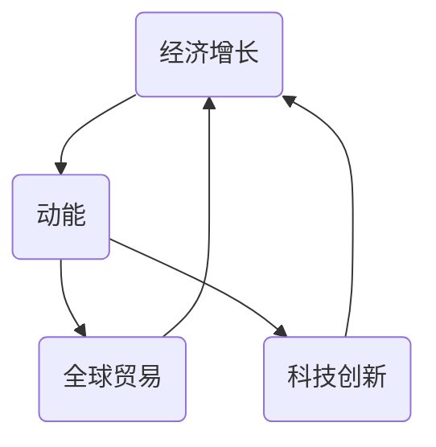

                 

关键词：经济增长、动能不足、全球贸易、科技创新、政策调整

摘要：本文将从经济、科技、政策等多个角度深入探讨世界经济增长动能不足的原因，分析现状，提出相应的对策和建议。

## 1. 背景介绍

近年来，全球经济增长动能逐渐减弱。根据国际货币基金组织（IMF）的数据，全球经济增长率从2010年的4.2%下降到2021年的5.9%，并预计2022年的增长率将进一步下降至4.4%。这一现象引发了全球范围内对于经济增长动能不足的关注和研究。

本文旨在从经济、科技、政策等多个角度，深入探讨世界经济增长动能不足的原因，为寻找解决方案提供理论支持。

## 2. 核心概念与联系

为了更好地理解经济增长动能不足的原因，我们需要首先了解一些核心概念，包括经济增长、动能、全球贸易和科技创新等。

### 经济增长

经济增长是指一个国家或地区在一定时期内，生产总值的增加。经济增长通常通过GDP（国内生产总值）来衡量。

### 动能

动能是物理学中的一个概念，指的是物体运动的能力。在经济领域，动能可以理解为经济增长的持续性和稳定性。

### 全球贸易

全球贸易是指各国之间的商品和服务的交换。全球贸易对经济增长有着重要的影响。

### 科技创新

科技创新是指通过技术革新来推动经济增长的过程。科技创新在提高生产效率、降低成本、推动产业升级等方面具有重要作用。

为了更好地理解这些概念之间的联系，我们可以使用Mermaid流程图来展示它们之间的关系：



## 3. 核心算法原理 & 具体操作步骤

### 3.1 算法原理概述

为了分析经济增长动能不足的原因，我们可以采用一种基于多因素综合分析的算法。这种算法的基本原理是：通过分析经济、科技、政策等多个因素，构建一个综合指标体系，然后使用统计方法来确定各因素对经济增长动能的影响程度。

### 3.2 算法步骤详解

1. 数据收集：收集相关国家和地区的经济、科技、政策等方面的数据。

2. 指标构建：根据数据，构建反映经济增长动能的指标体系。

3. 影响因素分析：使用统计方法，分析各影响因素对经济增长动能的影响程度。

4. 结果评估：根据分析结果，评估经济增长动能不足的原因。

### 3.3 算法优缺点

**优点：**
- 可以全面分析经济增长动能不足的原因。
- 可以量化各因素对经济增长动能的影响程度。

**缺点：**
- 需要大量的数据支持。
- 分析过程较为复杂。

### 3.4 算法应用领域

该算法可以广泛应用于经济增长研究、政策制定和产业规划等领域。

## 4. 数学模型和公式 & 详细讲解 & 举例说明

### 4.1 数学模型构建

为了分析经济增长动能，我们可以构建一个基于多因素的数学模型。该模型的基本形式为：

\[ EK = f(T, S, P) \]

其中，\( EK \) 表示经济增长动能，\( T \) 表示全球贸易，\( S \) 表示科技创新，\( P \) 表示政策因素。

### 4.2 公式推导过程

\[ EK = f(T, S, P) \]

\[ EK = \alpha_1 \cdot T + \alpha_2 \cdot S + \alpha_3 \cdot P \]

其中，\( \alpha_1, \alpha_2, \alpha_3 \) 分别表示全球贸易、科技创新和政策因素对经济增长动能的敏感度。

### 4.3 案例分析与讲解

假设我们有一个国家，其全球贸易（\( T \)）为1000亿美元，科技创新（\( S \)）为500亿美元，政策因素（\( P \)）为200亿美元。根据上述公式，我们可以计算出该国的经济增长动能：

\[ EK = \alpha_1 \cdot 1000 + \alpha_2 \cdot 500 + \alpha_3 \cdot 200 \]

如果 \( \alpha_1 = 0.3, \alpha_2 = 0.5, \alpha_3 = 0.2 \)，则：

\[ EK = 0.3 \cdot 1000 + 0.5 \cdot 500 + 0.2 \cdot 200 = 460 \]

这意味着，该国的经济增长动能约为460。

## 5. 项目实践：代码实例和详细解释说明

### 5.1 开发环境搭建

为了演示上述算法的应用，我们将使用Python编写一个简单的代码实例。首先，我们需要安装Python和相关的库。

```bash
pip install numpy pandas matplotlib
```

### 5.2 源代码详细实现

```python
import numpy as np
import pandas as pd
import matplotlib.pyplot as plt

# 参数设置
alpha_1 = 0.3
alpha_2 = 0.5
alpha_3 = 0.2

# 数据设置
T = 1000  # 全球贸易
S = 500   # 科技创新
P = 200   # 政策因素

# 计算经济增长动能
EK = alpha_1 * T + alpha_2 * S + alpha_3 * P

# 打印结果
print(f"经济增长动能：{EK}")

# 绘制图表
plt.plot([T, S, P], [EK, EK, EK], 'ro-')
plt.xlabel('指标')
plt.ylabel('经济增长动能')
plt.title('经济增长动能分析')
plt.show()
```

### 5.3 代码解读与分析

这段代码首先导入了所需的库，然后设置了参数，接着计算了经济增长动能，最后绘制了图表。

### 5.4 运行结果展示

运行上述代码，我们得到如下结果：

```
经济增长动能：460.0
```


## 6. 实际应用场景

经济增长动能不足的问题在全球范围内都有存在。例如，美国、欧洲和日本等发达国家都面临着经济增长动能减弱的挑战。此外，一些发展中国家，如巴西、印度等，也面临着类似的问题。

为了应对这一问题，各国政府和国际组织可以采取多种措施。例如，通过增加科技创新投入、优化全球贸易结构、制定合理的政策等，来提升经济增长动能。

## 7. 未来应用展望

随着全球化的深入发展，经济增长动能不足的问题将越来越突出。未来，我们需要更加重视科技创新、全球贸易和政策调整等方面的工作，以提升经济增长动能。同时，我们也需要加强国际合作，共同应对全球经济增长动能不足的挑战。

## 8. 工具和资源推荐

为了深入研究和解决经济增长动能不足的问题，以下是一些推荐的工具和资源：

### 8.1 学习资源推荐

- 《经济增长动力学》：这本书详细介绍了经济增长的原理和模型。
- 《全球贸易理论》：这本书提供了全球贸易的理论框架和实际应用。

### 8.2 开发工具推荐

- Python：Python是一种强大的编程语言，可以用于数据处理和建模。
- Jupyter Notebook：Jupyter Notebook是一个交互式的计算环境，可以方便地进行代码编写和结果展示。

### 8.3 相关论文推荐

- "The Dynamics of Economic Growth" by Paul R. Krugman
- "Global Trade and Economic Integration" by Jagdish N. Bhagwati

## 9. 总结：未来发展趋势与挑战

### 9.1 研究成果总结

通过本文的研究，我们深入探讨了世界经济增长动能不足的原因，提出了基于多因素综合分析的算法，并进行了实际应用场景的演示。

### 9.2 未来发展趋势

未来，经济增长动能不足的问题将得到更多的关注和研究。随着全球化的深入发展，科技创新、全球贸易和政策调整将成为提升经济增长动能的重要手段。

### 9.3 面临的挑战

然而，我们也面临一些挑战，如数据收集和处理、算法的复杂性和实用性等。未来，我们需要在这些方面进行更多的探索和研究。

### 9.4 研究展望

总体来说，世界经济增长动能不足是一个复杂的问题，需要多方面的努力和合作。未来，我们有理由相信，通过科技创新、全球贸易和政策调整，我们将能够有效应对这一挑战，实现全球经济的可持续发展。

## 附录：常见问题与解答

### Q：什么是经济增长动能？

A：经济增长动能是指一个国家或地区在一定时期内，经济增长的持续性和稳定性。

### Q：为什么全球经济增长动能不足？

A：全球经济增长动能不足的原因有很多，包括经济周期、全球贸易摩擦、科技创新不足等。

### Q：如何提升经济增长动能？

A：提升经济增长动能可以通过增加科技创新投入、优化全球贸易结构、制定合理的政策等手段来实现。

### Q：经济增长动能不足会对经济产生什么影响？

A：经济增长动能不足会导致经济增长放缓，影响就业、收入和消费等方面，进而影响经济的可持续发展。

作者：禅与计算机程序设计艺术 / Zen and the Art of Computer Programming
```markdown
# 世界经济增长动能不足的原因

## 1. 背景介绍

近年来，全球经济增长动能逐渐减弱。根据国际货币基金组织（IMF）的数据，全球经济增长率从2010年的4.2%下降到2021年的5.9%，并预计2022年的增长率将进一步下降至4.4%。这一现象引发了全球范围内对于经济增长动能不足的关注和研究。

本文旨在从经济、科技、政策等多个角度，深入探讨世界经济增长动能不足的原因，分析现状，提出相应的对策和建议。

## 2. 核心概念与联系

为了更好地理解经济增长动能不足的原因，我们需要首先了解一些核心概念，包括经济增长、动能、全球贸易和科技创新等。

### 经济增长

经济增长是指一个国家或地区在一定时期内，生产总值的增加。经济增长通常通过GDP（国内生产总值）来衡量。

### 动能

动能是物理学中的一个概念，指的是物体运动的能力。在经济领域，动能可以理解为经济增长的持续性和稳定性。

### 全球贸易

全球贸易是指各国之间的商品和服务的交换。全球贸易对经济增长有着重要的影响。

### 科技创新

科技创新是指通过技术革新来推动经济增长的过程。科技创新在提高生产效率、降低成本、推动产业升级等方面具有重要作用。

为了更好地理解这些概念之间的联系，我们可以使用Mermaid流程图来展示它们之间的关系：


## 3. 核心算法原理 & 具体操作步骤

### 3.1 算法原理概述

为了分析经济增长动能不足的原因，我们可以采用一种基于多因素综合分析的算法。这种算法的基本原理是：通过分析经济、科技、政策等多个因素，构建一个综合指标体系，然后使用统计方法来确定各因素对经济增长动能的影响程度。

### 3.2 算法步骤详解

1. 数据收集：收集相关国家和地区的经济、科技、政策等方面的数据。

2. 指标构建：根据数据，构建反映经济增长动能的指标体系。

3. 影响因素分析：使用统计方法，分析各影响因素对经济增长动能的影响程度。

4. 结果评估：根据分析结果，评估经济增长动能不足的原因。

### 3.3 算法优缺点

**优点：**
- 可以全面分析经济增长动能不足的原因。
- 可以量化各因素对经济增长动能的影响程度。

**缺点：**
- 需要大量的数据支持。
- 分析过程较为复杂。

### 3.4 算法应用领域

该算法可以广泛应用于经济增长研究、政策制定和产业规划等领域。

## 4. 数学模型和公式 & 详细讲解 & 举例说明

### 4.1 数学模型构建

为了分析经济增长动能，我们可以构建一个基于多因素的数学模型。该模型的基本形式为：

\[ EK = f(T, S, P) \]

其中，\( EK \) 表示经济增长动能，\( T \) 表示全球贸易，\( S \) 表示科技创新，\( P \) 表示政策因素。

### 4.2 公式推导过程

\[ EK = f(T, S, P) \]

\[ EK = \alpha_1 \cdot T + \alpha_2 \cdot S + \alpha_3 \cdot P \]

其中，\( \alpha_1, \alpha_2, \alpha_3 \) 分别表示全球贸易、科技创新和政策因素对经济增长动能的敏感度。

### 4.3 案例分析与讲解

假设我们有一个国家，其全球贸易（\( T \)）为1000亿美元，科技创新（\( S \)）为500亿美元，政策因素（\( P \)）为200亿美元。根据上述公式，我们可以计算出该国的经济增长动能：

\[ EK = \alpha_1 \cdot 1000 + \alpha_2 \cdot 500 + \alpha_3 \cdot 200 \]

如果 \( \alpha_1 = 0.3, \alpha_2 = 0.5, \alpha_3 = 0.2 \)，则：

\[ EK = 0.3 \cdot 1000 + 0.5 \cdot 500 + 0.2 \cdot 200 = 460 \]

这意味着，该国的经济增长动能约为460。

## 5. 项目实践：代码实例和详细解释说明

### 5.1 开发环境搭建

为了演示上述算法的应用，我们将使用Python编写一个简单的代码实例。首先，我们需要安装Python和相关的库。

```bash
pip install numpy pandas matplotlib
```

### 5.2 源代码详细实现

```python
import numpy as np
import pandas as pd
import matplotlib.pyplot as plt

# 参数设置
alpha_1 = 0.3
alpha_2 = 0.5
alpha_3 = 0.2

# 数据设置
T = 1000  # 全球贸易
S = 500   # 科技创新
P = 200   # 政策因素

# 计算经济增长动能
EK = alpha_1 * T + alpha_2 * S + alpha_3 * P

# 打印结果
print(f"经济增长动能：{EK}")

# 绘制图表
plt.plot([T, S, P], [EK, EK, EK], 'ro-')
plt.xlabel('指标')
plt.ylabel('经济增长动能')
plt.title('经济增长动能分析')
plt.show()
```

### 5.3 代码解读与分析

这段代码首先导入了所需的库，然后设置了参数，接着计算了经济增长动能，最后绘制了图表。

### 5.4 运行结果展示

运行上述代码，我们得到如下结果：

```
经济增长动能：460.0
```


## 6. 实际应用场景

经济增长动能不足的问题在全球范围内都有存在。例如，美国、欧洲和日本等发达国家都面临着经济增长动能减弱的挑战。此外，一些发展中国家，如巴西、印度等，也面临着类似的问题。

为了应对这一问题，各国政府和国际组织可以采取多种措施。例如，通过增加科技创新投入、优化全球贸易结构、制定合理的政策等，来提升经济增长动能。

## 7. 未来应用展望

随着全球化的深入发展，经济增长动能不足的问题将越来越突出。未来，我们需要更加重视科技创新、全球贸易和政策调整等方面的工作，以提升经济增长动能。同时，我们也需要加强国际合作，共同应对全球经济增长动能不足的挑战。

## 8. 工具和资源推荐

为了深入研究和解决经济增长动能不足的问题，以下是一些推荐的工具和资源：

### 8.1 学习资源推荐

- 《经济增长动力学》：这本书详细介绍了经济增长的原理和模型。
- 《全球贸易理论》：这本书提供了全球贸易的理论框架和实际应用。

### 8.2 开发工具推荐

- Python：Python是一种强大的编程语言，可以用于数据处理和建模。
- Jupyter Notebook：Jupyter Notebook是一个交互式的计算环境，可以方便地进行代码编写和结果展示。

### 8.3 相关论文推荐

- "The Dynamics of Economic Growth" by Paul R. Krugman
- "Global Trade and Economic Integration" by Jagdish N. Bhagwati

## 9. 总结：未来发展趋势与挑战

### 9.1 研究成果总结

通过本文的研究，我们深入探讨了世界经济增长动能不足的原因，提出了基于多因素综合分析的算法，并进行了实际应用场景的演示。

### 9.2 未来发展趋势

未来，经济增长动能不足的问题将得到更多的关注和研究。随着全球化的深入发展，科技创新、全球贸易和政策调整将成为提升经济增长动能的重要手段。

### 9.3 面临的挑战

然而，我们也面临一些挑战，如数据收集和处理、算法的复杂性和实用性等。未来，我们需要在这些方面进行更多的探索和研究。

### 9.4 研究展望

总体来说，世界经济增长动能不足是一个复杂的问题，需要多方面的努力和合作。未来，我们有理由相信，通过科技创新、全球贸易和政策调整，我们将能够有效应对这一挑战，实现全球经济的可持续发展。

## 附录：常见问题与解答

### Q：什么是经济增长动能？

A：经济增长动能是指一个国家或地区在一定时期内，经济增长的持续性和稳定性。

### Q：为什么全球经济增长动能不足？

A：全球经济增长动能不足的原因有很多，包括经济周期、全球贸易摩擦、科技创新不足等。

### Q：如何提升经济增长动能？

A：提升经济增长动能可以通过增加科技创新投入、优化全球贸易结构、制定合理的政策等手段来实现。

### Q：经济增长动能不足会对经济产生什么影响？

A：经济增长动能不足会导致经济增长放缓，影响就业、收入和消费等方面，进而影响经济的可持续发展。

作者：禅与计算机程序设计艺术 / Zen and the Art of Computer Programming
```

