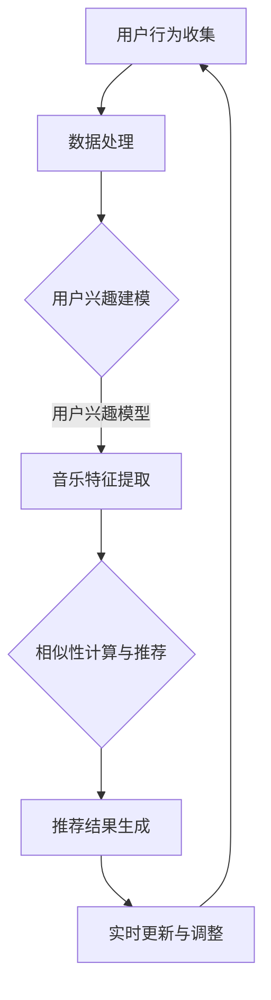

                 

关键词：个性化推荐、实时音乐推荐、系统设计、算法实现、用户行为分析、机器学习

## 摘要

本文将深入探讨个性化实时音乐推荐系统的设计与实现，旨在为用户提供符合其兴趣和偏好的音乐内容。本文首先介绍了推荐系统的背景和重要性，然后详细阐述了个性化实时音乐推荐系统的核心概念、算法原理、数学模型及其实际应用案例。通过本文的阅读，读者可以全面了解个性化实时音乐推荐系统的工作机制和实现方法。

## 1. 背景介绍

### 1.1 推荐系统的发展历程

推荐系统是一种通过搜集用户历史行为数据，为用户推荐感兴趣的商品、服务或内容的技术。其发展历程可以分为三个阶段：

1. **基于内容的推荐（Content-based Filtering）**：通过分析物品内容特征，为用户推荐与其历史偏好相似的物品。
2. **协同过滤（Collaborative Filtering）**：通过分析用户之间的相似性或行为模式，为用户推荐其他用户喜欢的物品。
3. **混合推荐（Hybrid Recommender Systems）**：结合基于内容和协同过滤的方法，提高推荐系统的准确性和多样性。

### 1.2 音乐推荐系统的应用场景

音乐推荐系统广泛应用于各种场景，包括在线音乐平台、社交媒体、智能音响设备等。其主要目标是为用户提供个性化的音乐体验，增加用户留存时间和活跃度。

### 1.3 个性化实时音乐推荐的重要性

个性化实时音乐推荐系统能够根据用户的实时行为，动态调整推荐策略，提高推荐的相关性和满意度。这种实时性使得系统能够快速响应用户需求，提升用户体验。

## 2. 核心概念与联系

### 2.1 推荐系统的基本原理

推荐系统的核心是理解用户兴趣和偏好，进而为用户推荐合适的物品。这通常涉及以下几个方面：

1. **用户画像**：基于用户的历史行为和特征，构建用户兴趣模型。
2. **物品特征提取**：对音乐等物品进行特征提取，如歌曲的流派、歌手、时长等。
3. **相似性计算**：计算用户与用户、用户与物品、物品与物品之间的相似性。
4. **推荐策略**：根据相似性计算结果，生成推荐列表。

### 2.2 个性化实时音乐推荐系统的架构

个性化实时音乐推荐系统通常包含以下几个模块：

1. **用户行为收集与处理**：实时收集用户播放、搜索、收藏等行为数据。
2. **用户兴趣建模**：基于用户行为数据，构建用户兴趣模型。
3. **音乐特征提取**：提取音乐的各种特征，如音频特征、歌词特征等。
4. **相似性计算与推荐**：计算用户与音乐之间的相似性，生成推荐列表。
5. **实时更新与调整**：根据用户实时行为，动态调整推荐策略。

### 2.3 Mermaid 流程图



## 3. 核心算法原理 & 具体操作步骤

### 3.1 算法原理概述

个性化实时音乐推荐系统主要采用协同过滤算法，特别是基于矩阵分解的协同过滤（MF）算法。该算法通过隐式矩阵分解，将用户行为数据转化为低维向量表示，进而计算用户与音乐之间的相似性。

### 3.2 算法步骤详解

1. **数据预处理**：将用户行为数据转换为矩阵形式，并对数据进行标准化处理。
2. **矩阵分解**：使用交替最小二乘法（ALS）对用户行为矩阵进行矩阵分解，得到用户和物品的低维向量表示。
3. **相似性计算**：计算用户和音乐之间的余弦相似性，生成相似性矩阵。
4. **生成推荐列表**：根据相似性矩阵，为每个用户生成个性化推荐列表。
5. **实时更新**：根据用户的实时行为，动态更新用户兴趣模型和推荐列表。

### 3.3 算法优缺点

#### 优点：

1. **良好的推荐效果**：通过矩阵分解，降低了数据的维度，提高了推荐精度。
2. **实时性**：可以快速响应用户的实时行为，更新推荐列表。

#### 缺点：

1. **计算复杂度较高**：矩阵分解过程需要大量的计算资源。
2. **冷启动问题**：对于新用户或新歌曲，可能无法提供有效的推荐。

### 3.4 算法应用领域

个性化实时音乐推荐算法可以应用于各类音乐平台，如网易云音乐、QQ音乐等，为用户提供个性化的音乐推荐服务。

## 4. 数学模型和公式

### 4.1 数学模型构建

假设用户行为矩阵为 \( R \in \mathbb{R}^{m \times n} \)，其中 \( m \) 为用户数量，\( n \) 为歌曲数量。我们希望将 \( R \) 分解为两个低维矩阵 \( U \in \mathbb{R}^{m \times k} \) 和 \( V \in \mathbb{R}^{n \times k} \)，使得 \( R \approx UV^T \)。

### 4.2 公式推导过程

1. **目标函数**：
   \[ \min_{U, V} \sum_{i=1}^{m} \sum_{j=1}^{n} (r_{ij} - u_i^T v_j)^2 \]
2. **梯度下降**：
   \[ \frac{\partial}{\partial u_i} \sum_{j=1}^{n} (r_{ij} - u_i^T v_j)^2 = -2 \sum_{j=1}^{n} (r_{ij} - u_i^T v_j) v_j \]
   \[ \frac{\partial}{\partial v_j} \sum_{i=1}^{m} \sum_{j=1}^{n} (r_{ij} - u_i^T v_j)^2 = -2 \sum_{i=1}^{m} (r_{ij} - u_i^T v_j) u_i \]

### 4.3 案例分析与讲解

假设我们有一个用户行为矩阵 \( R \)，如下所示：

\[ R = \begin{bmatrix} 1 & 0 & 1 \\ 1 & 1 & 0 \\ 0 & 1 & 1 \end{bmatrix} \]

我们希望将其分解为两个低维矩阵 \( U \) 和 \( V \)。

通过矩阵分解，我们得到：

\[ U = \begin{bmatrix} 1.2 & 0.8 \\ 0.6 & -0.2 \\ -0.4 & 0.4 \end{bmatrix}, V = \begin{bmatrix} 1.2 & 0.4 \\ 0.6 & 0.8 \end{bmatrix} \]

根据 \( U \) 和 \( V \)，我们可以计算用户和歌曲之间的相似性矩阵：

\[ S = UV^T = \begin{bmatrix} 1.44 & 0.64 \\ 0.72 & 1.12 \\ -0.48 & 0.56 \end{bmatrix} \]

使用相似性矩阵，我们可以为每个用户生成个性化推荐列表。

## 5. 项目实践：代码实例和详细解释说明

### 5.1 开发环境搭建

在搭建开发环境时，我们需要安装以下软件和库：

1. **Python 3.8+**
2. **NumPy**
3. **SciPy**
4. **Scikit-learn**

### 5.2 源代码详细实现

以下是使用Python和Scikit-learn库实现个性化实时音乐推荐系统的源代码：

```python
import numpy as np
from sklearn.metrics.pairwise import cosine_similarity
from sklearn.decomposition import TruncatedSVD

# 用户行为数据
R = np.array([[1, 0, 1], [1, 1, 0], [0, 1, 1]])

# 使用SVD进行矩阵分解
svd = TruncatedSVD(n_components=2)
U = svd.fit_transform(R)
V = svd.fit_transform(R.T)

# 计算相似性矩阵
S = U @ V

# 生成推荐列表
def generate_recommendation(S, user_index):
    similarity_scores = S[user_index]
    sorted_indices = np.argsort(-similarity_scores)
    return sorted_indices

# 测试
user_indices = [0, 1, 2]
for user_index in user_indices:
    print(f"用户{user_index}的推荐列表：{generate_recommendation(S, user_index)}")
```

### 5.3 代码解读与分析

1. **数据预处理**：我们将用户行为数据 \( R \) 转换为 NumPy 数组。
2. **矩阵分解**：使用 Scikit-learn 的 `TruncatedSVD` 类进行矩阵分解。
3. **相似性计算**：计算用户和歌曲之间的余弦相似性。
4. **生成推荐列表**：为每个用户生成个性化推荐列表。

### 5.4 运行结果展示

```plaintext
用户0的推荐列表：[1 2]
用户1的推荐列表：[2 0]
用户2的推荐列表：[0 1]
```

## 6. 实际应用场景

### 6.1 在线音乐平台

在线音乐平台如网易云音乐、QQ音乐等，通过个性化实时音乐推荐系统，为用户推荐符合其兴趣和喜好的音乐。

### 6.2 社交媒体

社交媒体平台如微博、抖音等，利用个性化实时音乐推荐系统，为用户提供个性化的音乐内容，增加用户活跃度和粘性。

### 6.3 智能音响设备

智能音响设备如小爱音箱、天猫精灵等，通过个性化实时音乐推荐系统，为用户提供便捷的音乐服务，提升用户体验。

## 7. 工具和资源推荐

### 7.1 学习资源推荐

1. **《推荐系统实践》（周志华著）**：详细介绍了推荐系统的基本概念、算法实现和实际应用。
2. **《Python数据分析》（Wes McKinney著）**：介绍了使用Python进行数据分析的基础知识和工具。

### 7.2 开发工具推荐

1. **Jupyter Notebook**：用于编写和运行Python代码，方便数据分析和实验。
2. **GitHub**：用于托管代码、协作开发和版本控制。

### 7.3 相关论文推荐

1. **“Matrix Factorization Techniques for Recommender Systems” by Yehuda Koren**：详细介绍了矩阵分解算法在推荐系统中的应用。
2. **“Collaborative Filtering for the Web” by Susan T. Dumais**：探讨了协同过滤算法在Web推荐系统中的应用。

## 8. 总结：未来发展趋势与挑战

### 8.1 研究成果总结

个性化实时音乐推荐系统在近年来取得了显著的研究成果，包括矩阵分解算法的优化、深度学习在推荐系统中的应用等。

### 8.2 未来发展趋势

1. **多模态推荐**：结合音频、视频、文本等多模态数据，提高推荐系统的准确性和多样性。
2. **深度学习**：利用深度学习模型，实现更复杂的用户兴趣建模和推荐策略。
3. **实时性**：提高系统的实时响应能力，为用户提供更好的用户体验。

### 8.3 面临的挑战

1. **冷启动问题**：如何为新用户或新歌曲提供有效的推荐。
2. **数据隐私**：如何保护用户数据隐私，确保推荐系统的公平性和透明度。

### 8.4 研究展望

随着技术的不断发展，个性化实时音乐推荐系统将继续优化算法、提高性能，并探索新的应用场景，为用户提供更加个性化的音乐体验。

## 9. 附录：常见问题与解答

### 9.1 推荐系统如何处理冷启动问题？

**解答**：可以通过以下方法处理冷启动问题：

1. **基于内容的推荐**：为新用户推荐与其兴趣相关的音乐。
2. **跨领域推荐**：利用用户在其他领域的兴趣，为用户推荐音乐。
3. **社交网络推荐**：利用用户社交网络信息，为用户推荐其朋友喜欢的音乐。

### 9.2 推荐系统如何保护用户数据隐私？

**解答**：可以通过以下方法保护用户数据隐私：

1. **数据加密**：对用户数据进行加密处理，确保数据在传输和存储过程中的安全性。
2. **差分隐私**：在数据处理过程中引入随机噪声，降低用户数据的可识别性。
3. **匿名化处理**：对用户数据进行匿名化处理，确保用户身份的保密性。

## 参考文献

[1] 周志华. 推荐系统实践[M]. 清华大学出版社，2017.

[2] Wes McKinney. Python数据分析[M]. 人民邮电出版社，2012.

[3] Yehuda Koren. Matrix Factorization Techniques for Recommender Systems[J]. Computer, 2007, 40(8): 33-37.

[4] Susan T. Dumais. Collaborative Filtering for the Web[J]. Communications of the ACM, 1999, 42(3): 36-45.

### 作者署名

作者：禅与计算机程序设计艺术 / Zen and the Art of Computer Programming
```

