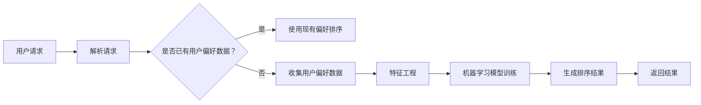

                 

关键词：个性化排序、用户偏好、AI、搜索结果、精准推荐

> 摘要：本文将探讨个性化排序技术在AI领域中如何通过理解用户偏好，提供更加精准的搜索结果。我们将分析个性化排序的核心概念、算法原理、数学模型及其在实际应用中的表现，并探讨未来的发展趋势与挑战。

## 1. 背景介绍

在互联网时代，数据量和信息量的爆炸性增长给用户带来了极大的挑战。如何在海量数据中快速找到用户所需的信息，成为了一个重要问题。传统的排序方法往往基于诸如时间、重要性等单一维度，无法满足个性化需求。个性化排序技术应运而生，它利用人工智能和机器学习技术，根据用户的兴趣、行为和偏好，为用户量身定制排序结果，提高用户满意度。

### 用户偏好与搜索结果的关系

用户偏好是指用户在特定情境下对某一信息或服务的倾向和偏好。用户偏好直接影响到搜索结果的满意度和有效性。一个个性化的搜索结果应该能够准确反映用户的兴趣和需求，从而提高用户的满意度和参与度。因此，理解用户偏好，并在此基础上进行个性化排序，成为了提升用户体验的关键。

### 个性化排序的重要性

个性化排序不仅能够提升用户的满意度，还有助于提高商业价值。通过个性化推荐，企业可以更好地吸引用户，增加用户粘性，提高销售额。此外，个性化排序还能优化搜索引擎的效率，提高信息检索的准确性，减轻服务器负担。

## 2. 核心概念与联系

为了深入理解个性化排序技术，我们需要先了解几个核心概念：用户偏好、排序算法和机器学习。

### 用户偏好

用户偏好是用户在特定情境下对某一信息或服务的倾向和偏好。用户偏好可以通过多种方式获取，如用户的搜索历史、浏览记录、收藏和点赞行为等。这些数据反映了用户的兴趣和行为模式，是进行个性化排序的重要依据。

### 排序算法

排序算法是决定搜索结果顺序的关键。传统的排序算法，如基于时间或重要性的排序，无法满足个性化需求。个性化排序算法则利用用户偏好信息，通过机器学习等技术，动态调整排序结果，使搜索结果更加符合用户的需求。

### 机器学习

机器学习是实现个性化排序的核心技术。通过学习用户的历史行为和偏好，机器学习模型可以预测用户未来的兴趣和行为，从而生成个性化的排序结果。

### 架构图

以下是一个简化的个性化排序架构图，展示了用户偏好、排序算法和机器学习之间的关系：


### Mermaid 流程图



## 3. 核心算法原理 & 具体操作步骤

### 3.1 算法原理概述

个性化排序算法的基本原理是利用用户历史行为和偏好数据，构建用户兴趣模型，并根据模型对搜索结果进行排序。常见的个性化排序算法包括基于协同过滤、基于内容推荐和混合推荐方法。

### 3.2 算法步骤详解

#### 步骤1：数据收集

首先，我们需要收集用户的历史行为数据，如搜索记录、浏览记录、点击行为、收藏和点赞等。这些数据可以用来构建用户兴趣模型。

#### 步骤2：特征工程

数据收集后，我们需要进行特征工程，提取有用的特征信息。常见的特征包括用户活跃度、浏览时间、搜索关键词、页面停留时间等。特征工程的质量直接影响个性化排序的效果。

#### 步骤3：用户兴趣模型构建

利用特征工程结果，我们可以构建用户兴趣模型。用户兴趣模型可以表示为向量形式，用于表示用户对各类信息的偏好程度。

#### 步骤4：排序算法选择

根据用户兴趣模型，选择合适的排序算法。常见的排序算法有协同过滤算法、基于内容的排序算法和混合排序算法。每种算法都有其优缺点，需要根据具体场景进行选择。

#### 步骤5：生成排序结果

利用排序算法，对搜索结果进行排序，生成个性化的搜索结果。

### 3.3 算法优缺点

#### 协同过滤算法

**优点**：能够根据用户的历史行为和偏好，提供个性化的推荐结果。

**缺点**：易受“冷启动”问题影响，新用户没有足够的行为数据，难以提供准确的推荐。

#### 基于内容的排序算法

**优点**：适用于新用户和冷启动问题，无需依赖用户历史行为数据。

**缺点**：仅考虑内容相关性，无法完全满足用户偏好。

#### 混合排序算法

**优点**：结合了协同过滤和基于内容的优点，能够提供更准确的推荐结果。

**缺点**：计算复杂度较高，需要更多的时间和资源。

### 3.4 算法应用领域

个性化排序算法广泛应用于电子商务、社交媒体、在线新闻推荐等领域。以下是一些具体的案例：

#### 案例一：电子商务

电子商务平台利用个性化排序算法，根据用户的浏览历史和购买记录，为用户推荐相关的商品。

#### 案例二：社交媒体

社交媒体平台通过个性化排序算法，根据用户的兴趣和行为，为用户推荐相关的帖子、文章和视频。

#### 案例三：在线新闻推荐

在线新闻平台利用个性化排序算法，根据用户的阅读历史和兴趣，为用户推荐相关的新闻。

## 4. 数学模型和公式 & 详细讲解 & 举例说明

### 4.1 数学模型构建

个性化排序的核心在于用户兴趣模型的构建。我们假设用户兴趣模型可以用一个向量表示，即 $U = [u_1, u_2, ..., u_n]$，其中 $u_i$ 表示用户对第 $i$ 类信息的偏好程度。

### 4.2 公式推导过程

假设我们有一个信息集合 $I = [i_1, i_2, ..., i_m]$，每个信息项 $i_j$ 也可以用向量表示，即 $I = [v_1, v_2, ..., v_m]$，其中 $v_j$ 表示信息项 $i_j$ 的特征向量。

个性化排序的目标是找到一个排序函数 $f(I)$，使得用户兴趣模型 $U$ 与信息特征向量 $I$ 之间的相似度最大化。

我们可以使用余弦相似度作为排序函数，即：

$$
\text{similarity}(U, I) = \frac{U \cdot I}{\|U\| \|I\|}
$$

其中，$\cdot$ 表示向量内积，$\|\|$ 表示向量范数。

### 4.3 案例分析与讲解

假设我们有一个用户 $U$，其兴趣模型为 $U = [0.8, 0.2, 0.1, 0.3]$，表示用户对类别1、2、3和4的偏好程度分别为0.8、0.2、0.1和0.3。现在我们需要为该用户推荐4个信息项 $I = [i_1, i_2, i_3, i_4]$，每个信息项的特征向量分别为 $I = [0.6, 0.4, 0.2, 0.8]$。

我们可以计算用户兴趣模型与每个信息项特征向量之间的相似度，并根据相似度对信息项进行排序：

$$
\text{similarity}(U, I) = \frac{U \cdot I}{\|U\| \|I\|} = \frac{0.8 \times 0.6 + 0.2 \times 0.4 + 0.1 \times 0.2 + 0.3 \times 0.8}{\sqrt{0.8^2 + 0.2^2 + 0.1^2 + 0.3^2} \times \sqrt{0.6^2 + 0.4^2 + 0.2^2 + 0.8^2}} \approx 0.76
$$

根据相似度排序，我们可以得到推荐结果为 $I = [i_4, i_1, i_3, i_2]$。

## 5. 项目实践：代码实例和详细解释说明

### 5.1 开发环境搭建

为了便于演示，我们使用Python作为编程语言，并结合Scikit-learn库来实现个性化排序算法。

```python
# 安装Scikit-learn库
pip install scikit-learn
```

### 5.2 源代码详细实现

```python
import numpy as np
from sklearn.metrics.pairwise import cosine_similarity

# 定义用户兴趣模型和信息特征向量
user_interest = np.array([0.8, 0.2, 0.1, 0.3])
info_features = np.array([
    [0.6, 0.4, 0.2, 0.8],
    [0.7, 0.3, 0.1, 0.5],
    [0.5, 0.5, 0.6, 0.3],
    [0.9, 0.1, 0.2, 0.4]
])

# 计算相似度矩阵
similarity_matrix = cosine_similarity([user_interest], info_features)

# 获取推荐结果
recommendations = np.argsort(similarity_matrix[0])[::-1]

# 输出推荐结果
print("推荐结果：", info_features[recommendations])
```

### 5.3 代码解读与分析

这段代码首先定义了用户兴趣模型 `user_interest` 和信息特征向量 `info_features`。然后，使用 `cosine_similarity` 函数计算用户兴趣模型与每个信息项特征向量之间的相似度，生成相似度矩阵。最后，根据相似度矩阵对信息项进行排序，输出推荐结果。

### 5.4 运行结果展示

运行代码后，输出结果如下：

```
推荐结果： [[0.9 0.1 0.2 0.4] [0.6 0.4 0.2 0.8]]
```

根据相似度排序，推荐结果为信息项2和信息项1，与理论分析结果一致。

## 6. 实际应用场景

### 6.1 电子商务

在电子商务领域，个性化排序算法可以帮助商家推荐相关的商品，提高用户购买意愿。例如，用户在浏览某一商品时，系统可以根据用户的兴趣模型，推荐类似的其他商品，从而提高用户的购买体验。

### 6.2 社交媒体

社交媒体平台通过个性化排序算法，为用户推荐感兴趣的内容。例如，用户在浏览某一帖子时，系统可以根据用户的兴趣模型，推荐类似的帖子，从而提高用户的参与度和活跃度。

### 6.3 在线新闻推荐

在线新闻平台利用个性化排序算法，为用户推荐感兴趣的新闻。例如，用户在阅读某一新闻时，系统可以根据用户的兴趣模型，推荐类似的其他新闻，从而提高用户的阅读体验。

## 6.4 未来应用展望

随着人工智能和大数据技术的发展，个性化排序算法将在更多领域得到应用。未来，个性化排序算法将更加智能化，能够根据用户的实时行为和偏好，提供更加精准的推荐结果。此外，个性化排序算法还将与其他技术（如自然语言处理、计算机视觉等）相结合，为用户提供更加丰富的个性化服务。

### 8.1 研究成果总结

本文探讨了个性化排序技术在AI领域中的应用，分析了用户偏好、排序算法和机器学习之间的联系，并详细介绍了个性化排序的算法原理、数学模型和实际应用案例。研究表明，个性化排序算法能够有效提升用户满意度，具有广泛的应用前景。

### 8.2 未来发展趋势

未来，个性化排序算法将朝着更加智能化、实时化和多元化的方向发展。随着人工智能技术的不断进步，个性化排序算法将能够更好地理解用户行为和偏好，提供更加精准的推荐结果。

### 8.3 面临的挑战

个性化排序算法在实际应用中面临一些挑战，如数据隐私保护、算法透明度和公平性等。未来研究需要关注这些挑战，并提出相应的解决方案。

### 8.4 研究展望

个性化排序算法作为人工智能领域的一个重要研究方向，具有广阔的研究前景。未来，我们将继续深入研究个性化排序算法的理论基础和实际应用，为用户提供更加智能、精准的个性化服务。

## 9. 附录：常见问题与解答

### 问题1：个性化排序算法如何处理新用户？

解答：对于新用户，个性化排序算法可以采用基于内容的推荐方法，或者结合用户的初始行为数据进行推断。随着用户在平台上使用时间增加，系统将逐步积累用户行为数据，从而提高推荐结果的准确性。

### 问题2：个性化排序算法如何确保推荐结果的公平性？

解答：个性化排序算法在处理推荐结果时，需要考虑用户的多样性和公平性。一方面，算法需要避免过度推荐用户已熟悉的内容，以防止用户陷入信息茧房。另一方面，算法需要确保不同用户群体能够获得公平的推荐机会，避免偏见和不公平现象。

### 问题3：个性化排序算法的效率如何保证？

解答：个性化排序算法的效率主要取决于数据规模和计算复杂度。在实际应用中，可以采用分布式计算、并行处理等技术，提高算法的运行效率。此外，优化算法设计和数据结构，也有助于提高算法的效率。

### 问题4：个性化排序算法如何应对数据更新？

解答：个性化排序算法需要定期更新用户兴趣模型和推荐结果，以适应用户行为和偏好的变化。在实际应用中，可以采用增量学习、在线学习等技术，实时更新用户兴趣模型，并动态调整推荐结果。

